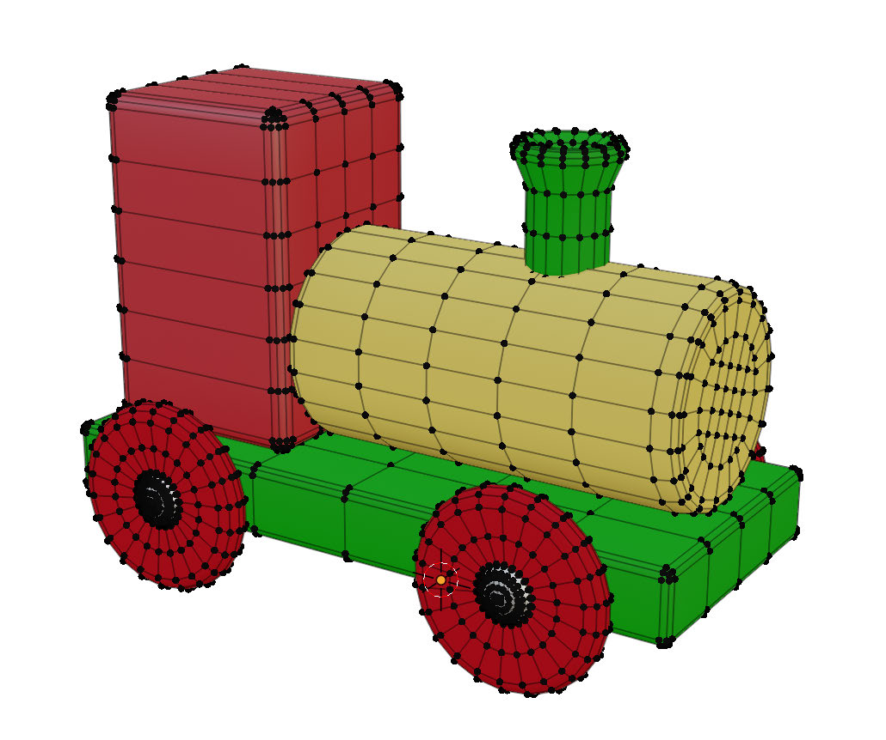
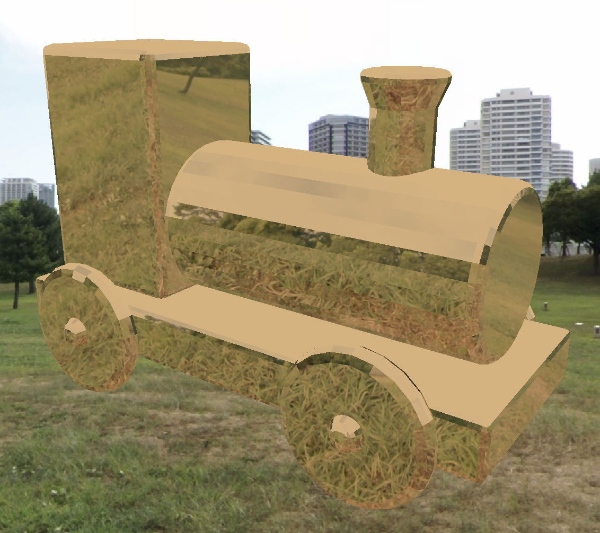
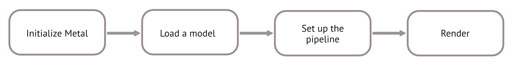
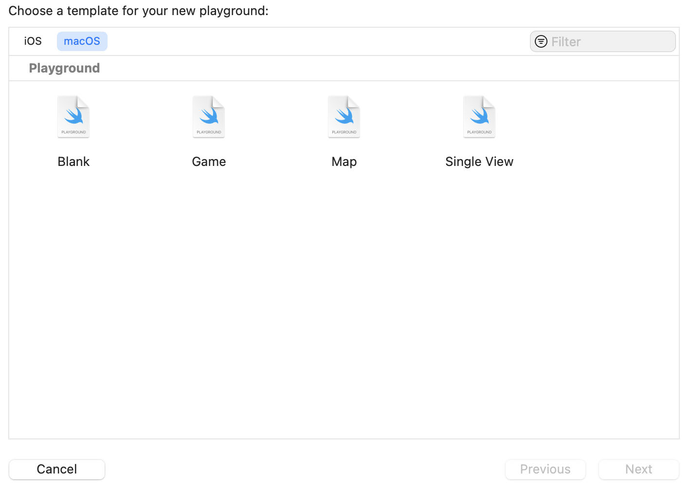
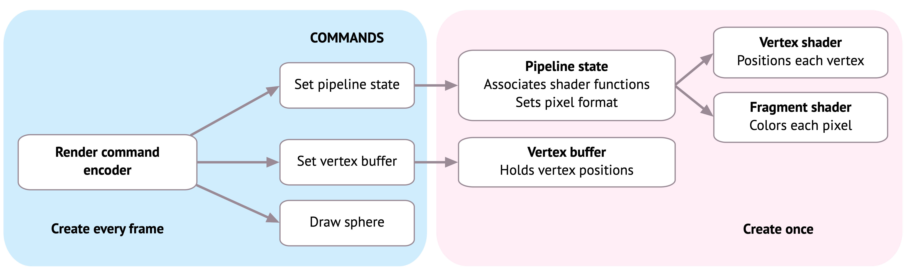
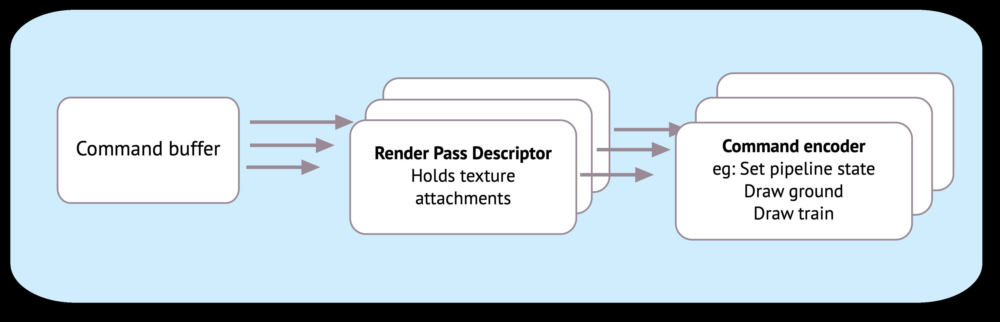
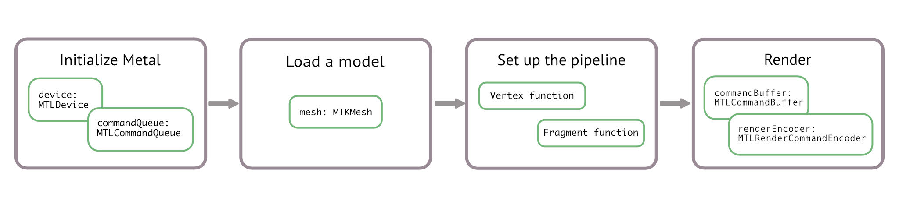

# Hello, Metal!

You’ve been formally introduced to Metal and discovered its history and why you 
should use it. Now you’re going to to try it out for yourself in a Swift playground. To 
get started, you’ll render this sphere on the screen:

The final result

It may not look exciting, but this is a great starting point because the exercise 
touches on almost every part of the rendering process. But before you get started, it’s 
important to understand the terms rendering and frames.

30

Metal by Tutorials
Chapter 1: Hello, Metal!

What is Rendering?

In 3D computer graphics, you take a bunch of points, join them together and create 
an image on the screen. This image is known as a render.

Rendering an image from points involves calculating light and shade for each pixel 
on the screen. Light bounces around a scene, so you have to decide how complicated 
your lighting is and how long each image takes to render. A single image in a Pixar 
movie might take days to render, but games require real-time rendering, where you 
see the image immediately.

There are many ways to render a 3D image, but most start with a model built in a 
modeling app such as Blender or Maya. Take, for example, this train model that was 
built in Blender:

A train model in Blender

This model, like all other models, is made up of vertices. A vertex refers to a point in 
three dimensional space where two or more lines, curves or edges of a geometrical 
shape meet, such as the corners of a cube.  The number of vertices in a model may 
vary from a handful, as in a cube, to thousands or even millions in more complex 
models.

31

Metal by Tutorials
Chapter 1: Hello, Metal!

A 3D renderer will read in these vertices using model loader code, which parses the 
list of vertices. The renderer then passes the vertices to the GPU, where shader 
functions process the vertices to create the final image or texture to be sent back to 
the CPU and displayed on the screen.

The following render uses the 3D train model and some different shading techniques 
to make it appear as if the train were made of shiny copper:

Shading techniques cause reflection

The entire process, from importing a model’s vertices to generating the final image 
on your screen, is commonly known as the rendering pipeline. The rendering pipeline 
is a list of commands sent to the GPU, along with resources (vertices, materials and 
lights) that make up the final image.

The pipeline includes programmable and non-programmable functions. The 
programmable parts of the pipeline, known as vertex functions and fragment 
functions, are where you can manually influence the final look of your rendered 
models. You’ll learn more about each later in the book.

32

Metal by Tutorials
Chapter 1: Hello, Metal!

What is a Frame?

A game wouldn’t be much fun if all it did was render a single still image. Moving a 
character around the screen in a fluid manner requires the GPU to render a still 
image roughly sixty times a second. Each still image is known as a frame, and the 
speed at which the images appear is known as the frame rate.

When your favorite game appears to stutter, it’s usually because of a decrease in the 
frame rate, especially if there’s an excessive amount of background processing eating 
away at the GPU. When designing a game, it’s important to balance the result you 
want with what the hardware can deliver.

While it might be cool to add real-time shadows, water reflections and millions of 
blades of animated grass — all of which you’ll learn how to do in this book — finding 
the right balance between what is possible and what the GPU can process in 1/60th 
of a second can be tough.

Your First Metal App

In your first Metal app, the shape you’ll render will look more like a flat circle than a 
3D sphere. That’s because your first model will not include any perspective or 
shading. However, its vertex mesh contains the full three-dimensional information.

The process of Metal rendering is much the same no matter the size and complexity 
of your app, and you’ll become very familiar with the following sequence of drawing 
your models on the screen:

You may initially feel a little overwhelmed by the number of steps Metal requires, 
but don’t worry. You’ll always perform these steps in the same sequence, and they’ll 
gradually become second nature.

This chapter won’t go into detail on every step, but as you progress through the 
book, you’ll get more information as you need it. For now, concentrate on getting 
your first Metal app running.

33

Metal by Tutorials
Chapter 1: Hello, Metal!

Getting Started

➤ Start Xcode, and create a new playground by selecting File ▸ New ▸ Playground… 
from the main menu. When prompted for a template, choose macOS Blank.

The playground template

➤ Name the playground Chapter1, and click Create.

➤ Next, delete everything in the playground.

The Metal View

Now that you have a playground, you’ll create a view to render into.

➤ Import the two main frameworks that you’ll be using by adding this:

import PlaygroundSupport 
import MetalKit

PlaygroundSupport lets you see live views in the assistant editor, and MetalKit is a 
framework that makes using Metal easier. MetalKit has a customized view named 
MTKView and many convenience methods for loading textures, working with Metal 
buffers and interfacing with another useful framework: Model I/O, which you’ll 
learn about later.

34

Metal by Tutorials
Chapter 1: Hello, Metal!

➤ Now, add this:

guard let device = MTLCreateSystemDefaultDevice() else { 
  fatalError("GPU is not supported") 
}

This code checks for a suitable GPU by creating a device:

Note: Are you getting an error? If you accidentally created an iOS playground 
instead of a macOS playground, you’ll get a fatal error because the iOS 
simulator is not supported on some devices.

➤ To set up the view, add this:

let frame = CGRect(x: 0, y: 0, width: 600, height: 600) 
let view = MTKView(frame: frame, device: device) 
view.clearColor 
  = MTLClearColor(red: 1, green: 1, blue: 0.8, alpha: 1)

This code configures an MTKView for the Metal renderer. MTKView is a subclass of 
NSView on macOS and of UIView on iOS. MTLClearColor represents an RGBA value 
— in this case, cream. The color value is stored in clearColor and is used to set the 
color of the view.

The Model

Model I/O is a framework that integrates with Metal and SceneKit. Its main purpose 
is to load 3D models that were created in apps like Blender or Maya, and to set up 
data buffers for easier rendering.

Instead of loading a 3D model, you’ll load a Model I/O basic 3D shape, also called a 
primitive. A 3D primitive is typically a cube, a sphere, a cylinder or a torus.

➤ Add this code to the end of the playground:

// 1 
let allocator = MTKMeshBufferAllocator(device: device) 
// 2 
let mdlMesh = MDLMesh( 
  sphereWithExtent: [0.75, 0.75, 0.75], 
  segments: [100, 100], 
  inwardNormals: false, 
  geometryType: .triangles, 
  allocator: allocator)

35

Metal by Tutorials
Chapter 1: Hello, Metal!

// 3 
let mesh = try MTKMesh(mesh: mdlMesh, device: device)

Going through the code:

1. The allocator manages the memory for the mesh data.

2. Model I/O creates a sphere with the specified size and returns an MDLMesh with 
all the vertex information in data buffers.

3. For Metal to be able to use the mesh, you convert it from a Model I/O mesh to a 
MetalKit mesh.

Queues, Buffers and Encoders

Each frame consists of commands that you send to the GPU. You wrap up these 
commands in a render command encoder. Command buffers organize these 
command encoders and a command queue organizes the command buffers.

➤ Add this code to create a command queue:

guard let commandQueue = device.makeCommandQueue() else { 
  fatalError("Could not create a command queue") 
}

You should set up the device and the command queue at the start of your app, and 
generally, you should use the same device and command queue throughout.

Each render pass must complete as quickly as possible, so you’ll pre-load objects at 
the start of your app. You’ll load models into buffers, generate shader functions and 
create pipeline state objects.

36

Metal by Tutorials
Chapter 1: Hello, Metal!

On each frame, you’ll create a command buffer and at least one render command 
encoder that describes the render pass. The render command encoder is a 
lightweight object that sets the GPU’s pipeline state and tells the GPU which buffers 
to use during the render pass.

Shader Functions

Shader functions are small programs that run on the GPU. You write these programs 
in the Metal Shading Language, which is a subset of C++. Normally, you’d create a 
separate file with a .metal extension specifically for shader functions but for now, 
create a multi-line string containing the shader function code, and add it to your 
playground:

let shader = """ 
#include <metal_stdlib> 
using namespace metal; 
 
struct VertexIn { 
  float4 position [[attribute(0)]]; 
}; 
 
vertex float4 vertex_main(const VertexIn vertex_in [[stage_in]]) 
{ 
  return vertex_in.position; 
} 
 
fragment float4 fragment_main() { 
  return float4(1, 0, 0, 1); 
} 
"""

37

Metal by Tutorials
Chapter 1: Hello, Metal!

There are two shader functions in here: a vertex function named vertex_main and a 
fragment function named fragment_main. The vertex function is where you usually 
manipulate vertex positions and the fragment function is where you specify the pixel 
color.

To set up a Metal library containing these two functions, add the following:

let library = try device.makeLibrary(source: shader, options: 
nil) 
let vertexFunction = library.makeFunction(name: "vertex_main") 
let fragmentFunction = library.makeFunction(name: 
"fragment_main")

The compiler will check that these functions exist and make them available to a 
pipeline descriptor.

The Pipeline State

In Metal, you set up a pipeline state for the GPU. By setting up this state, you’re 
telling the GPU that nothing will change until the state changes. With the GPU in a 
fixed state, it can run more efficiently. The pipeline state contains all sorts of 
information that the GPU needs, such as which pixel format it should use and 
whether it should render with depth. The pipeline state also holds the vertex and 
fragment functions that you just created.

However, you don’t create a pipeline state directly, rather you create it through a 
descriptor. This descriptor holds everything the pipeline needs to know, and you only 
change the necessary properties for your particular rendering situation.

➤ Add this code:

let pipelineDescriptor = MTLRenderPipelineDescriptor() 
pipelineDescriptor.colorAttachments[0].pixelFormat = .bgra8Unorm 
pipelineDescriptor.vertexFunction = vertexFunction 
pipelineDescriptor.fragmentFunction = fragmentFunction

Here, you specified the pixel format to be four 8-bit unsigned integers with color 
pixel order of blue/green/red/alpha. You also set the two shader functions.

38

Metal by Tutorials
Chapter 1: Hello, Metal!

You’ll describe to the GPU how the vertices are laid out in memory using a vertex 
descriptor. Model I/O automatically creates a vertex descriptor when it loads the 
sphere mesh, so you can just use that one.

➤ Add this code:

pipelineDescriptor.vertexDescriptor = 
  MTKMetalVertexDescriptorFromModelIO(mesh.vertexDescriptor)

You’ve now set up the pipeline descriptor with the necessary information. 
MTLRenderPipelineDescriptor has many other properties, but for now, you’ll use 
the defaults.

➤ Now, add this code:

let pipelineState = 
  try device.makeRenderPipelineState(descriptor: 
pipelineDescriptor)

This code creates the pipeline state from the descriptor. Creating a pipeline state 
takes valuable processing time, so all of the above should be a one-time setup. In a 
real app, you might create several pipeline states to call different shading functions 
or use different vertex layouts.

Rendering

From now on, the code should be performed every frame. MTKView has a delegate 
method that runs every frame, but as you’re doing a simple render which will simply 
fill out a static view, you don’t need to keep refreshing the screen every frame.

When performing graphics rendering, the GPU’s ultimate job is to output a single 
texture from a 3d scene. This texture is similar to the digital image created by a 
physical camera. The texture will be displayed on the device’s screen each frame.

Render Passes

If you’re trying to achieve a realistic render, you’ll want to take into account 
shadows, lighting and reflections. Each of these takes a lot of calculation and is 
generally done in separate render passes. For example, a shadow render pass will 
render the entire scene of 3D models, but only retain grayscale shadow information.

39

Metal by Tutorials
Chapter 1: Hello, Metal!

A second render pass would render the models in full color. You can then combine 
the shadow and color textures to produce the final output texture that will go to the 
screen.

For the first part of this book, you’ll use a single render pass. Later, you’ll learn about 
multipass rendering.

Conveniently, MTKView provides a render pass descriptor that will hold a texture 
called the drawable.

➤ Add this code to the end of the playground:

// 1 
guard let commandBuffer = commandQueue.makeCommandBuffer(), 
// 2 
  let renderPassDescriptor = view.currentRenderPassDescriptor, 
// 3 
  let renderEncoder = commandBuffer.makeRenderCommandEncoder( 
    descriptor: renderPassDescriptor)   
else { fatalError() }

Here’s what’s happening:

1. You create a command buffer. This stores all the commands that you’ll ask the 
GPU to run.

2. You obtain a reference to the view’s render pass descriptor. The descriptor holds 
data for the render destinations, known as attachments. Each attachment needs 
information, such as a texture to store to, and whether to keep the texture 
throughout the render pass. The render pass descriptor is used to create the 
render command encoder.

3. From the command buffer, you get a render command encoder using the render 
pass descriptor. The render command encoder holds all the information 
necessary to send to the GPU so that it can draw the vertices.

40

Metal by Tutorials
Chapter 1: Hello, Metal!

If the system fails to create a Metal object, such as the command buffer or render 
encoder, that’s a fatal error. The view’s currentRenderPassDescriptor may not be 
available in a particular frame, and usually you’ll just return from the rendering 
delegate method. Because you’re asking for it only once in this playground, you get a 
fatal error.

➤ Add the following code:

This code gives the render encoder the pipeline state that you set up earlier.

The sphere mesh that you loaded earlier holds a buffer containing a simple list of 
vertices.

➤ Give this buffer to the render encoder by adding the following code:

renderEncoder.setVertexBuffer( 
  mesh.vertexBuffers[0].buffer, offset: 0, index: 0)

The offset is the position in the buffer where the vertex information starts. The 
index is how the GPU vertex shader function locates this buffer.

Submeshes

The mesh is made up of submeshes. When artists create 3D models, they design 
them with different material groups. These translate to submeshes. For example, if 
you were rendering a car object, you might have a shiny car body and rubber tires. 
One material is shiny paint and another is rubber. On import, Model I/O creates 
two different submeshes that index to the correct vertices for that group. One vertex 
can be rendered multiple times by different submeshes. This sphere only has one 
submesh, so you’ll use only one.

➤ Add this code:

guard let submesh = mesh.submeshes.first else { 
  fatalError() 
}

Now for the exciting part: drawing! You draw in Metal with a draw call.

41

Metal by Tutorials
Chapter 1: Hello, Metal!

➤ Add this code:

renderEncoder.drawIndexedPrimitives( 
  type: .triangle, 
  indexCount: submesh.indexCount, 
  indexType: submesh.indexType, 
  indexBuffer: submesh.indexBuffer.buffer, 
  indexBufferOffset: 0)

Here, you instruct the GPU to render a vertex buffer consisting of triangles with the 
vertices placed in the correct order by the submesh index information. This code 
does not do the actual render — that doesn’t happen until the GPU has received all 
the command buffer’s commands.

➤ To complete sending commands to the render command encoder and finalize the 
frame, add this code:

// 1 
renderEncoder.endEncoding() 
// 2 
guard let drawable = view.currentDrawable else { 
  fatalError() 
} 
// 3 
commandBuffer.present(drawable) 
commandBuffer.commit()

Going through the code:

1. You tell the render encoder there are no more draw calls and end the render pass.

2. You get the drawable from the MTKView. The MTKView is backed by a Core 
Animation CAMetalLayer and the layer owns a drawable texture which Metal can 
read and write to.

3. You ask the command buffer to present the MTKView’s drawable and commit to 
the GPU.

➤ Finally, add this code to the end of the playground:

42

Metal by Tutorials
Chapter 1: Hello, Metal!

With that line of code, you’ll be able to see the Metal view in the Assistant editor.

➤ Run the playground, and in the playground’s live view, you’ll see a red sphere on a 
cream background.

Note: Sometimes playgrounds don’t compile or run when they should. If 
you’re sure you’ve written the code correctly, then restart Xcode and reload 
the playground. Wait for a second or two before running.

Congratulations! You’ve written your first Metal app, and you’ve also used many of 
the Metal API commands that you’ll use in every Metal app you write.

43

Metal by Tutorials
Chapter 1: Hello, Metal!

Challenge

Where you created the initial sphere mesh, experiment with setting the sphere to 
different sizes. For example, change the size from:

To:

Change the color of the sphere. In the shader function string, you’ll see:

This code returns red=1, green=0, blue=0, alpha=1, which results in the red 
color. Try changing the numbers (from zero to 1) for a different color. Try this green, 
for example:

In the next chapter, you’ll examine 3D models up close in Blender. Then continuing 
in your Swift Playground, you’ll import and render a train model.

44

Metal by Tutorials
Chapter 1: Hello, Metal!

Key Points

• Rendering means to create an image from three-dimensional points.

• A frame is an image that the GPU renders sixty times a second (optimally).

• device is a software abstraction for the hardware GPU.

• A 3D model consists of a vertex mesh with shading materials grouped in 
submeshes.

• Create a command queue at the start of your app. This action organizes the 
command buffer and command encoders that you’ll create every frame.

• Shader functions are programs that run on the GPU. You position vertices and 
color the pixels in these programs.

• The render pipeline state fixes the GPU into a particular state. It can set which 
shader functions the GPU should run and how vertex layouts are formatted.

Learning computer graphics is difficult. The Metal API is modern, and it takes a lot of 
pain out of the learning, but you need to know a lot of information up-front. Even if 
you feel overwhelmed at the moment, continue with the next chapters. Repetition 
will help with your understanding.

45

2