# 3D Models

Do you know what makes a good game even better? Gorgeous graphics!

Creating amazing graphics — like those in Divinity: Original Sin 2, Diablo 3 and The 
Witcher 3 — generally requires a skilled team of programmers and 3D artists. The 
graphics you see onscreen are created using 3D models that are rendered with 
custom renderers, similar to the one you wrote in the previous chapter, only more 
advanced. Nevertheless, the principle of rendering 3D models is still the same.

In this chapter, you’ll learn all about 3D models, including how to render them 
onscreen, and how to work with them in Blender.

46

Metal by Tutorials
Chapter 2: 3D Models

What Are 3D Models?

3D models are made up of vertices. Each vertex refers to a point in 3D space using x, 
y and z values.

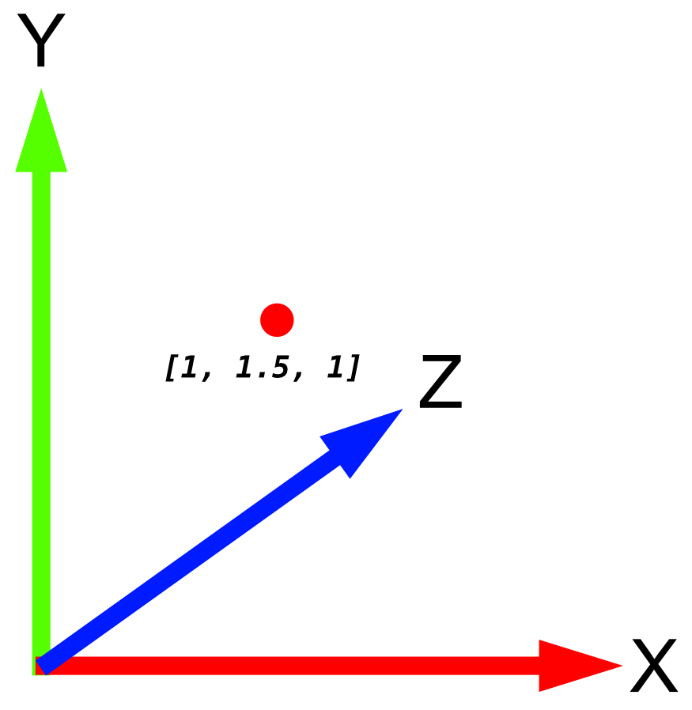

A vertex in 3D space.

As you saw in the previous chapter, you send these vertex points to the GPU for 
rendering. You need three vertices to create a triangle, and GPUs are able to render 
triangles efficiently. To show smaller details, a 3D model may also use textures. 
You’ll learn more about textures in Chapter 8, “Textures”.

➤ Open the starter playground for this chapter.

This playground contains two pages named Render and Export 3D Model and 
Import Train, as well as the train model in USDZ format. If you don’t see these 
items, you may need to hide/show the Project navigator using the icon at the top-
left.

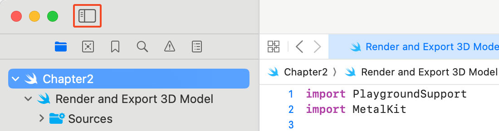

The Project Navigator

47

Metal by Tutorials
Chapter 2: 3D Models

To show the file extensions, open Xcode Settings, and on the General tab, choose 
File Extensions: Show All.

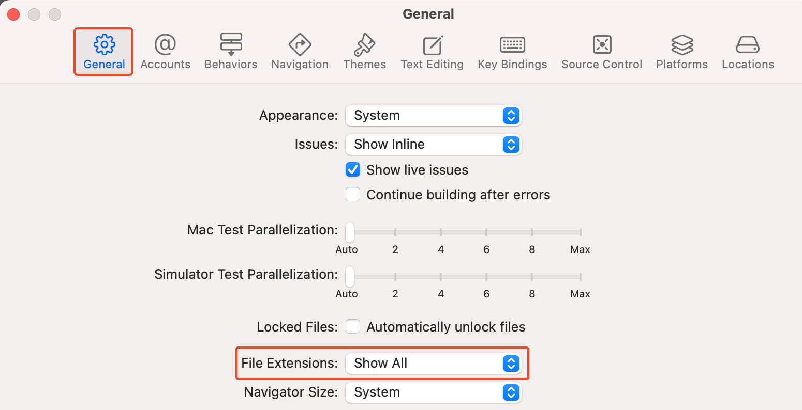

Show File Extensions

➤ From the Project navigator, select Render and Export 3D Model.

This page contains the final code from Chapter 1, “Hello, Metal!”.  Examine the 
rendered sphere in the playground’s live view. Notice how the sphere renders as a 
solid red shape and appears flat.

To see the edges of each individual triangle, you can render the model in wireframe.

➤ To render in wireframe, add the following code just after 
renderEncoder.setVertexBuffer(...):

This code tells the GPU to render lines instead of solid triangles.

48

Metal by Tutorials
Chapter 2: 3D Models

➤ Run the playground:

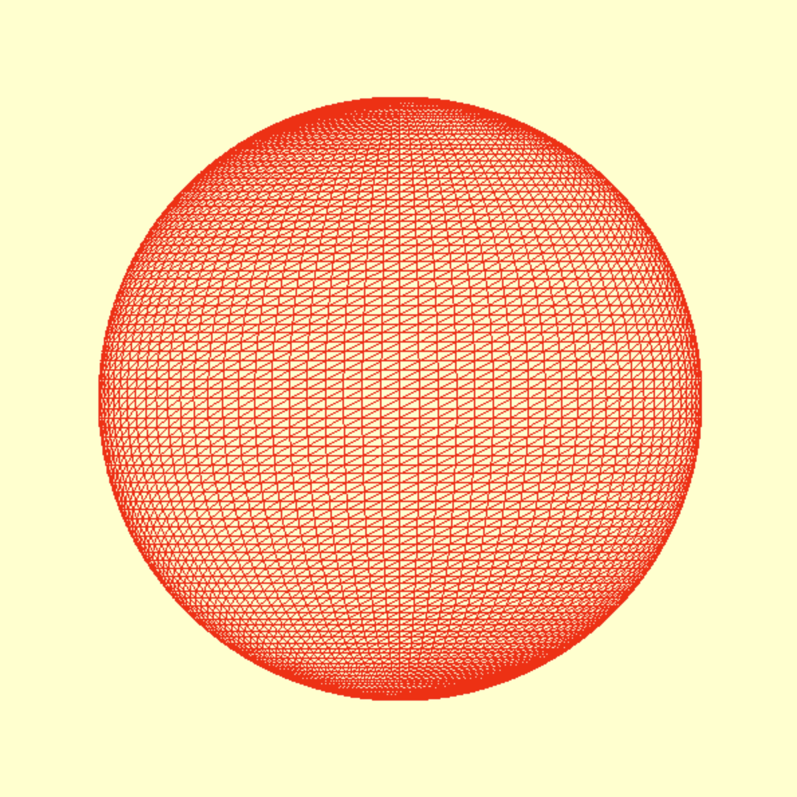

A sphere rendered in wireframe.

There’s a bit of an optical illusion happening here. It may not look like it, but the 
GPU is rendering straight lines. The reason the sphere edges look curved is because 
of the number of triangles the GPU is rendering. If you render fewer triangles, curved 
models tend to look “blocky”.

You can really see the 3D nature of the sphere now. The model’s triangles are evenly 
spaced horizontally, but because you’re viewing on a two dimensional screen, they 
appear smaller at the edges of the sphere than the triangles in the middle.

49

Metal by Tutorials
Chapter 2: 3D Models

In 3D apps such as Blender or Maya, you generally manipulate points, lines and 
faces. Points are the vertices; lines, also called edges, are the lines between the 
vertices; and faces are the triangular flat areas.

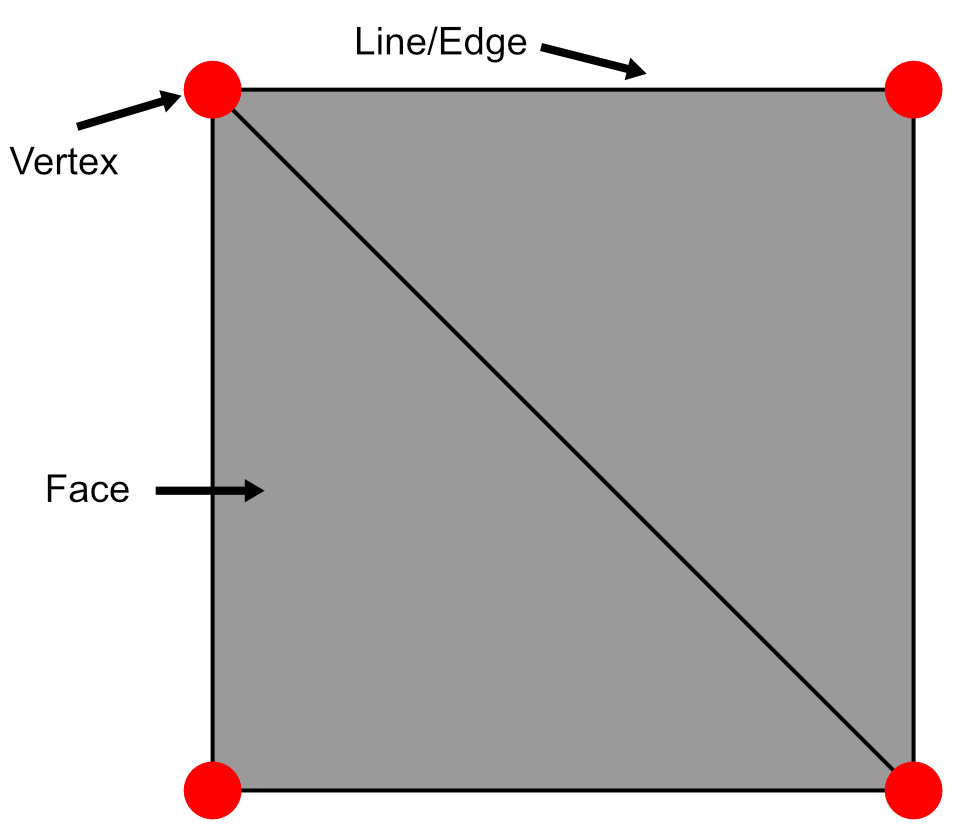

Vertex, line and face.

The vertices are generally ordered into triangles because GPU hardware is 
specialized to process them. The GPU’s core instructions are expecting to see a 
triangle. Of all possible shapes, why a triangle?

• A triangle has the least number of points of any polygon that can be drawn in two 
dimensions.

• No matter which way you move the points of a triangle, the three points will 
always be on the same plane.

• When you divide a triangle starting from any vertex, it always becomes two 
triangles.

When you’re modeling in a 3D app, you generally work with quads (four point 
polygons). Quads work well with subdivision or smoothing algorithms. When you 
import the model using the Model I/O framework, Model I/O converts these quads to 
triangles.

50

Metal by Tutorials
Chapter 2: 3D Models

Creating Models With Blender

To create 3D models, you need a 3D modeling app. These apps range from free to 
hugely expensive. The best of the free apps — and the one used throughout this book 
— is Blender (v. 3.6). A lot of professionals use Blender, but if you’re more familiar 
with another 3D app, such as Cheetah3D, Maya or Houdini, then you’re welcome to 
use it since the concepts are the same.

➤ Download and install Blender from https://www.blender.org.

➤ Launch Blender. Click outside of the splash screen to close it, and you’ll see an 
interface similar to this one:

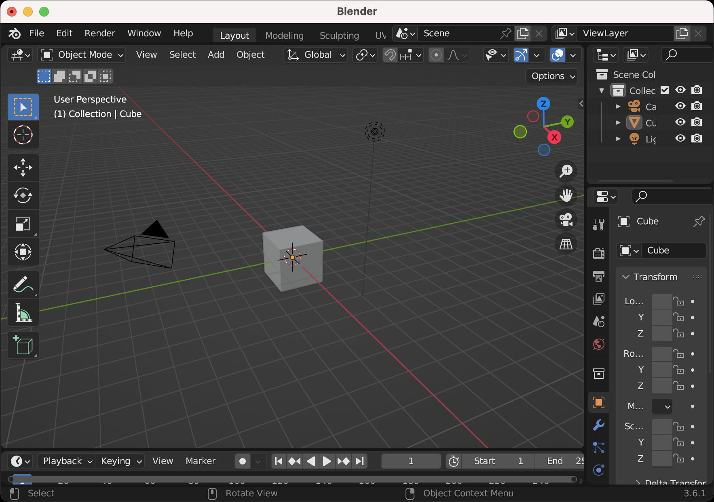

The Blender Interface.

Your interface may look different. However, if you want your Blender interface to 
look like the image shown here, choose Edit ▸ Preferences…. Click the hamburger 
menu at the bottom left, choose Load Factory Preferences, and then click the pop-
up Load Factory Preferences, which will appear under the cursor. Click Save 
Preferences to retain these preferences for future sessions.

51

Metal by Tutorials
Chapter 2: 3D Models

Note: If you want to create your own models, the best place to start is with our 
Blender tutorial (https://bit.ly/3gwKiel). This tutorial teaches you how to make 
a mushroom. You can then render your mushroom in your playground at the 
end of this chapter.

A mushroom modeled in Blender.

3D File Formats

There are several standard 3D file formats. Here’s an overview of what each one 
offers:

• OBJ: This format, developed by Wavefront Technologies, has been around for a 
long time, and almost every 3D app supports importing and exporting OBJ files 
with the .obj extension. You can specify materials (textures and surface 
properties) using an accompanying .mtl file, however, this format does not support 
animation.

• glTF: The GL Transmission Format was developed by Khronos, who oversee 
Vulkan and OpenGL. This format is relatively new and is still under active 
development. It has strong community support because of its flexibility. It 
supports animated models.

• .blend: This is the native Blender file format.

52

Metal by Tutorials
Chapter 2: 3D Models

• .fbx: A proprietary format owned by Autodesk. This is a commonly used format 
that supports animation but is losing favor because it’s proprietary and doesn’t 
have a single standard.

• USD: Universal Scene Description is a scalable open source format introduced by 
Pixar, with full documentation at https://openusd.org. A USD file can reference 
many models and files, so each person on a team can work on a separate part of 
the scene. A USD file can have several different extensions. .usd can be either 
ASCII or binary. .usda is human-readable ASCII. .usdz is a USD archive file that 
contains everything needed for the model or scene. Apple uses the USDZ format 
for their AR models.

An OBJ file contains only a single model, whereas glTF and USD files are containers 
for entire scenes, complete with models, animation, cameras and lights.

In this book, you’ll mainly use the USD format.

Note: You can use Apple’s Reality Converter to convert 3D files to USDZ. 
Apple also provides tools for validating and inspecting USDZ files (https://
apple.co/3gykNcI), as well as a gallery of sample USDZ files (https://apple.co/
3iJzMBW).

Exporting to Blender

Now that you have Blender all set up, it’s time to export a model from your 
playground into Blender.

➤ Still in Render and Export 3D Model, near the top of the playground where you 
create the mesh, change:

let mdlMesh = MDLMesh( 
  sphereWithExtent: [0.75, 0.75, 0.75], 
  segments: [100, 100], 
  inwardNormals: false, 
  geometryType: .triangles, 
  allocator: allocator)

To:

let mdlMesh = MDLMesh( 
  coneWithExtent: [1, 1, 1], 
  segments: [10, 10],

53

Metal by Tutorials
Chapter 2: 3D Models

inwardNormals: false, 
  cap: true, 
  geometryType: .triangles, 
  allocator: allocator)

This code will generate a primitive cone mesh in place of the sphere. Run the 
playground, and you’ll see the wireframe cone.

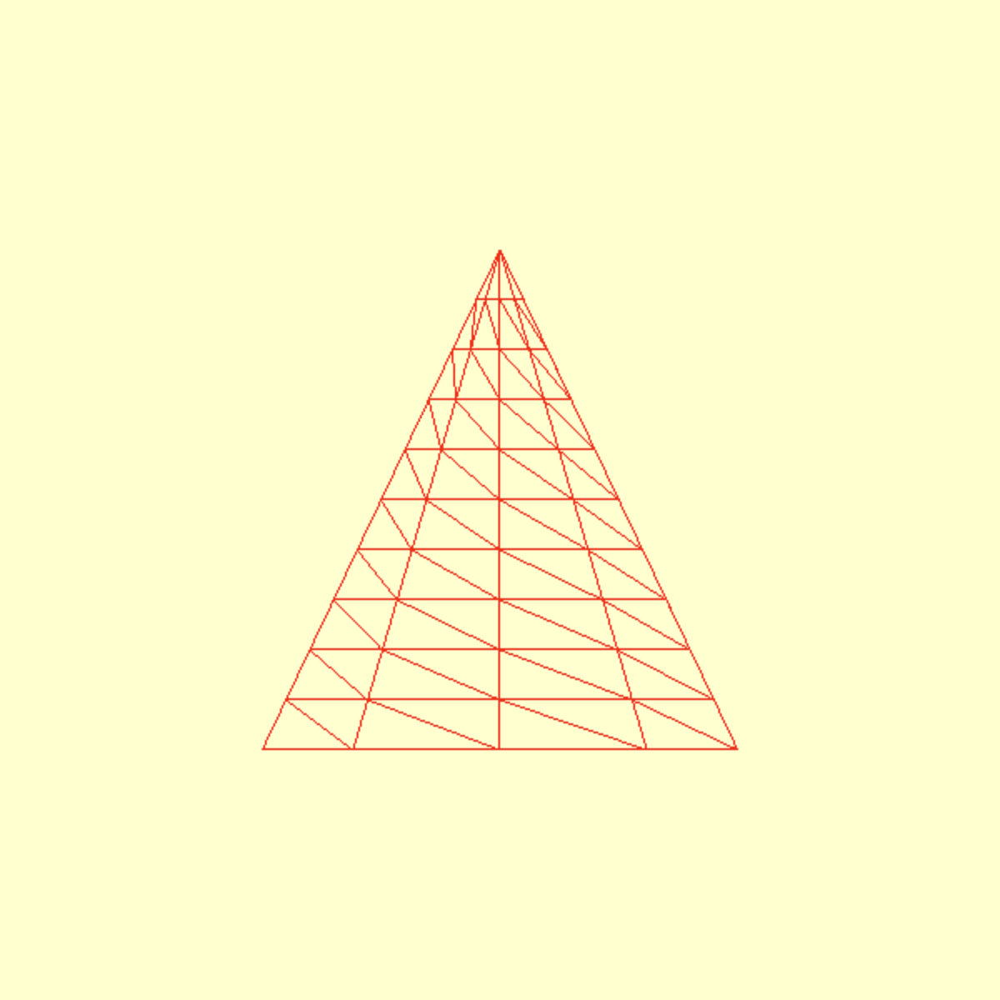

A cone model.

This is the model you’ll export using Model I/O.

➤ Open Finder, and in the Documents folder, create a new directory named Shared 
Playground Data. All your saved files from the Playground will end up here, so 
make sure you name it correctly.

Note: The global constant playgroundSharedDataDirectory holds this 
folder name.

➤ To export the cone, add this code just after creating the mesh:

// begin export code 
// 1 
let asset = MDLAsset() 
asset.add(mdlMesh) 
// 2 
let fileExtension = "usda" 
guard MDLAsset.canExportFileExtension(fileExtension) else { 
  fatalError("Can't export a .\(fileExtension) format") 
}

54

Metal by Tutorials
Chapter 2: 3D Models

// 3 
do { 
  let url = playgroundSharedDataDirectory 
    .appendingPathComponent("primitive.\(fileExtension)") 
  try asset.export(to: url) 
} catch { 
  fatalError("Error \(error.localizedDescription)") 
} 
// end export code

Let’s have a closer look at the code:

1. The top level of a scene in Model I/O is an MDLAsset. You can build a complete 
scene hierarchy by adding child objects such as meshes, cameras and lights to the 
asset.

2. Check that Model I/O can export a .usda file type. You would generally 
choose .usd or .usdz, but choosing the ASCII text format here will allow you 
examine the contents of the file.

3. Export the cone to the directory stored in Shared Playground Data.

➤ Run the playground to export the cone object.

Note: If your playground crashes, it’s probably because you haven’t created 
the Shared Playground Data directory in Documents.

The USD File Format

➤ In Finder, navigate to Documents ▸ Shared Playground Data.

Here, you’ll find the exported file, primitive.usda.

➤ Using a plain text editor, open primitive.usda.

The following is an example USD file that describes a plane primitive with four 
corner vertices. The cone USD file looks similar, except it has more vertex data.

#usda 1.0 
( 
    defaultPrim = "plane" 
    endTimeCode = 0 
    startTimeCode = 0 
    timeCodesPerSecond = 60

55

Metal by Tutorials
Chapter 2: 3D Models

upAxis = "Y" 
) 
 
def Mesh "plane" 
{ 
    uniform bool doubleSided = 0 
    float3[] extent = [(0, -0.5, -0.5), (0, 0.5, 0.5)] 
    int[] faceVertexCounts = [3, 3] 
    int[] faceVertexIndices = [3, 2, 1, 3, 1, 0] 
    normal3f[] normals = [(-1, 0, 0), (-1, 0, 0), (-1, 0, 0), 
(-1, 0, 0)] 
    point3f[] points = [(0, 0.5, 0.5), (0, -0.5, 0.5), (-0, 
-0.5, -0.5), (0, 0.5, -0.5)] 
    float2[] primvars:Texture_uv = [(1, 1), (0, 1), (0, 0), (1, 
0)] ( 
        interpolation = "vertex" 
    ) 
}

The file starts with describing the general features, such as animation timing and 
which way is up. The file then describes the mesh.

Here’s the breakdown of the plane USD:

• extent: the size of the mesh. When creating your cone, in coneWithExtent you 
specified 1 on all axes. The minimum vertex position value will be -0.5 and the 
maximum will be 0.5.

• faceVertexCounts: This plane consists of two triangles with three vertices each. 
Your cone will have many triangles.

• faceVertexIndices: This plane has four vertices, one at each corner. The index 
order is the order these vertices are rendered. To make up two triangles, you 
render six vertices.

• normals: The surface normals. A normal is a vector that points orthogonally — 
that’s directly outwards. You’ll read more about normals later.

• points: The position of each vertex. The plane has four vertices. Your cone will 
have many vertices.

• Texture_uv: A UV coordinate determines a vertex’s position on a 2D texture. 
Coordinates on textures are called uv coordinates rather than xy coordinates, but 
they work the same. Your cone doesn’t use these UV coordinates because you 
haven’t applied any custom textures to it.

56

Metal by Tutorials
Chapter 2: 3D Models

Importing the Cone

It’s time to import the cone into Blender.

➤ To start with a clean and empty Blender file:

1. Open Blender.

2. Choose File ▸ New ▸ General.

3. Left-click the cube that appears in the start-up file to select it.

4. Press X to delete the cube.

5. Left-click Delete in the menu under the cursor to confirm the deletion.

You now have a clear and ready-for-importing Blender file, so let’s get to it.

➤ Choose File ▸ Import ▸ Universal Scene Description (.usd*), and select 
primitive.usda from the Documents ▸ Shared Playground Data Playground 
directory.

The cone imports into Blender.

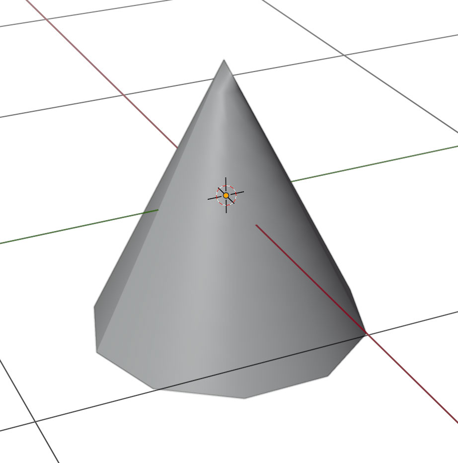

The cone in Blender.

57

Metal by Tutorials
Chapter 2: 3D Models

➤ Left-click the cone to select it, and press Tab to put Blender into Edit Mode. Edit 
Mode allows you to see the vertices and triangles that make up the cone. These 
match your wireframe render.

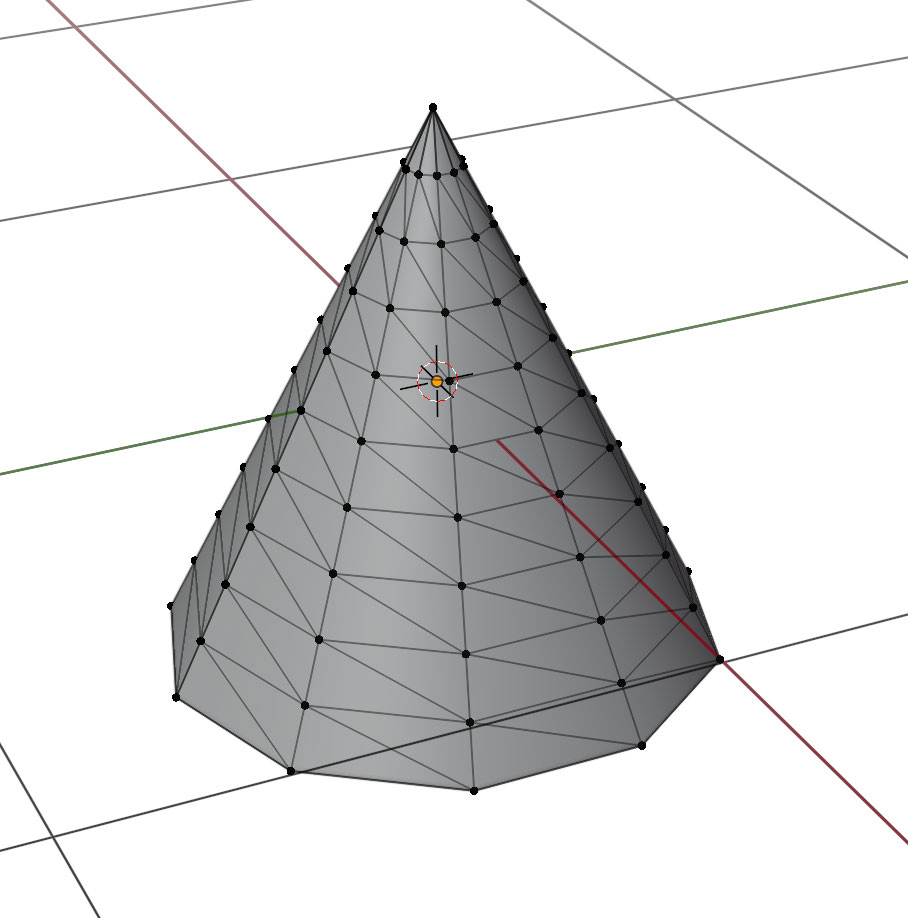

Edit mode

While you’re in Edit Mode, you can move the vertices around and add new vertices to 
create any 3D model you can imagine.

Note: In the resources directory for this chapter, there’s a file with links to 
some excellent Blender tutorials.

Using only a playground, you now have the ability to create, render and export a 
primitive. In the next part of this chapter, you’ll review and render a more complex 
model with separate material groups.

Materials

Materials describe how the 3D renderer should color a vertex. For example, should 
the vertex be smooth and shiny? Pink? Reflective?

58

Metal by Tutorials
Chapter 2: 3D Models

Material properties can include:

• diffuse: The basic color of the surface.

• metallic: Describes whether the surface is a metal.

• roughness: Describes how rough a surface is. If the surface has a roughness of 0, it 
is completely flat and shiny.

Material Groups

➤ In Blender, open train.blend, which you’ll find in the resources directory for this 
chapter.

This file is the original Blender file of the .usdz train in your playground.

➤ Left-click the model to select it, and press Tab to go into Edit Mode.

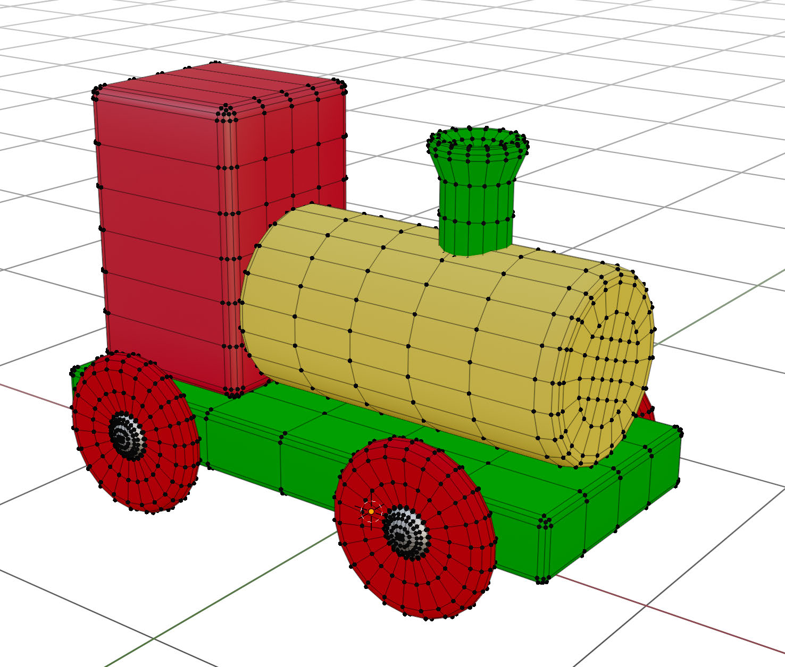

The train in edit mode.

Unlike the cone, which is plain gray, the train model has several colors. These colors 
are defined in material groups — one for each color. On the right-hand side of the 
Blender screen, you’ll see the Properties panel, with the Material context already 
selected (that’s the icon at the bottom of the vertical list of icons), and the list of 
materials within this model at the top.

➤ Select Body, and then click Select underneath the material list.

59

Metal by Tutorials
Chapter 2: 3D Models

The vertices assigned to this material are now colored orange.

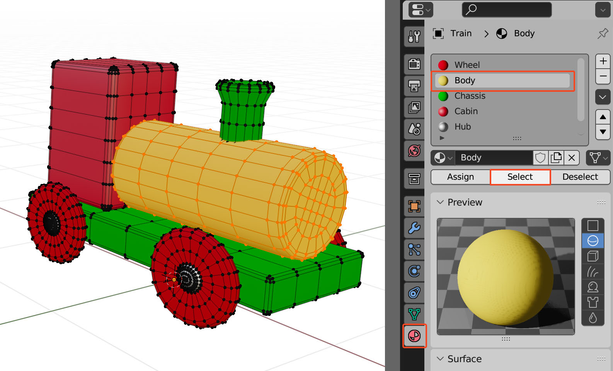

Material groups

Notice how the vertices are separated into different groups or materials. This 
separation makes it easier to select the various parts within Blender and also gives 
you the ability to assign different colors.

Note: When you render this model into your playground, the renderer will 
render each of the material groups, but your Metal shader will not render the 
correct colors. One way to verify a model’s appearance is to view it in Blender.

➤ Go back to Xcode, and from the Project navigator, open the Import Train 
playground page. This playground renders — but does not export — the wireframe 
cone.

➤ In the playground’s Resources folder, find and examine the train.usdz model. 
Drag on the window to move the view camera around the model.

Note: Files in the Playground Resources folder are available to all playground 
pages. Files in each page’s Resources folder are only available to that page.

60

Metal by Tutorials
Chapter 2: 3D Models

➤ In Import Train, remove the lines where you create the MDLMesh cone:

let mdlMesh = MDLMesh( 
  coneWithExtent: [1, 1, 1], 
  segments: [10, 10], 
  inwardNormals: false, 
  cap: true, 
  geometryType: .triangles, 
  allocator: allocator)

Don’t worry about that compile error. You’ve still got some work to do.

➤ Replacing the code you just removed, add this code in its place:

guard let assetURL = Bundle.main.url( 
  forResource: "train", 
  withExtension: "usdz") else { 
  fatalError() 
}

This code sets up the URL for the USD file.

Vertex Descriptors

Metal uses descriptors as a common pattern to create objects. You saw this pattern in 
the previous chapter when you set up a pipeline descriptor to describe a pipeline 
state. Before loading the model, you’ll tell Metal how to lay out the vertices and 
other data by creating a vertex descriptor.

The following diagram describes an incoming buffer of model vertex data. It has two 
vertices with position, normal and texture coordinate attributes. The vertex 
descriptor informs Metal how you want to view this data.

The vertex descriptor

61

Metal by Tutorials
Chapter 2: 3D Models

➤ Add this code below the code you just added:

// 1 
let vertexDescriptor = MTLVertexDescriptor() 
// 2 
vertexDescriptor.attributes[0].format = .float3 
// 3 
vertexDescriptor.attributes[0].offset = 0 
// 4 
vertexDescriptor.attributes[0].bufferIndex = 0

Looking closer:

1. You create a vertex descriptor that you’ll use to configure all of the properties 
that an object will need to know about.

Note: You can reuse this vertex descriptor with either the same values or 
reconfigured values to instantiate a different model object.

2. The USD file holds normal and texture coordinate data as well as vertex position 
data. For the moment, you don’t need the surface normals or texture coordinates; 
you only need the position. You tell the descriptor that the xyz position data 
should load as a float3, which is a simd data type consisting of three Float 
values. An MTLVertexDescriptor has an array of 31 attributes where you can 
configure the data format. In later chapters, you’ll load the normal and texture 
coordinate attributes.

3. The offset specifies where in the buffer this particular data will start.

4. When you send your vertex data to the GPU via the render encoder, you send it in 
an MTLBuffer and identify the buffer by an index. There are 31 buffers available 
and Metal keeps track of them in a buffer argument table. You use buffer 0 here 
so that the vertex shader function will be able to match the incoming vertex data 
in buffer 0 with this vertex layout.

62

Metal by Tutorials
Chapter 2: 3D Models

➤ Now add this code below the previous lines:

// 1 
vertexDescriptor.layouts[0].stride = 
  MemoryLayout<SIMD3<Float>>.stride 
// 2 
let meshDescriptor = 
  MTKModelIOVertexDescriptorFromMetal(vertexDescriptor) 
// 3 
(meshDescriptor.attributes[0] as! MDLVertexAttribute).name = 
  MDLVertexAttributePosition

Going through everything:

1. Here, you specify the stride for buffer 0. The stride is the number of bytes 
between each set of vertex information. Referring back to the previous diagram 
which described position, normal and texture coordinate information, the stride 
between each vertex would be float3 + float3 + float2. However, here you’re 
only loading position data, so to get to the next position, you jump by a stride of 
float3. The SIMD3<Float> type is Swift’s equivalent to float3. Later, you’ll use 
a typealias for float3.

Using the buffer layout index and stride format, you can set up complex vertex 
descriptors referencing multiple MTLBuffers with different layouts. You have the 
option of interleaving position, normal and texture coordinates; or you can lay out a 
buffer containing all of the position data first, followed by other data.

2. Model I/O needs a slightly different format vertex descriptor, so you create a new 
Model I/O descriptor from the Metal vertex descriptor. If you have a Model I/O 
descriptor and need a Metal one, MTKMetalVertexDescriptorFromModelIO() 
provides a solution.

3. Assign a string name “position” to the attribute. This tells Model I/O that this is 
positional data. The normal and texture coordinate data is also available, but 
with this vertex descriptor, you told Model I/O that you’re not interested in 
loading those attributes.

63

Metal by Tutorials
Chapter 2: 3D Models

➤ Continue by adding this code:

let asset = MDLAsset( 
  url: assetURL, 
  vertexDescriptor: meshDescriptor, 
  bufferAllocator: allocator) 
let mdlMesh = 
  asset.childObjects(of: MDLMesh.self).first as! MDLMesh

This code reads the asset using the URL, vertex descriptor and memory allocator. You 
then read in the first Model I/O mesh buffer in the asset. Some more complex objects 
will have multiple meshes, but you’ll deal with that later.

Now that you’ve loaded the model vertex information, the rest of the code will be the 
same, and your playground will load mesh from the new mdlMesh variable.

➤ Run the playground to see your train in wireframe.

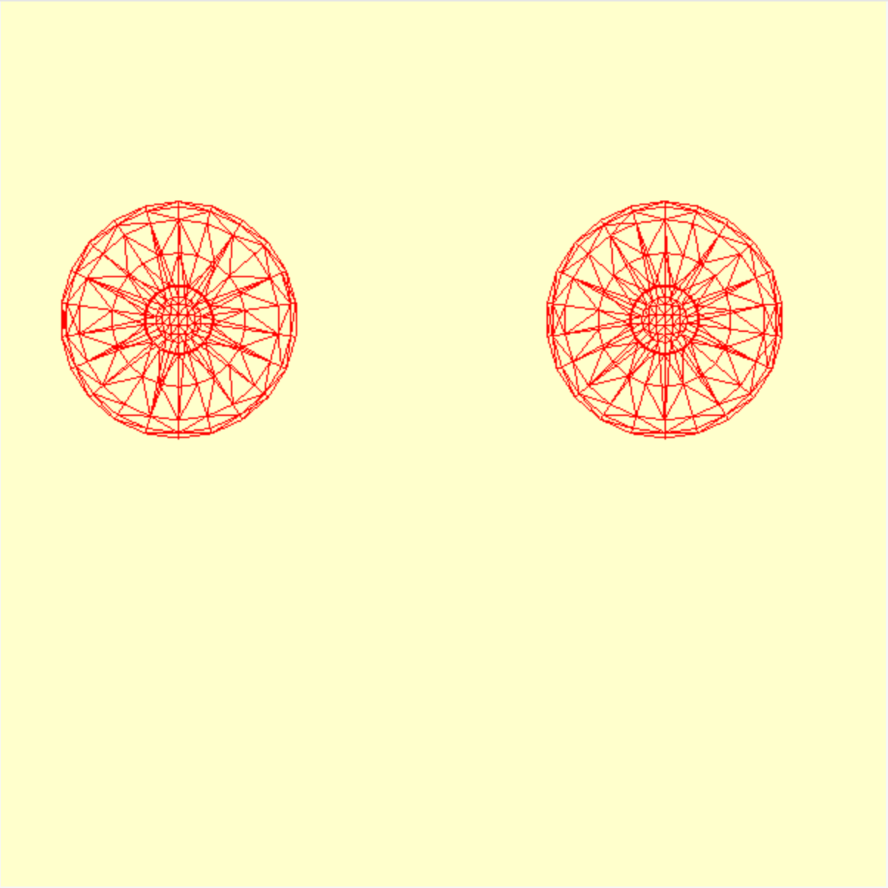

Train wireframe wheels

Well, that’s not good. The train wheels are way too high off the ground. Plus, the rest 
of the train is missing! Time to fix these problems, starting with the train’s wheels.

64

Metal by Tutorials
Chapter 2: 3D Models

Metal Coordinate System

All models have an origin. The origin is the location of the mesh. The train’s origin 
is at [0, 0, 0]. In Blender, this places the train right at the center of the scene.

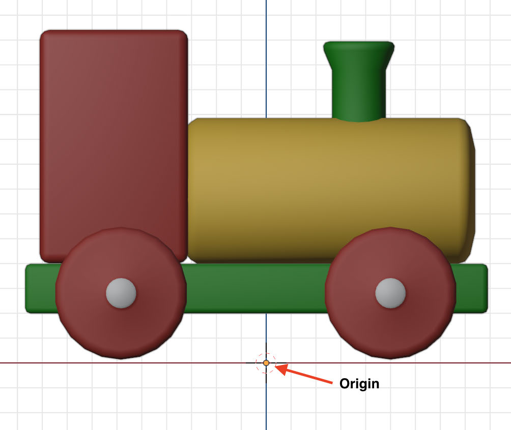

The origin

The Metal NDC (Normalized Device Coordinate) system is a 2-unit wide by 2-unit 
high by 1-unit deep box where X is right / left, Y is up / down and Z is in / out of the 
screen.

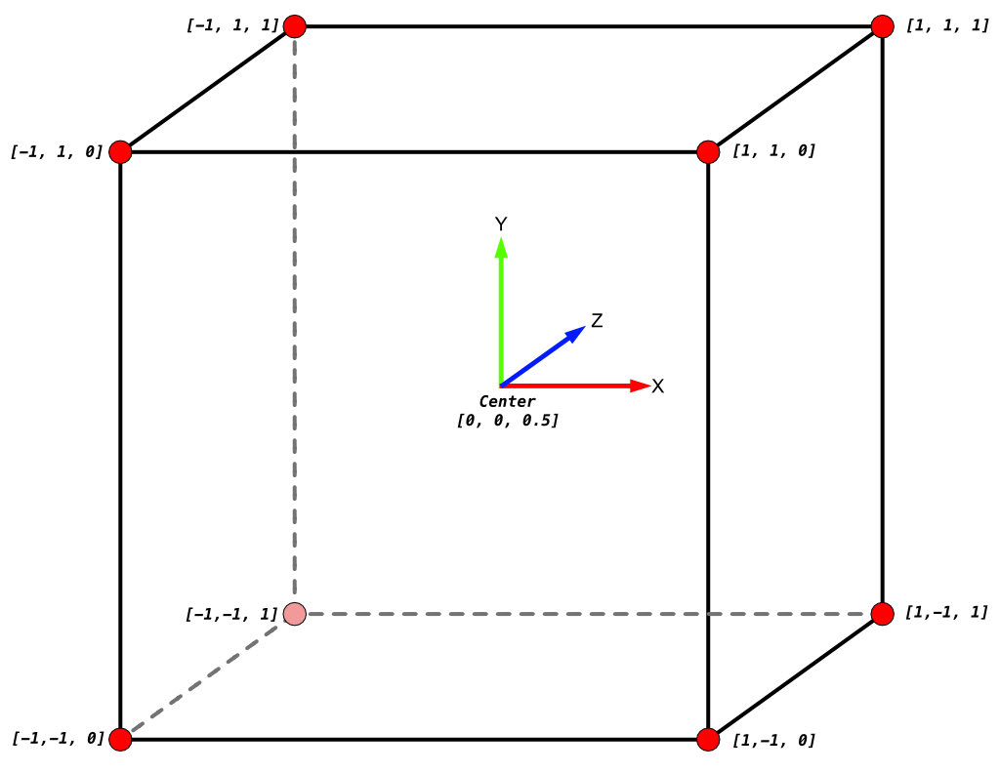

NDC (Normalized Device Coordinate) system

To normalize means to adjust to a standard scale. On a screen, you might address a

65

Metal by Tutorials
Chapter 2: 3D Models

location in screen coordinates of width 0 to 375, whereas the Metal normalized 
coordinate system doesn’t care what the physical width of a screen is — its 
coordinates along the X axis are -1.0 to 1.0. In Chapter 6, “Coordinate Spaces”, 
you’ll learn about various coordinate systems and spaces. Because the origin of the 
train is at [0,0,0], the train appears halfway up the screen, which is where [0,0,0] 
is in the Metal coordinate system.

The GPU renders the vertex position according the output of the vertex function. 
Your playground currently contains a very simple vertex function, which returns the 
vertex position handed to it.

➤ In your playground, locate let shader = """..."""

shader is a text string that contains the shader function code that the Metal library 
loads and compiles. By changing vertex_in.position in this string, you can change 
the render position of each vertex.

Within the shader text string, change return vertex_in.position; to:

float4 position = vertex_in.position; 
position.y -= 1.0; 
return position;

Be careful to add this code exactly as shown, including the ; at the end of each line. 
Because the code is contained in a string, the compiler can’t recognize errors.

Here, you subtract 1.0 from the y position of every vertex rendered. NDC’s -1.0 in 
the y axis is at the bottom of the screen. Don’t worry if you don’t quite understand 
what’s happening yet, as you’ll revisit this topic in Chapter 4, “The Vertex Function”.

➤ Run the playground. The wheels now appear at the bottom of the screen.

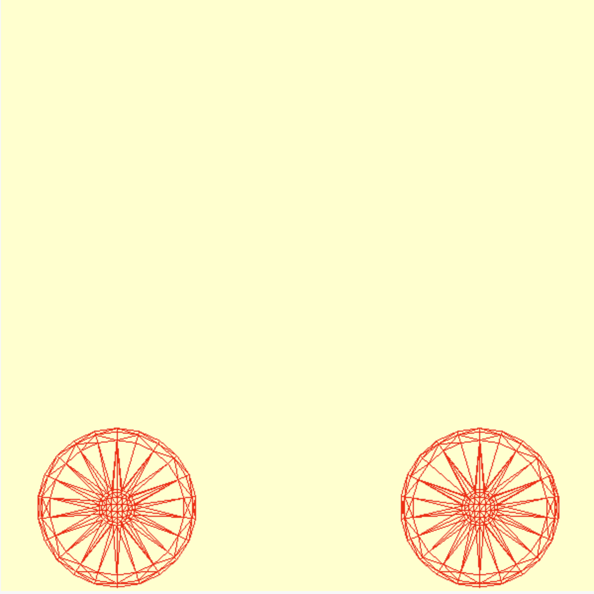

Wheels on the ground

Now that the wheels are fixed, you’re ready to solve the case of the missing train!

66

Metal by Tutorials
Chapter 2: 3D Models

Submeshes

So far, your primitive sphere and cone models included only one material group, and 
thus one submesh. Here’s a plane with four vertices and two material groups.

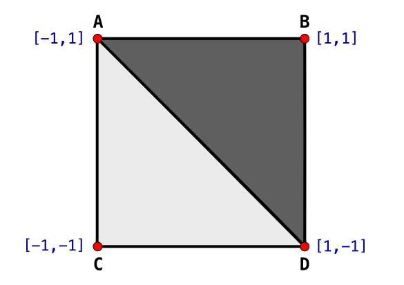

Vertices on a plane

When Model I/O loads this plane, it places the four vertices in an MTLBuffer. The 
following image shows the vertex position data and also how two submesh buffers 
index into the vertex data.

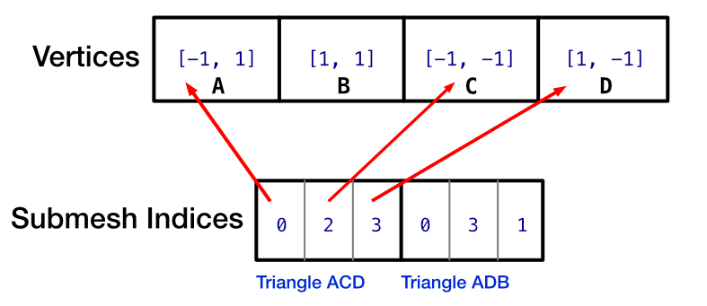

Submesh buffers

The first submesh buffer holds the vertex indices of the light-colored triangle ACD. 
These indices point to vertices 0, 2 and 3. The second submesh buffer holds the 
indices of the dark triangle ADB. The submesh also has an offset where the submesh 
buffer starts. The index can be held in either a uint16 or a uint32. The offset of this 
second submesh buffer would be three times the size of the uint type.

67

Metal by Tutorials
Chapter 2: 3D Models

Winding Order

The vertex order, also known as the winding order, is important here. The vertex 
order of this plane is counter-clockwise. With a counter-clockwise winding order, 
triangles that are defined in counter-clockwise order are facing toward you. Whereas 
triangles that are in clockwise order are facing away from you. In the next chapter, 
you’ll go down the graphics pipeline and you’ll see that the GPU can cull triangles 
that are not facing toward you, saving valuable processing time.

Render Submeshes

Currently, you’re only rendering the first submesh, but because the train has several 
material groups, you’ll need to loop through the submeshes to render them all.

➤ Toward the end of the playground, change:

guard let submesh = mesh.submeshes.first else { 
 fatalError() 
} 
renderEncoder.drawIndexedPrimitives( 
  type: .triangle, 
  indexCount: submesh.indexCount, 
  indexType: submesh.indexType, 
  indexBuffer: submesh.indexBuffer.buffer, 
  indexBufferOffset: 0)

To:

for submesh in mesh.submeshes { 
  renderEncoder.drawIndexedPrimitives( 
    type: .triangle, 
    indexCount: submesh.indexCount, 
    indexType: submesh.indexType, 
    indexBuffer: submesh.indexBuffer.buffer, 
    indexBufferOffset: submesh.indexBuffer.offset 
  ) 
}

This code loops through the submeshes and issues a draw call for each one. The 
mesh and submeshes are in MTLBuffers, and the submesh holds the index listing of 
the vertices in the mesh.

68

Metal by Tutorials
Chapter 2: 3D Models

➤ Run the playground, and your train renders completely — minus the material 
colors, which you’ll take care of in Chapter 11, “Maps & Materials”.

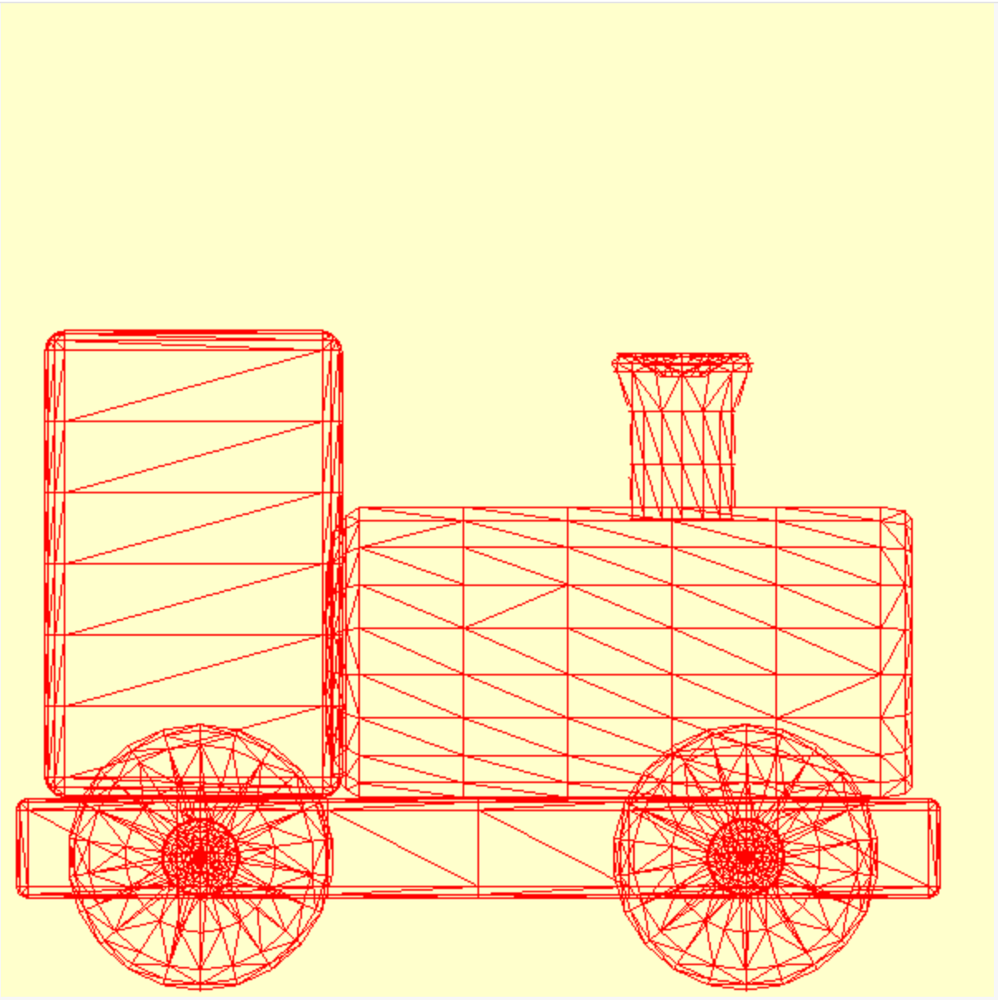

The final train

Congratulations! You’re now rendering 3D models. For now, don’t worry that you’re 
only rendering them in two dimensions or that the colors aren’t correct. After the 
next chapter, you’ll know more about the internals of rendering. Following on from 
that, you’ll learn how to move those vertices into the third dimension.

Challenge

If you’re in for a fun challenge, complete the Blender tutorial to make a mushroom 
(https://bit.ly/3gwKiel), and then export what you make in Blender to a .usdz file. If 
you want to skip the modeling, you’ll find the mushroom.usdz file in the resources 
directory for this chapter.

➤ Import mushroom.usdz into the playground and render it.

If you use your own modeled mushroom, you may find that the mushroom is lying on 
its side. Blender uses the Z axis as up, whereas your playground is expecting the Y 
axis as up. Before exporting to USD, you should rotate the model by 180º on the Z 
axis and 270º on the X axis. You must then apply all the transforms in Blender before 
exporting using menu option Object ▸ Apply ▸ All Transforms. mushroom.usdz in 
the resources directory has already been rotated.

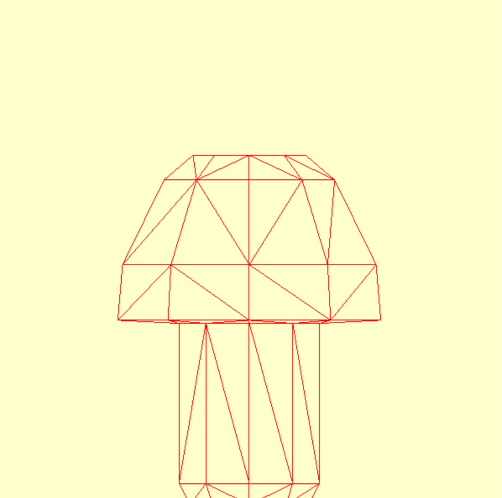

Wireframe mushroom

If you have difficulty, the completed playground is in the challenge directory for this 
chapter.

69

Metal by Tutorials
Chapter 2: 3D Models

Key Points

• 3D models consist of vertices. Each vertex has a position in 3D space.

• In 3D modeling apps, you create models using quads, or polygons with four 
vertices. On import, Model I/O converts these quads to triangles.

• Triangles are the GPU’s native format.

• Blender is a fully-featured professional free 3D modeling, animation and rendering 
app available from https://www.blender.org.

• There are many 3D file formats. Apple has standardized its AR models on Pixar’s 
USD format in a compressed USDZ format.

• Vertex descriptors describe the buffer format for the model’s vertices. You set the 
GPU pipeline state with the vertex descriptor, so that the GPU knows what the 
vertex buffer format is.

• A model is made up of at least one submesh. This submesh corresponds to a 
material group where you can define the color and other surface attributes of the 
group.

• Metal Normalized Device Coordinates are -1 to 1 on the X and Y axes, and 0 to 1 on 
the Z axis. X is left / right, Y is down / up and Z is front / back.

• The GPU will render only vertices positioned in Metal NDC.

70

3