# The Rendering 
Pipeline

Now that you know a bit more about 3D models and rendering, it’s time to take a 
drive through the rendering pipeline. In this chapter, you’ll create a Metal app that 
renders a red cube. As you work your way through this chapter, you’ll get a closer 
look at the hardware that’s responsible for turning your 3D objects into the gorgeous 
pixels you see onscreen. First up, the GPU and CPU.

71

Metal by Tutorials
Chapter 3: The Rendering Pipeline

The GPU and CPU

Every computer comes equipped with a Graphics Processing Unit (GPU) and 
Central Processing Unit (CPU).

The GPU is a specialized hardware component that can process images, videos and 
massive amounts of data really fast. This operation is known as throughput and is 
measured by the amount of data processed in a specific unit of time. The CPU, on the 
other hand, manages resources and is responsible for the computer’s operations. 
Although the CPU can’t process huge amounts of data like the GPU, it can process 
many sequential tasks (one after another) really fast. The time necessary to process a 
task is known as latency.

The ideal setup includes low latency and high throughput. Low latency allows for the 
serial execution of queued tasks, so the CPU can execute the commands without the 
system becoming slow or unresponsive — and high throughput lets the GPU render 
videos and games asynchronously without stalling the CPU. Because the GPU has a 
highly parallelized architecture specialized in doing the same task repeatedly and 
with little or no data transfers, it can process larger amounts of data.

The following diagram shows the major differences between the CPU and GPU.

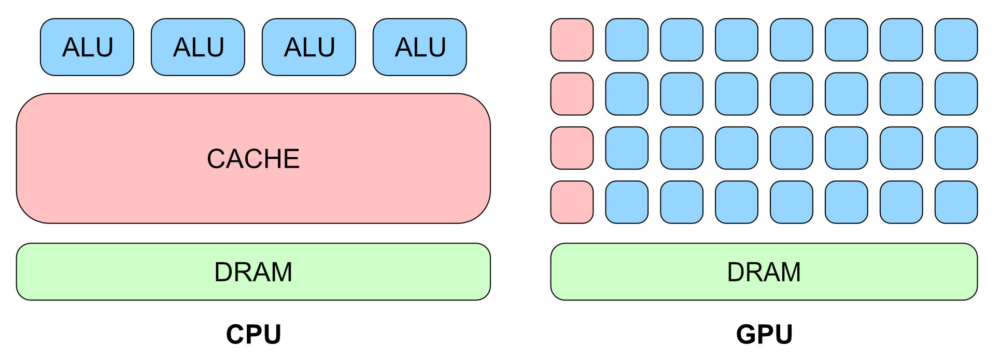

Differences between CPU and GPU

The CPU has a large cache memory and a handful of Arithmetic Logic Unit (ALU) 
cores. In contrast, the GPU has a small cache memory and many ALU cores. The low 
latency cache memory on the CPU is used for fast access to temporary resources. The 
ALU cores on the GPU handle calculations without saving partial results to memory.

The CPU typically has only a few cores, while the GPU has hundreds — even 
thousands of cores. With more cores, the GPU can split the problem into many 
smaller parts, each running on a separate core in parallel, which helps to hide 
latency. At the end of processing, the partial results are combined, and the final 
result is returned to the CPU. But cores aren’t the only thing that matters.

72

Metal by Tutorials
Chapter 3: The Rendering Pipeline

Besides being slimmed down, GPU cores also have special circuitry for processing 
geometry and are often called shader cores. These shader cores are responsible for 
the beautiful colors you see onscreen. The GPU writes an entire frame at a time to fit 
the full rendering window; it then proceeds to rendering the next frame as quickly as 
possible, so it can maintain a respectable frame rate.

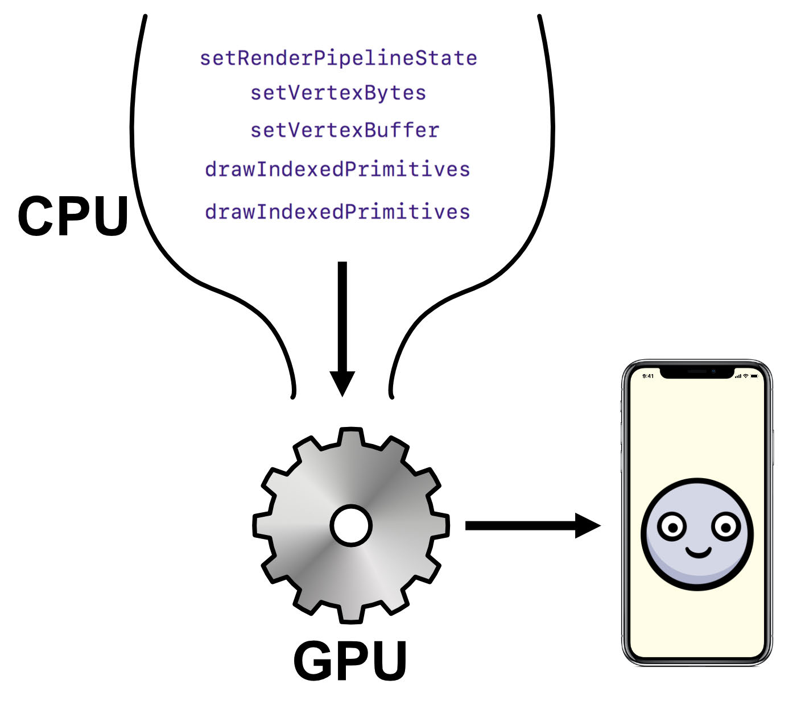

CPU sending commands to GPU

The CPU continues to issue commands to the GPU, ensuring that the GPU always has 
work to do. However, at some point, either the CPU will finish sending commands or 
the GPU will finish processing them. To avoid stalling, Metal on the CPU queues up 
multiple commands in command buffers and will issue new commands, sequentially, 
for the next frame without waiting for the GPU to finish the previous frame. This 
means that no matter who finishes the work first, there will always be more work to 
do.

The GPU part of the graphics pipeline starts after the GPU receives all of the 
commands and resources. To get started with the rendering pipeline, you’ll set up 
these commands and resources in a new project.

The Metal Project

So far, you’ve been using Playgrounds to learn about Metal. Playgrounds are great for 
testing and learning new concepts, but it’s also important to understand how to set 
up a full Metal project using SwiftUI.

➤ In Xcode, create a new project using the Multiplatform App template.

➤ Name your project Pipeline, and fill out your team and organization identifier. Set 
the Storage setting to None, and leave all of the checkbox options unchecked.

73

Metal by Tutorials
Chapter 3: The Rendering Pipeline

➤ Choose the location for your new project.

Excellent, you now have a fancy, new SwiftUI app. ContentView.swift is the main 
view for the app; this is where you’ll call your Metal view.

The MetalKit framework contains an MTKView, which is a special Metal rendering 
view. This is a UIView on iOS and an NSView on macOS. To interface with UIKit or 
Cocoa UI elements, you’ll use a Representable protocol that sits between SwiftUI 
and your MTKView.

This configuration is a bit complicated, so in the resources folder for this chapter, 
you’ll find a pre-made MetalView.swift.

➤ Drag this file into your project, making sure that you check all of the checkboxes 
so that you copy the file and add it to the app’s target.

Adding the file to the project

Note: Sometimes Xcode doesn’t copy the file and still points to the file in the 
resources directory. You may prefer to copy the file to your project code 
directory and add the file from there.

➤ Open MetalView.swift.

MetalView is a SwiftUI View structure that contains the MTKView property and hosts 
the Metal view. MetalViewRepresentable is the interface between either the 
UIView or the NSView, depending on the operating system.

➤ Open ContentView.swift, and change the contents of body to:

VStack { 
  MetalView() 
    .border(Color.black, width: 2) 
  Text("Hello, Metal!") 
} 
.padding()

74

Metal by Tutorials
Chapter 3: The Rendering Pipeline

Here, you add MetalView to the view hierarchy and give it a border.

➤ Build and run your application using either the macOS target or the iOS target.

You’ll see your hosted MTKView. The advantage of using SwiftUI is that it’s relatively 
easy to layer UI elements — such as the “Hello Metal” text here — below your Metal 
view.

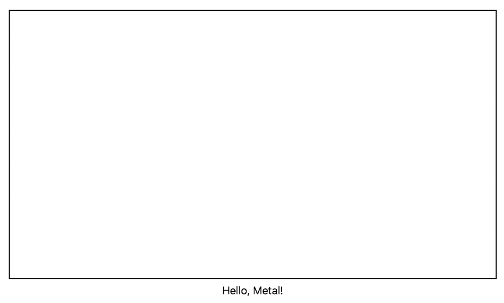

Initial SwiftUI View

You now have a choice. You can subclass MTKView and replace the MTKView in 
MetalView with the subclassed one. In this case, the subclass’s draw(_:) would get 
called every frame, and you’d put your drawing code in that method. However, in this 
book, you’ll set up a Renderer class that conforms to MTKViewDelegate and sets 
Renderer as a delegate of MTKView. MTKView calls a delegate method every frame, 
and this is where you’ll place the necessary drawing code.

Note: If you’re coming from a different API world, you might be looking for a 
game loop construct. You do have the option of using CADisplayLink for 
timing, but Apple introduced MetalKit with its protocols to manage the game 
loop more easily.

75

Metal by Tutorials
Chapter 3: The Rendering Pipeline

The Renderer Class

➤ Create a new Swift file named Renderer.swift, and replace its contents with the 
following code:

import MetalKit

class Renderer: NSObject { 
  init(metalView: MTKView) { 
    super.init() 
  } 
}

extension Renderer: MTKViewDelegate { 
  func mtkView( 
    _ view: MTKView, 
    drawableSizeWillChange size: CGSize 
  ) { 
  } 
 
  func draw(in view: MTKView) { 
    print("draw") 
  } 
}

Here, you create an initializer and make Renderer conform to MTKViewDelegate 
with the two MTKView delegate methods:

• mtkView(_:drawableSizeWillChange:): Called every time the size of the 
window changes. This allows you to update render texture sizes and camera 
projection.

• draw(in:): Called every frame. This is where you write your render code.

➤ Open MetalView.swift, and in MetalView, add a property to hold the renderer:

➤ Change body to:

var body: some View { 
  MetalViewRepresentable(metalView: $metalView) 
    .onAppear { 
      renderer = Renderer(metalView: metalView) 
    } 
}

Here, you initialize the renderer when the metal view first appears.

76

Metal by Tutorials
Chapter 3: The Rendering Pipeline

Initialization

Just as you did in the first chapter, you need to set up the Metal environment.

Metal has a major advantage over OpenGL in that you’re able to instantiate some 
objects up-front rather than create them during each frame. The following diagram 
indicates some of the Metal objects you can create at the start of the app.

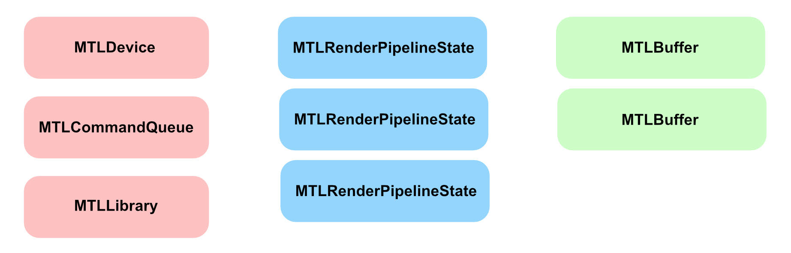

Create these outside the render loop

• MTLDevice: The software reference to the GPU hardware device.

• MTLCommandQueue: Responsible for creating and organizing MTLCommandBuffers 
every frame.

• MTLLibrary: Contains the source code from your vertex and fragment shader 
functions.

• MTLRenderPipelineState: Sets the information for the draw — such as which 
shader functions to use, what depth and color settings to use and how to read the 
vertex data.

• MTLBuffer: Holds data — such as vertex information — in a form that you can send 
to the GPU.

Typically, you’ll have one MTLDevice, one MTLCommandQueue and one MTLLibrary 
object in your app. You’ll also have several MTLRenderPipelineState objects that 
will define the various pipeline states, as well as several MTLBuffers to hold the data. 
Before you can use these objects, however, you need to initialize them.

➤ Open Renderer.swift, and add these properties to Renderer:

static var device: MTLDevice! 
static var commandQueue: MTLCommandQueue! 
static var library: MTLLibrary! 
var mesh: MTKMesh!

77

Metal by Tutorials
Chapter 3: The Rendering Pipeline

var vertexBuffer: MTLBuffer! 
var pipelineState: MTLRenderPipelineState!

All of these properties are currently implicitly unwrapped optionals for convenience, 
but you can add error-checking later if you wish.

You’re using class properties for the device, the command queue and the library to 
ensure that only one of each exists. In rare cases, you may require more than one, 
but in most apps, one is enough.

➤ Still in Renderer.swift, add the following code to init(metalView:) before 
super.init():

guard 
  let device = MTLCreateSystemDefaultDevice(), 
  let commandQueue = device.makeCommandQueue() else { 
    fatalError("GPU not available") 
} 
Self.device = device 
Self.commandQueue = commandQueue 
metalView.device = device

This code initializes the GPU and creates the command queue.

➤ Finally, after super.init(), add this:

metalView.clearColor = MTLClearColor( 
  red: 1.0, 
  green: 1.0, 
  blue: 0.8, 
  alpha: 1.0) 
metalView.delegate = self

This code sets metalView.clearColor to a cream color. It also sets Renderer as the 
delegate for metalView so that the view will call the MTKViewDelegate drawing 
methods.

➤ Build and run the app to make sure everything’s set up and working. If everything 
is good, you’ll see the SwiftUI view as before, and in the debug console, you’ll see the 
word “draw” repeatedly. Use this console statement to verify that your app is calling 
draw(in:) for every frame.

Note: You won’t see metalView’s cream color because you’re not asking the 
GPU to do any drawing yet.

78

Metal by Tutorials
Chapter 3: The Rendering Pipeline

Create the Mesh

You’ve already created a sphere and a cone using Model I/O; now it’s time to create a 
cube.

➤ In init(metalView:), before calling super.init(), add this:

// create the mesh 
let allocator = MTKMeshBufferAllocator(device: device) 
let size: Float = 0.8 
let mdlMesh = MDLMesh( 
  boxWithExtent: [size, size, size], 
  segments: [1, 1, 1], 
  inwardNormals: false, 
  geometryType: .triangles, 
  allocator: allocator) 
do { 
  mesh = try MTKMesh(mesh: mdlMesh, device: device) 
} catch { 
  print(error.localizedDescription) 
}

This code creates the cube mesh, as you did in the previous chapter.

➤ Then, set up the MTLBuffer that contains the vertex data you’ll send to the GPU.

This code puts the mesh data in an MTLBuffer. Next, you need to set up the pipeline 
state so that the GPU will know how to render the data.

Set Up the Metal Library

First, set up the MTLLibrary and ensure that the vertex and fragment shader 
functions are present.

➤ Continue adding code before super.init():

// create the shader function library 
let library = device.makeDefaultLibrary() 
Self.library = library 
let vertexFunction = library?.makeFunction(name: "vertex_main") 
let fragmentFunction = 
  library?.makeFunction(name: "fragment_main")

79

Metal by Tutorials
Chapter 3: The Rendering Pipeline

Here, you set up the default library with some shader function pointers. You’ll create 
these shader functions later in this chapter. Unlike OpenGL shaders, these functions 
are compiled when you compile your project, which is more efficient than compiling 
your functions on the fly. The result is stored in the library.

Create the Pipeline State

To configure the GPU’s state, you create a pipeline state object (PSO). This pipeline 
state can be a render pipeline state for rendering vertices, or a compute pipeline 
state for running a compute kernel.

➤ Continue adding code before super.init():

// create the pipeline state object 
let pipelineDescriptor = MTLRenderPipelineDescriptor() 
pipelineDescriptor.vertexFunction = vertexFunction 
pipelineDescriptor.fragmentFunction = fragmentFunction 
pipelineDescriptor.colorAttachments[0].pixelFormat = 
  metalView.colorPixelFormat 
pipelineDescriptor.vertexDescriptor = 
  MTKMetalVertexDescriptorFromModelIO(mdlMesh.vertexDescriptor) 
do { 
  pipelineState = 
    try device.makeRenderPipelineState( 
      descriptor: pipelineDescriptor) 
} catch { 
  fatalError(error.localizedDescription) 
}

The PSO holds a potential state for the GPU. The GPU needs to know its complete 
state before it can start managing vertices. Here, you set the two shader functions 
the GPU will call and the pixel format for the texture to which the GPU will write. 
You also set the pipeline’s vertex descriptor; this is how the GPU will know how to 
interpret the vertex data that you’ll present in the mesh data MTLBuffer.

Note: If you need to use a different data buffer layout or call different vertex 
or fragment functions, you’ll need additional pipeline states. Creating pipeline 
states is relatively time-consuming — which is why you do it up-front — but 
switching pipeline states during frames is fast and efficient.

The initialization is complete, and your project compiles. Next up, you’ll start on 
drawing your model.

80

Metal by Tutorials
Chapter 3: The Rendering Pipeline

Render Frames

MTKView calls draw(in:) for every frame; this is where you’ll set up your GPU render 
commands.

➤ In draw(in:), replace the print statement with this:

guard 
  let commandBuffer = Self.commandQueue.makeCommandBuffer(), 
  let descriptor = view.currentRenderPassDescriptor, 
  let renderEncoder = 
    commandBuffer.makeRenderCommandEncoder( 
      descriptor: descriptor) else { 
    return 
}

You’ll send a series of commands to the GPU contained in command encoders. In 
one frame, you might have multiple command encoders, and the command buffer 
manages these.

You create a render command encoder using a render pass descriptor. This 
contains the render target textures that the GPU will draw into. In a complex app, 
you may well have multiple render passes in one frame, with multiple target 
textures. You’ll learn how to chain render passes together later.

➤ Continue adding this code:

// drawing code goes here

// 1 
renderEncoder.endEncoding() 
// 2 
guard let drawable = view.currentDrawable else { 
  return 
} 
commandBuffer.present(drawable) 
// 3 
commandBuffer.commit()

Here’s a closer look at the code:

1. After adding the GPU commands to a command encoder, you end its encoding.

2. You present the view’s drawable texture to the GPU.

3. When you commit the command buffer, you send the encoded commands to the 
GPU for execution.

81

Metal by Tutorials
Chapter 3: The Rendering Pipeline

Drawing

It’s time to set up the list of commands that the GPU will need to draw your frame. In 
other words, you’ll:

• Set the pipeline state to configure the GPU hardware.

• Give the GPU the vertex data.

• Issue a draw call using the mesh’s submesh groups.

➤ Still in draw(in:), replace the comment:

With:

renderEncoder.setRenderPipelineState(pipelineState) 
renderEncoder.setVertexBuffer(vertexBuffer, offset: 0, index: 0) 
for submesh in mesh.submeshes { 
  renderEncoder.drawIndexedPrimitives( 
    type: .triangle, 
    indexCount: submesh.indexCount, 
    indexType: submesh.indexType, 
    indexBuffer: submesh.indexBuffer.buffer, 
    indexBufferOffset: submesh.indexBuffer.offset) 
}

Great, you set up the GPU commands to set the pipeline state and the vertex buffer, 
and to perform the draw calls on the mesh’s submeshes. When you commit the 
command buffer at the end of draw(in:), you’re telling the GPU that the data and 
pipeline are ready, and it’s time for the GPU to take over.

82

Metal by Tutorials
Chapter 3: The Rendering Pipeline

The Render Pipeline

Are you ready to investigate the GPU pipeline? Great, let’s get to it!

In the following diagram, you can see the stages of the pipeline.

The render pipeline

The graphics pipeline takes the vertices through multiple stages, during which the 
vertices have their coordinates transformed between various spaces.

Note: This chapter describes immediate-mode rendering (IMR) architecture. 
Apple’s chips for iOS since A11, and Apple silicon for macOS, use tile-based 
rendering (TBR). New Metal features are able to take advantage of TBR. 
However, for simplicity, you’ll start off with a basic understanding of general 
GPU architecture. If you want a preview of some differences, watch Apple’s 
WWDC 2020 video Bring your Metal app to Apple silicon Macs (https://
developer.apple.com/videos/play/wwdc2020/10631/).

As a Metal programmer, you’re only concerned about the Vertex and Fragment 
Processing stages since they’re the only two programmable stages in this pipeline. 
Later in the chapter, you’ll write both a vertex shader and a fragment shader. For all 
the non-programmable pipeline stages, such as Vertex Fetch, Primitive Assembly 
and Rasterization, the GPU has specially designed hardware units to serve those 
stages.

83

Metal by Tutorials
Chapter 3: The Rendering Pipeline

1 - Vertex Fetch

The name of this stage varies among different graphics Application Programming 
Interfaces (APIs). For example, DirectX calls it Input Assembler.

To start rendering 3D content, you first need a scene. A scene consists of models that 
have meshes of vertices. One of the simplest models is the cube which has six faces 
(12 triangles). As you saw in the previous chapter, you use a vertex descriptor to 
define the way vertices are read in along with their attributes — such as position, 
texture coordinates, normal and color. You do have the option not to use a vertex 
descriptor and just send an array of vertices in an MTLBuffer, however, if you decide 
not to use one, you’ll need to know how the vertex buffer is organized ahead of time.

When the GPU fetches the vertex buffer, the MTLRenderCommandEncoder draw call 
tells the GPU whether the buffer is indexed. If the buffer is not indexed, the GPU 
assumes the buffer is an array, and it reads in one element at a time, in order.

In the previous chapter, you saw how Model I/O imports USD files and sets up their 
buffers indexed by submesh. This indexing is important because vertices are cached 
for reuse. For example, a cube has 12 triangles and eight vertices (at the corners). If 
you don’t index, you’ll have to specify the vertices for each triangle and send 36 
vertices to the GPU. This may not sound like a lot, but in a model that has several 
thousand vertices, vertex caching is important.

There is also a second cache for shaded vertices so that vertices that are accessed 
multiple times are only shaded once. A shaded vertex is one to which color was 
already applied. But that happens in the next stage.

A special hardware unit known as the Scheduler sends the vertices and their 
attributes on to the Vertex Processing stage.

2 - Vertex Processing

In the Vertex Processing stage, vertices are processed individually. You write code to 
calculate per-vertex lighting and color. More importantly, you send vertex 
coordinates through various coordinate spaces to reach their position in the final 
framebuffer.

84

Metal by Tutorials
Chapter 3: The Rendering Pipeline

You briefly learned about shader functions and about the Metal Shading Language 
(MSL) in Chapter 1, “Hello, Metal!”. Now it’s time to see what happens under the 
hood at the hardware level.

Look at this diagram of the architecture of an AMD GPU:

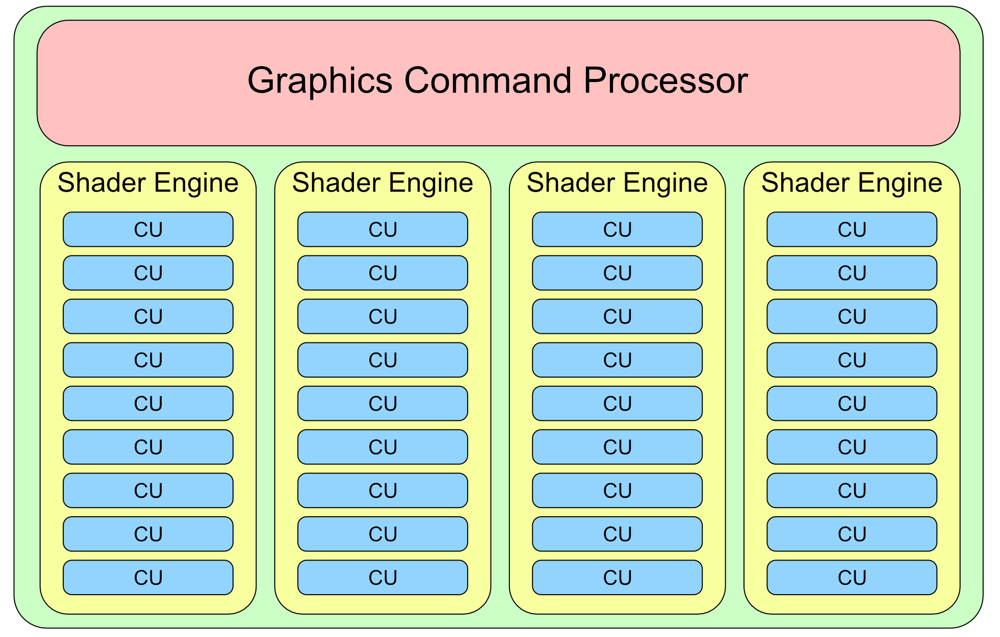

AMD GPU architecture

Going top-down, the GPU has:

• 1 Graphics Command Processor: This coordinates the work processes.

• 4 Shader Engines (SE): An SE is an organizational unit on the GPU that can serve 
an entire pipeline. Each SE has a geometry processor, a rasterizer and Compute 
Units.

• 9 Compute Units (CU): A CU is nothing more than a group of shader cores.

• 64 shader cores: A shader core is the basic building block of the GPU where all of 
the shading work is done.

In total, the 36 CUs have 2,304 shader cores. Compare that to the number of cores 
in your 8-core CPU.

For mobile devices, the story is a little different. For comparison, look at the 
following image showing a GPU similar to those in recent iOS devices. Instead of 
having SEs and CUs, the PowerVR GPU has Unified Shading Clusters (USC).

85

Metal by Tutorials
Chapter 3: The Rendering Pipeline

This particular GPU model has 6 USCs and 32 cores per USC for a total of only 192 
cores.

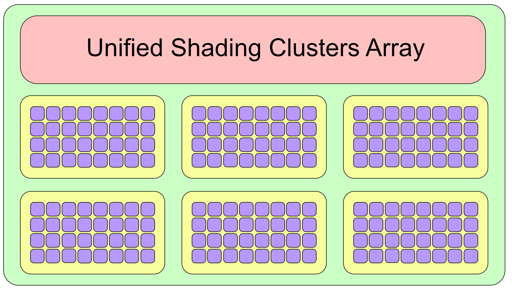

The PowerVR GPU

Note: The iPhone X had the first mobile GPU entirely designed in-house by 
Apple. Apple has so far not made any GPU hardware specifications public.

So what can you do with that many cores? Since these cores are specialized in both 
vertex and fragment shading, one obvious thing to do is give all the cores work to do 
in parallel so that the processing of vertices or fragments is done faster. There are a 
few rules, though.

Inside a CU, you can only process either vertices or fragments, and only at one time. 
(Good thing there’s thirty-six of those!) Another rule is that you can only process 
one shader function per SE. Having four SE’s lets you combine work in interesting 
and useful ways. For example, you can run one fragment shader on one SE and a 
second fragment shader on a second SE at one time. Or you can separate your vertex 
shader from your fragment shader and have them run in parallel but on different 
SEs.

86

Metal by Tutorials
Chapter 3: The Rendering Pipeline

Creating a Vertex Shader

It’s time to see vertex processing in action. The vertex shader you’re about to write 
is minimal, but it encapsulates most of the necessary vertex shader syntax you’ll 
need in this and subsequent chapters.

➤ Create a new file using the Metal File template, and name it Shaders.metal. 
Then, add this code at the end of the file:

// 1 
struct VertexIn { 
  float4 position [[attribute(0)]]; 
};

// 2 
vertex float4 vertex_main(const VertexIn vertexIn [[stage_in]]) 
{ 
  return vertexIn.position; 
}

Going through the code:

1. Create a struct VertexIn to describe the vertex attributes that match the vertex 
descriptor you set up earlier. In this case, just position.

2. Implement a vertex shader, vertex_main, that takes in VertexIn structures and 
returns vertex positions as float4 types.

Remember that vertices are indexed in the vertex buffer. The vertex shader gets the 
current vertex index via the [[stage_in]] attribute and unpacks the VertexIn 
structure cached for the vertex at the current index.

Compute Units can process (at one time) batches of vertices up to their maximum 
number of shader cores. This batch can fit entirely in the CU cache and vertices can 
thus be reused as needed. The batch will keep the CU busy until the processing is 
done but other CUs should become available to process the next batch.

87

Metal by Tutorials
Chapter 3: The Rendering Pipeline

As soon as the vertex processing is done, the cache is cleared for the next batches of 
vertices. At this point, vertices are now ordered and grouped, ready to be sent to the 
primitive assembly stage.

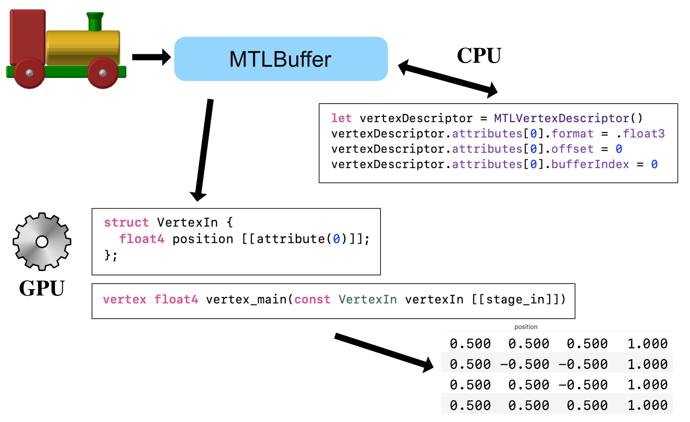

Vertex processing

To recap, the CPU sent the GPU a vertex buffer that you created from the model’s 
mesh. You configured the vertex buffer using a vertex descriptor that tells the GPU 
how the vertex data is structured. On the GPU, you created a structure to encapsulate 
the vertex attributes. The vertex shader takes in this structure as a function 
argument, and through the [[stage_in]] qualifier, acknowledges that position 
comes from the CPU via the [[attribute(0)]] position in the vertex buffer. The 
vertex shader then processes all of the vertices and returns their positions as a 
float4.

Note: When you use a vertex descriptor with attributes, you don’t have to 
match types. The MTLBuffer position is a float3, whereas VertexIn defines 
the position as a float4.

A special hardware unit known as the Distributer sends the grouped blocks of 
vertices on to the Primitive Assembly stage.

88

Metal by Tutorials
Chapter 3: The Rendering Pipeline

3 - Primitive Assembly

The previous stage sent processed vertices grouped into blocks of data to this stage. 
The important thing to keep in mind is that vertices belonging to the same 
geometrical shape (primitive) are always in the same block. That means that the one 
vertex of a point, or the two vertices of a line, or the three vertices of a triangle, will 
always be in the same block, hence a second block fetch isn’t necessary.

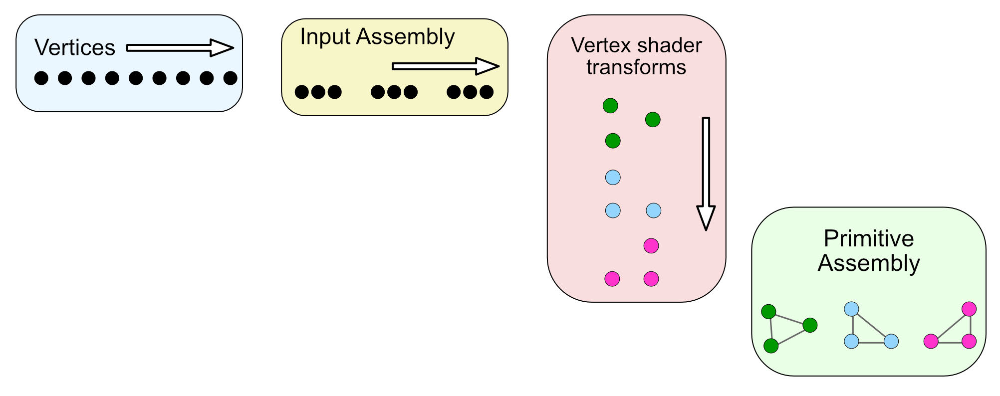

Primitive assembly

Along with vertices, the CPU also sends vertex connectivity information when it 
issues the draw call command, like this:

renderEncoder.drawIndexedPrimitives( 
  type: .triangle, 
  indexCount: submesh.indexCount, 
  indexType: submesh.indexType, 
  indexBuffer: submesh.indexBuffer.buffer, 
  indexBufferOffset: 0)

The first argument of the draw function contains the most important information 
about vertex connectivity. In this case, it tells the GPU that it should draw triangles 
from the vertex buffer it sent.

89

Metal by Tutorials
Chapter 3: The Rendering Pipeline

The Metal API provides five primitive types:

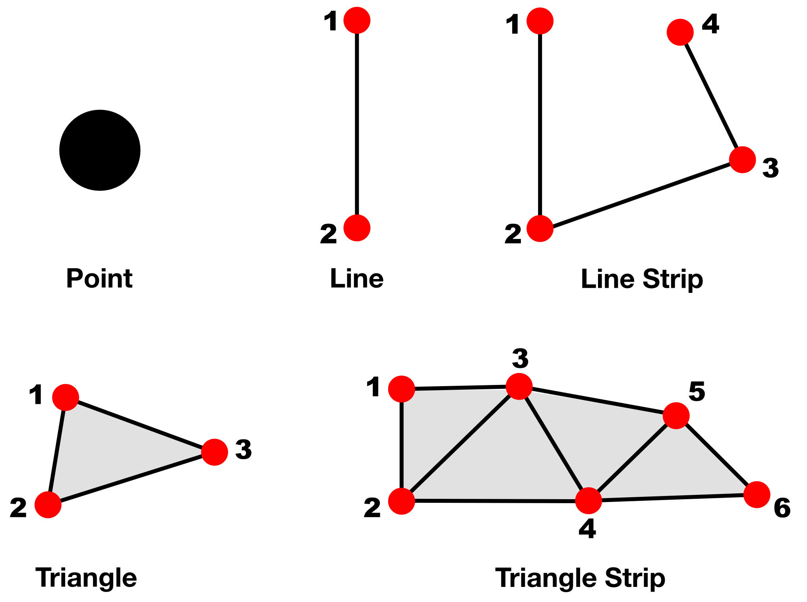

The primitive types

• point: For each vertex, rasterize a point. You can specify the size of a point that 
has the attribute [[point_size]] in the vertex shader.

• line: For each pair of vertices, rasterize a line between them. If a vertex was 
already included in a line, it cannot be included again in other lines. The last 
vertex is ignored if there are an odd number of vertices.

• lineStrip: Same as a simple line, except that the line strip connects all adjacent 
vertices and forms a poly-line. Each vertex (except the first) is connected to the 
previous vertex.

• triangle: For every sequence of three vertices, rasterize a triangle. The last 
vertices are ignored if they cannot form another triangle.

• triangleStrip: Same as a simple triangle, except adjacent vertices can be 
connected to other triangles as well.

There is one more primitive type known as a patch, but this needs special treatment. 
You’ll read more about patches in Chapter 19, “Tessellation & Terrains”.

As you read in the previous chapter, the pipeline specifies the winding order of the 
vertices. If the winding order is counter-clockwise, and the triangle vertex order is 
counter-clockwise, the vertices are front-faced; otherwise, the vertices are back-
faced and can be culled since you can’t see their color and lighting. Primitives are 
culled when they’re entirely occluded by other primitives.

90

Metal by Tutorials
Chapter 3: The Rendering Pipeline

However, if they’re only partially off-screen, they’ll be clipped.

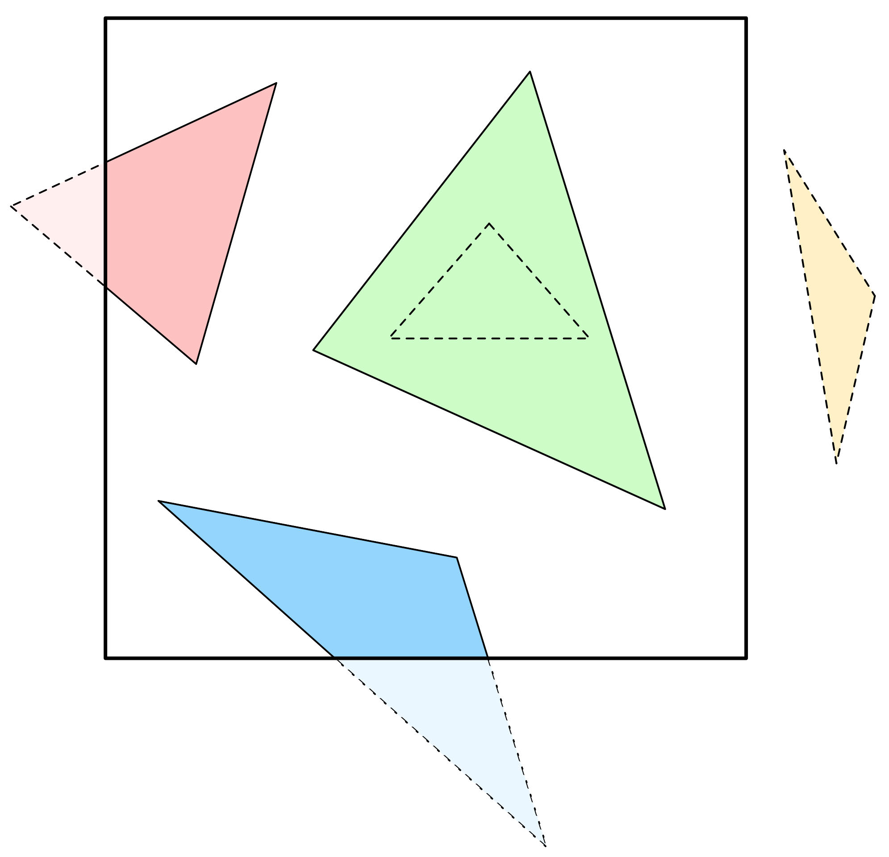

Clipping primitives

For efficiency, you should set winding order and enable back-face culling in the 
pipeline state.

At this point, primitives are fully assembled from connected vertices and are ready to 
move on to the rasterizer.

4 - Rasterization

There are two modern rendering techniques currently evolving on separate paths but 
sometimes used together: ray tracing and rasterization. They are quite different, 
and both have pros and cons. Ray tracing — which you’ll read more about in Chapter 
27, “Rendering With Rays” — is preferred when rendering content that is static and 
far away, while rasterization is preferred when the content is closer to the camera 
and more dynamic.

With ray tracing, for each pixel on the screen, it sends a ray into the scene to see if 
there’s an intersection with an object. If yes, change the pixel color to that object’s 
color, but only if the object is closer to the screen than the previously saved object 
for the current pixel.

Rasterization works the other way around. For each object in the scene, send rays 
back into the screen and check which pixels are covered by the object. Depth 
information is kept the same way as for ray tracing, so it will update the pixel color if 
the current object is closer than the previously saved one.

At this point, all connected vertices sent from the previous stage need to be 
represented on a two-dimensional grid using their X and Y coordinates. This step is 
known as the triangle setup. Here is where the rasterizer needs to calculate the 
slope or steepness of the line segments between any two vertices.

91

Metal by Tutorials
Chapter 3: The Rendering Pipeline

When the three slopes for the three vertices are known, the triangle can be formed 
from these three edges.

Next, a process known as scan conversion runs on each line of the screen to look for 
intersections and to determine what’s visible and what’s not. To draw on the screen 
at this point, you need only the vertices and the slopes they determine.

The scan algorithm determines if all the points on a line segment or all the points 
inside of a triangle are visible, in which case the triangle is filled with color entirely.

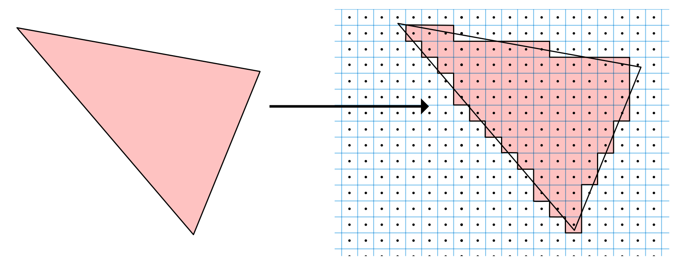

Rasterizing triangles

For mobile devices, the rasterization takes advantage of the tiled architecture of 
PowerVR GPUs by rasterizing the primitives on a 32x32 tile grid in parallel. In this 
case, 32 is the number of screen pixels assigned to a tile, but this size perfectly fits 
the number of cores in a USC.

What if one object is behind another object? How can the rasterizer determine which 
object to render? This hidden surface removal problem can be solved by using stored 
depth information (early-Z testing) to determine whether each point is in front of 
other points in the scene.

After rasterization is finished, three more specialized hardware units take the stage:

• A buffer known as Hierarchical-Z is responsible for removing fragments that were 
marked for culling by the rasterizer.

• The Z and Stencil Test unit then removes non-visible fragments by comparing 
them against the depth and stencil buffer.

• Finally, the Interpolator unit takes the remaining visible fragments and generates 
fragment attributes from the assembled triangle attributes.

At this point, the Scheduler unit, again, dispatches work to the shader cores, but this 
time it’s the rasterized fragments sent for Fragment Processing.

92

Metal by Tutorials
Chapter 3: The Rendering Pipeline

5 - Fragment Processing

Time for a quick review of the pipeline.

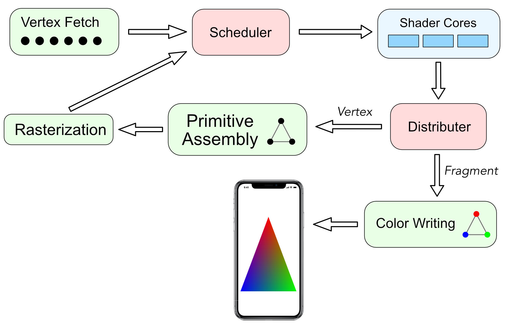

Fragment Processing

• The Vertex Fetch unit grabs vertices from the memory and passes them to the 
Scheduler unit.

• The Scheduler unit knows which shader cores are available, so it dispatches work 
on them.

• After the work is done, the Distributer unit knows if this work was Vertex or 
Fragment Processing. If the work was Vertex Processing, it sends the result to 
the Primitive Assembly unit. This path continues to the Rasterization unit, and 
then back to the Scheduler unit. If the work was Fragment Processing, it sends 
the result to the Color Writing unit.

• Finally, the colored pixels are sent back to the memory.

The primitive processing in the previous stages is sequential because there’s only 
one Primitive Assembly unit and one Rasterization unit. However, as soon as 
fragments reach the Scheduler unit, work can be forked (divided) into many tiny 
parts, and each part is given to an available shader core.

93

Metal by Tutorials
Chapter 3: The Rendering Pipeline

Hundreds or even thousands of cores are now doing parallel processing. When the 
work is complete, the results will be joined (merged) and sent to the memory, again 
sequentially.

The fragment processing stage is another programmable stage. You create a 
fragment shader function that will receive the lighting, texture coordinate, depth 
and color information that the vertex function outputs. The fragment shader output 
is a single color for that fragment. Each of these fragments will contribute to the 
color of the final pixel in the framebuffer. All of the attributes are interpolated for 
each fragment.

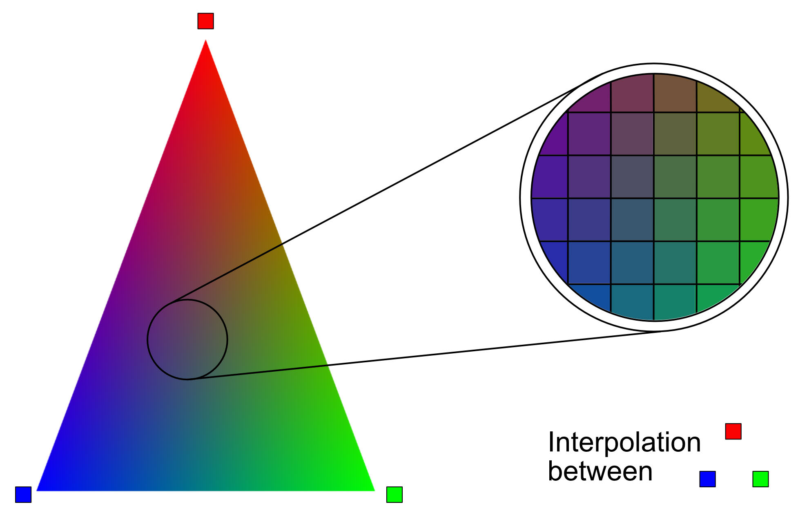

Fragment interpolation

For example, to render this triangle, the vertex function would process three vertices 
with the colors red, green and blue. As the diagram shows, each fragment that makes 
up this triangle is interpolated from these three colors. Linear interpolation simply 
averages the color at each point on the line between two endpoints. If one endpoint 
has red color, and the other has green color, the midpoint on the line between them 
will be yellow. And so on.

The interpolation equation is parametric and has this form, where parameter p is the 
percentage (or a range from 0 to 1) of a color’s presence:

Color is easy to visualize, but the other vertex function outputs are also similarly 
interpolated for each fragment.

Note: If you don’t want a vertex output to be interpolated, add the attribute 
[[flat]] to its definition.

94

Metal by Tutorials
Chapter 3: The Rendering Pipeline

Creating a Fragment Shader

➤ In Shaders.Metal, add the fragment function to the end of the file:

fragment float4 fragment_main() { 
  return float4(1, 0, 0, 1); 
}

This is the simplest fragment function possible. You return the interpolated color red 
in the form of a float4, which describes a color in RGBA format. All the fragments 
that make up the cube will be red. The GPU takes the fragments and does a series of 
post-processing tests:

• alpha-testing determines which opaque objects are drawn (and which are not) 
based on depth testing.

• In the case of translucent objects, alpha-blending will combine the color of the 
new object with that already saved in the color buffer previously.

• scissor testing checks whether a fragment is inside of a specified rectangle; this 
test is useful for masked rendering.

• stencil testing checks how the stencil value in the framebuffer where the 
fragment is stored, compares to a specified value we choose.

• In the previous stage early-Z testing ran; now a late-Z testing is done to solve 
more visibility issues; stencil and depth tests are also useful for ambient occlusion 
and shadows.

• Finally, antialiasing is also calculated here so that final images that get to the 
screen do not look jagged.

You’ll learn more about post-processing tests in Chapter 20, “Fragment Post-
Processing”.

6 - Framebuffer

As soon as fragments have been processed into pixels, the Distributer unit sends 
them to the Color Writing unit. This unit is responsible for writing the final color in 
a special memory location known as the framebuffer. From here, the view gets its 
colored pixels refreshed every frame. But does that mean the color is written to the 
framebuffer while being displayed on the screen?

95

Metal by Tutorials
Chapter 3: The Rendering Pipeline

A technique known as double-buffering is used to solve this situation. While the 
first buffer is being displayed on the screen, the second one is updated in the 
background. Then, the two buffers are swapped, and the second one is displayed on 
the screen while the first one is updated, and the cycle continues.

Whew! That was a lot of hardware information to take in. However, the code you’ve 
written is what every Metal renderer uses, and despite just starting out, you should 
begin to recognize the rendering process when you look at Apple’s sample code.

➤ Build and run the app, and you’ll see a beautifully rendered red cube:

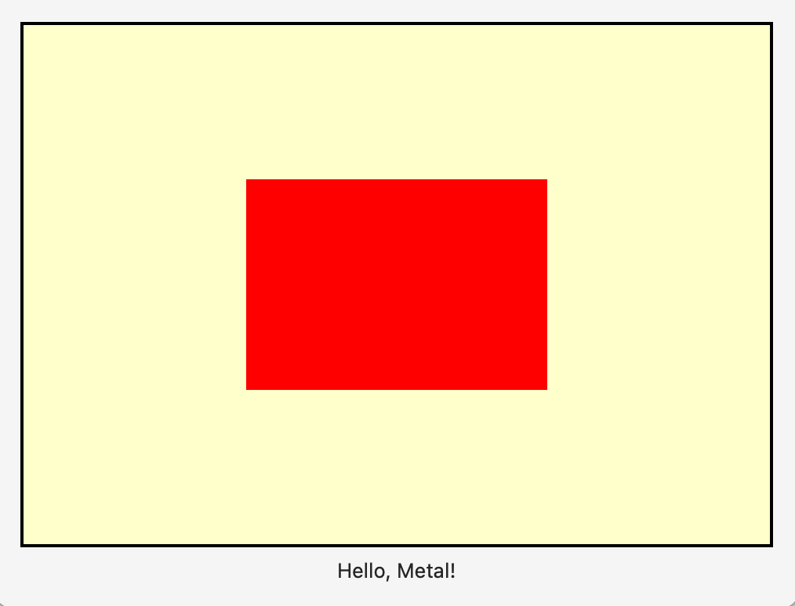

A rendered cube

Notice how the cube is not square. Remember that Metal uses Normalized Device 
Coordinates (NDC) that is -1 to 1 on the X axis. Resize your window, and the cube 
will maintain a size relative to the size of the window. In Chapter 6, “Coordinate 
Spaces”, you’ll learn how to position objects precisely on the screen.

What an incredible journey you’ve had through the rendering pipeline. In the next 
chapter, you’ll explore vertex and fragment shaders in greater detail.

96

Metal by Tutorials
Chapter 3: The Rendering Pipeline

Challenge

Using the train.usdz model in the resources folder for this project, replace the cube 
with this train. When importing the model, be sure to select Create Groups and 
remember to add the model to the target.

Change the model’s vertical position in the vertex function using this code:

float4 position = vertexIn.position; 
position.y -= 1.0; 
return position;

Finally, color your train blue.

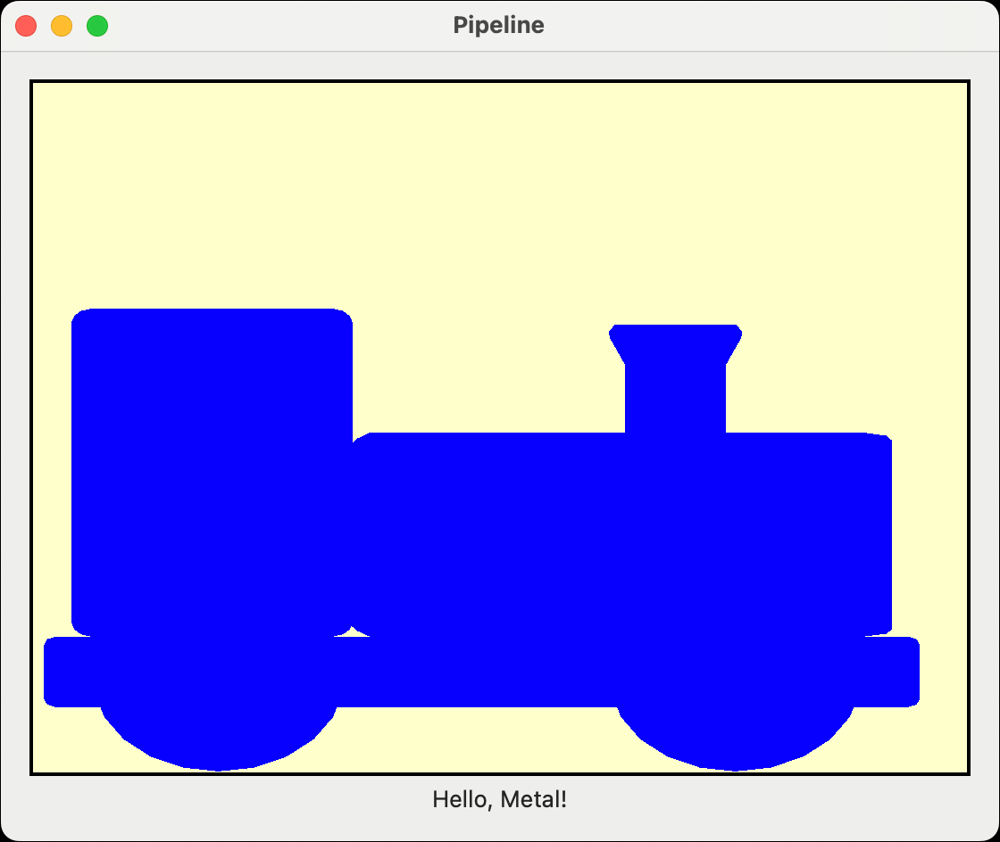

Challenge result

Refer to the previous chapter for asset loading and the vertex descriptor code if you 
need help. The finished code for this challenge is in the project challenge directory 
for this chapter.

97

Metal by Tutorials
Chapter 3: The Rendering Pipeline

Key Points

• CPUs are best for processing sequential tasks fast, whereas GPUs excel at 
processing small tasks synchronously.

• SwiftUI is a great host for MTKViews, as you can layer UI elements easily.

• Separate Metal tasks where you can to the initialize phase. Initialize the device, 
command queues, pipeline states and model data buffers once at the start of your 
app.

• Each frame, create a command buffer and one or more command encoders.

• GPU architecture allows for a strict pipeline. Configure this using PSOs (pipeline 
state objects).

• There are two programmable stages in a simple rendering GPU pipeline. You 
calculate vertex positions using the vertex shader, and calculate the color that 
appears on the screen using the fragment shader.

98

4