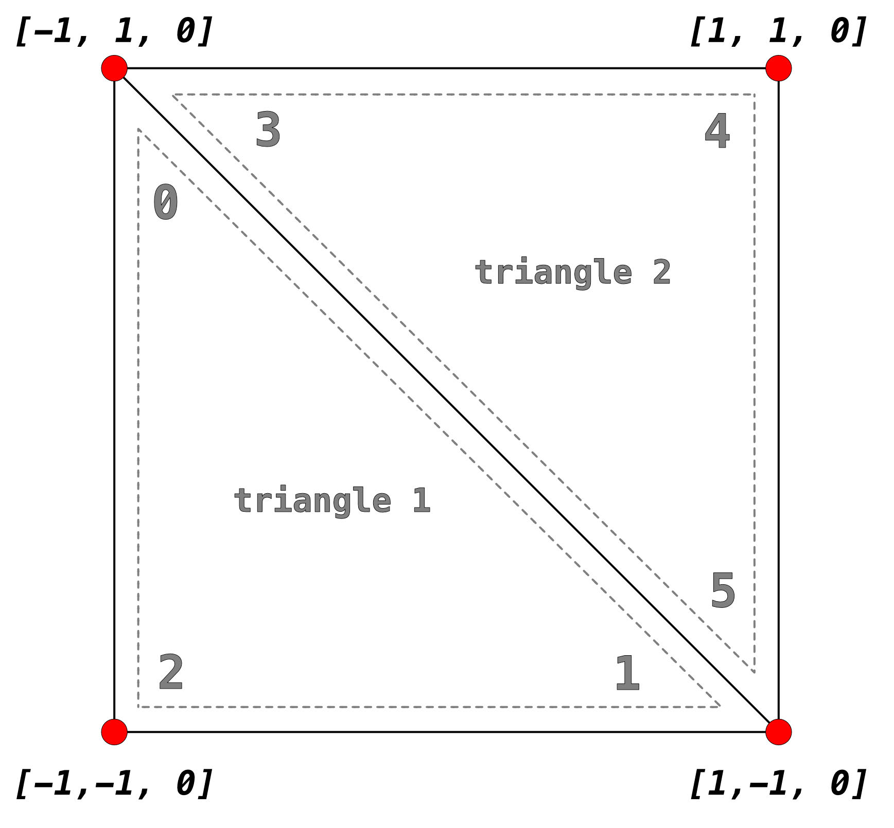
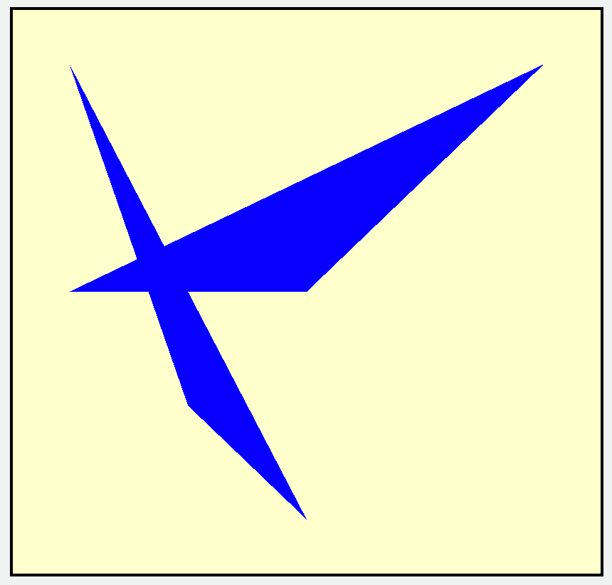
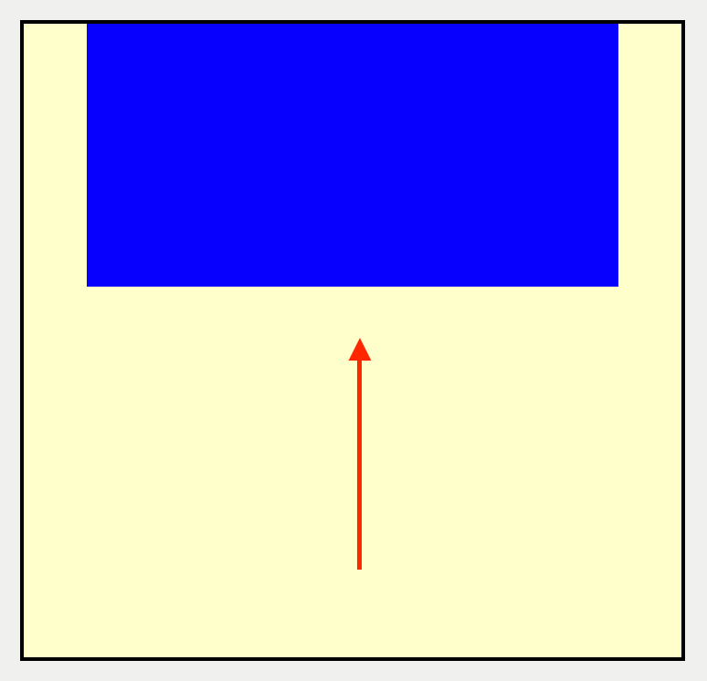
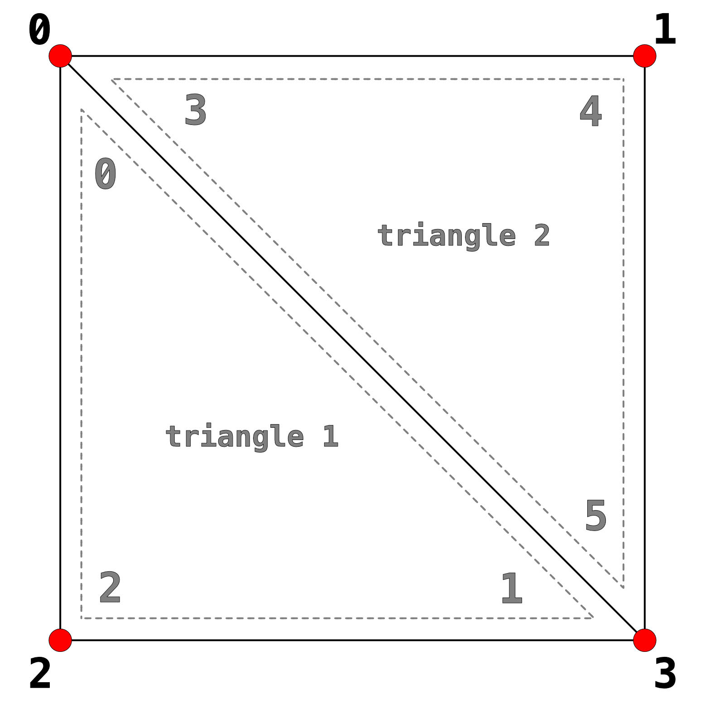
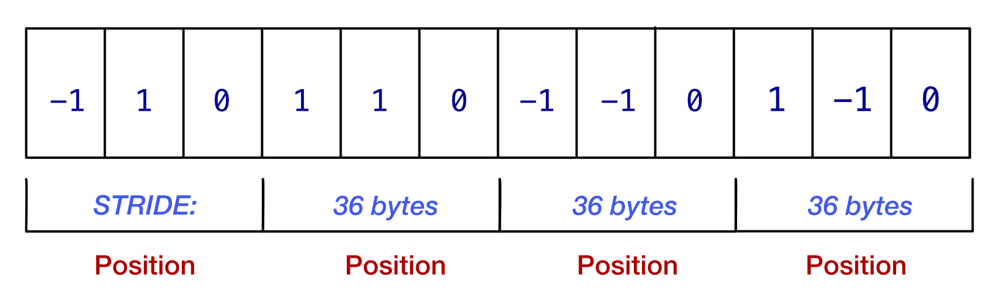
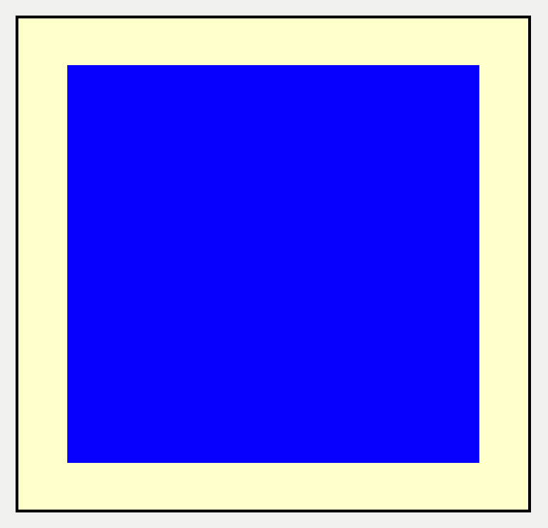
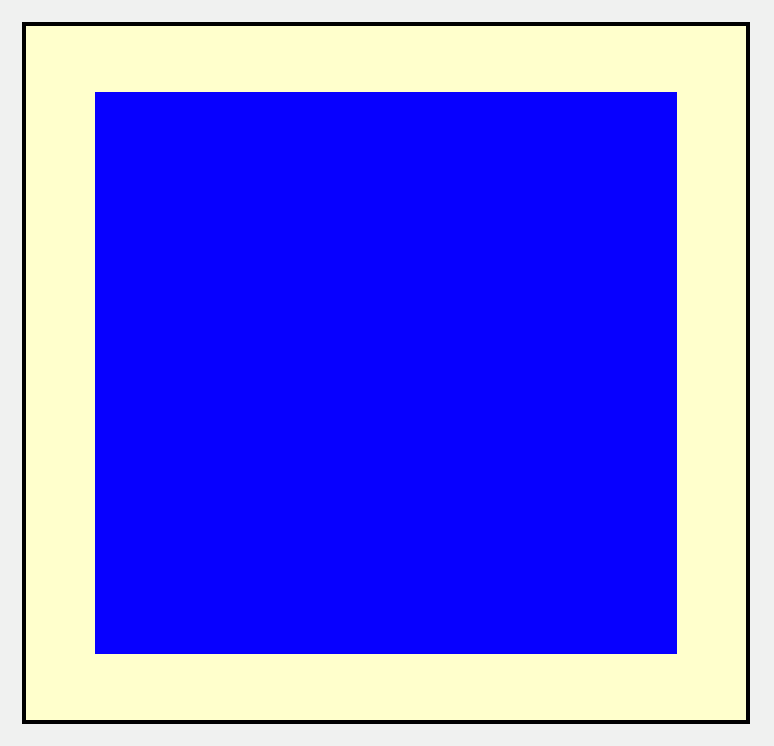
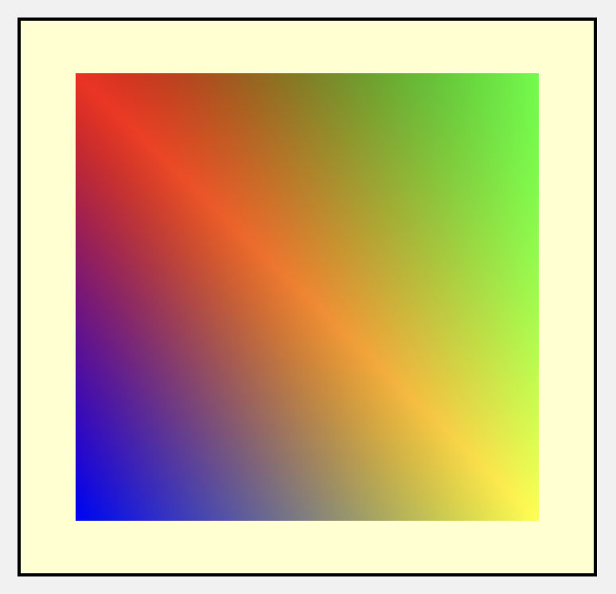
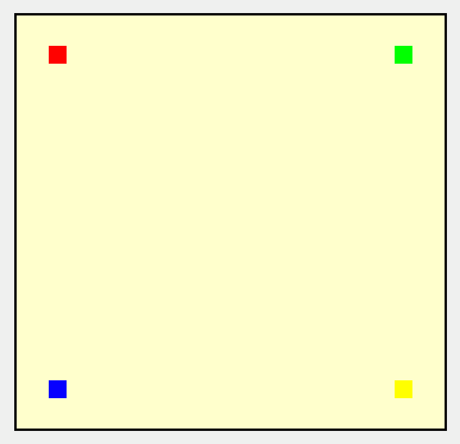
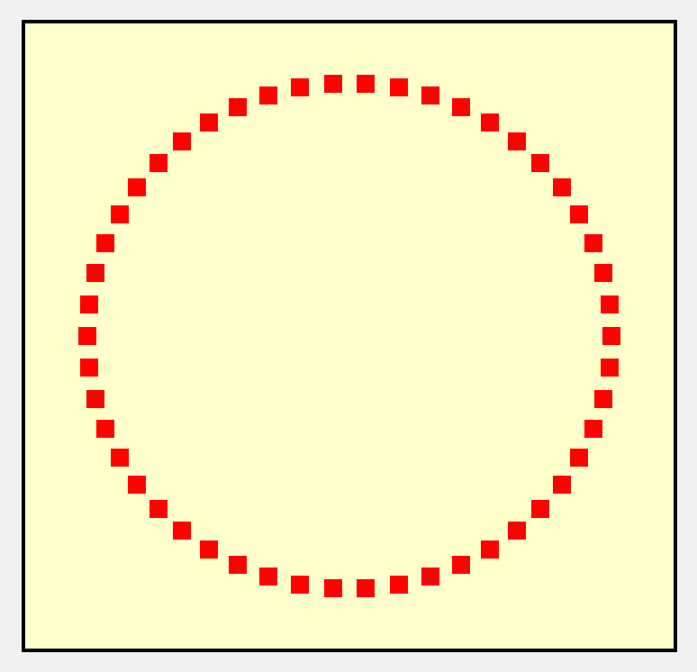

# The Vertex 
Function

So far, you’ve worked your way through 3D models and the graphics pipeline. Now, 
it’s time to look at the first of two programmable stages in Metal, the vertex stage — 
and more specifically, the vertex function.

99

Metal by Tutorials
Chapter 4: The Vertex Function

Shader Functions

When you define a shader function, you assign it an attribute. The attributes you’ll 
learn about in this book are:

• vertex: Vertex function: Calculates the position of a vertex.

• fragment: Fragment function: Calculates the color of a fragment.

• kernel: Kernel function: Used for general-purpose parallel computations, such 
as image processing.

In this chapter, you’ll focus only on the vertex function. In Chapter 7, “The Fragment 
Function”, you’ll explore how to control the color of each fragment. And in Chapter 
16, “GPU Compute Programming”, you’ll discover how to use parallel programming 
with multiple threads to write to buffers and textures.

By now, you should be familiar with vertex descriptors, and how to use them to 
describe how to lay out the vertex attributes from your loaded 3D model. To recap:

• MDLVertexDescriptor: You use a Model I/O vertex descriptor to read in the USD 
file. Model I/O creates buffers with the desired layout of attributes, such as 
position, normals and texture coordinates.

• MTLVertexDescriptor: You use a Metal vertex descriptor when creating the 
pipeline state. The GPU vertex function uses the [[stage_in]] attribute to match 
the incoming data with the vertex descriptor in the pipeline state.

As you work through this chapter, you’ll construct your own vertex mesh and send 
vertices to the GPU without using a vertex descriptor. You’ll learn how to manipulate 
these vertices in the vertex function, and then you’ll upgrade to using a vertex 
descriptor. In the process, you’ll see how using Model I/O to import your meshes 
does a lot of the heavy lifting for you.

The Starter Project

➤ Open the starter project for this chapter.

This SwiftUI project contains a reduced Renderer so that you can add your own 
mesh, and the shader functions are bare-bones so that you can build them up. You’re 
not doing any drawing yet, so there’s nothing to see when you run the app.

100

Metal by Tutorials
Chapter 4: The Vertex Function

Rendering a Quad

You create a quad using two triangles. Each triangle has three vertices, for a total of 
six vertices.

A quad mesh

➤ Create a new Swift file named Quad.swift.

➤ Replace the existing code with:

import MetalKit

struct Vertex { 
  var x: Float 
  var y: Float 
  var z: Float 
}

struct Quad { 
  var vertices: [Vertex] = [ 
    Vertex(x: -1, y:  1, z: 0),    // triangle 1 
    Vertex(x:  1, y: -1, z: 0), 
    Vertex(x: -1, y: -1, z: 0), 
    Vertex(x: -1, y:  1, z: 0),    // triangle 2 
    Vertex(x:  1, y:  1, z: 0), 
    Vertex(x:  1, y: -1, z: 0) 
  ] 
}

101

Metal by Tutorials
Chapter 4: The Vertex Function

You create a structure to make up a vertex with an x, y and z value. Here, the 
winding order (the vertex order) of the vertices is clockwise, which is important.

➤ Add a new vertex buffer property to Quad and initialize it:

let vertexBuffer: MTLBuffer

init(device: MTLDevice, scale: Float = 1) { 
  vertices = vertices.map { 
    Vertex(x: $0.x * scale, y: $0.y * scale, z: $0.z * scale) 
  } 
  guard let vertexBuffer = device.makeBuffer( 
    bytes: &vertices, 
    length: MemoryLayout<Vertex>.stride * vertices.count, 
    options: []) else { 
    fatalError("Unable to create quad vertex buffer") 
  } 
  self.vertexBuffer = vertexBuffer 
}

With this code, you initialize the Metal buffer with the array of vertices. You multiply 
each vertex by scale, which lets you set the size of the quad during initialization.

➤ Open Renderer.swift, and add a new property for the quad mesh:

lazy var quad: Quad = { 
  Quad(device: Self.device, scale: 0.8) 
}()

Here, you initialize quad with Renderer’s device. You must initialize quad lazily 
because device is not initialized until init(metalView:) is run. You also resize the 
quad so that you can see it properly.

Note: If you were to leave the scale at the default of 1.0, the quad would cover 
the entire screen. Covering the screen is useful for full-screen drawing since 
you can only draw fragments where you’re rendering geometry.

➤ In draw(in:), after // do drawing here, add:

renderEncoder.setVertexBuffer( 
  quad.vertexBuffer, 
  offset: 0, 
  index: 0)

102

Metal by Tutorials
Chapter 4: The Vertex Function

You create a command on the render command encoder to set the vertex buffer in 
the buffer argument table at index 0.

➤ Add the draw call:

renderEncoder.drawPrimitives( 
  type: .triangle, 
  vertexStart: 0, 
  vertexCount: quad.vertices.count)

Here, you draw the quad’s six vertices.

➤ Open Shaders.metal.

➤ Replace the vertex function with:

vertex float4 vertex_main( 
  constant float3 *vertices [[buffer(0)]], 
  uint vertexID [[vertex_id]]) 
{ 
  float4 position = float4(vertices[vertexID], 1); 
  return position; 
}

There’s an error with this code, which you’ll observe and fix shortly.

The GPU performs the vertex function for each vertex. In the draw call, you specified 
that there are six vertices. So, the vertex function will perform six times.

When you pass a pointer into the vertex function, you must specify an address space, 
either constant or device. constant is optimized for accessing the same variable 
over several vertex functions in parallel. device is best for accessing different parts 
of a buffer over the parallel functions — such as when using a buffer with points and 
color data interleaved.

[[vertex_id]] is an attribute qualifier that gives you the current vertex. You can 
use this as an entry into the array held in vertices.

You might notice that you’re sending the GPU a buffer that you filled with an array of 
Vertexs, consisting of three Floats. In the vertex function, you read the same buffer 
as an array of float3s, leading to an error in the display.

103

Metal by Tutorials
Chapter 4: The Vertex Function

➤ Build and run.

A rendering error

Although you might get a different render, the vertices are in the wrong position 
because a float3 type takes up more memory than Vertex with its three Float 
types. A Float is 4 bytes long, and Vertex is 12 bytes long. The SIMD float3 type is 
padded and takes up the same memory as the float4 type, which is 16 bytes. 
Changing this parameter to a packed_float3 will fix the error since a 
packed_float3 takes up 12 bytes.

Note: You can check the sizes of types in the Metal Shading Language 
Specification at https://apple.co/2UT993x.

➤ In the vertex function, change float3 in the first parameter to packed_float3.

➤ Build and run.

The rendering error corrected

The quad now displays correctly.  Alternatively, you could have defined the Float 
array vertices as an array of simd_float3. In that case, you’d use float3 in the 
vertex function, as both types take 16 bytes. However, sending 16 bytes per vertex is 
slightly less efficient than sending 12 bytes per vertex.

104

Metal by Tutorials
Chapter 4: The Vertex Function

Calculating Positions

Metal is all about gorgeous graphics and fast, smooth animation. As a next step, 
you’ll make your quad move up and down the screen. To do this, you’ll have a timer 
that updates every frame, and the position of each vertex will depend on this timer.

The vertex function is where you update vertex positions, so you’ll send the timer 
data to the GPU.

➤ Open Renderer.swift, and add a new property to Renderer:

➤ In draw(in:), right before:

➤ Add the following code:

// 1 
timer += 0.005 
var currentTime = sin(timer) 
// 2 
renderEncoder.setVertexBytes( 
  &currentTime, 
  length: MemoryLayout<Float>.stride, 
  index: 11)

Let’s have a closer look:

1. For every frame, you update the timer. You want your cube to move up and down 
the screen, so you’ll use a value between -1 and 1. Using sin() is a great way to 
achieve this balance as sine values are always -1 to 1. You can change the speed 
of your animation by changing the value that you add to this timer for each 
frame.

2. If you’re only sending a small amount of data, less than 4KB, to the GPU, 
setVertexBytes(_:length:index:) is an alternative to setting up an 
MTLBuffer. Here, you set currentTime to index 11 in the buffer argument table. 
Keeping buffers 1 through 10 for vertex attributes — such as vertex positions — 
helps you to remember which buffers hold what data.

105

Metal by Tutorials
Chapter 4: The Vertex Function

➤ Open Shaders.metal, and replace the vertex function:

vertex float4 vertex_main( 
  constant packed_float3 *vertices [[buffer(0)]], 
  constant float &timer [[buffer(11)]], 
  uint vertexID [[vertex_id]]) 
{ 
  float4 position = float4(vertices[vertexID], 1); 
  position.y += timer; 
  return position; 
}

You receive the single value timer as a float in buffer 11. You add the timer value to 
the y position and return the new position from the function.

In the next chapter, you’ll start learning how to project vertices into 3D space using 
matrix multiplication. But, you don’t always need matrix multiplication to move 
vertices; here, you can achieve the translation of the position in y using simple 
addition.

➤ Build and run the app, and you’ll see a lovely animated quad.

An animated quad

106

Metal by Tutorials
Chapter 4: The Vertex Function

More Efficient Rendering

Currently, you’re using six vertices to render two triangles.

The mesh of two triangles

Of those vertices, 0 and 3 are in the same position, as are 1 and 5. If you render a 
mesh with thousands — or even millions of vertices, it’s important to reduce 
duplication as much as possible. You can do this with indexed rendering.

Create a structure of only unique positions, and then use indices to get the right 
position for a vertex.

➤ Open Quad.swift, and rename vertices to oldVertices.

➤ Add the following structures to Quad:

var vertices: [Vertex] = [ 
  Vertex(x: -1, y:  1, z: 0), 
  Vertex(x:  1, y:  1, z: 0), 
  Vertex(x: -1, y: -1, z: 0), 
  Vertex(x:  1, y: -1, z: 0) 
]

var indices: [UInt16] = [ 
  0, 3, 2, 
  0, 1, 3 
]

vertices now holds the unique four points of the quad in any order. indices holds 
the index of each vertex in the correct vertex order. Refer to oldVertices to make 
sure your indices are correct.

107

Metal by Tutorials
Chapter 4: The Vertex Function

➤ Add a new Metal buffer to hold indices:

➤ At the end of init(device:scale:), add:

guard let indexBuffer = device.makeBuffer( 
  bytes: &indices, 
  length: MemoryLayout<UInt16>.stride * indices.count, 
  options: []) else { 
  fatalError("Unable to create quad index buffer") 
} 
self.indexBuffer = indexBuffer

You create the index buffer the same way you did the vertex buffer.

➤ Open Renderer.swift, and in draw(in:) before the draw call, add:

renderEncoder.setVertexBuffer( 
  quad.indexBuffer, 
  offset: 0, 
  index: 1)

Here, you send the index buffer to the GPU.

➤ Change the draw call to:

renderEncoder.drawPrimitives( 
  type: .triangle, 
  vertexStart: 0, 
  vertexCount: quad.indices.count)

Use the index count for the number of vertices to render; not the vertex count.

➤ Open Shaders.metal, and change the vertex function to:

vertex float4 vertex_main( 
  constant packed_float3 *vertices [[buffer(0)]], 
  constant ushort *indices [[buffer(1)]], 
  constant float &timer [[buffer(11)]], 
  uint vertexID [[vertex_id]]) 
{ 
  ushort index = indices[vertexID]; 
  float4 position = float4(vertices[index], 1); 
  return position; 
}

Here, vertexID is the index into the buffer holding the quad indices. You use the 
value in the indices buffer to index the correct vertex in the vertex buffer.

108

Metal by Tutorials
Chapter 4: The Vertex Function

➤ Build and run. Sure, your quad is positioned the same way as before, but now 
you’re sending less data to the GPU.

Indexed mesh

From the number of entries in arrays, it might appear as if you’re actually sending 
more data — but you’re not! The memory footprint of oldVertices is 72 bytes, 
whereas the footprint of vertices + indices is 60 bytes.

Vertex Descriptors

A more efficient draw call is available when you use indices for rendering vertices. 
However, you first need to set up a vertex descriptor in the pipeline.

It’s always a good idea to use vertex descriptors, as most often, you won’t only send 
positions to the GPU. You’ll also send attributes such as normals, texture coordinates 
and colors. When you can lay out your own vertex data, you have more control over 
how your engine handles model meshes.

➤ Create a new Swift file named VertexDescriptor.swift.

➤ Replace the code with:

import MetalKit

extension MTLVertexDescriptor { 
  static var defaultLayout: MTLVertexDescriptor { 
    let vertexDescriptor = MTLVertexDescriptor() 
    vertexDescriptor.attributes[0].format = .float3 
    vertexDescriptor.attributes[0].offset = 0 
    vertexDescriptor.attributes[0].bufferIndex = 0

109

Metal by Tutorials
Chapter 4: The Vertex Function

let stride = MemoryLayout<Vertex>.stride 
    vertexDescriptor.layouts[0].stride = stride 
    return vertexDescriptor 
  } 
}

Here, you set up a vertex layout that has only one attribute. This attribute describes 
the position of each vertex.

A vertex descriptor holds arrays of attributes and buffer layouts.

• attributes: For each attribute, you specify the type format and offset in bytes of 
the first item from the beginning of the buffer. You also specify the index of the 
buffer that holds the attribute.

• buffer layout: You specify the length of the stride of all attributes combined in 
each buffer. It may be confusing here as you’re using index 0 to index into both 
layouts and attributes, but the layouts index 0 corresponds to the 
bufferIndex 0 used by attributes.

Note: stride describes how many bytes are between each instance. Due to 
internal padding and byte alignment, this value can be different from size. 
For an excellent explanation of size, stride and alignment, check out Greg 
Heo’s article at https://bit.ly/2V3gBJl.

To the GPU, the vertexBuffer now looks like this:

Vertex buffer layout

➤ Open Renderer.swift, and locate where you create the pipeline state in 
init(metalView:).

110

Metal by Tutorials
Chapter 4: The Vertex Function

➤ Before creating the pipeline state in do {}, add the following code to the pipeline 
state descriptor:

pipelineDescriptor.vertexDescriptor = 
  MTLVertexDescriptor.defaultLayout

The GPU will now expect vertices in the format described by this vertex descriptor.

➤ In draw(in:), remove:

renderEncoder.setVertexBuffer( 
  quad.indexBuffer, 
  offset: 0, 
  index: 1)

You’ll include the index buffer in the draw call.

➤ Change the draw call to:

renderEncoder.drawIndexedPrimitives( 
  type: .triangle, 
  indexCount: quad.indices.count, 
  indexType: .uint16, 
  indexBuffer: quad.indexBuffer, 
  indexBufferOffset: 0)

This draw call expects the index buffer to use UInt16, which is how you described 
your indices array in Quad. You don’t explicitly send quad.indexBuffer to the GPU 
because this draw call will do it for you.

➤ Open Shaders.metal.

➤ Replace the vertex function with:

vertex float4 vertex_main( 
  float4 position [[attribute(0)]] [[stage_in]], 
  constant float &timer [[buffer(11)]]) 
{ 
  return position; 
}

You did all the heavy lifting for the layout on the Swift side, so that takes the size of 
the vertex function way down.

111

Metal by Tutorials
Chapter 4: The Vertex Function

You describe each per-vertex input with the [[stage_in]] attribute. The GPU now 
looks at the pipeline state’s vertex descriptor.

[[attribute(0)]] is the attribute in the vertex descriptor that describes the 
position. Even though you defined your original vertex data as type Vertex 
containing three Floats, you can define the position as float4 here. The GPU can 
make the conversion.

It’s worth noting that when the GPU adds the w information to the xyz position, it 
adds 1.0. As you’ll see in the following chapters, this w value is quite important 
during rasterization.

The GPU now has all of the information it needs to calculate the position for each 
vertex.

➤ Build and run the app to ensure that everything still works. The resulting render 
will be the same as before.

Rendering using a vertex descriptor

Adding Another Vertex Attribute

You probably won’t ever have just one attribute, so let’s add a color attribute for each 
vertex.

You have a choice whether to use two buffers or interleave the color between each 
vertex position. If you choose to interleave, you’ll set up a structure to hold 
position and color. In this example, however, it’s easier to add a new colors buffer 
to match each vertex.

112

Metal by Tutorials
Chapter 4: The Vertex Function

➤ Open Quad.swift, and add the new array:

var colors: [simd_float3] = [ 
  [1, 0, 0], // red 
  [0, 1, 0], // green 
  [0, 0, 1], // blue 
  [1, 1, 0]  // yellow 
]

You now have four RGB colors to match the four vertices.

➤ Create a new buffer property:

➤ At the end of init(device:scale:), add:

guard let colorBuffer = device.makeBuffer( 
  bytes: &colors, 
  length: MemoryLayout<simd_float3>.stride * colors.count, 
  options: []) else { 
    fatalError("Unable to create quad color buffer") 
  } 
self.colorBuffer = colorBuffer

You initialize colorBuffer the same way as the previous two buffers.

➤ Open Renderer.swift, and in draw(in:) right before the draw call, add:

renderEncoder.setVertexBuffer( 
  quad.colorBuffer, 
  offset: 0, 
  index: 1)

You send the color buffer to the GPU using buffer index 1, which must match the 
index in the vertex descriptor layout.

➤ Open VertexDescriptor.swift, and add the following code to defaultLayout 
before return:

vertexDescriptor.attributes[1].format = .float3 
vertexDescriptor.attributes[1].offset = 0 
vertexDescriptor.attributes[1].bufferIndex = 1 
vertexDescriptor.layouts[1].stride = 
  MemoryLayout<simd_float3>.stride

Here, you describe the layout of the color buffer in buffer index 1.

113

Metal by Tutorials
Chapter 4: The Vertex Function

➤ Open Shaders.metal.

➤ You can only use [[stage_in]] on one parameter, so create a new structure 
before the vertex function:

struct VertexIn { 
  float4 position [[attribute(0)]]; 
  float4 color [[attribute(1)]]; 
};

➤ Change the vertex function to:

vertex float4 vertex_main( 
  VertexIn in [[stage_in]], 
  constant float &timer [[buffer(11)]]) 
{ 
  return in.position; 
}

This code is still short and concise. The GPU knows how to retrieve position and 
color from the buffers because of the [[attribute(n)]] qualifier in the structure, 
which looks at the pipeline state’s vertex descriptor.

➤ Build and run to ensure your blue quad still renders.

Quad with two attributes

The fragment function determines the color of each rendered fragment. You need to 
pass the vertex’s color to the fragment function. You’ll learn more about the 
fragment function in Chapter 7, “The Fragment Function”.

➤ Still in Shaders.metal, add this structure before the vertex function:

struct VertexOut { 
  float4 position [[position]];

114

Metal by Tutorials
Chapter 4: The Vertex Function

float4 color; 
};

Instead of returning just the position from the vertex function, you’ll now return 
both position and color. You specify a position attribute to let the GPU know which 
property in this structure is the position.

➤ Replace the vertex function with:

vertex VertexOut vertex_main( 
  VertexIn in [[stage_in]], 
  constant float &timer [[buffer(11)]]) { 
  VertexOut out { 
   .position = in.position, 
   .color = in.color 
  }; 
  return out; 
}

You now return a VertexOut instead of a float4.

➤ Change the fragment function to:

fragment float4 fragment_main(VertexOut in [[stage_in]]) { 
  return in.color; 
}

The [[stage_in]] attribute indicates that the GPU should take the VertexOut 
output from the vertex function and match it with the rasterized fragments. Here, 
you return the vertex color. Remember from Chapter 3, “The Rendering Pipeline”, 
that each fragment’s input gets interpolated.

➤ Build and run the app, and you’ll see the quad rendered with beautiful colors.

Interpolated vertex colors

115

Metal by Tutorials
Chapter 4: The Vertex Function

Rendering Points

Instead of rendering triangles, you can render points and lines.

➤ Open Renderer.swift, and in draw(in:), change:

renderEncoder.drawIndexedPrimitives( 
  type: .triangle,

➤ To:

renderEncoder.drawIndexedPrimitives( 
  type: .point,

If you build and run now, the GPU will render the points, but it doesn’t know what 
point size to use, so it flickers over various point sizes. To fix this problem, you’ll 
also return a point size when returning data from the vertex function.

➤ Open Shaders.metal, and add this property to VertexOut:

The [[point_size]] attribute will tell the GPU what point size to use.

➤ In vertex_main, replace the initialization of out with:

VertexOut out { 
  .position = in.position, 
  .color = in.color, 
  .pointSize = 30 
};

Here, you assign the point size of 30.

➤ Build and run to see your points rendered with their vertex color:

Rendering points

116

Metal by Tutorials
Chapter 4: The Vertex Function

Challenge

So far, you’ve sent vertex positions to the GPU in an array buffer. But this isn’t 
entirely necessary. All the GPU needs to know is how many vertices to draw. Your 
challenge is to remove the vertex and index buffers, and draw 50 points in a circle. 
Here’s an overview of the steps you’ll need to take, along with some code to get you 
started:

1. In Renderer, remove the vertex descriptor from the pipeline.

2. Replace the draw call in Renderer so that it doesn’t use indices but does draw 50 
vertices.

3. In draw(in:), remove all of the setVertexBuffer commands.

4. The GPU will need to know the total number of points, so send this value the 
same way you did timer in buffer 0.

5. Replace the vertex function with:

vertex VertexOut vertex_main( 
  constant uint &count [[buffer(0)]], 
  constant float &timer [[buffer(11)]], 
  uint vertexID [[vertex_id]]) 
{ 
  float radius = 0.8; 
  float pi = 3.14159; 
  float current = float(vertexID) / float(count); 
  float2 position; 
  position.x = radius * cos(2 * pi * current); 
  position.y = radius * sin(2 * pi * current); 
  VertexOut out { 
      .position = float4(position, 0, 1), 
      .color = float4(1, 0, 0, 1), 
      .pointSize = 20 
  }; 
  return out; 
}

117

Metal by Tutorials
Chapter 4: The Vertex Function

Remember, this is an exercise to help you understand how to position points on the 
GPU without holding any equivalent data on the Swift side. So, don’t worry too much 
about the math. You can use the sine and cosine of the current vertex ID to plot the 
point around a circle.

Notice that there’s no built-in value for pi on the GPU.

You’ll see your 50 points plotted into a circle.

Points in a circle

Try animating the points by adding timer to current.

If you have any difficulties, you can find the solution in the project challenge 
directory for this chapter.

118

Metal by Tutorials
Chapter 4: The Vertex Function

Key Points

• The vertex function’s fundamental task is positioning vertices. When you render a 
model, you send the GPU the model’s vertices in its original position. The vertex 
shader will then reposition those vertices to the correct spot in your 3D world.

• Shader code uses attributes such as [[buffer(0)]] and [[position]] 
extensively. To find out more about these attributes, refer to the Metal Shading 
Language specification document (https://apple.co/3hPTbjQ).

• You can pass any data in an MTLBuffer to the GPU using 
setVertexBuffer(_:offset:index:). If the data is less than 4KB, you don’t have 
to set up a buffer; you can, instead, pass a structure using 
setVertexBytes(_:length:index:).

• When possible, use indexed rendering. With indexed rendering, you pass less data 
to the GPU — and memory bandwidth is a major bottleneck.

• When possible, use vertex descriptors. With vertex descriptors, the GPU knows the 
format of the data being passed, and you’ll get fewer errors in your code when you 
change a type on the Swift side and forget to change the shader function.

119

5