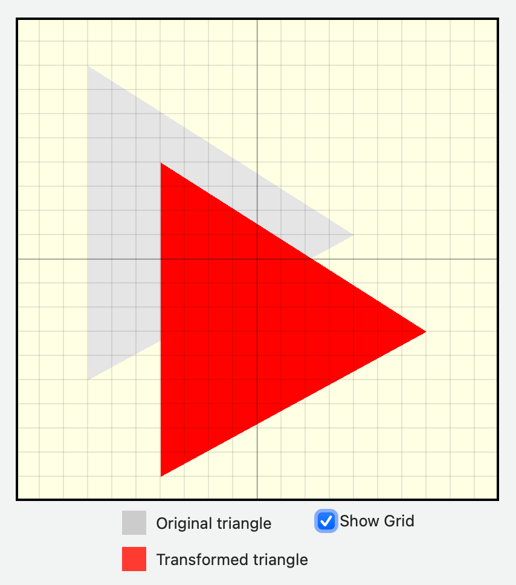
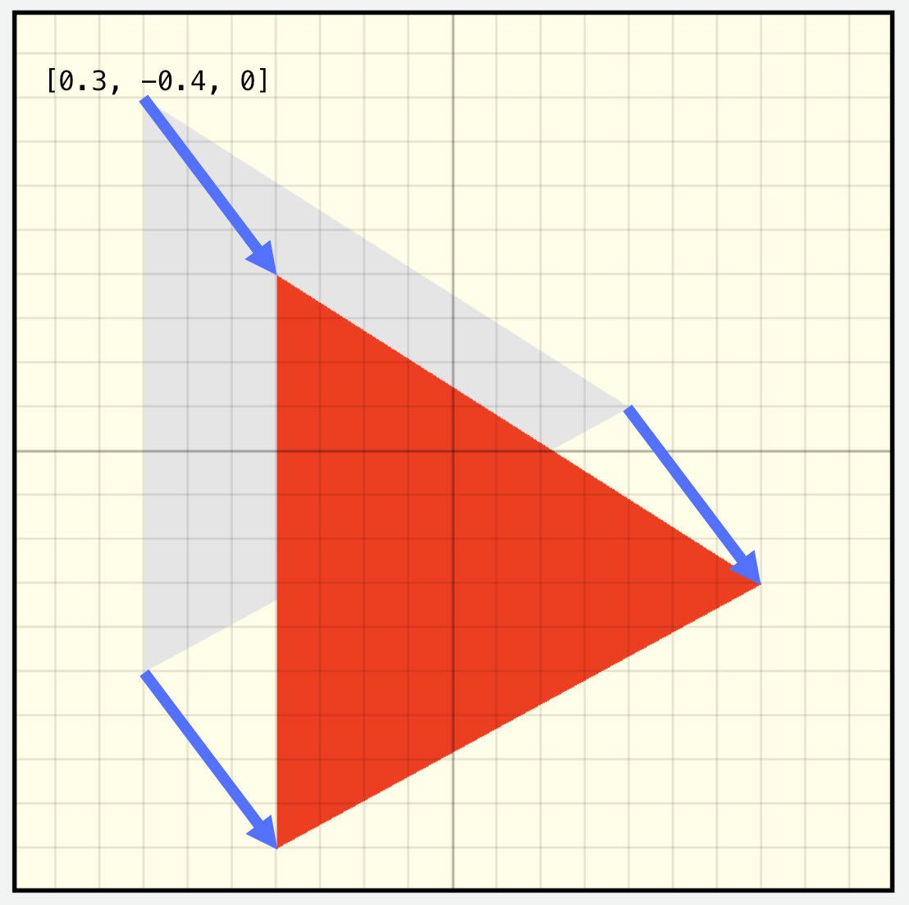
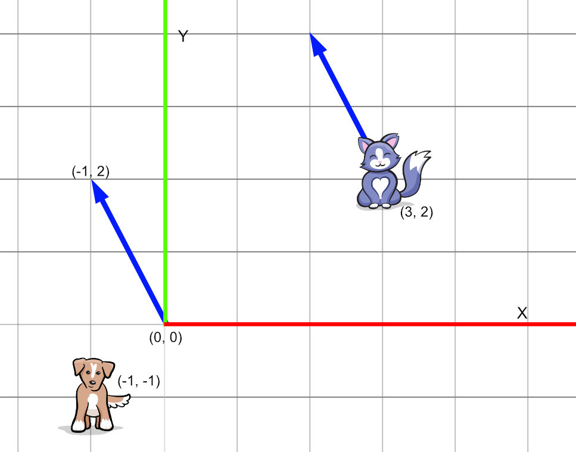
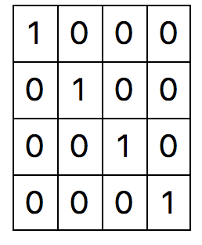
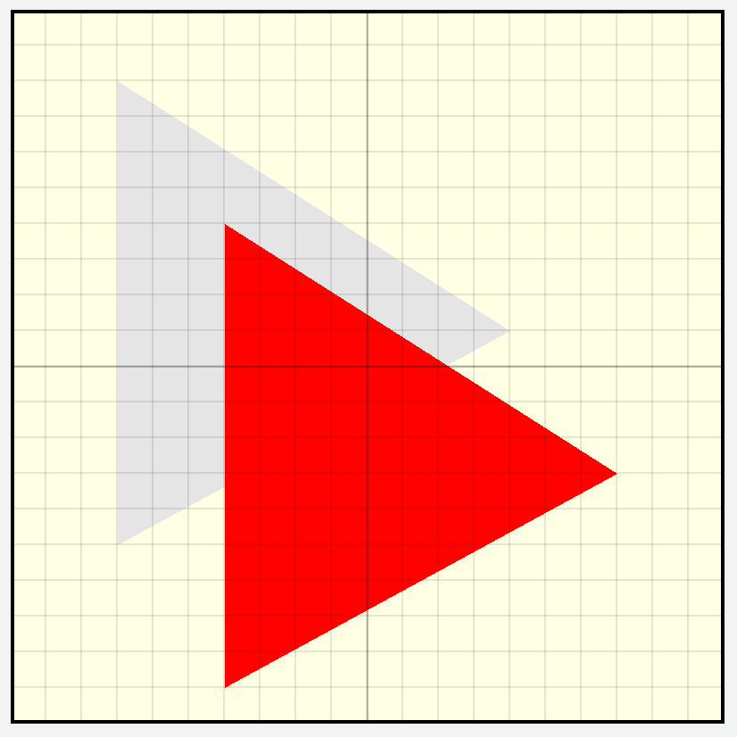
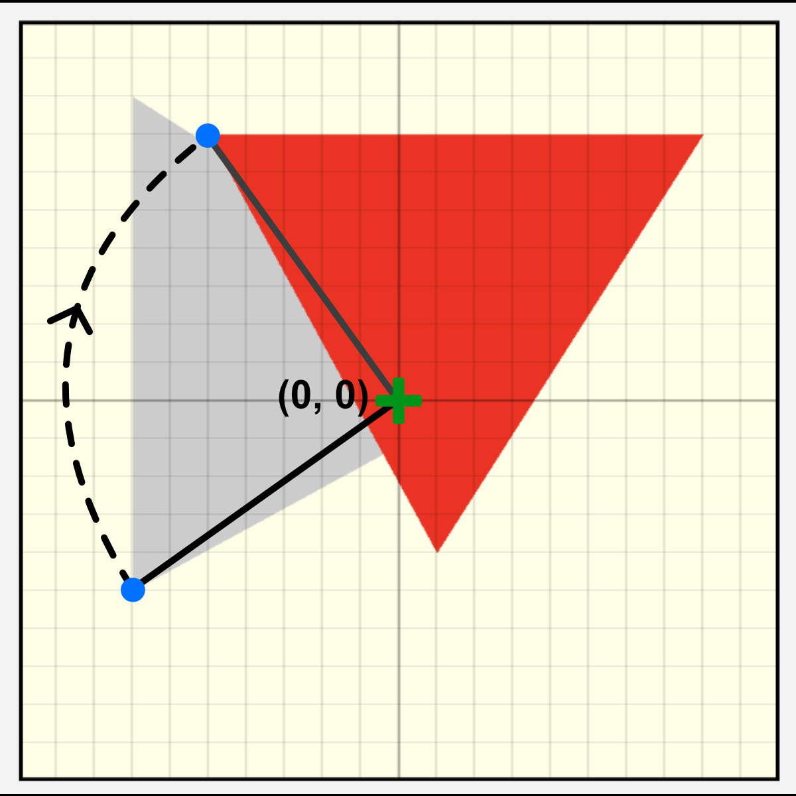
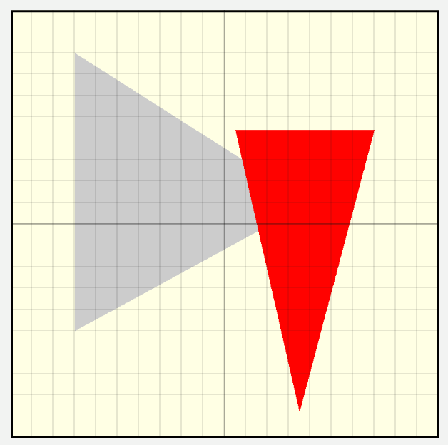
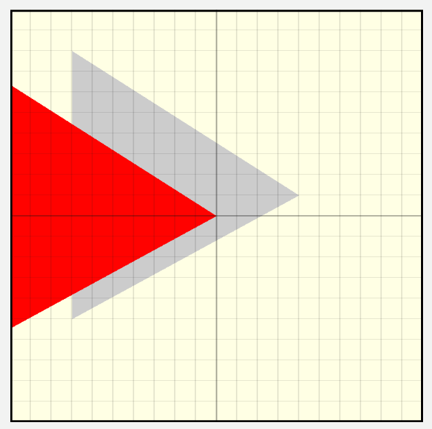
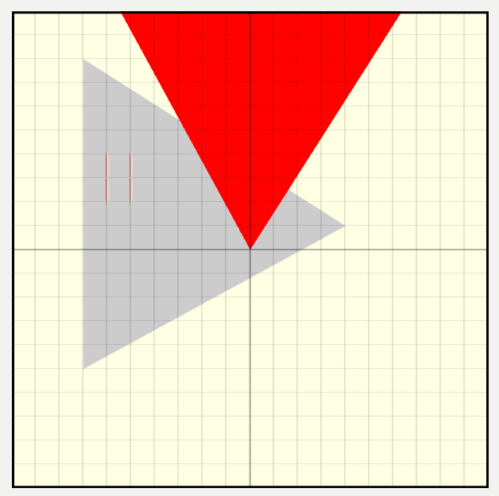
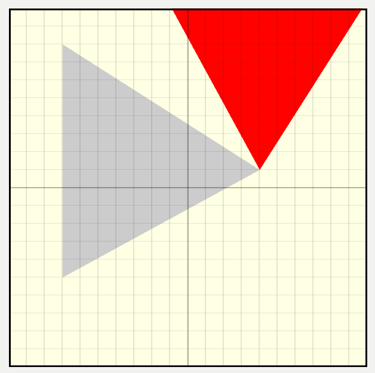

# 3D 
Transformations

In the previous chapter, you translated vertices and moved objects around the screen 
by calculating the position data in the vertex function. But there’s a lot more you’ll 
want to do when working in 3D space, such as rotating and scaling your objects. 
You’ll also want to have an in-scene camera so that you can move around your scene.

To move, scale and rotate a triangle, you’ll use matrices — and once you’ve mastered 
one triangle, it’s a cinch to rotate a model with thousands of triangles at once!

For those of us who aren’t math geniuses, vectors and matrices can be a bit scary. 
Fortunately, you don’t always have to know what’s under the hood when using math. 
To help, this chapter focuses not on the math, but the matrices. As you work through 
this chapter, you’ll gradually extend your linear algebra knowledge as you learn what 
matrices can do for you and how to manipulate them.

120

Metal by Tutorials
Chapter 5: 3D Transformations

Transformations

Look at the following picture.

Affine Transformations

Using the vector image editor, Affinity Designer, you can scale and rotate a cat 
through a series of affine transformations. Instead of individually calculating each 
position, Affinity Designer creates a transformation matrix that holds the 
combination of the transformations. It then applies the transformation to each 
element.

Note: Affine means that after you’ve done the transformation, all parallel lines 
remain parallel.

Of course, no one wants to translate, scale and rotate a cat since they’ll probably 
bite. So instead, you’ll translate, scale and rotate a triangle.

121

Metal by Tutorials
Chapter 5: 3D Transformations

The Starter Project & Setup

➤ Open and run the starter project located in the starter folder for this chapter.

The starter project

This project renders a Triangle twice rather than a Quad.

In Renderer, in draw(in:), you’ll see two draw calls (one for each triangle). 
Renderer passes position to the vertex function and color to the fragment 
function; it does this for each triangle. The gray triangle is at its original position, 
and the red triangle has transformations.

➤ Before moving on to the next step, make sure you understand the code in 
Renderer’s draw(in:) and the vertex function in Shaders.metal.

ContentView.swift is now located in the group SwiftUI Views, and it displays a grid 
over the metal view so that you can visualize your vertex positions more easily.

122

Metal by Tutorials
Chapter 5: 3D Transformations

Translation

The starter project renders two triangles:

• A gray triangle without any transformations.

• A red triangle translated with position = simd_float3(0.3, -0.4, 0).

Displacement Vectors

In the first challenge in the previous chapter, you calculated the position of each 
vertex in the shader function. A more common computer graphics paradigm is to set 
the position of each vertex of the model in the vertex buffer, usually loaded from a 
file, and then send a matrix to the vertex shader that contains the model’s current 
position, rotation and scale.

Vectors & Matrices

You can better describe position as a displacement vector of [0.3, -0.4, 0]. 
You move each vertex 0.3 units in the x-direction, and -0.4 in the y-direction from its 
starting position.

123

Metal by Tutorials
Chapter 5: 3D Transformations

In the following image, the blue arrows are vectors.

Vectors

The left blue arrow is a vector with a value of [-1, 2]. The right blue arrow — the one 
near the cat — is also a vector with a value of [-1, 2]. Positions (points) are locations 
in space, whereas vectors are displacements in space. In other words, a vector 
contains the amount and direction to move. If you were to displace the cat by the 
blue vector, it would end up at point (2, 4). That’s the cat’s position (3, 2) plus the 
vector [-1, 2].

This 2D vector is a 1x2 matrix. It has one column and two rows.

Note: You can order Matrices by rows or columns. The simd library constructs 
matrices in column-major order, which means that columns are contiguous in 
memory. A simd_double2x4 is a matrix of two columns and four rows.

124

Metal by Tutorials
Chapter 5: 3D Transformations

A matrix is a two-dimensional array. Even the single number 1 is a 1×1 matrix. In 
fact, the number 1 is unique in that when you multiply a number by 1, the answer is 
always that number. All square matrices — where the array width is the same as the 
array height — have a matrix with this same property. It’s called the identity matrix. 
Any vector or matrix multiplied by an identity matrix returns the same value.

A 4×4 identity matrix looks like this (all zeros, except for the diagonal 1s):

An identity matrix

A 3D transformation matrix has four rows and four columns. A transformation 
matrix holds scaling and rotation information in the upper left 3×3 matrix, with the 
translation information in the last column. When you multiply vectors and matrices, 
the number of columns of the left side matrix or vector must equal the number of 
rows of the right side. For example, you can’t multiply a float3 by a float4×4.

The Magic of Matrices

When you multiply matrices, you combine them into one matrix. You can then 
multiply a vector by this matrix to transform the vector. For example, you can set up 
a rotation matrix and a translation matrix. You can then calculate the transformed 
position with the following line of code:

Matrix multiplication goes from right to left. Here, the rotation is applied to the 
position before the translation.

This is a fundamental of linear algebra — and if you want to continue with computer 
graphics, you’ll need to understand linear algebra more fully. For now, understanding 
the concepts of setting up a transformation matrix can take you a long way.

125

Metal by Tutorials
Chapter 5: 3D Transformations

Creating a Matrix

➤ Open Renderer.swift, and locate where you render the first gray triangle in 
draw(in:).

➤ Change the position code from:

var position = simd_float3(0, 0, 0) 
renderEncoder.setVertexBytes( 
  &position, 
  length: MemoryLayout<SIMD3<Float>>.stride, 
  index: 11)

➤ To:

var translation = matrix_float4x4() 
translation.columns.0 = [1, 0, 0, 0] 
translation.columns.1 = [0, 1, 0, 0] 
translation.columns.2 = [0, 0, 1, 0] 
translation.columns.3 = [0, 0, 0, 1] 
var matrix = translation 
renderEncoder.setVertexBytes( 
  &matrix, 
  length: MemoryLayout<matrix_float4x4>.stride, 
  index: 11)

Here, you create an identity matrix and a render command to send to the GPU.

➤ Locate the position code for the second red triangle and change:

position = simd_float3(0.3, -0.4, 0) 
renderEncoder.setVertexBytes( 
  &position, 
  length: MemoryLayout<SIMD3<Float>>.stride, 
  index: 11)

➤ To:

let position = simd_float3(0.3, -0.4, 0) 
translation.columns.3.x = position.x 
translation.columns.3.y = position.y 
translation.columns.3.z = position.z 
matrix = translation 
renderEncoder.setVertexBytes( 
  &matrix, 
  length: MemoryLayout<matrix_float4x4>.stride, 
  index: 11)

126

Metal by Tutorials
Chapter 5: 3D Transformations

You’ll use this matrix to translate the position in the vertex shader.

➤ Open Shaders.metal, and change:

➤ To:

You receive the matrix into the shader.

➤ In the vertex function, change:

➤ To:

You use the fourth column of the matrix as the displacement vector.

➤ Build and run. So far, the output is the same.

Translation by adding a matrix column to the position

127

Metal by Tutorials
Chapter 5: 3D Transformations

Remember this matrix is also going to hold rotation and scaling information. To 
calculate the position, instead of adding the translation displacement vector, you’ll 
do matrix multiplication.

➤ Change the contents of the vertex function to:

float4 translation = matrix * in.position; 
VertexOut out { 
  .position = translation 
}; 
return out;

➤ Build and run the app, and you’ll see there’s still no change.

You can now add scaling and rotation to the matrix in Renderer without having to 
change the shader function each time.

Scaling

➤ Open Renderer.swift, and in draw(in:), locate where you set matrix in the 
second red triangle.

➤ Before matrix = translation, add this:

let scaleX: Float = 1.2 
let scaleY: Float = 0.5 
let scaleMatrix = float4x4( 
  [scaleX, 0,   0,   0], 
  [0, scaleY,   0,   0], 
  [0,      0,   1,   0], 
  [0,      0,   0,   1])

Instead of assigning to columns as you did for the translation, you can initialize a 
matrix like this, defining the columns as arrays. scaleMatrix.columns.0 now 
contains [1.2, 0, 0, 0]

Without going into mathematics too much, you can use this code to set up a scale 
matrix.

➤ Change matrix = translation to:

You multiply the translation matrix by the scale matrix instead of the translation 
matrix.

128

Metal by Tutorials
Chapter 5: 3D Transformations

➤ Build and run the app.

Scaling with a matrix

In the vertex function, the matrix multiplies each vertex of the triangle by the x and 
y scales.

➤ Change matrix = scaleMatrix to:

This code translates the scaled triangle.

➤ Build and run the app.

A translated and scaled triangle

129

Metal by Tutorials
Chapter 5: 3D Transformations

Rotation

You perform rotation in a similar way to scaling.

➤ Change matrix = translation * scaleMatrix, to this:

let angle = Float.pi / 2.0 
let rotationMatrix = float4x4( 
  [cos(angle), -sin(angle), 0,    0], 
  [sin(angle),  cos(angle), 0,    0], 
  [0,           0,          1,    0], 
  [0,           0,          0,    1]) 
 
matrix = rotationMatrix

Here, you set a rotation around the z-axis of the angle in radians.

Note: Float.pi / 2.0 is the same as 90º, which is 1.5708 radians. A radian is 
the standard unit in computer graphics. This is the formula to convert degrees 
to radians: degrees * pi / 180 = radians.

➤ Build and run, and you’ll see how each of the vertices of the red triangle are 
rotated by 90º around the origin [0, 0, 0].

Rotating about the origin

130

Metal by Tutorials
Chapter 5: 3D Transformations

➤ Replace matrix = rotationMatrix with:

This code first scales each vertex, then rotates, then translates.

➤ Build and run.

Scale, rotate and translate

The order of matrix operations is important. Experiment with changing the order 
to see what happens.

Scaling and rotation take place at the origin point (coordinates [0, 0, 0]). There 
may be times, however, that you want the rotation to take place around a different 
point. For example, let’s rotate the triangle around the right-most point of the 
triangle when it’s in its identity position (i.e., the same position and rotation as the 
gray triangle).

To rotate the triangle, you’ll set up a translation matrix with the vector between the 
origin and the right-most point, taking the following steps:

1. Translate all the vertices using the translation matrix.

2. Rotate.

3. Translate back again.

131

Metal by Tutorials
Chapter 5: 3D Transformations

➤ Before setting matrix in the red triangle, add this code:

translation.columns.3.x = triangle.vertices[2].x 
translation.columns.3.y = triangle.vertices[2].y 
translation.columns.3.z = triangle.vertices[2].z

You set the translation matrix to move to the third vertex of the triangle, which is 
the right-most point.

Remember the steps. Step 1 is to translate all of the vertices by the distance from the 
origin. You can achieve this by setting a matrix to the vertex’s vector value and using 
the translate matrix’s inverse.

Don’t forget to build and run the app after each of the following steps so that you 
can see what the matrix multiplication is doing.

➤ Change matrix = translation * rotationMatrix * scaleMatrix to:

This code places the right-most vertex at the origin, translating all other vertices by 
the same amount.

Rotate about a point (1)

➤ Change the code you just entered to:

132

Metal by Tutorials
Chapter 5: 3D Transformations

The triangle rotates by 90º around the origin.

Rotate about a point (2)

➤ Change the code you just entered to:

Fantastic! You’re doing all of the steps of translating each vertex by the distance of 
the right-most vertex from the origin. After that, you’re rotating each vertex and 
translating it back again, causing the triangle to rotate around its right-most point.

Rotate about a point (3)

133

Metal by Tutorials
Chapter 5: 3D Transformations

Key Points

• A vector is a matrix with only one row or column.

• By combining three matrices for translation, rotation and scale, you can position a 
model anywhere in the scene.

• In the resources folder for this chapter, references.markdown suggests further 
reading to help better understand transformations with linear algebra.

134

6