# Coordinate 
Spaces

To easily find a point on a grid, you need a coordinate system. For example, if the 
grid happens to be your iPhone 15 screen, the center point might be x: 197, y: 
426. However, that point may be different depending on what space it’s in.

In the previous chapter, you learned about matrices. By multiplying a vertex’s 
position by a particular matrix, you can convert the vertex position to a different 
coordinate space. There are typically six spaces a vertex travels as its making its 
way through the pipeline:

• Object

• World

• Camera

• Clip

• NDC (Normalized Device Coordinate)

• Screen

Since this is starting to read like a description of Voyager leaving our solar system, 
let’s have a quick conceptual look at each coordinate space before attempting the 
conversions.

135

Metal by Tutorials
Chapter 6: Coordinate Spaces

Object Space

If you’re familiar with the Cartesian coordinate system, you know that it uses two 
points to map an object’s location. The following image shows a 2D grid with the 
possible vertices of the dog mapped using Cartesian coordinates.

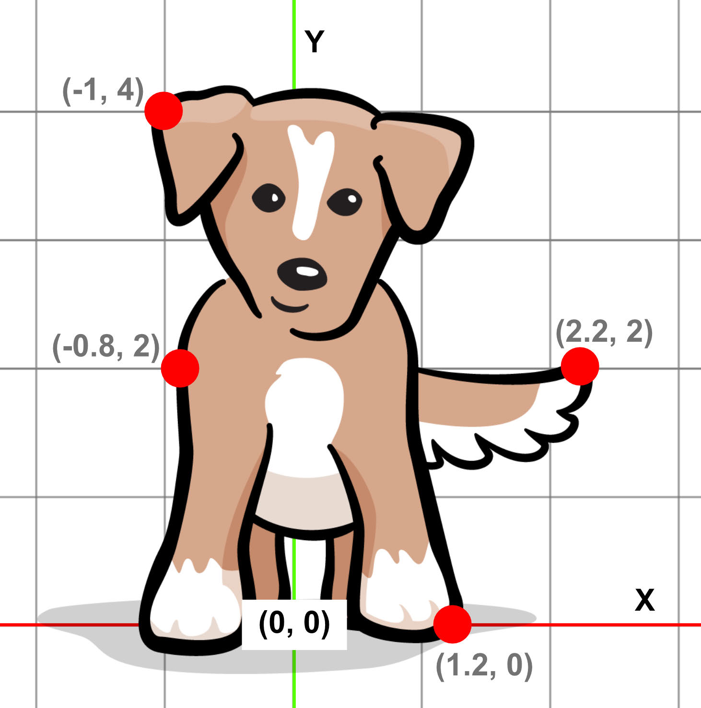

Vertices in object space

The positions of the vertices are in relation to the dog’s origin, which is located at 
(0, 0). The vertices in this image are located in object space (or local or model 
space). In the previous chapter, Triangle held an array of vertices in object space, 
describing the vertex of each point of the triangle.

World Space

In the following image, the direction arrows mark the world’s origin at (0, 0, 0). 
So, in world space, the dog is at (1, 0, 1) and the cat is at (-1, 0, -2).

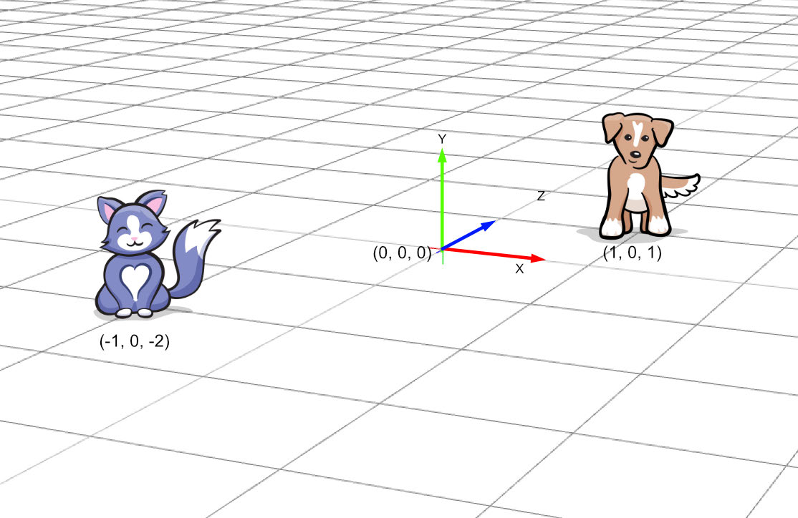

Vertices in world space

136

Metal by Tutorials
Chapter 6: Coordinate Spaces

Of course, we all know that cats always see themselves at the center of the universe, 
so, naturally, the cat is located at (0, 0, 0) in cat space. This cat space location 
makes the dog’s position, (2, 0, 3), relative to the cat. When the cat moves around 
in his cat space, he remains at (0, 0, 0), while the position of everything else 
changes relative to the cat.

Note: Cat space is not recognized as a traditional 3D coordinate space, but 
mathematically, you can create your own space and use any position in the 
universe as the origin. Every other point in the universe is now relative to that 
origin. In a later chapter, you’ll discover other spaces besides the ones 
described here.

Camera Space

Enough about the cat. Let’s move on to the dog. For him, the center of the universe is 
the person holding the camera. So, in camera space (or view space), the camera is at 
(0, 0, 0) and the dog is approximately at (-3, -2, 7). When the camera moves, 
it stays at (0, 0, 0), but the positions of the dog and cat move relative to the 
camera.

Clip Space

The main reason for doing all this math is to project with perspective. In other 
words, you want to take a three-dimensional scene into a two-dimensional space. 
Clip space is a distorted cube that’s ready for flattening.

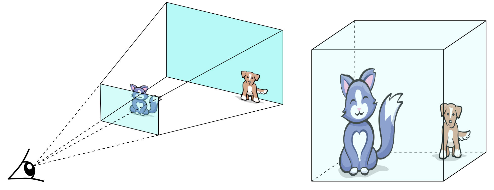

Clip space

137

Metal by Tutorials
Chapter 6: Coordinate Spaces

In this scene, the dog and the cat are the same size, but the dog appears smaller 
because of its location in 3D space. Here, the dog is farther away than the cat, so he 
looks smaller.

Note: You could use orthographic or isometric projection instead of 
perspective projection, which comes in handy if you’re rendering engineering 
drawings.

NDC (Normalized Device Coordinate) Space

Projection into clip space creates a half cube of w size. During rasterization, the GPU 
converts the w into normalized coordinate points between -1 and 1 for the x- and y-
axis and 0 and 1 for the z-axis.

Screen Space

Now that the GPU has a normalized cube, it will flatten clip space into two 
dimensions and convert everything into screen coordinates, ready to display on the 
device’s screen.

In this final image, the flattened scene has perspective — with the dog being smaller 
than the cat, indicating the distance between the two.

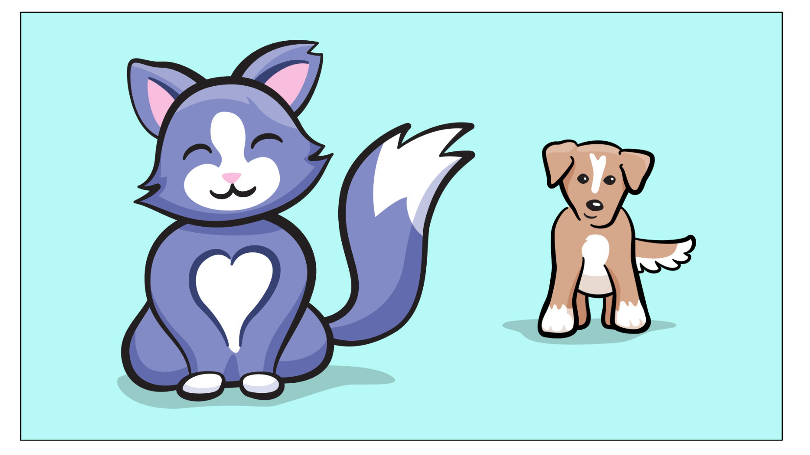

Final render

138

Metal by Tutorials
Chapter 6: Coordinate Spaces

Converting Between Spaces

To convert from one space to another, you can use transformation matrices. In the 
following image, the vertex on the dog’s ear is (-1, 4, 0) in object space. But in 
world space, the origin is different, so the vertex — judging from the image — is at 
about (0.75, 1.5, 1).

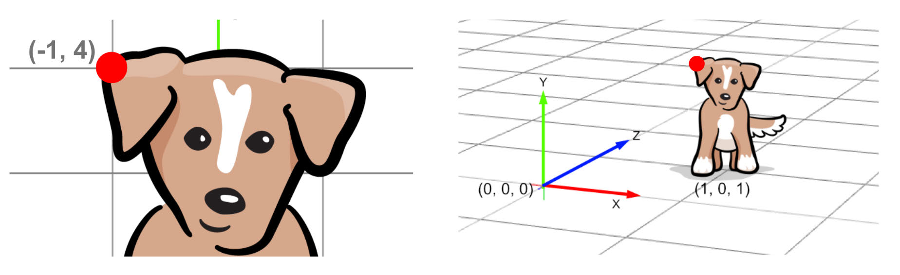

Converting object to world

To change the dog vertex positions from object space to world space, you can 
translate (move) them using a transformation matrix. Since you control four spaces, 
you have access to three corresponding matrices:

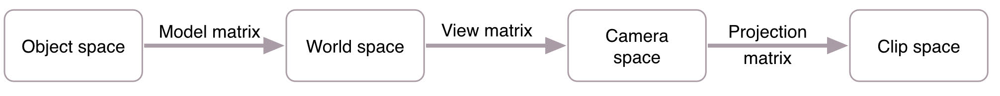

The three transformation matrices

• Model matrix: between object and world space

• View matrix: between world and camera space

• Projection matrix: between camera and clip space

Coordinate Systems

Different graphics APIs use different coordinate systems. You already found out that 
Metal’s NDC (Normalized Device Coordinates) uses 0 to 1 on the z-axis. You also 
may already be familiar with OpenGL, which uses 1 to -1 on the z-axis.

In addition to being different sizes, OpenGL’s z-axis points in the opposite direction 
from Metal’s z-axis. That’s because OpenGL’s system is a right-handed coordinate 
system, and Metal’s system is a left-handed coordinate system. Both systems use x 
to the right and y as up.

139

Metal by Tutorials
Chapter 6: Coordinate Spaces

Blender uses a different coordinate system, where z is up, and y is into the screen.

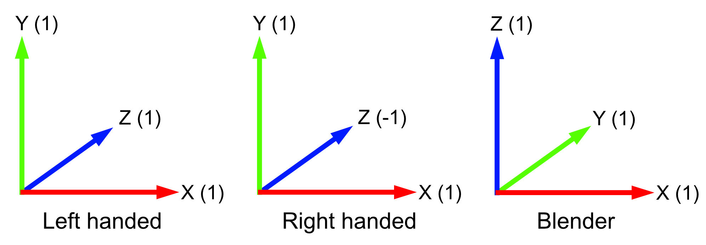

Coordinate systems

If you’re consistent with your coordinate system and create matrices accordingly, it 
doesn’t matter what coordinate system you use. In this book, we’re using Metal’s 
left-handed coordinate system, but we could have used a right-handed coordinate 
system with different matrix creation methods instead.

The Starter Project

With a better understanding of coordinate systems and spaces, you’re ready to start 
creating matrices.

➤ In Xcode, open the starter project for this chapter and build and run the app.

The project is similar to the playground you set up in Chapter 2, “3D Models”, where 
you rendered train.usdz.

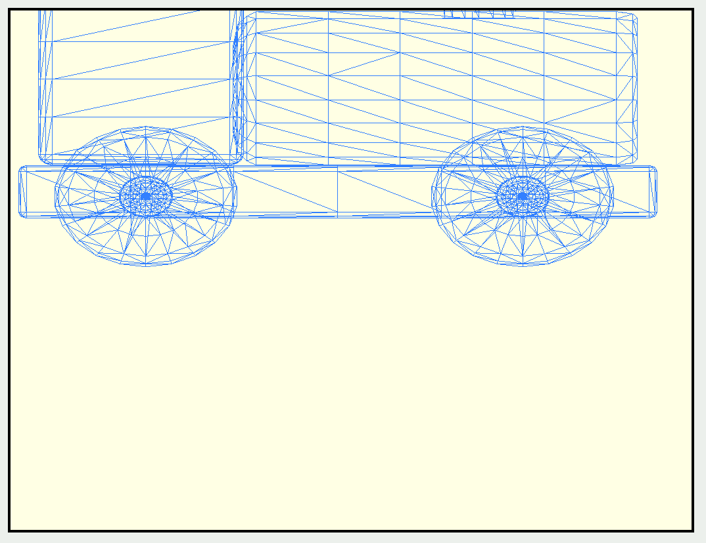

Starter project

140

Metal by Tutorials
Chapter 6: Coordinate Spaces

MathLibrary.swift — located in the Utility group — contains methods that are 
extensions on float4x4 for creating the translation, scale and rotation matrices. 
This file also contains typealiases for float2/3/4, so you don’t have to type 
simd_float2/3/4.

Model.swift contains the model initialization and loading code.

Rendering.swift has an extension on Model. You call Model.render(encoder:) 
from Renderer’s draw(in:) to render the model.

VertexDescriptor.swift creates a default MDLVertexDescriptor. The default 
MTLVertexDescriptor is derived from this descriptor. When using Model I/O to load 
models with vertex descriptors, the code can get a bit lengthy. Rather than creating 
an MTLVertexDescriptor, it’s easier to create a Model I/O MDLVertexDescriptor 
and then convert to the MTLVertexDescriptor that the pipeline state object needs 
using MTKMetalVertexDescriptorFromModelIO(_:). If you examine the vertex 
descriptor code from the previous chapter, the same process is used for both vertex 
descriptors. You describe attributes and layouts.

At the moment, your train:

• Takes up the entire width of the screen.

• Has no depth perspective.

• Stretches to fit the size of the application window.

You can decouple the train’s vertex positions from the window size by taking the 
train into other coordinate spaces. The vertex function is responsible for converting 
the model vertices through these various coordinate spaces, and that’s where you’ll 
perform the matrix multiplications that do the conversions between different spaces.

Uniforms

Constant values that are the same across all vertices or fragments are generally 
referred to as uniforms. The first step is to create a uniform structure to hold the 
conversion matrices. After that, you’ll apply the uniforms to every vertex.

Both the shaders and the code on the Swift side will access these uniform values. If 
you were to create a structure in Renderer and a matching structure in 
Shaders.metal, there’s a good chance you’ll forget to keep them synchronized. 
Therefore, the best approach is to create a bridging header that both C++ and Swift 
can access.

141

Metal by Tutorials
Chapter 6: Coordinate Spaces

You’ll do that now:

➤ Using the macOS Header File template, create a new file in the Shaders group 
and name it Common.h.

➤ In the Project navigator, click the main Spaces project folder.

➤ Select the project Spaces, and then select Build Settings along the top. Make sure 
All and Combined are highlighted.

➤ In the search bar, type bridg to filter the settings. Double-click the Objective-C 
Bridging Header value and enter Spaces/Shaders/Common.h.

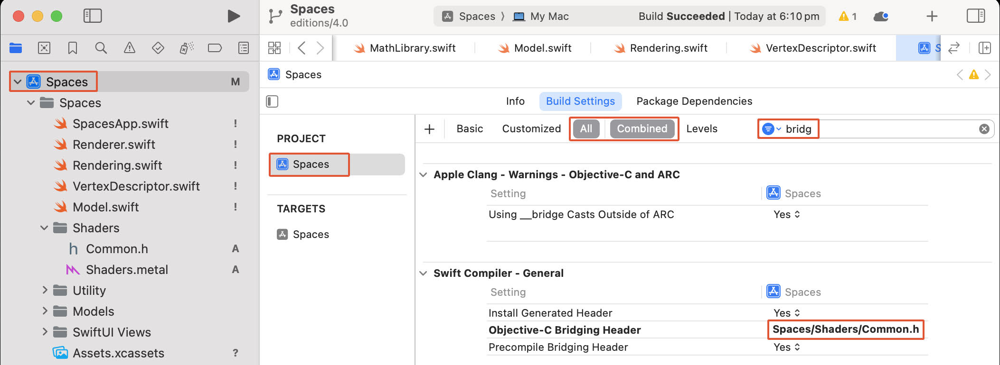

Setting up the bridging header

This configuration tells Xcode to use this file for both the C++ derived Metal Shading 
Language and Swift.

➤ In Common.h before the final #endif, add the following code:

This code imports the simd framework, which provides types and functions for 
working with vectors and matrices.

➤ Next, add the uniforms structure:

typedef struct { 
  matrix_float4x4 modelMatrix; 
  matrix_float4x4 viewMatrix; 
  matrix_float4x4 projectionMatrix; 
} Uniforms;

These three matrices — each with four rows and four columns — will hold the 
necessary conversion between the spaces.

142

Metal by Tutorials
Chapter 6: Coordinate Spaces

The Model Matrix

Your train vertices are currently in object space. To convert these vertices to world 
space, you’ll use modelMatrix. By changing modelMatrix, you’ll be able to translate, 
scale and rotate your train.

➤ In Renderer.swift, add the new structure to Renderer:

You defined Uniforms in Common.h (the bridging header file), so Swift is able to 
recognize the Uniforms type.

➤ At the bottom of init(metalView:), add:

let translation = float4x4(translation: [0.5, -0.4, 0]) 
let rotation = 
  float4x4(rotation: [0, 0, Float(45).degreesToRadians]) 
uniforms.modelMatrix = translation * rotation

Here, you use the matrix utility methods in MathLibrary.swift. You set 
modelMatrix to have a translation of 0.5 units to the right, 0.4 units down and a 
counterclockwise rotation of 45 degrees.

➤ In draw(in:) before model.render(encoder: renderEncoder), add this:

renderEncoder.setVertexBytes( 
  &uniforms, 
  length: MemoryLayout<Uniforms>.stride, 
  index: 11)

This code sets up the uniform matrix values on the Swift side.

➤ Open Shaders.metal, and import the bridging header file after setting the 
namespace:

➤ Change the vertex function to:

vertex VertexOut vertex_main( 
  VertexIn in [[stage_in]], 
  constant Uniforms &uniforms [[buffer(11)]]) 
{ 
  float4 position = uniforms.modelMatrix * in.position; 
  VertexOut out { 
    .position = position

143

Metal by Tutorials
Chapter 6: Coordinate Spaces

}; 
  return out; 
}

Here, you receive the Uniforms structure as a parameter, and then you multiply all of 
the vertices by the model matrix.

➤ Build and run the app.

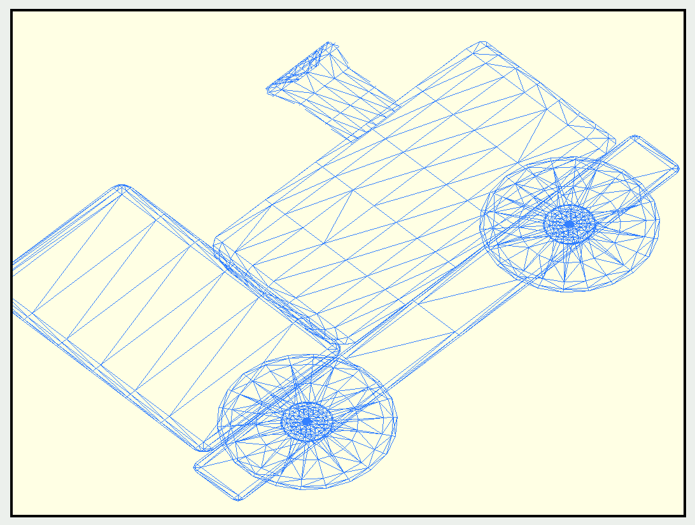

Train in world space

In the vertex function, you multiply the vertex position by the model matrix. All of 
the vertices are rotated then translated. The train vertex positions still relate to the 
width of the screen, so the train looks stretched. You’ll fix that momentarily.

View Matrix

To convert between world space and camera space, you set a view matrix. Depending 
on how you want to move the camera in your world, you can construct the view 
matrix appropriately. The view matrix you’ll create here is a simple one, best for FPS 
(First Person Shooter) style games.

➤ In Renderer.swift at the end of init(metalView:), add this code:

Remember that all of the objects in the scene should move in the opposite direction 
to the camera. inverse does an opposite transformation. So, as the camera moves to 
the right, everything in the world appears to move 0.8 units to the left. With this 
code, you set the camera in world space, and then you add .inverse so that the 
objects will react in inverse relation to the camera.

144

Metal by Tutorials
Chapter 6: Coordinate Spaces

➤ In Shaders.metal, change:

➤ To:

float4 position = uniforms.viewMatrix * uniforms.modelMatrix 
                    * in.position;

➤ Build and run the app.

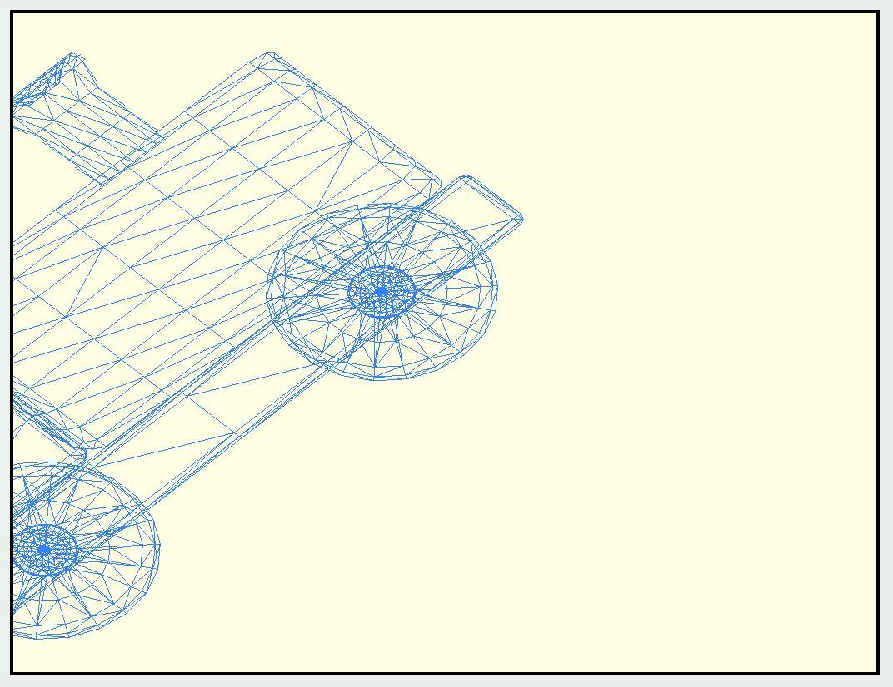

Train in camera space

The train moves 0.8 units to the left. Later, you’ll be able to navigate through a 
scene using the keyboard, and just changing the view matrix will update all of the 
objects in the scene around the camera.

The last matrix will prepare the vertices to move from camera space to clip space. 
This matrix will also allow you to use unit values instead of the -1 to 1 NDC 
(Normalized Device Coordinates) that you’ve been using. To demonstrate why this is 
necessary, you’ll add some animation to the train and rotate it on the y-axis.

➤ Open Renderer.swift, and in draw(in:), just above the following code:

renderEncoder.setVertexBytes( 
  &uniforms, 
  length: MemoryLayout<Uniforms>.stride, 
  index: 11)

145

Metal by Tutorials
Chapter 6: Coordinate Spaces

➤ Add this code:

timer += 0.005 
uniforms.viewMatrix = float4x4.identity 
let translationMatrix = float4x4(translation: [0, -0.6, 0]) 
let rotationMatrix = float4x4(rotationY: sin(timer)) 
uniforms.modelMatrix = translationMatrix * rotationMatrix

Here, you reset the camera view matrix and replace the model matrix with a rotation 
around the y-axis.

➤ Build and run the app.

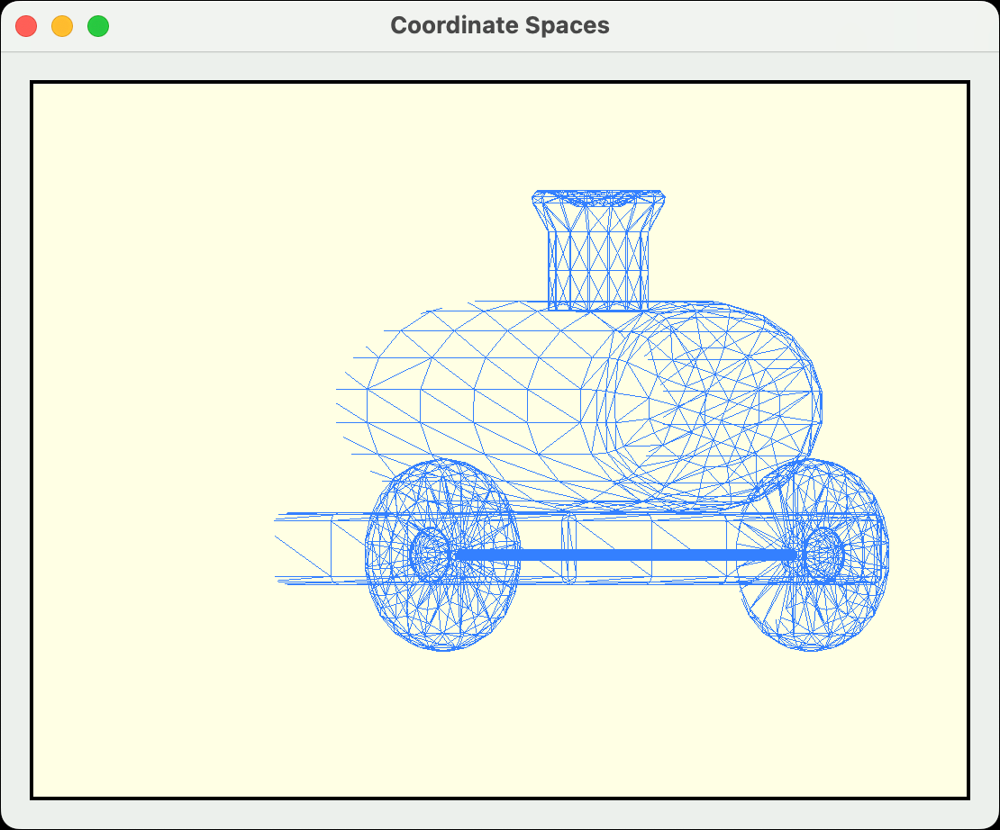

A clipped train

You can see that when the train rotates, any vertices greater than 1.0 on the z-axis 
are clipped. Any vertex outside Metal’s NDC will be clipped.

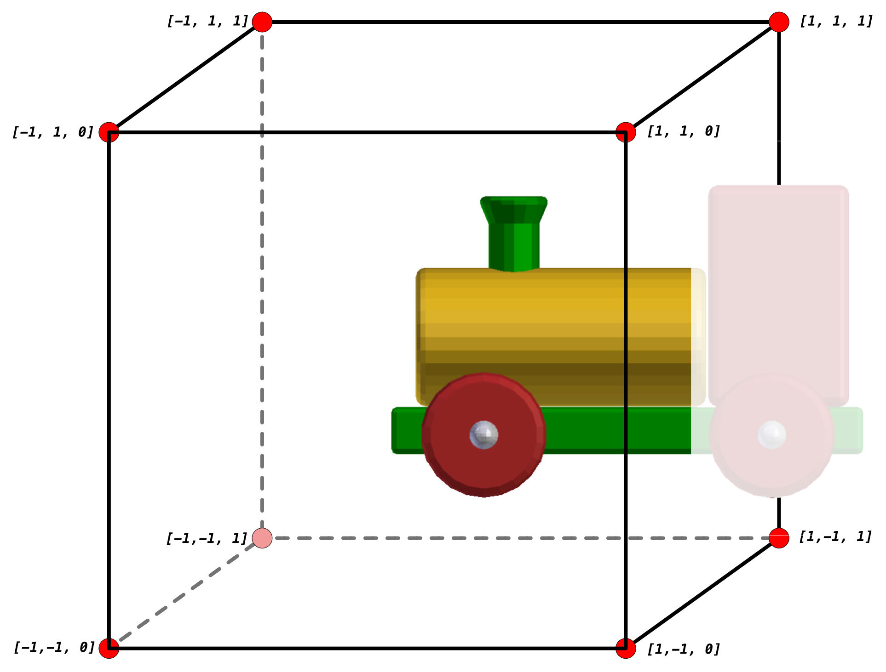

NDC clipping

146

Metal by Tutorials
Chapter 6: Coordinate Spaces

Projection

It’s time to apply some perspective to your render to give your scene some depth.

The following diagram shows a 3D scene. At the bottom-right, you can see how the 
rendered scene will appear.

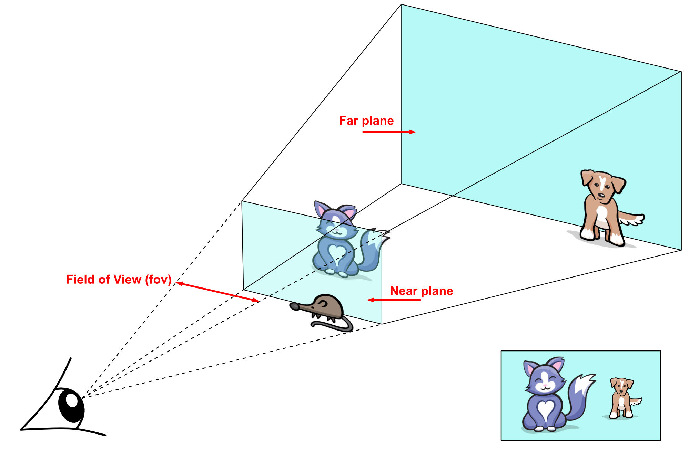

Projection of a scene

When you render a scene, you need to consider:

• How much of that scene will fit on the screen. Your eyes have a field of view of 
about 200º, and within that field of view, your computer screen takes up about 70º.

• How far you can see by having a far plane. Computers can’t see to infinity.

• How close you can see by having a near plane.

• The aspect ratio of the screen. Currently, your train changes size when the screen 
size changes. When you take into account the width and height ratio, this won’t 
happen.

The image above shows all these things. The shape created from the near to the far 
plane is a cut-off pyramid called a frustum. Anything in your scene that’s located 
outside the frustum will not render.

147

Metal by Tutorials
Chapter 6: Coordinate Spaces

Compare the rendered image again to the scene setup. The rat in the scene won’t 
render because he’s in front of the near plane.

MathLibrary.swift provides a projection method that returns the matrix to project 
objects within this frustum into clip space, ready for conversion to NDC coordinates.

Projection Matrix

➤ Open Renderer.swift, and add this code to 
mtkView(_:drawableSizeWillChange:):

let aspect = 
  Float(view.bounds.width) / Float(view.bounds.height) 
let projectionMatrix = 
  float4x4( 
    projectionFov: Float(45).degreesToRadians, 
    near: 0.1, 
    far: 100, 
    aspect: aspect) 
uniforms.projectionMatrix = projectionMatrix

This delegate method gets called whenever the view size changes. Because the 
aspect ratio will change, you must reset the projection matrix.

You’re using a field of view of 45º; a near plane of 0.1, and a far plane of 100 units.

➤ At the end of init(metalView:), add this:

mtkView( 
  metalView, 
  drawableSizeWillChange: metalView.drawableSize)

When metalView.autoResizeDrawable is true, which is the default value, the 
view’s drawable size updates automatically whenever the view size changes. Any 
drawable textures created by the view will have this size.

This code ensures that you set up the projection matrix at the start of the app.

Note: Calling mtkView(_:drawableSizeWillChange:) at the start of the app 
is not strictly necessary here. The SwiftUI view’s frame has a fixed height, but 
not a fixed width, so the view will resize at the start of the app anyway. 
However, if you set both the view frame’s width and height in SwiftUI, the view 
doesn’t resize, so the projection matrix won’t be initialized.

148

Metal by Tutorials
Chapter 6: Coordinate Spaces

➤ In the vertex function of Shaders.metal, change the position matrix calculation 
to:

float4 position = 
  uniforms.projectionMatrix * uniforms.viewMatrix 
  * uniforms.modelMatrix * in.position;

➤ Build and run the app.

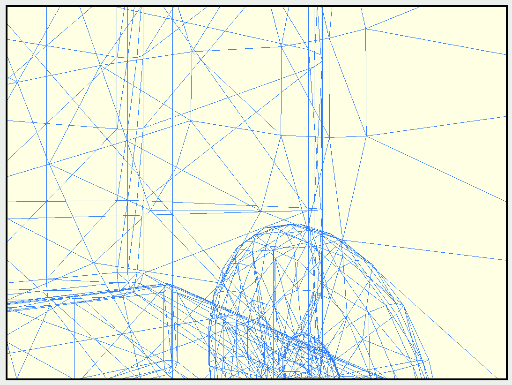

Zoomed in

Because of the projection matrix, the z-coordinates measure differently now, so 
you’re zoomed in on the train.

➤ In Renderer.swift in draw(in:), replace:

➤ With:

149

Metal by Tutorials
Chapter 6: Coordinate Spaces

This moves the camera back into the scene by three units. Build and run:

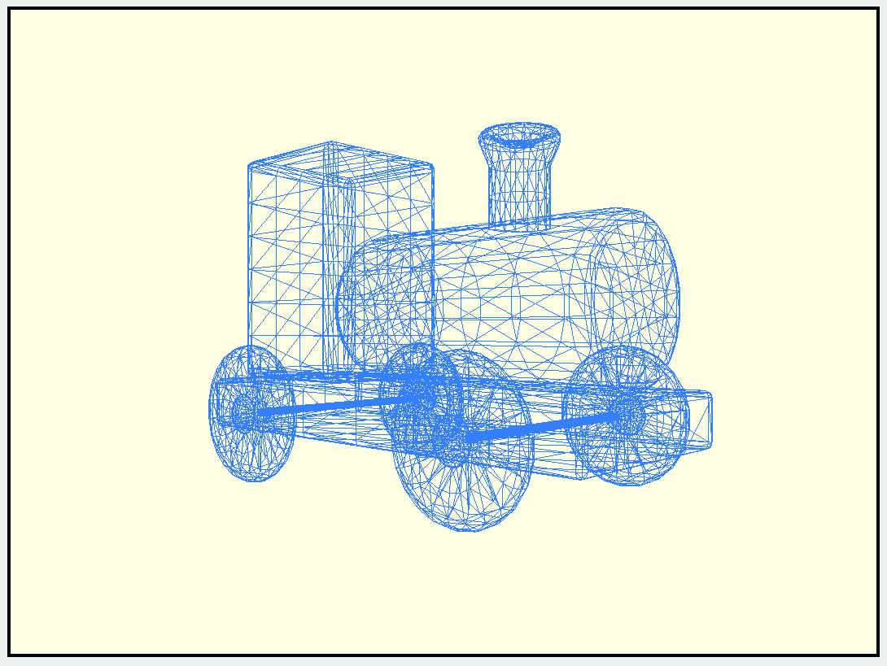

Camera moved back

➤ In mtkView(_:drawableSizeWillChange:), change the projection matrix’s 
projectionFOV parameter to 70º, then build and run the app.

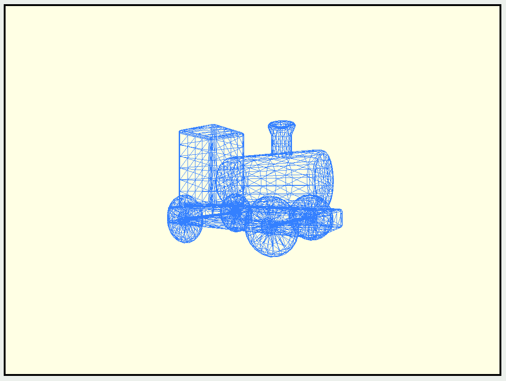

A greater field of view

The train appears smaller because the field of view is wider, and more objects 
horizontally can fit into the rendered scene.

Note: Experiment with the projection values and the model transformation. In 
draw(in:), set translationMatrix’s z translation value to a distance of 97, 
and the front of the train is just visible. At z = 98, the train is no longer 
visible. The projection far value is 100 units, and the camera is back 3 units. If 
you change the projection’s far parameter to 1000, the train is visible again.

150

Metal by Tutorials
Chapter 6: Coordinate Spaces

➤ To render a solid train, in draw(in:), remove:

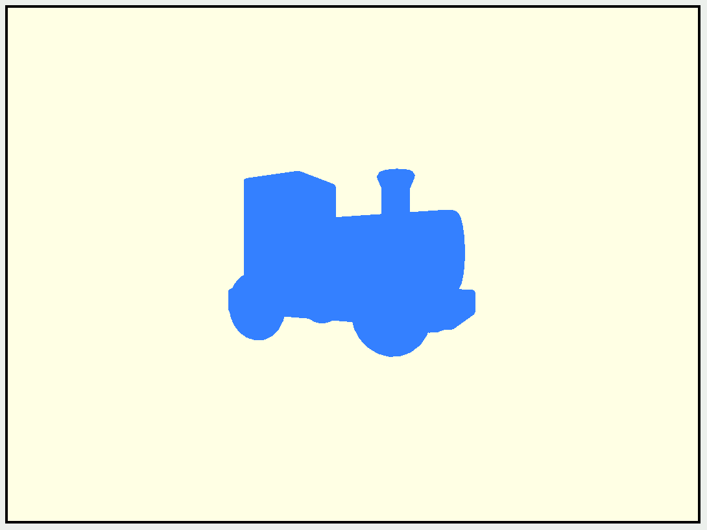

The train positioned in a scene

Perspective Divide

Now that you’ve converted your vertices from object space through world space, 
camera space and clip space, the GPU takes over to convert to NDC coordinates 
(that’s -1 to 1 in the x and y directions and 0 to 1 in the z direction). The ultimate 
aim is to scale all the vertices from clip space into NDC space, and by using the 
fourth w component, that task gets a lot easier.

To scale a point, such as (1, 2, 3), you can have a fourth component: (1, 2, 3, 
3). Divide by that last w component to get (1/3, 2/3, 3/3, 1). The xyz values are 
now scaled down. These coordinates are known as homogeneous, which means of 
the same kind.

The projection matrix projected the vertices from a frustum to a cube in the range -w 
to w. After the vertex leaves the vertex function along the pipeline, the GPU performs 
a perspective divide and divides the x, y and z values by their w value. The higher 
the w value, the further back the coordinate is. The result of this calculation is that 
all visible vertices will now be within NDC.

Note: To avoid a divide by zero, the projection near plane should always be a 
value slightly more than zero.

151

Metal by Tutorials
Chapter 6: Coordinate Spaces

The w value is the main difference between a float4 vector direction and a float4 
position. Because of the perspective divide, the position must have a value, generally 
1, in w. Whereas a vector should have 0 in the w value as it doesn’t go through the 
perspective divide.

In the following picture, the dog and cat are the same height — perhaps a y value of 
2, for example. With projection, since the dog is farther back, it should appear 
smaller in the final render.

The dog should appear smaller.

After projection, the cat might have a w value of ~1, and the dog might have a w value 
of ~8. Dividing by w would give the cat a height of 2 and the dog a height of 1/4, 
which will make the dog appear smaller.

NDC to Screen

Finally, the GPU converts from normalized coordinates to whatever the device screen 
size is. You may already have done something like this at some time in your career 
when converting between normalized coordinates and screen coordinates.

To convert Metal NDC (Normalized Device Coordinates), which are between -1 and 1 
to a device, you can use something like this:

converted.x = point.x * screenWidth/2  + screenWidth/2 
converted.y = point.y * screenHeight/2 + screenHeight/2

However, you can also do this with a matrix by scaling half the screen size and 
translating by half the screen size. The clear advantage of this method is that you 
can set up a transformation matrix once and multiply any normalized point by the 
matrix to convert it into the correct screen space using code like this:

The rasterizer on the GPU takes care of the matrix calculation for you.

152

Metal by Tutorials
Chapter 6: Coordinate Spaces

Refactoring the Model Matrix

Currently, you set all the matrices in Renderer. Later, you’ll create a Camera 
structure to calculate the view and projection matrices.

For the model matrix, rather than updating it directly, any object that you can move 
— such as a model or a camera — can hold a position, rotation and scale. From this 
information, you can construct the model matrix.

➤ Create a new Swift file named Transform.swift

➤ Add the new structure:

struct Transform { 
  var position: float3 = [0, 0, 0] 
  var rotation: float3 = [0, 0, 0] 
  var scale: Float = 1 
}

This structure will hold the transformation information for any object that you can 
move.

➤ Add an extension with a computed property:

extension Transform { 
  var modelMatrix: matrix_float4x4 { 
    let translation = float4x4(translation: position) 
    let rotation = float4x4(rotation: rotation) 
    let scale = float4x4(scaling: scale) 
    let modelMatrix = translation * rotation * scale 
    return modelMatrix 
  } 
}

This code automatically creates a model matrix from any transformable object.

➤ Add a new protocol so that you can mark objects as transformable:

protocol Transformable { 
  var transform: Transform { get set } 
}

➤ Because it’s a bit longwinded to type model.transform.position, add a new 
extension to Transformable:

extension Transformable { 
  var position: float3 {

153

Metal by Tutorials
Chapter 6: Coordinate Spaces

get { transform.position } 
    set { transform.position = newValue } 
  } 
  var rotation: float3 { 
    get { transform.rotation } 
    set { transform.rotation = newValue } 
  } 
  var scale: Float { 
    get { transform.scale } 
    set { transform.scale = newValue } 
  } 
}

This code provides computed properties to allow you to use model.position 
directly, and the model’s transform will update from this value.

➤ Open Model.swift, and mark Model as Transformable.

➤ Add the new transform property to Model:

➤ Open Renderer.swift, and from init(metalView:), remove:

let translation = float4x4(translation: [0.5, -0.4, 0]) 
let rotation = 
  float4x4(rotation: [0, 0, Float(45).degreesToRadians]) 
uniforms.modelMatrix = translation * rotation 
uniforms.viewMatrix = float4x4(translation: [0.8, 0, 0]).inverse

You’ll set these matrices in draw(in:).

154

Metal by Tutorials
Chapter 6: Coordinate Spaces

➤ In draw(in:), replace:

let translationMatrix = float4x4(translation: [0, -0.6, 0]) 
let rotationMatrix = float4x4(rotationY: sin(timer)) 
uniforms.modelMatrix = translationMatrix * rotationMatrix

➤ With:

model.position.y = -0.6 
model.rotation.y = sin(timer) 
uniforms.modelMatrix = model.transform.modelMatrix

➤ Build and run the app.

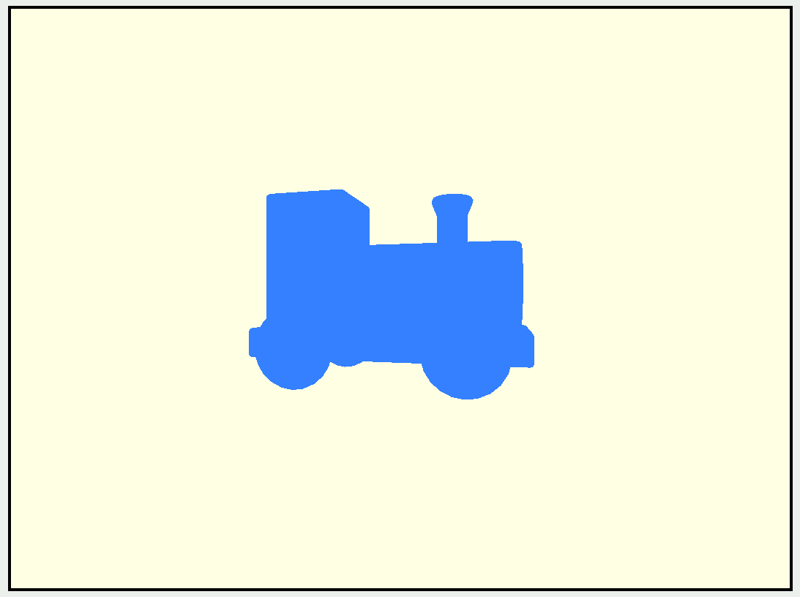

Using a transform in Model

The result is exactly the same, but the code is much easier to read — and changing a 
model’s position, rotation and scale is more accessible. Later, you’ll extract this code 
into a GameScene so that Renderer is left only to render models rather than 
manipulate them.

155

Metal by Tutorials
Chapter 6: Coordinate Spaces

Key Points

• Coordinate spaces map different coordinate systems. To convert from one space to 
another, you can use matrix multiplication.

• Model vertices start off in object space. These are generally held in the file that 
comes from your 3D app, such as Blender, but you can procedurally generate them 
too.

• The model matrix converts object space vertices to world space. These are the 
positions that the vertices hold in the scene’s world. The origin at [0, 0, 0] is 
the center of the scene.

• The view matrix moves vertices into camera space. Generally, your matrix will be 
the inverse of the position of the camera in world space.

• The projection matrix applies three-dimensional perspective to your vertices.

Where to Go From Here?

You’ve covered a lot of mathematical concepts in this chapter without diving too far 
into the underlying mathematical principles. To get started in computer graphics, 
you can fill your transform matrices and continue multiplying them at the usual 
times, but to be sufficiently creative, you’ll need to understand some linear algebra. 
A great place to start is Grant Sanderson’s Essence of Linear Algebra at https://bit.ly/
3iYnkN1. This video treats vectors and matrices visually. You’ll also find some 
additional references in references.markdown in the resources folder for this 
chapter.

156

7