# The Fragment 
Function

Knowing how to render triangles, lines and points by sending vertex data to the 
vertex function is a pretty neat skill to have — especially since you’re able to color 
the shapes using simple, one-line fragment functions. However, fragment shaders 
are capable of doing a lot more.

➤ Open the website https://shadertoy.com, where you’ll find a dizzying number of 
brilliant community-created shaders.

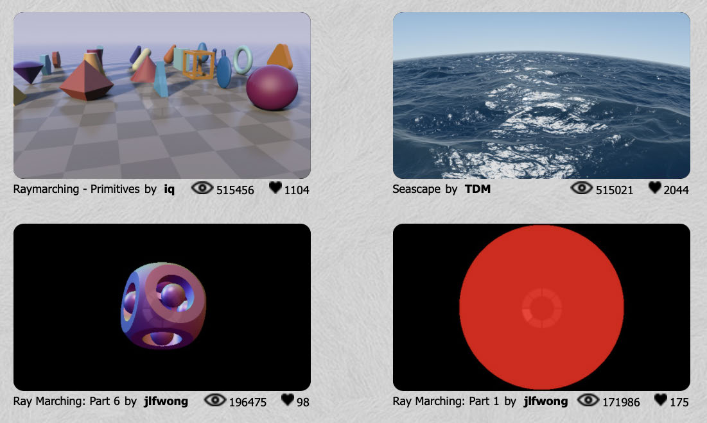

shadertoy.com examples

These examples may look like renderings of complex 3D models, but looks are 
deceiving! Every “model” you see here is entirely generated using mathematics, 
written in a GLSL fragment shader. GLSL is the Graphics Library Shading 
Language for OpenGL — and in this chapter, you’ll begin to understand the 
principles that all shading masters use.

157

Metal by Tutorials
Chapter 7: The Fragment Function

Note: Every graphics API uses its own shader language. The principles are the 
same, so if you find a GLSL shader you like, you can recreate it in Metal’s MSL.

The Starter Project

The starter project shows an example of using multiple pipeline states with different 
vertex functions, depending on whether you render the rotating train or the full-
screen quad.

➤ Open the starter project for this chapter.

➤ Build and run the project. (You can choose to render the train or the quad. You’ll 
start with the quad first.)

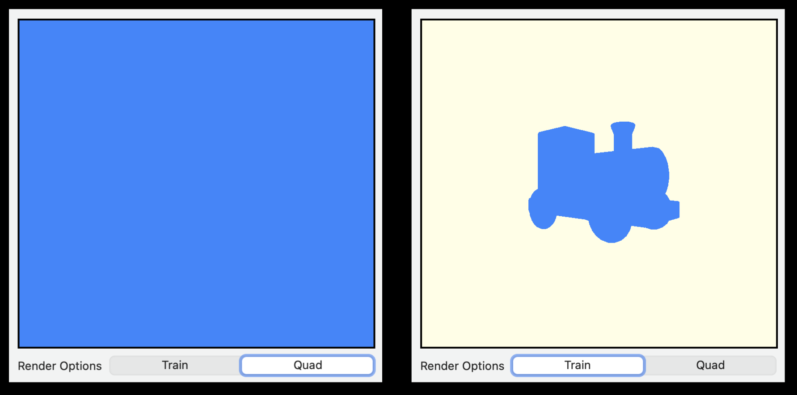

The starter project

Let’s have a closer look at the code.

➤ Open Vertex.metal in the Shaders group, and you’ll see two vertex functions:

• vertex_main: This function renders the train, just as it did in the previous 
chapter.

• vertex_quad: This function renders the full-screen quad using an array defined in 
the shader.

158

Metal by Tutorials
Chapter 7: The Fragment Function

Both functions output a VertexOut, containing only the vertex’s position.

➤ Open Renderer.swift.

In init(metalView:options:), you’ll see two pipeline state objects (PSOs). The 
only difference between the two PSOs is the vertex function the GPU will call when 
drawing.

Depending on the value of options.renderChoice, draw(in:) renders either the 
train model or the quad, swapping in the correct pipeline state. The SwiftUI views 
handle updating Options and MetalViewRepresentable passes the current option 
to Renderer.

➤ Ensure you understand how this project works before you continue.

Screen Space

One of the many things a fragment function can do is create complex patterns that 
fill the screen on a rendered quad. At the moment, the fragment function has only 
the interpolated position output from the vertex function available to it. So first, 
you’ll learn what you can do with this position and what its limitations are.

➤ Open Fragment.metal, and change the fragment function contents to:

float color; 
in.position.x < 200 ? color = 0 : color = 1; 
return float4(color, color, color, 1);

When the rasterizer processes the vertex positions, it converts them from NDC 
(Normalized Device Coordinates)into screen space. You defined the width of the 
Metal view in ContentView.swift as 400 points. With the newly added code, you say 
that if the x position is less than 200, make the color black. Otherwise, make the 
color white.

Note: Although you can use an if statement, the compiler optimizes the 
ternary statement better, so it makes more sense to use that instead.

159

Metal by Tutorials
Chapter 7: The Fragment Function

➤ Build and run the app on both your Mac and iPhone 15 Pro Max Simulator.

MacBook Pro vs iPhone 15 Pro Max

Did you expect half the screen to be black? The view is 400 points wide, so it would 
make sense. But there’s something you might not have considered: Apple Retina 
displays have various pixel resolutions or pixel densities. For example, a MacBook 
Pro has a 2x Retina display, whereas the iPhone 15 Pro Max has a 3x Retina display. 
These different displays mean that the 400 point Metal view on a MacBook Pro 
creates an 800x800 pixel drawable texture and the iPhone view creates a 1200x1200 
pixel drawable texture.

Your quad fills up the screen, and you’re writing to the view’s drawable render target 
texture (the size of which matches the device’s display), but there’s no easy way to 
find out in the fragment function what size the current render target texture is.

➤ Open Common.h, and add a new structure:

typedef struct { 
  uint width; 
  uint height; 
} Params;

This code holds parameters that you can send to the fragment function. You can add 
parameters to this structure as you need them.

➤ Open Renderer.swift, and add a new property to Renderer:

160

Metal by Tutorials
Chapter 7: The Fragment Function

You’ll store the current render target size in the new property.

➤ Add the following code to the end of mtkView(_:drawableSizeWillChange:):

params.width = UInt32(size.width) 
params.height = UInt32(size.height)

size contains the drawable texture size of the view. In other words, the view’s 
bounds scaled by the device’s scale factor.

➤ In draw(in:), before calling the methods to render the model or quad, send the 
parameters to the fragment function:

renderEncoder.setFragmentBytes( 
  &params, 
  length: MemoryLayout<Params>.stride, 
  index: 12)

Notice that you’re using setFragmentBytes(_:length:index:) to send data to the 
fragment function the same way you previously used 
setVertexBytes(_:length:index:).

➤ Open Fragment.metal, and change the signature of fragment_main to:

fragment float4 fragment_main( 
  constant Params &params [[buffer(12)]], 
  VertexOut in [[stage_in]])

Params with the target drawing texture size is now available to the fragment 
function.

➤ Change the code that sets the value of color — based on the value of 
in.position.x — to:

Here, you’re using the target render size for the calculation.

➤ Run the app in both macOS and iPhone 15 Pro Max Simulator.

161

Metal by Tutorials
Chapter 7: The Fragment Function

Fantastic, the render now looks the same for both devices.

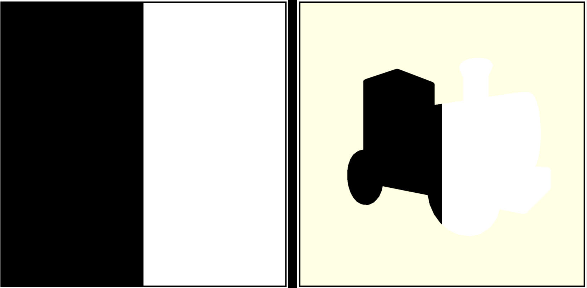

Corrected for retina devices

Metal Standard Library Functions

In addition to standard mathematical functions such as sin, abs and length, there 
are a few other useful functions. Let’s have a look.

step

step(edge, x) returns 0 if x is less than edge. Otherwise, it returns 1. This 
evaluation is exactly what you’re doing with your current fragment function.

➤ Replace the contents of the fragment function with:

float color = step(params.width * 0.5, in.position.x); 
return float4(color, color, color, 1);

This code produces the same result as before but with slightly less code.

➤ Build and run.

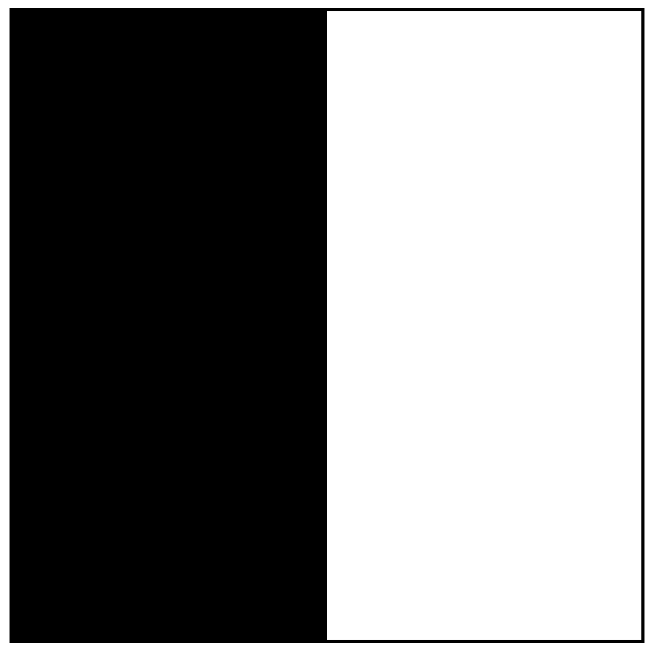

step

The result is that you get black on the left where the result of step is 0, and white on 
the right where the result of step is 1.

162

Metal by Tutorials
Chapter 7: The Fragment Function

Let’s take this further with a checkerboard pattern.

➤ Replace the contents of the fragment function with:

uint checks = 8; 
// 1 
float2 uv = in.position.xy / params.width; 
// 2 
uv = fract(uv * checks * 0.5) - 0.5; 
// 3 
float3 color = step(uv.x * uv.y, 0.0); 
return float4(color, 1.0);

Here’s what’s happening:

1. UV coordinates form a grid with values between 0 and 1. The mid-point, 
therefore, is at [0.5, 0.5], with the top left at [0.0, 0.0]. UV coordinates are 
most often associated with mapping vertices to textures, as you’ll see in Chapter 
8, “Textures”.

2.
fract(x) returns the fractional part of x. You take the fractional value of the UVs 
multiplied by half the number of checks, which gives you a value between 0 and 
1. You then subtract 0.5 so that half the values are less than zero.

3. If the result of the xy multiplication is less than zero, the result is 1 or white. 
Otherwise, it’s 0 or black.

For example:

float2 uv = (550, 50) / 800;     // uv = (0.6875, 0.0625) 
uv = fract(uv * checks * 0.5);   // uv = (0.75, 0.25) 
uv -= 0.5; // uv = (0.25, -0.25) 
float3 color = step(uv.x * uv.y, 0.0); // x > -0.0625, so color 
is 1

➤ Build and run the app.

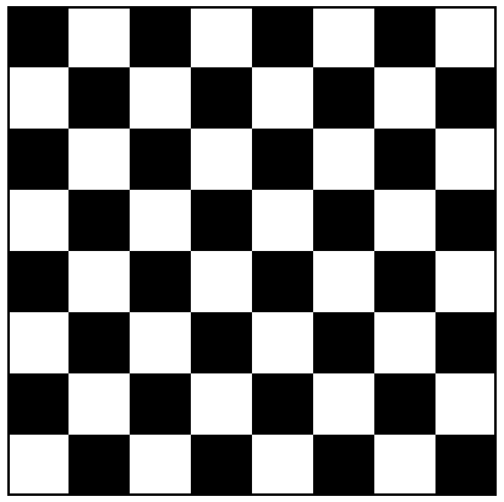

Checker board

163

Metal by Tutorials
Chapter 7: The Fragment Function

length

Creating squares is a lot of fun, but let’s create some circles using a length function.

➤ Replace the fragment function with:

float center = 0.5; 
float radius = 0.2; 
float2 uv = in.position.xy / params.width - center; 
float3 color = step(length(uv), radius); 
return float4(color, 1.0);

➤ Build and run the app.

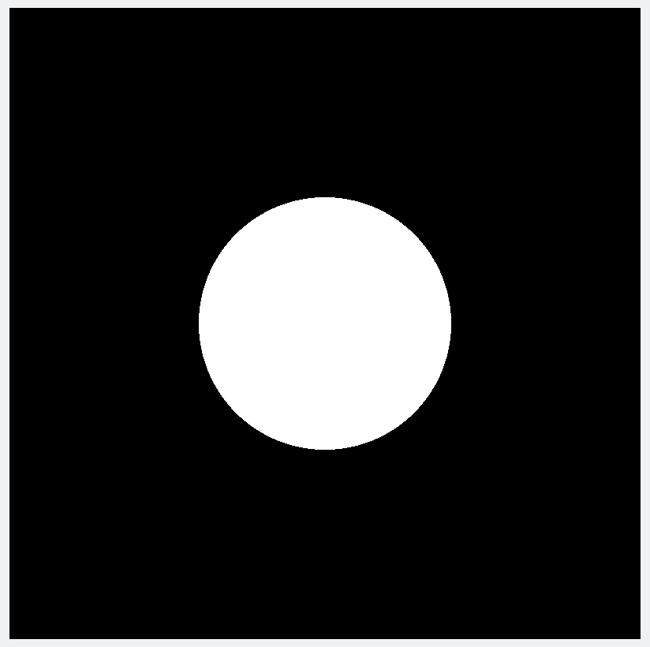

Circle

To resize and move the shape around the screen, you change the circle’s center and 
radius.

smoothstep

smoothstep(edge0, edge1, x) returns a smooth Hermite interpolation between 0 
and 1.

Note: edge1 must be greater than edge0, and x should be edge0 <= x <= 
edge1.

164

Metal by Tutorials
Chapter 7: The Fragment Function

➤ Change the fragment function to:

float color = smoothstep(0, params.width, in.position.x); 
return float4(color, color, color, 1);

color contains a value between 0 and 1. When the position is the same as the screen 
width, the color is 0 or white. When the position is at the very left of the screen, the 
color is 0 or black.

➤ Build and run the app.

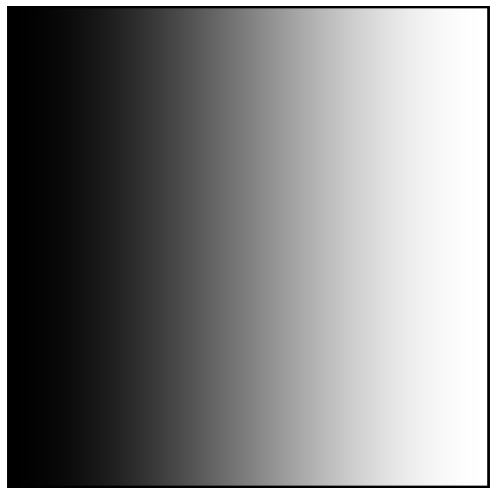

smoothstep gradient

Between the two edge cases, the color is a gradient interpolating between black and 
white. Here, you use smoothstep to calculate a color, but you can also use it to 
interpolate between any two values. For example, you can use smoothstep to 
animate a position in the vertex function.

mix

mix(x, y, a) produces the same result as x + (y - x) * a.

➤ Change the fragment function to:

float3 red = float3(1, 0, 0); 
float3 blue = float3(0, 0, 1); 
float3 color = mix(red, blue, 0.6); 
return float4(color, 1);

A mix of 0 produces full red. A mix of 1 produces full blue. Together, these colors 
produce a 60% blend between red and blue.

165

Metal by Tutorials
Chapter 7: The Fragment Function

➤ Build and run the app.

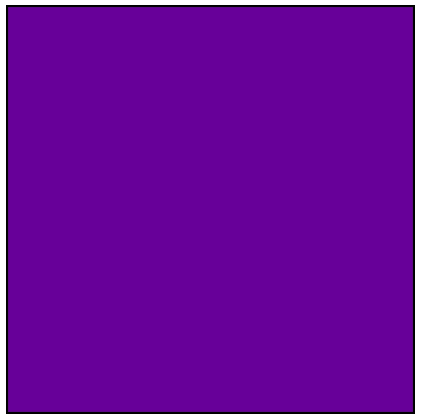

A blend between red and blue

You can combine mix with smoothstep to produce a color gradient.

➤ Replace the fragment function with:

float3 red = float3(1, 0, 0); 
float3 blue = float3(0, 0, 1); 
float result = smoothstep(0, params.width, in.position.x); 
float3 color = mix(red, blue, result); 
return float4(color, 1);

This code takes the interpolated result and uses it as the amount to mix red and 
blue.

➤ Build and run the app.

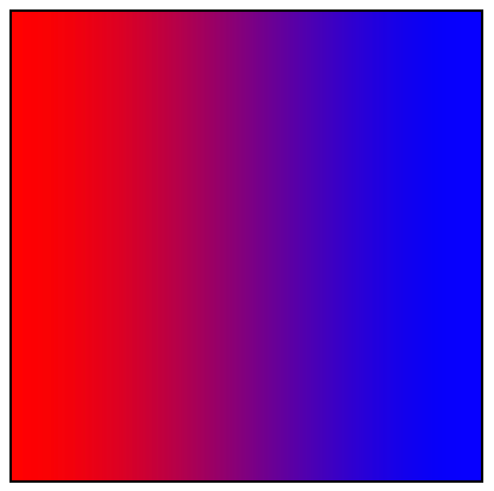

Combining smoothstep and mix

166

Metal by Tutorials
Chapter 7: The Fragment Function

normalize

The process of normalization means to rescale data to use a standard range. For 
example, a vector has both direction and magnitude. In the following image, vector A 
has a length of 2.12132 and a direction of 45 degrees. Vector B has the same length 
but a different direction. Vector C has a different length but the same direction.

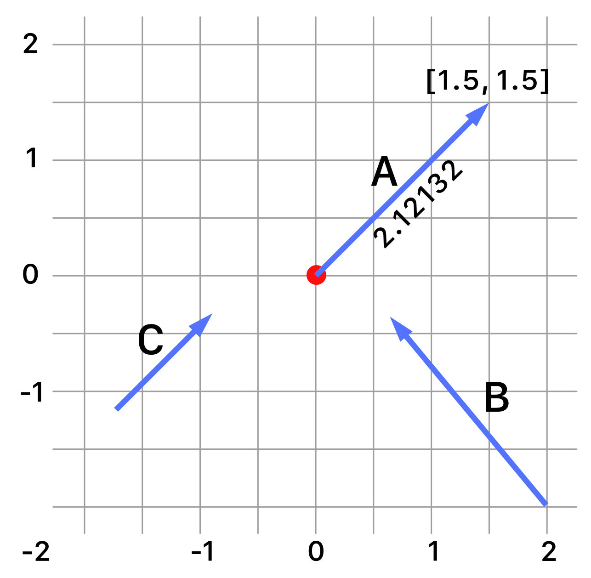

Vectors

It’s easier to compare the direction of two vectors if they have the same magnitude, 
so you normalize the vectors to a unit length. normalize(x) returns the vector x in 
the same direction but with a length of 1.

Let’s look at another example of normalizing. Say you want to visualize the vertex 
positions using colors so that you can better debug some of your code.

➤ Change the fragment function to:

➤ Build and run the app.

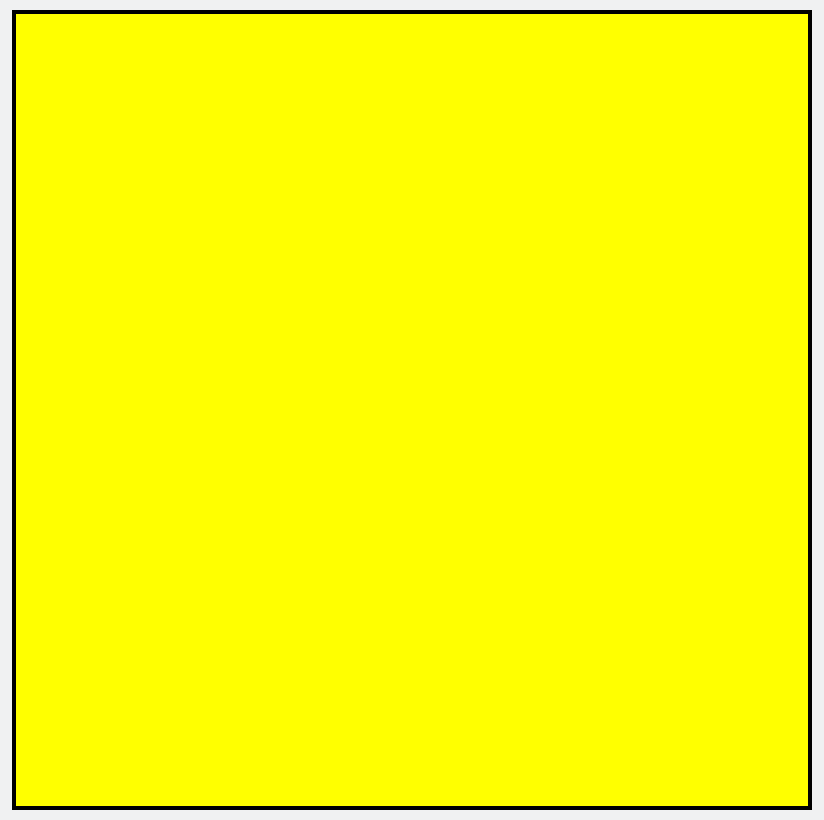

Visualizing positions

167

Metal by Tutorials
Chapter 7: The Fragment Function

The fragment function should return an RGBA color with each element between 0 and 
1. However, because the position is in screen space, each position varies between [0, 
0, 0] and [800, 800, 0], which is why the quad renders yellow (it’s only between 
0 and 1 at the top-left corner).

➤ Now, change the code to:

float3 color = normalize(in.position.xyz); 
return float4(color, 1);

Here, you normalize the vector in.position.xyz to have a length of 1. All of the 
colors are now guaranteed to be between 0 and 1. When normalized, the position 
(800, 0, 0) at the far top-right contains 1, 0, 0, which is red.

➤ Build and run the app to see the result.

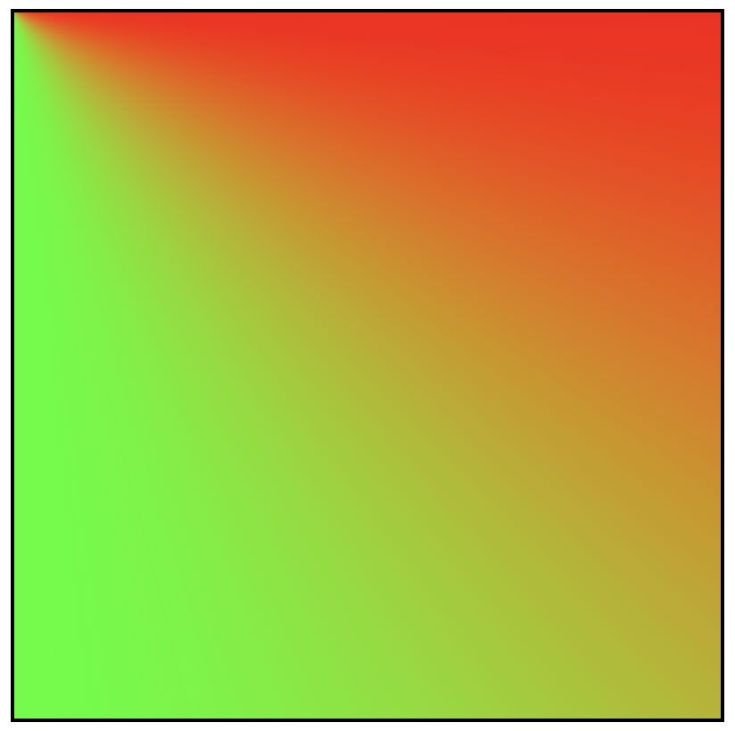

Normalized positions

Normals

Although visualizing positions is helpful for debugging, it’s not generally helpful in 
creating a 3D render. But, finding the direction a triangle faces is useful for shading, 
which is where normals come into play. Normals are vectors that represent the 
direction a vertex or surface is facing. In the next chapter, you’ll learn how to light 
your models. But first, you need to understand normals.

168

Metal by Tutorials
Chapter 7: The Fragment Function

The following image captured from Blender shows vertex normals pointing out. Each 
of the sphere’s vertices points in a different direction.

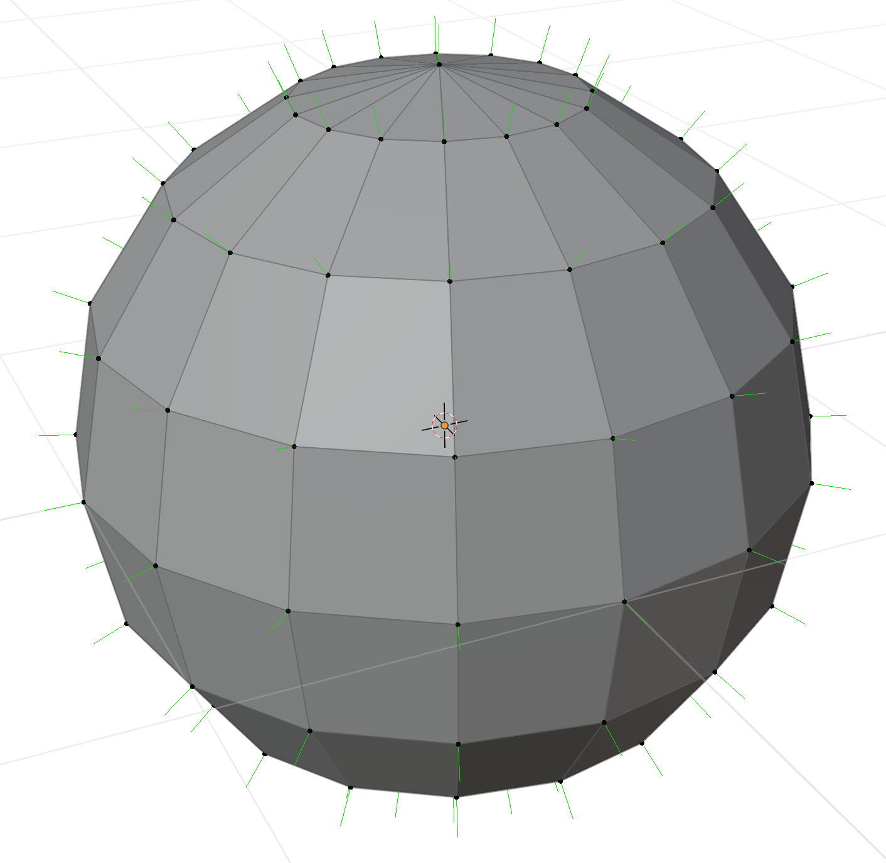

Vertex normals

The shading of the sphere depends upon these normals. If a normal points toward 
the light source, Blender will shade brighter.

A quad isn’t very interesting for shading purposes, so switch the default render to 
the train.

➤ Open Options.swift, and change the initialization of renderChoice to:

➤ Run the app to check your train render.

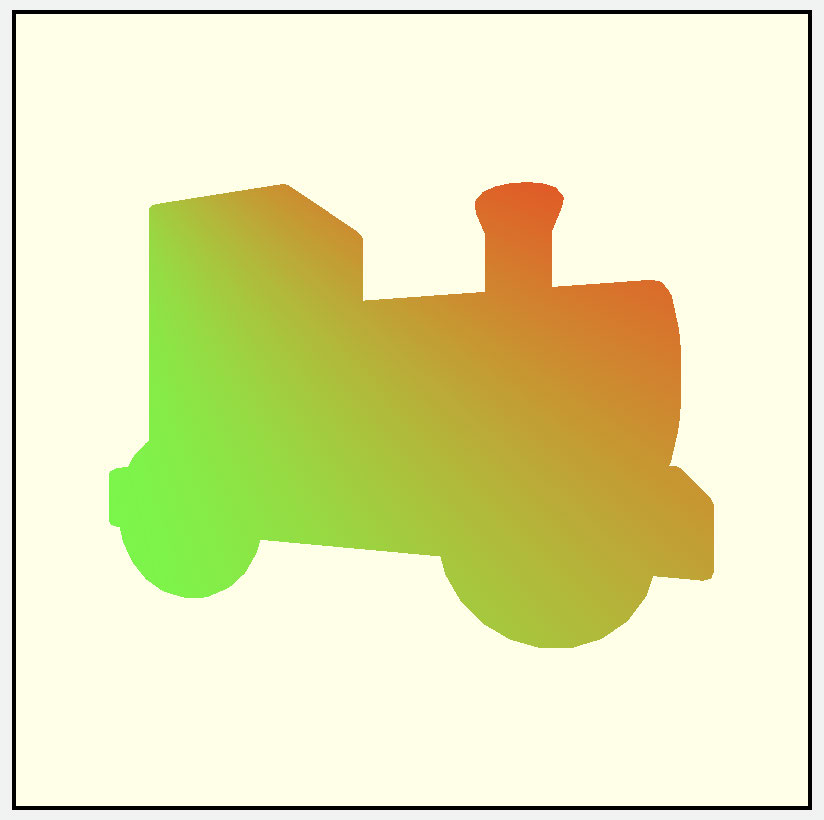

Train render

Unlike the full-screen quad, only fragments covered by the train will render. The 
color of each fragment, however, is still dependent upon the fragment’s screen 
position and not the position of the train vertices.

169

Metal by Tutorials
Chapter 7: The Fragment Function

Loading the Train Model With Normals

3D model files generally contain surface normal values, and you can load these 
values with your model. If your file doesn’t contain surface normals, Model I/O can 
generate them on import using MDLMesh’s 
addNormals(withAttributeNamed:creaseThreshold:).

Adding Normals to the Vertex Descriptor

➤ Open VertexDescriptor.swift.

At the moment, you load only the position attribute. It’s time to add the normal to 
the vertex descriptor.

➤ After the code that sets up offset, and before the code that sets layouts[0], add 
the following code to MDLVertexDescriptor’s defaultLayout:

vertexDescriptor.attributes[1] = MDLVertexAttribute( 
  name: MDLVertexAttributeNormal, 
  format: .float3, 
  offset: offset, 
  bufferIndex: 0) 
offset += MemoryLayout<float3>.stride

Here, a normal is a float3, and interleaved with the position in buffer 0. float3 is a 
typealias of SIMD3<Float> defined in MathLibrary.swift. Each vertex takes up two 
float3s, which is 32 bytes, in buffer index 0. layouts[0] describes buffer index 0 
with the stride.

Updating the Shader Functions

➤ Open Vertex.metal.

The pipeline state for the train model uses this vertex descriptor so that the vertex 
function can process the attributes, and you match the attributes with those in 
VertexIn.

➤ Build and run the app, and you’ll see that everything still works as expected.

Even though you added a new attribute to the vertex buffer, the pipeline ignores it 
since you haven’t included it as an attribute(n) in VertexIn. Time to fix that.

170

Metal by Tutorials
Chapter 7: The Fragment Function

➤ Add the following code to VertexIn:

Here, you match attribute(1) with the vertex descriptor’s attribute 1. So now 
you’ll be able to access the normal attribute in the vertex function.

➤ Next, add the following code to VertexOut:

By including the normal here, you can now pass the data on to the fragment 
function.

➤ In vertex_main, change the assignment to out:

VertexOut out { 
  .position = position, 
  .normal = in.normal 
};

Perfect! With that change, you can now return both the position and the normal 
from the vertex function.

➤ Open Fragment.metal, and replace the contents of fragment_main with:

Don’t worry, that compile error is expected. Even though you updated VertexOut in 
Vertex.metal, the scope of that structure was only in that one file.

Adding a Header

It’s common to require structures and functions in multiple shader files. So, just as 
you did with the bridging header Common.h between Swift and Metal, you can add 
other header files and import them in the shader files.

➤ Create a new file in the Shaders group using the macOS Header File template, 
and name it ShaderDefs.h.

➤ Replace the code with:

#include <metal_stdlib> 
using namespace metal;

171

Metal by Tutorials
Chapter 7: The Fragment Function

float4 position [[position]]; 
  float3 normal; 
};

Here, you define VertexOut within the metal namespace.

➤ Open Vertex.metal, and delete the VertexOut structure.

➤ After importing Common.h, add:

➤ Open Fragment.metal, and delete the VertexOut structure.

➤ Again, after importing Common.h, add:

➤ Build and run the app.

Oh, now that looks a little odd!

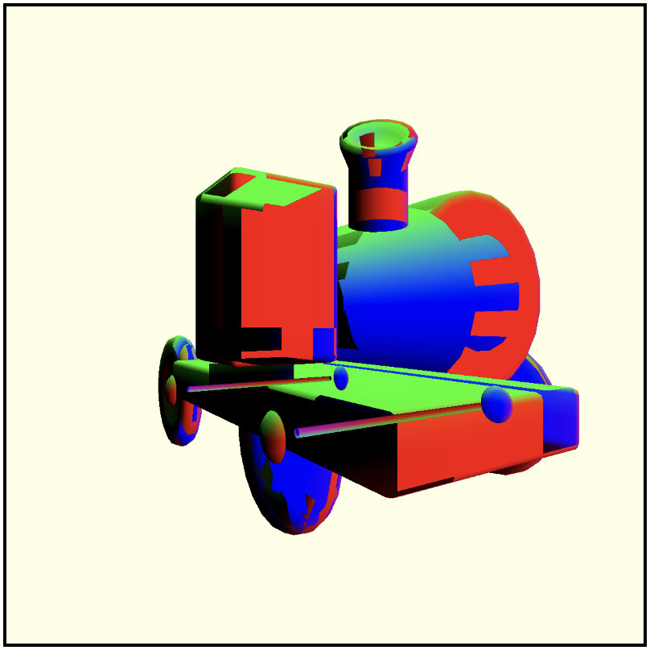

Normals with rendering weirdness

Your normals appear as if they are displaying correctly — red normals are at the 
train’s right, green is up and blue is at the back — but as the train rotates, parts of it 
seem almost transparent.

The problem here is that the rasterizer is jumbling up the depth order of the vertices. 
When you look at a train from the front, you shouldn’t be able to see the back of the 
train; it should be occluded.

172

Metal by Tutorials
Chapter 7: The Fragment Function

Depth

The rasterizer doesn’t process depth order by default, so you need to give the 
rasterizer the information it needs with a depth stencil state.

As you may remember from Chapter 3, “The Rendering Pipeline”, the Stencil Test 
unit checks whether fragments are visible after the fragment function, during the 
rendering pipeline. If a fragment is determined to be behind another fragment, it’s 
discarded.

Let’s give the render encoder an MTLDepthStencilState property to describe how to 
do this testing.

➤ Open Renderer.swift.

➤ Toward the end of init(metalView:options:), after setting 
metalView.clearColor, add:

This code tells the view that it needs to hold the depth information. The default pixel 
format is .invalid, which informs the view that it doesn’t need to create a depth 
and stencil texture.

The pipeline state that the render command encoder uses has to have the same 
depth pixel format.

➤ In init(metalView:options:), after setting 
pipelineDescriptor.colorAttachments[0].pixelFormat, before do {, add:

If you were to build and run the app now, you’d get the same result as before. 
However, behind the scenes, the view creates a texture to which the rasterizer can 
write depth values.

Next, you need to set how you want the rasterizer to calculate your depth values.

➤ Add a new property to Renderer:

This property holds the depth stencil state with the correct render settings.

173

Metal by Tutorials
Chapter 7: The Fragment Function

➤ Create this method in Renderer to instantiate the depth stencil state:

static func buildDepthStencilState() -> MTLDepthStencilState? { 
// 1 
  let descriptor = MTLDepthStencilDescriptor() 
// 2 
  descriptor.depthCompareFunction = .less 
// 3 
  descriptor.isDepthWriteEnabled = true 
  return Renderer.device.makeDepthStencilState( 
    descriptor: descriptor) 
}

Going through this code:

1. Create a descriptor that you’ll use to initialize the depth stencil state, just as you 
did the pipeline state objects.

2. Specify how to compare the current and already processed fragments. With a 
compare function of less, if the current fragment depth is less than the depth of 
the previous fragment in the framebuffer, the current fragment replaces that 
previous fragment.

3. State whether to write depth values. If you have multiple passes, as you will in 
Chapter 12, “Render Passes”, sometimes you’ll want to read the already drawn 
fragments. In that case, set isDepthWriteEnabled to false. Note that 
isDepthWriteEnabled is always true when you’re drawing objects that require 
depth.

➤ Call the method from init(metalView:options:) before super.init():

➤ In draw(in:), add this to the top of the method after guard { }:

➤ Build and run the app to see your train in glorious 3D.

174

Metal by Tutorials
Chapter 7: The Fragment Function

As the train rotates, it appears in shades of red, green, blue and black.

Normals

Consider what you see in this render. The normals are currently in object space. So, 
even though the train rotates in world space, the colors/normals don’t change as the 
model changes its rotation.

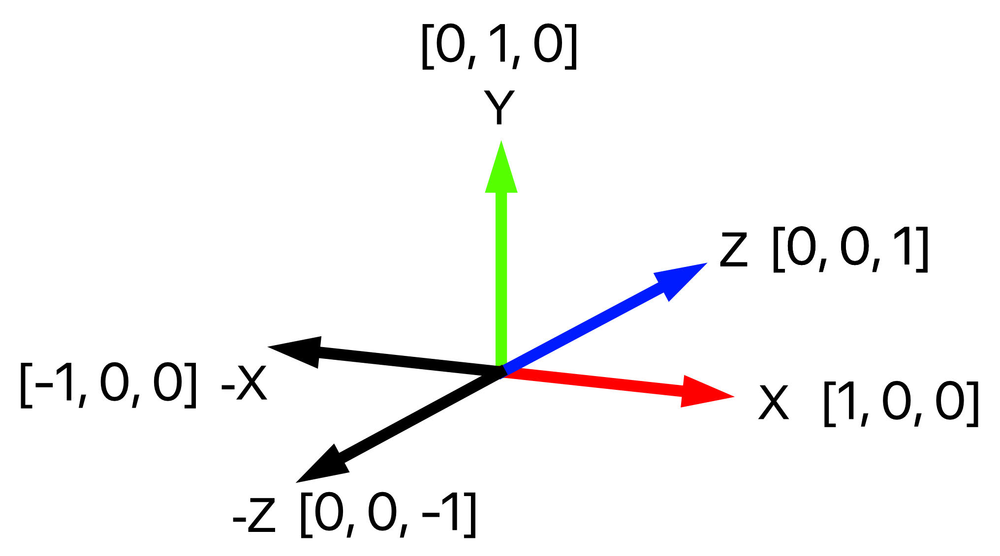

Normal colors along axes

When a normal points to the right along the model’s x-axis, the value is [1, 0, 0]. 
That’s the same as red in RGB values, so the fragment is colored red for those 
normals pointing to the right.

The normals pointing upwards are 1 on the y-axis, so the color is green.

175

Metal by Tutorials
Chapter 7: The Fragment Function

The normals pointing toward the camera are negative. They’re black when a color is 
[0, 0, 0] or less. When you see the back of the train as it rotates, you can just make 
out that the back of the wheels pointing in the z direction are blue [0, 0, 1].

Now that you have normals in the fragment function, you can start manipulating 
colors depending on the direction they’re facing. Manipulating colors is important 
when you start playing with lighting.

Hemispheric Lighting

Hemispheric lighting uses ambient light. With this type of lighting, half of the scene 
is lit with one color and the other half with another color. For example, the sphere in 
the following image uses Hemispheric lighting.

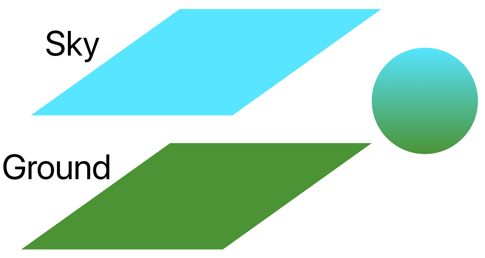

Hemispheric lighting

Notice how the sphere appears to take on the color reflected from the sky (top) and 
the color reflected from the ground (bottom). To see this type of lighting in action, 
you’ll change the fragment function so that:

• Normals facing up are blue.

• Normals facing down are green.

• Interim values are a blue and green blend.

176

Metal by Tutorials
Chapter 7: The Fragment Function

➤ Open Fragment.metal, and replace the contents of fragment_main with:

float4 sky = float4(0.34, 0.9, 1.0, 1.0); 
float4 earth = float4(0.29, 0.58, 0.2, 1.0); 
float intensity = in.normal.y * 0.5 + 0.5; 
return mix(earth, sky, intensity);

mix(x, y, z) interpolates between the first two values depending on the third 
value, which must be between 0 and 1. Your normal values are between -1 and 1, so 
you convert the intensity between 0 and 1.

➤ Build and run the app to see your lit train. Notice how the top of the train is blue 
and its underside is green.

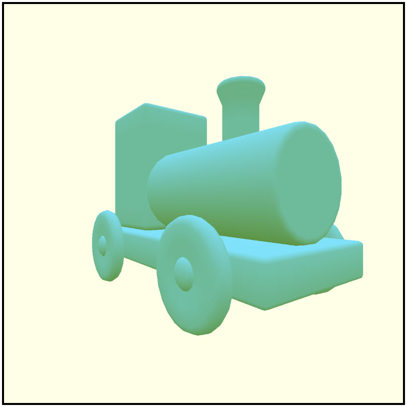

Hemispheric lighting

Fragment shaders are powerful, allowing you to color objects with precision. In 
Chapter 10, “Lighting Fundamentals”, you’ll use the power of normals to shade your 
scene with more realistic lighting. In Chapter 19, “Tessellation & Terrains”, you’ll 
create a similar effect to this one as you learn how to place snow on a terrain 
depending on the slope.

177

Metal by Tutorials
Chapter 7: The Fragment Function

Challenge

Currently, you’re using hard-coded magic numbers for all of the buffer indices and 
attributes. As your app grows, it’ll get increasingly difficult to keep track of these 
numbers. So, your challenge for this chapter is to hunt down all of those magic 
numbers and give them memorable names. For this challenge, you’ll create an enum 
in Common.h.

Here’s some code to get you started:

typedef enum { 
  VertexBuffer = 0, 
  UniformsBuffer = 11, 
  ParamsBuffer = 12 
} BufferIndices;

You can now use these constants in both Swift and C++ shader functions:

//Swift 
encoder.setVertexBytes( 
  &uniforms, 
  length: MemoryLayout<Uniforms>.stride, 
  index: Int(UniformsBuffer.rawValue))

// Shader Function 
vertex VertexOut vertex_main( 
  const VertexIn in [[stage_in]], 
  constant Uniforms &uniforms [[buffer(UniformsBuffer)]])

You can even add an extension in VertexDescriptor.swift to prettify the code:

extension BufferIndices { 
  var index: Int { 
    return Int(self.rawValue) 
  } 
}

With this code, you can use UniformsBuffer.index instead of 
Int(UniformsBuffer.rawValue).

You’ll find the full solution in the challenge folder for this chapter.

178

Metal by Tutorials
Chapter 7: The Fragment Function

Key Points

• The fragment function is responsible for returning a color for each fragment that 
successfully passes through the rasterizer and the Stencil Test unit.

• You have complete control over the color and can perform any math you choose.

• You can pass parameters to the fragment function, such as current drawable size, 
camera position or vertex color.

• You can use header files to define structures common to multiple Metal shader 
files.

• Check the Metal Shading Language Specification at https://apple.co/3jDLQn4 for

all of the MSL functions available in shader functions.

• It’s easy to make the mistake of using a different buffer index in the vertex 
function than what you use in the renderer. Use descriptive enumerations for 
buffer indices.

Where to Go From Here?

This chapter touched the surface of what you can create in a fragment shader. A 
great place to start experimenting is using ideas from The Book of Shaders by 
Patricio Gonzalez (https://thebookofshaders.com).

179

8