# Textures

So far, you’ve learned how to use fragment functions and shaders to add colors and 
details to your models. Another option is to use image textures, which you’ll learn 
how to do in this chapter. More specifically, you’ll learn about:

• UV coordinates: How to unwrap a mesh so that you can apply a texture to it.

• Texturing a model: How to read the texture in a fragment shader.

• Asset catalog: How to organize your textures.

• Samplers: Different ways you can read (sample) a texture.

• Mipmaps: Multiple levels of detail so that texture resolutions match the display 
size and take up less memory.

180

Metal by Tutorials
Chapter 8: Textures

Textures and UV Maps

The following image shows a house model with twelve vertices. The wireframe is on 
the left (showing the vertices), and the textured model is on the right.

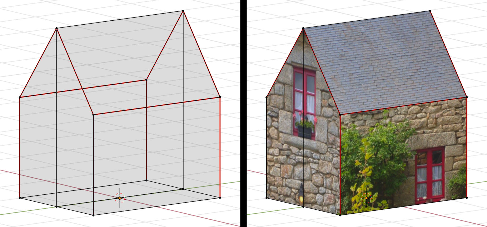

A low poly house

Note: If you want a closer look at this model, you’ll find the Blender and 
texture files in the resources/LowPolyHouse folder for this chapter.

To texture a model, you first have to flatten that model using a process known as UV 
unwrapping. UV unwrapping creates a UV map by unfolding the model. To unfold 
the model, you mark and cut seams using a modeling app. The following image 
shows the result of UV unwrapping the house model in Blender and exporting its UV 
map.

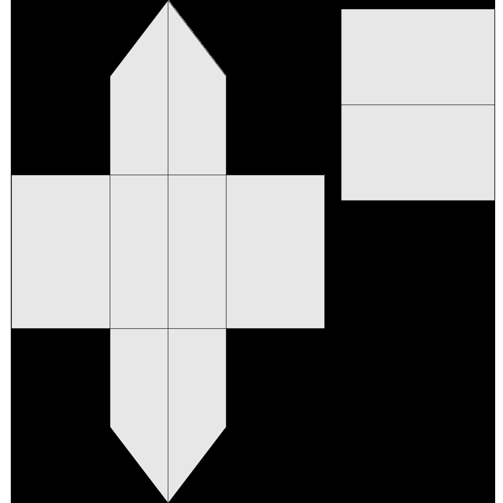

The house UV map

181

Metal by Tutorials
Chapter 8: Textures

Notice that the roof and walls have marked seams. Seams are what make it possible 
for this model to lie flat. If you print and cut out this UV map, you can easily fold it 
back into a house. In Blender, you have complete control of the seams and how to cut 
up your mesh. Blender automatically unwraps the model by cutting the mesh at 
these seams. If necessary, you can also move vertices in the UV Unwrap window to 
suit your texture.

Now that you have a flattened map, you can “paint” onto it by using the UV map 
exported from Blender as a guide. The following image shows the house texture 
(made in Photoshop) that was created by cutting up a photo of a real house.

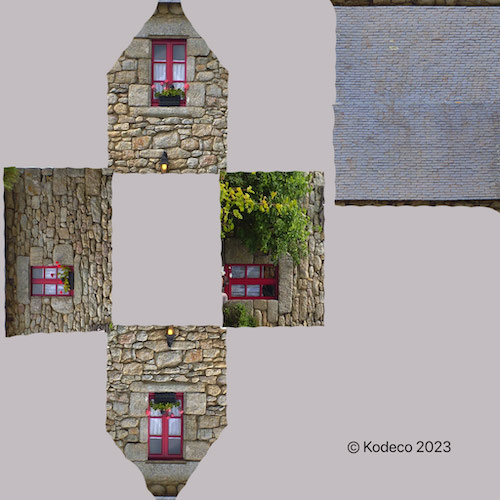

Low poly house color texture

Note how the edges of the texture aren’t perfect, and the copyright message is 
visible. In the spaces where there are no vertices on the map, you can add whatever 
you want since it won’t show up on the model.

Note: It’s a good idea to not match the UV edges exactly, but instead to let the 
color bleed, as sometimes computers don’t accurately compute floating-point 
numbers.

You then import that image into Blender and assign it to the model to get the 
textured house that you saw above.

182

Metal by Tutorials
Chapter 8: Textures

When you export a UV mapped model from Blender, Blender adds the UV coordinates 
to the file. Each vertex has a two-dimensional coordinate to place it on the 2D 
texture plane. The top-left is (0, 1) and the bottom-right is (1, 0).

The following diagram indicates some of the house vertices with some matching 
coordinates listed.

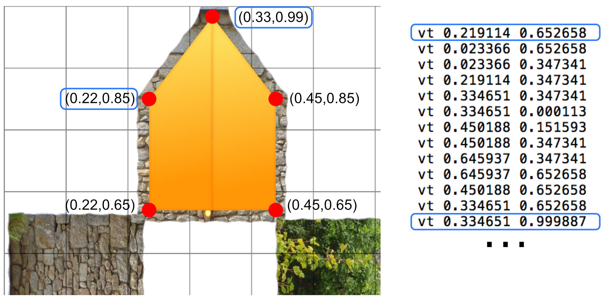

UV coordinates

One of the advantages of mapping from 0 to 1 is that you can swap in lower or higher 
resolution textures. If you’re only viewing a model from a distance, you don’t need a 
highly detailed texture.

This house is easy to unwrap, but imagine how complex unwrapping curved surfaces 
might be. The following image shows a UV map of the train (which is still a simple 
model):

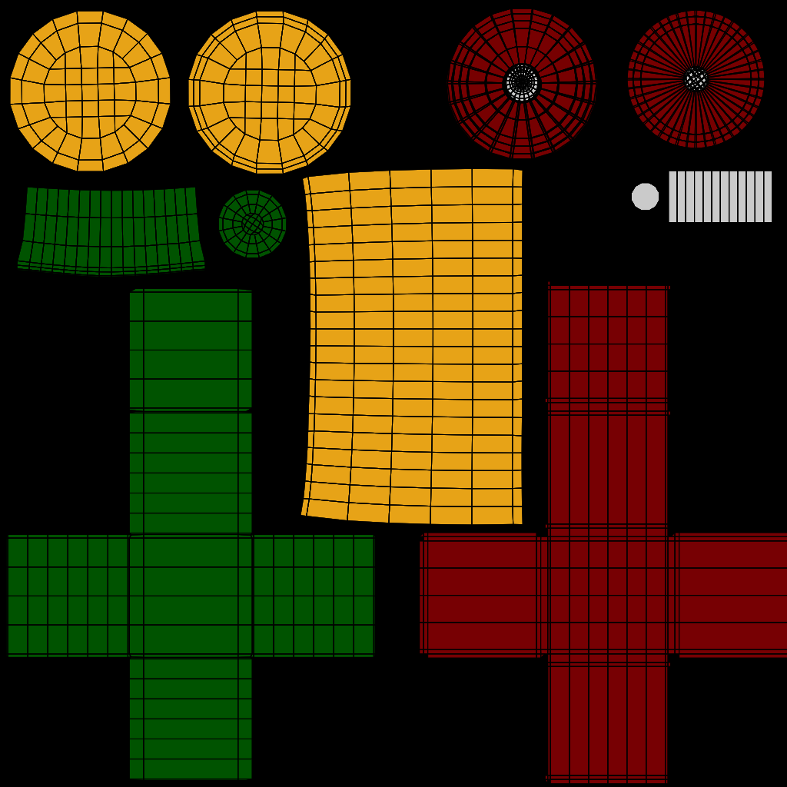

The train's UV map

183

Metal by Tutorials
Chapter 8: Textures

Photoshop, naturally, is not the only solution for texturing a model. You can use any 
image editor for painting on a flat texture. In the last few years, several other apps 
that allow painting directly on the model have become mainstream:

• Blender (free)

• Procreate on iPad ($)

• Substance Designer and Substance Painter by Adobe ($$): In Designer, you can 
create complex materials procedurally. Using Substance Painter, you can paint 
these materials on the model.

• 3DCoat by 3Dcoat.com ($$)

• Mari by Foundry ($$$)

In addition to texturing, using Blender, 3DCoat or Nomad Sculpt on iPad, you can 
sculpt models in a similar fashion to ZBrush and then remesh the high poly sculpt to 
create a low poly model. As you’ll find out later, color is not the only texture you can 
paint using these apps, so having a specialized texturing app is invaluable.

The Starter App

➤ Open the starter project for this chapter, and build and run the app.

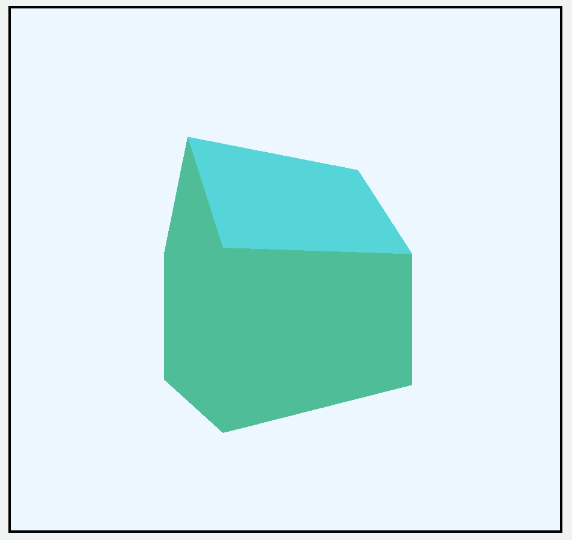

The starter app

The scene contains the low poly house. The fragment shader code is the same code 
from the challenge in the previous chapter, with hemispheric lighting added and a 
different background clear color.

184

Metal by Tutorials
Chapter 8: Textures

The other major changes are:

• Mesh.swift and Submesh.swift extract the Model I/O and MetalKit mesh buffers 
into custom vertex buffers and submesh groups. Model now contains an array of 
Meshs in place of a single MTKMesh. Abstracting away from the Metal API allows for 
greater flexibility when generating models that don’t use Model I/O and MetalKit. 
Remember, it’s your engine, so you can choose how to hold the mesh data.

• Primitive.swift extends Model so that you can render primitive shapes easily. The 
file allows a plane and a sphere, but you could add other primitive shapes.

• VertexDescriptor.swift contains a UV attribute in addition to Position and 
Normal attributes. Model loads UVs in the same way as you loaded normals in the 
previous chapter. Notice how the UVs will go into a separate buffer from the 
position and normal. This isn’t necessary, but it makes the layout more flexible for 
use with custom-generated models.

• Renderer.swift passes uniforms and params to Model to perform the rendering 
code.

• ShaderDefs.h contains VertexIn and VertexOut. These structures have an 
additional uv property. The vertex function passes the interpolated UV to the 
fragment function.

In this chapter, you’ll replace the sky and earth colors in the fragment function with 
colors from the texture. Initially, you’ll use the texture included in lowpoly-
house.usdz,  located in the Models group. To read the texture in the fragment 
function, you’ll take the following steps:

1. Load and store the image texture centrally.

2. Pass the loaded texture to the fragment function before drawing the model.

3. Change the fragment function to read the appropriate pixel from the texture.

1. Loading the Texture

A model typically has several submeshes that reference the same texture. Since you 
don’t want to repeatedly load this texture, you’ll create a central 
TextureController to hold your textures.

185

Metal by Tutorials
Chapter 8: Textures

➤ Create a new Swift file named TextureController.swift. Be sure to include the 
new file in the targets. Replace the code with:

import MetalKit

enum TextureController { 
  static var textures: [String: MTLTexture] = [:] 
}

TextureController will grab the textures used by your models and hold them in 
this dictionary.

➤ Add a new method to TextureController:

static func loadTexture(texture: MDLTexture, name: String) -> 
MTLTexture? { 
  // 1 
  if let texture = textures[name] { 
    return texture 
  } 
  // 2 
  let textureLoader = MTKTextureLoader(device: Renderer.device) 
  // 3 
  let textureLoaderOptions: [MTKTextureLoader.Option: Any] = 
    [.origin: MTKTextureLoader.Origin.bottomLeft] 
  // 4 
  let texture = try? textureLoader.newTexture( 
    texture: texture, 
    options: textureLoaderOptions) 
  print("loaded texture from USD file") 
  // 5 
  textures[name] = texture 
  return texture 
}

This method will receive a Model I/O texture and return a MetalKit texture ready for 
rendering.

Going through the code:

1. If the texture has already been loaded into textures, return it. Note that you’re 
loading the texture by name, so your artists must ensure that the models don’t 
have conflicting names.

2. Create a texture loader using MetalKit’s MTKTextureLoader.

186

Metal by Tutorials
Chapter 8: Textures

3. Change the texture’s origin option to ensure that the texture loads with its origin 
at the bottom-left. Without this option, the texture won’t wrap the house 
correctly.

4. Create a new MTLTexture using the provided texture and loader options. For 
debugging purposes, print a message.

5. Add the texture to textures and return it.

Note: Loading textures can get complicated. When Metal was first released, 
you had to specify everything about the image, such as pixel format, 
dimensions and usage, using MTLTextureDescriptor. However, with 
MetalKit’s MTKTextureLoader, you can use the provided default values and 
optionally change them as needed.

Loading the Submesh Texture

Each submesh of a model’s mesh has a different material characteristic, such as 
roughness, base color and metallic content. For now, you’ll focus only on the base 
color texture. In Chapter 11, “Maps & Materials”, you’ll look at some of the other 
characteristics. Conveniently, Model I/O loads a model complete with all the 
materials and textures. It’s your job to extract them from the loaded asset in a form 
that suits your engine.

➤ Open Model.swift, and locate let asset = MDLAsset.... After this line, add 
this:

Model I/O will add MDLTextureSampler values to the submeshes, so you’ll be able to 
load the textures shortly.

➤ Open Submesh.swift, and inside Submesh, create a structure and a property to 
hold the textures:

struct Textures { 
  var baseColor: MTLTexture? 
}

Don’t worry about compile errors; your project won’t compile until you’ve initialized 
textures.

187

Metal by Tutorials
Chapter 8: Textures

MDLSubmesh holds each submesh’s material information in an MDLMaterial 
property. You provide the material with a semantic to retrieve the value for the 
relevant material. For example, the semantic for base color is 
MDLMaterialSemantic.baseColor.

➤ At the end of Submesh.swift, add three new extensions:

// 1 
private extension Submesh.Textures { 
  init(material: MDLMaterial?) { 
    baseColor = material?.texture(type: .baseColor) 
  } 
}

// 2 
private extension MDLMaterialProperty { 
  var textureName: String { 
    stringValue ?? UUID().uuidString 
  } 
}

// 3 
private extension MDLMaterial { 
  func texture(type semantic: MDLMaterialSemantic) -> 
MTLTexture? { 
    if let property = property(with: semantic), 
       property.type == .texture, 
       let mdlTexture = property.textureSamplerValue?.texture { 
      return TextureController.loadTexture( 
        texture: mdlTexture, 
        name: property.textureName) 
    } 
    return nil 
  } 
}

Going through what these extensions do:

1. Load up the base color (diffuse) texture with the provided submesh material. 
Later, you’ll load other textures for the submesh in the same way.

2.
MDLMaterialProperty.textureName returns either the texture name in the file 
or a unique identifier when no name is provided.

3.
MDLMaterial.property(with:) looks up the provided property in the 
submesh’s material. You then check whether the property type is a texture and 
load the texture into TextureController.textures. Material properties can 
also be float values where there is no texture available for the submesh.

188

Metal by Tutorials
Chapter 8: Textures

➤ At the bottom of init(mdlSubmesh:mtkSubmesh) add:

You initialize the submesh textures and finally remove the compiler warning.

➤ Build and run your app to check that everything’s working. Your model will look 
the same as in the initial screenshot. However, you’ll get a message in the console: 
loaded texture from USD file, showing that the texture loader has successfully 
loaded the house’s texture.

The render hasn't changed

2. Passing the Loaded Texture to the Fragment 
Function

In a later chapter, you’ll learn about several other texture types and how to send 
them to the fragment function using different indices.

➤ Open Common.h in the Shaders group, and add a new enumeration to keep track 
of these texture buffer index numbers:

typedef enum { 
  BaseColor = 0 
} TextureIndices;

➤ Open VertexDescriptor.swift, and add this code to the end of the file:

extension TextureIndices { 
  var index: Int { 
    return Int(self.rawValue) 
  } 
}

189

Metal by Tutorials
Chapter 8: Textures

This code allows you to use BaseColor.index instead of 
Int(BaseColor.rawValue)). A small touch, but it makes your code easier to read.

➤ Open Rendering.swift. This is where you render the model.

In render(encoder:uniforms:params:) where you process the submeshes, add the 
following code below the comment // set the fragment texture here:

encoder.setFragmentTexture( 
  submesh.textures.baseColor, 
  index: BaseColor.index)

You’re now passing the texture to the fragment function in texture buffer 0.

Note: Buffers, textures and sampler states are held in argument tables. As 
you’ve seen, you access these things by index numbers. On iOS, you can hold 
at least 31 buffers and textures, and 16 sampler states in the argument table; 
the number of textures on macOS increases to 128. You can find out feature 
availability for your device in Apple’s Metal Feature Set Tables (https://
apple.co/2UpCT8r).

3. Updating the Fragment Function

➤ Open Fragment.metal, and add the following new argument to fragment_main, 
immediately after VertexOut in [[stage_in]],:

You’re now able to access the texture on the GPU.

➤ Replace all the code in fragment_main with:

When you read or sample the texture, you may not land precisely on a particular 
pixel. In texture space, the units that you sample are known as texels, and you can 
decide how each texel is processed using a sampler. You’ll learn more about 
samplers shortly.

190

Metal by Tutorials
Chapter 8: Textures

➤ Next, add this:

float3 baseColor = baseColorTexture.sample( 
  textureSampler, 
  in.uv).rgb; 
return float4(baseColor, 1);

Here, you sample the texture using the interpolated UV coordinates sent from the 
vertex function, and you retrieve the RGB values. In Metal Shading Language, you 
can use rgb to address the float elements as an equivalent of xyz. You then return 
the texture color from the fragment function.

➤ Build and run the app to see your textured house.

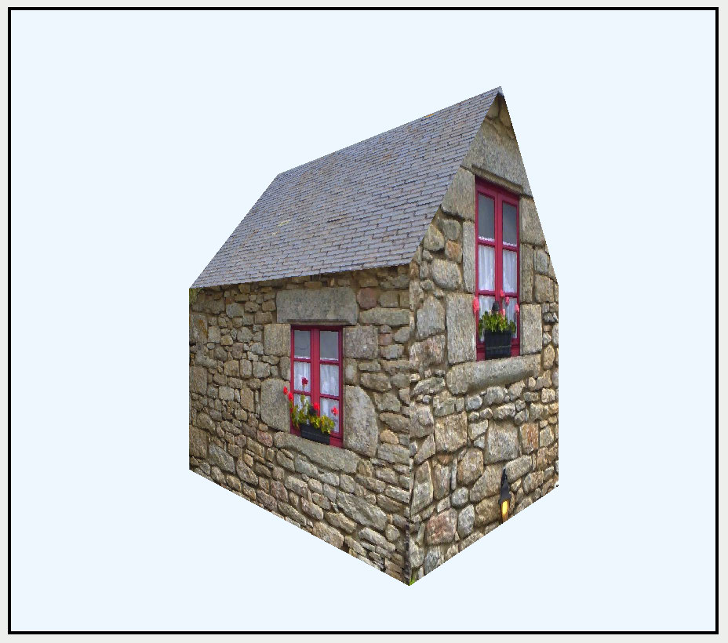

The textured house

The Ground Plane

It’s time to add some ground to your scene. Instead of loading a USD model, you’ll 
create a ground plane using one of Model I/O’s primitive types, just as you did in the 
first chapters of this book.

➤ Open Primitive.swift and make sure that you understand the code.

Model I/O creates the MDLMesh for a plane or a sphere, and initializes the Mesh and 
Submesh. Notice that you can assign your own vertex descriptor after loading the 
MDLMesh, and Model I/O will automatically rearrange the vertex attribute order in the 
mesh buffers.

191

Metal by Tutorials
Chapter 8: Textures

➤ Open Renderer.swift, and add a new property to Renderer to create a ground 
model:

lazy var ground: Model = { 
  Model(name: "ground", primitiveType: .plane) 
}()

➤ In draw(in:) after rendering the house and before 
renderEncoder.endEncoding(), add:

ground.scale = 40 
ground.rotation.z = Float(90).degreesToRadians 
ground.rotation.y = sin(timer) 
ground.render( 
  encoder: renderEncoder, 
  uniforms: uniforms, 
  params: params)

This code scales the ground plane up. The plane in its original position is vertical, so 
you rotate it on the z axis by 90 degrees, and rotate it on the y axis to match the 
rotation of the house. You then render the ground plane.

➤ Build and run the app to see your ground plane.

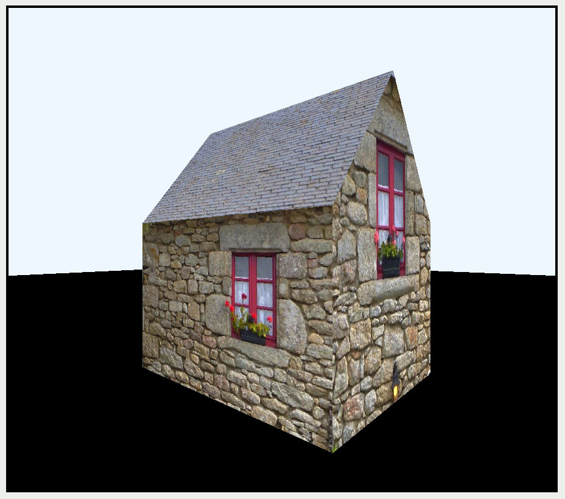

The ground plane

Currently the ground has no texture or color, but you’ll soon fix that by loading a 
texture from the asset catalog.

192

Metal by Tutorials
Chapter 8: Textures

The Asset Catalog

When you write your full game, you’re likely to have many textures for the different 
models. If you use USD format models, the textures will generally be included. 
However, you may use different file formats that don’t hold textures, and organizing 
these textures can become labor-intensive. Plus, you’ll also want to compress images 
where you can and send textures of varying sizes and color gamuts to different 
devices. The asset catalog is where you’ll turn.

As its name suggests, the asset catalog can hold all of your assets, whether they be 
data, images, textures or even colors. You’ve probably used the catalog for app icons 
and images. Textures differ from images in that the GPU uses them, and thus they 
have different attributes in the catalog. To create textures, you add a new texture set 
to the asset catalog.

➤ Create a new file using the Asset Catalog template (found in the Resource 
section), and name it Textures. Remember to add it to the targets.

➤ With Textures.xcassets open, choose Editor ▸ Add New Asset ▸ AR and 
Textures ▸ Texture Set (or click the + at the bottom of the panel and choose AR 
and Textures ▸ Texture Set).

➤ Rename the new texture grass.

➤ Open the resources folder for this chapter, and drag ground.png to the Universal 
slot in your catalog.

Note: Be careful to drop the images on the texture’s Universal slot. If you drag 
the images into the asset catalog, they are, by default, images and not 
textures. You won’t be able to change any texture attributes later.

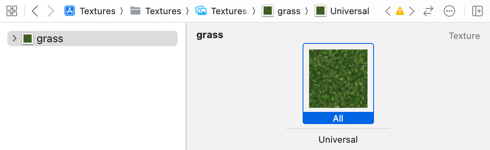

The grass texture

193

Metal by Tutorials
Chapter 8: Textures

You’ll need to add another method to the texture controller to load the named 
texture from the asset catalog.

➤ Open TextureController.swift, and add a new method to TextureController:

static func loadTexture(name: String) -> MTLTexture? { 
  // 1 
  if let texture = textures[name] { 
    return texture 
  } 
  // 2 
  let textureLoader = MTKTextureLoader(device: Renderer.device) 
  let texture: MTLTexture? 
  texture = try? textureLoader.newTexture( 
    name: name, 
    scaleFactor: 1.0, 
    bundle: Bundle.main, 
    options: nil) 
  // 3 
  if texture != nil { 
    print("loaded texture: \(name)") 
    textures[name] = texture 
  } 
  return texture 
}

Going through the code:

1. If you have already loaded a texture of this name return the loaded texture.

2. Set up the texture loader as you did for the USD texture loading. Load the texture 
from the asset catalog, specifying the name. In a real app, you would have 
different sized textures for different resolution scales. In the asset catalog, you 
can assign textures depending on scale as well as device and color gamut. Here 
you only have a single texture, so use scale factor of 1.0.

3. If the texture loads correctly, print out a debug statement, and save it in the 
texture controller.

Now you’ll assign this texture to the ground plane.

➤ Open Model.swift, and add this to the end of the file:

extension Model { 
  func setTexture(name: String, type: TextureIndices) { 
    if let texture = TextureController.loadTexture(name: name) { 
      switch type { 
      case BaseColor: 
        meshes[0].submeshes[0].textures.baseColor = texture

194

Metal by Tutorials
Chapter 8: Textures

default: break 
      } 
    } 
  } 
}

This method loads the texture and assigns it to the model’s first submesh.

Note: This is a quick and easy fix for assigning the texture. It will only work on 
simple models with only one material. If you frequently load your submesh 
textures from the asset catalog, you should set up a Submesh initializer that 
points to the correct textures.

The last thing to do is set the texture on the ground plane.

➤ Open Renderer.swift, and replace the declaration of ground with:

lazy var ground: Model = { 
  let ground = Model(name: "ground", primitiveType: .plane) 
  ground.setTexture(name: "grass", type: BaseColor) 
  return ground 
}()

Here, after loading the model, you load the grass texture from the asset catalog and 
assign it to the ground plane.

➤ Build and run the app to see the flourishing green grass:

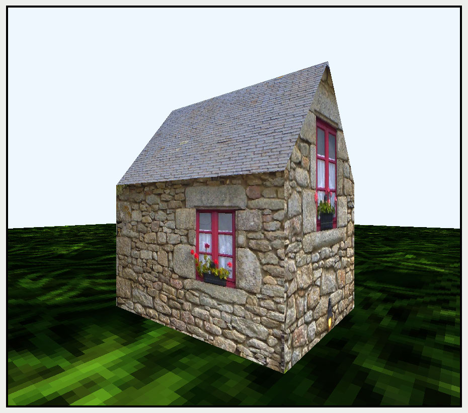

Dark grass texture

This looks like a problem. The grass is much darker than the original texture, and it’s 
stretched and pixellated.

195

Metal by Tutorials
Chapter 8: Textures

sRGB Color Space

The rendered texture looks much darker than the original image because 
ground.png is an sRGB texture. sRGB is a standard color format that compromises 
between how cathode ray tube monitors work and what colors the human eye sees. 
As you can see in the following example of grayscale values from 0 to 1, sRGB colors 
are not linear. Humans are more able to discern between lighter values than darker 
ones.

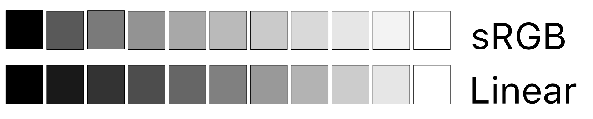

Unfortunately, it’s not easy to do the math on colors in a non-linear space. If you 
multiply a color by 0.5 to darken it, the difference in sRGB will vary along the scale.

You’re currently loading the grass texture as sRGB pixel data and rendering it into a 
linear color space. So when you’re sampling a value of, say 0.2, which in sRGB space 
is mid-gray, the linear space will read that as dark-gray.

To approximately convert the color, you can use the inverse of gamma 2.2:

If you use this formula on baseColor before returning from the fragment function, 
your grass texture will look about the same as the original sRGB texture, but the 
house texture will be washed out, because it is loading in a non-sRGB color space.

Another way of fixing this is to change the view’s color pixel format.

➤ Open Renderer.swift and, in init(metalView:), locate metalView.device = 
device. After this code, add:

Here you change the view’s pixel format from the default bgra8Unorm to the format 
that converts between sRGB and linear space.

196

Metal by Tutorials
Chapter 8: Textures

➤ Build and run the app.

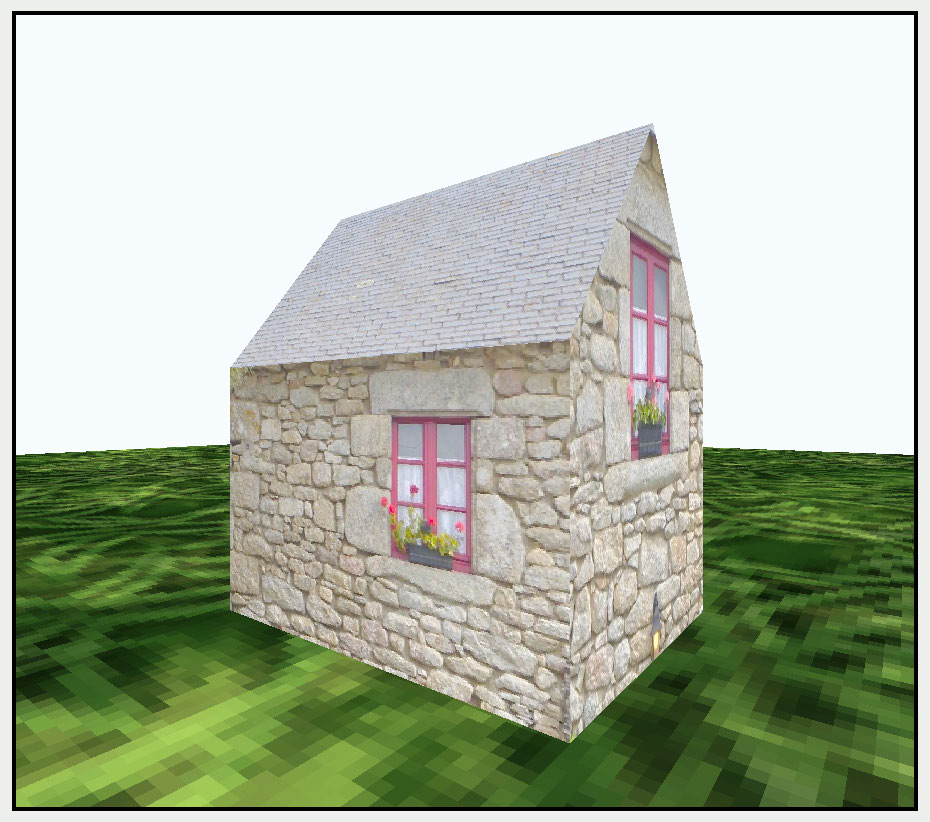

View with sRGB color pixel format

The grass color is much better now, but your non-sRGB house texture is washed out.

➤ Undo the code you just entered: metalView.colorPixelFormat 
= .bgra8Unorm_srgb.

Capture GPU Workload

There’s an easy way to find out what format your texture is in on the GPU, and also 
to look at all the other Metal buffers currently residing there: the Capture GPU 
workload tool (also called the GPU Debugger).

➤ Run your app, and at the bottom of the Xcode window (or above the debug console 
if you have it open), click the M Metal icon, change the number of frames to count to 
1, and click Capture in the pop-up window:

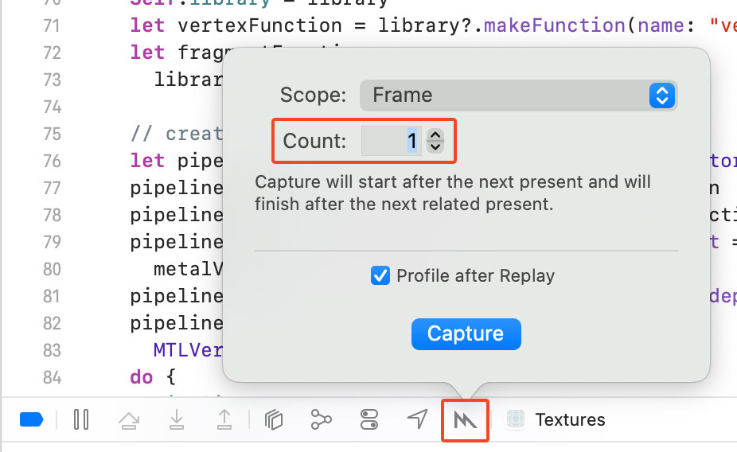

197

Metal by Tutorials
Chapter 8: Textures

This button captures the current GPU frame. On the left in the Debug navigator, 
you’ll see the GPU trace:

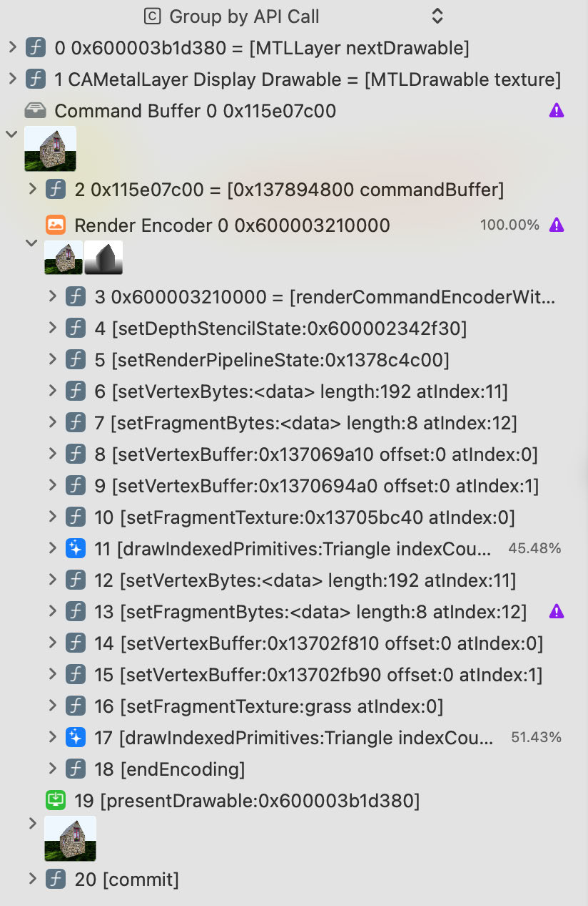

A GPU trace

Note: To open or close all items in a hierarchy, you can Option-click the arrow.

You can see all the commands that you’ve given to the render command encoder, 
such as setFragmentBytes and setRenderPipelineState. Later, when you have 
several command encoders, you’ll see each one of them listed, and you can select 
them to see what actions or textures they have produced from their encoding.

198

Metal by Tutorials
Chapter 8: Textures

➤ Select the first drawIndexedPrimitives at step 11. The Vertex and Fragment 
resources show.

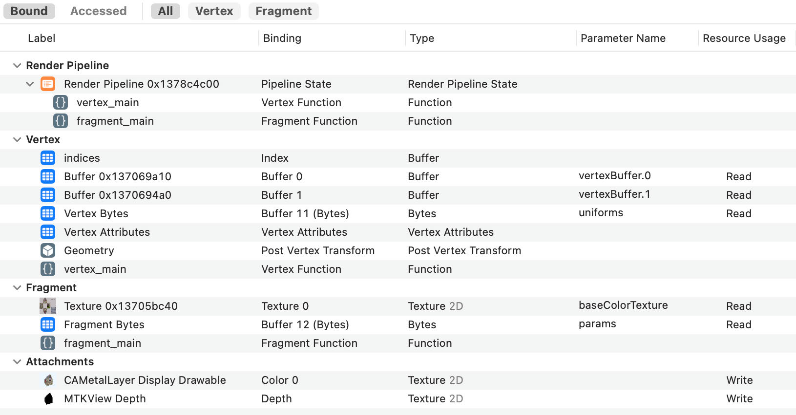

Resources on the GPU

➤ Double-click each vertex resource to see what’s in the buffer:

• indices: The submesh indices.

• Buffer 0: The vertex position and normal data, matching the attributes of your 
VertexIn struct and the vertex descriptor.

• Buffer 1: The UV texture coordinate data.

• Vertex Bytes: The uniform matrices.

• Vertex Attributes: The incoming data from VertexIn, and the VertexOut return 
data from the vertex function. This resource in particular is useful to see the 
results of your vertex function’s calculations.

• vertex_main: The vertex function. When you have multiple vertex functions, this 
is useful to make sure that you set the correct pipeline state.

Going through the fragment resources:

• Texture 0: The house texture in texture slot 0.

• Fragment Bytes: The width and height screen parameters in params.

• fragment_main: The fragment function.

199

Metal by Tutorials
Chapter 8: Textures

The attachments:

• CAMetalLayer Drawable: The result of the encoding in color attachment 0. In 
this case, this is the view’s current drawable. Later, you’ll use multiple color 
attachments.

• MTKView Depth: The depth buffer. Black is closer. White is farther. The rasterizer 
uses the depth map.

➤ Control-click Texture 0 and choose Get Info from the popup menu.

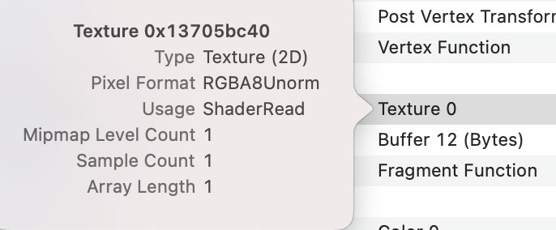

Texture info

The pixel format is RGBA8Unorm, not sRGB.

➤ In the Debug navigator, click the second drawIndexedPrimitives command at 
step 17. Again, control-click the grass texture and choose Get Info from the popup 
menu.

The pixel format this time is RGBA8Unorm_sRGB.

If you’re ever uncertain as to what is happening in your app, capturing the GPU 
frame might give you the heads-up because you can examine every render encoder 
command and every buffer. It’s a good idea to use this strategy throughout this book 
to examine what’s happening on the GPU.

Now to return to your problem with the mismatched textures. Another way of 
dealing with this problem is not to load the asset catalog texture as sRGB at all.

Open Textures.xcassets, click on the grass texture, and in the Attributes inspector, 
change the Interpretation to Data:

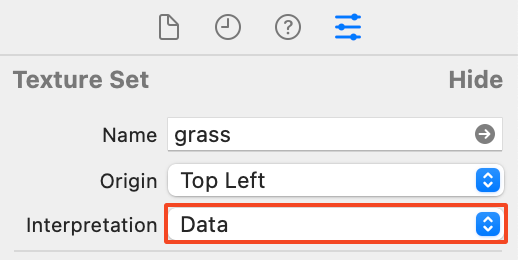

Convert texture to data

200

Metal by Tutorials
Chapter 8: Textures

When your app loads the sRGB texture to a non-sRGB buffer, it automatically 
converts from sRGB space to linear space. (See Apple’s Metal Shading Language 
document for the conversion rule.) By accessing as data instead of colors, your 
shader can treat the color data as linear.

You’ll also notice in the above image that the origin — unlike loading the USD 
texture — is Top Left. The asset catalog loads textures differently.

➤ Build and run the app, and the texture now loads with the linear color pixel format 
bgra8Unorm. You can confirm this by capturing the GPU workload again.

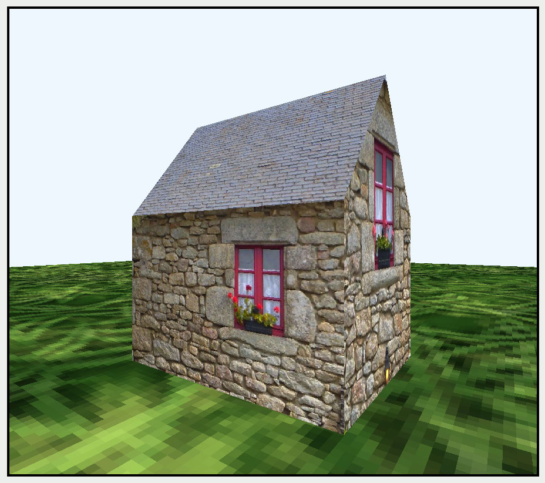

Linear workflow

Now you can deal with the other problems in your render, starting with the 
pixellated grass.

Samplers

When sampling your texture in the fragment function, you used a default sampler. 
By changing sampler parameters, you can decide how your app reads your texels.

The ground texture stretches to fit the ground plane, and each pixel in the texture 
may be used by several rendered fragments, giving it a pixellated look. By changing 
one of the sampler parameters, you can tell Metal how to process the texel where it’s 
smaller than the assigned fragments.

201

Metal by Tutorials
Chapter 8: Textures

➤ Open Fragment.metal. In fragment_main, change the textureSampler 
definition to:

This code instructs the sampler to smooth the texture.

➤ Build and run the app.

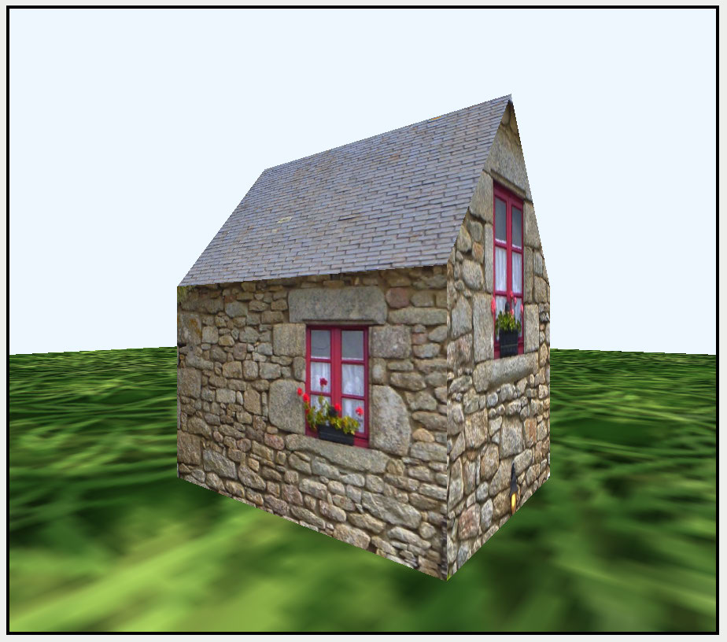

A smoothed texture

The ground texture — although still stretched — is now smooth. There will be times, 
such as when you make a retro game of Frogger, that you’ll want to keep the 
pixelation. In that case, use nearest filtering.

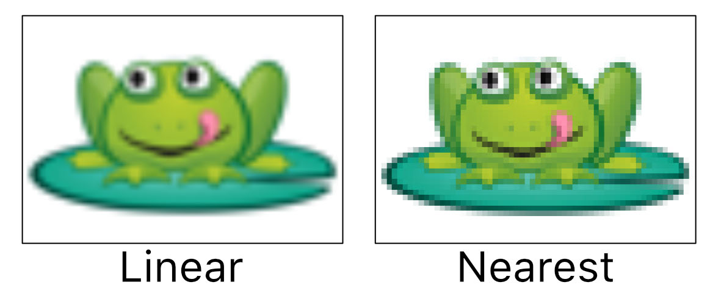

Filtering

In this particular case, however, you want to tile the texture. That’s easy with 
sampling.

202

Metal by Tutorials
Chapter 8: Textures

➤ Change the sampler definition and the baseColor assignment to:

constexpr sampler textureSampler( 
  filter::linear, 
  address::repeat); 
float3 baseColor = baseColorTexture.sample( 
  textureSampler, 
  in.uv * 16).rgb;

This code multiplies the UV coordinates by 16 and accesses the texture outside of 
the allowable limits of 0 to 1. address::repeat changes the sampler’s addressing 
mode, so it’ll repeat the texture 16 times across the plane.

The following image illustrates the other address sampling options shown with a 
tiling value of 3. You can use s_address or t_address to change only the width or 
height coordinates, respectively.

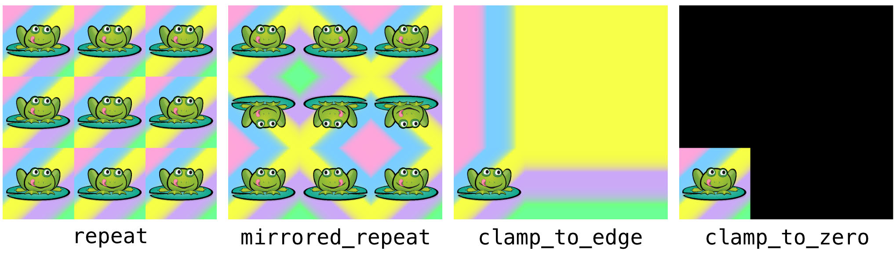

The sampler address mode

➤ Build and run your app.

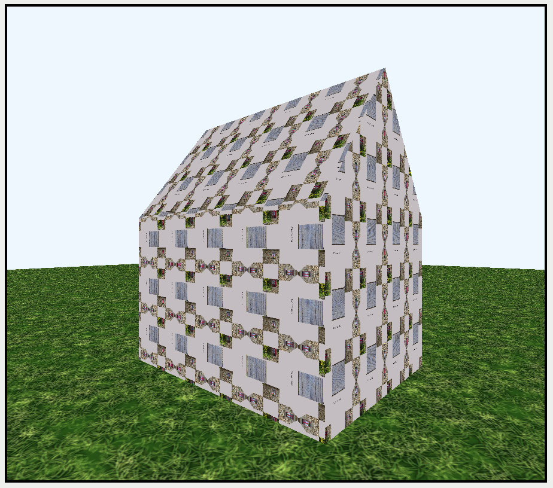

Texture tiling

203

Metal by Tutorials
Chapter 8: Textures

The ground looks great! The house… not so much. The shader has tiled the house 
texture as well. To overcome this problem, you’ll create a tiling property on the 
model and send it to the fragment function with params.

➤ In Common.h, add this to Params:

➤ In Model.swift, create a new property in Model:

➤ Open Rendering.swift, and in render(encoder:uniforms:params:), just after 
var params = fragment, add this:

➤ In Renderer.swift, replace the declaration of ground with:

lazy var ground: Model = { 
  let ground = Model(name: "ground", primitiveType: .plane) 
  ground.setTexture(name: "grass", type: BaseColor) 
  ground.tiling = 16 
  return ground 
}()

You’re now sending the model’s tiling factor to the fragment function.

➤ Open Fragment.metal. In fragment_main, replace the declaration of baseColor 
with:

float3 baseColor = baseColorTexture.sample( 
  textureSampler, 
  in.uv * params.tiling).rgb;

204

Metal by Tutorials
Chapter 8: Textures

➤ Build and run the app, and you’ll see that both the ground and house now tile 
correctly.

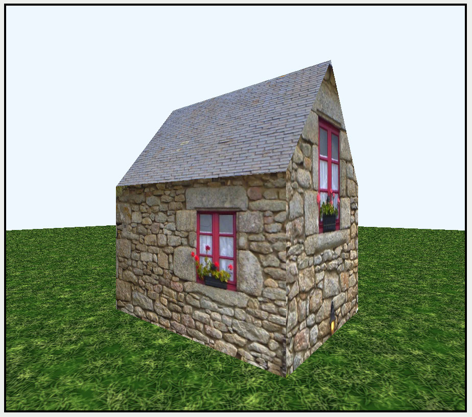

Corrected tiling

Note: Creating a sampler in the shader is not the only option. You can create 
an MTLSamplerState, hold it with the model and send the sampler state to the 
fragment function with the [[sampler(n)]] attribute.

As the scene rotates, you’ll notice some distracting noise. You’ve seen what happens 
on the grass when you oversample a texture. But, when you undersample a texture, 
you can get a rendering artifact known as moiré, which is occurring on the roof of 
the house.

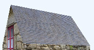

A moiré example

In addition, the noise at the horizon almost looks as if the grass is sparkling. You can 
solve these artifact issues by sampling correctly using resized textures called 
mipmaps.

205

Metal by Tutorials
Chapter 8: Textures

Mipmaps

Check out the relative sizes of the roof texture and how it appears on the screen.

Size of texture compared to on-screen viewing

The pattern occurs because you’re sampling more texels than you have pixels. The 
ideal would be to have the same number of texels to pixels, meaning that you’d 
require smaller and smaller textures the further away an object is. The solution is to 
use mipmaps. Mipmaps let the GPU compare the fragment on its depth texture and 
sample the texture at a suitable size.

MIP stands for multum in parvo — a Latin phrase meaning “much in small”.

Mipmaps are texture maps resized down by a power of 2 for each level, all the way 
down to 1 pixel in size. If you have a texture of 64 pixels by 64 pixels, then a 
complete mipmap set would consist of:

Level 0: 64 x 64, 1: 32 x 32, 2: 16 x 16, 3: 8 x 8, 4: 4 x 4, 5: 2 x 2, 6: 1 x 1.

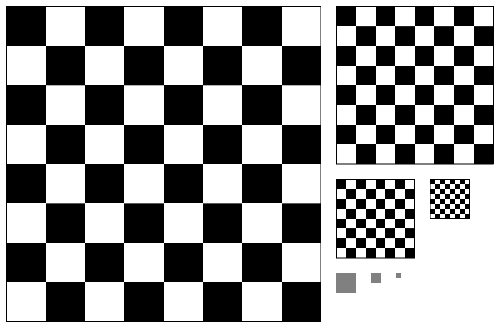

Mipmaps

In the following image, the top checkered texture has no mipmaps. But in the bottom 
image, every fragment is sampled from the appropriate MIP level.

206

Metal by Tutorials
Chapter 8: Textures

As the checkers recede, there’s much less noise, and the image is cleaner. At the 
horizon, you can see the solid color smaller gray mipmaps.

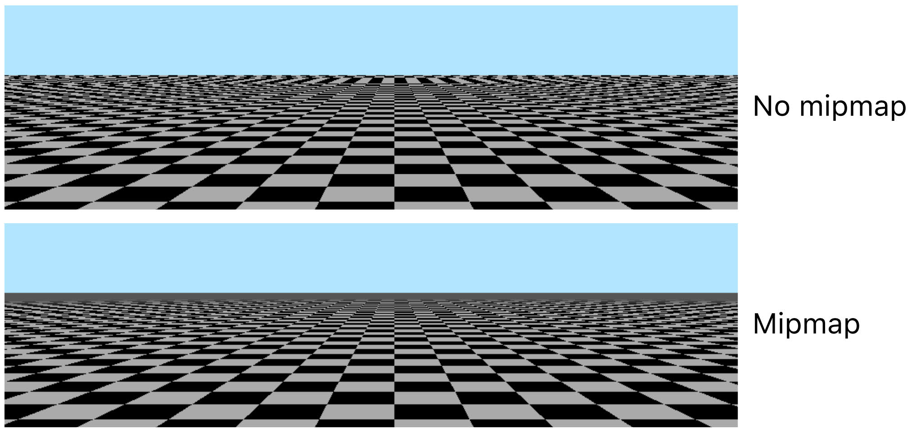

Mipmap comparison

You can easily and automatically generate these mipmaps when first loading the 
texture.

➤ Open TextureController.swift. In loadTexture(texture:name:), change the 
texture loading options to:

let textureLoaderOptions: [MTKTextureLoader.Option: Any] = 
  [.origin: MTKTextureLoader.Origin.bottomLeft, 
   .generateMipmaps: true]

This code will create mipmaps all the way down to the smallest pixel.

There’s one more thing to change: the texture sampler in the fragment shader.

➤ Open Fragment.metal, and add the following code to the construction of 
textureSampler:

The default for mip_filter is none. However, if you provide either .linear 
or .nearest, then the GPU will sample the correct mipmap.

207

Metal by Tutorials
Chapter 8: Textures

➤ Build and run the app.

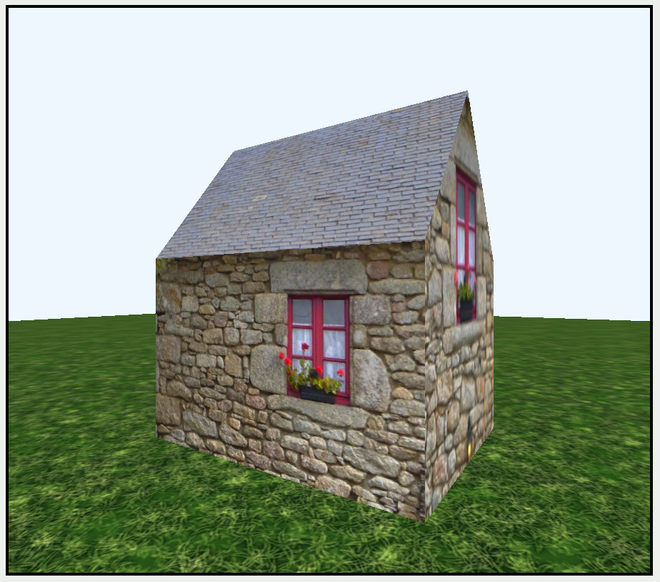

Mipmaps added

The noise from both the building and the ground is gone.

Using the Capture GPU workload tool, you can inspect the mipmaps. Choose the 
draw call, and double-click a texture.

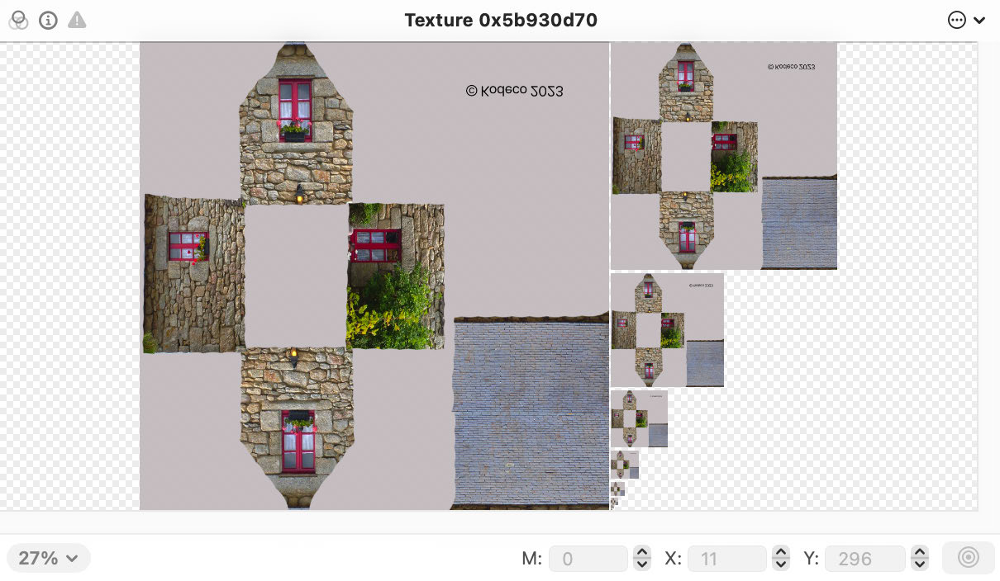

House mipmaps

You can see all the mipmap textures of varying sizes. The GPU will automatically 
load the appropriate mipmap.

208

Metal by Tutorials
Chapter 8: Textures

Asset Catalog Attributes

Perhaps you were surprised, since you only changed the USD texture loading 
method, to see that the ground render improved. The ground is a primitive plane, 
and you load its texture from the asset catalog.

➤ Open Textures.xcassets, and with the Attributes inspector open, click on the 
grass texture to see all of the texture options.

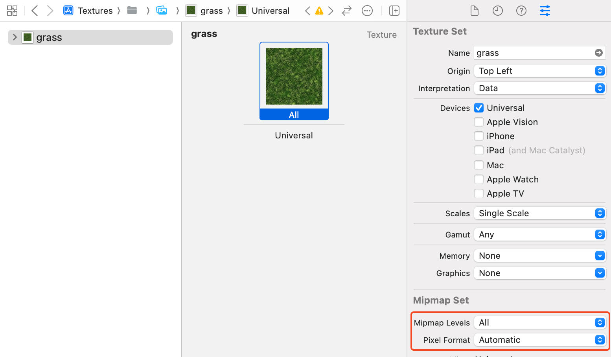

Texture attributes in the asset catalog

Here, you can see that by default, all mipmaps are created automatically. If you 
change Mipmap Levels to Fixed, you can choose how many levels to make. If you 
don’t like the automatic mipmaps, you can replace them with your own custom 
mipmaps by dragging them to the correct slot.

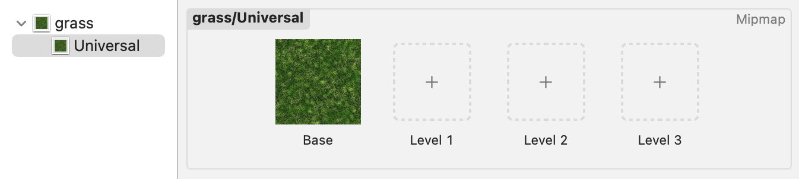

Mipmap slots

209

Metal by Tutorials
Chapter 8: Textures

The Right Texture for the Right Job

Using asset catalogs gives you complete control over how to deliver your textures. 
Currently, you only have one color texture for the grass. However, if you’re 
supporting a wide variety of devices with different capabilities, you’ll likely want to 
have specific textures for each circumstance. On devices with less RAM, you’d want 
smaller graphics.

For example, here is a list of individual textures you can assign by checking the 
different options in the Attributes inspector, for the Apple Watch, and sRGB and P3 
displays.

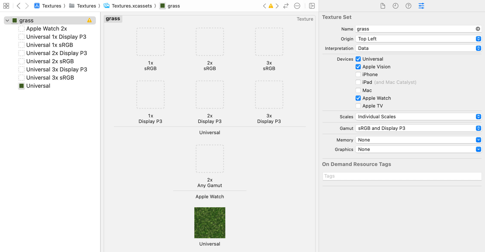

Custom textures in the asset catalog

Anisotropy

Your rendered ground is looking a bit muddy and blurred in the background. This is 
due to anisotropy. Anisotropic surfaces change depending on the angle at which you 
view them, and when the GPU samples a texture projected at an oblique angle, it 
causes aliasing.

➤ In Fragment.metal, add this to the construction of textureSampler:

210

Metal by Tutorials
Chapter 8: Textures

Metal will now take eight samples from the texel to construct the fragment. You can 
specify up to 16 samples to improve quality. Use as few as you can to obtain the 
quality you need because the sampling can slow down rendering.

Note: As mentioned before, you can hold an MTLSamplerState on Model. If 
you increase anisotropy sampling, you may not want it on all models, and this 
might be a good reason for creating the sampler state outside the fragment 
shader.

➤ Build and run, and your render should be artifact-free.

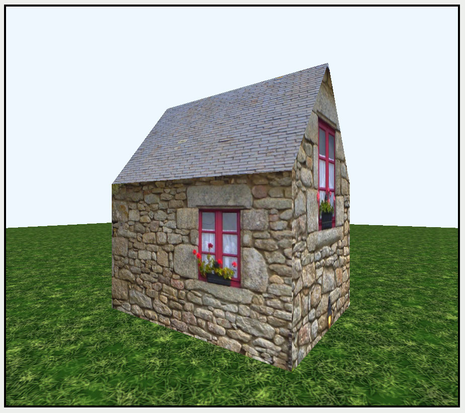

Anisotropy

211

Metal by Tutorials
Chapter 8: Textures

Challenge

In the resources folder for this chapter, you’ll find two textures:

• barn-color.png

• barn-ground.png

Add these two textures to the asset catalog and replace the current textures for the 
house and ground with these. Aside from adding the textures, all you have to change 
is the initialization of the models as described in this chapter. If you have any 
difficulties, check out the challenge folder for this chapter.

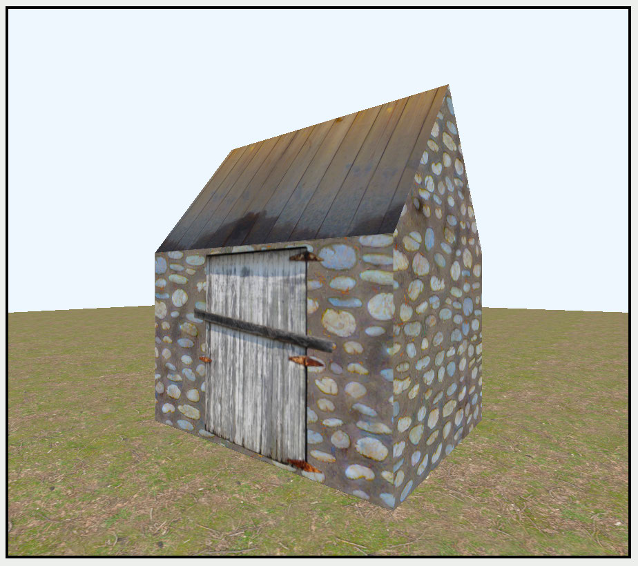

Barn textures

212

Metal by Tutorials
Chapter 8: Textures

Key Points

• UVs, also known as texture coordinates, match vertices to the location in a texture.

• During the modeling process, you flatten the model by marking seams. You can 
then paint on a texture that matches the flattened model map.

• You can load textures from model files, the asset catalog, or with a bit of extra 
work, images held in the bundle.

• A model may be split into groups of vertices known as submeshes. Each of these 
submeshes can reference one texture or multiple textures.

• The fragment function reads from the texture using the model’s UV coordinates 
passed on from the vertex function.

• The sRGB color space is the default color gamut. Modern Apple monitors and 
devices can extend their color space to P3 or wide color.

• Capture GPU workload is a useful debugging tool. Use it regularly to inspect 
what’s happening on the GPU.

• Mipmaps are resized textures that match the fragment sampling. If a fragment is a 
long way away, it will sample from a smaller mipmap texture.

• Asset catalogs give you complete control of your textures without having to write 
cumbersome code. Customization for different devices is easy using the asset 
catalog.

• Topics such as color and compression are huge. In the resources folder for this 
chapter, in references.markdown, you’ll find some recommended articles to read 
further.

213

9