# Navigating a 3D 
Scene

A scene can consist of one or more cameras, lights and models. Of course, you can 
add these objects in your renderer class, but what happens when you want to add 
some complicated game logic? Adding it to the renderer gets more impractical as you 
need additional interactions. Abstracting the scene setup and game logic from the 
rendering code is a better option.

Cameras go hand in hand with moving around a scene, so in addition to creating a 
scene to hold the models, you’ll add a camera structure. Ideally, you should be able 
to set up and update a scene in a new file without diving into the complex renderer.

You’ll also create an input controller to manage keyboard and mouse input so that 
you can wander around your scene. Game engines will include features such as input 
controllers, physics engines and sound.

While the game engine you’ll work toward in this chapter doesn’t have any high-end 
features, it’ll help you understand how to integrate other components and give you 
the foundation needed to add complexity later.

214

Metal by Tutorials
Chapter 9: Navigating a 3D Scene

The Starter Project

Aside from some helpful comments and the unconstrained size of the view, the 
starter project for this chapter is the same as the challenge project for the previous 
chapter.

Scenes

A scene holds models, cameras and lighting. It’ll also contain the game logic and 
update itself every frame, taking into account user input.

➤ Open the starter project. Create a new Swift file called GameScene.swift and 
replace the code with:

import MetalKit

struct GameScene { 
}

If you created a structure named Scene rather than GameScene, there would be a 
conflict with the SwiftUI Scene you use in NavigationApp.swift. If you really want 
to use Scene, you can add the explicit namespace to Scene in NavigationApp.swift 
using SwiftUI.Scene. But it’s best to remember that Scenes belong to SwiftUI.

➤ Add this code to GameScene:

lazy var house: Model = { 
    let house = Model(name: "lowpoly-house.usdz") 
    house.setTexture(name: "barn-color", type: BaseColor) 
    return house 
  }() 
  lazy var ground: Model = { 
    let ground = Model(name: "ground", primitiveType: .plane) 
    ground.setTexture(name: "barn-ground", type: BaseColor) 
    ground.tiling = 16 
    ground.transform.scale = 40 
    ground.transform.rotation.z = Float(90).degreesToRadians 
    return ground 
  }() 
  lazy var models: [Model] = [ground, house]

215

Metal by Tutorials
Chapter 9: Navigating a 3D Scene

You’ll create and set up your models in GameScene, rather than Renderer.

➤ Open Renderer.swift, and remove the instantiation of house and ground.

➤ Add a new property:

You still have some compile errors in draw(in:) because you removed house and 
ground. You’ll fix those shortly.

At the moment, you rotate the models just before drawing them, but it’s a good idea 
to separate update and render. GameScene will update the models, and Renderer 
will render them.

➤ Open GameScene.swift and add a new update method to GameScene:

mutating func update(deltaTime: Float) { 
  ground.rotation.y = sin(deltaTime) 
  house.rotation.y = sin(deltaTime) 
}

Here, you perform the rotation, which is currently in Renderer.

You’ll calculate deltaTime, which is the amount of time that has passed since the 
previous frame soon. You’ll pass this from Renderer to GameScene.

➤ In Renderer.swift, in draw(in:), replace everything between // update and 
render to // end update and render with:

scene.update(deltaTime: timer) 
 for model in scene.models { 
   model.render( 
     encoder: renderEncoder, 
     uniforms: uniforms, 
     params: params) 
 }

216

Metal by Tutorials
Chapter 9: Navigating a 3D Scene

➤ Build and run the app.

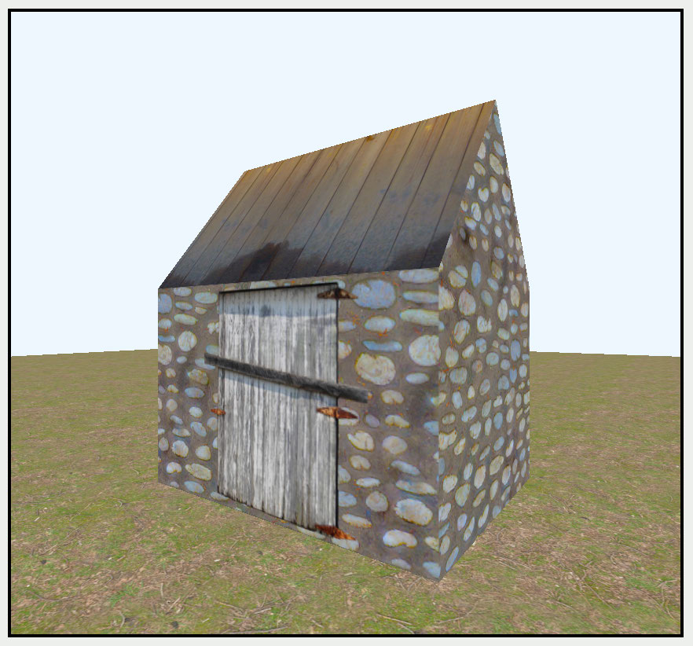

The initial scene

Here, you reduce the complexity of draw(in:), separate the update from the render 
and set up the scene to handle its own updates. You can also more easily add and 
update models in GameScene.

Cameras

Instead of creating view and projection matrices in the renderer, you can abstract the 
construction and calculation away from the rendering code to a Camera structure. 
Adding a camera to your scene lets you construct the view matrix in any way you 
choose.

Currently, you rotate the scene by rotating both house and ground in the y axis. 
While it looks to the viewer as if a camera is rotating around the scene, in fact, the 
view matrix doesn’t change. Now you’ll explore how to move a camera around the 
scene with keyboard and mouse input.

Setting up a camera is simply a way of calculating a view matrix. Miscalculating the 
view matrix is a frequent pain point where your carefully rendered objects result in a 
blank screen. So, it’s worth spending time working out common camera setups.

217

Metal by Tutorials
Chapter 9: Navigating a 3D Scene

➤ Create a new Swift file named Camera.swift, and replace the existing code with:

import CoreGraphics

protocol Camera: Transformable { 
  var projectionMatrix: float4x4 { get } 
  var viewMatrix: float4x4 { get } 
  mutating func update(size: CGSize) 
  mutating func update(deltaTime: Float) 
}

Cameras have a position and rotation, so they should conform to Transformable. All 
cameras have a projection and view matrix as well as methods to perform when the 
window size changes and when each frame updates.

➤ Create a custom camera:

struct FPCamera: Camera { 
  var transform = Transform() 
}

You created a first-person camera. Eventually, this camera will move forward when 
you press the W key. You’ll get a compile error until you’ve completed the following 
code.

➤ Add this code to FPCamera:

var aspect: Float = 1.0 
var fov = Float(70).degreesToRadians 
var near: Float = 0.1 
var far: Float = 100 
var projectionMatrix: float4x4 { 
  float4x4( 
    projectionFov: fov, 
    near: near, 
    far: far, 
    aspect: aspect) 
}

Currently, you set up the projection matrix in Renderer‘s 
mtkView(_:drawableSizeWillChange:). You’ll remove that code in Renderer 
shortly.

➤ Add a new method to update the camera’s aspect ratio:

mutating func update(size: CGSize) { 
  aspect = Float(size.width / size.height) 
}

218

Metal by Tutorials
Chapter 9: Navigating a 3D Scene

➤ Add the camera’s view matrix calculation:

var viewMatrix: float4x4 { 
  (float4x4(rotation: rotation) * 
  float4x4(translation: position)).inverse 
}

Each camera calculates its own projection and view matrix. You’ll change this view 
matrix in a moment. But first, you’ll run the app to see what this matrix does.

➤ Add the update method:

mutating func update(deltaTime: Float) { 
}

This method repositions the camera every frame.

You’ve now set up all the properties and methods required to conform to Camera.

➤ Open GameScene.swift, and add a new camera property:

➤ Then add an initializer to GameScene:

init() { 
  camera.position = [0, 1.4, -4.0] 
}

➤ Create a new method:

mutating func update(size: CGSize) { 
  camera.update(size: size) 
}

This code will update the camera when the screen size changes.

➤ Open Renderer.swift and replace the entire contents of 
mtkView(_:drawableSizeWillChange:) with:

When the screen size changes, the scene update calls the camera update, which in 
turn updates the aspect ratio needed for the projection matrix.

219

Metal by Tutorials
Chapter 9: Navigating a 3D Scene

➤ In draw(in:), after scene.update(deltaTime: timer), add:

uniforms.viewMatrix = scene.camera.viewMatrix 
uniforms.projectionMatrix = scene.camera.projectionMatrix

Here, you set up the uniforms the vertex shader requires.

➤ Next, remove the previous viewMatrix assignment at the top of draw(in:):

uniforms.viewMatrix = 
  float4x4(translation: [0, 1.4, -4.0]).inverse

Now instead of rotating the ground and the house, you can easily rotate the camera.

➤ Open GameScene.swift. In update(deltaTime:), replace:

ground.rotation.y = sin(deltaTime) 
house.rotation.y = sin(deltaTime)

With:

➤ Build and run the app.

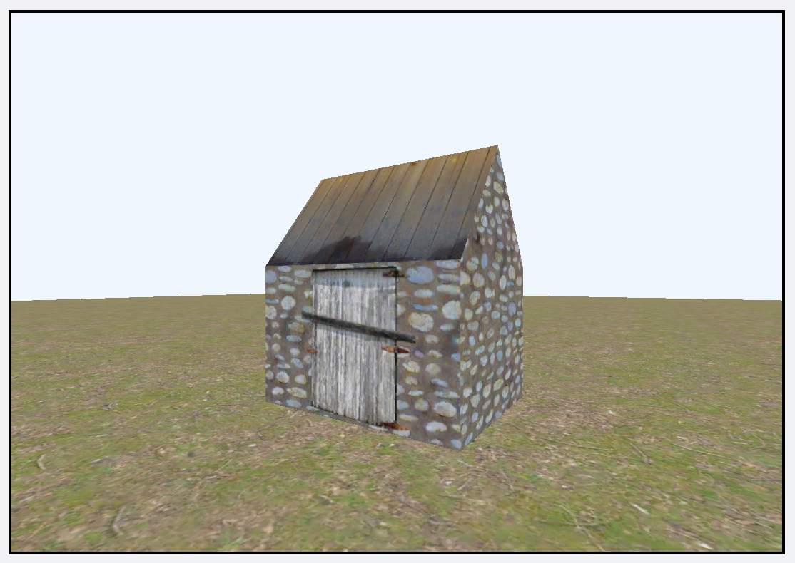

The camera rotating

The scene looks the same, but instead of rotating the house and ground, the camera 
now rotates around the world origin. When you update the view matrix, the vertex 
shader code updates the final transformation of all the models in the scene.

220

Metal by Tutorials
Chapter 9: Navigating a 3D Scene

However, you don’t want the camera to rotate around the world origin in a first-
person camera: You want it to rotate around its own origin.

➤ Open Camera.swift, and change viewMatrix in FPCamera to:

var viewMatrix: float4x4 { 
  (float4x4(translation: position) * 
  float4x4(rotation: rotation)).inverse 
}

Here, you reverse the order of matrix multiplication so that the camera rotates 
around its own origin.

➤ Build and run the app.

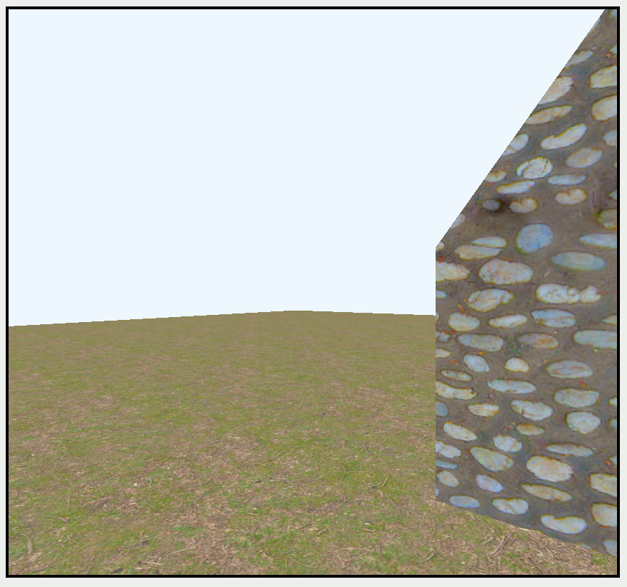

The camera rotating around its center

The camera now rotates in place. Next, you’ll set up keys to move around the scene.

Input

There are various forms of input, such as game controllers, keyboards, mice and 
trackpads. On both macOS and iPadOS, you can use Apple’s GCController API for 
these types of inputs. This API helps you set your code up for:

• Events or Interrupts: Takes action when the user presses the key. You can set 
delegate methods or closures of code to run when an event occurs.

• Polling: Processes all pressed keys on every frame.

221

Metal by Tutorials
Chapter 9: Navigating a 3D Scene

In this app, you’ll use polling to move your cameras and players. It’s a personal 
choice, and neither method is better than the other.

The input code you’ll build works on macOS and iPadOS if you connect a keyboard 
and mouse to your iPad. If you want input on your iPhone or iPad without extra 
controllers, use GCVirtualController, which lets you configure on-screen controls 
that emulate a game controller. You can download Apple’s Supporting Game 
Controllers sample code (https://apple.co/3qfeL60) that demonstrates this.

➤ Create a new Swift file named InputController.swift, and replace the code with:

import GameController

class InputController { 
  static let shared = InputController() 
}

This code creates a singleton input controller that you can access throughout your 
app.

➤ Add a new property to InputController:

In this set, InputController keeps track of all keys currently pressed.

To track the keyboard, you need to set up an observer.

➤ Add this initializer:

private init() { 
  let center = NotificationCenter.default 
  center.addObserver( 
    forName: .GCKeyboardDidConnect, 
    object: nil, 
    queue: nil) { notification in 
      let keyboard = notification.object as? GCKeyboard 
        keyboard?.keyboardInput?.keyChangedHandler 
          = { _, _, keyCode, pressed in 
        if pressed { 
          self.keysPressed.insert(keyCode) 
        } else { 
          self.keysPressed.remove(keyCode) 
        } 
      } 
  } 
}

222

Metal by Tutorials
Chapter 9: Navigating a 3D Scene

Here, you add an observer to set the keyChangedHandler when the keyboard first 
connects to the app. When the player presses or lifts a key, the keyChangedHandler 
code runs and either adds or removes the key from the set.

Now test to see if it works.

➤ Open GameScene.swift, and add this to the end of update(deltaTime:):

if InputController.shared.keysPressed.contains(.keyH) { 
  print("H key pressed") 
}

➤ Build and run the app. Then press different keys.

Press the H key in the console and you’ll see your print log.

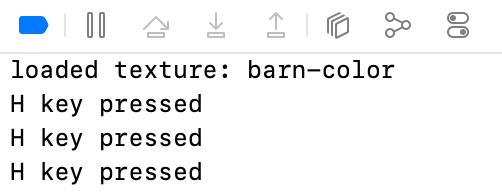

Notice the annoying warning ‘beep’ from macOS when you press the keys.

➤ Open InputController.swift, and add this to the end of init():

#if os(macOS) 
  NSEvent.addLocalMonitorForEvents( 
    matching: [.keyUp, .keyDown]) { _ in nil } 
#endif

Here, on macOS only, you interrupt the view’s responder chain by handling any key 
presses and telling the system that it doesn’t need to take action when a key is 
pressed. You don’t need to do this for iPadOS, as the iPad doesn’t make the keyboard 
noise.

Note: You could add keys to keysPressed in this code instead of using the 
observer. However, that wouldn’t work on iPadOS, and GCKeyCode is easier to 
read than the raw key values that NSEvent gives you.

➤ Build and rerun the app. Test pressing keys.

223

Metal by Tutorials
Chapter 9: Navigating a 3D Scene

Now the noise is gone. If you have a Bluetooth keyboard and an iPad device, connect 
the keyboard to the iPad and test that it also works on iPadOS.

➤ Open GameScene.swift, and remove the key testing code.

You can now capture any pressed key. Soon, you’ll set up standard movement keys to 
move the camera.

Delta Time

First, you’ll set up the left and right arrows on the keyboard to control the camera’s 
rotation.

When considering movement, think about how much time has passed since the last 
movement occurred. In an ideal world, at 60 frames per second, a frame should take 
0.01667 milliseconds to execute. However, some displays can produce 120 frames per 
second or even a variable refresh rate.

If you get a choppy frame rate, you can smooth out the movement by calculating 
delta time, which is the amount of time since the previous execution of the code.

➤ Open Renderer.swift, and replace var timer: Float 0 with:

lastTime holds the time from the previous frame. You initialize it with the current 
time.

➤ In draw(in:), remove:

➤ Replace scene.update(deltaTime: timer) with:

let currentTime = CFAbsoluteTimeGetCurrent() 
let deltaTime = Float(currentTime - lastTime) 
lastTime = currentTime 
scene.update(deltaTime: deltaTime)

Here, you get the current time and calculate the difference from the last time.

224

Metal by Tutorials
Chapter 9: Navigating a 3D Scene

Camera Rotation

➤ Open GameScene.swift. In update(deltaTime:), replace:

With:

➤ Create a new Swift file named Movement.swift, and add:

enum Settings { 
  static var rotationSpeed: Float { 2.0 } 
  static var translationSpeed: Float { 3.0 } 
  static var mouseScrollSensitivity: Float { 0.1 } 
  static var mousePanSensitivity: Float { 0.008 } 
}

You can tweak these settings to make your camera and mouse movement smooth. 
Eventually, you might choose to replace Settings with a user interface that sets the 
values.

• rotationSpeed: How many radians the camera should rotate in one second. You’ll 
calculate the amount the camera should rotate in delta time.

• translationSpeed: The distance per second that your camera should travel.

• mouseScrollSensitivity and mousePanSensitivity: Settings to adjust mouse 
tracking and scrolling.

➤ Add a new protocol:

protocol Movement where Self: Transformable { 
}

225

Metal by Tutorials
Chapter 9: Navigating a 3D Scene

Your game might move a player object instead of a camera, so make the movement 
code as flexible as possible. Now you can give any Transformable object Movement.

➤ Create an extension with a default method:

extension Movement { 
  func updateInput(deltaTime: Float) -> Transform { 
    var transform = Transform() 
    let rotationAmount = deltaTime * Settings.rotationSpeed 
    let input = InputController.shared 
    if input.keysPressed.contains(.leftArrow) { 
      transform.rotation.y -= rotationAmount 
    } 
    if input.keysPressed.contains(.rightArrow) { 
      transform.rotation.y += rotationAmount 
    } 
    return transform 
  } 
}

You already told InputController to add and remove key presses to a Set called 
keysPressed. Here, you find out if keysPressed contains the arrow keys. If it does, 
you change the transform rotation value.

➤ Open Camera.swift and add the protocol conformance to FPCamera:

➤ Still in Camera.swift, add this code to update(deltaTime:):

let transform = updateInput(deltaTime: deltaTime) 
rotation += transform.rotation

You update the camera’s rotation with the transform calculated in Movement.

226

Metal by Tutorials
Chapter 9: Navigating a 3D Scene

➤ Build and run the app. Now, use the arrow keys to rotate the camera.

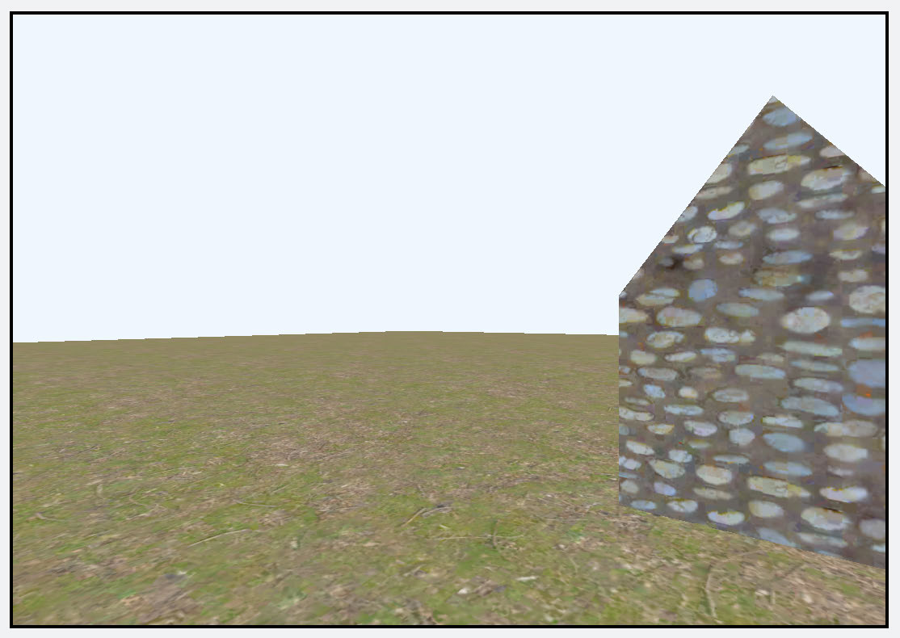

Using arrow keys to rotate the camera

Camera Movement

You can implement forward and backward movement the same way using standard 
WASD keys:

• W: Move forward

• A: Strafe left

• S: Move backward

• D: Strafe right

Here’s what to expect when you move the camera through the scene:

• You’ll move along the x and z axes.

• Your camera will have a direction vector. When you press the W key, you’ll move 
along the z axis in a positive direction.

• If you press the W and D keys simultaneously, you’ll move diagonally.

• When you press the left and right arrow keys, you’ll rotate in the corresponding 
direction, which changes the camera’s forward direction vector.

227

Metal by Tutorials
Chapter 9: Navigating a 3D Scene

➤ Open Movement.swift, and add a computed property to Movement’s extension:

var forwardVector: float3 { 
  normalize([sin(rotation.y), 0, cos(rotation.y)]) 
}

This is the forward vector based on the current rotation.

The following image shows an example of forward vectors when rotation.y is 0º 
and 45º:

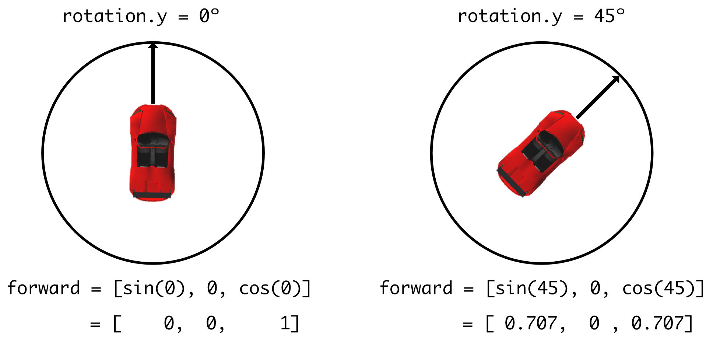

Forward vectors

➤ Add a computed property to handle strafing from side to side:

var rightVector: float3 { 
  [forwardVector.z, forwardVector.y, -forwardVector.x] 
}

This vector points 90º to the right of the forward vector.

➤ Still in Movement, at the end of updateInput(deltaTime:), before return, add:

var direction: float3 = .zero 
if input.keysPressed.contains(.keyW) { 
  direction.z += 1 
} 
if input.keysPressed.contains(.keyS) { 
  direction.z -= 1 
} 
if input.keysPressed.contains(.keyA) { 
  direction.x -= 1

228

Metal by Tutorials
Chapter 9: Navigating a 3D Scene

} 
if input.keysPressed.contains(.keyD) { 
  direction.x += 1 
}

This code processes each depressed key and creates a final desired direction vector. 
For instance, if the game player presses W and A, she wants to go diagonally forward 
and left. The final direction vector is [-1, 0, 1].

➤ After the previous code, add:

let translationAmount = deltaTime * Settings.translationSpeed 
if direction != .zero { 
  direction = normalize(direction) 
  transform.position += (direction.z * forwardVector 
    + direction.x * rightVector) * translationAmount 
}

Here, you calculate the transform’s position from its current forward and right 
vectors and the desired direction.

➤ Open Camera.swift, and add this code to the end of update(deltaTime:):

➤ Build and run the app. Now, you can move about your scene using the keyboard 
controls.

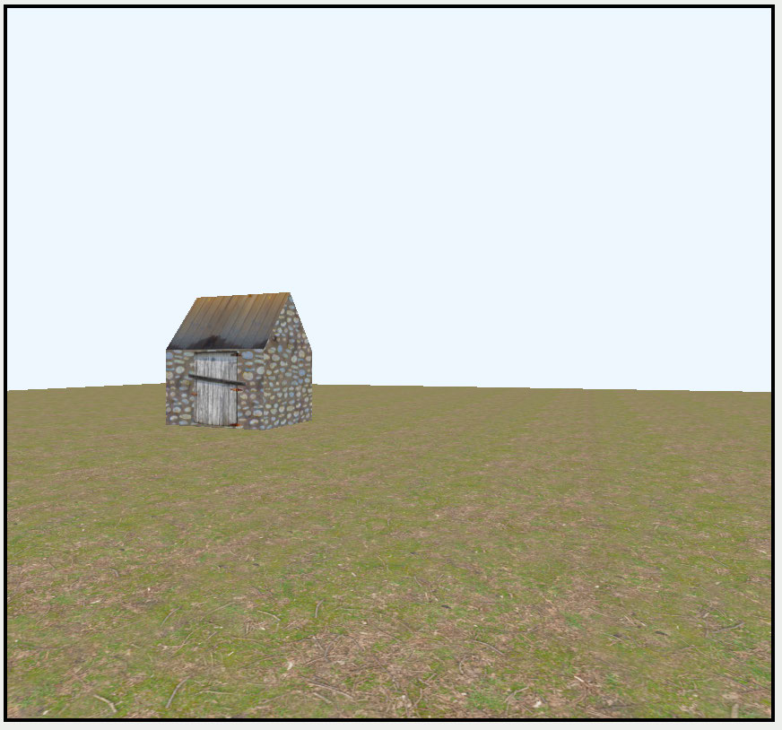

Moving around the scene using the keyboard

229

Metal by Tutorials
Chapter 9: Navigating a 3D Scene

Mouse and Trackpad Input

Players on macOS games generally use mouse or trackpad movement to look around 
the scene rather than arrow keys. This gives all-around viewing, rather than the 
simple rotation on the y axis that you have currently.

➤ Open InputController.swift, and add a new structure to InputController that 
you’ll use in place of CGPoint:

struct Point { 
  var x: Float 
  var y: Float 
  static let zero = Point(x: 0, y: 0) 
}

Make sure that Point goes inside InputController to avoid future name conflicts. 
Point is the same as CGPoint, except it contains Floats rather than CGFloats.

➤ Add these properties to InputController to record mouse movement:

var leftMouseDown = false 
var mouseDelta = Point.zero 
var mouseScroll = Point.zero

• leftMouseDown: Tracks when the player does a left-click.

• mouseDelta: The movement since the last tracked movement.

• mouseScroll: Keeps track of how much the player scrolls with the mouse wheel.

➤ At the end of init(), add:

center.addObserver( 
  forName: .GCMouseDidConnect, 
  object: nil, 
  queue: nil) { notification in 
    let mouse = notification.object as? GCMouse 
}

This code to connect the mouse is similar to how you handled the keyboard 
connection.

➤ Inside the closure, after setting mouse, add:

// 1 
mouse?.mouseInput?.leftButton.pressedChangedHandler = { _, _, 
pressed in

230

Metal by Tutorials
Chapter 9: Navigating a 3D Scene

self.leftMouseDown = pressed 
} 
// 2 
mouse?.mouseInput?.mouseMovedHandler = { _, deltaX, deltaY in 
  self.mouseDelta = Point(x: deltaX, y: deltaY) 
} 
// 3 
mouse?.mouseInput?.scroll.valueChangedHandler = { _, xValue, 
yValue in 
  self.mouseScroll.x = xValue 
  self.mouseScroll.y = yValue 
}

Here, you:

1. Record when the user holds down the left mouse button.

2. Track mouse movement.

3. Record scroll wheel movement. xValue and yValue are normalized values 
between -1 and 1. If you use a game controller instead of a mouse, the first 
parameter is dpad, which tells you which directional pad element changed.

Now you’re ready to use these tracked mouse input values.

Note: For iOS, you should use touch values rather than mouse tracking. The 
challenge project sample sets up MetalView with gestures that update 
InputController values.

Arcball Camera

In many apps, the camera rotates about a particular point. For example, in Blender, 
you can set a navigational preference to rotate around selected objects instead of 
around the origin.

➤ Open Camera.swift. Copy and paste the FPCamera structure without the 
extension.

➤ Rename the copied structure:

231

Metal by Tutorials
Chapter 9: Navigating a 3D Scene

➤ Since you’re not implementing Movement, remove all the code from 
update(deltaTime:).

Your code will now compile.

➤ Open GameScene.swift and change the camera initialization to:

Now, you have a camera with no movement.

Orbiting a Point

The camera needs a track  to rotate about a point:

• Target: The point the camera will orbit.

• Distance: The distance between the camera and the target. The player controls 
this with the mouse wheel.

• Rotation: The camera’s rotation about the point. The player controls this by left-
clicking the mouse and dragging.

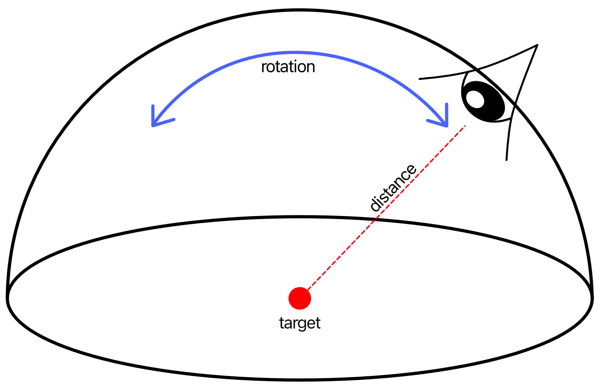

Orbiting a point

232

Metal by Tutorials
Chapter 9: Navigating a 3D Scene

From these three properties, you can determine the camera’s world position and 
rotate it to always point at the target position. To do this:

1. First, rotate the distance vector around the y axis.

2. Then, rotate the distance vector around the x axis.

3. Add the target position to the rotated vector to get the new world position of the 
camera.

4. Rotate the camera to look at the target position.

➤ Open Camera.swift, and add the necessary properties to ArcballCamera to keep 
track of the camera’s orbit:

let minDistance: Float = 0.0 
let maxDistance: Float = 20 
var target: float3 = [0, 0, 0] 
var distance: Float = 2.5

You’ll constrain distance with minDistance and maxDistance.

➤ In update(deltaTime:), add:

let input = InputController.shared 
let scrollSensitivity = Settings.mouseScrollSensitivity 
distance -= (input.mouseScroll.x + input.mouseScroll.y) 
  * scrollSensitivity 
distance = min(maxDistance, distance) 
distance = max(minDistance, distance) 
input.mouseScroll = .zero

Here, you change distance depending on the mouse scroll values.

➤ Continue with this code:

if input.leftMouseDown { 
  let sensitivity = Settings.mousePanSensitivity 
  rotation.x += input.mouseDelta.y * sensitivity 
  rotation.y += input.mouseDelta.x * sensitivity 
  rotation.x = max(-.pi / 2, min(rotation.x, .pi / 2)) 
  input.mouseDelta = .zero 
}

233

Metal by Tutorials
Chapter 9: Navigating a 3D Scene

If the player drags with the left mouse button, update the camera’s rotation values.

➤ Add this after the previous code:

let rotateMatrix = float4x4( 
  rotationYXZ: [-rotation.x, rotation.y, 0]) 
let distanceVector = float4(0, 0, -distance, 0) 
let rotatedVector = rotateMatrix * distanceVector 
position = target + rotatedVector.xyz

Here, you complete the calculations to rotate the distance vector and add the target 
position to the new vector. In MathLibrary.swift, float4x4(rotationYXZ:) creates 
a matrix using rotations in Y / X / Z order.

The lookAt Matrix

A lookAt matrix rotates the camera so it always points at a target. In 
MathLibrary.swift, you’ll find a float4x4 initialization init(eye:center:up:). 
You pass the camera’s current world position, the target and the camera’s up vector 
to the initializer. In this app, the camera’s up vector is always [0, 1, 0].

➤ In ArcballCamera, replace viewMatrix with:

var viewMatrix: float4x4 { 
  let matrix: float4x4 
  if target == position { 
    matrix = (float4x4(translation: target) * 
float4x4(rotationYXZ: rotation)).inverse 
  } else { 
    matrix = float4x4(eye: position, center: target, up: [0, 1, 
0]) 
  } 
  return matrix 
}

If the position is the same as the target, you simply rotate the camera to look around 
the scene at the target position. Otherwise, you rotate the camera with the lookAt 
matrix.

➤ Open GameScene.swift, and add this to the end of init():

camera.distance = length(camera.position) 
camera.target = [0, 1.2, 0]

With an arcball camera, you set the target and distance as well as the position.

234

Metal by Tutorials
Chapter 9: Navigating a 3D Scene

➤ Build and run the app. Zoom in to get a view of the inside of the barn.

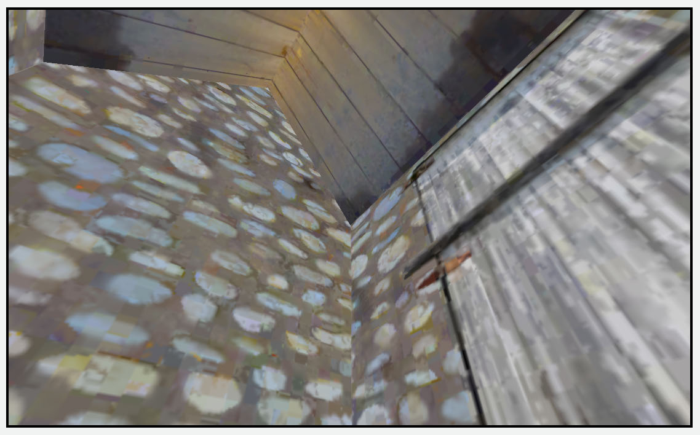

Inside the barn

Click and drag to orbit the barn. In Movement.swift, change Settings to suit your 
tracking preferences.

Orthographic Projection

So far, you’ve created cameras with perspective so that objects further back in your 
3D scene appear smaller than the ones closer to the camera. Orthographic projection 
flattens three dimensions to two dimensions without any perspective distortion.

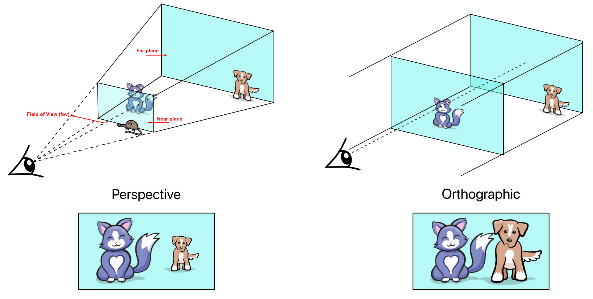

Orthographic projection

235

Metal by Tutorials
Chapter 9: Navigating a 3D Scene

Sometimes it’s a little difficult to see what’s happening in a large scene. To help with 
that, you’ll build a top-down camera that shows the whole scene without any 
perspective distortion.

➤ Open Camera.swift, and add a new camera:

struct OrthographicCamera: Camera, Movement { 
  var transform = Transform() 
  var aspect: CGFloat = 1 
  var viewSize: CGFloat = 10 
  var near: Float = 0.1 
  var far: Float = 100 
 
  var viewMatrix: float4x4 { 
    (float4x4(translation: position) * 
    float4x4(rotation: rotation)).inverse 
  } 
}

aspect is the ratio of the window’s width to height. viewSize is the unit size of the 
scene. You’ll calculate the projection frustum in the shape of a box.

➤ Add the projection matrix code:

var projectionMatrix: float4x4 { 
  let rect = CGRect( 
    x: -viewSize * aspect * 0.5, 
    y: viewSize * 0.5, 
    width: viewSize * aspect, 
    height: viewSize) 
  return float4x4(orthographic: rect, near: near, far: far) 
}

236

Metal by Tutorials
Chapter 9: Navigating a 3D Scene

Here, you calculate a rectangle for the front of the frustum using the view size and 
aspect ratio. Then you call the orthographic initializer defined in MathLibrary.swift 
with the frustum’s near and far values.

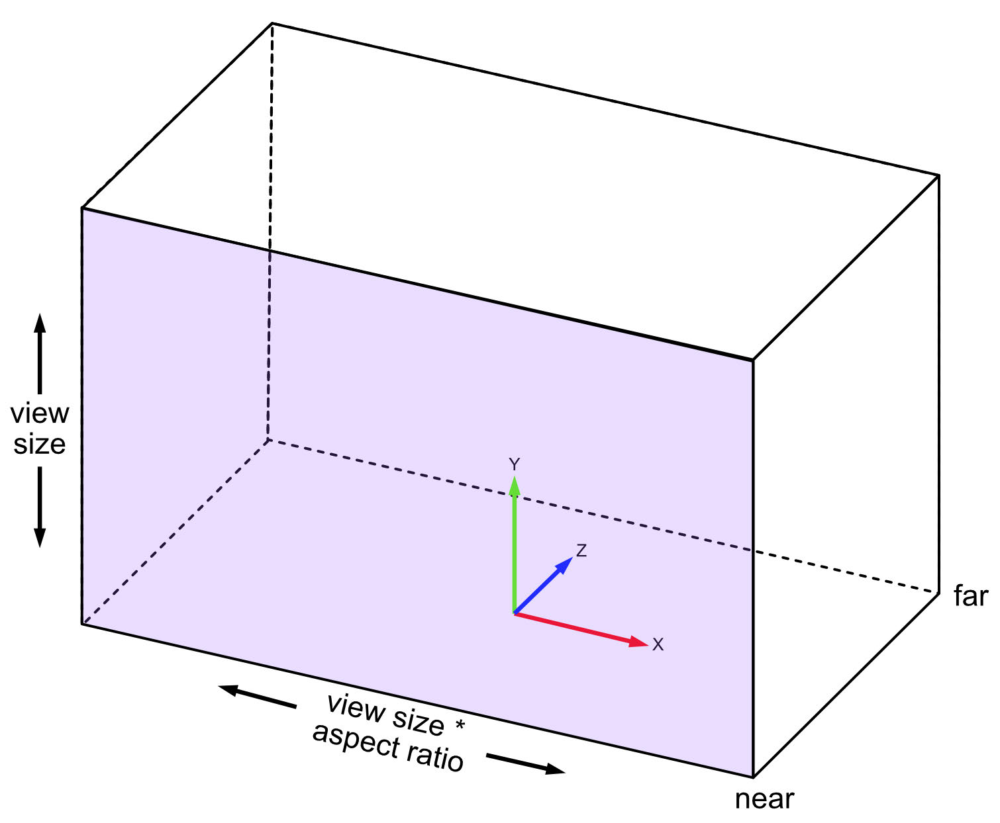

The orthographic projection frustum

➤ Add the method to update the camera when the view size changes:

mutating func update(size: CGSize) { 
  aspect = size.width / size.height   
}

This code sets the aspect ratio for the orthographic projection matrix.

237

Metal by Tutorials
Chapter 9: Navigating a 3D Scene

➤ Add the frame update method:

mutating func update(deltaTime: Float) { 
  let transform = updateInput(deltaTime: deltaTime) 
  position += transform.position 
  let input = InputController.shared 
  let zoom = input.mouseScroll.x + input.mouseScroll.y 
  viewSize -= CGFloat(zoom) 
  input.mouseScroll = .zero 
}

Here, you use the previous Movement code to move around the scene using the 
WASD keys. You don’t need rotation, as you’re going to position the camera to be 
top-down. You use the mouse scroll to change the view size, which allows you to 
zoom in and out of the scene.

➤ Open GameScene.swift and change camera to:

➤ Replace the contents of init() with:

camera.position = [3, 2, 0] 
camera.rotation.y = -.pi / 2

➤ Build and run the app.

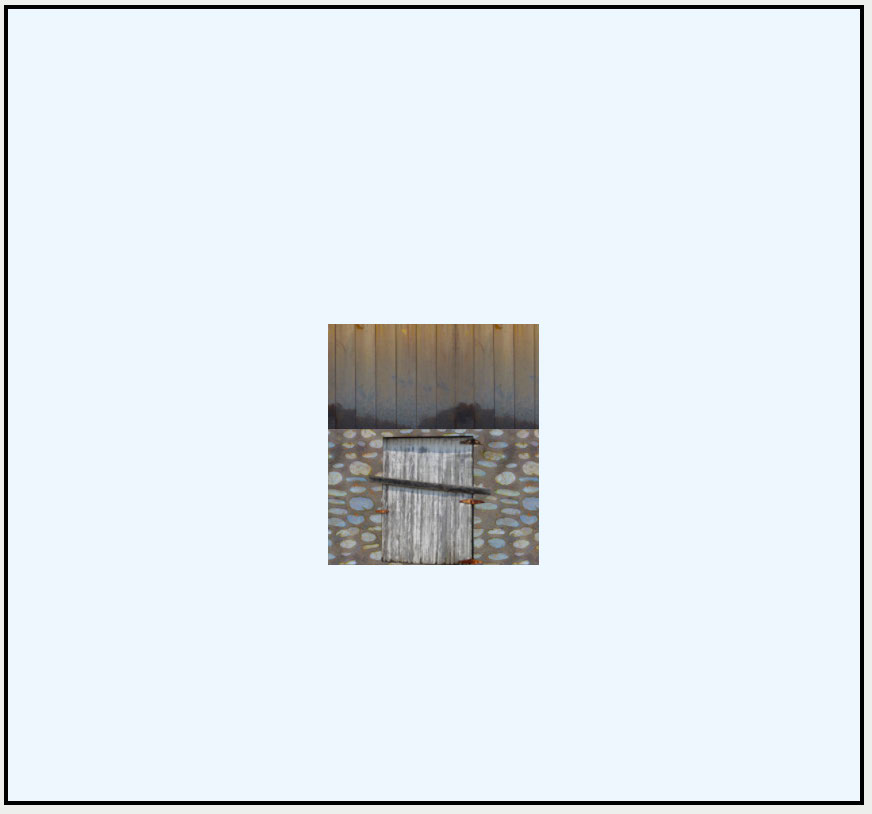

Orthographic viewing from the front

238

Metal by Tutorials
Chapter 9: Navigating a 3D Scene

You’ll see a scene with no perspective. You might be surprised by this result. You 
can’t see the ground because there’s no field of view, which means you effectively 
“see” the ground plane side-on.

Replace the previous code in init() with:

camera.position = [0, 2, 0] 
camera.rotation.x = .pi / 2

This code places the camera in a top-down rotation.

➤ Build and run the app. You can still move the WASD movement keys to move 
about the scene and use the mouse scroll to zoom out.

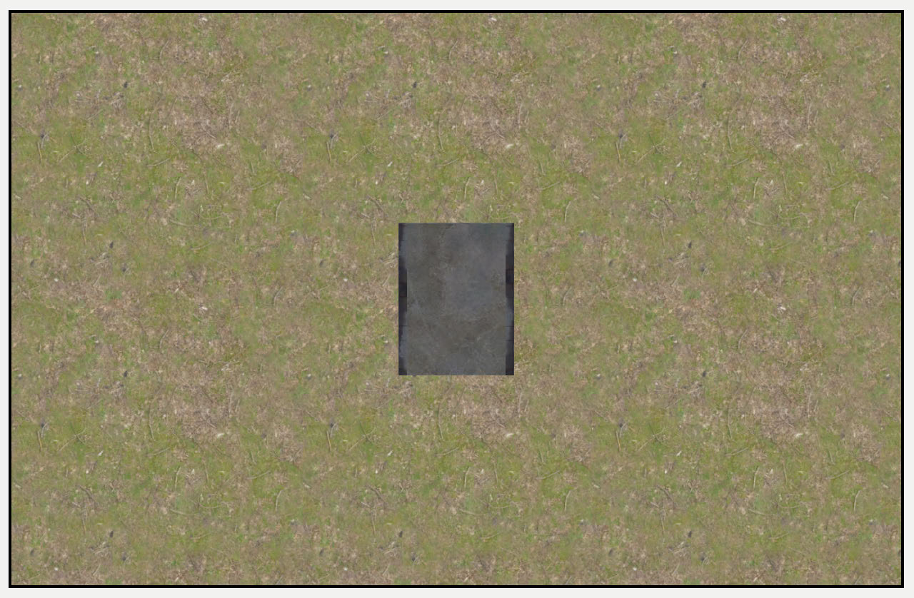

Orthographic viewing from the top

You’ll often use an orthographic camera when creating 2D games that look down on 
an entire board. Later, you’ll also use an orthographic camera when implementing 
shadows from directional lights.

239

Metal by Tutorials
Chapter 9: Navigating a 3D Scene

Challenge

For your challenge, combine FPCamera and ArcballCamera into one PlayerCamera. 
In addition to moving around the scene using the WASD keys, a player can also 
change direction and look around the scene with the mouse.

To achieve this:

• Copy FPCamera to PlayerCamera. This  sets position and rotation.

• Copy the left mouse down code from ArcballCamera’s update(deltaTime:) to 
the end of PlayerCamera‘s update(deltaTime:). This sets rotation when the 
mouse is used. PlayerCamera won’t use the scroll wheel for zooming.

• The view matrix should use rotation without the z axis because you always travel 
on the xy plane. So, replace PlayerCamera’s viewMatrix with:

var viewMatrix: float4x4 { 
  let rotateMatrix = float4x4( 
    rotationYXZ: [-rotation.x, rotation.y, 0]) 
  return (float4x4(translation: position) * 
rotateMatrix).inverse 
}

• Change the camera in GameScene and set its initial position.

When you finish, wander around your scene with your left hand on the keyboard to 
control forward motion and your right hand on the mouse to control direction. The 
left and right arrow keys will work for rotation, too.

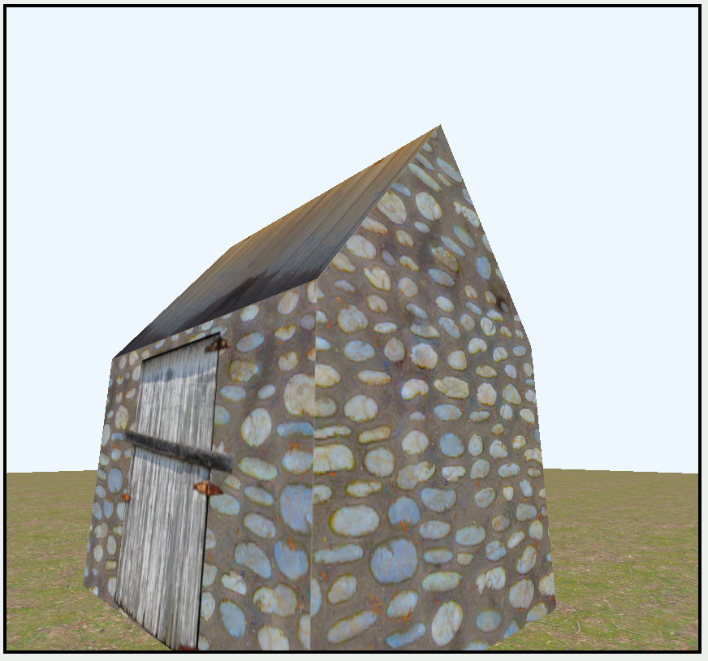

Moving around the scene

The challenge project contains extra code for iPadOS touch gestures instead of using 
a mouse or trackpad.

240

Metal by Tutorials
Chapter 9: Navigating a 3D Scene

Key Points

• Scenes abstract game code and scene setup away from the rendering code.

• Camera structures let you calculate the view and projection matrices separately 
from rendering the models.

• On macOS and iPadOS, use Apple’s GCController API to process input from game 
controllers, keyboards and mice.

• On iOS, GCVirtualController gives you onscreen D-pad controls.

• For a first-person camera, calculate position and rotation from the player’s 
perspective.

• An arcball camera orbits a target point.

• An orthographic camera renders without perspective so that all vertices rendered 
to the 2D screen appear at the same distance from the camera.

241

10