# Lighting 
Fundamentals

Light and shade are important requirements for making your scenes pop. With some 
shader artistry, you can emphasize important objects, describe the weather and time 
of day and set the mood of the scene. Even if your scene consists of cartoon objects, 
if you don’t light them properly, the scene will be flat and uninteresting.

One of the simplest methods of lighting is the Phong reflection model. It’s named 
after Bui Tong Phong who published a paper in 1975 extending older lighting 
models. The idea is not to attempt duplication of light and reflection physics but to 
generate pictures that look realistic.

This model has been popular for over 40 years and is a great place to start learning 
how to fake lighting using a few lines of code. All computer images are fake, but 
there are more modern real-time rendering methods that model the physics of light.

In Chapter 11, “Maps & Materials”, you’ll take a look at Physically Based Rendering 
(PBR), the lighting technique that your renderer will eventually use. PBR is a more 
realistic lighting model, but Phong is easy to understand and get started with.

242

Metal by Tutorials
Chapter 10: Lighting Fundamentals

The Starter Project

➤ Open the starter project for this chapter.

The starter project’s files are now in sensible groups. In the Game group, the project 
contains a new game controller class which further separates scene updates and 
rendering. Renderer is now independent from GameScene. GameController 
initializes and owns both Renderer and GameScene. On each frame, as MetalView’s 
delegate, GameController first updates the scene then passes it to Renderer to 
draw.

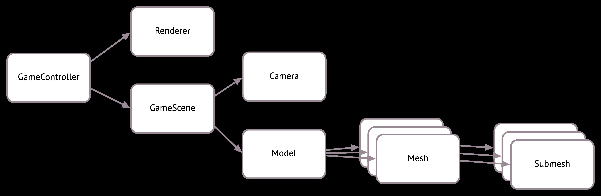

Object ownership

In GameScene.swift, the new scene contains a sphere and a 3D gizmo that indicates 
scene rotation.

DebugLights.swift in the Utility group contains some code that you’ll use later for 
debugging where lights are located. Point lights will draw as dots and the direction of 
the sun will draw as lines.

243

Metal by Tutorials
Chapter 10: Lighting Fundamentals

➤ Familiarize yourself with the code and build and run the project.

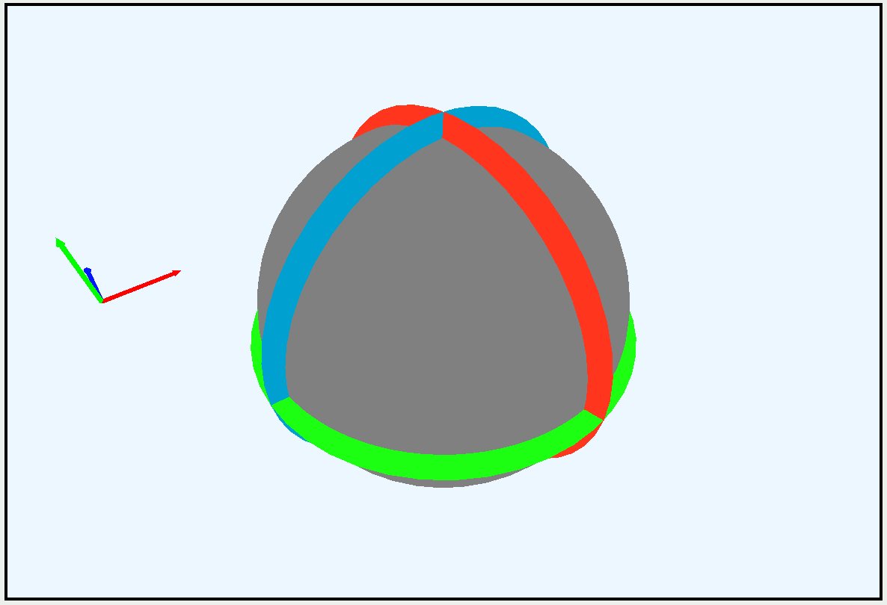

The starter app

To rotate around the sphere and fully appreciate your lighting, the camera is an 
ArcballCamera type. Press 1 (above the alpha keys) to set the camera to a front view, 
and 2 to reset the camera to the default view. GameScene contains the key pressing 
code for this.

You can see that the sphere colors are very flat. In this chapter, you’ll add shading 
and specular highlights.

Representing Color

In this book, you’ll learn the necessary basics to get you rendering light, color and 
simple shading. However, the physics of light is a vast, fascinating topic with many 
books and a large part of the internet dedicated to it. You can find further reading in 
references.markdown in the resources directory for this chapter.

In the real world, the reflection of different wavelengths of light is what gives an 
object its color. A surface that absorbs all light is black. Inside the computer world, 
pixels display color. The more pixels, the better the resolution and this makes the 
resulting image clearer. Each pixel is made up of subpixels. These are a 
predetermined single color, either red, green or blue. By turning on and off these 
subpixels, depending on the color depth, the screen can display most of the colors 
visible to the human eye.

244

Metal by Tutorials
Chapter 10: Lighting Fundamentals

In Swift, you can represent a color using the RGB values for that pixel. For example, 
float3(1, 0, 0) is a red pixel, float3(0, 0, 0) is black and float3(1, 1, 1) is 
white.

From a shading point of view, you can combine a red surface with a gray light by 
multiplying the two values together:

The result is (0.5, 0, 0), which is a darker shade of red.

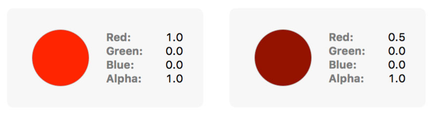

Color shading

For simple Phong lighting, you can use the slope of the surface. The more the surface 
slopes away from a light source, the darker the surface becomes.

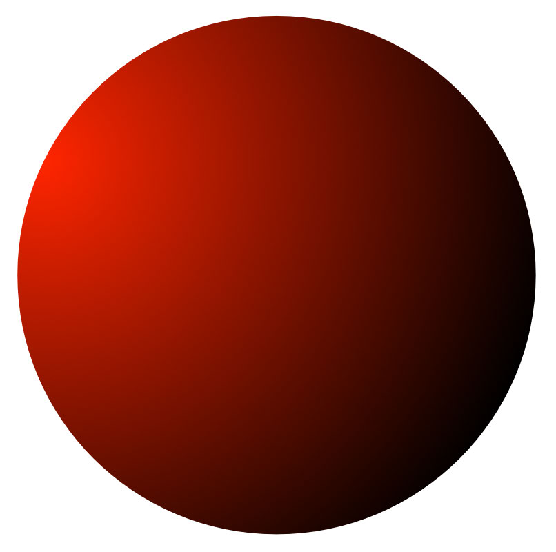

A 3D shaded sphere

245

Metal by Tutorials
Chapter 10: Lighting Fundamentals

Normals

The slope of a surface can determine how much a surface reflects light.

In the following diagram, point A is facing straight toward the sun and will receive 
the most amount of light; point B is facing slightly away but will still receive some 
light; point C is facing entirely away from the sun and shouldn’t receive any of the 
light.

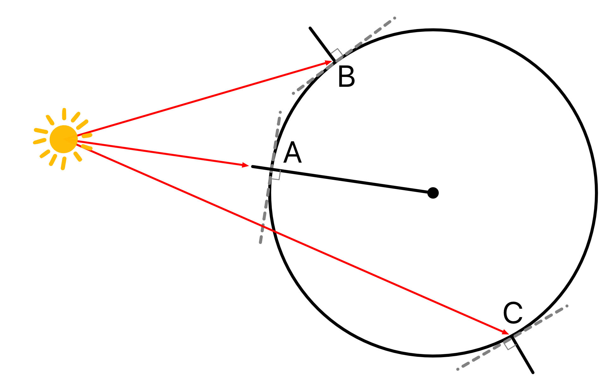

Surface normals on a sphere

Note: In the real world, light bounces from surface to surface; if there’s any 
light in the room, there will be some reflection from objects that gently lights 
the back surfaces of all the other objects. This is global illumination. The 
Phong lighting model lights each object individually and is called local 
illumination.

The dotted lines in the diagram are tangent to the surface. A tangent line is a 
straight line that best describes the slope of the curve at a point.

The lines coming out of the circle are at right angles to the tangent lines. These are 
called surface normals, and you first encountered these in Chapter 7, “The 
Fragment Function”.

246

Metal by Tutorials
Chapter 10: Lighting Fundamentals

Light Types

There are several standard light options in computer graphics, each of which has 
their origin in the real world.

• Directional Light: Sends light rays in a single direction. The sun is a directional 
light.

• Point Light: Sends light rays in all directions like a light bulb.

• Spotlight: Sends light rays in limited directions defined by a cone. A flashlight or 
a desk lamp would be a spotlight.

Directional Light

A scene can have many lights. In fact, in studio photography, it would be highly 
unusual to have just a single light. By putting lights into a scene, you control where 
shadows fall and the level of darkness. You’ll add several lights to your scene through 
the chapter.

The first light you’ll create is the sun. The sun is a point light that puts out light in 
all directions, but for computer modeling, you can consider it a directional light. It’s 
a powerful light source a long way away. By the time the light rays reach the earth, 
the rays appear to be parallel. Check this outside on a sunny day — everything you 
can see has its shadow going in the same direction.

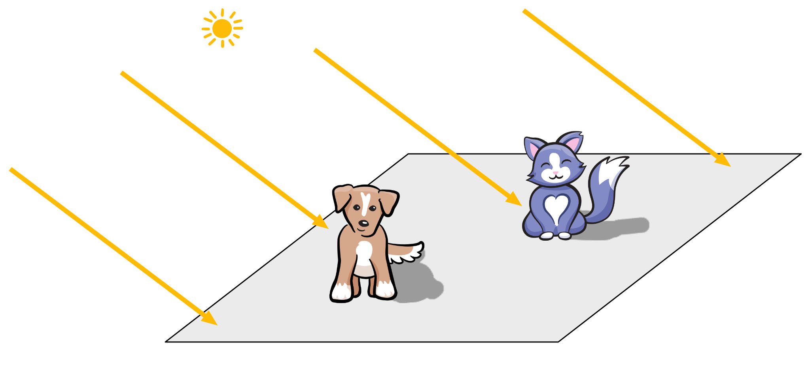

The direction of sunlight

247

Metal by Tutorials
Chapter 10: Lighting Fundamentals

To define the light types, you’ll create a Light structure that both the GPU and the 
CPU can read, and a SceneLighting structure that will describe the lighting for 
GameScene.

➤ In the Shaders group, open Common.h, and before #endif, create an 
enumeration of the light types you’ll be using:

typedef enum { 
  unused = 0, 
  Sun = 1, 
  Spot = 2, 
  Point = 3, 
  Ambient = 4 
} LightType;

➤ Under this, add the structure that defines a light:

typedef struct { 
  LightType type; 
  vector_float3 position;   
  vector_float3 color; 
  vector_float3 specularColor; 
  float radius; 
  vector_float3 attenuation; 
  float coneAngle; 
  vector_float3 coneDirection; 
  float coneAttenuation; 
} Light;

This structure holds the position and color of the light. You’ll learn about the other 
properties as you go through the chapter.

➤ Create a new Swift file in the Game group, and name it SceneLighting.swift. 
Then, add this:

struct SceneLighting { 
  static func buildDefaultLight() -> Light { 
    var light = Light() 
    light.position = [0, 0, 0] 
    light.color = [1, 1, 1] 
    light.specularColor = [0.6, 0.6, 0.6] 
    light.attenuation = [1, 0, 0] 
    light.type = Sun 
    return light 
  } 
}

This file will hold the lighting for GameScene. You’ll have several lights, and 
buildDefaultLight() will create a basic light.

248

Metal by Tutorials
Chapter 10: Lighting Fundamentals

➤ Create a property in SceneLighting for a sun directional light:

let sunlight: Light = { 
  var light = Self.buildDefaultLight() 
  light.position = [1, 2, -2] 
  return light 
}()

position is in world space. This will place a light to the right of the scene, and 
forward of the sphere. The sphere is placed at the world’s origin.

➤ Create an array to hold the various lights you’ll be creating shortly:

➤ Add the initializer:

init() { 
  lights.append(sunlight) 
}

You’ll add all your lights for the scene in the initializer.

➤ Open GameScene.swift, and add the lighting property to GameScene:

You’ll do all the light shading in the fragment function so you’ll need to pass the 
array of lights to that function. Metal Shading Language doesn’t have a dynamic 
array feature, and there is no way to find out the number of items in an array. You’ll 
pass this value to the fragment shader in Params.

➤ Open Common.h, and add these properties to Params:

uint lightCount; 
vector_float3 cameraPosition;

You’ll need the camera position property later.

While you’re in Common.h, add a new index to BufferIndices:

249

Metal by Tutorials
Chapter 10: Lighting Fundamentals

You’ll use this to send lighting details to the fragment function.

➤ Open Renderer.swift, and add this to updateUniforms(scene:):

You’ll be able to access this value in the fragment shader function.

➤ In draw(scene:in:), just before for model in scene.models, add this:

var lights = scene.lighting.lights 
renderEncoder.setFragmentBytes( 
  &lights, 
  length: MemoryLayout<Light>.stride * lights.count, 
  index: LightBuffer.index)

Here, you send the array of lights to the fragment function in buffer index 13.

You’ve now set up a sun light on the Swift side. You’ll do all the actual light 
calculations in the fragment function, and you’ll find out more about light 
properties.

The Phong Reflection Model

In the Phong reflection model, there are three types of light reflection. You’ll 
calculate each of these, and then add them up to produce a final color.

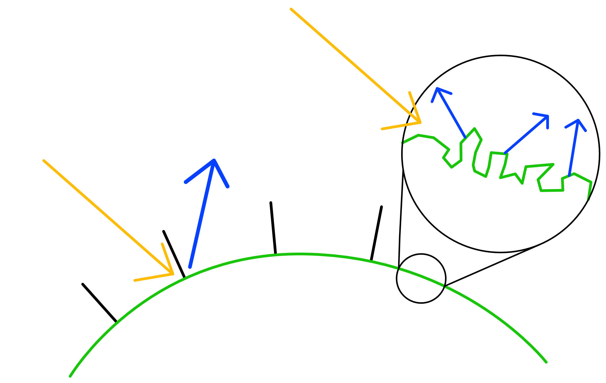

Diffuse shading and micro-facets

250

Metal by Tutorials
Chapter 10: Lighting Fundamentals

• Diffuse: In theory, light coming at a surface bounces off at an angle reflected 
about the surface normal at that point. However, surfaces are microscopically 
rough, so light bounces off in all directions as the picture above indicates. This 
produces a diffuse color where the light intensity is proportional to the angle 
between the incoming light and the surface normal. In computer graphics, this 
model is called Lambertian reflectance named after Johann Heinrich Lambert 
who died in 1777. In the real world, this diffuse reflection is generally true of dull, 
rough surfaces, but the surface with the most Lambertian property is human-
made: Spectralon (https://en.wikipedia.org/wiki/Spectralon), which is used for 
optical components.

• Specular: The smoother the surface, the shinier it is, and the light bounces off the 
surface in fewer directions. A mirror completely reflects off the surface normal 
without deflection. Shiny objects produce a visible specular highlight, and 
rendering specular lighting can give your viewers hints about what sort of surface 
an object is — whether a car is an old wreck or fresh off the sales lot.

• Ambient: In the real-world, light bounces around all over the place, so a 
shadowed object is rarely entirely black. This is the ambient reflection.

A surface color is made up of an emissive surface color plus contributions from 
ambient, diffuse and specular. For diffuse and specular, to find out how much light 
the surface should receive at a particular point, all you have to do is find out the 
angle between the incoming light direction and the surface normal.

The Dot Product

Fortunately, there’s a straightforward mathematical operation to discover the angle 
between two vectors called the dot product.

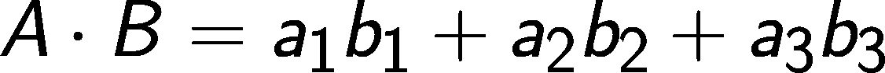

And:

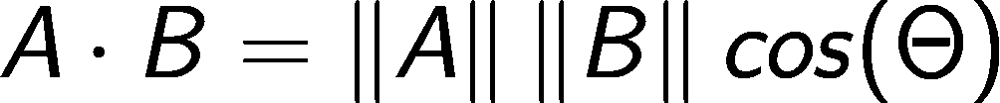

Where ||A|| means the length (or magnitude) of vector A.

Even more fortunately, both simd and Metal Shading Language have a function 
dot() to get the dot product, so you don’t have to remember the formulas.

As well as finding out the angle between two vectors, you can use the dot product for 
checking whether two vectors are pointing in the same direction.

251

Metal by Tutorials
Chapter 10: Lighting Fundamentals

Resize the two vectors into unit vectors — that’s vectors with a length of 1. You can 
do this using the normalize() function. If the unit vectors are parallel with the 
same direction, the dot product result will be 1. If they are parallel but opposite 
directions, the result will be -1. If they are at right angles (orthogonal), the result will 
be 0.

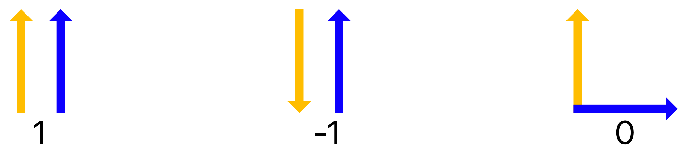

The dot product

Looking at the previous diagram, if the yellow (sun) vector is pointing straight down, 
and the blue (normal) vector is pointing straight up, the dot product will be -1. This 
value is the cosine angle between the two vectors. The great thing about cosines is 
that they are always values between -1 and 1 so you can use this range to determine 
how bright the light should be at a certain point.

Take the following example:

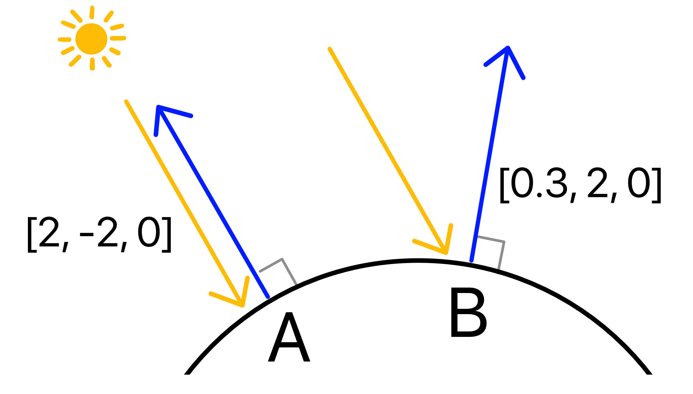

The dot product of sunlight and normal vectors

The sun is pouring down from the sky with a direction vector of [2, -2, 0]. Vector 
A is a normal vector of [-2, 2, 0]. The two vectors are pointing in opposite 
directions, so when you turn the vectors into unit vectors (normalize them), the dot 
product of them will be -1.

Vector B is a normal vector of [0.3, 2, 0]. Sunlight is a directional light, so uses 
the same direction vector. Sunlight and B when normalized have a dot product of 
-0.59.

252

Metal by Tutorials
Chapter 10: Lighting Fundamentals

This playground code demonstrates the calculations.

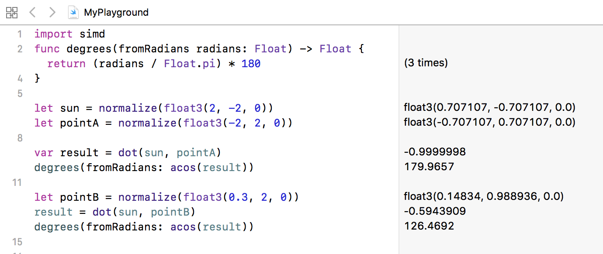

Dot product playground code

Note: The result after line 8 shows that you should always be careful when 
using floating points, as results are never exact. Never use an expression such 
as if (x == 1.0) - always check <= or >=.

In the fragment shader, you’ll be able to take these values and multiply the fragment 
color by the dot product to get the brightness of the fragment.

Diffuse Reflection

Shading from the sun does not depend on where the camera is. When you rotate the 
scene, you’re rotating the world, including the sun. The sun’s position will be in 
world space, and you’ll put the model’s normals into the same world space to be able 
to calculate the dot product against the sunlight direction. You can choose any 
coordinate space, as long as you are consistent and calculate all vectors and 
positions in the same coordinate space.

To be able to assess the slope of the surface in the fragment function, you’ll 
reposition the normals in the vertex function in much the same way as you 
repositioned the vertex position earlier. You’ll add the normals to the vertex 
descriptor so that the vertex function can process them.

253

Metal by Tutorials
Chapter 10: Lighting Fundamentals

➤ Open ShaderDefs.h, and add these properties to VertexOut:

float3 worldPosition; 
float3 worldNormal;

These will hold the vertex position and vertex normal in world space.

Calculating the new position of normals is a bit different from the vertex position 
calculation. MathLibrary.swift contains a matrix method to create a normal matrix 
from another matrix. This normal matrix is a 3×3 matrix, because firstly, you’ll do 
lighting in world space which doesn’t need projection, and secondly, translating an 
object does not affect the slope of the normals. Therefore, you don’t need the fourth 
W dimension. However, if you scale an object in one direction (non-linearly), then 
the normals of the object are no longer orthogonal and this approach won’t work. As 
long as you decide that your engine does not allow non-linear scaling, then you can 
use the upper-left 3×3 portion of the model matrix, and that’s what you’ll do here.

➤ Open Common.h and add this matrix property to Uniforms:

This will hold the normal matrix in world space.

➤ In the Game group, open Rendering.swift, and in 
render(encoder:uniforms:params:), add this after setting 
uniforms.modelMatrix:

This creates the normal matrix from the model matrix.

➤ Open Vertex.metal, and in vertex_main, after assigning position, add this:

You hold the vertex’s world position before converting to camera and projection 
space.

➤ When defining out, populate the VertexOut properties:

.worldPosition = worldPosition.xyz / worldPosition.w, 
.worldNormal = uniforms.normalMatrix * in.normal

254

Metal by Tutorials
Chapter 10: Lighting Fundamentals

The rasterizer performs the perspective divide on position, as described in Chapter 
6, “Coordinate Spaces”. To ensure any scaling is taken care of, you perform the divide 
by w on worldPosition here.

Earlier in the chapter, you sent Renderer’s lights array to the fragment function in 
the LightBuffer index, but you haven’t yet changed the fragment function to receive 
the array.

➤ Open Fragment.metal and add this to fragment_main’s parameter list:

Creating Shared Functions in C++

Often you’ll want to access C++ functions from multiple files. Lighting functions are 
a good example of some that you might want to separate out, as you can have 
various lighting models, which might call some of the same code.

To call a function from multiple .metal files:

1. Set up a header file with the name of the functions that you’re going to create.

2. Create a new .metal file and import the header, and also the bridging header file 
Common.h if you’re going to use a structure from that file.

3. Create the lighting functions in this new file.

4. In your existing .metal file, import the new header file and use the lighting 
functions.

In the Shaders group, create a new Header File called Lighting.h. Don’t add it to 
the targets.

➤ Add this function header before #endif /* Lighting_h */:

#import "Common.h" 
 
float3 phongLighting( 
  float3 normal, 
  float3 position, 
  constant Params &params, 
  constant Light *lights, 
  float3 baseColor);

255

Metal by Tutorials
Chapter 10: Lighting Fundamentals

Here, you define a C++ function that will return a float3.

In the Shaders group, create a new Metal File called Lighting.metal. Add it to the 
targets.

➤ Add this new function:

#import "Lighting.h" 
 
float3 phongLighting( 
  float3 normal, 
  float3 position, 
  constant Params &params, 
  constant Light *lights, 
  float3 baseColor) { 
    return float3(0); 
}

You create a new function that returns a zero float3 value. You’ll build up code in 
phongLighting to calculate this final lighting value.

➤ Open Fragment.metal, and replace #import "Common.h" with:

Now you’ll be able to use phongLighting within this file.

➤ In fragment_main, replace return float4(baseColor, 1); with this:

float3 normalDirection = normalize(in.worldNormal); 
float3 color = phongLighting( 
  normalDirection, 
  in.worldPosition, 
  params, 
  lights, 
  baseColor 
); 
return float4(color, 1);

Here, you make the world normal a unit vector, and call the new lighting function 
with the necessary parameters.

256

Metal by Tutorials
Chapter 10: Lighting Fundamentals

If you build and run the app now, your models will render in black, as that’s the color 
that you’re currently returning from phongLighting.

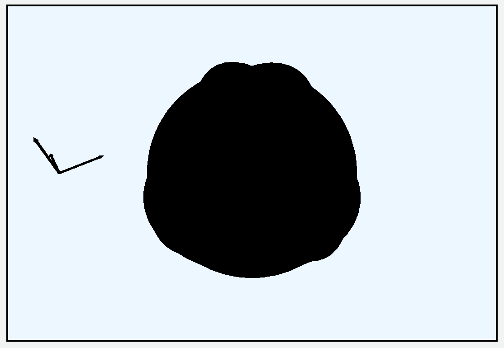

No lighting

➤ Open Lighting.metal, and replace return float3(0); with:

float3 diffuseColor = 0; 
float3 ambientColor = 0; 
float3 specularColor = 0; 
for (uint i = 0; i < params.lightCount; i++) { 
  Light light = lights[i]; 
  switch (light.type) { 
    case Sun: { 
      break; 
    } 
    case Point: { 
      break; 
    } 
    case Spot: { 
      break; 
    } 
    case Ambient: { 
      break; 
    } 
    case unused: { 
      break; 
    } 
  } 
} 
return diffuseColor + specularColor + ambientColor;

257

Metal by Tutorials
Chapter 10: Lighting Fundamentals

This sets up the outline for all the lighting calculations you’ll do. You’ll accumulate 
the final fragment color, made up of diffuse, specular and ambient contributions.

➤ Above break in case Sun, add this:

// 1 
float3 lightDirection = normalize(-light.position); 
// 2 
float diffuseIntensity = 
  saturate(-dot(lightDirection, normal)); 
// 3 
diffuseColor += light.color * baseColor * diffuseIntensity;

Going through this code:

1. You make the light’s direction a unit vector.

2. You calculate the dot product of the two vectors. When the fragment fully points 
toward the light, the dot product will be -1. It’s easier for further calculation to 
make this value positive, so you negate the dot product. saturate makes sure the 
value is between 0 and 1 by clamping the negative numbers. This gives you the 
slope of the surface, and therefore the intensity of the diffuse factor.

3. Multiply the base color by the diffuse intensity to get the diffuse shading. If you 
have several sun lights, diffuseColor will accumulate the diffuse shading.

➤ Build and run the app.

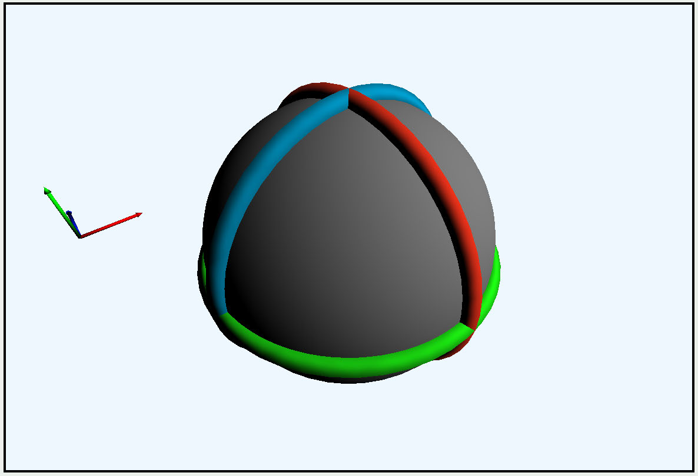

Diffuse shading

258

Metal by Tutorials
Chapter 10: Lighting Fundamentals

You can sanity-check your results by returning your intermediate calculations from 
phongLighting. The following image shows normal and diffuseIntensity from 
the front view.

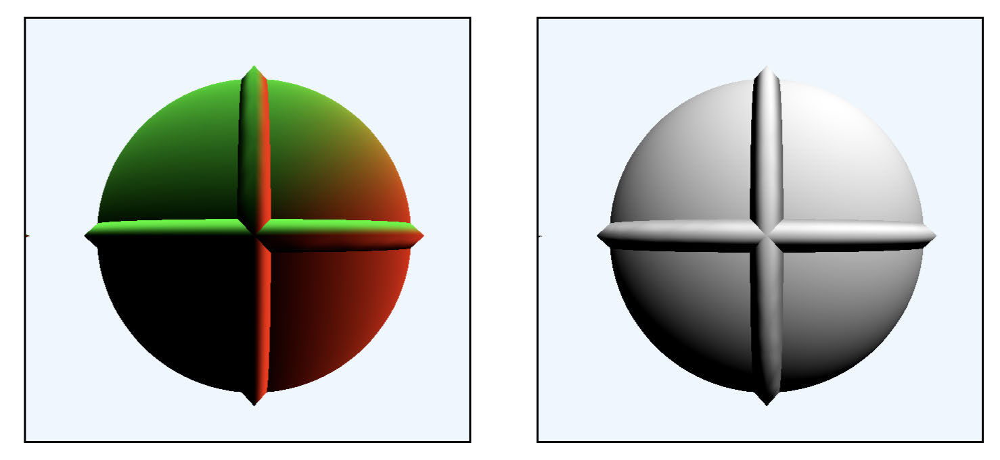

Visualizing the normal and diffuse intensity

Note: To get the front view in your app, press “1” above the alpha keys while 
running it. “2” will reset to the default view.

DebugLights.swift and DebugLights.metal in the Utility group, have some 
debugging methods so that you can visualize where your lights are.

➤ Open DebugLights.swift, and remove /* and */ at the top and bottom of the file.

Before you added code in this chapter, this file would not compile, but does now.

➤  Open Renderer.swift, and toward the end of draw(scene:in:), before 
renderEncoder.endEncoding(), add this:

DebugLights.draw( 
  lights: scene.lighting.lights, 
  encoder: renderEncoder, 
  uniforms: uniforms)

This code will display lines to visualize the direction of the sun light.

259

Metal by Tutorials
Chapter 10: Lighting Fundamentals

➤ Build and run the app.

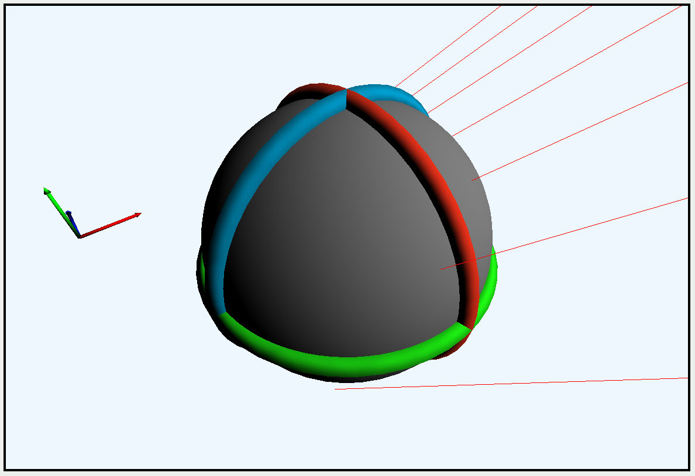

Debugging sunlight direction

The red lines show the parallel sun light direction vector. As you rotate the scene, 
you can see that the brightest parts are the ones facing towards the sun.

Note: the debug method uses .line  as the rendering type. Unfortunately line 
width is not configurable on the GPU, so the lines may disappear at certain 
angles when they are too thin to render.

This shading is pleasing, but not accurate. Take a look at the back of the sphere. The 
back of the sphere is black; however, you can see that the top of the green surround 
is bright green because it’s facing up. In the real-world, the surround would be 
blocked by the sphere and so be in the shade. However, you’re currently not taking 
occlusion into account, and you won’t be until you master shadows in Chapter 13, 
“Shadows”.

Ambient Reflection

In the real-world, colors are rarely pure black. There’s light bouncing about all over 
the place. To simulate this, you can use ambient lighting. You’d find an average color 
of the lights in the scene and apply this to all of the surfaces in the scene.

260

Metal by Tutorials
Chapter 10: Lighting Fundamentals

➤ Open SceneLighting.swift, and add an ambient light property:

let ambientLight: Light = { 
  var light = Self.buildDefaultLight() 
  light.color = [0.05, 0.1, 0] 
  light.type = Ambient 
  return light 
}()

This light is a slightly green tint.

➤ Add this to the end of init():

➤ Open Lighting.metal, and above break in case Ambient, add this:

➤ Build and run the app. The scene is now tinged green as if there is a green light 
being bounced around.

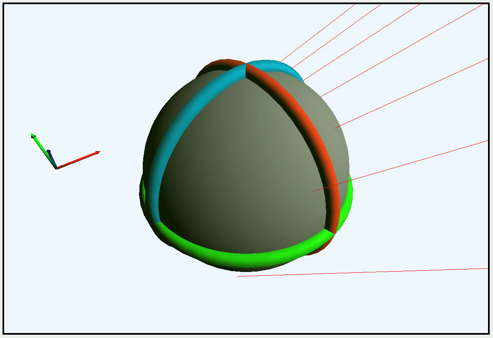

Ambient lighting

261

Metal by Tutorials
Chapter 10: Lighting Fundamentals

Specular Reflection

Last but not least in the Phong reflection model, is the specular reflection. You now 
have a chance to put a coat of shiny varnish on the sphere. The specular highlight 
depends upon the position of the observer. If you pass a shiny car, you’ll only see the 
highlight at certain angles.

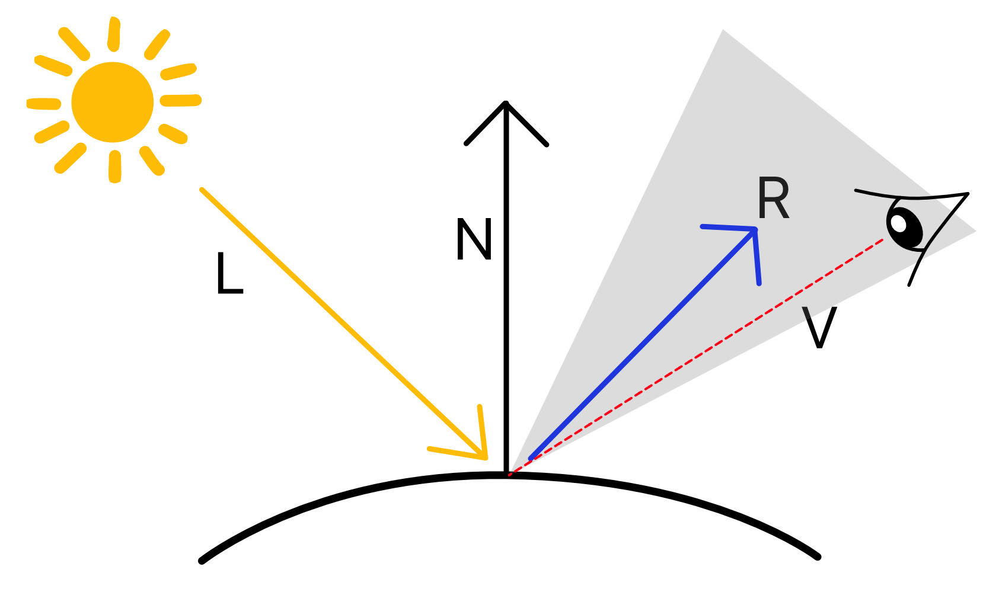

Specular reflection

The light comes in (L) and is reflected (R) about the normal (N). If the viewer (V) is 
within a particular cone around the reflection (R), then the viewer will see the 
specular highlight. That cone is an exponential shininess parameter. The shinier the 
surface is, the smaller and more intense the specular highlight.

In your case, the viewer is your camera so you’ll need to pass the camera coordinates, 
again in world position, to the fragment function. Earlier, you set up a 
cameraPosition property in params, and this is what you’ll use to pass the camera 
position.

➤ Open Renderer.swift, and in updateUniforms(scene:), add this:

scene.camera.position is already in world space, and you’re already passing 
params to the fragment function, so you don’t need to take further action here.

262

Metal by Tutorials
Chapter 10: Lighting Fundamentals

➤ Open Lighting.metal, and in phongLighting, add the following variables to the 
top of the function:

float materialShininess = 32; 
float3 materialSpecularColor = float3(1, 1, 1);

These hold the surface material properties of a shininess factor and the specular 
color. As these are surface properties, you should be getting these values from each 
model’s materials, and you’ll do that in the following chapter.

➤ Above break in case Sun, add the following:

if (diffuseIntensity > 0) { 
  // 1 (R) 
  float3 reflection = 
      reflect(lightDirection, normal); 
  // 2 (V) 
  float3 viewDirection = 
      normalize(params.cameraPosition); 
  // 3 
  float specularIntensity = 
      pow(saturate(dot(reflection, viewDirection)), 
          materialShininess); 
  specularColor += 
      light.specularColor * materialSpecularColor 
        * specularIntensity; 
}

Going through this code:

1. For the calculation of the specular color, you’ll need (L)ight, (R)eflection, 
(N)ormal and (V)iew. You already have (L) and (N), so here you use the Metal 
Shading Language function reflect to get (R).

2. You need the view vector between the fragment and the camera for (V).

3. Now you calculate the specular intensity. You find the angle between the 
reflection and the view using the dot product, clamp the result between 0 and 1 
using saturate, and raise the result to a shininess power using pow. You then use 
this intensity to work out the specular color for the fragment.

263

Metal by Tutorials
Chapter 10: Lighting Fundamentals

➤ Build and run the app to see your completed lighting.

Specular reflection

Experiment with changing materialShininess from 2 to 1600. In Chapter 11, “Maps 
& Materials”, you’ll find out how to read in material and texture properties from the 
model to change its color and lighting.

You’ve created a realistic enough lighting situation for a sun. You can add more 
variety to your scene with point and spot lights.

Point Lights

As opposed to the sun light, where you converted the position into parallel direction 
vectors, point lights shoot out light rays in all directions.

Point light direction

264

Metal by Tutorials
Chapter 10: Lighting Fundamentals

A light bulb will only light an area of a certain radius, beyond which everything is 
dark. So you’ll also specify attenuation where a ray of light doesn’t travel infinitely 
far.

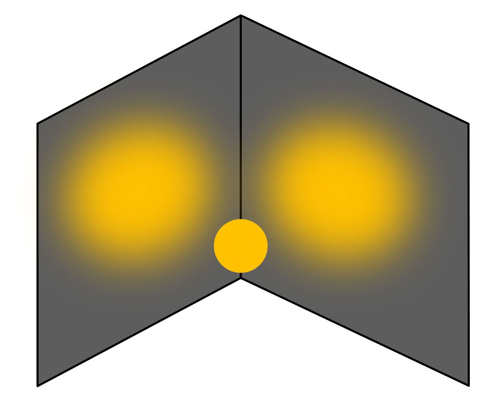

Point light attenuation

Light attenuation can occur abruptly or gradually. The original OpenGL formula for 
attenuation is:

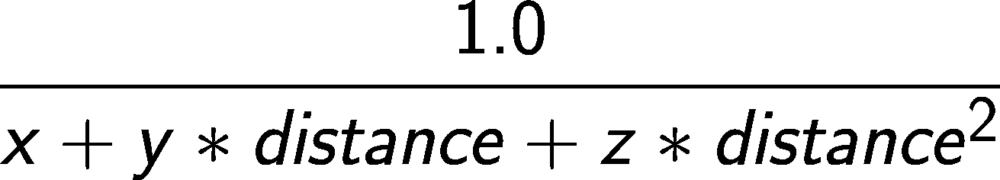

Where x is the constant attenuation factor, y is the linear attenuation factor and z is 
the quadratic attenuation factor.

The formula gives a curved fall-off. You’ll represent xyz with a float3. No 
attenuation at all will be float3(1, 0, 0) — substituting x, y and z into the 
formula results in a value of 1.

➤ Open SceneLighting.swift, and add a point light property to SceneLighting:

let redLight: Light = { 
  var light = Self.buildDefaultLight() 
  light.type = Point 
  light.position = [-0.8, 0.76, -0.18] 
  light.color = [1, 0, 0] 
  light.attenuation = [0.5, 2, 1] 
  return light 
}()

265

Metal by Tutorials
Chapter 10: Lighting Fundamentals

Here, you create a red point light with a position and attenuation. You can 
experiment with the attenuation values to change radius and fall-off.

➤ Add the light to lights in init():

➤ Build and run the app.

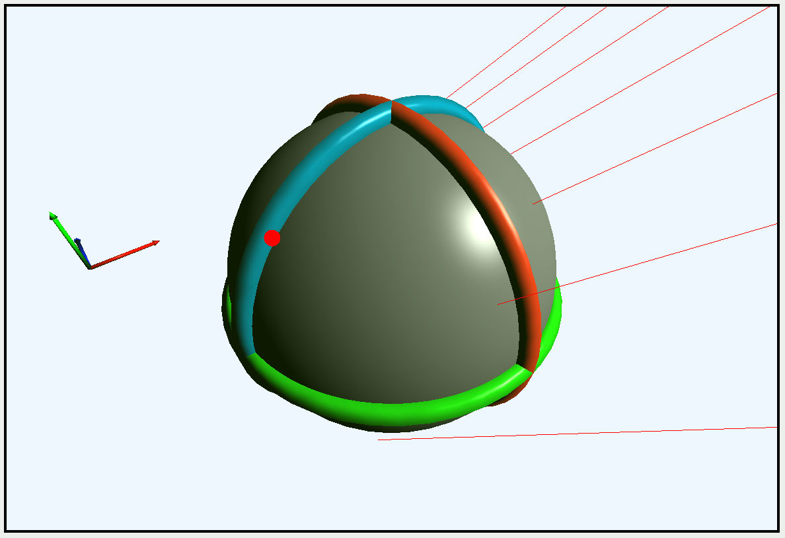

Debugging a point light

You’ll see a small red dot which marks the position of the point light rendered by 
DebugLights.

Note: The shader for the point light debug dot is worth looking at. In 
DebugLights.metal, in fragment_debug_point, the default square point is 
turned into a circle by discarding fragments greater than a certain radius from 
the center of the point.

The debug lights function shows you where the point light is, but it doesn’t produce 
any light yet. You’ll do this in the fragment shader.

➤ Open Lighting.metal, and in phongLighting, add this above break in case 
Point:

// 1 
float d = distance(light.position, position); 
// 2 
float3 lightDirection = normalize(light.position - position); 
// 3 
float attenuation = 1.0 / (light.attenuation.x + 
    light.attenuation.y * d + light.attenuation.z * d * d);

266

Metal by Tutorials
Chapter 10: Lighting Fundamentals

float diffuseIntensity = 
    saturate(dot(lightDirection, normal)); 
float3 color = light.color * baseColor * diffuseIntensity; 
// 4 
color *= attenuation; 
diffuseColor += color;

Going through this code:

1. You find out the distance between the light and the fragment position.

2. With the directional sun light, you used the position as the light direction. Here, 
you calculate the direction from the fragment position to the light position.

3. Calculate the attenuation using the attenuation formula and the distance to see 
how bright the fragment will be.

4. After calculating the diffuse color as you did for the sun light, multiply this color 
by the attenuation.

➤ Build and run the app, and you’ll see the full effect of the red point light.

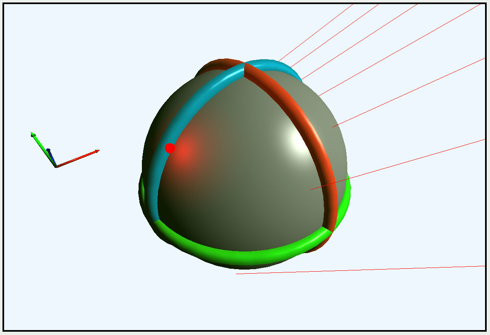

Rendering a point light

Remember the sphere is slightly green because of the ambient light.

Spotlights

The last type of light you’ll create in this chapter is the spotlight. This sends light 
rays in limited directions. Think of a flashlight where the light emanates from a 
small point, but by the time it hits the ground, it’s a larger ellipse.

267

Metal by Tutorials
Chapter 10: Lighting Fundamentals

You define a cone angle to contain the light rays with a cone direction. You also 
define a cone power to control the attenuation at the edge of the ellipse.

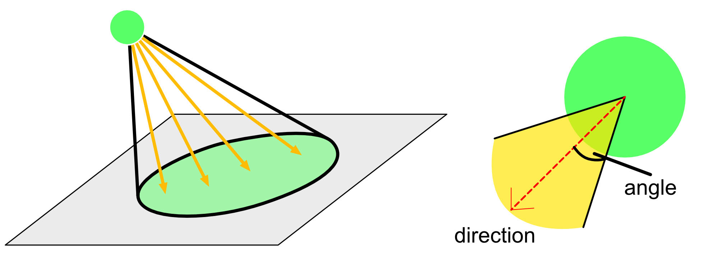

Spotlight angle and attenuation

➤ Open SceneLighting.swift, and add a new light:

lazy var spotlight: Light = { 
  var light = Self.buildDefaultLight() 
  light.type = Spot 
  light.position = [-0.64, 0.64, -1.07] 
  light.color = [1, 0, 1] 
  light.attenuation = [1, 0.5, 0] 
  light.coneAngle = Float(40).degreesToRadians 
  light.coneDirection = [0.5, -0.7, 1] 
  light.coneAttenuation = 8 
  return light 
}()

This light is similar to the point light with the added cone angle, direction and cone 
attenuation.

➤ Add the light to lights in init():

➤ Open Lighting.metal, and in phongLighting, add this code above break in case 
Spot:

// 1 
float d = distance(light.position, position); 
float3 lightDirection = normalize(light.position - position); 
// 2 
float3 coneDirection = normalize(light.coneDirection); 
float spotResult = dot(lightDirection, -coneDirection); 
// 3

268

Metal by Tutorials
Chapter 10: Lighting Fundamentals

if (spotResult > cos(light.coneAngle)) { 
  float attenuation = 1.0 / (light.attenuation.x + 
      light.attenuation.y * d + light.attenuation.z * d * d); 
  // 4 
  attenuation *= pow(spotResult, light.coneAttenuation); 
  float diffuseIntensity = 
           saturate(dot(lightDirection, normal)); 
  float3 color = light.color * baseColor * diffuseIntensity; 
  color *= attenuation; 
  diffuseColor += color; 
}

This code is very similar to the point light code. Going through the comments:

1. Calculate the distance and direction as you did for the point light. This ray of 
light may be outside of the spot cone.

2. Calculate the cosine angle (that’s the dot product) between that ray direction and 
the direction the spot light is pointing.

3. If that result is outside of the cone angle, then ignore the ray. Otherwise, 
calculate the attenuation as for the point light. Vectors pointing in the same 
direction have a dot product of 1.0.

4. Calculate the attenuation at the edge of the spot light using coneAttenuation as 
the power.

➤ Build and run the app.

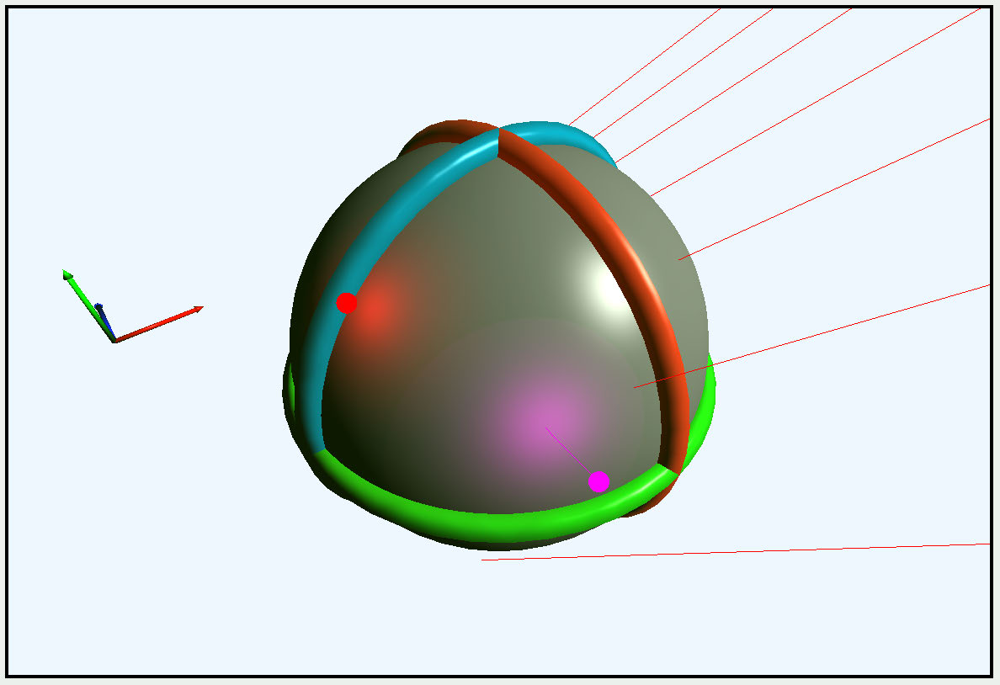

Rendering a spotlight

Experiment with changing the various attenuations.  A cone angle of 5º with 
attenuation of (1, 0, 0) and a cone attenuation of 1000 will produce a very small 
targeted soft light; whereas a cone angle of 20º with a cone attenuation of 1 will 
produce a sharp-edged round light.

269

Metal by Tutorials
Chapter 10: Lighting Fundamentals

Key Points

• Shading is the reason why objects don’t look flat. Lights provide illumination from 
different directions.

• Normals describe the slope of the curve at a point. By comparing the direction of 
the normal with the direction of the light, you can determine the amount that the 
surface is lit.

• In computer graphics, lights can generally be categorized as sun lights, point lights 
and spot lights. In addition, you can have area lights and surfaces can emit light. 
These are only approximations of real-world lighting scenarios.

• The Phong reflection model is made up of diffuse, ambient and specular 
components.

• Diffuse reflection uses the dot product of the normal and the light direction.

• Ambient reflection is a value added to all surfaces in the scene.

• Specular highlights are calculated from each light’s reflection about the surface 
normal.

Where to Go From Here?

You’ve covered a lot of lighting information in this chapter. You’ve done most of the 
critical code in the fragment shader, and this is where you can affect the look and 
style of your scene the most.

You’ve done some weird and wonderful calculations by working out dot products 
between surface normals and various light directions. The formulas you used in this 
chapter are a small cross-section of computer graphics research that various brilliant 
mathematicians have come up with over the years. If you want to read more about 
lighting, you’ll find some interesting internet sites listed in references.markdown 
in the resources folder for this chapter.

In the next chapter, you’ll change the lighting model to physically based, and find 
out how you can change how a surface looks with texture maps and materials.

270

Section II: Intermediate Metal

With the basics under your belt, you can move on to multi-pass rendering. You’ll add 
shadows and learn several new rendering techniques. Programming the GPU using 
compute shaders can be intimidating, so you’ll create particle systems to learn how 
fast multi-threaded solutions can be.

271

11