# Maps & 
Materials

In the previous chapter, you set up a simple Phong lighting model. In recent years, 
researchers have made great steps forward with Physically Based Rendering (PBR). 
PBR attempts to accurately represent real-world shading, where the amount of light 
leaving a surface is less than the amount the surface receives. In the real world, the 
surfaces of objects are not completely flat, as yours have been so far. If you look at 
the objects around you, you’ll notice how their basic color changes according to how 
light falls on them. Some objects have a smooth surface, and some have a rough 
surface. Heck, some might even be shiny metal!

Take for example, this sphere with a brick texture. The render on the left shows a 
simple color texture with the sun shining directly on it. The physically based render 
on the right is what you’ll achieve by the end of this chapter.

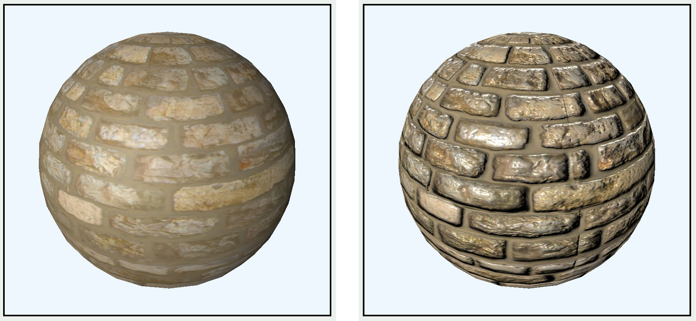

PBR render

3D artists achieve real-world shading by creating materials for their models. 
Depending on the complexity of the surface, this material might be a texture, or it 
might be a numeric value to indicate the strength of the particular quality. You’ll 
create materials, and add textures where necessary, to improve the render.

272

Metal by Tutorials
Chapter 11: Maps & Materials

Physically Based Rendering (PBR)

As its name suggests, PBR attempts physically realistic interaction of light with 
surfaces. Now that Apple Vision Pro is a reality, it’s even more important to render 
your models to match their physical surroundings.

Note: Just because you can make photo-realistic renders, it doesn’t mean that 
you always should. Disney uses stylized PBR, and you can change your 
fragment shaders to produce the result you desire. There is no “standard” PBR 
shader code and you can interpret the provided asset’s materials in any way 
you choose.

The general principles of PBR are:

• Surfaces should not reflect more light than they receive.

• Surfaces can be described with known, measured physical properties.

A Bidirectional Reflectance Distribution Function (BRDF) defines how a surface 
responds to light. There are various highly mathematical BRDF models for both 
diffuse and specular, but the most common are Lambertian diffuse; and for the 
specular, variations on the Cook-Torrance model (presented at SIGGRAPH 1981). 
This takes into account:

• micro-facet slope distribution: The previous chapter briefly covered micro-
facets and how light bounces off surfaces in many directions.

• Fresnel: If you look straight down into a clear lake, you can see through it to the 
bottom, however, if you look across the surface of the water, you only see a 
reflection like a mirror. This is the Fresnel effect, where the reflectivity of the 
surface depends upon the viewing angle.

• geometric attenuation: Self-shadowing of the micro-facets.

Each of these components have different approximations, or models written by many 
clever people. It’s a vast and complex topic. In the resources folder for this chapter, 
references.markdown contains a few places where you can learn more about 
physically based rendering and the calculations involved. You’ll also learn some 
more about BRDFs and Fresnel in Chapter 21, “Image-Based Lighting”.

273

Metal by Tutorials
Chapter 11: Maps & Materials

Common PBR Material Properties

Poly Haven (https://polyhaven.com) has some great 3D assets and textures. For 
example, this alarm clock model:

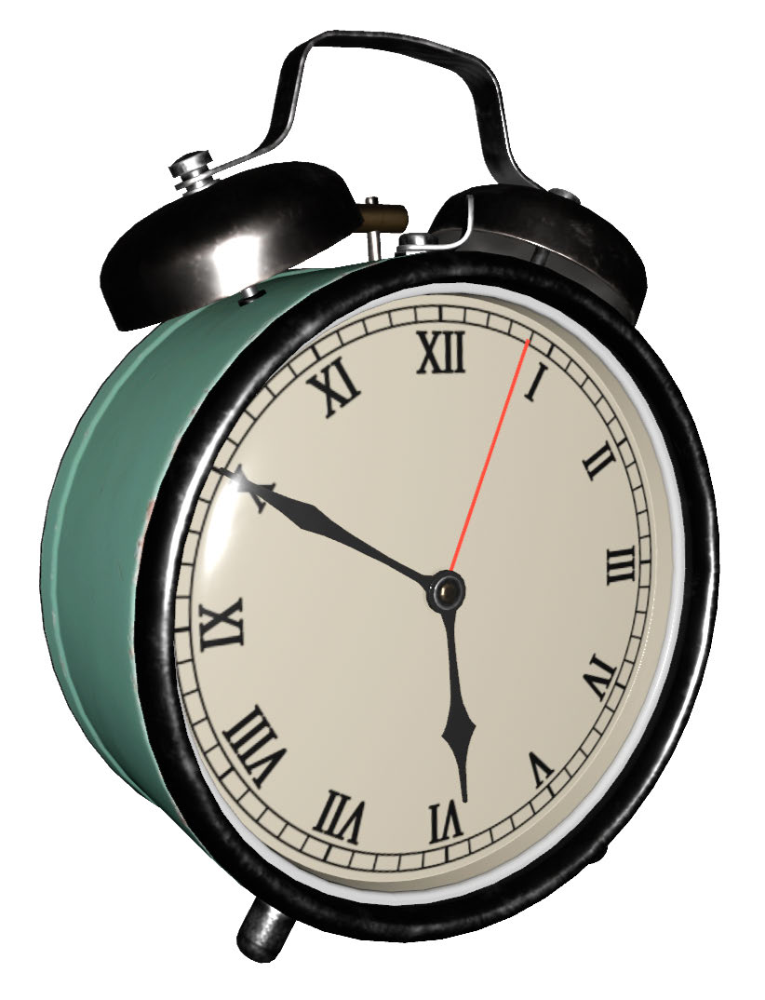

An alarm clock

For this model, the artist created textures for the five most common material 
properties used in PBR lighting models:

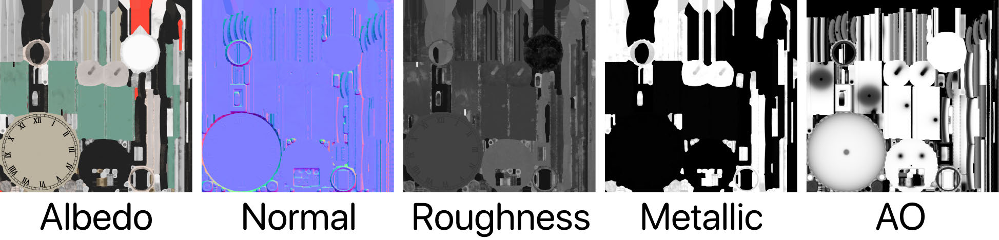

Common texture maps

These properties can be either a texture or a value.

• Diffuse Color (Albedo): Albedo is originally an astronomical term describing the 
measurement of diffuse reflection of solar radiation, but it has come to mean in 
computer graphics the surface color without any shading applied to it. Diffuse 
color may have some shading built into the texture. You already met diffuse color 
in the form of the base color map.

• Normal: A texture can override vertex normal values and distort lit fragments for 
extra surface detail.

• Roughness: A grayscale value that indicates the shininess of a surface. White is 
rough, and black is smooth. If you have a scratched shiny surface, a roughness 
texture might consist of mostly black or dark gray with light gray scratch marks.

274

Metal by Tutorials
Chapter 11: Maps & Materials

• Metallic: A surface is either a conductor of electricity — in which case it’s a metal; 
or it isn’t a conductor — in which case it’s a dielectric. Most metallic textures 
consist of 0 (black) and 1 (white) values only: 0 for dielectric and 1 for metal.

• Ambient Occlusion (AO): AO defines how much light reaches a surface. For 
example, less light will reach nooks and crannies. You multiply the diffuse color 
with the AO value, so the default value is 1, AO textures are grayscale and can 
enhance the look of shadowing.

When you write a PBR lighting shader, for each fragment, you want to achieve values 
for diffuse color and specular color. You derive color from diffuse color, metallic and 
AO. You include the roughness value in the mix to achieve the specular color.

Complex renderers can use many other material properties, but for now, you’ll only 
include these in your materials.

The Starter App

➤ In Xcode, open the starter project for this chapter.

➤ Build and run the app, and you’ll see final-sphere.usdz rendered with Phong 
shading. The sphere has a color texture, but the result is flat and uninteresting.

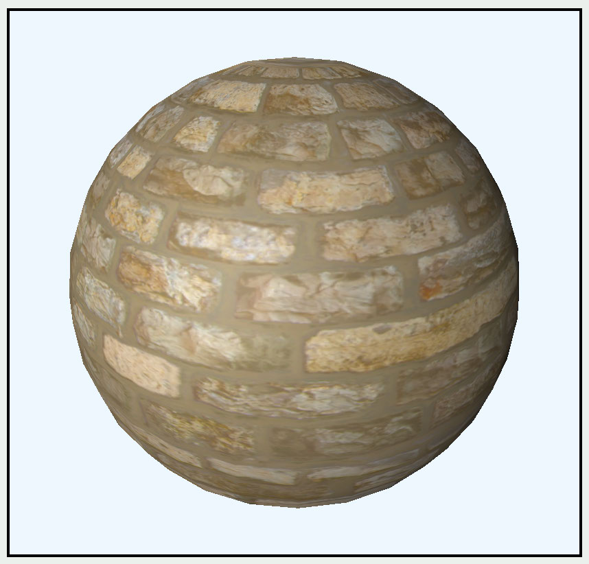

A sphere with color texture

There are two lights in the scene - a sun light and a gentle directional fill light from 
the back. The code is the almost same as at the end of the previous chapter with the 
exception of GameScene and SceneLighting, which simply set up the different 
model and lighting.

275

Metal by Tutorials
Chapter 11: Maps & Materials

Lighting.metal reduces the amount of specular highlight. Pressing keys “1” and “2” 
take you to the front and default views respectively.

Because PBR shading is quite mathematically challenging, Lighting.h and 
PBR.metal contain two functions, currently commented out, that calculate the 
diffuse and specular colors. There are many different PBR shading models, but this 
specular lighting is a modified Cook-Torrance model. (R.L. Cook and K.E. Torrance 
came up with it in 1982.)

Examining USD Files in Reality Composer 
Pro

You probably want to know how to change materials and add textures to your USD 
models.

Reality Composer Pro is a new app from Apple that’s included in Xcode. You can 
load in USD files and create a scene, and then export that scene out to a new USD 
file. The app is designed to create RealityKit and visionOS projects, however, you can 
also create scenes and change materials for your own projects. Whereas you create 
models in Blender, you assemble scenes containing these models in Reality 
Composer Pro. If you want to discover more about Reality Composer Pro, Apple has 
documented a full walkthrough (https://developer.apple.com/documentation/
visionos/designing-realitykit-content-with-reality-composer-pro).

➤ In Xcode, choose the Menu option Xcode > Open Developer Tool > Reality 
Composer Pro.

Note: Reality Composer Pro is designed for development with visionOS, which 
is very new at the time of writing. If you don’t see the menu option for Reality 
Composer Pro, you may have to download a beta version of Xcode (https://
developer.apple.com/download/applications/) that includes the visionOS SDK.

276

Metal by Tutorials
Chapter 11: Maps & Materials

➤ Create a new Project called Sphere, and save the file so that you can find it again.

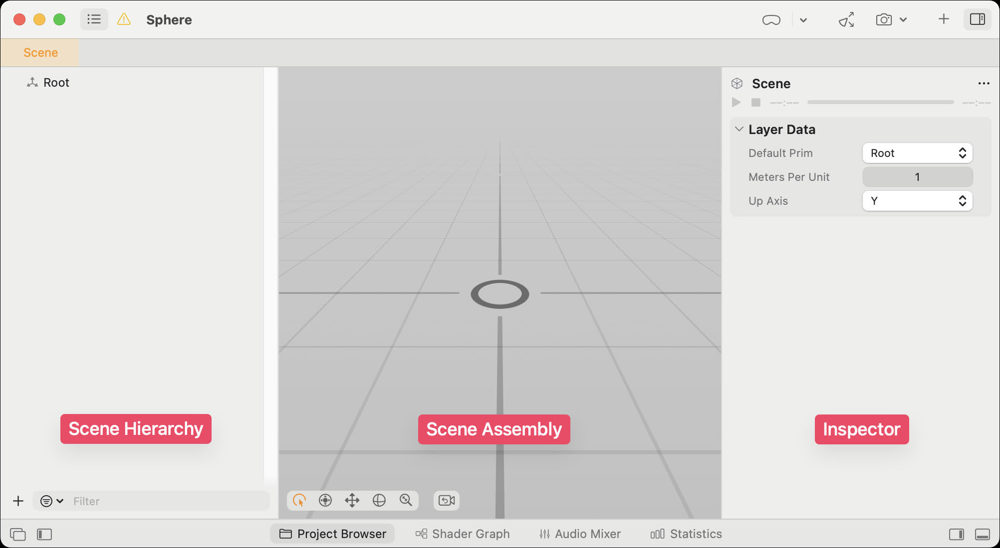

The Sphere project

➤ From your Xcode project, drag starter-sphere.usdz into the scene assembly 
panel. You may only see a 3D gizmo until you zoom out to see the whole scene.

These are the controls to navigate the scene:

• Click and drag on the background to look around the scene.

• Command-Click and drag on the background to pan.

• Option-Click and drag on the background to zoom in and out (or use the trackpad 
zoom gesture or mouse scroll wheel).

• You can also use the icons at the bottom of the main view.

The sphere is quite large, so you should zoom out to see it all. When navigating the 
scene, click on the background. If you click and drag on the sphere, you will move it 
around the scene.

➤ Click on the sphere to select it, and in the Inspector, set the Transform Position to 
zero.

277

Metal by Tutorials
Chapter 11: Maps & Materials

➤ In the Scene Hierarchy, Option-Click Root to see all the elements of the model.

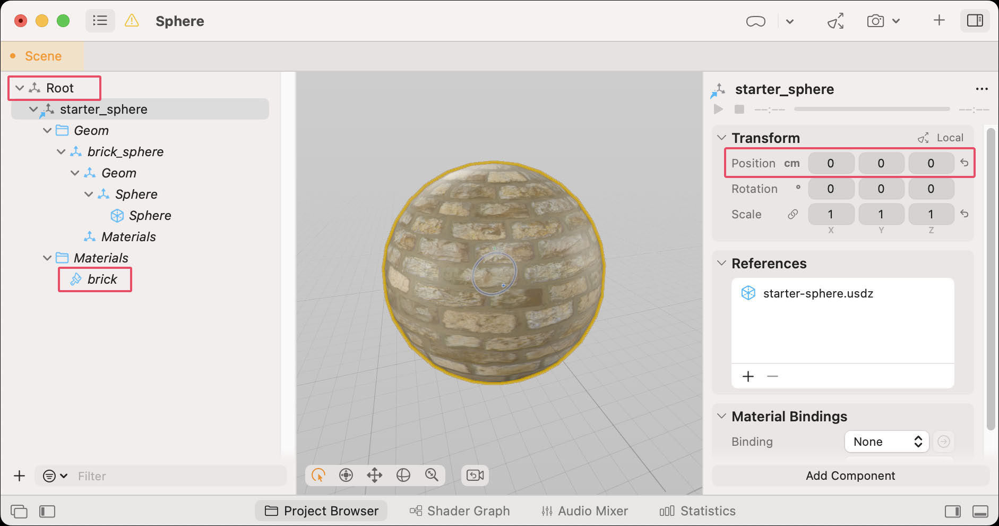

Reality Composer Pro

➤ In the Scene Hierarchy, select brick to see the sphere’s material in the Inspector.

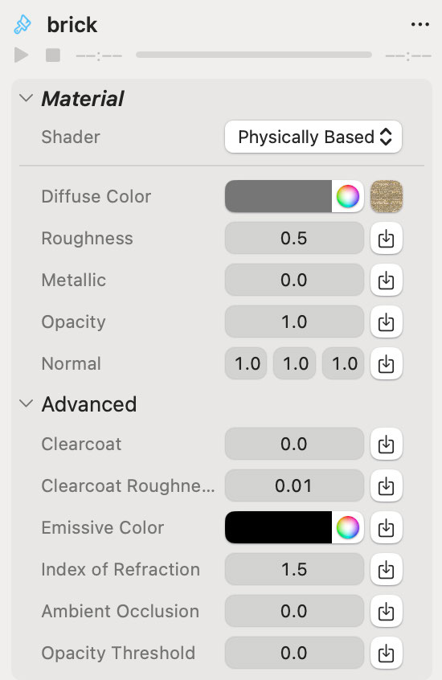

Material

278

Metal by Tutorials
Chapter 11: Maps & Materials

Reality Composer Pro shows you all the material properties available to RealityKit 
renders. The sphere has a dark gray diffuse color, which is overridden by the brick 
texture. Next to each material property value is a download icon where you can add 
textures to the model.

This model has only one material, but, as you’ll see later, models can have multiple 
materials for different parts of the model’s geometry.

➤ Locate the resources folder for this chapter. You’ll find three textures:

• brick-color.png: The diffuse color texture.

• brick-roughness.png: This describes how shiny the sphere’s surface is.

• brick-normal.png: The normal map is more complex, and you’ll learn more about 
distorting normals later in the chapter.

➤ Drag brick-roughness.png to the Roughness download icon in Reality Composer 
Pro, and brick-normal.png to the Normal download icon. For each texture, check 
the difference in the appearance of the model in the scene.

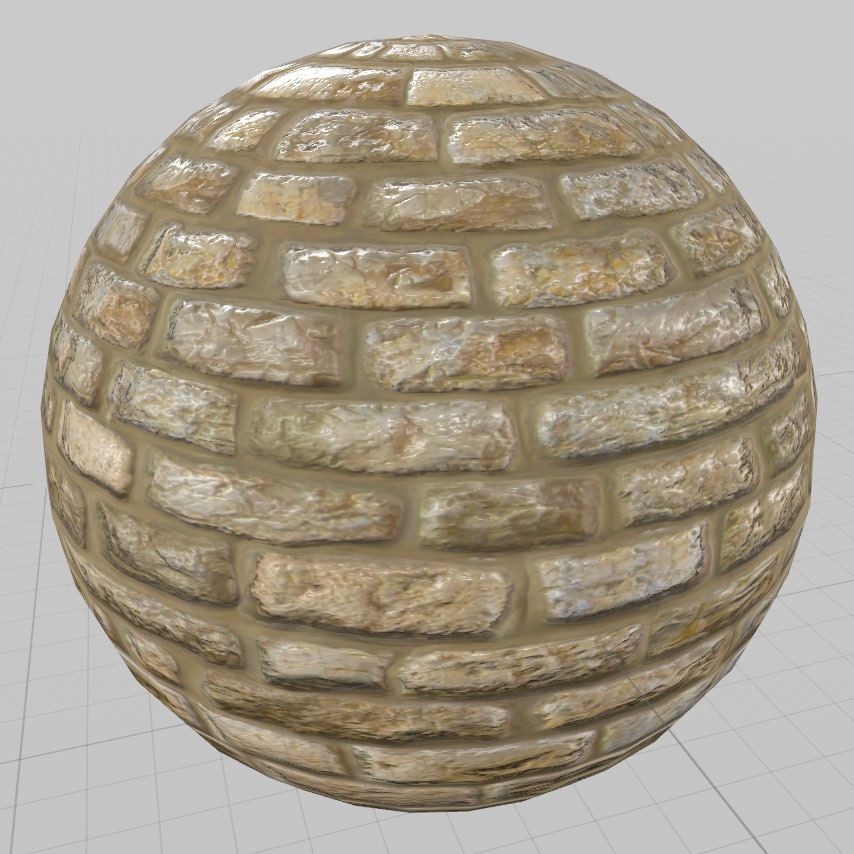

Color, roughness and normal textures applied

The Reality-rendered sphere looks quite different with these textures applied. Now 
to find out how to do this in your own renders.

You should be able to export your USD sphere from Reality Composer Pro from the 
File menu, but at time of writing, this doesn’t always work. You can try to use an 
exported sphere, but your starter project contains final-sphere.usdz with these 
textures included.

279

Metal by Tutorials
Chapter 11: Maps & Materials

Note: You can convert OBJ and glTF models and also add textures with Reality 
Converter (https://developer.apple.com/augmented-reality/tools/).

Materials

Before adding more textures to your render, you’ll set up the basic default material 
values, so that your PBR shader can get to work.

➤ In Xcode, open Common.h, and add a new structure to hold material values:

typedef struct { 
  vector_float3 baseColor; 
  float roughness; 
  float metallic; 
  float ambientOcclusion; 
} Material;

As you’ve seen, there are more material properties available to a physically based 
shader, but these are the most common. The normal value is provided by the vertex 
buffers.

➤ Open Submesh.swift, and create a new property in Submesh under textures to 
hold the submesh’s material:

Your project won’t compile until you’ve initialized material.

➤ At the bottom of Submesh.swift, create a new Material extension with 
initializer:

private extension Material { 
  init(material: MDLMaterial?) { 
    self.init() 
    if let baseColor = material?.property(with: .baseColor), 
      baseColor.type == .float3 { 
      self.baseColor = baseColor.float3Value 
    } 
    ambientOcclusion = 1 
  } 
}

280

Metal by Tutorials
Chapter 11: Maps & Materials

In Submesh.Textures, you read in string values for the textures’ file names from the 
submesh’s material properties. If there’s no texture available for a particular 
property, you can use the material base color. For example, if an object is solid red, 
you don’t have to go to the trouble of making a texture, you can just use the 
material’s base color of float3(1, 0, 0) to describe the color.

Currently you’re not loading or using ambient occlusion, but the default value 
should be 1.0 (white).

➤ In Submesh, in init(mdlSubmesh:mtkSubmesh:) after initializing textures, 
initialize material:

You’ll now send this material to the shader. This sequence of coding should be 
familiar to you by now.

➤ Open Common.h, and add another index to BufferIndices:

➤ Open Rendering.swift. In render(encoder:uniforms:params:), inside for 
submesh in mesh.submeshes where you call setFragmentTexture, add the 
following:

var material = submesh.material 
encoder.setFragmentBytes( 
  &material, 
  length: MemoryLayout<Material>.stride, 
  index: MaterialBuffer.index)

This code sends the material structure to the fragment shader. As long as your 
material structure stride is less than 4K bytes, then you don’t need to create and hold 
a special buffer.

➤ Open Lighting.h and remove the comments around the two PBR functions 
computeSpecular and computeDiffuse.

➤ Open PBR.metal and remove the comments from the start and end of the file.

These functions were commented because they refer to Material, which you only 
just defined.

➤ Open Fragment.metal, and add the following as a parameter of fragment_main:

281

Metal by Tutorials
Chapter 11: Maps & Materials

You pass the model’s material properties to the fragment shader. You use _ in front 
of the name, as _material is constant, and soon you’ll need to update the structure 
with the texture’s base color if there is one.

➤ At the top of fragment_main, add this so that you can override material values in 
the shader:

➤ In fragment_main, replace:

float3 baseColor = baseColorTexture.sample( 
  textureSampler, 
  in.uv * params.tiling).rgb;

With:

if (!is_null_texture(baseColorTexture)) { 
  material.baseColor = baseColorTexture.sample( 
  textureSampler, 
  in.uv * params.tiling).rgb; 
}

If the texture exists, replace the material base color with the color extracted from the 
texture. Otherwise, you’ve already loaded the base color in material.

➤ Still in fragment_main, remove the normal and color definition which uses the 
Phong shader:

float3 normalDirection = normalize(in.worldNormal); 
float3 color = phongLighting( 
  normal, 
  in.worldPosition, 
  params, 
  lights, 
  baseColor 
); 
return float4(color, 1);

➤ In its place, add this code to use the PBR shader:

// 1 
float3 normal = normalize(in.worldNormal); 
float3 diffuseColor = 
  computeDiffuse(lights, params, material, normal);

// 2 
float3 specularColor =

282

Metal by Tutorials
Chapter 11: Maps & Materials

computeSpecular(lights, params, material, normal);

// 3 
return float4(diffuseColor + specularColor, 1);

Going through the code:

1. You first calculate the diffuse color using the lights, the material and the surface 
normal.

2. You then calculate the specular color, which includes using the camera position 
supplied in params. Compare the code in PBR.metal with the Phong shader in 
Lighting.metal. The PBR code has a few more elements to calculate.

3. Combine the diffuse color and the specular color for the final result.

➤ Build and run the app. As yet, except for one tiny white dot to the left of center, 
you shouldn’t see much difference. This tiny white dot is the specular highlight.

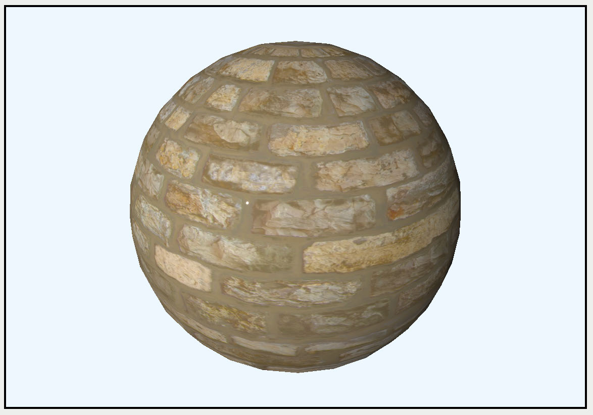

PBR shading

Surface Roughness

The smoother a surface is, the shinier it should be. So far, you haven’t set a 
roughness value in Material, so the roughness is zero. The surface is infinitely 
shiny.

➤ In Fragment.metal, at the top of fragment_main, after initializing material, add 
this:

283

Metal by Tutorials
Chapter 11: Maps & Materials

➤ Build and run the app.

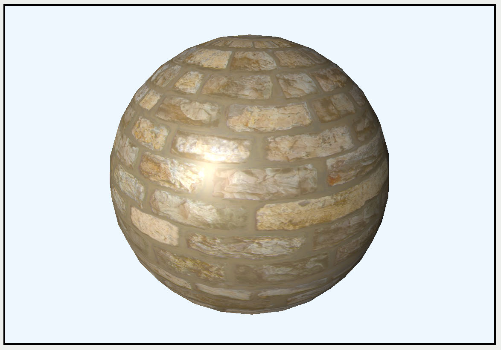

Specular highlight

The specular highlight is more noticeable now. Having a higher roughness value 
spreads out the specular.

Applying one roughness value to the entirety of a surface isn’t very realistic. Setting 
a roughness texture map will allow the fragment shader to shade each fragment 
differently. Your model’s roughness texture will make the bricks shiny, as if they’ve 
had rain on them, and the inset cement filling to be not at all shiny.

This is the sphere’s roughness texture:

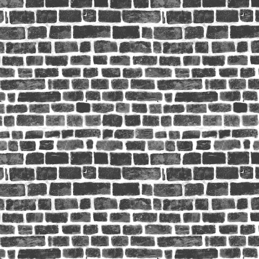

Roughness texture

When you read in the grayscale texture, the bricks’ roughness value will be close to 
zero, whereas the cement will be 1.0, so will not reflect the light.

284

Metal by Tutorials
Chapter 11: Maps & Materials

➤ Remove material.roughness = 0.4.

➤ Open Submesh.swift, and create a new property for roughness in 
Submesh.Textures:

➤ In the Submesh.Textures extension, add the following code to the end of 
init(material:):

This loads the roughness texture in the same way as you loaded the color texture. In 
case there is no texture, you need to read in the material value too.

➤ At the bottom of Material’s init(material:), add:

if let roughness = material?.property(with: .roughness), 
  roughness.type == .float { 
  self.roughness = roughness.floatValue 
}

Open Common.h and add the new texture index definitions to TextureIndices:

NormalTexture = 1, 
RoughnessTexture = 2, 
MetallicTexture = 3, 
AOTexture = 4

You’re not quite ready to add the other textures yet, but you can set up the indices 
for later.

➤ Open Rendering.swift, and in render(encoder:uniforms:params:), locate 
where you send the base color texture to the fragment function, then add this code 
afterward:

encoder.setFragmentTexture( 
  submesh.textures.roughness, 
  index: RoughnessTexture.index)

You create the command to send the roughness texture to the GPU.

285

Metal by Tutorials
Chapter 11: Maps & Materials

➤ Open Fragment.metal, and in fragment_main, add the roughness texture to the 
list of parameters:

➤ In the body of fragment_main, before initializing normal, add this:

if (!is_null_texture(roughnessTexture)) { 
  material.roughness = roughnessTexture.sample( 
    textureSampler, 
    in.uv * params.tiling).r; 
}

You read in the roughness value from the roughness texture, if there is one. If there 
isn’t a texture, the PBR shader will use material‘s roughness value. Unlike 
baseColor, roughness is a float, so you read in the value from the texture’s red 
channel.

➤ Build and run the app.

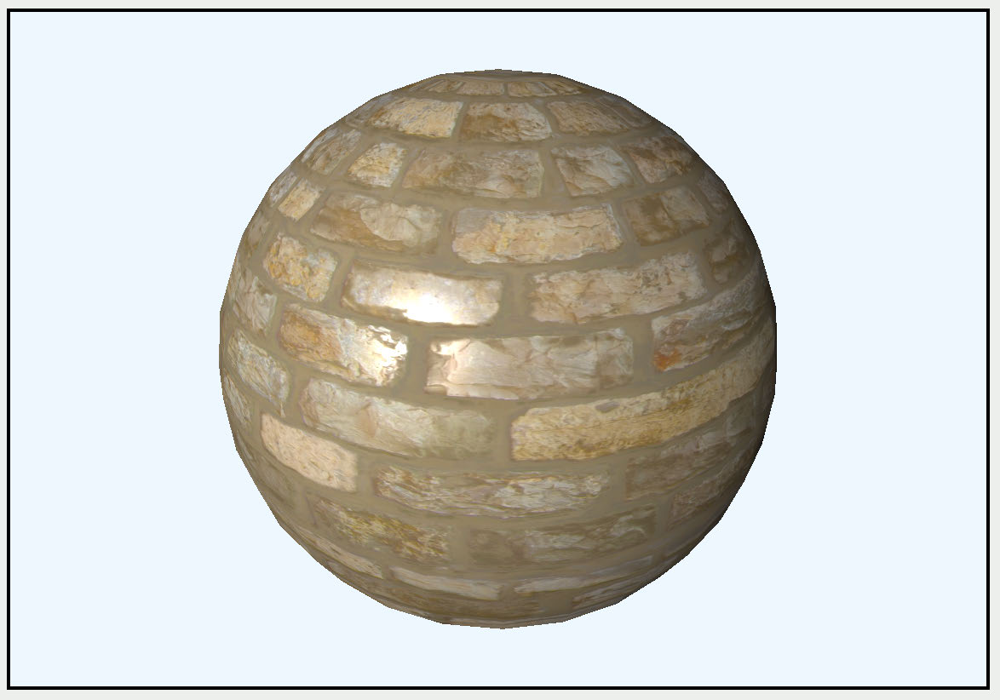

Roughness texture applied

As you rotate the scene by dragging, you’ll notice that the bricks pick up the 
highlight, but the cement mortar doesn’t.

The sphere is looking a bit more lively, but there’s still some detail missing. That’s 
where normal maps come in.

286

Metal by Tutorials
Chapter 11: Maps & Materials

Normal Maps

This is your desired final render:

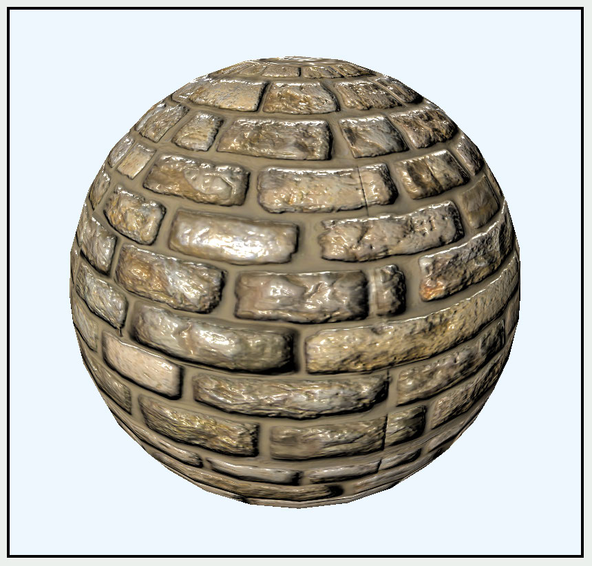

An object rendered with a normal map

The difference from your current render is simply that this sphere is rendered with 
the normal map applied. This normal map makes it appear as if the sphere is a high-
poly model with lots of nooks and crannies. In truth, these high-end details are just 
an illusion.

The normal map texture looks like this:

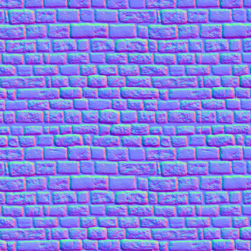

A normal map texture

All models have normals that stick out perpendicular to each face. For example, a 
cube has six faces, and the normal for each face points in a different direction. Also, 
each face is flat. If you wanted to create the illusion of bumpiness, you’d need to 
change a normal in the fragment shader.

287

Metal by Tutorials
Chapter 11: Maps & Materials

Look at the following image. On the left is a flat surface with normals in the 
fragment shader. On the right, you see perturbed normals. The texels in a normal 
map supply the direction vectors of these normals through the RGB channels.

Normals

Now, look at this single brick split out into the red, green and blue channels that 
make up an RGB image.

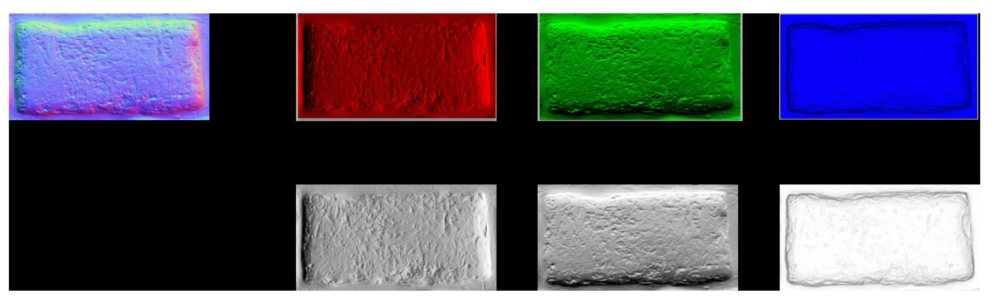

Normal map channels

Each channel has a value between 0 and 1, and you generally visualize them in 
grayscale as it’s easier to read color values. For example, in the red channel, a value 
of 0 is no red at all, while a value of 1 is full red. When you convert 0 to an RGB color 
(0, 0, 0), the result is black. On the opposite spectrum, (1, 1, 1) is white. And in 
the middle, you have (0.5, 0.5, 0.5), which is mid-gray. In grayscale, all three 
RGB values are the same, so you only need to refer to a grayscale value by a single 
float.

Take a closer look at the edges of the red channel’s brick. Look at the left and right 
edges in the grayscale image. The red channel has the darkest color where the 
normal values of that fragment should point left (-X, 0, 0), and the lightest color 
where they should point right (+X, 0, 0).

Now look at the green channel. The left and right edges have equal value but are 
different for the top and bottom edges of the brick. The green channel in the 
grayscale image has darkest for pointing down (0, -Y, 0) and lightest for pointing 
up (0, +Y, 0).

Finally, the blue channel is mostly white in the grayscale image because the brick — 
except for a few irregularities in the texture — points outward. The edges of the brick 
are the only places where the normals should point away.

288

Metal by Tutorials
Chapter 11: Maps & Materials

Note: Normal maps can be either right-handed or left-handed. Your renderer 
will expect positive y to be up, but some apps will generate normal maps with 
positive y down. To fix this, you can take the normal map into Photoshop and 
invert the green channel.

The base color of a normal map — where all normals are “normal” (orthogonal to the 
face) — is (0.5, 0.5, 1).

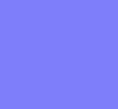

A flat normal map

This is an attractive color but was not chosen arbitrarily. RGB colors have values 
between 0 and 1, whereas a model’s normal values are between -1 and 1. A color 
value of 0.5 in a normal map translates to a model normal of 0. The result of reading 
a flat texel from a normal map should be a z value of 1 and the x and y values as 0. 
Converting these values (0, 0, 1) into the colorspace of a normal map results in 
the color (0.5, 0.5, 1). This is why most normal maps appear bluish.

Looking at normal map textures in a photo editor, you’d think they are color, but the 
trick is to regard the RGB values as numerical data instead of color data.

Note: Most 3D models will have normal values included, but you may come 
across odd files where you have to generate normals. Model I/O can create 
normals using 
MDLMesh.addNormals(withAttributeNamed:creaseThreshold:). The 
creaseThreshold accounts for how much you want the edges of each polygon 
smoothed.

289

Metal by Tutorials
Chapter 11: Maps & Materials

Creating Normal Maps

To create successful normal maps, you need a specialized app. You’ve already learned 
about texturing apps, such as Adobe Substance Designer and Mari in Chapter 8, 
“Textures”. Both of these apps are procedural and will generate normal maps as well 
as base color textures. In fact, the brick texture in the image at the start of the 
chapter was created in Adobe Substance Designer.

Sculpting programs, such as ZBrush, 3D-Coat and Blender will also generate normal 
maps from your sculpts. You first sculpt a detailed high-poly mesh. And then the app 
looks at the cavities and curvatures of your sculpt and bakes a normal map. Because 
high-poly meshes with tons of vertices aren’t resource-efficient in games, you 
should create a low-poly mesh and then apply the normal map to this mesh.

Photoshop and Adobe Substance 3D Sampler can generate a normal map from a 
photograph or diffuse texture. Because these apps look at the shading and calculate 
the values, they aren’t as good as the sculpting or procedural apps, but it can be quite 
amazing to take a photograph of a real-life, personal object, run it through one of 
these apps, and render out a shaded model.

Here’s a normal map that was created using Adobe’s Bitmap2Material:

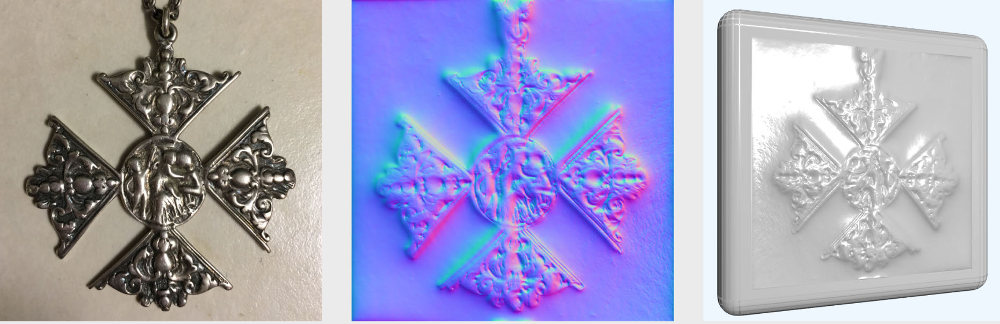

A cross photographed and converted into a normal map

On the right, the normal map is rendered on to a simple cube model with minimal 
geometry and a white base color.

290

Metal by Tutorials
Chapter 11: Maps & Materials

Tangent Space

To render with a normal map texture, you send it to the fragment function in the 
same way as a color texture, and you extract the normal values using the same UVs. 
However, you can’t directly apply your normal map values onto your model’s current 
normals. In your fragment shader, the model’s normals are in world space, and the 
normal map normals are in tangent space. Tangent space is a little hard to wrap 
your head around. Think of a cube with all its six faces pointing in different 
directions. Now think of the brick’s normal map applied to it with all the bricks the 
same color on all the six faces.

If a cube face is pointing toward negative x, how does the normal map know to point 
in that direction?

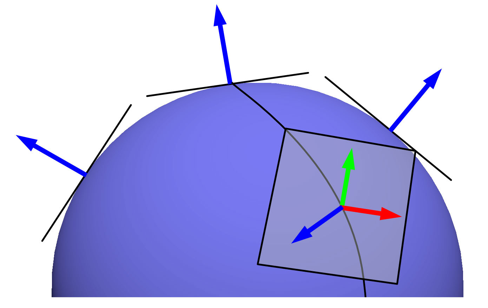

Normals on a sphere

Using a sphere as an example, every fragment has a tangent — that’s the line that 
touches the sphere at that point. The normal vector in this tangent space is thus 
relative to the surface. You can see that all of the arrows are at right angles to the 
tangent. So if you took all of the tangents and laid them out on a flat surface, the 
blue arrows would point upward in the same direction. That’s tangent space!

The following image shows a cube’s normals in world space.

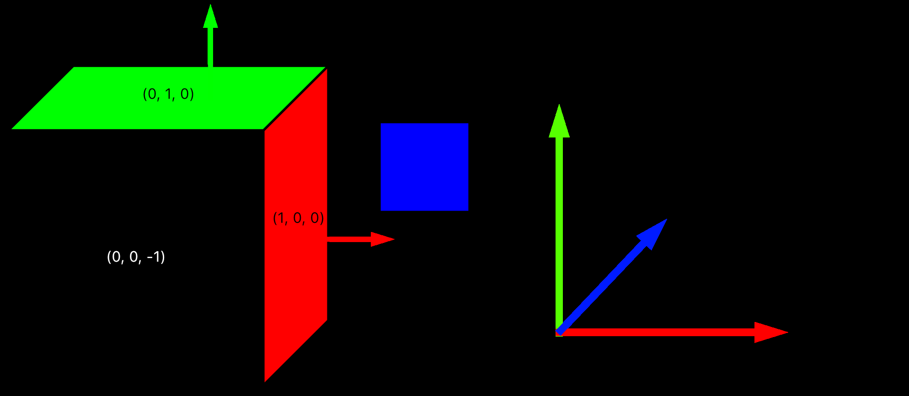

Visualizing normals in world space

291

Metal by Tutorials
Chapter 11: Maps & Materials

To convert the cube’s normals to tangent space, you create a TBN matrix - that’s a 
Tangent Bitangent Normal matrix that’s calculated from the tangent, bitangent 
and normal value for each vertex.

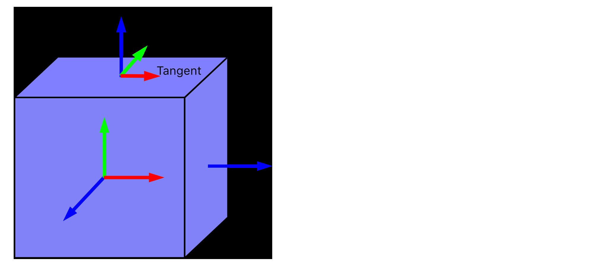

The TBN matrix

In the TBN matrix, the normal is the perpendicular vector as usual; the tangent is 
the vector that points along the horizontal surface; and the bitangent is the vector — 
as calculated by the cross product — that is perpendicular to both the tangent and 
the normal.

Note: The cross product is an operation that gives you a vector perpendicular 
to two other vectors.

The tangent can be at right angles to the normal in any direction. However, to share 
normal maps across different parts of models, and even entirely different models, 
there are two standards:

1. The tangent and bitangent will represent the directions that u and v point, 
respectively, defined in model space.

2. The red channel will represent curvature along u, and the green channel, along v.

You could calculate these values when you load the model. However, with Model I/O, 
as long as you have data for both the position and texture coordinate attributes, 
Model I/O can calculate and store these tangent and bitangent values at each vertex 
for you.

292

Metal by Tutorials
Chapter 11: Maps & Materials

Using Normal Maps

➤ In the Geometry group, open Submesh.swift, and add a new property to 
Submesh.Textures:

➤ At the end of SubMesh.Textures.init(material:), read in this texture:

You read in the normal map texture that the submesh points to.

➤ Open Rendering.swift, and in render(encoder:uniforms:params:), locate 
where you set the base color texture inside for submesh in mesh.submeshes.

➤ Add this:

encoder.setFragmentTexture( 
  submesh.textures.normal, 
  index: NormalTexture.index)

Here, you send the normal texture to the GPU.

➤ Open Fragment.metal, and in fragment_main, add the normal texture to the list 
of parameters:

Now that you’re transferring the normal texture map, the first step is to apply it to 
the sphere as if it were a color texture.

➤ In fragment_main, replace float3 normal = normalize(in.worldNormal); 
with this:

float3 normal; 
if (is_null_texture(normalTexture)) { 
  normal = in.worldNormal; 
} else { 
  normal = normalTexture.sample( 
  textureSampler, 
  in.uv * params.tiling).rgb; 
} 
normal = normalize(normal); 
return float4(normal, 1);

293

Metal by Tutorials
Chapter 11: Maps & Materials

Since not all models will come complete with textures, you check whether a texture 
is present. You read in the normal value from the texture, if there is one, otherwise 
set the default normal value. The return is only temporary to make sure the app is 
loading the normal map correctly, and that the normal map and UVs match.

➤ Build and run to verify the normal map is providing the fragment color.

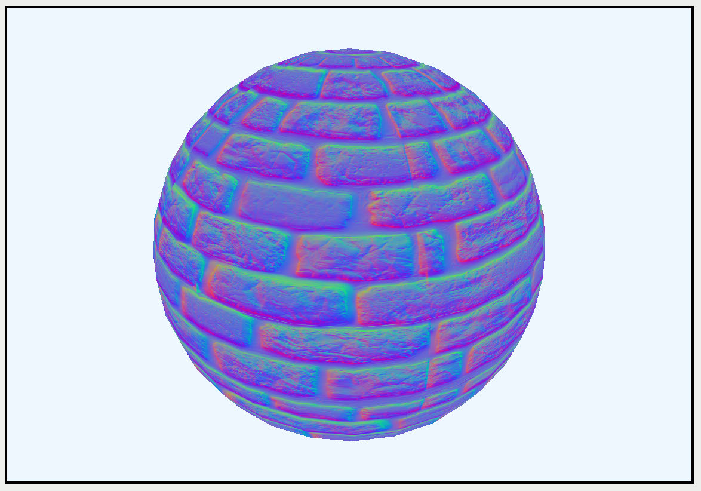

The normal map applied as a color texture

You can see all the surface details the normal map will provide.

➤ Excellent! You tested that the normal map loads, so remove this from 
fragment_main:

Don’t celebrate just yet. You still have several tasks ahead of you. If you ran the app 
now, you’d get some weird lighting and no color. You still need to:

1. Load tangent and bitangent values using Model I/O.

2. Tell the render command encoder to send the newly created MTLBuffers 
containing the values to the GPU.

3. In the vertex shader, change the tangent and bitangent values to world space — 
just as you did normals — and pass the new values to the fragment shader.

4. Calculate the new normal based on these values.

294

Metal by Tutorials
Chapter 11: Maps & Materials

1. Load Tangents and Bitangents

Model I/O will create tangent and bitangent attributes for you in new MTLBuffers. 
First, define these new buffer attribute and buffer indices.

➤ Open Common.h and add this to Attributes:

Tangent = 3, 
Bitangent = 4

➤ Add the indices to BufferIndices:

TangentBuffer = 2, 
BitangentBuffer = 3,

➤ Open VertexDescriptor.swift, and look at MDLVertexDescriptor’s 
defaultLayout.

Here, you tell the vertex descriptor that there are position, normal and UV attributes. 
Model I/O will create the tangent and bitangent attribute values in buffers, but you 
have to tell the GPU to read in these buffers.

When you create the pipeline state in Renderer, the pipeline descriptor uses 
defaultLayout as the vertex descriptor, and will now notify the GPU that it needs to 
create space for these two extra buffers. It’s important that you remember that your 
model’s vertex descriptor layout must match the one in the render encoder’s 
pipeline state.

➤ Add this to MDLVertexDescriptor’s defaultLayout before return:

vertexDescriptor.attributes[Tangent.index] = 
  MDLVertexAttribute( 
    name: MDLVertexAttributeTangent, 
    format: .float3, 
    offset: 0, 
    bufferIndex: TangentBuffer.index) 
vertexDescriptor.layouts[TangentBuffer.index] 
  = MDLVertexBufferLayout(stride: MemoryLayout<float3>.stride) 
vertexDescriptor.attributes[Bitangent.index] = 
  MDLVertexAttribute( 
    name: MDLVertexAttributeBitangent, 
    format: .float3, 
    offset: 0, 
    bufferIndex: BitangentBuffer.index) 
vertexDescriptor.layouts[BitangentBuffer.index] 
  = MDLVertexBufferLayout(stride: MemoryLayout<float3>.stride)

295

Metal by Tutorials
Chapter 11: Maps & Materials

You set up definitions and indices for two buffers, one for tangents and one for 
bitangents.

Note: So far, you’ve only created one pipeline descriptor for all models. But 
often models will require different vertex layouts. Or if some of your models 
don’t contain normals, colors and tangents, you might wish to save on 
creating buffers for them. You can create multiple pipeline states for the 
different vertex descriptor layouts, and replace the render encoder’s pipeline 
state before drawing each model.

➤ Open Model.swift in the Geometry group, and in init(name:), replace:

let (mdlMeshes, mtkMeshes) = try! MTKMesh.newMeshes( 
  asset: asset, 
  device: Renderer.device)

With:

var mtkMeshes: [MTKMesh] = [] 
let mdlMeshes = 
  asset.childObjects(of: MDLMesh.self) as? [MDLMesh] ?? [] 
_ = mdlMeshes.map { mdlMesh in 
  mtkMeshes.append( 
    try! MTKMesh( 
      mesh: mdlMesh, 
      device: Renderer.device)) 
}

Because you need to change the mesh with tangents and bitangents, you extract all 
the MDLMeshes from the asset. You create an MTKMesh array from these MDLMeshes.

➤ Before mtkMeshes.append, add this code:

mdlMesh.addTangentBasis( 
  forTextureCoordinateAttributeNamed: 
    MDLVertexAttributeTextureCoordinate, 
  tangentAttributeNamed: MDLVertexAttributeTangent, 
  bitangentAttributeNamed: MDLVertexAttributeBitangent)

For each MDLMesh, add the tangent and bitangent values.

296

Metal by Tutorials
Chapter 11: Maps & Materials

Model I/O does a few things behind the scenes:

• Add two named attributes to mdlMesh’s vertex descriptor: 
MDLVertexAttributeTangent and MDLVertexAttributeBitangent.

• Calculate the tangent and bitangent values.

• Create two new MTLBuffers to contain them.

• Update the layout strides on mdlMesh’s vertex descriptor to match the two new 
buffers.

Your default vertex descriptor matches the one set up by Model I/O.

2. Send Tangent and Bitangent Values to the 
GPU

➤ Open Rendering.swift, and in render(encoder:uniforms:params:), locate for 
mesh in meshes.

For each mesh, you’re currently sending all the vertex buffers to the GPU:

for (index, vertexBuffer) in mesh.vertexBuffers.enumerated() { 
  encoder.setVertexBuffer( 
    vertexBuffer, 
    offset: 0, 
    index: index) 
}

This code includes sending the tangent and bitangent buffers. You should be aware 
of the number of buffers that you send to the GPU. In Common.h, you’ve set up 
UniformsBuffer as index 11, but if you had defined that as index 3, you’d now have 
a conflict with the bitangent buffer.

297

Metal by Tutorials
Chapter 11: Maps & Materials

➤ Build and run the app to make sure your sphere still renders. Drag the sphere 
around to check the specular lighting.

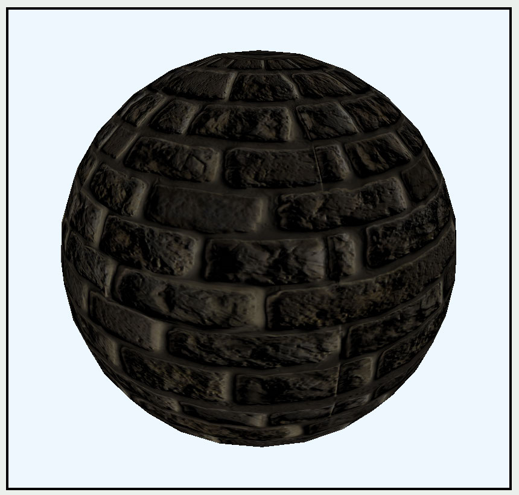

Normal calculations are wrong

That’s disappointing. All this work and you appear to have taken a step backward. 
But don’t worry! In computer graphics, a black screen can often resolve into glorious 
technicolor when you apply the right calculations in the shader.

3. Convert Tangent and Bitangent Values to 
World Space

Just as you converted the model’s normals to world space, you need to convert the 
tangents and bitangents to world space in the vertex function.

➤ In the Shaders group, open ShaderDefs.h, and add these new attributes to 
VertexIn:

float3 tangent [[attribute(Tangent)]]; 
float3 bitangent [[attribute(Bitangent)]];

298

Metal by Tutorials
Chapter 11: Maps & Materials

➤ Add new properties to VertexOut so that you can send the values to the fragment 
function:

float3 worldTangent; 
float3 worldBitangent;

➤ Open Vertex.metal and in vertex_main after calculating out.worldNormal, add 
this:

.worldTangent = uniforms.normalMatrix * in.tangent, 
.worldBitangent = uniforms.normalMatrix * in.bitangent

This code moves the tangent and bitangent values into world space.

4. Calculate the New Normal

Now that you have everything in place, it’ll be a simple matter to calculate the new 
normal.

Before doing the normal calculation, consider the normal color value that you’re 
reading. Colors are between 0 and 1, but normal values range from -1 to 1.

➤ Open Fragment.metal and in fragment_main, locate where you sample 
normalTexture. In the else part of the conditional, after reading the normal from 
the texture, add:

This code redistributes the normal value to be within the range -1 to 1.

➤ After the previous code, still inside the else part of the conditional, add this:

normal = float3x3( 
  in.worldTangent, 
  in.worldBitangent, 
  in.worldNormal) * normal;

This code recalculates the normal direction into tangent space to match the tangent 
space of the normal texture.

299

Metal by Tutorials
Chapter 11: Maps & Materials

➤ Build and run the app to see the normal map applied to the sphere.

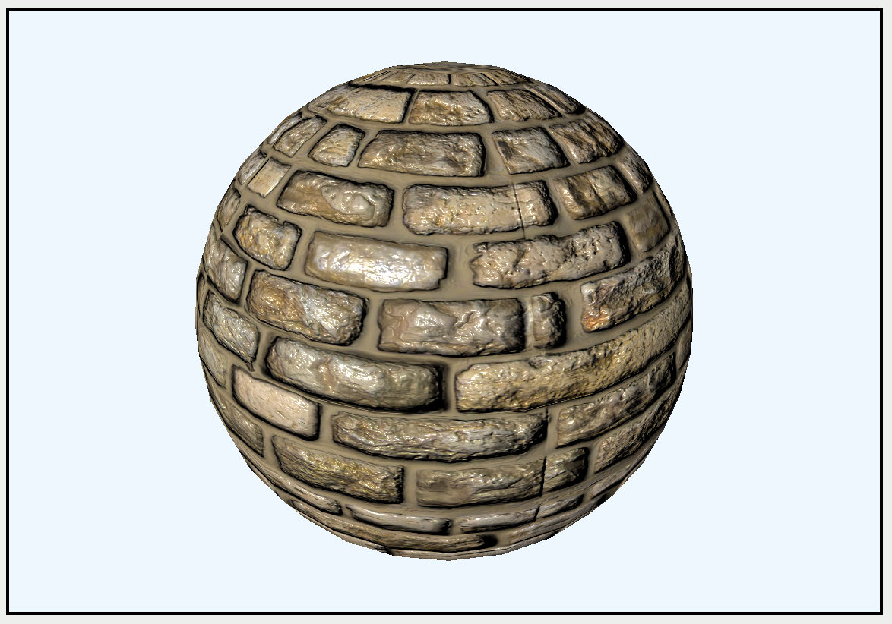

The sphere with a normal map applied

What a difference! As you rotate the scene, notice how the lighting affects the small 
cavities on the model — it’s almost like you created new geometry, but you didn’t. 
That’s the magic of normal maps: Adding amazing detail to simple low-poly models.

Other Texture Map Types

Normal and roughness maps are not the only way of changing a model’s surface. You 
can replace material values with any texture. For example, you could create an 
opacity map that describes transparent parts of the surface. Or a reflection map that 
builds in reflected objects.

In fact, any value (thickness, curvature, etc.) that you can think of to describe a 
surface, can be stored in a texture. You just look up the relevant fragment in the 
texture using the UV coordinates and use the value recovered. That’s one of the 
bonuses of writing your own renderer. You can choose what maps to use and how to 
apply them.

You use all of these textures in the fragment shader, and the geometry doesn’t 
change.

Note: A displacement or height map can change geometry. You’ll read about 
displacement in Chapter 19, “Tessellation & Terrains”.

300

Metal by Tutorials
Chapter 11: Maps & Materials

Challenge

Your challenge is to download and render the toy drummer model from Apple’s AR 
Quick Look gallery (https://developer.apple.com/augmented-reality/quick-look/).

In GameScene.swift, you’ll need to change the drummer’s scale to 0.5 and 
rotation.y to Float.pi to match your scene scale. Check the project in the 
challenge folder for camera target and distance to center the drummer.  Change 
SceneLighting to match the challenge project’s lighting. There are additional lights 
to fully show off the drummer.

Your first render should look like this:

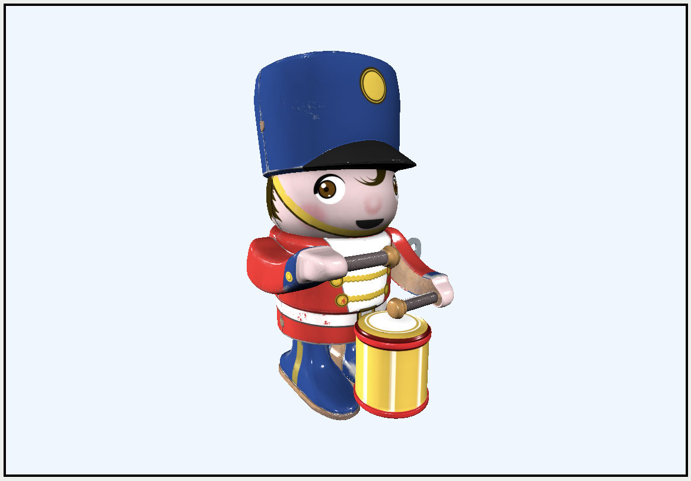

Rendering a toy drummer

After your first render, just as you did with the roughness texture, add metallic and 
ambient occlusion textures to your code in Submesh, Rendering.swift and 
fragment_main. Then, admire your final physically-based render. Notice the 
shadowing under the drummer’s chin. That comes from the ambient occlusion map.

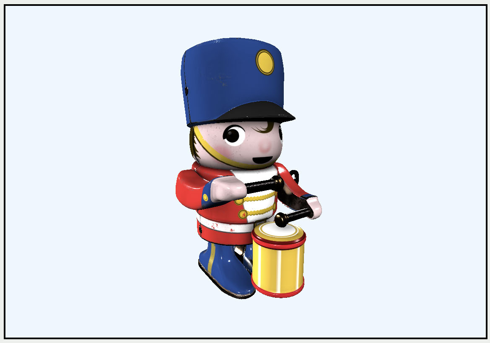

The final render

301

Metal by Tutorials
Chapter 11: Maps & Materials

Where to Go From Here?

Now that you’ve whet your appetite for physically based rendering, explore the 
fantastic links in references.markdown, which you’ll find in the resources folder for 
this chapter. Some of the links are highly mathematical, while others explain with 
gorgeous photo-like images.

302

12