# Render Passes

Up to this point, you’ve created projects that had only one render pass. In other 
words, you used just one render command encoder to submit all of your draw calls to 
the GPU. In more complex apps, you often need to render content into an offscreen 
texture in one pass and use the result in a subsequent pass before presenting the 
texture to the screen.

There are several reasons why you might do multiple passes:

• Shadows: In the following chapter, you’ll create a shadow pass and render a depth 
map from a directional light to help calculate shadows in a subsequent pass.

• Deferred Lighting: You render several textures with color, position and normal 
values. Then, in a final pass, you calculate lighting using those textures.

• Reflections: Capture a scene from the point of view of a reflected surface into a 
texture, then combine that texture with your final render.

• Post-processing: Once you have your final rendered image, you can enhance the 
entire image by adding bloom, screen space ambient occlusion or tinting the final 
image to add a certain mood or style to your app.

303

Metal by Tutorials
Chapter 12: Render Passes

Render Passes

A render pass consists of sending commands to a command encoder. The pass ends 
when you end encoding on that command encoder.

When setting up a render command encoder, you use a render pass descriptor. So far, 
you’ve used the MTKView currentRenderPassDescriptor, but you can define your 
own descriptor or make changes to the current render pass descriptor. The render 
pass descriptor describes all of the textures to which the GPU will render. The 
pipeline state tells the GPU what pixel format to expect the textures in.

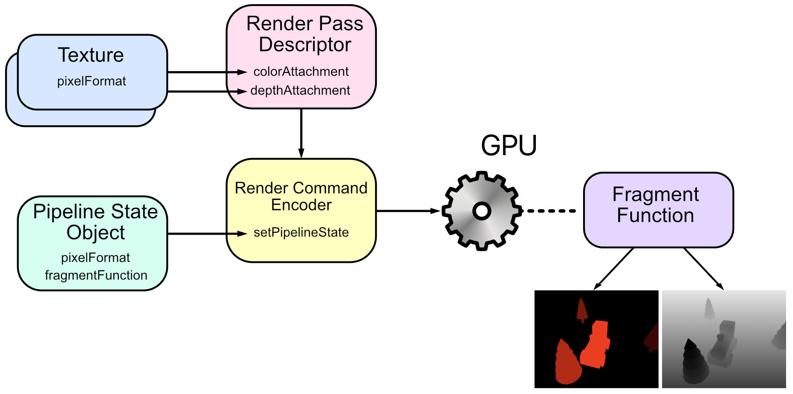

A render pass

304

Metal by Tutorials
Chapter 12: Render Passes

For example, the following render pass writes to four textures. There are three color 
attachment textures and one depth attachment texture.

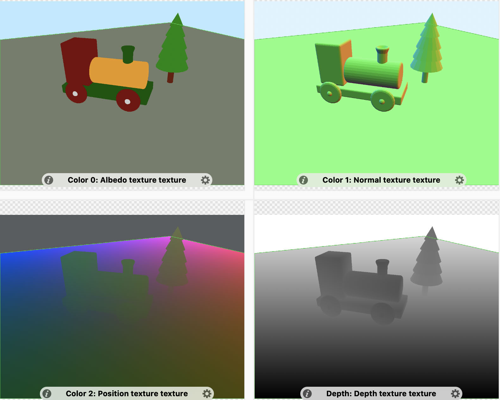

A render pass with four textures

305

Metal by Tutorials
Chapter 12: Render Passes

Object Picking

To get started with multipass rendering, you’ll create a simple render pass that adds 
object picking to your app. When you click a model in your scene, that model will 
render in a slightly different shade.

There are several ways to hit-test rendered objects. For example, you could do the 
math to convert the 2D touch location to a 3D ray and then perform ray intersection 
to see which object intersects the ray. Warren Moore describes this method in his 
Picking and Hit-Testing in Metal (https://bit.ly/3rlzm9b) article. Alternatively, you 
could render a texture where each object is rendered in a different color or object ID. 
Then, you calculate the texture coordinate from the screen touch location and read 
the texture to see which object was hit.

You’re going to store the model’s object ID into a texture in one render pass. You’ll 
then send the touch location to the fragment shader in the second render pass and 
read the texture from the first pass. If the fragment being rendered is from the 
selected object, you’ll render that fragment in a different color.

The Starter App

➤ In Xcode, open the starter app for this chapter and examine the code. It’s similar 
to the previous chapter but refactored.

• In the Render Passes group, ForwardRenderPass.swift contains the rendering 
code that used to be in Renderer along with the pipeline state and depth stencil 
state initialization. Separating this code will make it easier to have multiple render 
passes because you can then concentrate on getting the pipeline states and 
textures correct for each pass. In Renderer, draw(scene:in:) updates the 
uniforms, then tells the forward render pass to draw the scene.

• Pipelines.swift contains pipeline state creation. Later, PipelineStates will 
contain several more pipeline states.

• In the Game group, GameScene sets up new models in a scene.

• In the Geometry group, Model now has an objectId. When GameScene creates the 
model, in createModel(name:), it allocates a unique object ID. Model updates 
params with its objectId for the fragment function. The ground has an object ID 
of zero.

306

Metal by Tutorials
Chapter 12: Render Passes

• In the SwiftUI Views group, MetalView has a gesture that forwards the mouse or 
touch location to InputController when the user clicks or taps the screen.

• In the Shaders group, Common.h has some extra properties in Params to pass a 
touch location to the fragment function. Renderer initializes the scale factor of 
the device in params. Most retina devices have a scale factor of 2, however, iPhone 
Pro Max has a scale factor of 3.

➤ Build and run the app, and familiarize yourself with the code.

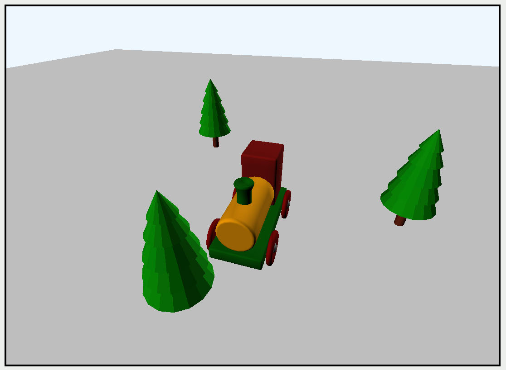

The starter app

Setting up Render Passes

Since you’ll have multiple render passes performing similar procedures, it makes 
sense to have a protocol with some default methods.

➤ In the Render Passes group, create a new Swift file named RenderPass.swift, and 
replace the code with:

import MetalKit

protocol RenderPass { 
  var label: String { get } 
  var descriptor: MTLRenderPassDescriptor? { get set } 
  mutating func resize(view: MTKView, size: CGSize) 
  func draw( 
    commandBuffer: MTLCommandBuffer, 
    scene: GameScene, 
    uniforms: Uniforms, 
    params: Params

307

Metal by Tutorials
Chapter 12: Render Passes

) 
}

extension RenderPass { 
}

All render passes will have a render pass descriptor. The pass might create its own 
descriptor or use the view’s current render pass descriptor. They’ll all need to resize 
the render textures when the user resizes the window. All render passes will need a 
draw method.

The extension will hold default render pass methods.

➤ Open ForwardRenderPass.swift, and conform ForwardRenderPass to 
RenderPass:

➤ Cut buildDepthStencilState() from ForwardRenderPass, and paste it into 
RenderPass’s extension.

Multiple render passes will use this depth stencil state initialization method.

Creating a UInt32 Texture

Textures don’t only hold color. There are many pixel formats (https://apple.co/
3Eby9oD). So far, you’ve used rgba8Unorm, a color format that contains four 8-bit 
integers for red, green, blue and alpha.

Model‘s objectId is a UInt32, and in place of the model’s color, you’ll render its ID 
to a texture. You’ll create a texture that holds UInt32s in a new render pass.

➤ In the Render Passes group, create a new Swift file named 
ObjectIdRenderPass.swift and replace the code with:

import MetalKit

struct ObjectIdRenderPass: RenderPass { 
  let label = "Object ID Render Pass" 
  var descriptor: MTLRenderPassDescriptor? 
  var pipelineState: MTLRenderPipelineState 
 
  mutating func resize(view: MTKView, size: CGSize) { 
  }

308

Metal by Tutorials
Chapter 12: Render Passes

func draw( 
    commandBuffer: MTLCommandBuffer, 
    scene: GameScene, 
    uniforms: Uniforms, 
    params: Params 
  ) { 
  } 
}

Here, you create the render pass with the required properties and methods to 
conform to RenderPass, along with a pipeline state object.

➤ Open Pipelines.swift, and add a method to PipelineStates to create the 
pipeline state object:

static func createObjectIdPSO() -> MTLRenderPipelineState { 
  let pipelineDescriptor = MTLRenderPipelineDescriptor() 
  // 1 
  let vertexFunction = 
    Renderer.library?.makeFunction(name: "vertex_main") 
  let fragmentFunction = 
    Renderer.library?.makeFunction(name: "fragment_objectId") 
  pipelineDescriptor.vertexFunction = vertexFunction 
  pipelineDescriptor.fragmentFunction = fragmentFunction 
  // 2 
  pipelineDescriptor.colorAttachments[0].pixelFormat = .r32Uint 
  // 3 
  pipelineDescriptor.depthAttachmentPixelFormat = .invalid 
  pipelineDescriptor.vertexDescriptor = 
    MTLVertexDescriptor.defaultLayout 
  return Self.createPSO(descriptor: pipelineDescriptor) 
}

Most of this code will be familiar to you, but there are some details to note:

1. You can use the same vertex function as you did to render the model because 
you’ll render the vertices in the same position. However, you’ll need a different 
fragment function to write the ID to the texture.

2. The color attachment’s texture pixel format is a 32-bit unsigned integer. The 
GPU will expect you to hand it a texture in this format.

3. You’ll come back and add a depth attachment, but for now, leave it invalid, which 
means that the GPU won’t require a depth texture.

309

Metal by Tutorials
Chapter 12: Render Passes

➤ Open ObjectIdRenderPass.swift, and create an initializer:

init() { 
  pipelineState = PipelineStates.createObjectIdPSO() 
  descriptor = MTLRenderPassDescriptor() 
}

Here, you initialize the pipeline state and the render pass descriptor.

Most render passes will require you to create a texture, so you’ll create one that 
takes several different parameters.

➤ Open RenderPass.swift, and add a new method to the extension:

static func makeTexture( 
  size: CGSize, 
  pixelFormat: MTLPixelFormat, 
  label: String, 
  storageMode: MTLStorageMode = .private, 
  usage: MTLTextureUsage = [.shaderRead, .renderTarget] 
) -> MTLTexture? { 
}

In addition to a size, you’ll give the texture:

• A pixel format, such as rgba8Unorm. In this render pass, you give it r32Uint.

• By default, the storage mode is private, meaning the texture stores in memory in 
a place that only the GPU can access.

• The usage. You have to configure textures used by render pass descriptors as 
render targets. Render targets are memory buffers or textures that allow 
offscreen rendering for cases where the rendered pixels don’t need to end up in 
the framebuffer. You’ll also want to read the texture in shader functions, so you set 
up that default capability, too.

➤ Add this code to 
makeTexture(size:pixelFormat:label:storageMode:usage:):

let width = Int(size.width) 
let height = Int(size.height) 
guard width > 0 && height > 0 else { return nil } 
let textureDesc = 
  MTLTextureDescriptor.texture2DDescriptor( 
    pixelFormat: pixelFormat, 
    width: width, 
    height: height, 
    mipmapped: false)

310

Metal by Tutorials
Chapter 12: Render Passes

textureDesc.storageMode = storageMode 
textureDesc.usage = usage 
guard let texture = 
  Renderer.device.makeTexture(descriptor: textureDesc) else { 
    fatalError("Failed to create texture") 
  } 
texture.label = label 
return texture

You configure a texture descriptor using the given parameters and create a texture 
from the descriptor.

➤ Open ObjectIdRenderPass.swift, and add a new property to 
ObjectIdRenderPass for the render texture:

➤ Add this code to resize(view:size:):

idTexture = Self.makeTexture( 
  size: size, 
  pixelFormat: .r32Uint, 
  label: "ID Texture")

Every time the view size changes, you’ll rebuild the texture to match the view’s size.

Now for the draw.

➤ Add this code to draw(commandBuffer:scene:uniforms:params:):

guard let descriptor = descriptor else { 
  return 
} 
descriptor.colorAttachments[0].texture = idTexture 
guard let renderEncoder = 
  commandBuffer.makeRenderCommandEncoder(descriptor: descriptor) 
else { return }

You assign idTexture to the descriptor’s first color attachment. You then create the 
render command encoder using this descriptor. The pixel format must match the 
render target textures when configuring the color attachment for the pipeline state 
object. In this case, you set them both to r32Uint.

➤ Add this code after the code you just added:

renderEncoder.label = label 
renderEncoder.setRenderPipelineState(pipelineState) 
for model in scene.models {

311

Metal by Tutorials
Chapter 12: Render Passes

model.render( 
    encoder: renderEncoder, 
    uniforms: uniforms, 
    params: params) 
} 
renderEncoder.endEncoding()

Here, you set the pipeline state and render the models.

Adding the Render Pass to Renderer

➤ Open Renderer.swift, and add the new render pass property:

➤ In init(metalView:options:), add this code before super.init() to initialize 
the render pass:

➤ Add this code to mtkView(_:drawableSizeWillChange:):

Here, you ensure that idTexture’s size matches the view size. Renderer’s initializer 
calls mtkView(_:drawableSizeWillChange), so your texture in the render pass is 
initialized and sized appropriately.

➤ Add this code to draw(scene:in:) immediately after updateUniforms(scene: 
scene):

objectIdRenderPass.draw( 
  commandBuffer: commandBuffer, 
  scene: scene, 
  uniforms: uniforms, 
  params: params)

Excellent, you’ve set up the render pass. Now all you have to do is create the 
fragment shader function to write to idTexture.

312

Metal by Tutorials
Chapter 12: Render Passes

Adding the Shader Function

The Object ID render pass will write the currently rendered model’s object ID to a 
texture. You don’t need any of the vertex information in the fragment function.

➤ In Shaders, create a new Metal File named ObjectId.metal and add:

#import "Common.h"

// 1 
struct FragmentOut { 
  uint objectId [[color(0)]]; 
};

// 2 
fragment FragmentOut fragment_objectId( 
  constant Params &params [[buffer(ParamsBuffer)]]) 
{ 
  // 3 
  FragmentOut out { 
    .objectId = params.objectId 
  }; 
  return out; 
}

Going through this code:

1. You create a structure that matches the render pass descriptor color attachment. 
Color attachment 0 contains the object ID texture.

2. The fragment function takes in params, of which you only need the object ID.

3. You create a FragmentOut instance and write the current object ID to it. You then 
return it from the fragment function, and the GPU writes the fragment into the 
given texture.

➤ Build and run the app.

313

Metal by Tutorials
Chapter 12: Render Passes

You won’t see a difference in your render. Currently, you’re not passing on the object 
ID texture to the second render pass.

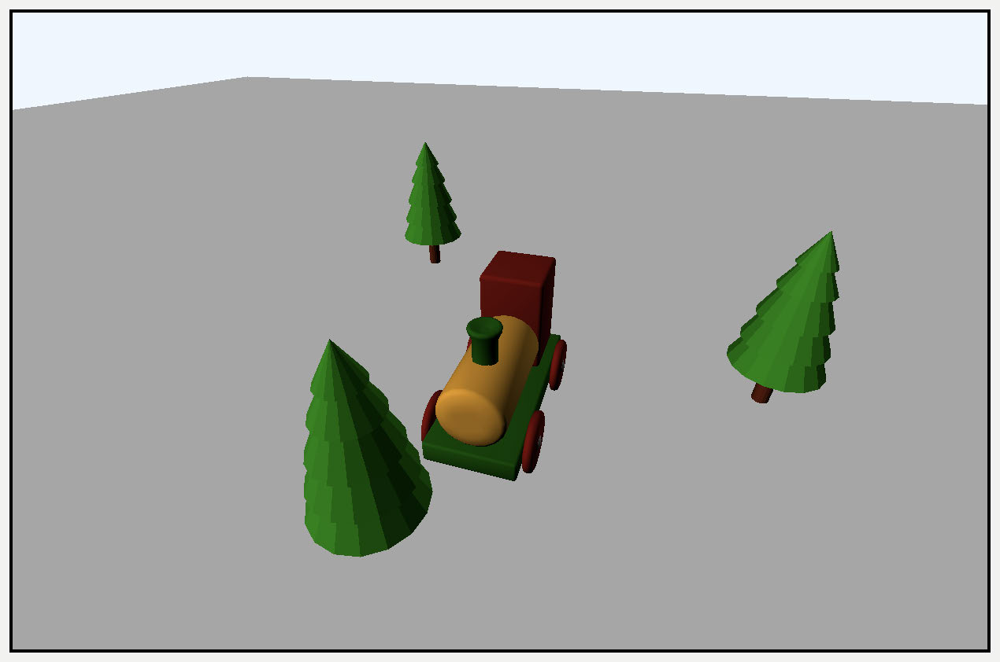

No difference to the render

➤ Capture the GPU workload by clicking the Metal icon and clicking Capture in the 
popup.

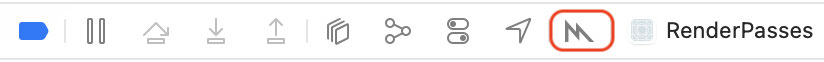

The GPU workload capture icon

314

Metal by Tutorials
Chapter 12: Render Passes

➤ Click the command buffer, and you’ll see two render passes. The Object ID render 
pass is on the left with an R32Uint pixel format texture. The usual forward render 
pass is at the top right and has a color texture and a depth texture.

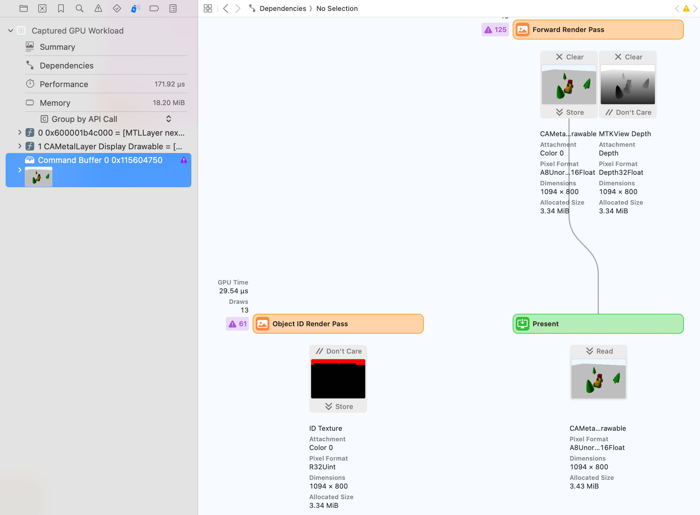

The GPU workload capture

The green Present is the Metal drawable texture that’s presented to the screen. The 
Object ID Render Pass isn’t passing any information to Present.

315

Metal by Tutorials
Chapter 12: Render Passes

➤ Double-click the Object ID Render Pass texture twice and click on the displayed 
Color 0 attachment. This is idTexture.

As you move your cursor over the pixels, it shows you the value of that pixel. In your 
fragment function, you set the fragment to show the object ID, but almost all of the 
texture shows an object ID of zero. The ground, which has an object ID of zero, is 
rendering on top of all the other objects.

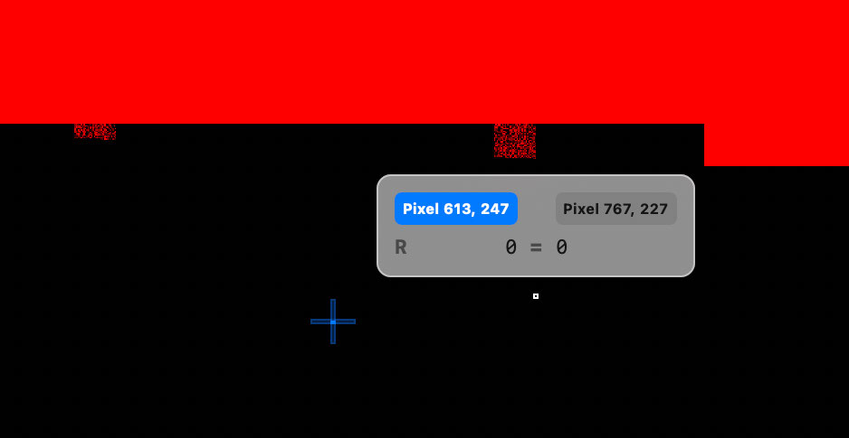

ID texture with erroneous object ID

Note: Your texture may show less red. Currently, the texture isn’t cleared at 
the start of the render pass, so any of the texture that wasn’t set in the 
fragment shader may contain any value.

To get the correct object ID, it’s important to discard models’ fragments that are 
behind other models. For this reason, you’ll need to render with a depth texture.

Adding the Depth Attachment

➤ Open ObjectIdRenderPass.swift, and add a new property to 
ObjectIdRenderPass:

So far, you’ve used the current drawable’s default depth texture. Next, you’ll create a 
depth texture that you’ll maintain.

316

Metal by Tutorials
Chapter 12: Render Passes

➤ Add this code to resize(view:size):

depthTexture = Self.makeTexture( 
  size: size, 
  pixelFormat: .depth32Float, 
  label: "ID Depth Texture")

Here, you create the depth texture with the correct size and pixel format. This pixel 
format must match the render pipeline state depth texture format.

➤ Open Pipelines.swift, and in createObjectIdPSO(), change 
pipelineDescriptor.depthAttachmentPixelFormat = .invalid to:

Now the pixel formats will match.

➤ Go back to ObjectIdRenderPass.swift. In 
draw(commandBuffer:scene:uniforms:params:), after setting the color 
attachment texture, add:

You created and stored a depth texture. If you were to build and run now and capture 
the GPU workload, you’d see the depth texture, but you haven’t completed setting up 
the GPU’s depth rendering yet.

The Depth Stencil State

➤ Create a new property in ObjectIdRenderPass:

➤ Add this code to the end of init():

You set up a depth stencil state object with the usual depth rendering.

317

Metal by Tutorials
Chapter 12: Render Passes

➤ In draw(commandBuffer:scene:uniforms:params:), add the following code 
after setting the render pipeline state:

Here, you let the GPU know about the depth setting you want to render with.

➤ Build and run the app. Capture the GPU workload and take a look at your Object 
ID color texture now.

Your texture may appear dark. This is because the Debugger is showing the object 
IDs 0 to 4 as a color. White will be the largest possible value, which is 
4,292,442,372. So 4 will be almost black. You can remap the colors using the icon at 
the top left of the view.

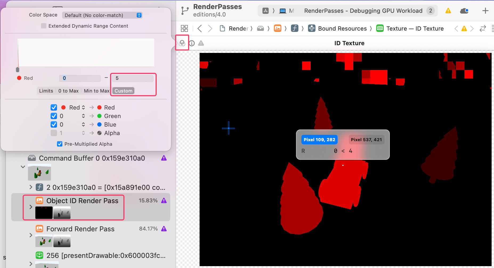

ID texture with Object IDs

Now when you run the magnifier over each object, you’ll clearly see the object IDs.

You may see some random pixels at the top of the render. When you load the texture, 
the render pass executes a load action. The current load action for the texture is 
dontCare, so wherever you’re not rendering an object, the pixels will be random.

318

Metal by Tutorials
Chapter 12: Render Passes

You’ll need to clear the texture before you render to know exactly what object ID is 
in the area you click to select.

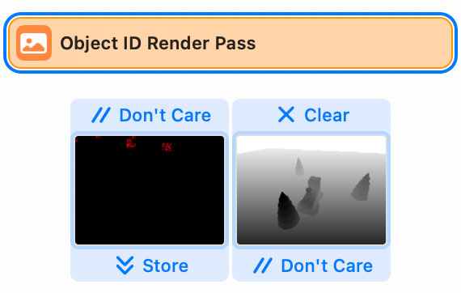

Load and store actions

Note: In reality, it doesn’t matter whether you clear on load in this example. 
As you’ll see shortly, the change of color of each fragment on a picked object 
will only occur during the fragment function. Since the non-rendered pixels at 
the top of the screen aren’t being processed through a fragment function, a 
change of color will never happen. However, it’s good practice to know what’s 
happening in your textures. At some point, you might decide to pass back the 
texture to the CPU for further processing.

Load & Store Actions

A render pass executes the load action whenever it loads an attachment texture 
before writing to it. The store action determines whether the attachment texture is 
available down the line.

You set up load and store actions in the render pass descriptor attachments.

➤ Open ObjectIdRenderPass.swift. In 
draw(commandBuffer:scene:uniforms:params:), after setting 
descriptor.colorAttachments[0].texture, add:

descriptor.colorAttachments[0].loadAction = .clear 
descriptor.colorAttachments[0].storeAction = .store

319

Metal by Tutorials
Chapter 12: Render Passes

The load action can be clear, load or dontCare. The most common store actions are 
store or dontCare.

Only clear the texture if you need to. If your fragment function writes to every 
fragment that appears on-screen, you generally don’t need to clear. For example, you 
don’t need to clear if you render a full-screen quad.

➤ Build and run the app, and capture the GPU workload again. Recheck the object ID 
texture.

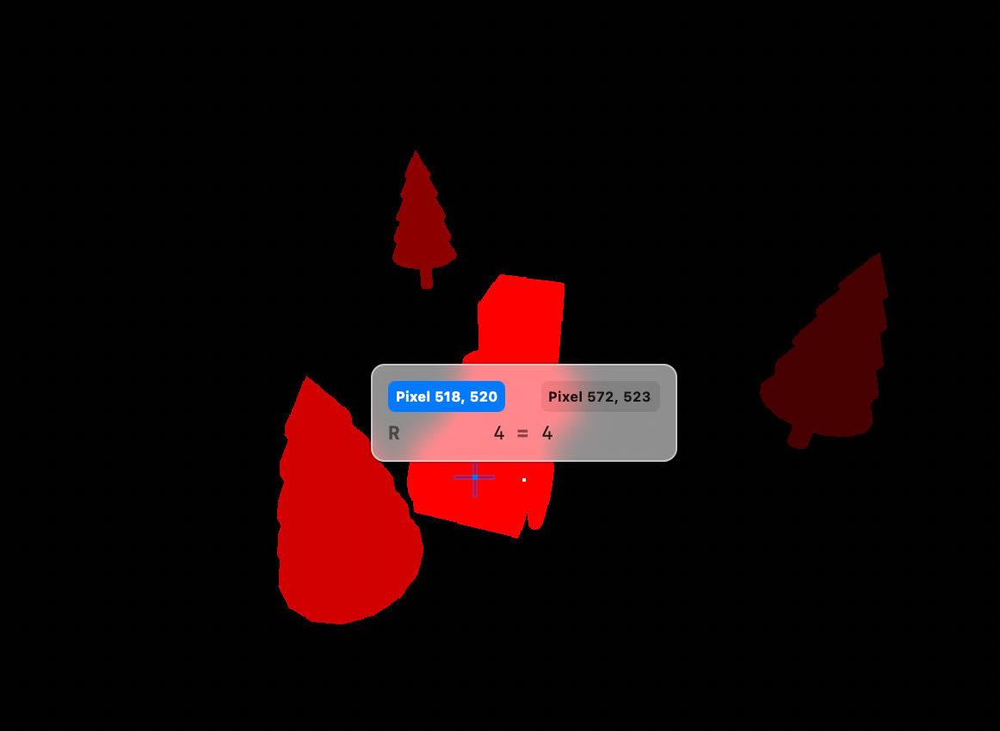

No random pixels

The pixels at the top of the screen are now cleared with zeros. If you want a non-zero 
clear value, set colorAttachments[0].clearColor.

Reading the Object ID Texture

You now have a choice. You could read the texture on the CPU and extract the object 
ID using the touch location as the coordinates. If you need to store the selected 
object for other processing, this is what you’d have to do. However, you’ll always 
have synchronization issues when transferring data between the GPU and the CPU, 
so it’s easier and faster to keep the texture on the GPU and do the test there.

➤ Open ForwardRenderPass.swift, and add this new property to 
ForwardRenderPass:

idTexture will hold the ID texture from the object ID render pass.

320

Metal by Tutorials
Chapter 12: Render Passes

➤ Open Renderer.swift. In draw(scene:in:), add this code after 
objectIdRenderPass.draw(...):

You pass the ID texture from one render pass to the next.

➤ Open ForwardRenderPass.swift. In 
draw(commandBuffer:scene:uniforms:params:), before the for render loop, add:

You pass idTexture to the forward render pass’s fragment function. Be careful with 
your index numbers. You may want to rename this one as you did with earlier 
indices.

You’ll also need to send the touch location to the fragment shader so you can use it 
to read the ID texture.

➤ After the previous code, add:

let input = InputController.shared 
var params = params 
params.touchX = UInt32(input.touchLocation?.x ?? 0) 
params.touchY = UInt32(input.touchLocation?.y ?? 0)

input.touchLocation is the last location touched on the metal view. The SwiftUI 
gesture updates it on MetalView.

➤ Open Fragment.metal. and add this code to the parameters of fragment_main:

Be mindful of the type of texture you pass and the index number.

➤ After the conditional that sets material.baseColor, add:

if (!is_null_texture(idTexture)) { 
  uint2 coord = uint2( 
    params.touchX * params.scaleFactor,  
    params.touchY * params.scaleFactor); 
  uint objectID = idTexture.read(coord).r; 
  if (params.objectId != 0 && objectID == params.objectId) { 
    material.baseColor = float3(0.9, 0.5, 0); 
  } 
}

321

Metal by Tutorials
Chapter 12: Render Passes

Here, you read idTexture using the passed-in touch coordinates. idTexture is the 
same size as the view’s drawable. This size is the pixel resolution of the view, and not 
the point size of the view.

Sometimes it’s worthwhile to halve texture sizes to save resources. You could 
certainly do that here, as long as you remember to halve the coordinates when 
reading the texture in the fragment function.

Notice that read differs from sample. read uses pixel coordinates rather than 
normalized coordinates. You don’t need a sampler to read a texture, but you also 
can’t use the various sampler options when you use read.

If the currently rendered object ID isn’t zero and the object ID matches the fragment 
in idTexture, change the material’s base color to orange.

➤ Build and run the app and test that your object picking works on different 
resolutions. iPhone Pro Max has a 3x resolution scale.

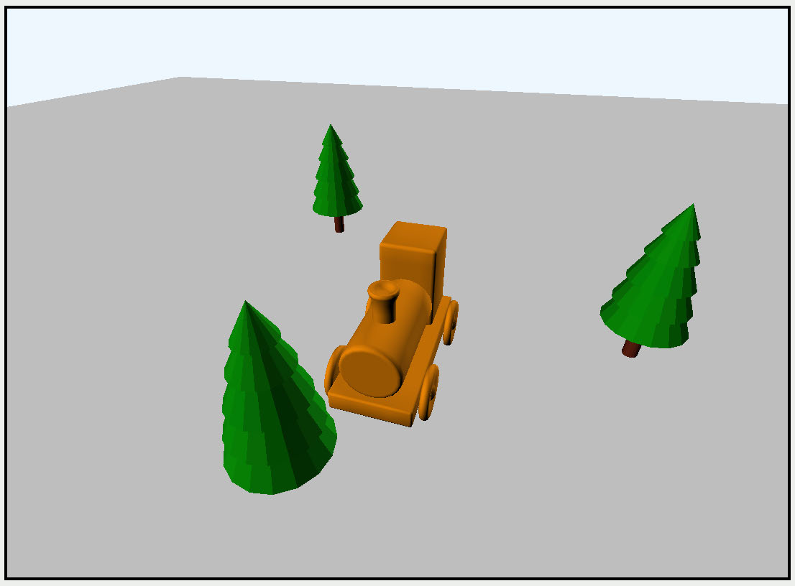

Selected train turns orange

The object you pick will turn orange. When you click the sky or the ground which has 
an object ID of zero, none of the objects are picked.

This is an easy way to test whether an object is picked. It’s also a good way to learn 
simple render pass texture chaining. However, in most circumstances, you’ll need to 
pass back the texture to the CPU, so it’s more efficient to perform ray picking as 
described at the beginning of the chapter.

322

Metal by Tutorials
Chapter 12: Render Passes

➤ With the app running, capture the GPU workload, and click the command buffer to 
see the frame graph.

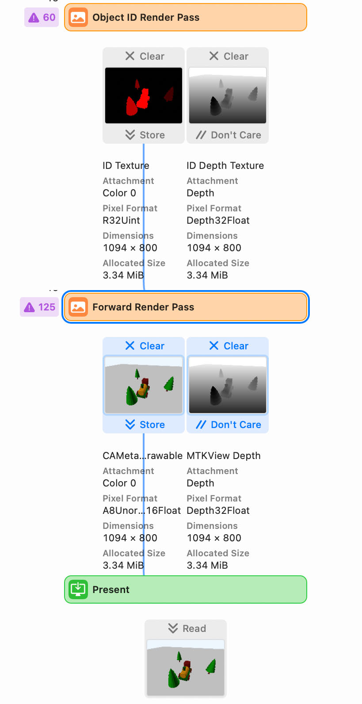

The completed render passes

The frame graph reflects that the Object ID render pass sends idTexture to the 
Forward Render Pass, which draws to the view’s drawable texture. The graph points 
out in purple any missing textures and redundant binding errors where you bind an 
already bound texture.

Now that you know how to render textures in different render passes, you can move 
on to more complex rendering and add some shadows in the next chapter.

323

Metal by Tutorials
Chapter 12: Render Passes

Key Points

• A render pass descriptor describes all of the textures and load and store actions 
needed by a render pass.

• Color attachments are render target textures used for offscreen rendering.

• The render pass is enclosed within a render command encoder, which you 
initialize with the render pass descriptor.

• You set a pipeline state object on the render command encoder. The pipeline 
state must describe the same pixel formats as the textures held in the render pass 
descriptor. If there is no texture, the pixel format must be invalid.

• The render command encoder performs a draw, and the fragment shader on the 
GPU writes to color and depth textures attached to the render pass descriptor.

• Color attachments don’t have to be rgb colors. Instead, you can write uint or 
float values in the fragment function.

• For each texture, you describe load and store actions. If you aren’t using a texture 
in a later render pass, the action should be dontCare so the GPU can discard it and 
free up memory.

• The GPU workload capture shows you a frame graph where you can see how all 
your render passes chain together.

324

13