# Shadows

In this chapter, you’ll learn about shadows. A shadow represents the absence of light 
on a surface. You see shadows on an object when another surface or object obscures 
it from light. Adding shadows in a project makes your scene look more realistic and 
provides a feeling of depth.

325

Metal by Tutorials
Chapter 13: Shadows

Shadow Maps

Shadow maps are textures containing a scene’s shadow information. When light 
shines on an object, it casts a shadow on anything behind it.

Typically, you render the scene from your camera’s location. However, to build a 
shadow map, you need to render your scene from the light source’s location - in this 
case, the sun.

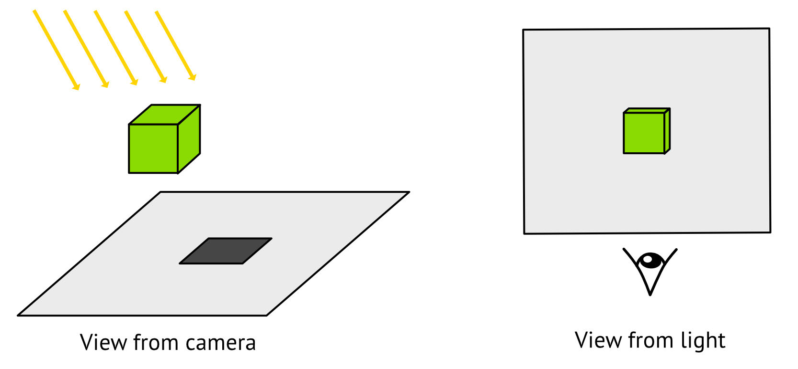

A scene render

The image on the left shows a render from the camera’s position with the directional 
light pointing down. The image on the right shows a render from the directional 
light’s position. The eye shows the camera’s position in the first image.

You’ll do two render passes:

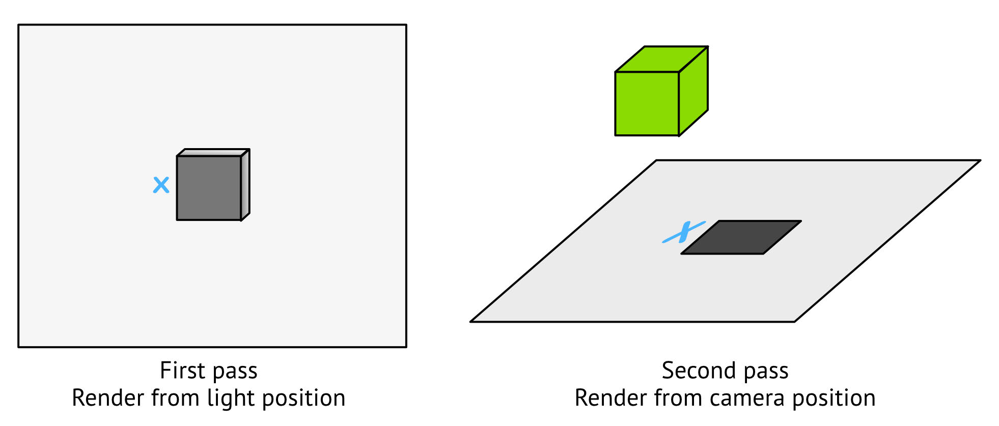

Two render passes are needed

326

Metal by Tutorials
Chapter 13: Shadows

• First pass: You’ll render from the light’s point of view. Since the sun is directional, 
you’ll use an orthographic camera rather than a perspective camera. You’re only 
interested in the depth of objects that the sun can see, so you won’t render a color 
texture. In this pass, you’ll only render the shadow map as a depth texture. This is 
a grayscale texture, with the gray value indicating depth. Black is close to the light, 
and white is farther away.

• Second pass: You’ll render using the scene camera as usual, but you’ll compare 
the camera fragment with each shadow map fragment. If the camera fragment’s 
depth is less than the shadow map fragment at that position, the fragment is in the 
shadow. The light can see the blue x in the above image, so it isn’t in shadow.

Why would you need two passes here? In this case, you’ll render the shadow map 
from the light’s position, not from the camera’s position. You’ll save the output to a 
shadow texture and give it to the next render pass, which combines the shadow with 
the rest of the scene to make a final image.

The Starter Project

➤ In Xcode, open this chapter’s starter project.

The code in the starter project is almost identical to the previous chapter but 
without the object ID and picking code. The scene now has a visible sun that rotates 
around the scene’s center as the only light. (Remember that the sun is a directional 
vector. The sun model in the scene is much closer than the sun really would be!)

The code for rendering the sun is in the Utility group in DebugModel.swift. You’ll 
render the sun separately from the scene in ForwardRenderPass so that the sun 
model isn’t shaded with the rest of the scene.

There are a few extra files containing code the app doesn’t need yet. You’ll learn 
about these files as you proceed through the chapter.

327

Metal by Tutorials
Chapter 13: Shadows

➤ Build and run the app.

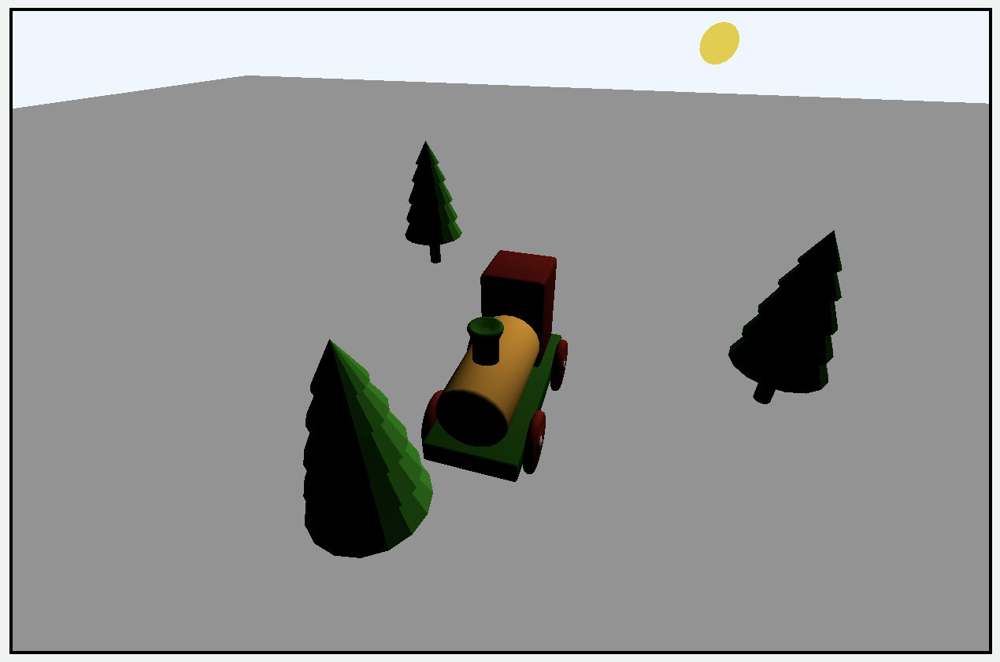

The starter app

Without shadows, the train and trees in this render appear to float above the ground.

The process for adding the new shadow pass is similar to adding the previous 
chapter’s object picking render pass:

1. Create the new render pass structure and configure the render pass descriptor, 
depth stencil state and pipeline state.

2. Declare and draw the render pass in Renderer.

3. Set up the drawing code in the render pass.

4. Set up an orthographic camera from the light’s position and calculate the 
necessary matrices.

5. Create the vertex shader function to draw vertices from the light’s position.

Although you give the sun a position in this app, as you learned in Chapter 10, 
“Lighting Fundamentals”, a directional light has a direction rather than a position. 
So here, you’ll use the sun’s position as a direction.

Note: If you want to see directional lines to debug the sun’s direction, as you 
did in the earlier chapter, add DebugLights.draw(lights: 
scene.lighting.lights, encoder: renderEncoder, uniforms: 
uniforms) to ForwardRenderPass before renderEncoder.endEncoding().

Time to add the new shadow pass.

328

Metal by Tutorials
Chapter 13: Shadows

1. Creating the New Render Pass

➤ In the Render Passes group, create a new Swift file named 
ShadowRenderPass.swift, and replace the code with:

import MetalKit

struct ShadowRenderPass: RenderPass { 
  let label: String = "Shadow Render Pass" 
  var descriptor: MTLRenderPassDescriptor? 
    = MTLRenderPassDescriptor() 
  var depthStencilState: MTLDepthStencilState? 
    = Self.buildDepthStencilState() 
  var pipelineState: MTLRenderPipelineState 
  var shadowTexture: MTLTexture? 
 
  mutating func resize(view: MTKView, size: CGSize) { 
  } 
 
  func draw( 
    commandBuffer: MTLCommandBuffer, 
    scene: GameScene, 
    uniforms: Uniforms, 
    params: Params 
  ) { 
  } 
}

This code creates a render pass that conforms to RenderPass, with a pipeline state 
and a texture property for the shadow map.

➤ Open Pipelines.swift, and create a new method to create the pipeline state 
object:

static func createShadowPSO() -> MTLRenderPipelineState { 
  let vertexFunction = 
    Renderer.library?.makeFunction(name: "vertex_depth") 
  let pipelineDescriptor = MTLRenderPipelineDescriptor() 
  pipelineDescriptor.vertexFunction = vertexFunction 
  pipelineDescriptor.colorAttachments[0].pixelFormat = .invalid 
  pipelineDescriptor.depthAttachmentPixelFormat = .depth32Float 
  pipelineDescriptor.vertexDescriptor = .defaultLayout 
  return createPSO(descriptor: pipelineDescriptor) 
}

329

Metal by Tutorials
Chapter 13: Shadows

Here, you create a pipeline state without a color attachment or fragment function. 
You’re only interested in the depth information for the shadow — not the color 
information — so you set the color attachment pixel format to invalid. You’ll still 
render models, so you still need to hold the vertex descriptor and transform all of the 
models’ vertices in a vertex function.

➤ Open ShadowRenderPass.swift, and create the initializer:

init() { 
  pipelineState = 
    PipelineStates.createShadowPSO() 
  shadowTexture = Self.makeTexture( 
    size: CGSize( 
    width: 2048, 
    height: 2048), 
  pixelFormat: .depth32Float, 
  label: "Shadow Depth Texture") 
}

This code initializes the pipeline state object and builds the depth texture with the 
required pixel format. Unlike other render passes, where you match the view’s size, 
shadow maps are usually square to match the light’s cuboid orthographic camera, so 
you don’t need to resize the texture when the window resizes. The resolution should 
be as much as your game resources budget allows to produce sharper shadows.

2. Declaring and Drawing the Render Pass

➤ In the Game group, open Renderer.swift, and add the new render pass property 
to Renderer:

➤ In init(metalView:options:), initialize the render pass before calling 
super.init().

➤ In mtkView(_:drawableSizeWillChange:), add:

At the moment, you’re not resizing any textures in shadowRenderPass, but since 
you’ve already created resize(view:size:) as a required method to conform to 
RenderPass, and you may add textures later, you should call the method here.

330

Metal by Tutorials
Chapter 13: Shadows

➤ In draw(scene:in:), after updateUniforms(scene: scene), add:

shadowRenderPass.draw( 
  commandBuffer: commandBuffer, 
  scene: scene, 
  uniforms: uniforms, 
  params: params)

This code performs the render pass.

3. Setting up the Render Pass Drawing Code

➤ Open ShadowRenderPass.swift, and add the following code to 
draw(commandBuffer:scene:uniforms:params:):

guard let descriptor = descriptor else { return } 
descriptor.depthAttachment.texture = shadowTexture 
descriptor.depthAttachment.loadAction = .clear 
descriptor.depthAttachment.storeAction = .store

guard let renderEncoder = 
  commandBuffer.makeRenderCommandEncoder(descriptor: descriptor) 
else { 
  return 
} 
renderEncoder.label = "Shadow Encoder" 
renderEncoder.setDepthStencilState(depthStencilState) 
renderEncoder.setRenderPipelineState(pipelineState) 
for model in scene.models { 
  renderEncoder.pushDebugGroup(model.name) 
  model.render( 
    encoder: renderEncoder, 
    uniforms: uniforms, 
    params: params) 
  renderEncoder.popDebugGroup() 
} 
renderEncoder.endEncoding()

Here, you set the depth attachment texture on the descriptor’s depth attachment. 
The GPU will clear the texture on loading it and store it so that the following render 
pass can use it. You then create the render command encoder, using the descriptor, 
and render the scene as usual.

You surround the model render with renderEncoder.pushDebugGroup(_:) and 
renderEncoder.popDebugGroup(), which gathers the render commands into groups 
on the GPU workload capture. Now, you can more easily debug what’s happening.

331

Metal by Tutorials
Chapter 13: Shadows

4. Setting up the Light Camera

During the shadow pass, you’ll render from the point of view of the sun, so you’ll 
need a new camera and some new shader matrices.

➤ In Common.h, in the Shaders group, add these properties to Uniforms:

matrix_float4x4 shadowProjectionMatrix; 
matrix_float4x4 shadowViewMatrix;

Here, you hold the projection and view matrices for the sunlight.

➤ Open Renderer.swift, and add a new property to Renderer:

Here, you create an orthographic camera. You previously used an orthographic 
camera in Chapter 9, “Navigating a 3D Scene”, to render the scene from above. 
Because sunlight is a directional light, this is the correct projection type for shadows 
caused by sunlight. However, if you want shadows from a spotlight, you would use a 
perspective camera with a field of view that matches the spotlight’s cone angle.

➤ Add the following code to the end of updateUniforms(scene:):

shadowCamera.viewSize = 16 
shadowCamera.far = 16 
let sun = scene.lighting.lights[0] 
shadowCamera.position = sun.position

With this code, you set up the orthographic camera with a cubic view volume of 16 
units.

➤ Continue with some more code:

uniforms.shadowProjectionMatrix = shadowCamera.projectionMatrix 
uniforms.shadowViewMatrix = float4x4( 
  eye: sun.position, 
  center: .zero, 
  up: [0, 1, 0])

332

Metal by Tutorials
Chapter 13: Shadows

shadowViewMatrix is a lookAt matrix that ensures the sun is looking at the center of 
the scene. float4x4(eye:center:up) is defined in MathLibrary.swift. It takes the 
camera’s position, the point that the camera should look at, and the camera’s up 
vector. This matrix rotates the camera to look at the target by providing these 
parameters.

Note: Here’s a useful debugging tip. Temporarily set uniforms.viewMatrix to 
uniforms.shadowViewMatrix and uniforms.projectionMatrix to 
uniforms.shadowProjectionMatrix at the end of 
updateUniforms(scene:). Developers commonly get the shadow matrices 
wrong, and it’s useful to visualize the scene render through the light.

5. Creating the Shader Function

As you may have noticed when you set up the shadow pipeline state object in 
Pipelines.swift, it references a shader function named vertex_depth, which doesn’t 
exist yet.

➤ In the Shaders group, using the Metal File template, create a new file named 
Shadow.metal. Make sure to check the targets.

➤ Add the following code to the new file:

#import "Common.h"

struct VertexIn { 
  float4 position [[attribute(0)]]; 
}; 
 
vertex float4 
  vertex_depth(const VertexIn in [[stage_in]], 
  constant Uniforms &uniforms [[buffer(UniformsBuffer)]]) 
{ 
  matrix_float4x4 mvp = 
    uniforms.shadowProjectionMatrix * uniforms.shadowViewMatrix 
    * uniforms.modelMatrix; 
  return mvp * in.position; 
}

333

Metal by Tutorials
Chapter 13: Shadows

This code receives a vertex position, transforms it by the light’s projection and view 
matrices that you set up in Renderer and returns the transformed position.

➤ Build and run the app.

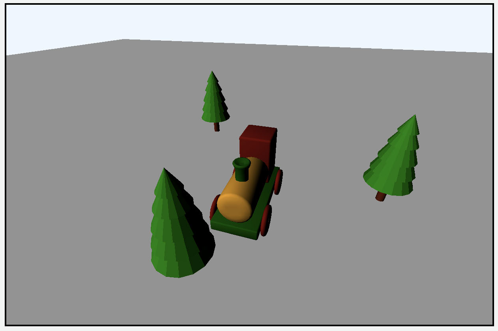

No shadow yet

That looks nice, but where’s the shadow?

➤ Capture the GPU workload and examine the frame capture.

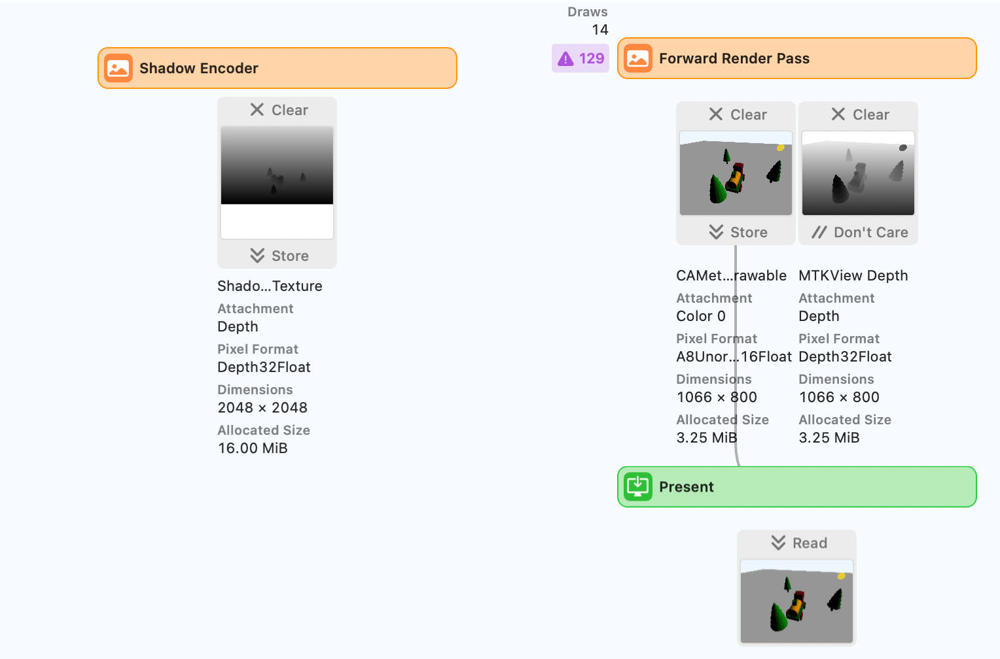

GPU frame capture

You currently aren’t forwarding the results of the shadow encoder pass.

334

Metal by Tutorials
Chapter 13: Shadows

➤ Double-click the shadow encoder pass texture result to show the texture in the 
other resource pane.

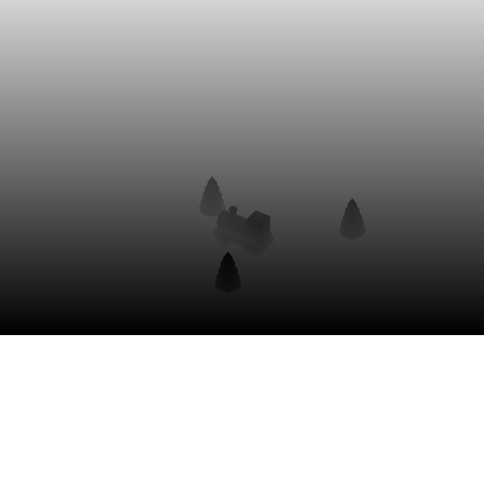

The shadow pass depth texture

This is the scene rendered from the light’s position. You used the shadow pipeline 
state, which you configured not to have a fragment shader, so the color information 
isn’t processed here at all — it’s purely depth. Lighter colors are farther away, and 
darker colors are closer.

The Main Pass

Now that you have the shadow map saved to a texture, you just need to send it to the 
main pass to use the texture in lighting calculations in the fragment function.

➤ Open ForwardRenderPass.swift, and add a new property:

➤ In draw(commandBuffer:scene:uniforms:params:), before the model render 
for loop, add:

You pass in the shadow texture and send it to the GPU.

➤ Open Renderer.swift, and add this code to draw(scene:in:) before drawing the 
forward render pass:

335

Metal by Tutorials
Chapter 13: Shadows

You pass the shadow texture from the previous shadow pass to the forward render 
pass.

➤ In the Shaders group, open ShaderDefs.h, and add a new member to VertexOut:

This holds the vertex position transformed by the shadow matrices.

➤ Open Vertex.metal, and add this line in vertex_main, when creating out:

.shadowPosition = 
  uniforms.shadowProjectionMatrix * uniforms.shadowViewMatrix 
  * uniforms.modelMatrix * in.position

You hold two transformed positions for each vertex. One transformed within the 
scene from the camera’s point of view, and the other from the light’s point of view. 
You’ll be able to compare the shadow position with the fragment from the shadow 
map.

➤ Open Fragment.metal.

This file is where the lighting happens, so the rest of the shadow work will occur in 
fragment_main.

➤ First, add one more function parameter after aoTexture:

Unlike the textures you’ve used in the past, which have a type of texture2d, the 
texture type of a depth texture is depth2d.

➤ At the end of fragment_main, before return, add:

// shadow calculation 
// 1 
float3 shadowPosition 
  = in.shadowPosition.xyz / in.shadowPosition.w; 
// 2 
float2 xy = shadowPosition.xy; 
xy = xy * 0.5 + 0.5; 
xy.y = 1 - xy.y; 
xy = saturate(xy); 
// 3 
constexpr sampler s( 
  coord::normalized, filter::linear, 
  address::clamp_to_edge, 
  compare_func:: less);

336

Metal by Tutorials
Chapter 13: Shadows

float shadow_sample = shadowTexture.sample(s, xy); 
// 4 
if (shadowPosition.z > shadow_sample) { 
  diffuseColor *= 0.5; 
}

Here’s a code breakdown:

1.
in.shadowPosition represents the vertex’s position from the light’s point of 
view. The GPU performed a perspective divide before writing the fragment to the 
shadow texture when you rendered from the light’s point of view. Dividing xyz by 
w here matches the same perspective division so that you can compare the 
current sample’s depth value to the one in the shadow texture.

2. Determine a coordinate pair from the shadow position to serve as a screen space 
pixel locator on the shadow texture. Then, you rescale the coordinates from [-1, 
1] to [0, 1] to match the uv space. Finally, you reverse the Y coordinate since 
it’s upside down.

3. Create a sampler to use with the shadow texture, and sample the texture at the 
coordinates you just created. Get the depth value for the currently processed 
pixel. You create a new sampler, as textureSampler, initialized at the top of the 
function, repeats the texture if it’s sampled off the edge. Try using 
textureSampler later to see repeated extra shadows at the back of the scene.

4. You darken the diffuse color for pixels with a depth greater than the shadow 
value stored in the texture. For example, if shadowPosition.z is 0.5, and 
shadow_sample from the stored depth texture is 0.2, then from the sun’s point 
of view, the current fragment is further away than the stored fragment. Since the 
sun can’t see the fragment, it’s in shadow.

➤ Build and run the app, and you’ll finally see models with shadows.

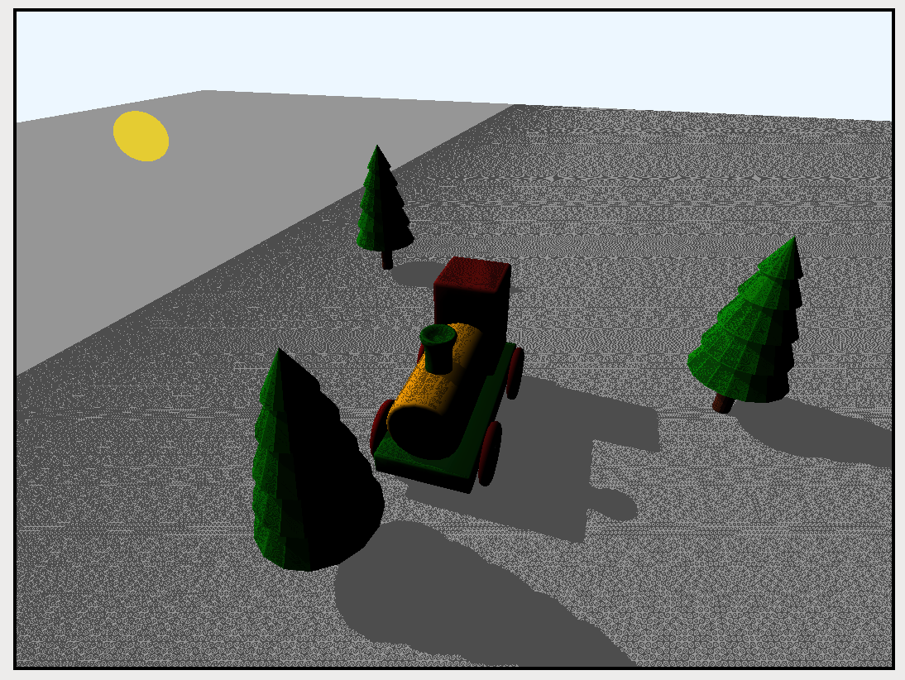

Shadows added

337

Metal by Tutorials
Chapter 13: Shadows

Shadow Acne

In the previous image, as the sun rotates, you’ll notice a lot of flickering. This is 
called shadow acne or surface acne. The surface is self-shadowing because of a lack 
of float precision where the sampled texel doesn’t match the calculated value.

You can mitigate this by adding a bias to the shadow texture, increasing the z value, 
thereby bringing the stored fragment closer.

➤ Change the conditional test at // 4 above to:

➤ Build and run the app.

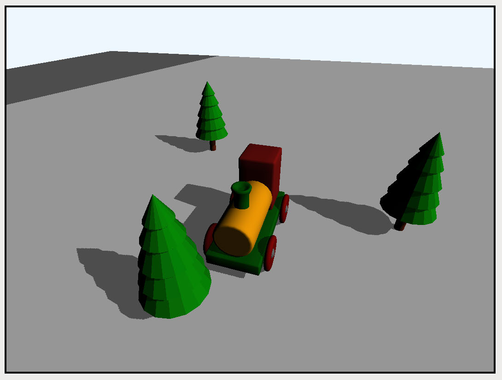

Shadows with no acne

The surface acne is now gone, and you have clear shadows from the sun as it rotates 
around the scene.

Identifying Problems

Take a look at the previous render, and you’ll see a problem. Actually, there are two 
problems. A large dark gray area on the plane appears to be in shadow but shouldn’t 
be.

338

Metal by Tutorials
Chapter 13: Shadows

If you capture the scene, this is the depth texture for that sun position:

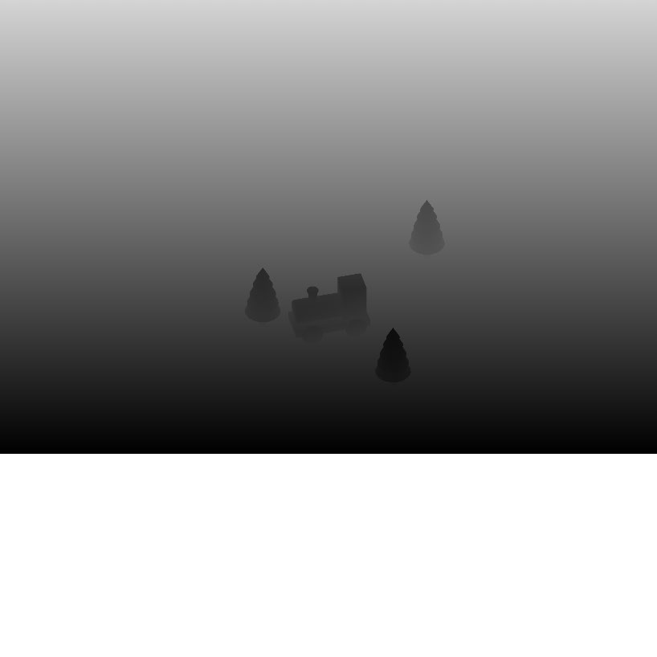

Orthographic camera too large

The bottom quarter of the image is white, meaning that the depth for that position is 
at its farthest. The light’s orthographic camera cuts off that part of the plane and 
causes it to look as if it is in shadow.

The second problem is reading the shadow map.

➤ Open Fragment.metal. In fragment_main, before xy = saturate(xy);, add:

if (xy.x < 0.0 || xy.x > 1.0 || xy.y < 0.0 || xy.y > 1.0) { 
  return float4(1, 0, 0, 1); 
}

The xy texture coordinates should go from 0 to 1 to be on the texture. So if the 
coordinates are off the texture, you return red.

339

Metal by Tutorials
Chapter 13: Shadows

➤ Build and run the app.

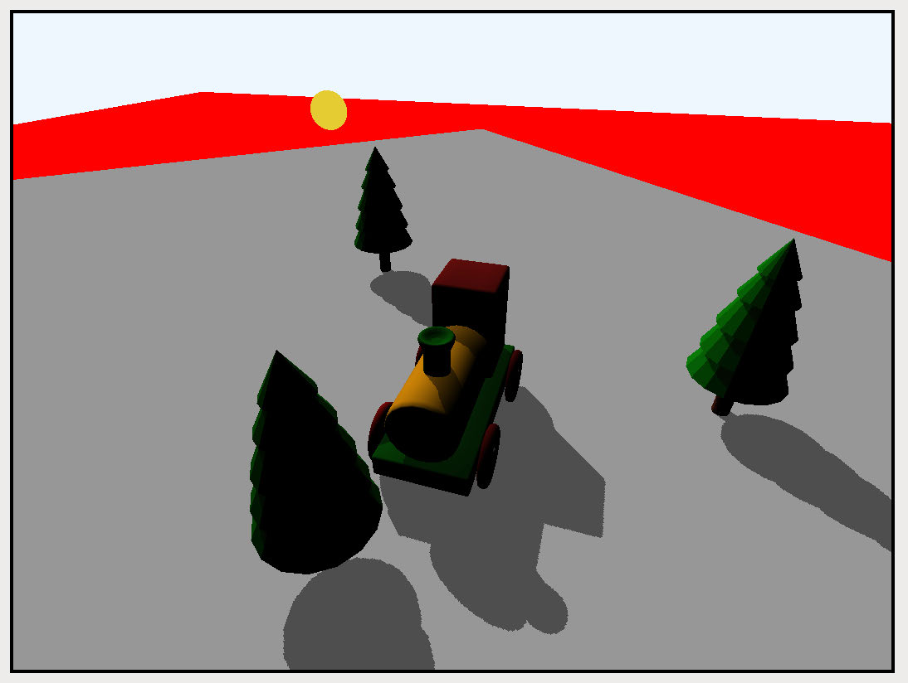

Reading values off the texture

Areas in red are off the depth texture.

You can solve these two problems by setting up the light’s orthographic camera to 
enclose everything the scene camera catches.

Visualizing the Problems

In the Utility group, DebugCameraFrustum.swift will help you visualize this 
problem by rendering wireframes for the various camera frustums. When running 
the app, you can press various keys for debugging purposes:

• 1: The front view of the scene.

• 2: The default view where the sun rotates around the scene.

• 3: Render a wireframe of the scene camera frustum.

• 4: Render a wireframe of the light camera frustum.

• 5: Render a wireframe of the scene camera’s bounding sphere.

This key code is in GameScene’s update(deltaTime:).

340

Metal by Tutorials
Chapter 13: Shadows

➤ Open ForwardRenderPass.swift, and add this to the end of 
draw(commandBuffer:scene:uniforms:params:), before 
renderEncoder.endEncoding():

DebugCameraFrustum.draw( 
  encoder: renderEncoder, 
  scene: scene, 
  uniforms: uniforms)

This code sets up the debug code so that the above keypresses will work.

➤ Open GameScene.swift, and at the top of init(), add:

The default for the camera’s far plane is 100, and it’s difficult to visualize. A far of 5 
is quite close and easy to visualize but will temporarily cut off a lot of the scene.

➤ Build and run the app.

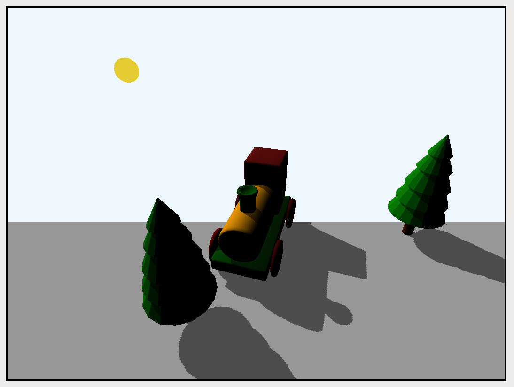

Some of the scene is missing.

You can see that much of the scene is missing due to the closer far plane.

➤ Press the number 3 key on the keyboard above the letters.

Here, you pause the sun’s rotation and create a new perspective arcball camera that 
looks down on the scene from afar and renders the original perspective scene camera 
frustum in blue wireframe.

341

Metal by Tutorials
Chapter 13: Shadows

Using the mouse or trackpad, drag the scene to rotate and examine it. You’ll see that 
the third tree lies outside the blue frustum and therefore isn’t rendered. You’ll also 
see where the shadow texture covers the scene. Red areas lie outside the shadow 
texture.

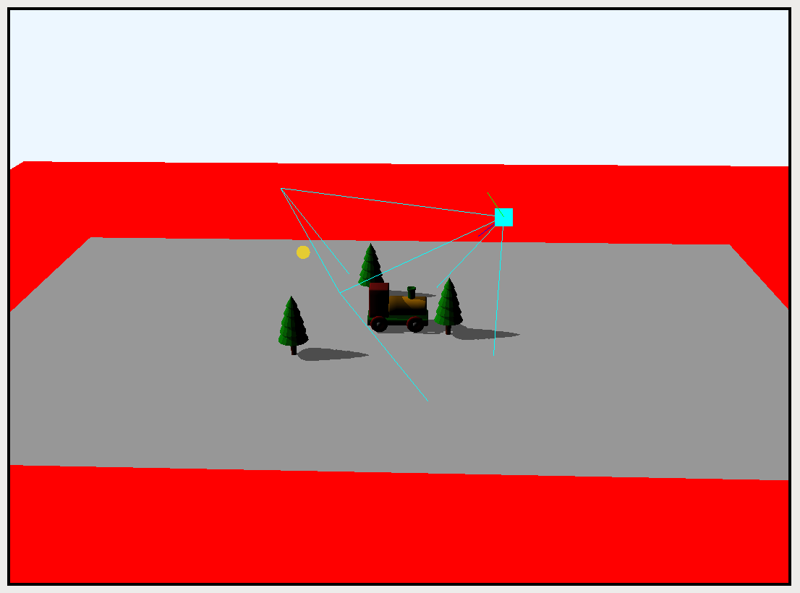

The scene camera frustum

➤ Press the number 4 key.

The orthographic light’s camera view volume wireframe shows in yellow.

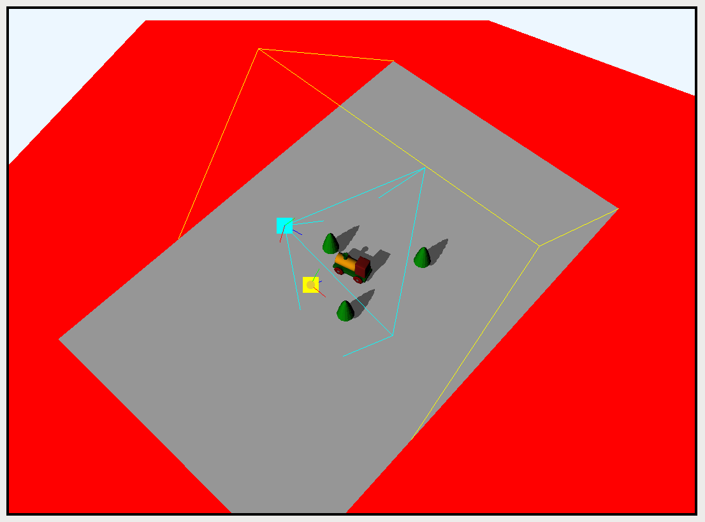

The light view volume

One edge of the light’s view volume is from the corners of the gray plane. That’s 
where the light’s frustum doesn’t reach and shows up on the shadow map texture as 
white.

342

Metal by Tutorials
Chapter 13: Shadows

➤ In GameScene, change camera.far = 5 to:

➤ Build and run the app. When you see a patch of red plane, press the 3 key then the 
4 key.

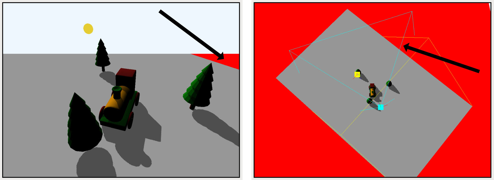

Understanding why the scene captures area off texture

Rotating the scene, you’ll see that the blue wireframe extends into the red area. The 
yellow wireframe should enclose that area but currently doesn’t.

➤ Press the number 5 key.

This shows a white bounding sphere that encloses the scene camera’s frustum.

The scene camera frustum's bounding sphere

The light volume should enclose the white bounding sphere to get the best shadows.

343

Metal by Tutorials
Chapter 13: Shadows

Solving the Problems

➤ In the Game group, open ShadowCamera.swift. This file contains various 
methods to calculate the corners of the camera frustum. 
createShadowCamera(using:lightPosition:) creates an orthographic camera 
that encloses the specified camera.

➤ Open Renderer.swift. In updateUniforms(scene:), replace all of the shadow 
code from shadowCamera.viewSize = 16 to the end of the method with:

let sun = scene.lighting.lights[0] 
shadowCamera = OrthographicCamera.createShadowCamera( 
  using: scene.camera, 
  lightPosition: sun.position) 
uniforms.shadowProjectionMatrix = shadowCamera.projectionMatrix 
uniforms.shadowViewMatrix = float4x4( 
  eye: shadowCamera.position, 
  center: shadowCamera.center, 
  up: [0, 1, 0])

Here, you create an orthographic light camera with a view volume that completely 
envelopes the scene.camera’s frustum.

➤ Build and run the app.

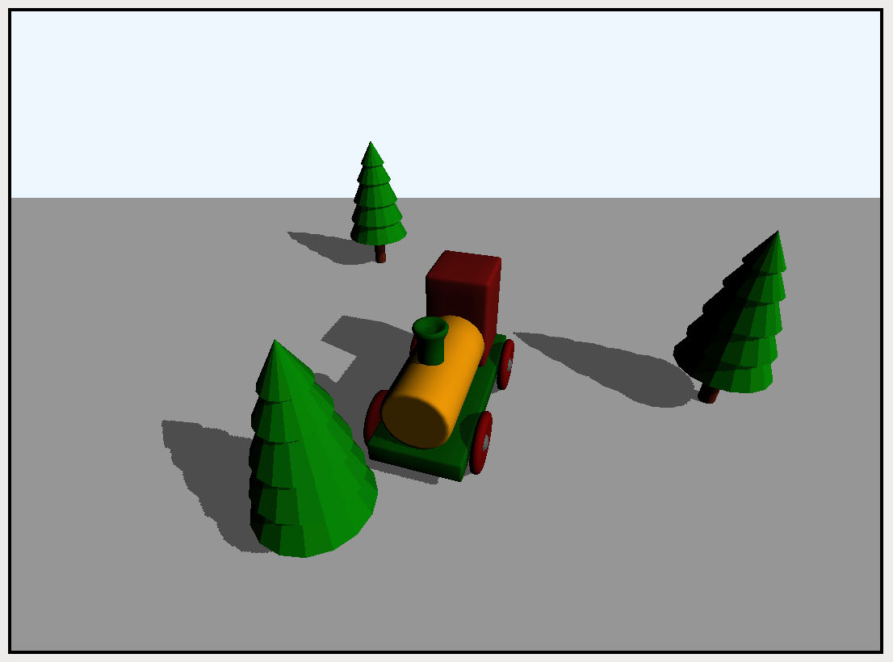

Light view volume encloses scene camera frustum

344

Metal by Tutorials
Chapter 13: Shadows

Now the light camera volume encloses the whole scene so that you won’t see any red 
errors or erroneous gray patches.

➤ Open GameScene.swift. In init(), remove:

You remove the assignment to camera.far, which restores the default camera.far 
to 100.

➤ Build and run the app.

Due to the huge light view volume, the shadows are very blocky. The image below 
shows the rendered shadow texture on the right. You can see almost no details.

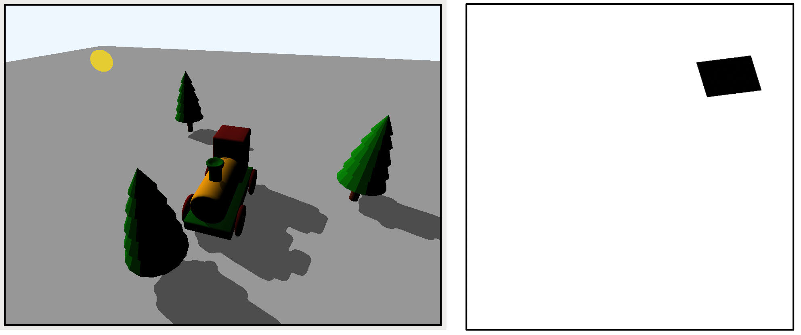

Blocky shadows when the light volume is too large

You can change far back to 5 or 20 and capture the GPU workload to compare 
shadow texture quality.

This is one situation where you, as the game designer, would have to decide on the 
shadow quality. The best outcome would be to use the far value of 5 on shadows 
closer to the camera and a far value of 20 for shadows farther away, as the 
resolution won’t matter so much.

345

Metal by Tutorials
Chapter 13: Shadows

Cascaded Shadow Mapping

Modern games use a technique known as cascaded shadow maps to help balance 
performance and shadow depth. In Chapter 8, “Textures”, you learned about mip 
maps, textures of varying sizes used by the GPU depending on the distance from the 
camera. Cascaded shadow maps employ a similar idea.

With cascaded shadow maps, you render the scene to several shadow maps in a 
depth texture array using different near and far planes. As you’ve seen, the smaller 
far value creates a smaller light volume, which produces a more detailed shadow 
map. You sample the shadow from the shadow map with the smaller light volume for 
the fragments closer to the scene camera.

Farther away, you don’t need as much accuracy, so you can sample the shadow from 
the larger light frustum that takes in more of the scene. The downside is that you 
have to render the scene multiple times, once for each shadow map.

Shadows can take a lot of calculation and processing time. You have to decide how 
much of your frame time allowance to give them. In the resources folder for this 
chapter, references.markdown contains some articles about common techniques to 
improve your shadows.

346

Metal by Tutorials
Chapter 13: Shadows

Key Points

• A shadow map is a render taken from the point of the light casting the shadow.

• You capture a depth map from the perspective of the light in a first render pass.

• A second render pass then compares the depth of the rendered fragment with the 
stored depth map fragment. If the fragment is in shadow, you shade the diffuse 
color accordingly.

• The best shadows are where the light view volume exactly encases the scene 
camera’s frustum. However, you have to know how much of the scene is being 
captured. If the area is large, shadows will be blocky.

• Shadows are expensive. A lot of research has gone into rendering shadows, and 
there are many different methods of improvements and techniques. Cascaded 
shadow mapping is the most common modern technique.

347

14