# Deferred 
Rendering

Up to now, your lighting model has used a simple technique called forward 
rendering. With traditional forward rendering, you draw each model in turn. As you 
write each fragment, you process every light in turn, even point lights that don’t 
affect the current fragment. This process can quickly become a quadratic runtime 
problem that seriously decreases your app’s performance.

Assume you have a hundred models and a hundred lights in the scene. Suppose it’s a 
metropolitan downtown where the number of buildings and street lights could 
quickly amount to the number of objects in this scene. At this point, you’d be looking 
for an alternative rendering technique.

Deferred rendering, also known as deferred shading or deferred lighting, does 
two things:

• In the first pass, it collects information such as material, normals and positions 
from the models and stores them in a special buffer for later processing in the 
fragment shader. Unnecessary calculations don’t occur in this first pass. The 
special buffer is named the G-buffer, where G is for Geometry.

• In the second pass, it processes all lights in a fragment shader, but only where the 
light affects the fragment.

348

Metal by Tutorials
Chapter 14: Deferred Rendering

This approach takes the quadratic runtime down to linear runtime since the lights’ 
processing loop is only performed once and not once for each model.

Look at the forward rendering algorithm:

// single pass 
for each model { 
  for each fragment { 
    for each light { 
      if directional { accumulate lighting } 
      if point { accumulate lighting } 
      if spot { accumulate lighting } 
    } 
  } 
}

You effected this algorithm in Chapter 10, “Lighting Fundamentals”.

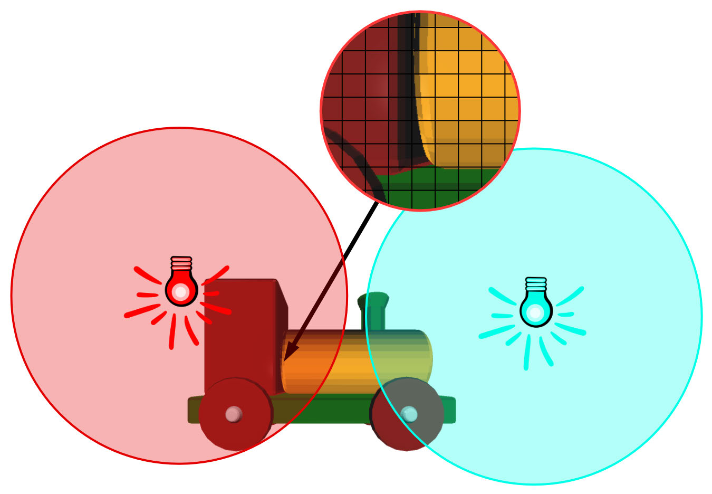

Point lights affecting fragments

In forward rendering, you process both lights for the magnified fragments in the 
image above even though the blue light on the right won’t affect them.

Now, compare it to the deferred rendering algorithm:

// pass 1 - g-buffer capture 
for each model { 
  for each fragment { 
    capture color, position, normal and shadow 
  } 
} 
// pass 2 - light accumulation 
render a quad 
for each fragment { accumulate directional light } 
render geometry for point light volumes 
for each fragment { accumulate point light }

349

Metal by Tutorials
Chapter 14: Deferred Rendering

render geometry for spot light volumes 
for each fragment { accumulate spot light }

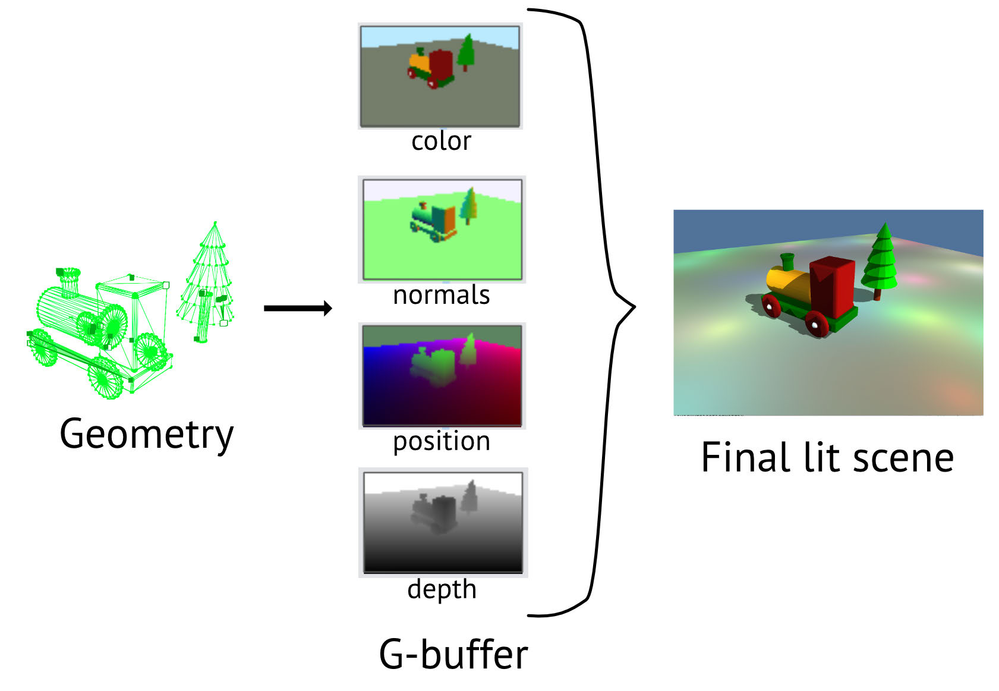

Four textures comprise the G-buffer

While you have more render passes with deferred rendering, you process fewer 
lights. All fragments process the directional light, which shades the albedo along 
with adding the shadow from the directional light. But for the point light, you render 
special geometry that only covers the area the point light affects. The GPU will 
process only the affected fragments.

Here are the steps you’ll take throughout this chapter:

• The first pass renders the shadow map. You’ve already done this.

• The second pass constructs G-buffer textures containing these values: material 
color (or albedo) with shadow information, world space normals and positions.

• Using a full-screen quad, the third and final pass processes the directional light. 
The same pass then renders point light volumes and accumulates point light 
information. If you have spotlights, you would repeat this process.

Note: Apple GPUs can combine the second and third passes. Chapter 15, “Tile-
Based Deferred Rendering”, will revise this chapter’s project to take advantage 
of this feature.

350

Metal by Tutorials
Chapter 14: Deferred Rendering

The Starter Project

➤ In Xcode, open the starter project for this chapter. The project is almost the same 
as the end of the previous chapter, with some refactoring and reorganization. There’s 
new lighting, with extra point lights. The camera and light debugging features from 
the previous chapter are gone.

Take note of the following additions:

• In the Game group, in SceneLighting.swift, 
createPointLights(count:min:max:) creates multiple point lights.

• Since you’ll deal with many lights, the light buffer is greater than 4k. This means 
that you won’t be able to use setFragmentBytes(_:length:index:). Instead, 
scene lighting is now split out into three light buffers: one for sunlight, one for 
point lights and one that contains both sun and point lights, so that forward 
rendering still works as it did before. Spotlighting isn’t implemented here.

• In the Render Passes group, GBufferRenderPass.swift is a copy of 
ForwardRenderPass.swift and is already set up in Renderer. You’ll work on this 
render pass and change it to suit deferred rendering. ForwardRenderPass has a 
debug draw which draws points for the spotlights.

• In the app, a radio button below the metal view gives you the option to switch 
between render pass types. Aside from the debug draw of the point lights in 
Forward, there won’t be any difference in the render at this point.

• The lighting is split up into Diffuse.metal and Specular.metal. In Diffuse.metal, 
computeDiffuse now processes point lights as well as sun lights in the forward 
rendering loop.

• Lighting.metal contains the calculations for sun light, point light and shadows 
that you learned about in earlier chapters. You’ll add new deferred lighting 
functions that use calculateSun and calculatePoint.

• Primitive.swift has an option to create an icosahedron, which you’ll use later in 
the chapter.

351

Metal by Tutorials
Chapter 14: Deferred Rendering

➤ Build and run the app, and ensure that you know how all of the code fits together.

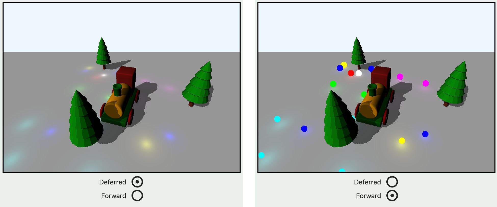

The starter app

The twenty point lights are random, so your render may look slightly different.

The G-buffer Pass

All right, time to build up that G-buffer!

➤ In the Render Passes group, open GBufferRenderPass.swift, and add four new 
texture properties to GBufferRenderPass:

var albedoTexture: MTLTexture? 
var normalTexture: MTLTexture? 
var positionTexture: MTLTexture?   
var depthTexture: MTLTexture?

These are the textures the G-buffer requires.

➤ Add this to resize(view:size:):

albedoTexture = Self.makeTexture( 
  size: size, 
  pixelFormat: .bgra8Unorm, 
  label: "Albedo Texture") 
normalTexture = Self.makeTexture( 
  size: size, 
  pixelFormat: .rgba16Float, 
  label: "Normal Texture") 
positionTexture = Self.makeTexture( 
  size: size, 
  pixelFormat: .rgba16Float, 
  label: "Position Texture") 
depthTexture = Self.makeTexture(

352

Metal by Tutorials
Chapter 14: Deferred Rendering

size: size, 
  pixelFormat: .depth32Float, 
  label: "Depth Texture")

Here, you create the four textures with the desired pixel formats. bgra8Unorm has 
the format of four 8-bit unsigned components, which store integer values between 0 
and 255. However, you’ll need to store the position and normal values in higher 
precision than the color values by using rgba16Float.

➤ In the Shaders group, open Common.h, and add a new enumeration for the extra 
texture indices:

typedef enum { 
  RenderTargetAlbedo = 1, 
  RenderTargetNormal = 2, 
  RenderTargetPosition = 3 
} RenderTargetIndices;

These are the names for the render target texture indices.

In the Geometry group, open VertexDescriptor.swift, and add the syntactic sugar 
extension:

extension RenderTargetIndices { 
  var index: Int { 
    return Int(rawValue) 
  } 
}

Using values from RenderTargetIndices will now be easier to read.

➤ Open Pipelines.swift.

You’ll create all the pipeline states here. You can compare what each pipeline state 
requires as you progress through the chapter.

Currently, createGBufferPSO(colorPixelFormat:) and 
createForwardPSO(colorPixelFormat:) are the same, but you’ll need to change 
the G-buffer pipeline state object to specify the different texture formats.

➤ At the end of the file, create a new extension:

extension MTLRenderPipelineDescriptor { 
  func setGBufferPixelFormats() { 
    colorAttachments[RenderTargetAlbedo.index] 
      .pixelFormat = .bgra8Unorm 
    colorAttachments[RenderTargetNormal.index] 
      .pixelFormat = .rgba16Float

353

Metal by Tutorials
Chapter 14: Deferred Rendering

colorAttachments[RenderTargetPosition.index] 
      .pixelFormat = .rgba16Float 
  } 
}

These color attachment pixel formats are the same as the ones you used for the 
albedo, normal and position textures.

➤ In createGBufferPSO(colorPixelFormat:), replace:

pipelineDescriptor.colorAttachments[0].pixelFormat = 
colorPixelFormat

➤ With:

pipelineDescriptor.colorAttachments[0].pixelFormat = .invalid 
pipelineDescriptor.setGBufferPixelFormats()

This sets the three color attachment pixel formats. Notice that you’re not using 
colorAttachments[0] any more, as RenderTargetIndices starts at 1. You could 
use 0 for the albedo since you’re not using the drawable in this pass, but you’ll 
combine passes in the next chapter, so you leave color attachment 0 available for 
this event.

For the vertex function, you can reuse vertex_main from the main render pass, as all 
this does is transform the positions and normals. However, you’ll need a new 
fragment function that stores the position and normal data into textures and doesn’t 
process the lighting.

➤ Still in createGBufferPSO(colorPixelFormat:), replace "fragment_main" 
with:

That completes the pipeline state object setup. Next, you’ll deal with the render pass 
descriptor.

➤ Open GBufferRenderPass.swift, and add this code to the bottom of 
init(view:):

Here, you create a new render pass descriptor instead of using the view’s 
automatically-generated render pass descriptor.

354

Metal by Tutorials
Chapter 14: Deferred Rendering

➤ At the top of draw(commandBuffer:scene:uniforms:params:), add:

let textures = [ 
  albedoTexture, 
  normalTexture, 
  positionTexture 
] 
for (index, texture) in textures.enumerated() { 
  let attachment = 
    descriptor?.colorAttachments[RenderTargetAlbedo.index + 
index] 
  attachment?.texture = texture 
  attachment?.loadAction = .clear 
  attachment?.storeAction = .store 
  attachment?.clearColor = 
    MTLClearColor(red: 0.73, green: 0.92, blue: 1, alpha: 1) 
} 
descriptor?.depthAttachment.texture = depthTexture 
descriptor?.depthAttachment.storeAction = .dontCare

You iterate through each of the three textures that you’ll write in the fragment 
function and add them to the render pass descriptor’s color attachments. If the load 
action is clear when you add the color attachment, you can set the clear color. The 
scene depicts a sunny day with sharp shadows, so you set the color to sky blue. store 
ensures that the color textures don’t clear before the next render pass. However, you 
won’t need the depth attachment after this render pass, so you set this store action 
to dontCare.

➤ Still in draw(commandBuffer:scene:uniforms:params:), remove:

renderEncoder.setFragmentBuffer( 
  scene.lighting.lightsBuffer, 
  offset: 0, 
  index: LightBuffer.index)

In the initial pass, you only store the albedo, or base color, and mark fragments as 
shadowed or not. You don’t need the light buffer because you previously processed 
the shadow matrices in the shadow render pass.

Currently, you send the view’s render pass descriptor to GBufferRenderPass. 
However, you must change this since you created a new one.

355

Metal by Tutorials
Chapter 14: Deferred Rendering

➤ Open Renderer.swift. In draw(scene:in:), remove:

Before you test all of this code, you must create the new fragment shader.

➤ In the Shaders group, create a new Metal File named Deferred.metal. Add this 
code to the new file:

#import "Lighting.h" 
#import "ShaderDefs.h" 
 
fragment float4 fragment_gBuffer( 
  VertexOut in [[stage_in]], 
  depth2d<float> shadowTexture [[texture(ShadowTexture)]], 
  constant Material &material [[buffer(MaterialBuffer)]]) 
{ 
  return float4(material.baseColor, 1); 
}

Here, you take in the results of the vertex function, the shadow texture from the 
shadow render pass, and the object’s material. You return the base color of the 
material so that you’ll be able to see something in the render.

➤ Build and run the app.

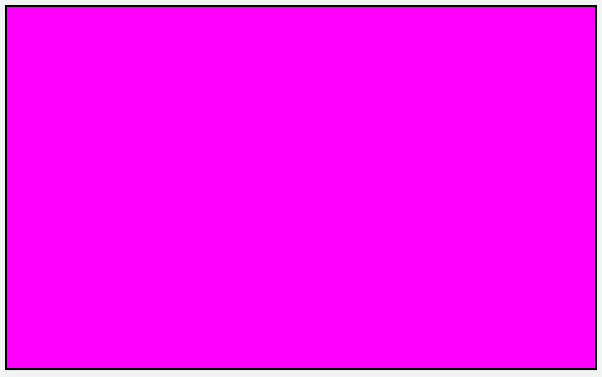

The current drawable contains randomness

Currently, you aren’t writing anything to the view’s drawable, only to the G-buffer 
render pass descriptor textures. So you’ll get something random on your app 
window. Mine comes out a lovely shade of magenta.

➤ Capture the GPU workload, and click the Command Buffer to see what’s 
happening there.

356

Metal by Tutorials
Chapter 14: Deferred Rendering

You may get an error because you aren’t writing anything to the drawable texture, 
but ignore that for the moment.

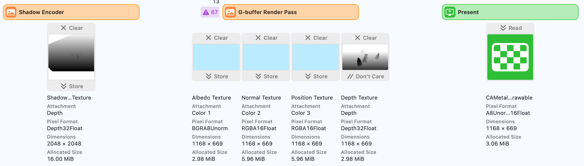

Frame capture with G-buffer textures

From this result, you can see that you successfully stored the shadow texture from 
the shadow pass as well as the three color and depth textures from your G-buffer 
pass, cleared to your sky blue color.

➤ Open Deferred.metal, and add a new structure before fragment_gBuffer:

struct GBufferOut { 
  float4 albedo [[color(RenderTargetAlbedo)]]; 
  float4 normal [[color(RenderTargetNormal)]]; 
  float4 position [[color(RenderTargetPosition)]]; 
};

These correspond to the pipeline states and render pass descriptor color attachment 
textures.

➤ Replace fragment_gBuffer() with:

// 1 
fragment GBufferOut fragment_gBuffer( 
  VertexOut in [[stage_in]], 
  depth2d<float> shadowTexture [[texture(ShadowTexture)]], 
  constant Material &material [[buffer(MaterialBuffer)]]) 
{ 
  GBufferOut out; 
  // 2 
  out.albedo = float4(material.baseColor, 1.0); 
  // 3 
  out.albedo.a = calculateShadow(in.shadowPosition, 
shadowTexture); 
  // 4 
  out.normal = float4(normalize(in.worldNormal), 1.0); 
  out.position = float4(in.worldPosition, 1.0); 
  return out; 
}

357

Metal by Tutorials
Chapter 14: Deferred Rendering

Here, you

1. Return GBufferOut from the fragment function instead of only a single color 
value.

2. Set the albedo texture to the material’s base color.

3. Calculate whether the fragment is in shadow, using the shadow position and the 
shadow texture. The shadow value is a single float. Since you don’t use the alpha 
channel of the albedo texture, you can store the shadow value there.

4. Write the normal and position values into the corresponding texture.

➤ Build and run the app, and capture the GPU workload.

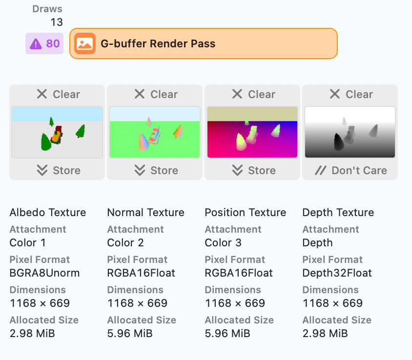

G-buffer textures containing data

fragment_gBuffer now writes to your three color textures.

358

Metal by Tutorials
Chapter 14: Deferred Rendering

The Lighting Pass

Up to this point, you rendered the scene to multiple render targets, saving them for 
later use in the fragment shader. By rendering a full-screen quad, you can cover 
every pixel on the screen. This lets you process each fragment from your three 
textures and calculate lighting for each fragment. The results of this composition 
pass will end up in the view’s drawable.

➤ Create a new Swift file named LightingRenderPass in the Render Passes group. 
Replace the contents with:

import MetalKit

struct LightingRenderPass: RenderPass { 
  let label = "Lighting Render Pass" 
  var descriptor: MTLRenderPassDescriptor? 
  var sunLightPSO: MTLRenderPipelineState 
  let depthStencilState: MTLDepthStencilState? 
  weak var albedoTexture: MTLTexture? 
  weak var normalTexture: MTLTexture? 
  weak var positionTexture: MTLTexture? 
 
  func resize(view: MTKView, size: CGSize) {} 
 
  func draw( 
    commandBuffer: MTLCommandBuffer, 
    scene: GameScene, 
    uniforms: Uniforms, 
    params: Params 
  ) { 
  } 
}

With this code, you add the necessary conformance to RenderPass and the texture 
properties you need for this consolidation pass.

You’ll accumulate output from all light types when running the lighting pass. Each 
type of light needs a different fragment function, so you’ll need multiple pipeline 
states. First, you’ll create a pipeline state object for rendering the sun’s directional 
light and return later and add a point light pipeline state object.

➤ Open Pipelines.swift, and copy createForwardPSO(colorPixelFormat:) to a 
new method named createSunLightPSO(colorPixelFormat:).

Instead of rendering models, you’ll render a quad for the lighting pass. You can 
define the vertices on the GPU and create a simple vertex function.

359

Metal by Tutorials
Chapter 14: Deferred Rendering

➤ In createSunLightPSO(colorPixelFormat:), replace "vertex_main" with:

This vertex function is responsible for positioning the quad vertices.

➤ Replace "fragment_main" with:

➤ Remove:

pipelineDescriptor.vertexDescriptor = 
  MTLVertexDescriptor.defaultLayout

For this quad, you don’t need the vertex descriptor. If you don’t remove it, the GPU 
expects many buffers at the various bindings as described by the default vertex 
descriptor in VertexDescriptor.swift.

➤ Open LightingRenderPass.swift, and add the initializer to 
LightingRenderPass:

init(view: MTKView) { 
  sunLightPSO = PipelineStates.createSunLightPSO( 
    colorPixelFormat: view.colorPixelFormat) 
  depthStencilState = Self.buildDepthStencilState() 
}

Here, you initialize the pipeline state object with your new pipeline state 
parameters.

➤ In draw(commandBuffer:scene:uniforms:params:), add:

guard let descriptor = descriptor, 
  let renderEncoder = 
    commandBuffer.makeRenderCommandEncoder( 
    descriptor: descriptor) else { 
      return 
} 
renderEncoder.label = label 
renderEncoder.setDepthStencilState(depthStencilState) 
var uniforms = uniforms 
renderEncoder.setVertexBytes( 
  &uniforms, 
  length: MemoryLayout<Uniforms>.stride, 
  index: UniformsBuffer.index)

360

Metal by Tutorials
Chapter 14: Deferred Rendering

Since you’ll draw the quad directly to the screen, you’ll use the view’s current render 
pass descriptor. You set up the render command encoder as usual with the depth 
stencil state and vertex uniforms.

➤ After the previous code, add:

renderEncoder.setFragmentTexture( 
  albedoTexture, 
  index: BaseColor.index) 
renderEncoder.setFragmentTexture( 
  normalTexture, 
  index: NormalTexture.index) 
renderEncoder.setFragmentTexture( 
  positionTexture, index: 
  NormalTexture.index + 1)

This code passes the three attachments from the G-buffer render pass. Note the 
laziness of adding one to the index for the position. This is a mistake waiting to 
happen, and you should name the index at a later time.

➤ Create a new method for processing the sun light:

func drawSunLight( 
  renderEncoder: MTLRenderCommandEncoder, 
  scene: GameScene, 
  params: Params 
) { 
  renderEncoder.pushDebugGroup("Sun Light") 
  renderEncoder.setRenderPipelineState(sunLightPSO) 
  var params = params 
  params.lightCount = UInt32(scene.lighting.sunLights.count) 
  renderEncoder.setFragmentBytes( 
    &params, 
    length: MemoryLayout<Params>.stride, 
    index: ParamsBuffer.index) 
  renderEncoder.setFragmentBuffer( 
    scene.lighting.sunBuffer, 
    offset: 0, 
    index: LightBuffer.index) 
  renderEncoder.drawPrimitives( 
    type: .triangle, 
    vertexStart: 0, 
    vertexCount: 6) 
  renderEncoder.popDebugGroup() 
}

Here, you send the sun light details to the fragment function and draw the six 
vertices of a quad.

361

Metal by Tutorials
Chapter 14: Deferred Rendering

➤ Call this new method at the end of 
draw(commandBuffer:scene:uniforms:params:):

drawSunLight( 
  renderEncoder: renderEncoder, 
  scene: scene, 
  params: params) 
renderEncoder.endEncoding()

You call the method and end the render pass encoding.

Updating Renderer

You’ll now add the new lighting pass to Renderer and pass in the necessary textures 
and render pass descriptor.

➤ Open Renderer.swift, and add a new property to Renderer:

➤ Add this line before super.init():

You initialized the lighting render pass.

➤ Add this line to mtkView(_:drawableSizeWillChange:):

You currently don’t resize any textures in LightingRenderPass. However, it’s a good 
idea to call the resize method in case you add anything later.

➤ In draw(scene:in:), locate if options.renderChoice == .deferred.

➤ At the end of the conditional closure, add:

lightingRenderPass.albedoTexture = 
gBufferRenderPass.albedoTexture 
lightingRenderPass.normalTexture = 
gBufferRenderPass.normalTexture 
lightingRenderPass.positionTexture = 
gBufferRenderPass.positionTexture 
lightingRenderPass.descriptor = descriptor 
lightingRenderPass.draw( 
  commandBuffer: commandBuffer,

362

Metal by Tutorials
Chapter 14: Deferred Rendering

scene: scene, 
  uniforms: uniforms, 
  params: params)

Here, you pass the textures to the lighting pass and set the render pass descriptor. 
You then process the lighting render pass. You’ve set up everything on the CPU side. 
Now it’s time to turn to the GPU.

The Lighting Shader Functions

First, you’ll create a vertex function that will position a quad. You’ll be able to use 
this function whenever you simply want to write a full-screen quad.

➤ Open Deferred.metal, and add an array of six vertices for the quad:

constant float3 vertices[6] = { 
  float3(-1,  1,  0),    // triangle 1 
  float3( 1, -1,  0), 
  float3(-1, -1,  0), 
  float3(-1,  1,  0),    // triangle 2 
  float3( 1,  1,  0), 
  float3( 1, -1,  0) 
};

➤ Add the new vertex function:

vertex VertexOut vertex_quad(uint vertexID [[vertex_id]]) 
{ 
  VertexOut out { 
    .position = float4(vertices[vertexID], 1) 
  }; 
  return out; 
}

For each of the six vertices, you return the position in the vertices array.

➤ Add the new fragment function:

fragment float4 fragment_deferredSun( 
  VertexOut in [[stage_in]], 
  constant Params &params [[buffer(ParamsBuffer)]], 
  constant Light *lights [[buffer(LightBuffer)]], 
  texture2d<float> albedoTexture [[texture(BaseColor)]], 
  texture2d<float> normalTexture [[texture(NormalTexture)]]) 
{ 
  return float4(1, 0, 0, 1); 
}

363

Metal by Tutorials
Chapter 14: Deferred Rendering

These are standard parameters for a fragment function. For now, you return the color 
red.

➤ Build and run the app, and you’ll see a red screen, which is an excellent result as 
this is the color you currently return from fragment_deferredSun.

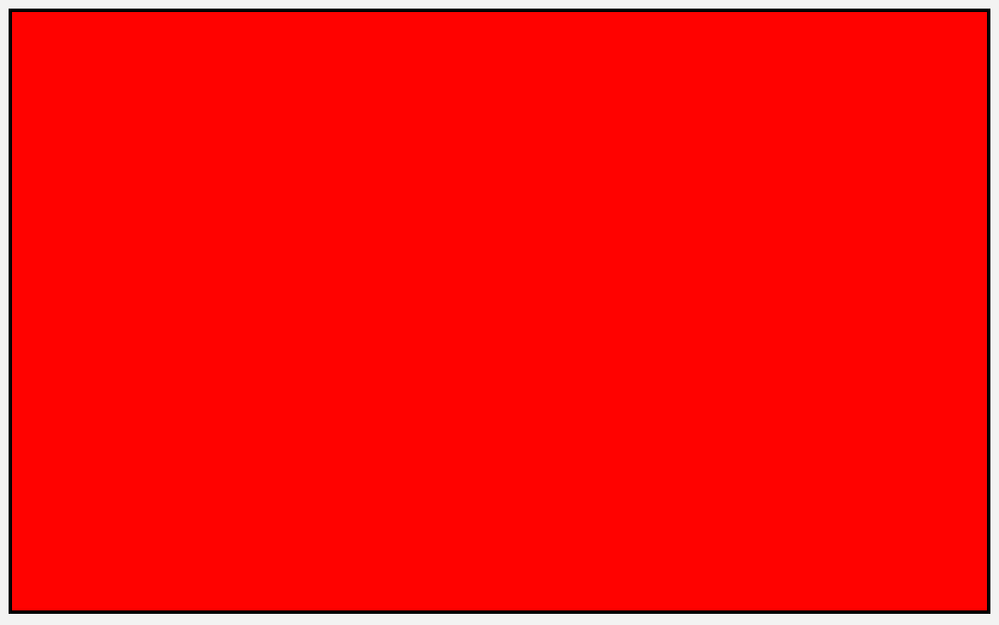

Returning red from the fragment function

You can now work out the lighting and make your render a little more exciting.

➤ Replace the contents of fragment_deferredSun with:

uint2 coord = uint2(in.position.xy); 
float4 albedo = albedoTexture.read(coord); 
float3 normal = normalTexture.read(coord).xyz; 
Material material { 
  .baseColor = albedo.xyz, 
  .ambientOcclusion = 1.0 
}; 
 
float3 color = 0; 
for (uint i = 0; i < params.lightCount; i++) { 
  Light light = lights[i]; 
  color += calculateSun(light, normal, params, material); 
} 
color *= albedo.a; 
return float4(color, 1);

Since the quad is the same size as the screen, in.position matches the screen 
position, so you can use it as coordinates for reading the textures. You only receive 
the sun lights from GBufferRenderPass, so you calculate the sun light contribution 
to the diffuse color with the values you read from the textures. For simplicity, you’re 
only computing the diffuse value using the albedo texture. Any other material 
values, such as roughness and ambient occlusion, should be captured in the previous 
G-buffer pass.

364

Metal by Tutorials
Chapter 14: Deferred Rendering

You stored the shadow in the albedo alpha channel in the G-buffer pass. After 
calculating the lighting for the sun lights, you simply multiply by the alpha channel 
to get the shadow.

➤ Build and run the app.

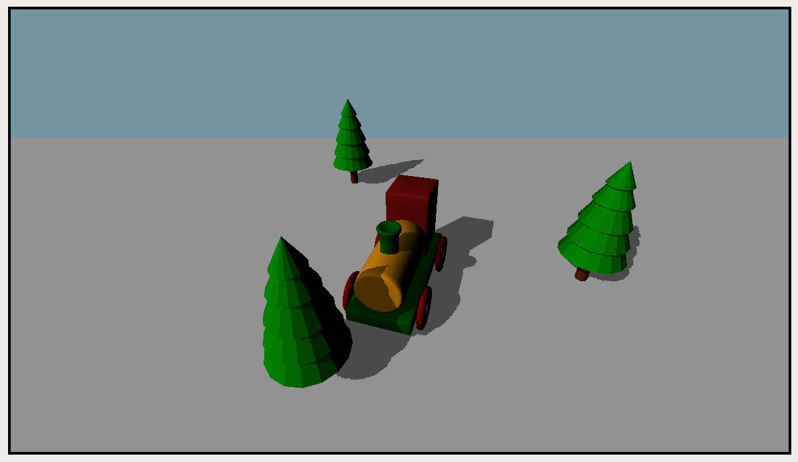

Accumulating the directional light and shadows

The result should be the same as the forward render pass, except for the point lights. 
However, you’ll notice that the sky is a different color. The color changed because 
you calculate the sunlight for every fragment on the screen, even where there’s no 
original model geometry. In the next chapter, you’ll deal with this problem by using 
stencil masks.

This seems a lot of work for not much gain so far. But now comes the payoff!

Instead of rendering just 20 point lights, you’ll render as many as your device can 
take: in the order of thousands more than the forward renderer.

Adding Point Lights

So far, you’ve drawn the plain albedo and shaded it with directional light. You need a 
second fragment function for calculating point lights.

In the original forward pass algorithm, you iterated through all the point lights for 
every fragment and performed the point light accumulation. Now you’ll render a 
light volume in the shape of a sphere for every point light. Only the fragments you 
render for that light volume will require the point light accumulation.

365

Metal by Tutorials
Chapter 14: Deferred Rendering

The problem comes when one light volume is in front of another. The fragment 
function result will overwrite any previous result. You’ll overcome this problem by 
accumulating the result into the final drawable by blending rather than overwriting 
the fragment.

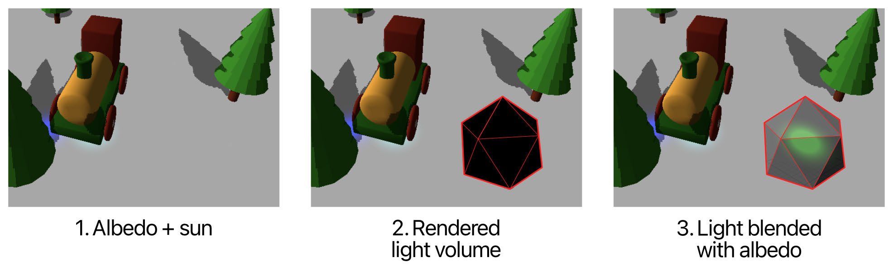

Blending the light volume

In Primitive.swift, in the Geometry group, there’s an option to generate mesh for 
an icosahedron. You’ll render one of these for each point light.

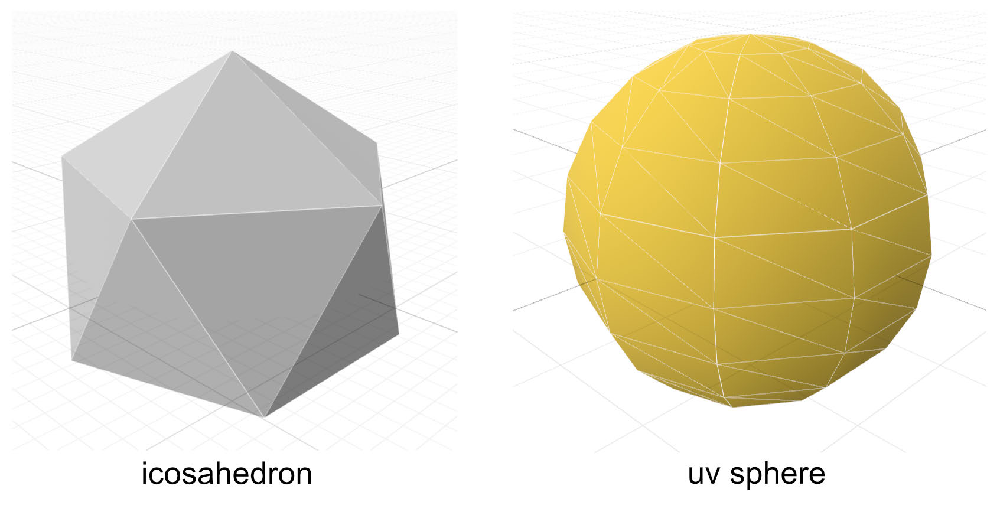

Icosahedron and UV sphere

The icosahedron is a low-resolution sphere with twenty-five vertices. Compare it to 
a UV sphere. The icosahedron’s faces are more regular and all have a similar area, 
whereas the UV sphere’s faces are smaller at the two top and bottom poles.

This app assumes that all point lights have the same radius attenuation, which fits 
inside the icosahedron. If a point light has a larger radius, the icosahedron’s straight 
edges could cut it off. You could also add more vertices to an icosahedron, making it 
rounder, but that would make the rendering less efficient.

366

Metal by Tutorials
Chapter 14: Deferred Rendering

➤ Open LightingRenderPass.swift, and add a new property to 
LightingRenderPass:

var icosahedron = Model( 
  name: "icosahedron",  
  primitiveType: .icosahedron)

You initialize the icosahedron for later use.

Now you need a new pipeline state object with new shader functions to render the 
icosahedron with its point lighting.

➤ Open Pipelines.swift, and copy createForwardPSO(colorPixelFormat:) to a 
new method called createPointLightPSO(colorPixelFormat:).

➤ Change the vertex function’s name to "vertex_pointLight" and the fragment 
function’s name to "fragment_pointLight".

Later, you’ll need to add blending to the light accumulation. The pipeline state is 
how you tell the GPU that you require blending, so shortly, you’ll add this to the 
pipeline state object.

➤ Open LightingRenderPass.swift, and add a new property for the pipeline state 
object:

➤ Initialize the pipeline state in init(view:):

pointLightPSO = PipelineStates.createPointLightPSO( 
  colorPixelFormat: view.colorPixelFormat)

➤ Create a new method to draw the point light volumes:

func drawPointLight( 
  renderEncoder: MTLRenderCommandEncoder, 
  scene: GameScene, 
  params: Params 
) { 
  renderEncoder.pushDebugGroup("Point lights") 
  renderEncoder.setRenderPipelineState(pointLightPSO) 
 
  renderEncoder.setVertexBuffer( 
    scene.lighting.pointBuffer, 
    offset: 0, 
    index: LightBuffer.index) 
  renderEncoder.setFragmentBuffer( 
    scene.lighting.pointBuffer,

367

Metal by Tutorials
Chapter 14: Deferred Rendering

offset: 0, 
    index: LightBuffer.index) 
 
  var params = params 
  params.lightCount = UInt32(scene.lighting.pointLights.count) 
  renderEncoder.setFragmentBytes( 
    &params, 
    length: MemoryLayout<Params>.stride, 
    index: ParamsBuffer.index) 
}

You send the point lights to both vertex and fragment shaders. The vertex function 
needs the light position to position each icosahedron, while the fragment function 
needs the light attenuation and color.

➤ Add this code to the end of drawPointLight(renderEncoder:scene:params:):

guard let mesh = icosahedron.meshes.first, 
  let submesh = mesh.submeshes.first else { return } 
for (index, vertexBuffer) in mesh.vertexBuffers.enumerated() { 
  renderEncoder.setVertexBuffer( 
    vertexBuffer, 
    offset: 0, 
    index: index) 
}

You set up the vertex buffers with the icosahedron’s mesh attributes.

Instancing

If you had one thousand point lights, a draw call to render the geometry for each 
light volume would bring your system to a crawl. Instancing is a great way to tell the 
GPU to draw the same geometry a specific number of times. The GPU informs the 
vertex function which instance it’s currently drawing so that you can extract 
information from arrays containing instance information.

In SceneLighting, you have an array of point lights with the position and color. 
Each of these point lights is an instance. You’ll draw the icosahedron mesh for each 
point light.

➤ After the previous code, add the draw call:

renderEncoder.drawIndexedPrimitives( 
  type: .triangle, 
  indexCount: submesh.indexCount, 
  indexType: submesh.indexType, 
  indexBuffer: submesh.indexBuffer,

368

Metal by Tutorials
Chapter 14: Deferred Rendering

indexBufferOffset: submesh.indexBufferOffset, 
  instanceCount: scene.lighting.pointLights.count) 
renderEncoder.popDebugGroup()

Adding instanceCount to the draw call means that the GPU will repeat drawing the 
icosahedron’s vertex and submesh information for the specified number of 
instances. GPU hardware is optimized to do this.

➤ Call this new method from draw(commandBuffer:scene:uniforms:params:) 
before renderEncoder.endEncoding():

drawPointLight( 
  renderEncoder: renderEncoder, 
  scene: scene, 
  params: params)

Creating the Point Light Shader Functions

➤ Open Deferred.metal, and add the new structures that the vertex function will 
need:

struct PointLightIn { 
  float4 position [[attribute(Position)]]; 
};

struct PointLightOut { 
  float4 position [[position]]; 
  uint instanceId [[flat]]; 
};

You’re only interested in the position, so you only use the vertex descriptor’s 
position attribute.

You send the position to the rasterizer, but you also send the instance ID so that the 
fragment function can extract the light details from the point lights array. You don’t 
want any rasterizer interpolation, so you mark the instance ID with the attribute 
[[flat]].

➤ Add the new vertex function:

vertex PointLightOut vertex_pointLight( 
  PointLightIn in [[stage_in]], 
  constant Uniforms &uniforms [[buffer(UniformsBuffer)]], 
  constant Light *lights [[buffer(LightBuffer)]], 
  // 1 
  uint instanceId [[instance_id]]) 
{

369

Metal by Tutorials
Chapter 14: Deferred Rendering

// 2 
  float4 lightPosition = float4(lights[instanceId].position, 0); 
  float4 position = 
    uniforms.projectionMatrix * uniforms.viewMatrix 
  // 3 
    * (in.position + lightPosition); 
  PointLightOut out { 
    .position = position, 
    .instanceId = instanceId 
  }; 
  return out; 
}

The points of interest are:

1. Use the attribute [[instance_id]] to detect the current instance.

2. Use the instance ID to index into the lights array.

3. Add the light’s position to the vertex position. Since you’re not dealing with 
scaling or rotation, you don’t need to multiply by a model matrix.

➤ Add the new fragment function:

fragment float4 fragment_pointLight( 
  PointLightOut in [[stage_in]], 
  constant Params &params [[buffer(ParamsBuffer)]], 
  texture2d<float> normalTexture [[texture(NormalTexture)]], 
  texture2d<float> positionTexture 
    [[texture(NormalTexture + 1)]], 
  constant Light *lights [[buffer(LightBuffer)]]) 
{ 
// 1 
  uint2 coords = uint2(in.position.xy); 
  float3 normal = normalTexture.read(coords).xyz; 
  float3 worldPosition = positionTexture.read(coords).xyz; 
// 2 
  Material material { 
    .baseColor = 1 
  }; 
// 3 
  Light light = lights[in.instanceId]; 
  float3 color = calculatePoint( 
    light,  
    worldPosition,  
    normal,  
    material); 
// 4 
  color *= 0.5; 
  return float4(color, 1); 
}

370

Metal by Tutorials
Chapter 14: Deferred Rendering

Going through the code:

1. Just as you did for the sun light, you read in the textures from the previous render 
pass.

2. The base color for the icosahedron is 1. Rather than taking the color from the 
albedo, this time, you’ll achieve the glowing point light with GPU blending.

3. You extract the light from the lights array using the instance ID sent by the 
vertex function.  and calculate the point lighting. In this case, you don’t iterate 
through all the point lights, as you accumulate the lighting for each point light 
when you render each icosahedron.

4. You reduce the intensity by 0.5, as blending will make the lights brighter.

➤ Build and run the app. Your render is as before. No glowing point lights here.

Capture the GPU workload and check out the attachments in the Point lights render 
encoder section:

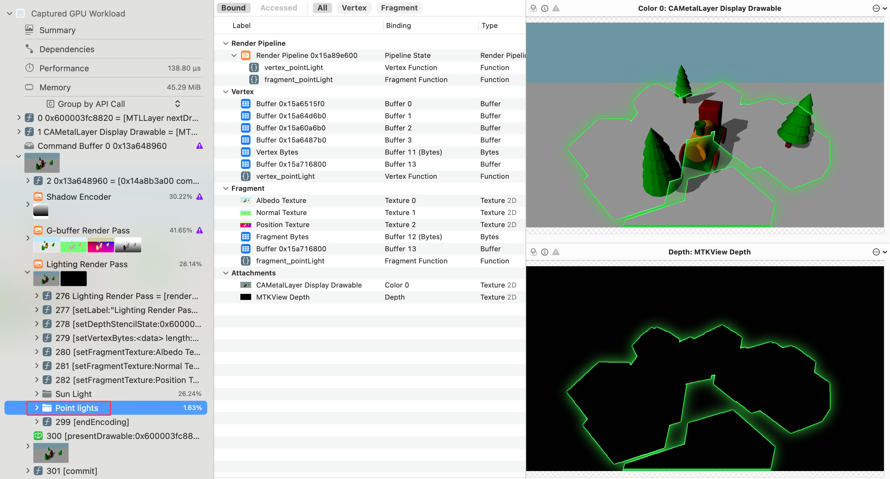

Point light volume drawing

The icosahedrons are drawing, but if you check the depth attachment with the 
magnifier, you’ll see all the values are zero. There’s a problem with the depth: the 
icosahedrons are not rendering in front of the quad.

371

Metal by Tutorials
Chapter 14: Deferred Rendering

➤ Open LightingRenderPass.swift, and add a new method:

static func buildDepthStencilState() -> MTLDepthStencilState? { 
  let descriptor = MTLDepthStencilDescriptor() 
  descriptor.isDepthWriteEnabled = false 
  return Renderer.device.makeDepthStencilState(descriptor: 
descriptor) 
}

This code overrides the default RenderPass protocol method. You disable depth 
writes because you always want the icosahedrons to render.

➤ Build and run the app.

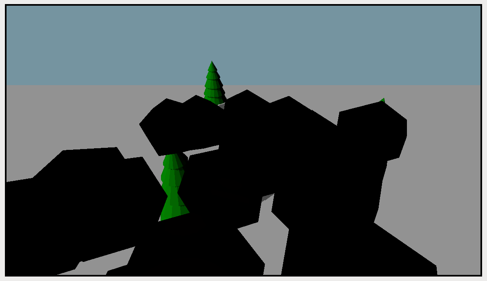

Rendering icosahedrons

Your icosahedron volumes now render in front of the quad.

Blending

➤ Open Pipelines.swift. In createPointLightPSO(colorPixelFormat:), add this 
code before return:

let attachment = pipelineDescriptor.colorAttachments[0] 
attachment?.isBlendingEnabled = true 
attachment?.rgbBlendOperation = .add 
attachment?.alphaBlendOperation = .add 
attachment?.sourceRGBBlendFactor = .one 
attachment?.sourceAlphaBlendFactor = .one 
attachment?.destinationRGBBlendFactor = .one 
attachment?.destinationAlphaBlendFactor = .zero 
attachment?.sourceRGBBlendFactor = .one 
attachment?.sourceAlphaBlendFactor = .one

372

Metal by Tutorials
Chapter 14: Deferred Rendering

Here, you enabled blending. You shouldn’t have this on by default because blending 
is an expensive operation. The other properties determine how to combine the 
source and destination fragments.

All these blending properties are at their defaults, except for 
destinationRGBBlendFactor. They’re written out here in full to show what you can 
change. The important change is destinationRGBBlendFactor from zero to one, so 
blending will occur.

The icosahedrons will blend with the color already drawn in the background quad. 
Black will disappear, leaving only the light color.

➤ Build and run the app.

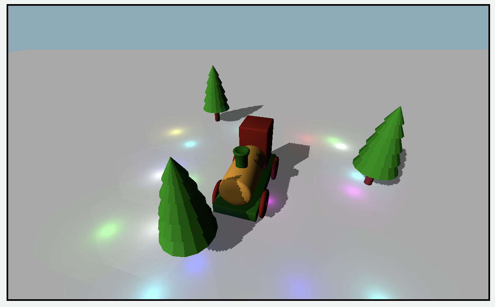

A few point lights rendering

Now it’s time to crank up those point lights. Be careful when you switch to the 
forward renderer. If you have a lot of lights, your system will appear to hang while 
the forward render pass laboriously calculates the point light effect on each 
fragment.

➤ Open SceneLighting.swift . In init(), replace:

pointLights = Self.createPointLights( 
  count: 20, 
  min: [-3, 0.1, -3], 
  max: [3, 0.3, 3])

373

Metal by Tutorials
Chapter 14: Deferred Rendering

➤ With:

pointLights = Self.createPointLights( 
  count: 200, 
  min: [-6, 0.1, -6], 
  max: [6, 0.3, 6])

With this code, you create 200 point lights, specifying the minimum and maximum 
xyz values to constrain the lights to that area.

➤ Build and run the app.

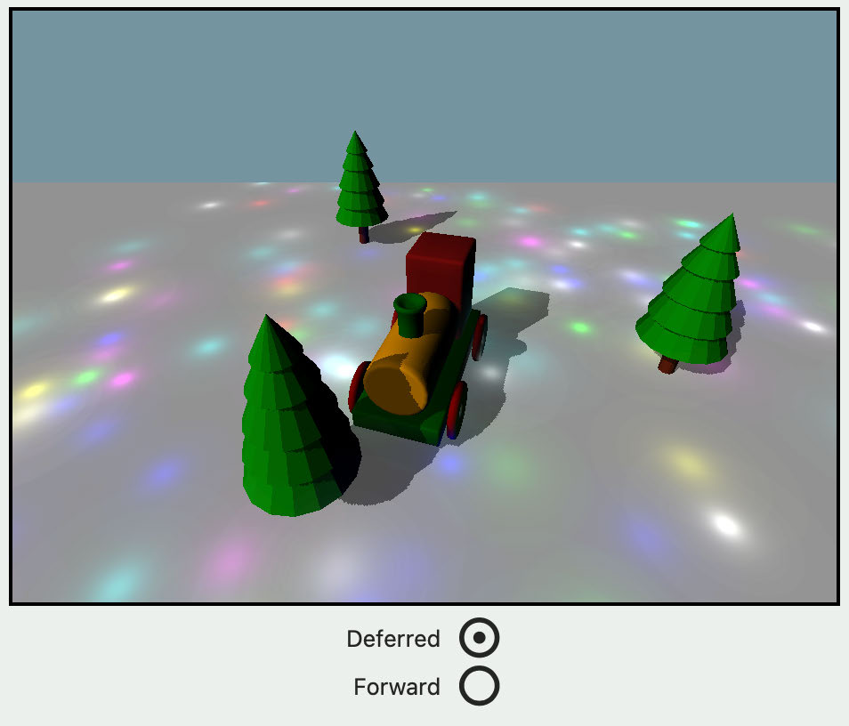

Two hundred point lights

Your point lights blend beautifully and are comparable with the forward renderer. 
The only problem is the color of the sky, which you’ll fix in the following chapter.

➤ On the Debug navigator, check your FPS for both Deferred and Forward. For 200 
lights, on my M1 iPad Pro, I have 24 FPS for Forward rendering, versus 60 FPS for 
Deferred. (Remember to remove the Debug draw from ForwardRenderPass to 
compare like with like.)

➤ If you are running on macOS, continue gradually increasing count in the previous 
code until your forward pass FPS decreases below 60 FPS. Make a note of the number 
of lights for comparison.

374

Metal by Tutorials
Chapter 14: Deferred Rendering

➤ Increase count and check how many point lights your deferred render can manage 
before degrading below 60 FPS. Many lights are so bright that you may have to dial 
down the light color in createPointLights(count:min:max:) with light.color 
*= 0.2.

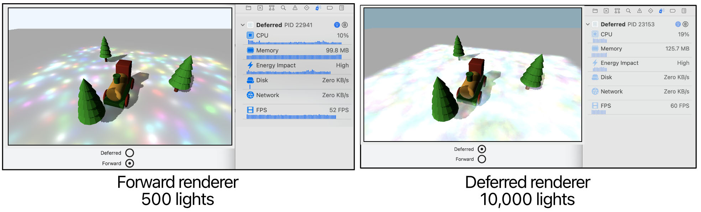

Render algorithm comparison

On my M1 Mac Mini, performance in a small window starts degrading on the forward 
renderer at about 400 lights, whereas the deferred renderer can cope with 10,000 
lights. With the window maximized, forward rendering starts degrading at about 30 
to 40 lights, whereas the deferred renderer manages more than 600. On an iPhone 12 
Pro, the forward renderer degraded at 100 lights, whereas the deferred renderer 
could manage 1500 at 60 FPS.

This chapter has opened your eyes to two rendering techniques: forward and 
deferred. As the game designer, you get to choose your rendering method. Forward 
and deferred rendering are just two: Several other techniques can help you get the 
most out of your frame time.

There are also many ways of configuring your forward and deferred render passes. 
references.markdown in the resources folder for this chapter has a few links for 
further research.

In the next chapter, you’ll learn how to make your deferred render pass even faster 
by taking advantage of Apple’s new Silicon.

375

Metal by Tutorials
Chapter 14: Deferred Rendering

Key Points

• Forward rendering processes all lights for all fragments.

• Deferred rendering captures albedo, position and normals for later light 
calculation. For point lights, only the necessary fragments are rendered.

• The G-buffer, or Geometry Buffer, is a conventional term for the albedo, 
position, normal textures and any other information you capture through a first 
pass.

• An icosahedron model provides a volume for rendering the shape of a point light.

• Using instancing, the GPU can efficiently render the same geometry many times.

• The pipeline state object specifies whether the result from the fragment function 
should be blended with the currently attached texture.

376

15