# Tile-Based 
Deferred Rendering

Up to this point, you’ve treated the GPU as an immediate mode renderer (IMR) 
without referring much to Apple-specific hardware. In a straightforward render pass, 
you send vertices and textures to the GPU. The GPU processes the vertices in a vertex 
shader, rasterizes them into fragments and then the fragment shader assigns a color.

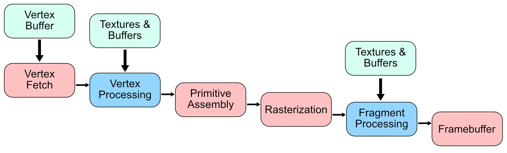

Immediate mode pipeline

377

Metal by Tutorials
Chapter 15: Tile-Based Deferred Rendering

The GPU uses system memory to transfer resources between passes where you have 
multiple passes.

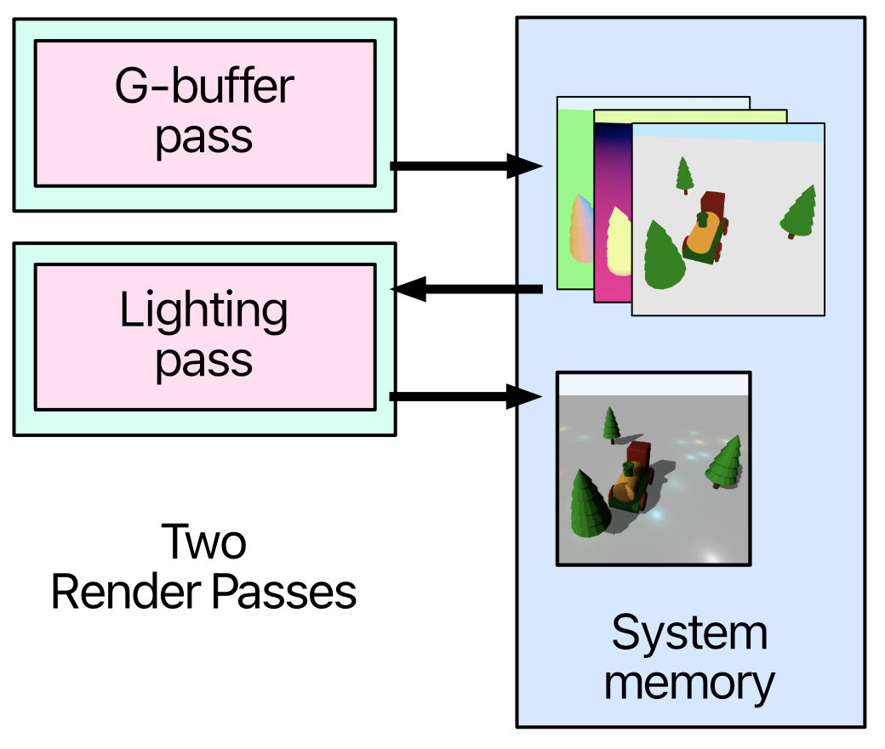

Immediate mode using system memory

Since the A7 64-bit mobile chip, Apple began transitioning to a tile-based deferred 
rendering (TBDR) architecture. With the arrival of Apple Silicon on Macs, this 
transition is complete.

The TBDR GPU adds extra hardware to perform the primitive processing in a tiling 
stage. This process breaks up the screen into tiles and assigns the geometry from the 
vertex stage to a tile. It then forwards each tile to the rasterizer. Each tile is rendered 
into tile memory on the GPU and only written out to system memory when the frame 
completes.

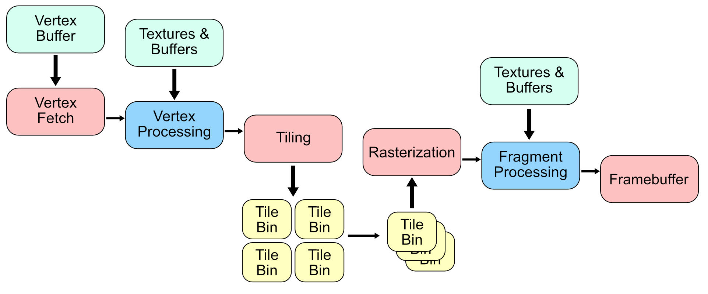

TBDR pipeline

378

Metal by Tutorials
Chapter 15: Tile-Based Deferred Rendering

Programmable Blending

Instead of writing the texture in one pass and reading it in the next pass, tile 
memory enables programmable blending. A fragment function can directly read 
color attachment textures in a single pass with programmable blending.

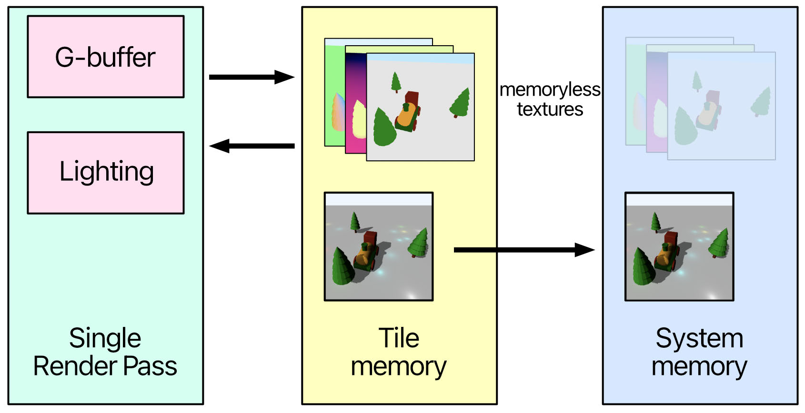

Programmable blending with memoryless textures

The G-buffer doesn’t have to transfer the temporary textures to system memory 
anymore. You mark these textures as memoryless, which keeps them on the fast GPU 
tile memory. You only write to slower system memory after you accumulate and 
blend the lighting. This speeds up rendering because you use less bandwidth.

Tiled Deferred Rendering

Confusingly, tiled deferred rendering can apply to the deferred rendering or 
shading technique as well as the name of an architecture. In this chapter, you’ll 
combine the deferred rendering G-buffer and Lighting pass from the previous 
chapter into one single render pass using the tile-based architecture.

To complete this chapter, you need to run the code on a device with an Apple GPU. 
This device could be an Apple Silicon macOS device or any iOS device capable of 
running the latest iOS. The iOS simulator and Intel Macs can’t handle the code, but 
the starter project will run Forward Rendering in place of Tiled Deferred Rendering 
instead of crashing.

379

Metal by Tutorials
Chapter 15: Tile-Based Deferred Rendering

The Starter Project

➤ In Xcode, open the starter project for this chapter.

This project is the same as the end of the previous chapter, except:

• In the SwiftUI Views group, there’s a new option for tiledDeferred in 
Options.swift. Renderer will update tiledSupported depending on whether the 
device supports tiling.

• In the Render Passes group, the deferred rendering pipeline state creation 
methods in Pipelines.swift have an extra Boolean parameter of tiled:. Later, 
you’ll assign a different fragment function depending on this parameter.

• A new file, TiledDeferredRenderPass.swift, combines GBufferRenderPass and 
LightingRenderPass into one long file. The code is substantially similar, with the 
two render passes combined into 
draw(commandBuffer:scene:uniforms:params:). You’ll convert this file from 
the immediate mode deferred rendering algorithm to tile-based deferred 
rendering.

• Renderer instantiates TiledDeferredRenderPass if the device supports tiling.

➤ Build and run the app on your TBDR device.

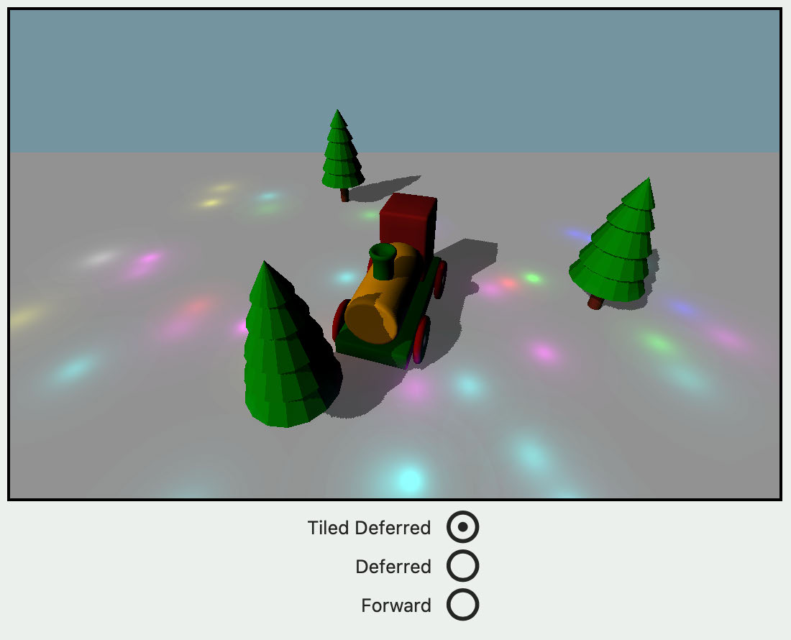

The starter app

The render is the same as at the end of the previous chapter but with an added Tiled 
Deferred option under the Metal view.

Note: If you run the app on a non-TBDR device, the option will be marked 
Tiled Deferred not Supported!.

380

Metal by Tutorials
Chapter 15: Tile-Based Deferred Rendering

Apple assigns GPU families to devices. The A7 is iOS GPU family 1. When using 
newer Metal features, use device.supportsFamily(_:) to check whether the 
current device supports the capabilities you’re requesting.

In init(metalView:options:), Renderer checks the GPU family. If the device 
supports Apple family 3 GPUs, which Apple introduced with the A9 chip, it supports 
tile-based deferred rendering.

➤ Capture the GPU workload. In the Debug navigator, click on Command Buffer 
and refresh your memory on the render pass hierarchy:

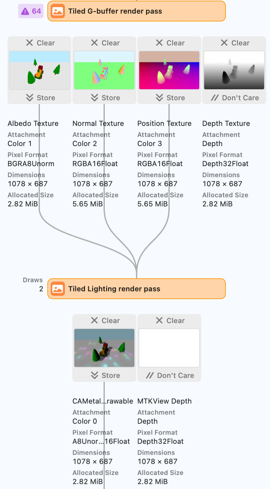

GPU frame capture

381

Metal by Tutorials
Chapter 15: Tile-Based Deferred Rendering

You have a G-buffer pass where you fill in the albedo, normal and position textures. 
You also have a Light accumulation pass, where you render a quad and calculate the 
lighting using the G-buffer textures.

In the Render Passes group, open TiledDeferredRenderPass.swift and examine 
the code. draw(commandBuffer:scene:uniforms:params:) contains both the G-
buffer pass and the Lighting pass. There’s a lot of code, but you should recognize it 
from the previous chapter.

➤ Currently, this is what happens during your render passes:

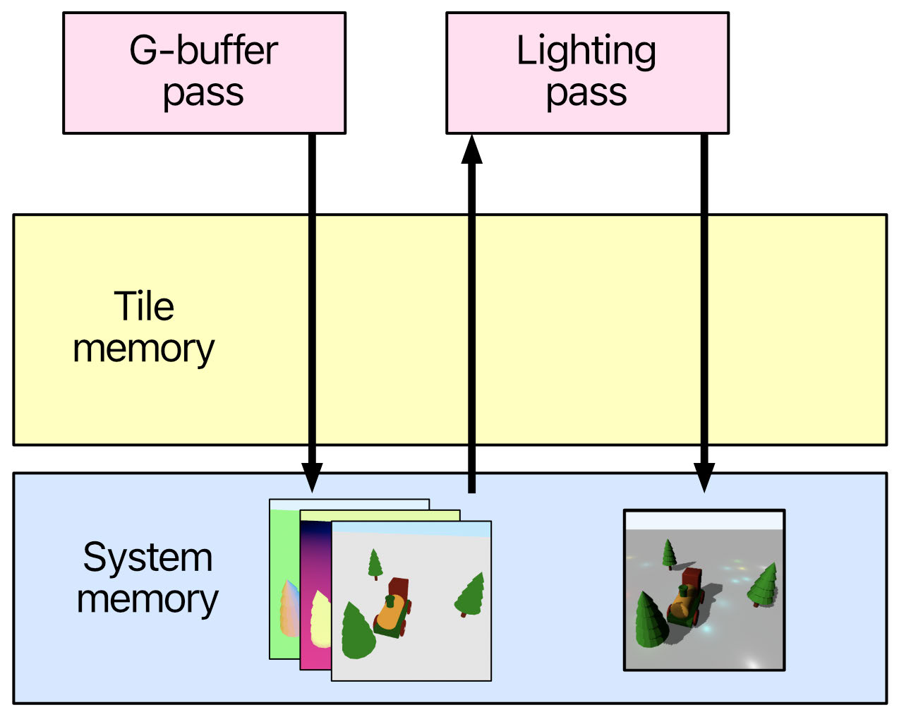

Starter app render passes

You write the G-buffer textures to system memory and then read them back from 
system memory.

These are the steps you’ll take to move the G-buffer textures to tile memory:

1. Change the texture storage mode from private to memoryless.

2. Change the descriptor’s color attachment store action for all the G-buffer 
textures to dontCare.

3. In the Lighting pass, stop sending the color attachment textures to the fragment 
function.

4. Create new fragment shaders for rendering the sun and point lights.

5. Combine the two render encoder passes with their descriptors into one.

6. Update the pipeline state objects to match the new render pass descriptor.

As you work through the chapter, you’ll encounter common errors so you can learn 
how to fix them when you make them in the future.

382

Metal by Tutorials
Chapter 15: Tile-Based Deferred Rendering

1. Making the Textures Memoryless

➤ Open TiledDeferredRenderPass.swift. In resize(view:size:), change the 
storage mode for all four textures from storageMode: private to:

➤ Build and run the app.

You’ll get an error: Memoryless attachment content cannot be stored in 
memory. You’re still storing the attachment back to system memory. Time to fix 
that.

2. Changing the Store Action

➤ Stay in TiledDeferredRenderPass.swift. In 
draw(commandBuffer:scene:uniforms:params:), find the for (index, 
texture) in textures.enumerated() loop and change 
attachment?.storeAction = .store to:

This line stops the textures from transferring to system memory.

➤ Build and run the app.

You’ll get another error: failed assertion `Set Fragment Buffers 
Validationtexture is Memoryless, and cannot be assigned.`. For the Lighting 
pass, you send the textures to the fragment shader as texture parameters. However, 
you can’t do that with memoryless textures because they’re already resident on the 
GPU. You’ll fix that next.

3. Removing the Fragment Textures

➤ In drawLightingRenderPass(renderEncoder:scene:uniforms:params:), 
remove:

renderEncoder.setFragmentTexture( 
  albedoTexture, 
  index: BaseColor.index) 
renderEncoder.setFragmentTexture( 
  normalTexture, 
  index: NormalTexture.index) 
renderEncoder.setFragmentTexture(

383

Metal by Tutorials
Chapter 15: Tile-Based Deferred Rendering

positionTexture, 
  index: PositionTexture.index)

➤ Build and run the app.

You’ll probably get a black screen now because your deferred shader functions are 
expecting textures.

4. Creating the New Fragment Functions

➤ Still in TiledDeferredRenderPass.swift, in init(view:), change the three 
pipeline state objects’ tiled: false parameters to:

➤ Open Pipelines.swift. In createSunLightPSO(colorPixelFormat:tiled:) and 
createPointLightPSO(colorPixelFormat:tiled:), check which fragment 
functions you need to create:

• fragment_tiled_deferredSun

• fragment_tiled_pointLight

You can still use the same vertex functions and G-buffer fragment function.

➤ In the Shaders group, open Deferred.metal.

➤ Copy fragment_deferredSun to a new function called 
fragment_tiled_deferredSun.

➤ In fragment_tiled_deferredSun, since you’re not sending the fragment textures 
to the fragment function any more, remove the parameters:

texture2d<float> albedoTexture [[texture(BaseColor)]], 
texture2d<float> normalTexture [[texture(NormalTexture)]]]]

➤ Add a new parameter:

GBufferOut is the structure that refers to the color attachment render target 
textures.

384

Metal by Tutorials
Chapter 15: Tile-Based Deferred Rendering

➤ Change:

uint2 coord = uint2(in.position.xy); 
float4 albedo = albedoTexture.read(coord); 
float3 normal = normalTexture.read(coord).xyz;

➤ To:

float4 albedo = gBuffer.albedo; 
float3 normal = gBuffer.normal.xyz;

Instead of swapping out to system memory, you now read the color attachment 
textures in the fast GPU tile memory. In addition to this speed optimization, you 
directly access the memory rather than reading in a texture.

Repeat this process for the point lights.

➤ Copy fragment_pointLight to a new function named 
fragment_tiled_pointLight

➤ Remove the parameters:

texture2d<float> normalTexture [[texture(NormalTexture)]], 
texture2d<float> positionTexture [[texture(PositionTexture)]],

➤ Add the parameter:

➤ Change:

uint2 coords = uint2(in.position.xy); 
float3 normal = normalTexture.read(coords).xyz; 
float3 position = positionTexture.read(coords).xyz;

➤ To:

float3 normal = gBuffer.normal.xyz; 
float3 worldPosition = gBuffer.position.xyz;

➤ Build and run the app.

When creating the sun light pipeline state, you now get the error: Shaders reads 
from a color attachment whose pixel format is MTLPixelFormatInvalid.

385

Metal by Tutorials
Chapter 15: Tile-Based Deferred Rendering

To explain this error, the following image shows the attachments you set up in the 
two render passes in the previous chapter’s Deferred Rendering:

Render pass descriptor color attachments

Currently, when writing the G-buffer in fragment_gBuffer, you only write to color 
attachments 1 (albedo), 2 (normal) and 3 (position). Your render pass 
descriptor colorAttachments[0] is nil, and your pipeline state 
colorAttachments[0] pixel format is invalid.

However, when accumulating the lighting, in Pipelines.swift, in 
createSunLightPSO(colorPixelFormat:tiled:), you only set up 
colorAttachments[0], and not [1], [2] and [3]. This means that when 
fragment_tiled_deferredSun reads from gBuffer, the other color attachment 
pixel formats are currently invalid.

Instead of using two render pass descriptors and render command encoders, you’ll 
configure the view’s current render pass descriptor to use all the color attachments. 
Then you’ll set up the pipeline state configuration to match.

5. Combining the Two Render Passes

➤ Open TiledDeferredRenderPass.swift. In 
draw(commandBuffer:scene:uniforms:params:), change let descriptor = 
MTLRenderPassDescriptor() to:

You’ll use the view’s current render pass descriptor, passed in from Renderer, to 
configure your render command encoder.

386

Metal by Tutorials
Chapter 15: Tile-Based Deferred Rendering

➤ Still in draw(commandBuffer:scene:uniforms:params:), remove:

renderEncoder.endEncoding()

// MARK: Lighting pass 
// Set up Lighting descriptor 
guard let renderEncoder = 
  commandBuffer.makeRenderCommandEncoder( 
    descriptor: viewCurrentRenderPassDescriptor) else { 
  return 
}

Here, you remove the second render command encoder.

6. Updating the Pipeline States

➤ Open Pipelines.swift. Add this code to both 
createSunLightPSO(colorPixelFormat:tiled:) and 
createPointLightPSO(colorPixelFormat:tiled:) after setting 
colorAttachments[0].pixelFormat:

if tiled { 
  pipelineDescriptor.setGBufferPixelFormats() 
}

This code sets the color pixel formats to match the render target textures.

➤ In createGBufferPSO(colorPixelFormat:tiled:), after setting 
colorAttachments[0].pixelFormat, add:

if tiled { 
  pipelineDescriptor.colorAttachments[0].pixelFormat 
    = colorPixelFormat 
}

In the previous chapter, your G-buffer render pass descriptor had no texture in 
colorAttachments[0]. However, when you use the view’s current render pass 
descriptor, colorAttachment[0] stores the view’s current drawable texture, so you 
match that texture’s pixel format.

387

Metal by Tutorials
Chapter 15: Tile-Based Deferred Rendering

Now you store the textures in tile memory and use a single render pass.

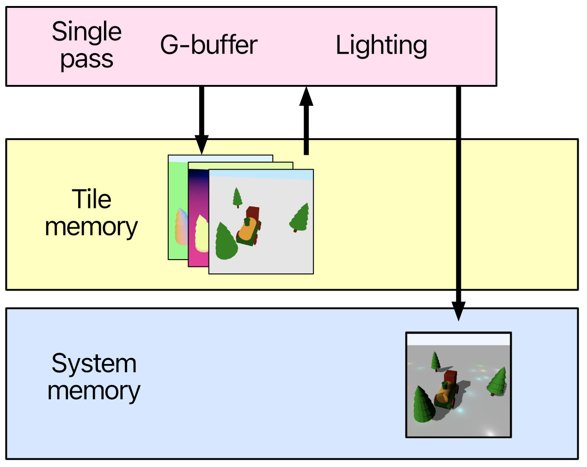

A single render pass

➤ Build and run the app.

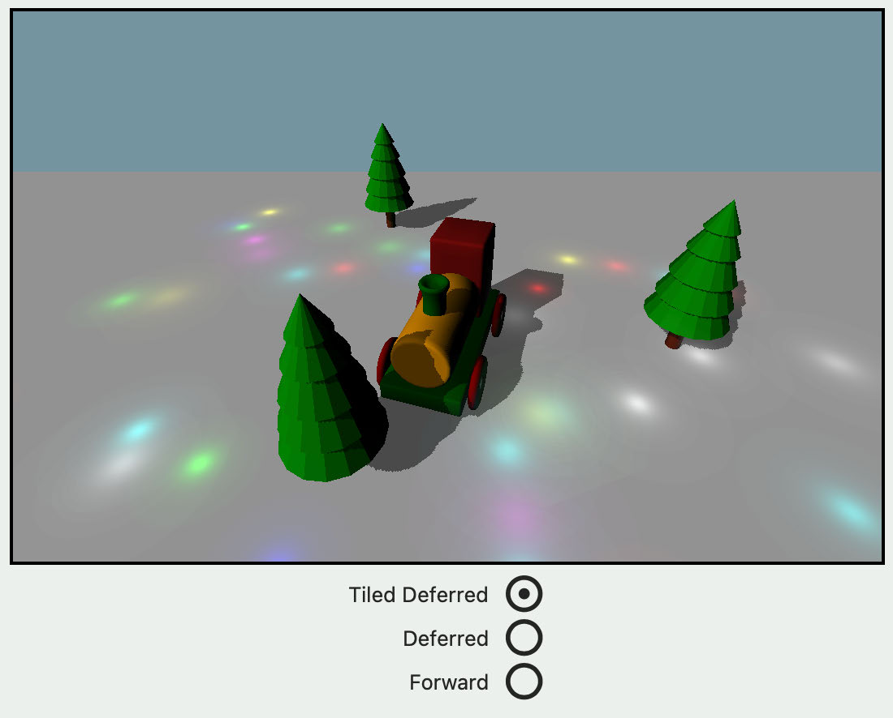

The final render

Finally, you’ll see the result you want. The render is the same whether you choose 
Tiled Deferred or Deferred.

388

Metal by Tutorials
Chapter 15: Tile-Based Deferred Rendering

➤ With the Tiled Deferred option selected, capture the GPU workload. You’ll see 
that all your textures, aside from the shadow pass, process in the single render pass.

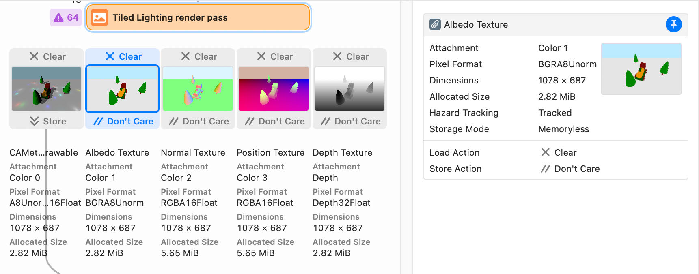

The final frame capture

Your four memoryless render target textures show up as // Don’t care on the 
capture. When you select a texture, the storage mode shows as Memoryless, proving 
they aren’t taking up any system memory.

Now for the exciting part — to see how many lights you can run at 60 frames per 
second.

➤ Open SceneLighting.swift, and locate in init():

pointLights = Self.createPointLights( 
  count: 40, 
  min: [-3, 0.1, -5], 
  max: [3, 0.3, 5])

➤ While running your app and choosing the Deferred option, slowly raise the count 
of point lights until you’re no longer getting 60 frames per second. Then see how 
many point lights you can get when choosing the Tiled Deferred option.

On Tiled Deferred, my M1 Mac mini runs 18,000 point lights at 60 FPS in a small 
window. On Deferred, it’ll only achieve 38 FPS with the same number of lights. 
Don’t attempt Forward Rendering with this many lights!

When you’ve finished experimenting, reset the point light count to 40 for the rest of 
the chapter.

389

Metal by Tutorials
Chapter 15: Tile-Based Deferred Rendering

Stencil Tests

The last step in completing your deferred rendering is to fix the sky. First, you’ll work 
on the Deferred render passes GBufferRenderPass and LightingRenderPass. Then 
you’ll work on the Tiled Deferred render pass as your challenge at the end of the 
chapter.

Currently, when you render the quad in the lighting render pass, you accumulate the 
directional lighting on all the quad’s fragments. Wouldn’t it be great to only process 
fragments where model geometry is rendered?

Fortunately, that’s what stencil testing was designed to do. In the following image, 
the stencil texture is on the right. The black area should mask the image so that only 
the white area renders.

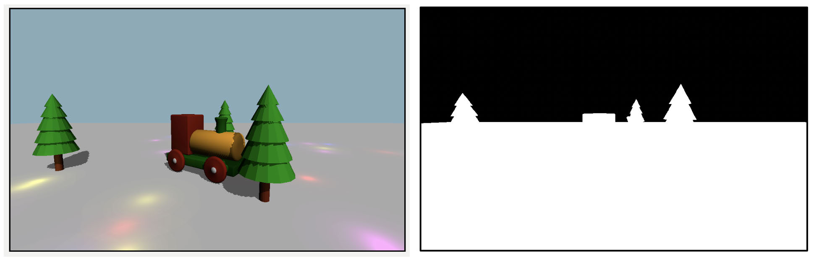

Stencil testing

As you already know, part of rasterization is performing a depth test to ensure the 
current fragment is in front of any fragments already rendered. The depth test isn’t 
the only test the fragment has to pass. You can configure a stencil test.

Up to now, when you created the MTLDepthStencilState, you only configured the 
depth test. In the pipeline state objects, you set the depth pixel format to 
depth32float with a matching depth texture.

A stencil texture consists of 8-bit values, from 0 to 255. You’ll add this texture to the 
depth buffer so that the depth buffer will consist of both depth texture and stencil 
texture.

390

Metal by Tutorials
Chapter 15: Tile-Based Deferred Rendering

For a better understanding of the stencil buffer, examine the following image.

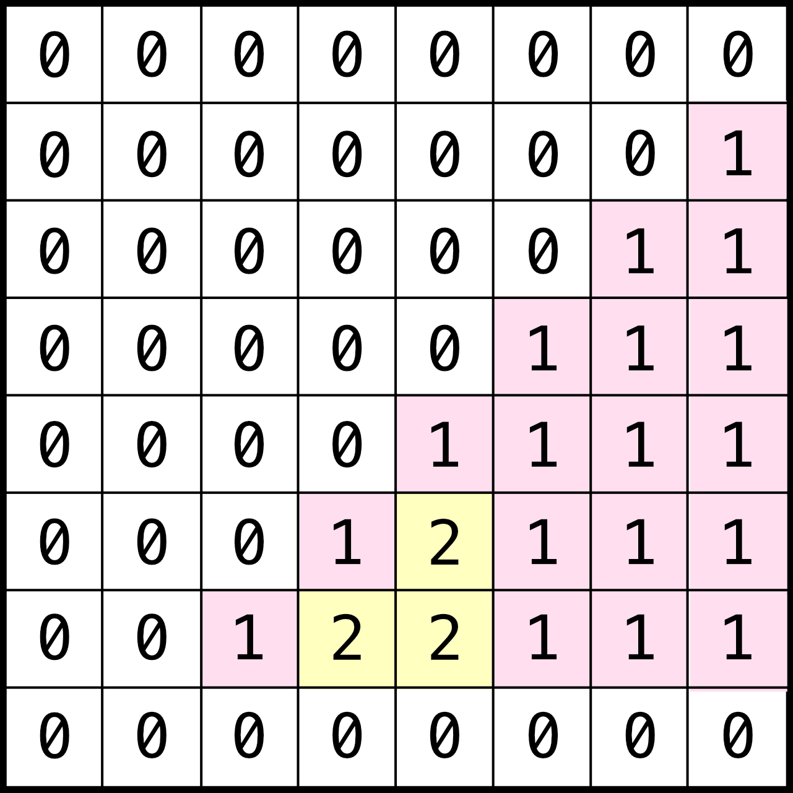

A stencil texture

In this scenario, the buffer is initially cleared with zeros. When the pink triangle 
renders, the rasterizer increments the fragments the triangle covers. The second 
yellow triangle renders, and the rasterizer again increments the fragments that the 
triangle covers.

Stencil Test Configuration

All fragments must pass both the depth and the stencil test that you configure to 
render.

As part of the configuration you set:

• The comparison function.

• The operation on pass or fail.

• A read and write mask.

Take a closer look at the comparison function.

1. The Comparison Function

When the rasterizer performs a stencil test, it compares a reference value with the 
value in the stencil texture using a comparison function. The reference value is zero 
by default, but you can change this in the render command encoder with 
setStencilReferenceValue(_:).

391

Metal by Tutorials
Chapter 15: Tile-Based Deferred Rendering

The comparison function is a mathematical comparison operator, such as equal or 
lessEqual. A comparison function of always will let the fragment pass the stencil 
test, whereas with a stencil comparison of never, the fragment will always fail.

For instance, if you want to use the stencil buffer to mask out the yellow triangle 
area in the previous example, you could set a reference value of 2 in the render 
command encoder and then set the comparison to notEqual. Only fragments that 
don’t have their stencil buffer set to 2 will pass the stencil test.

2. The Stencil Operation

Next, you set the stencil operations to perform on the stencil buffer. There are three 
possible results to configure:

• Stencil test failure.

• Stencil test pass and depth failure.

• Stencil test pass and depth pass.

The default operation for each result is keep, which doesn’t change the stencil 
buffer.

Other operations include:

• incrementClamp: The stencil buffer increments the stencil buffer fragment until 
the maximum of 255.

• incrementWrap: The stencil buffer increments the stencil buffer fragment and, if 
necessary, wraps around from 255 to 0.

• decrementClamp and decrementWrap: The same as increment, except the stencil 
buffer value decreases.

• invert: Performs a bitwise NOT operation, which inverts all of the bits.

• replace: Replaces the stencil buffer fragment with the reference value.

To get the stencil buffer to increase when a triangle renders in the previous example, 
you perform the incrementClamp operation when the fragment passes the depth 
test.

392

Metal by Tutorials
Chapter 15: Tile-Based Deferred Rendering

3. The Read and Write Mask

There’s one more wrinkle. You can specify a read mask and a write mask. By default, 
these masks are 255 or 11111111 in binary. When you test a bit value against 1, the 
value doesn’t change.

Now that you have the concept and principles under your belt, it’s time to learn what 
all this means.

Create the Stencil Texture

The stencil texture buffer is an extra 8-bit buffer attached to the depth texture 
buffer. You optionally configure it when you configure the depth buffer.

➤ Open Pipelines.swift. In createGBufferPSO(colorPixelFormat:tiled:), after 
pipelineDescriptor.depthAttachmentPixelFormat = .depth32Float, add:

if !tiled { 
  pipelineDescriptor.depthAttachmentPixelFormat 
    = .depth32Float_stencil8 
  pipelineDescriptor.stencilAttachmentPixelFormat 
    = .depth32Float_stencil8 
}

This code configures both the depth and stencil attachment to use one texture, 
including the 32-bit depth and the 8-bit stencil buffers.

➤ Open GBufferRenderPass.swift. In resize(view:size:), change depthTexture 
to:

depthTexture = Self.makeTexture( 
  size: size, 
  pixelFormat: .depth32Float_stencil8, 
  label: "Depth and Stencil Texture")

Here, you create the texture with the matching pixel format.

➤ In draw(commandBuffer:scene:uniforms:params:), after configuring the 
descriptor’s depth attachment, add:

descriptor?.stencilAttachment.texture = depthTexture 
descriptor?.stencilAttachment.storeAction = .store

393

Metal by Tutorials
Chapter 15: Tile-Based Deferred Rendering

With this code, you tell the descriptor to use the depth texture as the stencil 
attachment and store the texture after use.

➤ Build and run the app, and choose the Deferred option.

➤ Capture the GPU workload and examine the command buffer.

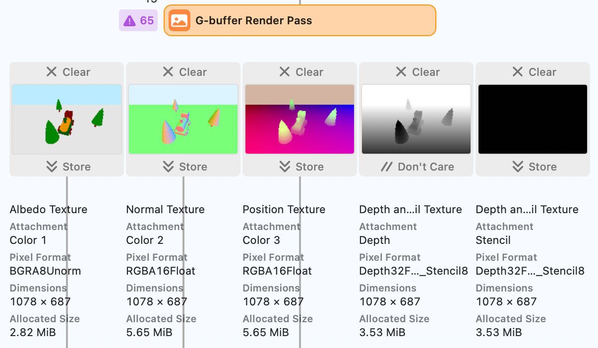

New stencil texture

Sure enough, you now have a stencil texture along with your other textures.

Configure the Stencil Operation

➤ Open GBufferRenderPass.swift, and add this new method:

static func buildDepthStencilState() -> MTLDepthStencilState? { 
  let descriptor = MTLDepthStencilDescriptor() 
  descriptor.depthCompareFunction = .less 
  descriptor.isDepthWriteEnabled = true 
  return Renderer.device.makeDepthStencilState( 
    descriptor: descriptor) 
}

This is the same method to create a depth stencil state object in RenderPass, but 
you’ll override it with your stencil configuration.

394

Metal by Tutorials
Chapter 15: Tile-Based Deferred Rendering

➤ Add the following code to buildDepthStencilState() before return:

let frontFaceStencil = MTLStencilDescriptor() 
frontFaceStencil.stencilCompareFunction = .always 
frontFaceStencil.stencilFailureOperation = .keep   
frontFaceStencil.depthFailureOperation = .keep 
frontFaceStencil.depthStencilPassOperation = .incrementClamp   
descriptor.frontFaceStencil = frontFaceStencil

frontFaceStencil affects the stencil buffer only for models’ faces facing the 
camera. The stencil test will always pass, and nothing happens if the stencil or depth 
tests fail. If the depth and stencil tests pass, the stencil buffer increases by 1.

➤ Build and run the app, and choose the Deferred option.

➤ Capture the GPU workload and select Command Buffer in the Debug navigator. 
Double click the stencil texture until you see the five attachments. When you move 
your cursor slowly across the stencil texture, you’ll see the value of the pixel. You can 
choose which attachments you want to view at the bottom of the panel.

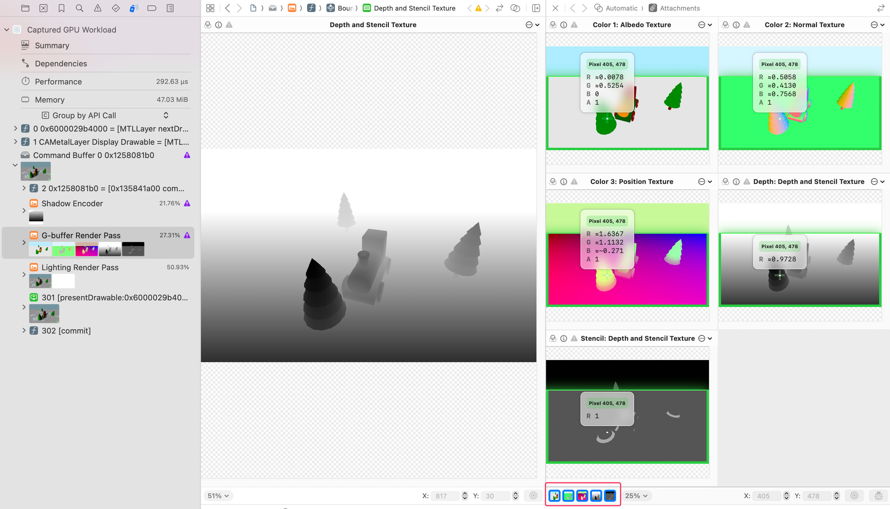

The ground is rendered in front of the trees and sometimes fails the depth test

Most of the texture is mid-gray with a value of 1. On the trees, which are mostly 1, 
there are small patches of 2, which incidentally uncovers some inefficient 
overlapping geometry in the tree model.

395

Metal by Tutorials
Chapter 15: Tile-Based Deferred Rendering

It’s important to realize that the geometry is processed in the order it’s rendered. In 
GameScene, this is set up as:

The ground is the last to render. It fails the depth test when the fragment is behind a 
tree or the train and doesn’t increment the stencil buffer.

Compare this with a stencil test where the ground is the first to render.

➤ Open GameScene.swift. In init(), change the models assignment to:

This code renders the ground first.

➤ Build and run the app, and choose the Deferred option.

➤ Capture the GPU workload and compare the stencil texture.

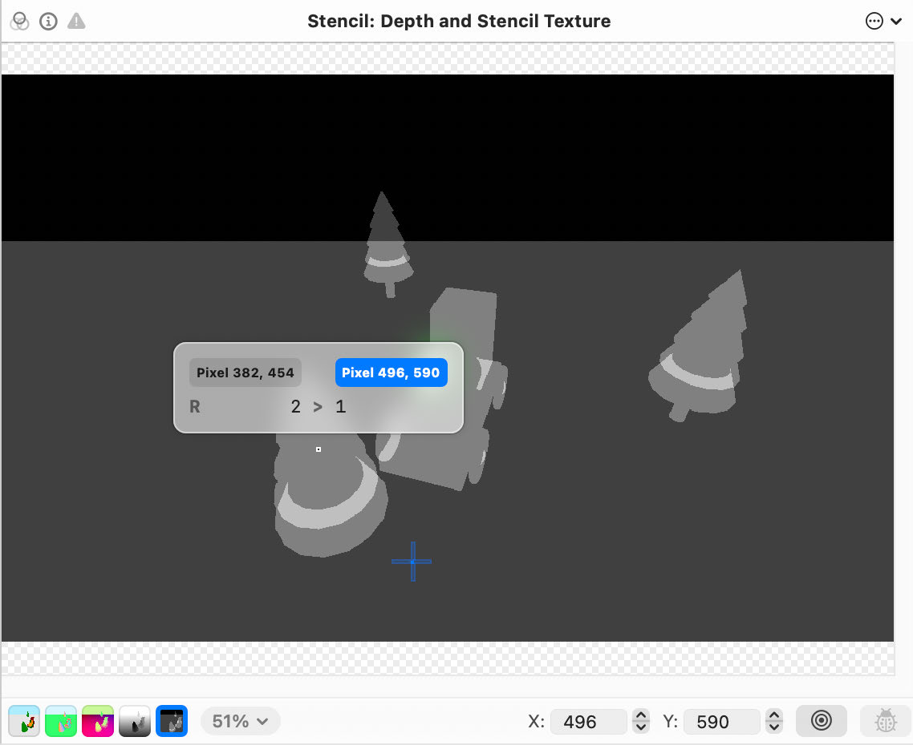

Ground renders first

When the tree renders this time, the ground passing the depth test has already 
incremented the stencil buffer to 1, so the tree passes the depth test and increments 
the buffer to 2, then 3 when there is extra geometry.

You now have a stencil texture with zero where no geometry renders and non-zero 
where there is geometry.

All this aims to compute deferred lighting only in those areas with geometry. You can 
achieve this with your current stencil texture. Where the stencil buffer is zero, you 
can ignore the fragment in the light render pass.

396

Metal by Tutorials
Chapter 15: Tile-Based Deferred Rendering

To achieve this, you’ll:

1. Pass in the depth/stencil texture from GBufferRenderPass to 
LightingRenderPass.

2. In addition to setting LightingRenderPass‘s render pass descriptor’s stencil 
attachment, you must assign the depth texture to the descriptor’s depth 
attachment because you previously combine the stencil texture with depth.

3.
LightingRenderPass uses two pipeline states: one for the sun and one for point 
lights. Both must have the depth and stencil pixel format of 
depth32float_stencil.

1. Passing in the Depth/Stencil Texture

➤ Open LightingRenderPass.swift, and add a new texture property to 
LightingRenderPass:

➤ Add this line to the top of draw(commandBuffer:scene:uniforms:params:):

➤ Open Renderer.swift. In draw(scene:in:), add this line where you assign the 
textures to lightingRenderPass:

lightingRenderPass.stencilTexture = 
gBufferRenderPass.depthTexture

2. Setting Up the Render Pass Descriptor

➤ Open LightingRenderPass.swift. At the top of 
draw(commandBuffer:scene:uniforms:params:), add:

descriptor?.depthAttachment.texture = stencilTexture 
descriptor?.stencilAttachment.loadAction = .load 
descriptor?.depthAttachment.loadAction = .dontCare

You set the stencil attachment to load so that the LightingRenderPass can use the 
stencil texture for stencil testing. You don’t need the depth texture, so you set a load 
action of dontCare.

397

Metal by Tutorials
Chapter 15: Tile-Based Deferred Rendering

3. Changing the Pipeline State Objects

➤ Open Pipelines.swift.

In both createSunLightPSO(colorPixelFormat:) and 
createPointLightPSO(colorPixelFormat:), after 
pipelineDescriptor.depthAttachmentPixelFormat = .depth32Float, add:

if !tiled { 
  pipelineDescriptor.depthAttachmentPixelFormat 
    = .depth32Float_stencil8 
  pipelineDescriptor.stencilAttachmentPixelFormat 
    = .depth32Float_stencil8 
}

This code configures the pipeline state to match the render pass descriptor’s depth 
and stencil texture pixel format.

➤ Build and run the app, and choose the Deferred option.

➤ Capture the GPU workload and examine the frame so far.

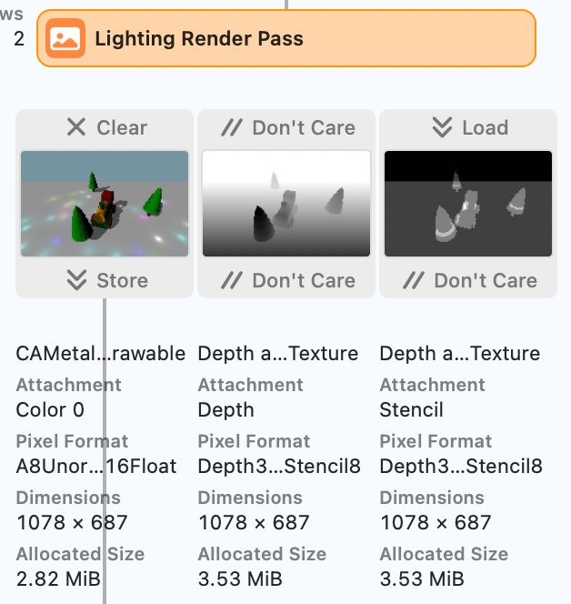

Stencil texture in frame capture

LightingRenderPass correctly receives the stencil buffer from GBufferRenderPass.

398

Metal by Tutorials
Chapter 15: Tile-Based Deferred Rendering

Masking the Sky

When you render the quad in LightingRenderPass, you want to bypass all 
fragments that are zero in the stencil buffer.

➤ Open LightingRenderPass.swift, and add this code to 
buildDepthStencilState() before return:

let frontFaceStencil = MTLStencilDescriptor() 
frontFaceStencil.stencilCompareFunction = .equal 
frontFaceStencil.stencilFailureOperation = .keep 
frontFaceStencil.depthFailureOperation = .keep 
frontFaceStencil.depthStencilPassOperation = .keep 
descriptor.frontFaceStencil = frontFaceStencil

(Spoiler: Deliberate mistake!)

You haven’t changed the reference value in the render command encoder, so the 
reference value is zero. Here, you say that all stencil buffer fragments equal to zero 
will pass the stencil test. You don’t need to change the stencil buffer, so all of the 
operations are keep.

➤ Build and run the app, and choose the Deferred option.

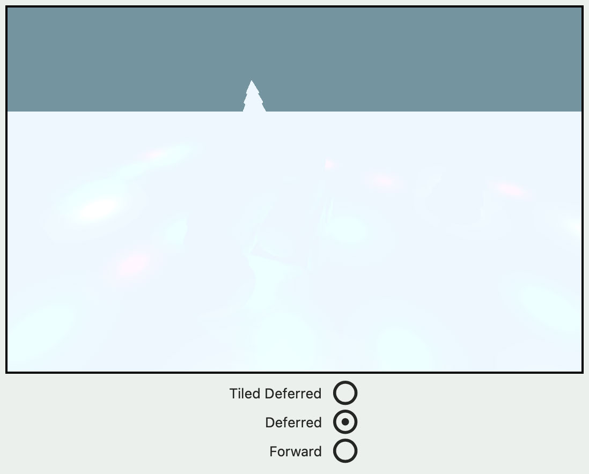

A deliberate mistake

In this render, all fragments that are zero render. That’s the top part. The bottom 
section with the plane and trees doesn’t render but shows the clear blue sky 
background. Of course, it should be the other way around.

399

Metal by Tutorials
Chapter 15: Tile-Based Deferred Rendering

➤ In buildDepthStencilState(), change the stencil compare function:

➤ Build and run the app, then choose the Deferred option.

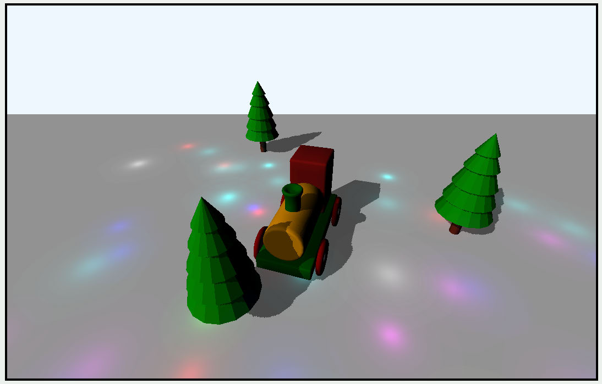

Clear blue skies

At last, the brooding, stormy sky is replaced by the Metal view’s blue MTLClearColor 
that you set way back in Renderer’s initializer.

Challenge

You fixed the sky for your Deferred Rendering pass. Your challenge is now to fix it in 
the Tiled Deferred render pass. Here’s a hint: just follow the steps for the Deferred 
render pass. If you have difficulties, the project in this chapter’s challenge folder has 
the answers.

400

Metal by Tutorials
Chapter 15: Tile-Based Deferred Rendering

Key Points

• Tile-based deferred rendering takes advantage of Apple’s special GPUs.

• Keeping data in tile memory rather than transferring to system memory is much 
more efficient and uses less power.

• Mark textures as memoryless to keep them in tile memory.

• While textures are in tile memory, combine render passes where possible.

• Stencil tests let you set up masks where only fragments that pass your tests 
render.

• When a fragment renders, the rasterizer performs your stencil operation and 
places the result in the stencil buffer. With this stencil buffer, you control which 
parts of your image renders.

Where to Go From Here?

Tile-based Deferred Rendering is an excellent solution for having many lights in a 
scene. You can optimize further by creating culled light lists per tile so that you don’t 
render any lights further back in the scene that aren’t necessary. Apple’s Modern 
Rendering with Metal 2019 video (https://apple.co/3mfdtEY) will help you 
understand how to do this. The video also points out when to use various rendering 
technologies.

401

16