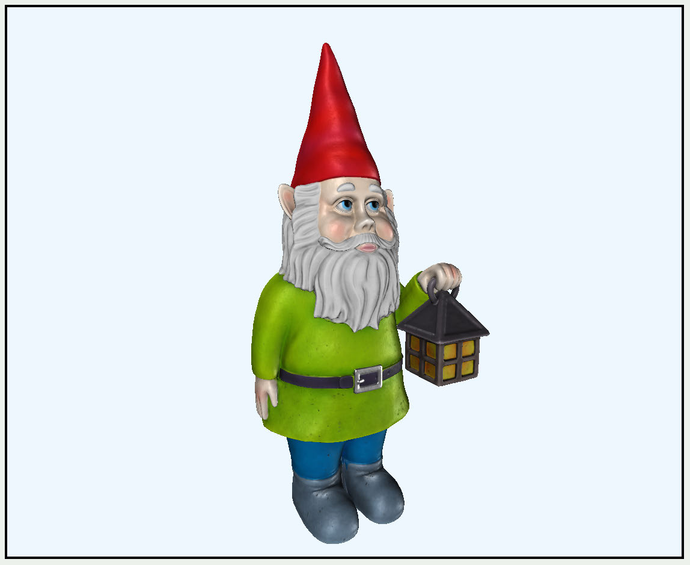
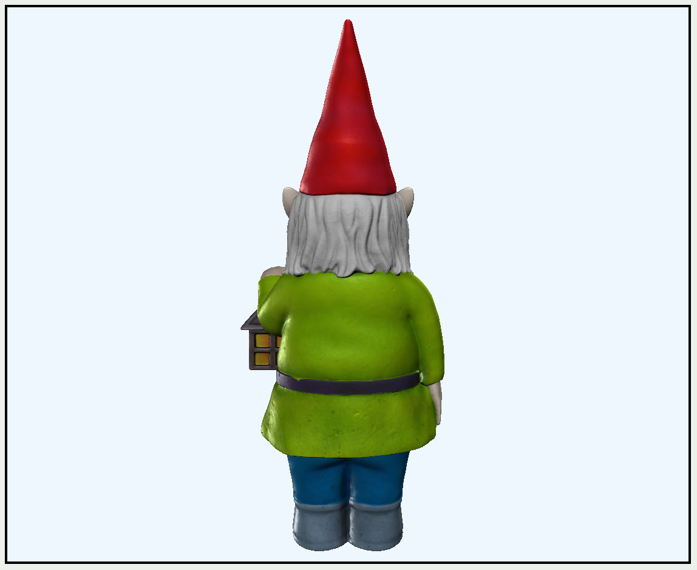
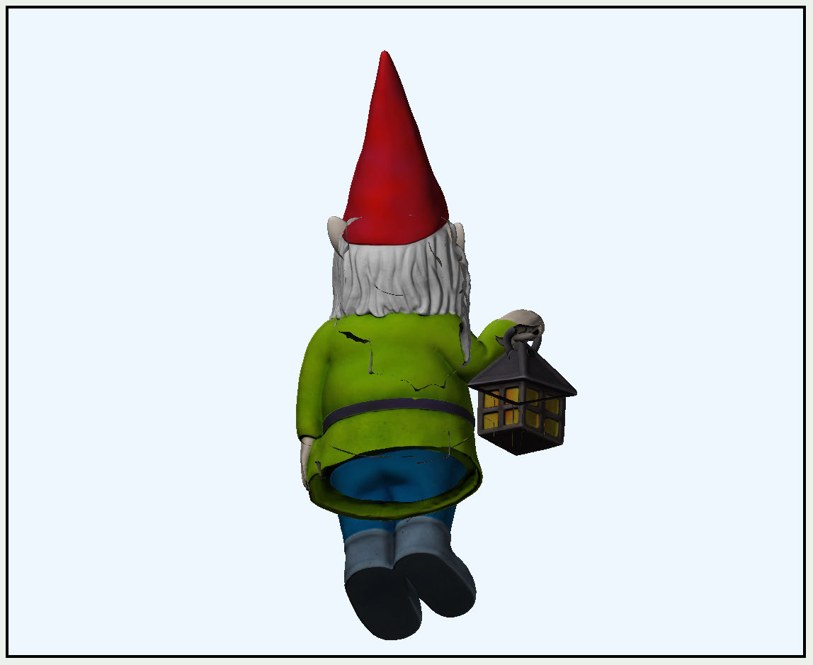
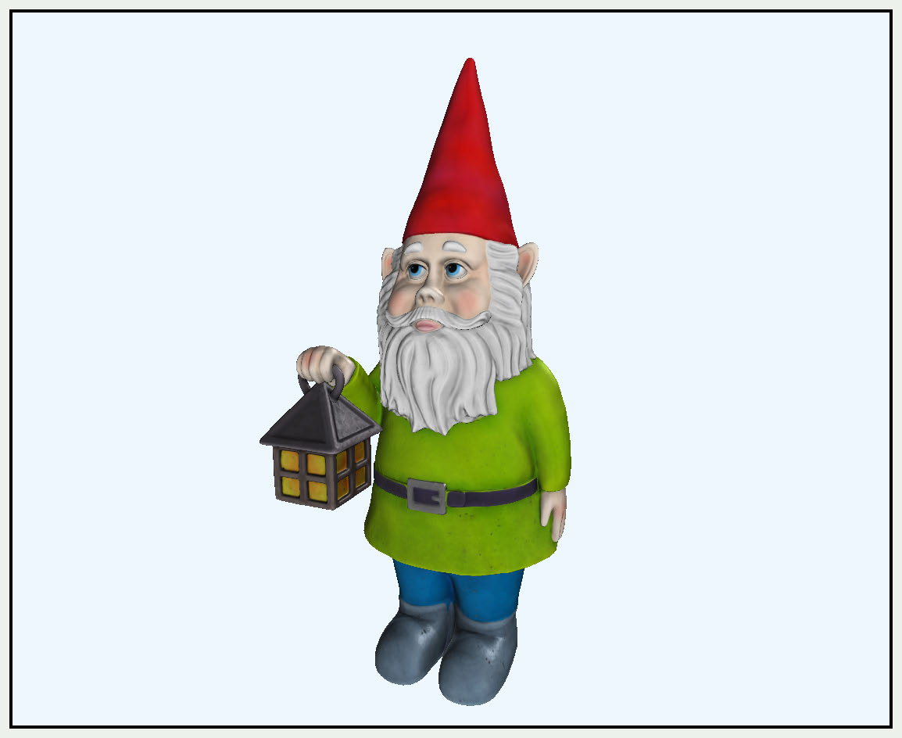
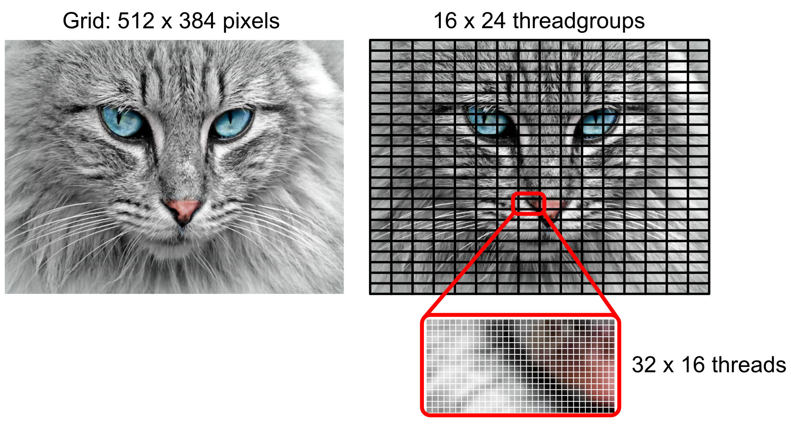
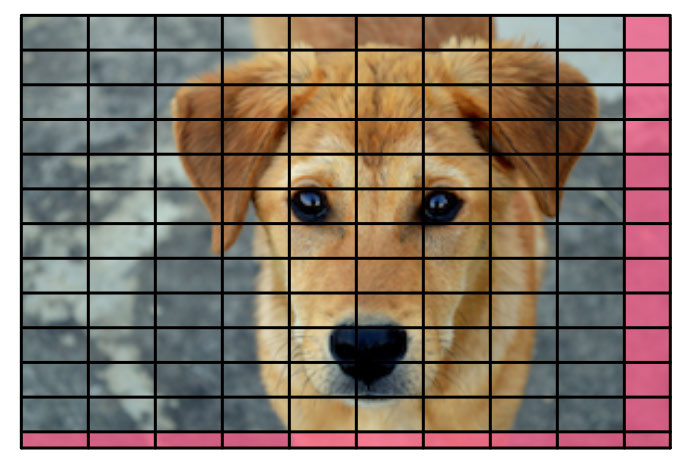
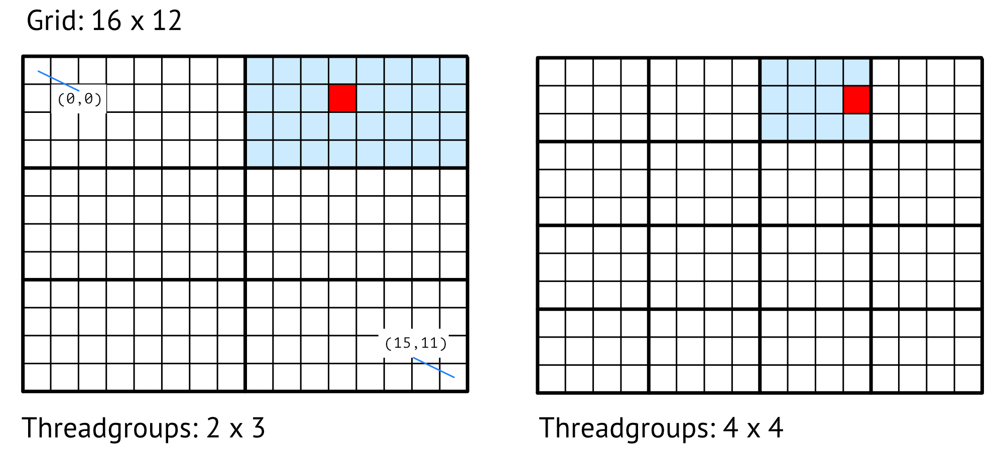
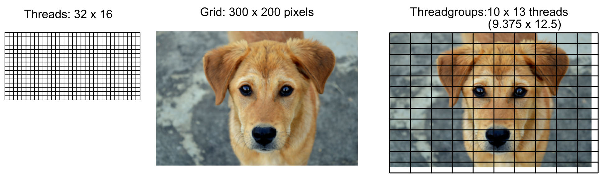
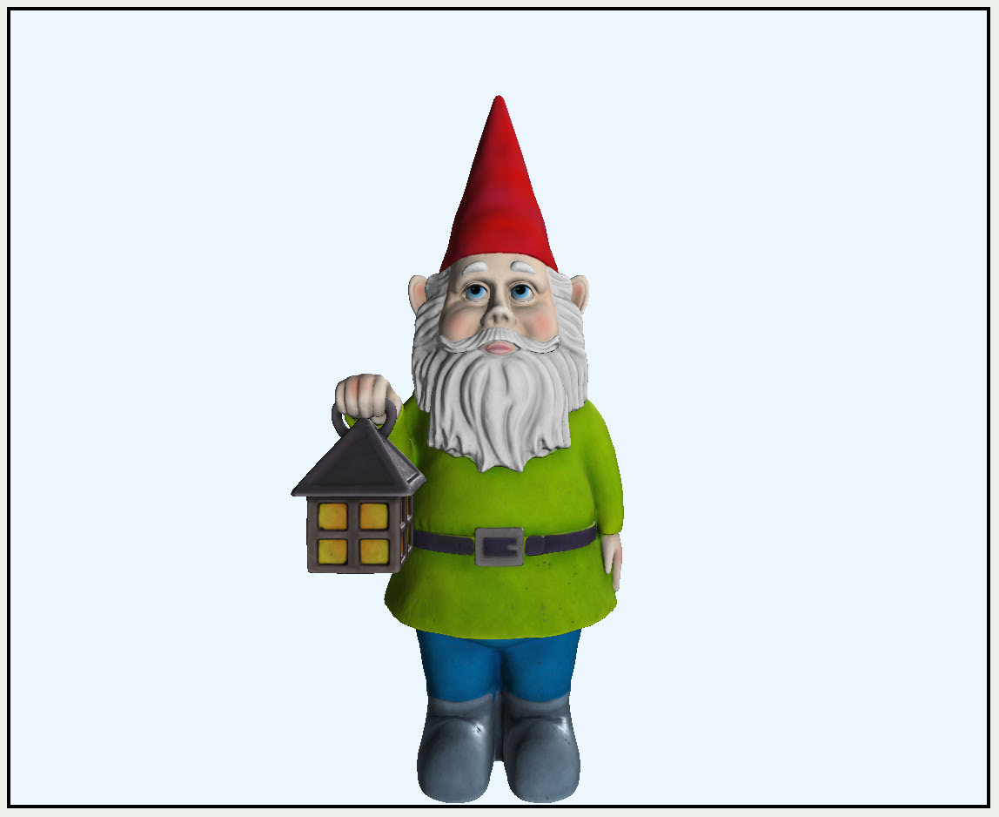

# GPU Compute 
Programming

General Purpose GPU (GPGPU) programming uses the many-core GPU architecture 
to speed up parallel computation. Data-parallel compute processing is useful when 
you have large chunks of data and need to perform the same operation on each 
chunk. Examples include machine learning, scientific simulations, ray tracing and 
image/video processing.

In this chapter, you’ll perform some simple GPU programming and explore how to 
use the GPU in ways other than vertex rendering.

402

Metal by Tutorials
Chapter 16: GPU Compute Programming

The Starter Project

➤ Open Xcode and build and run this chapter’s starter project.

The scene contains a lonely garden gnome. The renderer is a simplified forward 
renderer with no shadows.

The starter project

From this render, you might think that the gnome is holding the lamp in his left 
hand. Depending on how you render him, he can be ambidextrous.

➤ Press 1 on your keyboard.

The view changes to the front view. However, the gnome faces towards positive z 
instead of toward the camera.

Facing backwards

403

Metal by Tutorials
Chapter 16: GPU Compute Programming

The way the gnome renders is due to both math and file formats. In Chapter 6, 
“Coordinate Spaces”, you learned that this book uses a left-handed coordinate 
system. This USD file expects a right-handed coordinate system.

If you want a right-handed gnome, there are a few ways to solve this issue:

1. Rewrite all of your coordinate positioning.

2. In vertex_main, invert position.z when rendering the model.

3. On loading the model, invert position.z.

If all of your models are reversed, option #1 or #2 might be good. However, if you 
only need some models reversed, option #3 is the way to go. All you need is a fast 
parallel operation. Thankfully, one is available to you using the GPU.

Note: Ideally, you would convert the model as part of your model pipeline 
rather than in your final app. After flipping the vertices, you can write the 
model out to a new file.

Winding Order and Culling

Inverting the z position will flip the winding order of vertices, so you may need to 
consider this. When Model I/O reads in the model, the vertices are in clockwise 
winding order.

➤ To demonstrate this, open ForwardRenderPass.swift.

➤ In draw(commandBuffer:scene:uniforms:params:), add this code after 
renderEncoder.setRenderPipelineState(pipelineState):

renderEncoder.setFrontFacing(.counterClockwise) 
renderEncoder.setCullMode(.back)

Here, you tell the GPU to expect vertices in counterclockwise order. The default is 
clockwise. You also tell the GPU to cull any faces that face away from the camera. As 
a general rule, you should cull back faces since they’re usually hidden, and rendering 
them isn’t necessary.

404

Metal by Tutorials
Chapter 16: GPU Compute Programming

➤ Build and run the app.

Rendering with incorrect winding order

Because the winding order of the mesh is currently clockwise, the GPU is culling the 
wrong faces, and the model appears to be inside-out. Rotate the model to see this 
more clearly. Inverting the z coordinates will correct the winding order.

Reversing the Model on the CPU

Before working out the parallel algorithm for the GPU, you’ll first explore how to 
reverse the gnome on the CPU. You’ll compare the performance with the GPU result. 
In the process, you’ll learn how to access and change Swift data buffer contents with 
pointers.

➤ In the Geometry group, open VertexDescriptor.swift. Take a moment to refresh 
your memory about the layout in which Model I/O loads the model buffers in 
defaultLayout.

Five buffers are involved, but you’re only interested in the first one, VertexBuffer. 
It consists of a float3 for Position and a float3 for Normal. You don’t need to 
consider UVs because they’re in the next layout.

➤ In the Shaders group, open Common.h, and add a new structure:

struct VertexLayout { 
  vector_float3 position; 
  vector_float3 normal; 
};

405

Metal by Tutorials
Chapter 16: GPU Compute Programming

This structure matches the layout in the vertex descriptor for buffer 0. You’ll use it to 
read the loaded mesh buffer.

➤ In the Game group, open GameScene.swift, and add a new method to GameScene:

mutating func convertMesh(_ model: Model) { 
  let startTime = CFAbsoluteTimeGetCurrent() 
  for mesh in model.meshes { 
    // 1 
    let vertexBuffer = mesh.vertexBuffers[VertexBuffer.index] 
    let count = 
      vertexBuffer.length / MemoryLayout<VertexLayout>.stride 
    // 2 
    var pointer = vertexBuffer 
      .contents() 
      .bindMemory(to: VertexLayout.self, capacity: count) 
    // 3 
    for _ in 0..<count { 
      // 4 
      pointer.pointee.position.z = -pointer.pointee.position.z 
      // 5 
      pointer = pointer.advanced(by: 1) 
    } 
  } 
  // 6 
  print("CPU Time:", CFAbsoluteTimeGetCurrent() - startTime) 
}

Here’s a code breakdown:

1. First, you find the number of vertices in the vertex buffer. You calculate the 
number of vertices in the model by dividing the buffer length by the size of the 
vertex attribute layout. The result should match the number of vertices in the 
file. There are 15949 for the gnome.

2.
vertexBuffer.contents() returns a MTLBuffer. You bind the buffer contents 
to pointer, making pointer an UnsafeMutablePointer<VertexLayout>.

3. You then iterate through each vertex.

4. The pointee is an instance of VertexLayout, and you invert the z position.

5. You then advance the pointer to the next vertex instance and continue.

6. Finally, you print out the time taken to do the operation.

406

Metal by Tutorials
Chapter 16: GPU Compute Programming

Note: If you’re unfamiliar with Swift pointers, read our article Unsafe Swift: 
Using Pointers and Interacting With C (https://www.kodeco.com/7181017-
unsafe-swift-using-pointers-and-interacting-with-c).

➤ Add this code to the end of init() to call the new method:

➤ Build and run the app.

A right-handed gnome

The gnome is now right-handed. On my M1 MacBook Pro, the time taken was 
0.00392. That’s pretty fast, but the gnome is a small model with only sixteen 
thousand vertices.

Look for operations you could possibly do in parallel and process with a GPU kernel. 
Within the for loop, you perform the same operation on every vertex 
independently, so it’s a good candidate for GPU compute. Independently is the 
critical word, as GPU threads perform operations independently from each other.

Compute Processing

In many ways, compute processing is similar to the render pipeline. You set up a 
command queue and a command buffer. In place of the render command encoder, 
compute uses a compute command encoder. Instead of using vertex or fragment 
functions in a compute pass, you use a kernel function. Threads are the input to 
the kernel function, and the kernel function operates on each thread.

407

Metal by Tutorials
Chapter 16: GPU Compute Programming

Threads and Threadgroups

To determine how many times you want the kernel function to run, you need to 
know the size of the array, texture or volume you want to process. This size is the 
grid and consists of threads organized into threadgroups.

The grid is defined in three dimensions: width, height and depth. But often, 
especially when you’re processing images, you’ll only work with a 1D or 2D grid. 
Every point in the grid runs one instance of the kernel function, each on a separate 
thread.

➤ Look at the following example image:

Threads and threadgroups

The image is 512×384 pixels. You need to tell the GPU the number of threads per grid 
and the number of threads per threadgroup.

Threads per grid: In this example, the grid is two dimensions, and the number of 
threads per grid is the image size of 512 by 384.

Threads per threadgroup: Specific to the device, the pipeline state’s 
threadExecutionWidth suggests the best width for performance, and 
maxTotalThreadsPerThreadgroup specifies the maximum number of threads in a 
threadgroup. On a device with 512 as the maximum number of threads, and a thread 
execution width of 32, the optimal 2d threadgroup size would have a width of 32 and 
a height of 512 / 32 = 16. So the threads per threadgroup will be 32 by 16.

408

Metal by Tutorials
Chapter 16: GPU Compute Programming

In this case, the compute dispatch code looks something like this:

let threadsPerGrid = MTLSize(width: 512, height: 384, depth: 1) 
let width = pipelineState.threadExecutionWidth 
let threadsPerThreadgroup = MTLSize( 
  width: width, 
  height: pipelineState.maxTotalThreadsPerThreadgroup / width, 
  depth: 1) 
computeEncoder.dispatchThreads( 
  threadsPerGrid, 
  threadsPerThreadgroup: threadsPerThreadgroup)

You specify the threads per grid and let the pipeline state work out the optimal 
threads per threadgroup.

Non-uniform Threadgroups

The threads and threadgroups work out evenly across the grid in the previous image 
example. However, if the grid size isn’t a multiple of the threadgroup size, Metal 
provides non-uniform threadgroups.

Non-uniform threadgroups

Non-uniform threadgroups are only a feature of the Apple GPU family 4 and 
onwards. The feature set was introduced with A11 devices running iOS 11. A11 chips 
first appeared in iPhone 8.

Threadgroups per Grid

You can choose how you split up the grid. Threadgroups have the advantage of 
executing a group of threads together and also sharing a small chunk of memory. It’s 
common to organize threads into threadgroups to work on smaller parts of the 
problem independently from other threadgroups.

409

Metal by Tutorials
Chapter 16: GPU Compute Programming

In the following image, a 16 by 12 grid is split first into 2✕3 threadgroups and then 
into 4✕4 thread groups.

Threadgroups in a 2D grid

In the kernel function, you can locate each pixel in the grid. The red pixel in both 
grids is located at (11, 1).

You can also uniquely identify each thread within the threadgroup. The blue 
threadgroup on the left is located at (1, 0) and on the right at (2, 0). The red 
pixels in both grids are threads located within their own threadgroup at (3, 1).

You have control over the number of threadgroups. However, you need to add an 
extra threadgroup to the size of the grid to make sure at least one threadgroup 
executes.

Using the cat image example, you could choose to set up the threadgroups in the 
compute dispatch like this:

let width = 32 
let height = 16 
let threadsPerThreadgroup = MTLSize( 
  width: width, height: height, depth: 1) 
let gridWidth = 512 
let gridHeight = 384 
let threadGroupCount = MTLSize( 
  width: (gridWidth + width - 1) / width, 
  height: (gridHeight + height - 1) / height, 
  depth: 1) 
computeEncoder.dispatchThreadgroups( 
  threadGroupCount, 
  threadsPerThreadgroup: threadsPerThreadgroup)

You specify the threads per threadgroup. In this case, the threadgroup will consist of 
32 threads wide, 16 threads high and 1 thread deep.

If the size of your data does not match the size of the grid, you may have to perform 
boundary checks in the kernel function.

410

Metal by Tutorials
Chapter 16: GPU Compute Programming

In the following example, with a threadgroup size of 32 by 16 threads, the number of 
threadgroups necessary to process the image would be 10 by 13. You’d have to check 
that the threadgroup isn’t using threads that are off the edge of the image.

Underutilized threads

The threads that are off the edge are underutilized. That is, they’re threads that you 
dispatched, but there was no work for them to do.

Reversing the Gnome Using GPU Compute 
Processing

The previous example was a two-dimensional image, but you can create grids in one, 
two or three dimensions. The gnome problem acts on an array in a buffer and will 
require a one-dimensional grid.

➤ In the Geometry group, open Model.swift, and add a new method to Model:

func convertMesh() { 
// 1 
  guard let commandBuffer = 
    Renderer.commandQueue.makeCommandBuffer(), 
    let computeEncoder = 
commandBuffer.makeComputeCommandEncoder() 
      else { return } 
  // 2 
  let startTime = CFAbsoluteTimeGetCurrent() 
  // 3 
  let pipelineState: MTLComputePipelineState 
  do { 
    // 4 
    guard let kernelFunction = 
      Renderer.library.makeFunction(name: "convert_mesh") else { 
        fatalError("Failed to create kernel function") 
      }

411

Metal by Tutorials
Chapter 16: GPU Compute Programming

// 5 
    pipelineState = try 
      Renderer.device.makeComputePipelineState( 
        function: kernelFunction) 
  } catch { 
    fatalError(error.localizedDescription) 
  } 
  computeEncoder.setComputePipelineState(pipelineState) 
}

Going through the code:

1. You create the compute command encoder the same way you created the render 
command encoder.

2. You add a start time to see how long the conversion takes to execute.

3. For compute processing, you use a compute pipeline state. This requires fewer 
state changes on the GPU, so you don’t need a descriptor.

4. Soon, you’ll create the kernel function convert_mesh.

5. Finally, you create the pipeline state using the kernel function. You then set the 
GPU pipeline state in the compute encoder.

➤ Continue by adding the following code to the end of convertMesh():

for mesh in meshes { 
  let vertexBuffer = mesh.vertexBuffers[VertexBuffer.index] 
  computeEncoder.setBuffer(vertexBuffer, offset: 0, index: 0) 
  let vertexCount = vertexBuffer.length / 
    MemoryLayout<VertexLayout>.stride 
}

Just as you did in the earlier CPU version, you calculate the vertex count, which is the 
number of threads required.

Setting up Threadgroups

➤ Within the previous for loop closure, continue with:

let threadsPerGroup = MTLSize( 
  width: pipelineState.threadExecutionWidth, 
  height: 1, 
  depth: 1) 
let threadsPerGrid = MTLSize(width: vertexCount, height: 1, 
depth: 1) 
computeEncoder.dispatchThreads(

412

Metal by Tutorials
Chapter 16: GPU Compute Programming

threadsPerGrid, 
  threadsPerThreadgroup: threadsPerGroup) 
computeEncoder.endEncoding()

You set up the grid and threadgroup the same way as the initial image example. 
Since your model’s vertices are a one-dimensional array, you only set up width. 
Then, you extract the device-dependent thread execution width from the pipeline 
state to get the number of threads in a thread group. The grid size is the number of 
vertices in the model.

The dispatch call is the compute command encoder’s equivalent to the render 
command encoder’s draw call. The GPU will execute the kernel function specified in 
the pipeline state when you commit the command buffer.

Performing Code After Completing GPU 
Execution

The command buffer can execute a closure after its GPU operations have finished.

➤ Outside the for loop, add this code at the end of convert_mesh():

commandBuffer.addCompletedHandler { _ in 
  print( 
    "GPU conversion time:", 
    CFAbsoluteTimeGetCurrent() - startTime) 
} 
commandBuffer.commit()

You supply a closure that calculates the amount of time the procedure takes and 
print it out. You then commit the command buffer to the GPU.

The Kernel Function

That completes the Swift setup. You simply specify the kernel function to the 
pipeline state and create an encoder using that pipeline state. With that, it’s only 
necessary to give the thread information to the encoder. The rest of the action takes 
place inside the kernel function.

413

Metal by Tutorials
Chapter 16: GPU Compute Programming

➤ In the Shaders group, create a new Metal file named ConvertMesh.metal, and 
add:

#import "Common.h" 
 
kernel void convert_mesh( 
  device VertexLayout *vertices [[buffer(0)]], 
  uint id [[thread_position_in_grid]]) 
{ 
  vertices[id].position.z = -vertices[id].position.z; 
}

A kernel function can’t have a return value. Using the thread_position_in_grid 
attribute, you pass in the vertex buffer and identify the thread ID using the 
thread_position_in_grid attribute. You then invert the vertex’s z position.

This function will execute for every vertex in the model.

➤ Open GameScene.swift. In init(), replace convertMesh(gnome) with:

➤ Build and run the app. Press the 1 key for the front view of the model.

A right-handed gnome

The console prints out the time of GPU processing. You’ve had your first experience 
with data-parallel processing, and the gnome is now right-handed and faces toward 
the camera.

414

Metal by Tutorials
Chapter 16: GPU Compute Programming

Compare the time with the CPU conversion. On my M1 MacBook Pro, the GPU 
conversion time is 0.00138. Always check the comparative times, as setting up a 
GPU pipeline is a time cost. It may take less time to perform the operation on the 
CPU on small operations.

Atomic Functions

Kernel functions perform operations on individual threads. However, you may want 
to perform an operation that requires information from other threads. For example, 
you might want to find out the total number of vertices your kernel worked on.

Your kernel function operates on each thread independently, and these threads 
update each vertex position simultaneously. If you send the kernel function a 
variable to store the total in a buffer, the function can increment the total, but other 
threads will be doing the same thing simultaneously. Therefore you won’t get the 
correct total.

An atomic operation works in shared memory and is visible to other threads.

➤ Open Model.swift. In convertMesh(), add the following code before for mesh 
in meshes:

let totalBuffer = Renderer.device.makeBuffer( 
  length: MemoryLayout<Int>.stride, 
  options: []) 
let vertexTotal = totalBuffer?.contents().bindMemory(to: 
Int.self, capacity: 1) 
vertexTotal?.pointee = 0 
computeEncoder.setBuffer(totalBuffer, offset: 0, index: 1)

Here, you create a buffer to hold the total number of vertices. You bind the buffer to 
a pointer and set the contents to zero. You then send the buffer to the GPU.

➤ Still in convertMesh(), add this code to the command buffer’s completion 
handler:

You print out the contents of the buffer, which contains the total number of vertices.

➤ Open ConvertMesh.metal and add this code to convert_mesh’s parameters:

415

Metal by Tutorials
Chapter 16: GPU Compute Programming

➤ Then, add this code to the end of the function:

You add one to vertexTotal each time the function executes.

➤ Build and run the app. Check the debug console output.

GPU conversion time: 0.0012869834899902344 
Total Vertices: 2

Each time you run the app, you’ll get a different incorrect result depending on how 
the GPU scheduled the threads. The threads add one to the buffer at precisely the 
same time before the buffer can store the values from the other threads.

➤ Still in ConvertMesh.metal, change the vertexTotal parameter to:

Instead of an int, you define an atomic_int, telling the GPU that this will work in 
shared memory.

➤ Replace vertexTotal++ with:

atomic_fetch_add_explicit(&vertexTotal, 1, 
memory_order_relaxed);

Since you can’t do simple operations on the atomic variable anymore, you call the 
built-in function that takes in vertexTotal as the first parameter and the amount to 
add as the second parameter.

➤ Build and run the app.

Now the correct number of vertices prints out in the debug console.

GPU conversion time: 0.0013600587844848633 
Total Vertices: 15949

There are various atomic functions, and you can find out more about them in 
Chapter 6.15.2, “Atomic Functions” in Apple’s Metal Shading Language Specification 
(https://apple.co/3zLTwve)

With this simple introduction to compute shaders, you’re ready for the next few 
chapters, where you’ll create stunning particle effects and even control some strange 
creatures called boids.

416

Metal by Tutorials
Chapter 16: GPU Compute Programming

Key Points

• GPU compute, or general purpose GPU programming, helps you perform data 
operations in parallel without using the more specialized rendering pipeline.

• You can move any task that operates on multiple items independently to the GPU. 
Later, you’ll see that you can even move the repetitive task of rendering a scene to 
a compute shader.

• GPU memory is good at simple parallel operations, and with Apple silicon, you can 
keep chained operations in tile memory instead of moving them back to system 
memory.

• Compute processing uses a compute pipeline with a kernel function.

• The kernel function operates on a grid of threads organized into threadgroups. 
This grid can be 1D, 2D or 3D.

• Atomic functions allow inter-thread operations.

417

17