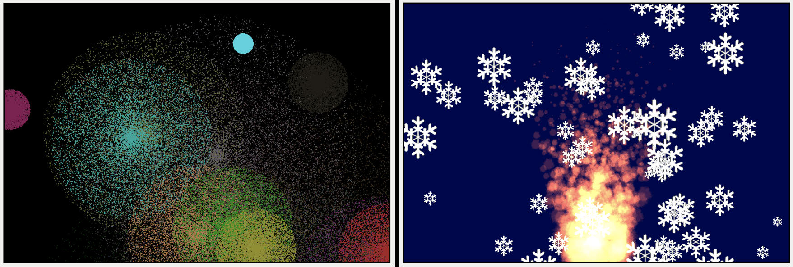
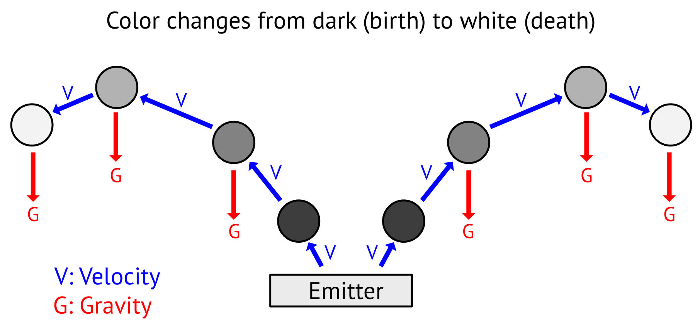
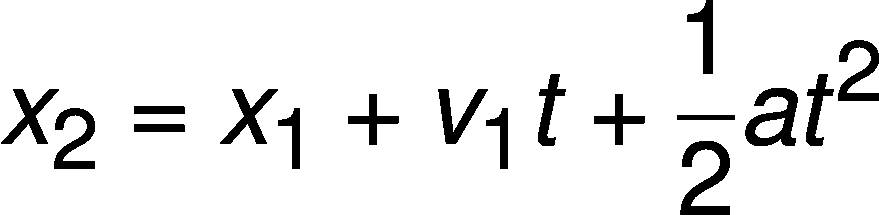
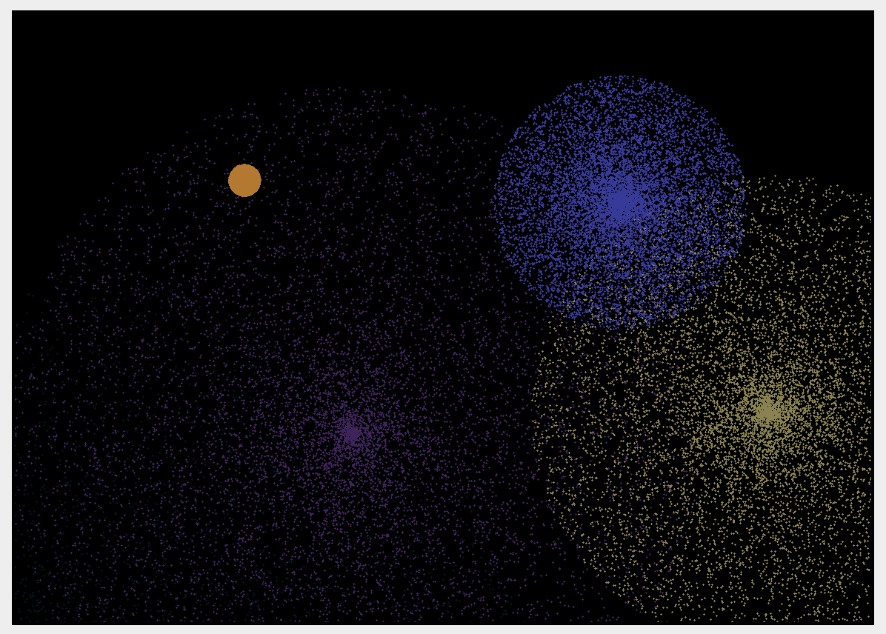
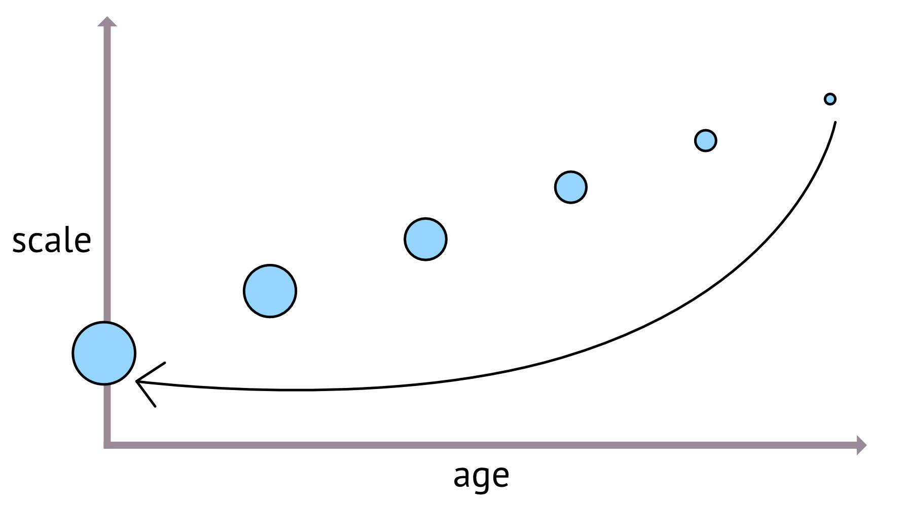
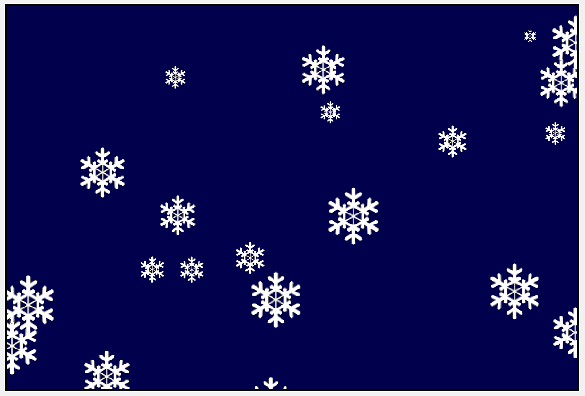
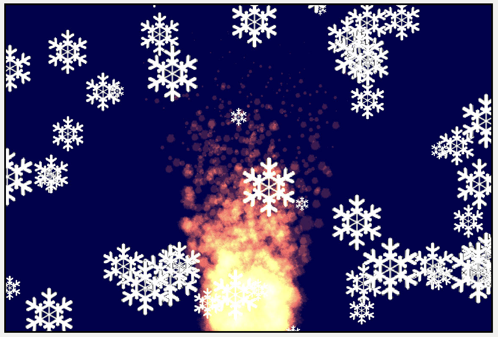

# Particle 
Systems

One of the many ways to create art and present science in code is by making use of 
particles. A particle is a tiny graphical object that carries basic information about 
itself such as color, position, life, speed and direction of movement.

Nothing explains a visual effect better than an image showing what you’ll be able to 
achieve at the end of this chapter:

Particle systems

Particle systems are widely used in:

• Video games and animation: hair, cloth, fur.

• Modeling of natural phenomena: fire, smoke, water, snow.

• Scientific simulations: galaxy collisions, cellular mitosis, fluid turbulence.

418

Metal by Tutorials
Chapter 17: Particle Systems

Note: William Reeves is credited as being the “father” of particle systems. 
While at Lucasfilm, Reeves created the Genesis Effect in 1982 while working on 
the movie Star Trek II: The Wrath of Khan. Later, he joined Pixar Animation 
Studios where he’s still creating amazing animations using particles.

In a moment, you’ll get your feet wet trying out one such practical application: 
fireworks. But first, what exactly is a particle?

Particle

Newtonian dynamics describe the relationship between any small body — a particle 
— and the forces acting upon it, as well as its motion in response to those forces. 
Newton’s three laws of motion define the relationship between them. The first two 
laws define motion as a result of either inertia or force interference upon the 
particle’s current state of motion (stationary or moving). You’ll be working with 
them in this chapter. The third law, however, defines motion as a reaction of two or 
more particles interacting with each other. You’ll work with this law in Chapter 18, 
“Particle Behavior”.

A fourth law, if you wish, is the law of life. It’s not one of the Newtonian motion laws, 
but it does indeed apply to particles. Particles are born. They move and interact with 
the environment, and then they die.

Particle life

You need a particle system to create fireworks. But first, you need to define a particle 
that has — at a minimum — a position, direction, speed, color and life. What makes a 
particle system cohesive, though, are emitters.

419

Metal by Tutorials
Chapter 17: Particle Systems

Emitter

An emitter is nothing more than a particle generator — in other words, a source of 
particles. You can make your particle system more exciting by having several 
emitters shooting out particles from different positions.

Fireworks are sequential explosions that occur a few seconds apart from each other, 
so you will create several emitters.

The Starter Project

➤ In Xcode, open the starter project for this chapter, then build and run it.

The starter project

The project contains an empty scene, rendering with the forward renderer that 
you’re already familiar with. The dark blue color comes from setting 
metalView.clearColor in Renderer.init(metalView:options:).

• The Fireworks group is where you’ll create your first particle system.

• The Particles group contains two files that you’ll use later in the chapter.

• In the Textures group, Textures.xcassets contains two sprite textures that you’ll 
attach to particle systems.

• Renderer is already set up with skeleton structures to render fireworks and 
particles.

• PipelineStates contains a factory method to create a particle render pipeline 
state.

420

Metal by Tutorials
Chapter 17: Particle Systems

Creating a Particle and Emitter

➤ In the Shaders group, open Common.h, and add a new structure:

struct Particle { 
  vector_float2 position; 
  float direction; 
  float speed; 
  vector_float4 color; 
  float life; 
};

This structure holds the properties for each particle.

➤ In the Fireworks group, create a new Swift file called FireworksEmitter.swift, 
and replace the code with this:

import MetalKit

struct FireworksEmitter { 
  let particleBuffer: MTLBuffer 
 
  init( 
    particleCount: Int, 
    size: CGSize, 
    life: Float 
  ) { 
    let bufferSize = 
      MemoryLayout<Particle>.stride * particleCount 
    particleBuffer = 
      Renderer.device.makeBuffer(length: bufferSize)! 
  } 
}

This code takes in the particle count and the particle’s lifetime. You then create the 
buffer that will hold all the particle data.

You’ll randomize the initial position and color once for all particles, and then 
randomize each particle’s speed and direction based on the size of the display area.

➤ Add the following code to init(particleCount:size:life:):

let width = Float(size.width) 
let height = Float(size.height) 
let position = float2( 
  Float.random(in: 0...width), 
  Float.random(in: 0...height)) 
let color = float4( 
  Float.random(in: 0...life) / life,

421

Metal by Tutorials
Chapter 17: Particle Systems

Float.random(in: 0...life) / life, 
  Float.random(in: 0...life) / life, 
  1)

You set up initial properties for the emitter. Each firework emitter will have a 
random position where all the particles will start. All particles will have the same 
random color.

➤ Continue adding the following code after the code you just added:

var pointer = 
  particleBuffer.contents().bindMemory( 
    to: Particle.self, 
    capacity: particleCount) 
for _ in 0..<particleCount { 
  let direction = 
    2 * Float.pi * Float.random(in: 0...width) / width 
  let speed = 3 * Float.random(in: 0...width) / width 
  pointer.pointee.position = position 
  pointer.pointee.direction = direction 
  pointer.pointee.speed = speed 
  pointer.pointee.color = color 
  pointer.pointee.life = life 
  pointer = pointer.advanced(by: 1) 
}

Here, you loop through the buffer using a pointer to access each particle object and 
set their properties.

You’ve now created lots of particles, each with distinct direction and speed. All of 
them have the same original position, color and life.

➤ In the Fireworks group, open Fireworks.swift.

This file contains two methods that you’ll fill out shortly. Renderer calls these on 
each frame.

➤ Add these properties to Fireworks:

let particleCount = 10000 
let maxEmitters = 8 
var emitters: [FireworksEmitter] = [] 
let life: Float = 256 
var timer: Float = 0

You’ll set up an array of emitters, each with 10,000 particles.

422

Metal by Tutorials
Chapter 17: Particle Systems

➤ Add this code to update(size:):

timer += 1 
if timer >= 50 { 
  timer = 0 
  if emitters.count > maxEmitters { 
    emitters.removeFirst() 
  } 
  let emitter = FireworksEmitter( 
    particleCount: particleCount, 
    size: size, 
    life: life) 
  emitters.append(emitter) 
}

You reset a timer variable every time it reaches a threshold (50 in this case). At that 
point, you add a new emitter and then remove the oldest one.

➤ Build and run the app to verify everything is working. Note, however, you’ll see 
the same solid dark blue color as you did in the beginning as you’re not doing any 
drawing yet.

The shader function is where you’ll update the particles’ life and position. Each of 
the particles is updated independently, and so will work well with the granular 
control of GPU threads in compute encoding!

The Compute Pipeline State Object

➤ Open Pipelines.swift and add this to PipelineStates:

static func createComputePSO(function: String) 
  -> MTLComputePipelineState { 
  guard let kernel = Renderer.library.makeFunction(name: 
function) 
  else { fatalError("Unable to create \(function) PSO") } 
  let pipelineState: MTLComputePipelineState 
  do { 
    pipelineState = 
    try Renderer.device.makeComputePipelineState(function: 
kernel) 
  } catch { 
    fatalError(error.localizedDescription) 
  } 
  return pipelineState 
}

423

Metal by Tutorials
Chapter 17: Particle Systems

As you learned in the previous chapter, for a compute pipeline state, you don’t need 
a pipeline state descriptor. You simply create the pipeline state directly from the 
kernel function. You’ll be able to use this method to create compute pipeline state 
objects using only the name of the kernel.

The Fireworks Pass

➤ Open Fireworks.swift, and add the pipeline states and initializer:

let clearScreenPSO: MTLComputePipelineState 
let fireworksPSO: MTLComputePipelineState

init() { 
  clearScreenPSO = 
    PipelineStates.createComputePSO(function: "clearScreen") 
  fireworksPSO = 
    PipelineStates.createComputePSO(function: "fireworks") 
}

When you display your particles on the screen, you’ll write them to the drawable 
texture. Because you’re not going through the render pipeline, you will need to clear 
the texture to a night sky black. You’ll do this in a simple compute shader.

Note: In this particular application, because you’re using the drawable 
texture, you could set the initial metal view’s clear color to black instead of 
running a clear screen kernel function. But clearing the drawable texture will 
give you practice in using a 2D grid, and the skill to clear other textures too.

After clearing the screen, you’ll then be able to calculate the fireworks particles.

You will require a different kernel function for each process, requiring two different 
pipeline state objects.

424

Metal by Tutorials
Chapter 17: Particle Systems

Clearing the Screen

The clear screen kernel function will run on every pixel in the drawable texture. The 
texture has a width and height, and is therefore a two dimensional grid.

➤ Still in Fireworks.swift, add this to draw(commandBuffer:view:):

// 1 
guard let computeEncoder = 
commandBuffer.makeComputeCommandEncoder(), 
  let drawable = view.currentDrawable 
  else { return } 
computeEncoder.setComputePipelineState(clearScreenPSO) 
computeEncoder.setTexture(drawable.texture, index: 0) 
// 2 
var threadsPerGrid = MTLSize( 
  width: Int(view.drawableSize.width), 
  height: Int(view.drawableSize.height), 
  depth: 1) 
// 3 
let width = clearScreenPSO.threadExecutionWidth 
var threadsPerThreadgroup = MTLSize( 
  width: width, 
  height: clearScreenPSO.maxTotalThreadsPerThreadgroup / width, 
  depth: 1) 
// 4 
computeEncoder.dispatchThreads( 
  threadsPerGrid, 
  threadsPerThreadgroup: threadsPerThreadgroup) 
computeEncoder.endEncoding()

Going through the code:

1. You create the compute command encoder and set its pipeline state. You also 
send the drawable texture to the GPU at index 0 for writing.

2. The grid size is the drawable’s width by the drawable’s height.

3. Using the pipeline state thread values, you calculate the number of threads per 
threadgroup.

4. You dispatch these threads to do the work in parallel on the GPU.

➤ In the Shaders group, create a new Metal file named Fireworks.metal, and add 
the kernel functions you set up in your pipeline states:

#import "Common.h" 
 
kernel void clearScreen(

425

Metal by Tutorials
Chapter 17: Particle Systems

texture2d<half, access::write> output [[texture(0)]], 
  uint2 id [[thread_position_in_grid]]) 
{ 
  output.write(half4(0.0, 0.0, 0.0, 1.0), id); 
} 
 
kernel void fireworks() 
{ }

clearScreen takes, as arguments, the drawable texture you sent from the CPU and 
the 2D thread index. You specify in the parameter that you will need write access. 
Then, you write the color black into the drawable texture for each thread/pixel.

The kernel function’s id parameter uses the [[thread_position_in_grid]] 
attribute qualifier which uniquely locates a thread within the compute grid and 
enables it to work distinctly from the others. In this case, it identifies each pixel in 
the texture.

You’ll return and fill out fireworks shortly.

➤ Open Renderer.swift, and add this at the end of init(metalView:options:):

Because you’re writing to the view’s drawable texture in clearScreen, you need to 
change the underlying render target usage by enabling writing to the frame buffer.

➤ Take a look at draw(scene:in:).

Renderer is already set up to call fireworks(update:size:) and 
fireworks.draw(commandBuffer:view:).

➤ Build and run the app.

clearScreen writes the color to the view’s drawable texture, so you’ll finally see the 
view color turns from blue to a night sky ready to display your fireworks.

Drawable cleared to black

426

Metal by Tutorials
Chapter 17: Particle Systems

Dispatching the Particle Buffer

Now that you’ve cleared the screen, you’ll set up a new encoder to dispatch the 
particle buffer to the GPU.

➤ Open Fireworks.swift, and add this to the end of draw(commandBuffer:view:):

// 1 
guard let particleEncoder = 
commandBuffer.makeComputeCommandEncoder() 
  else { return } 
particleEncoder.setComputePipelineState(fireworksPSO) 
particleEncoder.setTexture(drawable.texture, index: 0) 
// 2 
threadsPerGrid = MTLSize(width: particleCount, height: 1, depth: 
1) 
for emitter in emitters { 
  // 3 
  let particleBuffer = emitter.particleBuffer 
  particleEncoder.setBuffer(particleBuffer, offset: 0, index: 0) 
  threadsPerThreadgroup = MTLSize( 
    width: fireworksPSO.threadExecutionWidth, 
    height: 1, 
    depth: 1) 
  particleEncoder.dispatchThreads( 
    threadsPerGrid, 
    threadsPerThreadgroup: threadsPerThreadgroup) 
} 
particleEncoder.endEncoding()

This code is very similar to the previous compute encoder setup:

1. You create a second command encoder and set the particle pipeline state and 
drawable texture to it.

2. You change the dimensionality from 2D to 1D and set the number of threads per 
grid to equal the number of particles.

3. You dispatch threads for each emitter in the array.

Since your threadsPerGrid is now 1D, you’ll need to match 
[[thread_position_in_grid]] in the shader kernel function with a uint 
parameter. Threads will not be dispatched for each pixel anymore but rather for each 
particle, so [[thread_position_in_grid]] in this case will only affect a particular 
pixel in the drawable texture if there is a particle positioned at that pixel.

All right, time for some physics chatter!

427

Metal by Tutorials
Chapter 17: Particle Systems

Particle Dynamics

Particle dynamics makes heavy use of Newton’s laws of motion. Particles are 
considered to be small objects approximated as point masses. Since volume is not 
something that characterizes particles, scaling or rotational motion will not be 
considered. Particles will, however, make use of translation motion so they’ll always 
need to have a position.

Besides a position, particles might also have a direction and speed of movement 
(velocity), forces that influence them (e.g., gravity), a mass, a color and an age. Since 
the particle footprint is so small in memory, modern GPUs can generate 4+ million 
particles, and they can follow the laws of motion at 60 fps.

For now, you’re going to ignore gravity, so its value will be 0. Time in this example 
won’t change so it will have a value of 1. As a consequence, velocity will always be 
the same. You can also assume the particle mass is always 1, for convenience.

To calculate the position, you use this formula:

Where x2 is the new position, x1 is the old position, v1 is the old velocity, t is time, 
and a is acceleration.

This is the formula to calculate the new velocity from the old one:

However, since the acceleration is 0 in the fireworks example, the velocity will 
always have the same value.

As you might remember from Physics class, the formula for velocity is:

Plugging all this information into the first formula above gives you the final 
equation to use in the kernel.

Again, as for the second formula, since acceleration is 0, the last term cancels out:

428

Metal by Tutorials
Chapter 17: Particle Systems

Finally, you’re creating exploding fireworks, so your firework particles will move in a 
circle that keeps growing away from the initial emitter origin, so you need to know 
the equation of a circle:

Using the angle that the particle direction makes with the axes, you can re-write the 
velocity equation from the parametric form of the circle equation using the 
trigonometric functions sine and cosine as follows:

xVelocity = speed * cos(direction) 
yVelocity = speed * sin(direction)

Great! Why don’t you write all this down in code now?

Implementing Particle Physics

➤ Open Fireworks.metal and replace fireworks with:

kernel void fireworks( 
  texture2d<half, access::write> output [[texture(0)]], 
  // 1 
  device Particle *particles [[buffer(0)]], 
  uint id [[thread_position_in_grid]]) { 
  // 2 
  float xVelocity = particles[id].speed 
    * cos(particles[id].direction); 
  float yVelocity = particles[id].speed 
    * sin(particles[id].direction) + 3.0; 
  particles[id].position.x += xVelocity; 
  particles[id].position.y += yVelocity; 
  // 3 
  particles[id].life -= 1.0; 
  half4 color; 
  color = half4(particles[id].color) * particles[id].life / 
255.0; 
  // 4 
  color.a = 1.0; 
  uint2 position = uint2(particles[id].position); 
  output.write(color, position); 
  output.write(color, position + uint2(0, 1)); 
  output.write(color, position - uint2(0, 1)); 
  output.write(color, position + uint2(1, 0)); 
  output.write(color, position - uint2(1, 0)); 
}

429

Metal by Tutorials
Chapter 17: Particle Systems

Going through this code:

1. Get the particle buffer from the CPU and use a 1D index to match the grid 
dimensions you dispatched earlier.

2. Compute the velocity and update the position for the current particle according 
to the laws of motion and using the circle equation as explained above.

3. Update the life variable and compute a new color after each update. The color 
will fade as the value held by the life variable gets smaller and smaller.

4. Write the updated color at the current particle position, as well as its neighboring 
particles to the left, right, top and bottom to create the look and feel of a thicker 
particle.

➤ Build and run the app, and finally you get to enjoy some fireworks!

Fireworks!

You can improve the realism of particle effects in at least a couple of ways. One of 
them is to attach a sprite or a texture to each particle in a render pass. Instead of a 
dull point, you’ll then be able to see a textured point which looks way more lively.

You can practice this technique in the next particle endeavor: a snowing simulation.

Particle Systems

The fireworks particle system was tailor-made for fireworks. However, particle 
systems can be very complex with many different options for particle movement, 
colors and sizes. In the Particles group, the Emitter class in the starter project is a 
simple example of a generic particle system where you can create many different 
types of particles using a particle descriptor.

430

Metal by Tutorials
Chapter 17: Particle Systems

For example, you’re going to create snow falling, but also a fire blazing upwards. 
These particle systems will have different speeds, textures and directions.

➤ In the Particles group, open ParticleEffects.swift, and examine the 
ParticleDescriptor structure.

To create a particle system, you first create a descriptor which describes all the 
characteristics of each individual particle.

Many of the properties in ParticleDescriptor are ClosedRanges. For example, as 
well as position, there is a positionXRange and positionYRange. This allows you 
to specify a starting position but also allows randomness within limits. If you specify 
a position of [10, 0], and a positionXRange of 0...180, then each particle will be 
within the range of 10 to 190.

Each particle has a startScale and an endScale. By setting the startScale to 1 
and the endScale to 0, you can make the particle get smaller over its lifespan.

Scaling over time

➤ Open Emitter.swift.

When you create the emitter, you’ll specify the particle descriptor along with these 
properties:

• texture: You’ll render this texture for each particle using the particle coordinates.

• particleCount: The total number of particles.

• birthRate: How many particles should generate at one time.

• birthDelay: Delays particle generation. This allows you to slowly release particles 
(like a gentle snow flurry) or send them out more quickly (like a blazing fire).

• blending: Some particle effects require blending, such as you did for your point 
lights in Chapter 14, “Deferred Rendering”.

431

Metal by Tutorials
Chapter 17: Particle Systems

Emitter creates a buffer the size of all the particles. emit() processes each new 
particle and creates it with the particle settings you set up in the particle descriptor.

More complex particle systems would maintain a live buffer and a dead buffer. As 
particles die, they move from live to dead, and as the system requires new particles, 
it recovers them from dead. However, in this more simple system, a particle never 
dies. As soon as a particle’s age reaches its life-span, it’s reborn with the values it 
started with.

Resetting the Scene

To add this new, more generic particle system, remove your fireworks simulation 
from Renderer.

➤ Open Renderer.swift and remove:

➤ In init(metalView:options:), remove:

➤ In draw(scene:in:), remove:

// Render Fireworks with compute shaders 
fireworks.update(size: view.drawableSize) 
fireworks.draw(commandBuffer: commandBuffer, view: view)

➤ Build and run the app, and your screen will show the metal view’s initial clear 
color.

Reset project

Your game may require many different particle effects, so you’ll add them to the 
game scene.

432

Metal by Tutorials
Chapter 17: Particle Systems

➤ Open GameScene.swift, and add a new property to GameScene:

Each particle effect will be an emitter, which you’ll add to this array.

Updating the Particle Structure

With a more complex particle system, you need to store more particle properties.

➤ Open Common.h, and add this to the end of Particle:

float age; 
float size; 
float scale; 
float startScale; 
float endScale; 
vector_float2 startPosition;

You’ll now be able to decay the size of the particle over time.

➤ Open Emitter.swift and remove the Particle structure. Emitter will now use the 
structure in Common.h.

Rendering a Particle System

You’ll attach a texture to snow particles to improve the realism of your rendering. To 
render textured particles, as well as having a compute kernel to update the particles, 
you’ll also have to perform a render pass.

➤ In the Render Passes group, open ParticlesRenderPass.swift.

This is a skeleton render pass with the minimum requirements to conform to 
RenderPass. It’s already set up to render in Renderer.

draw(commandBuffer:scene:uniforms:params:) first calls 
update(commandBuffer:scene:). This is where you’ll first create the compute 
pipeline to update the particles. You’ll then build the pipeline for rendering the 
particles in render(commandBuffer:scene:).

433

Metal by Tutorials
Chapter 17: Particle Systems

➤ In ParticlesRenderPass, create the necessary pipeline state properties and 
replace init(view:):

let computePSO: MTLComputePipelineState 
let renderPSO: MTLRenderPipelineState 
let blendingPSO: MTLRenderPipelineState

init(view: MTKView) { 
  computePSO = PipelineStates.createComputePSO( 
    function: "computeParticles") 
  renderPSO = PipelineStates.createParticleRenderPSO( 
    pixelFormat: view.colorPixelFormat) 
  blendingPSO = PipelineStates.createParticleRenderPSO( 
    pixelFormat: view.colorPixelFormat, 
    enableBlending: true) 
}

computeParticles is the kernel function where you’ll update the particles every 
frame.

The two render pipeline states will use the vertex function vertex_particle to 
position a point on the screen, and fragment_particle to draw the sprite texture 
into the point.

➤ Add this code to update(commandBuffer:scene:):

// 1 
guard let computeEncoder = 
  commandBuffer.makeComputeCommandEncoder() else { return } 
computeEncoder.label = label 
computeEncoder.setComputePipelineState(computePSO) 
// 2 
let threadsPerGroup = MTLSize( 
  width: computePSO.threadExecutionWidth, height: 1, depth: 1) 
// 3 
for emitter in scene.particleEffects { 
  emitter.emit() 
  if emitter.currentParticles <= 0 { continue } 
  // 4 
  let threadsPerGrid = MTLSize( 
    width: emitter.particleCount, height: 1, depth: 1) 
  computeEncoder.setBuffer( 
    emitter.particleBuffer, 
    offset: 0, 
    index: 0) 
  computeEncoder.dispatchThreads( 
    threadsPerGrid, 
    threadsPerThreadgroup: threadsPerGroup) 
} 
computeEncoder.endEncoding()

434

Metal by Tutorials
Chapter 17: Particle Systems

Going through the code:

1. You create the compute command encoder and set the pipeline state.

2. You use the pipeline state’s default thread execution width.

3. You process each emitter in the scene.

4. The 1D grid is the number of particles in the emitter.

Note: The previous code, which may create non-uniform threadgroup sizes, 
will only work on macOS, and iOS devices included in Apple 4 and later GPUs. 
In addition, Simulator does not support non-uniform threadgroup sizes.

➤ Add this code to render(commandBuffer:scene:):

guard let descriptor = descriptor, 
  let renderEncoder = 
    commandBuffer.makeRenderCommandEncoder(descriptor: 
descriptor) 
  else { return } 
renderEncoder.label = label 
var size: float2 = [Float(size.width), Float(size.height)] 
renderEncoder.setVertexBytes( 
  &size, 
  length: MemoryLayout<float2>.stride, 
  index: 0)

render(commandBuffer:scene:) will contain familiar rendering code. Renderer 
supplies ParticlesRenderPass with the view’s current render pass descriptor 
before calling the draw method. You then create the render encoder using this 
descriptor.

size contains the view’s drawable size which the vertex shader will require. 
Renderer calls resize(view:size:) to update size when the view size changes.

➤ Continue by adding the following after the previous code:

// 1 
for emitter in scene.particleEffects { 
  if emitter.currentParticles <= 0 { continue } 
  renderEncoder.setRenderPipelineState( 
    emitter.blending ? blendingPSO : renderPSO) 
  // 2 
  renderEncoder.setVertexBuffer( 
    emitter.particleBuffer,

435

Metal by Tutorials
Chapter 17: Particle Systems

offset: 0, 
    index: 1) 
  renderEncoder.setVertexBytes( 
    &emitter.position, 
    length: MemoryLayout<float2>.stride, 
    index: 2) 
  renderEncoder.setFragmentTexture( 
    emitter.particleTexture, 
    index: 0) 
  // 3 
  renderEncoder.drawPrimitives( 
    type: .point, 
    vertexStart: 0, 
    vertexCount: 1, 
    instanceCount: emitter.currentParticles) 
} 
renderEncoder.endEncoding()

Going through the code:

1. For each emitter in the scene, you set the pipeline state object depending upon 
whether the emitter’s particles require blending.

2. You send the emitter particle buffer and the emitter’s position to the vertex 
shader. You also set the texture that all the particles will use.

3. You draw a point primitive for each particle. Each particle is an instance, so you 
set instanceCount to the number of live particles.

The Vertex and Fragment Functions

All right, time to configure the shader functions.

➤ In the Shaders group, create a new Metal file named Particles.metal, and add the 
following code:

#import "Common.h"

// 1 
kernel void computeParticles( 
  device Particle *particles [[buffer(0)]], 
  uint id [[thread_position_in_grid]]) 
{ 
  // 2 
  float xVelocity = particles[id].speed 
                      * cos(particles[id].direction); 
  float yVelocity = particles[id].speed 
                      * sin(particles[id].direction); 
  particles[id].position.x += xVelocity;

436

Metal by Tutorials
Chapter 17: Particle Systems

particles[id].position.y += yVelocity; 
  // 3 
  particles[id].age += 1.0; 
  float age = particles[id].age / particles[id].life; 
  particles[id].scale =  mix(particles[id].startScale, 
                             particles[id].endScale, age); 
  // 4 
  if (particles[id].age > particles[id].life) { 
    particles[id].position = particles[id].startPosition; 
    particles[id].age = 0; 
    particles[id].scale = particles[id].startScale; 
  } 
}

This code:

1. Takes in the particle buffer as a shader function argument and sets a 1D index to 
iterate over this buffer.

2. Calculates the velocity for each particle and then updates its position by adding 
the velocity to it.

3. Updates the particle’s age and scales the particle depending on its age.

4. If the particle’s age has reached its total lifespan, reset the particle to its original 
properties.

➤ Add a new structure for the vertex and fragment shaders:

struct VertexOut { 
  float4 position  [[position]]; 
  float  point_size [[point_size]]; 
  float4 color; 
};

You’ll draw the particle texture on to a point, so point_size here will be the size of 
each particle.

➤ Add the vertex function to process the particle position and color:

// 1 
vertex VertexOut vertex_particle( 
  constant float2 &size [[buffer(0)]], 
  const device Particle *particles [[buffer(1)]], 
  constant float2 &emitterPosition [[buffer(2)]], 
  uint instance [[instance_id]]) 
{ 
  // 2 
  float2 position = particles[instance].position

437

Metal by Tutorials
Chapter 17: Particle Systems

+ emitterPosition; 
  VertexOut out { 
    // 3 
    .position = 
      float4(position.xy / size * 2.0 - 1.0, 0, 1), 
    // 4 
    .point_size = particles[instance].size 
      * particles[instance].scale, 
    .color = particles[instance].color 
  }; 
  return out; 
}

Going through this code:

1. Get the drawable size from the CPU as well as the updated particle buffer and the 
emitter’s position, and use a 1D index to iterate over all particles.

2. Offset the particle position by the emitter’s position.

3. Map the particle positions from a [0, 1] range to a [-1, 1] range so that the 
middle of the screen is now the origin (0, 0).

4. Set the particle’s point size and color.

➤ Add the fragment shader:

// 1 
fragment float4 fragment_particle( 
  VertexOut in [[stage_in]], 
  texture2d<float> particleTexture [[texture(0)]], 
  float2 point [[point_coord]]) 
{ 
  // 2 
  constexpr sampler default_sampler; 
  float4 color = particleTexture.sample(default_sampler, point); 
  // 3 
  if (color.a < 0.5) { 
    discard_fragment(); 
  } 
  // 4 
  color = float4(color.xyz, 0.5); 
  color *= in.color; 
  return color; 
}

438

Metal by Tutorials
Chapter 17: Particle Systems

Going through this code:

1. Get the processed particle fragments via [[stage_in]] and the snowflake 
texture from the CPU. The [[point_coord]] attribute is generated by the 
rasterizer and is a 2D coordinate that indicates where the current fragment is 
located within a point primitive in a [0, 1] range.

2. Create a sampler and use it to sample from the given texture at the current 
fragment position.

3. Apply alpha testing so you don’t render the fragment at low alpha values.

4. Return the texture color combined with the particle color.

Configuring Particle Effects

The particle computing and rendering structure is complete. All you have to do now 
is configure an emitter for snow particles.

➤ Open ParticleEffects.swift.

You’ll create a factory method for each particle effect. In it, you’ll set up a particle 
descriptor and return an Emitter. A fire emitter is already set up in 
ParticleEffects, giving you a preview of what snow emitter is going to look like.

➤ Add this to ParticleEffects:

static func createSnow(size: CGSize) -> Emitter { 
  // 1 
  var descriptor = ParticleDescriptor() 
  descriptor.positionXRange = 0...Float(size.width) 
  descriptor.direction = -.pi / 2 
  descriptor.speedRange = 2...6 
  descriptor.pointSizeRange = 80 * 0.5...80 
  descriptor.startScale = 0 
  descriptor.startScaleRange = 0.2...1.0 
  // 2 
  descriptor.life = 500 
  descriptor.color = [1, 1, 1, 1] 
  // 3 
  return Emitter( 
    descriptor, 
    texture: "snowflake", 
    particleCount: 100, 
    birthRate: 1, 
    birthDelay: 20) 
}

439

Metal by Tutorials
Chapter 17: Particle Systems

Here’s what’s happening:

1. The descriptor describes how to initialize each particle. You set up ranges for 
position, speed and scale. Particles will appear at the top of the screen in random 
positions.

2. A particle has an age and a life-span. A snowflake particle will remain alive for 
500 frames and then recycle. You want the snowflake to travel from the top of the 
screen all the way down to the bottom of the screen. life has to be long enough 
for this to happen. If you give your snowflake a short life, it will disappear while 
still on screen.

3. You tell the emitter how many particles in total should be in the system. 
birthRate and birthDelay control how fast the particles emit. With these 
parameters, you’ll emit one snowflake every twenty frames until there are 100 
snowflakes in total. If you want a blizzard rather than a few flakes, then you can 
set the birthrate higher and the delay between each emission less.

Particle parameters are really fun to experiment with. Once you have your 
snowflakes falling, change any of these parameters to see what the effect is.

➤ Open GameScene.swift, and add this to update(size: CGSize):

let snow = ParticleEffects.createSnow(size: size) 
snow.position = [0, Float(size.height) + 100] 
particleEffects = [snow]

You set up the emitter off the top of the screen, so that particles don’t suddenly pop 
in. You then add it to the scene’s list of particles. Whenever the view resizes, you will 
reset the particle effects to fit in the new size.

➤ Build and run the app, and enjoy the relaxing snow with variable snowflake speeds 
and sizes:

A snow particle system

440

Metal by Tutorials
Chapter 17: Particle Systems

Go back and experiment with some of the particle settings. With particleCount of 
800, birthDelay of 2 and speedRange of 4...8, you start off with a gentle snowfall 
that gradually turns into a veritable blizzard.

Fire

Brrr. That snow is so cold, you need a fire.

➤ Open GameScene.swift, and replace particleEffects = [snow] with:

let fire = ParticleEffects.createFire(size: size) 
fire.position = [0, 0] 
particleEffects = [snow, fire]

You position the new fire emitter just off the bottom of the screen.

➤ Open ParticleEffects.swift and examine the createFire(size:) settings, and 
see if you can work out what the particle system will look like.

You’re loading more particles than for snow, and a different texture. The birth rate is 
higher, and there’s no delay. The direction is upwards, with a slight variation in 
range. The particle scales down over its life. The color is fiery orange with blending 
enabled.

➤ Build and run to see this new particle system in action.

Fire and snow

441

Metal by Tutorials
Chapter 17: Particle Systems

Key Points

• Particle emitters emit particles. These particles carry information about 
themselves, such as position, velocity and color.

• Particle attributes can vary over time. A particle may have a life and decay after a 
certain amount of time.

• As each particle in a particle system has the same attributes, the GPU is a good fit 
for updating them in parallel.

• Particle systems, depending on given attributes, can simulate physics or fluid 
systems, or even hair and grass systems.

Where to Go From Here?

You’ve only just begun playing with particles. There are many more particle 
characteristics you could include in your particle system:

• Color over life.

• Gravity.

• Acceleration.

• Instead of scaling linearly over time, how about scaling slowly then faster?

If you want more ideas, review the links in this chapter’s references.markdown.

There are some things you haven’t yet looked at, like collisions or reaction to acting 
forces. You have also not read anything about intelligent agents and their behaviors. 
You’ll learn more about all this next, in Chapter 18, “Particle Behavior”.

442

18