# Particle 
Behavior

As you learned in the previous chapter, particles have been at the foundation of 
computer animation for years. In computer graphics literature, three major 
animation paradigms are well defined and have rapidly evolved in the last two 
decades:

• Keyframe animation: Starting parameters are defined as initial frames, and then 
an interpolation procedure is used to fill the remaining values for in-between 
frames. You’ll cover this topic in Chapter 23, “Animation”.

• Physically based animation: Starting values are defined as animation 
parameters, such as a particle’s initial position and velocity, but intermediate 
values are not specified externally. This topic was covered in Chapter 17, “Particle 
Systems”.

• Behavioral animation: Starting values are defined as animation parameters. In 
addition, a cognitive process model describes and influences the way intermediate 
values are later determined.

In this chapter, you’ll focus on the last paradigm as you work through:

• Velocity and bounds checking.

• Swarming behavior.

• Behavioral animation.

• Behavioral rules.

443

Metal by Tutorials
Chapter 18: Particle Behavior

By the end of the chapter, you’ll build and control a swarm exhibiting basic behaviors 
you might see in nature.

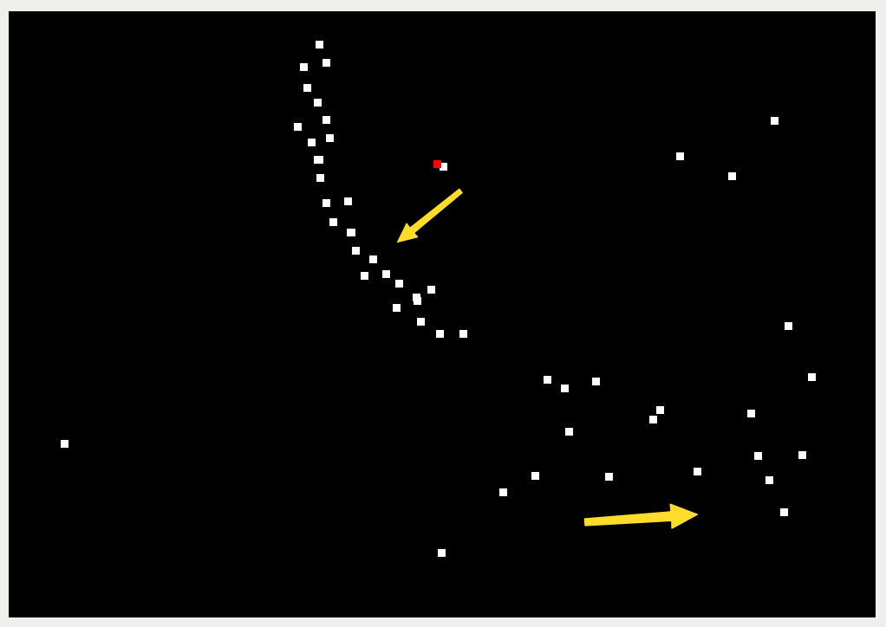

Flocking

Behavioral Animation

You can broadly split behavioral animation into two major categories:

• Cognitive behavior: This is the foundation of artificial life which differs from 
artificial intelligence in that AI objects do not exhibit behaviors or have their own 
preferences. It can range from a simple cause-and-effect based system to more 
complex systems, known as agents, that have a psychological profile influenced by 
the surrounding environment.

• Aggregate behavior: Think of this as the overall outcome of a group of agents. 
This behavior is based on the individual rules of each agent and can influence the 
behavior of neighbors.

In this chapter, you’ll keep your focus on aggregate behavior.

444

Metal by Tutorials
Chapter 18: Particle Behavior

There’s a strict correlation between the various types of aggregate behavior entities 
and their characteristics. In the following table, notice how the presence of a physics 
system or intelligence varies between entity types.

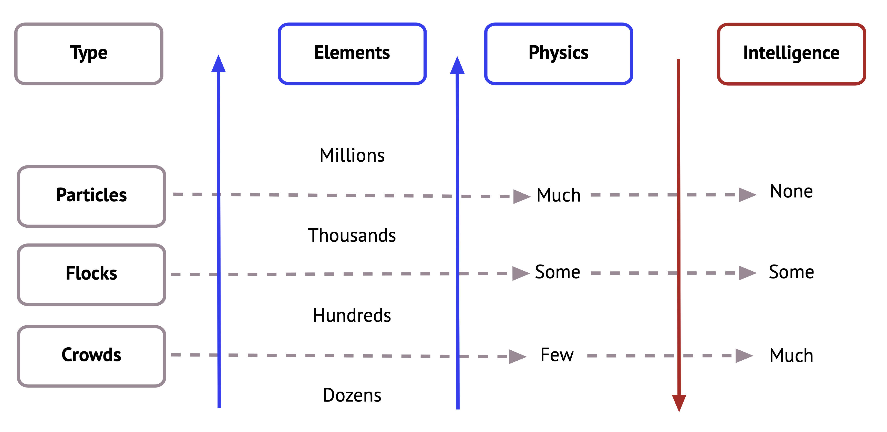

• Particles are the largest aggregate entities and are mostly governed by the laws of 
physics, but they lack intelligence.

• Flocks are an entity that’s well-balanced between size, physics and intelligence.

• Crowds are smaller entities that are rarely driven by physics rules and are highly 
intelligent.

Working with crowd animation is both a challenging and rewarding experience. 
However, the purpose of this chapter is to describe and implement a flocking-like 
system, or to be more precise, a swarm of insects.

445

Metal by Tutorials
Chapter 18: Particle Behavior

Swarming Behavior

Swarms are gatherings of insects or other small-sized beings. The swarming behavior 
of insects can be modeled in a similar fashion as the flocking behavior of birds, the 
herding behavior of animals or the shoaling behavior of fish.

You know from the previous chapter that particle systems are fuzzy objects whose 
dynamics are mostly governed by the laws of physics. There are no interactions 
between particles, and usually, they are unaware of their neighboring particles. In 
contrast, swarming behavior uses the concept of neighboring quite heavily.

The swarming behavior follows a set of basic movement rules developed in 1986 by 
Craig Reynolds in an artificial flocking simulation program known as Boids. Since 
this chapter is heavily based on his work, the term boid will be used throughout the 
chapter instead of particle.

Initially, this basic set only included three rules: cohesion, separation and alignment. 
Later, more rules were added to extend the set to include a new type of agent; one 
that has autonomous behavior and is characterized by the fact that it has more 
intelligence than the rest of the swarm. This led to defining new models such as 
follow-the-leader and predator-prey.

Time to transform all of this knowledge into a swarm of quality code.

446

Metal by Tutorials
Chapter 18: Particle Behavior

The Starter Project

➤ In Xcode, open, build and run the starter project for this chapter. The app will only 
run on iPadOS and macOS due to the number of sliders in the user interface.

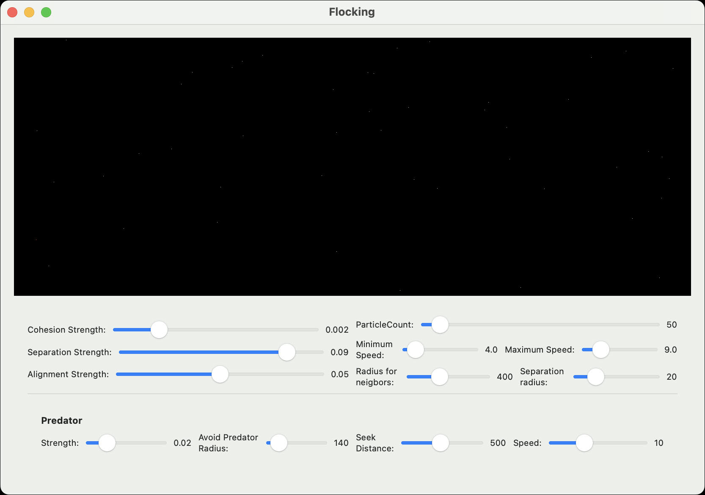

The starter app

The app has a number of exciting sliders that mostly don’t do anything just yet, but 
you’ll make them work throughout this chapter. You can change ParticleCount from 
2 to 1,000 particles.

447

Metal by Tutorials
Chapter 18: Particle Behavior

In Xcode, these are the files of interest:

• Common.h defines the Particle structure, also aliased as Boid. Params matches 
the slider values, which the kernel shader function will use.

• Emitter.swift creates a buffer containing the particles. Each particle has a 
position attribute and a velocity attribute. The initializer sets these to random 
values. Particle zero will be a predator boid, so is treated differently from the other 
boids.

• Renderer initializes the emitter at the beginning of the app and whenever the 
particle count changes. draw(in:) first clears the texture using the clearScreen 
compute shader from the previous project. draw(in:) then dispatches threads for 
the number of particles to calculate the boids’ positions. The dispatch code 
contains an example of both macOS code and iOS code where non-uniform 
threads are not supported.

• Flocking.metal contains two kernel functions. One clears the drawable texture, 
and the other writes a pixel, representing a boid, to the given texture. You’ll 
calculate boid zero individually, so it’s colored red.

• Helper.metal contains two functions that will keep the boids on-screen.

There’s a problem in the app: a visibility issue. In its current state, the boids are 
barely distinguishable despite being white on a black background.

There’s a neat trick you can apply in cases like this when you don’t want to use a 
texture for boids (like you used in the previous chapter). In fact, scientific 
simulations and computational fluid dynamics projects very rarely use textures, if 
ever.

You can’t use the [[point_size]] attribute here because you’re not rendering in 
the traditional sense. Instead, you’re writing pixels in a kernel function directly to 
the drawable’s texture.

448

Metal by Tutorials
Chapter 18: Particle Behavior

The trick is to “paint” the surrounding neighbors of each boid, which makes the 
current boid seem larger than it really is.

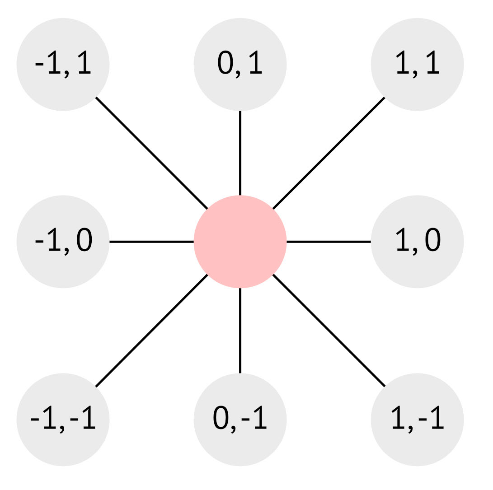

Painting the pixels around the boid

➤ In Flocking.metal, at the end of the flocking kernel function, replace 
output.write(color, location); with:

int size = 4; 
for (int x = -size; x <= size; x++) { 
  for (int y = -size; y <= size; y++) { 
    output.write(color, location + uint2(x, y)); 
  } 
}

This code modifies two neighboring pixels around all sides of the boid which causes 
the boid to appear larger.

➤ Build and run the app, and you’ll see that the boids are more distinguishable now.

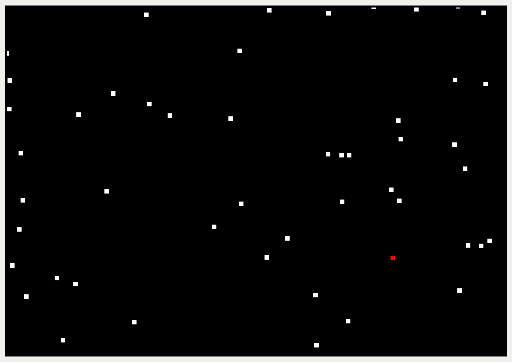

Larger boids

That’s a good start, but how do you get them to move around? For that, you need to 
look into velocity.

449

Metal by Tutorials
Chapter 18: Particle Behavior

Velocity

Velocity is a vector made up of two other vectors: direction and speed. The speed is 
the magnitude or length of the vector, and the direction is given by the linear 
equation of the line on which the vector lies.

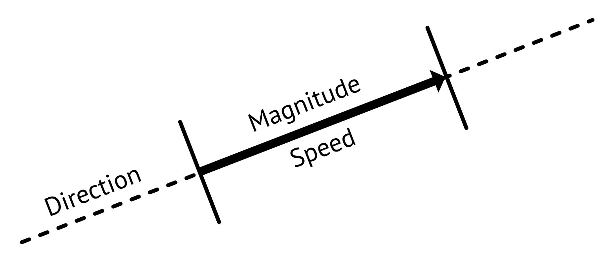

Properties of a vector

➤ Open Common.h, and check out the Particle structure:

struct Particle { 
  vector_float2 position; 
  vector_float2 velocity; 
};

These two properties are all you need to make your flock swarm. You can use the 
term Boid in place of Particle in your shaders.

➤ Open Flocking.metal, and in flocking, replace // flocking code here with 
this:

float2 velocity = boid.velocity; 
position += velocity; 
boid.position = position; 
boid.velocity = velocity; 
boids[id] = boid;

This code gets the current velocity, updates the current position with the velocity, 
and then updates the boid data before storing the new values.

Build and run the app, and you’ll see that the boids are now moving everywhere on 
the screen and… uh, wait! It looks like they’re disappearing from the screen too. 
What happened?

450

Metal by Tutorials
Chapter 18: Particle Behavior

Although you set the velocity to random values, you still need a way to force the 
boids to stay on the screen. Essentially, you need a way to make the boids bounce 
back when they hit any of the edges.

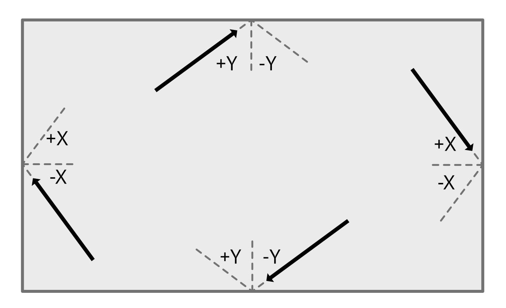

Reflect and bounce at the edges

For this function to work, you need to add checks for X and Y to make sure the boids 
stay in the rectangle defined by the origin and the size of the window, in other words, 
the width and height of your scene.

➤ Open Helper.metal and examine bounceBoid. If the boid position gets outside 
the screen, you change the velocity sign, which changes the direction of the moving 
boid.

➤ In Flocking.metal, in flocking, replace:

boid.position = position; 
boid.velocity = velocity;

With:

float2 viewSize = float2(output.get_width(), 
output.get_height()); 
boid = bounceBoid(position, velocity, viewSize);

You check that the boid is still on-screen. If not, bounce the boid at the edge.

451

Metal by Tutorials
Chapter 18: Particle Behavior

➤ Build and run the app, and you’ll see that the boids are now bouncing back when 
hitting an edge.

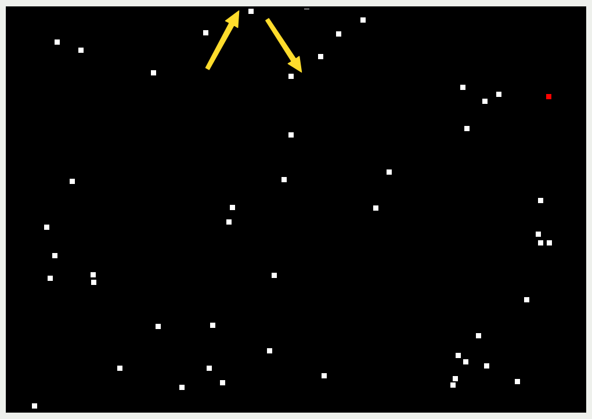

Bouncing boids

Currently, the boids only obey the laws of physics. They’ll travel to random locations 
with random velocities, and they’ll stay on the window screen because of a few strict 
physical rules you’re imposing on them.

The next stage is to make the boids behave as if they are able to think for 
themselves.

Behavioral Rules

There’s a basic set of steering rules that swarms and flocks can adhere to, and it 
includes:

• Cohesion

• Separation

• Alignment

• Escaping

You’ll learn about each of these rules as you implement them in your project.

452

Metal by Tutorials
Chapter 18: Particle Behavior

Cohesion

Cohesion is a steering behavior that causes the boids to stay together as a group. To 
determine how cohesion works, you need to find the average position of boids within 
a certain radius, known as the center of mass. Each neighboring boid will then apply a 
steering force in the direction of this center and converge near the center.

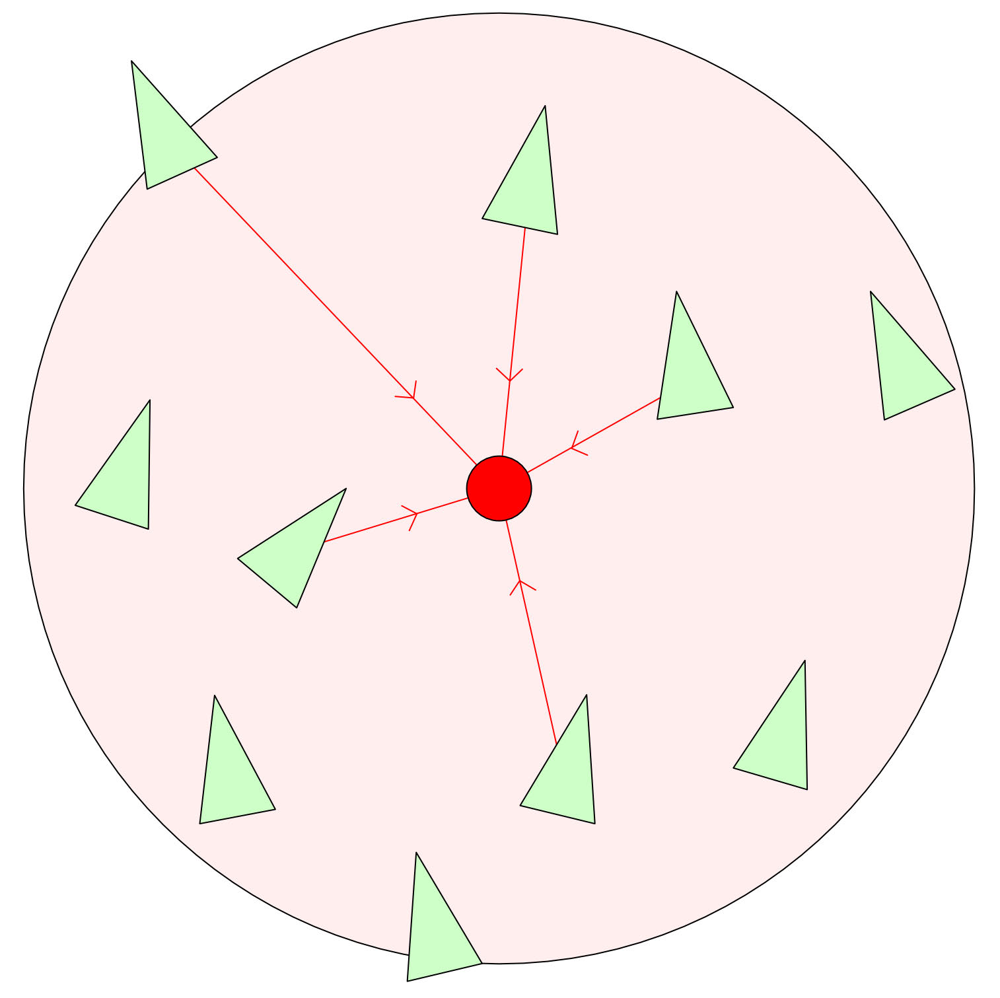

Cohesion

App sliders provide values for:

• Cohesion Strength: A toning down factor that lets you relax the cohesion rule.

• Radius for neighbors: Any boid within this radius is included in the current 
boid’s steering calculation.

➤ In Flocking.metal, create a new function for cohesion before the flocking 
function:

float2 cohesion(Params params, uint index, device Boid* boids) { 
  // 1 
  Boid thisBoid = boids[index]; 
  float neighborsCount = 0; 
  float2 cohesion = 0.0; 
  // 2 
  for (uint i = 1; i < params.particleCount; i++) { 
    Boid boid = boids[i]; 
    float d = distance(thisBoid.position, boid.position); 
    if (d < params.neighborRadius && i != index) { 
      cohesion += boid.position; 
      neighborsCount++; 
    } 
  }

453

Metal by Tutorials
Chapter 18: Particle Behavior

// 3 
  if (neighborsCount > 0) { 
    cohesion /= neighborsCount; 
    cohesion -= thisBoid.position; 
    cohesion *= params.cohesionStrength; 
  } 
  return cohesion; 
}

Going through the code:

1. Isolate the current boid at the given index from the rest of the group. Define the 
cohesion value and number of neighbors.

2. Loop through all of the boids in the swarm, and accumulate each boid’s position 
to the cohesion variable. You start from index 1, as boid[0] will be a special 
case.

3. Get an average position value for the neighborhood, and subtract the current 
boid’s position to calculate the target position. Take into account the cohesion 
strength slider.

➤ In flocking, add this code immediately before position += velocity:

float2 cohesionVector = cohesion(params, id, boids);

// velocity accumulation 
velocity += cohesionVector;

Here, you accumulate the boid’s velocity with the steering forces. You’ll build upon 
the velocity accumulation as you go ahead with new behavioral rules.

➤ Build and run the app, and set Cohesion Strength to 0.01. Notice how the boids 
are initially trying to get away — following their random directions. Moments later, 
they’re pulled back toward the center of the flock.

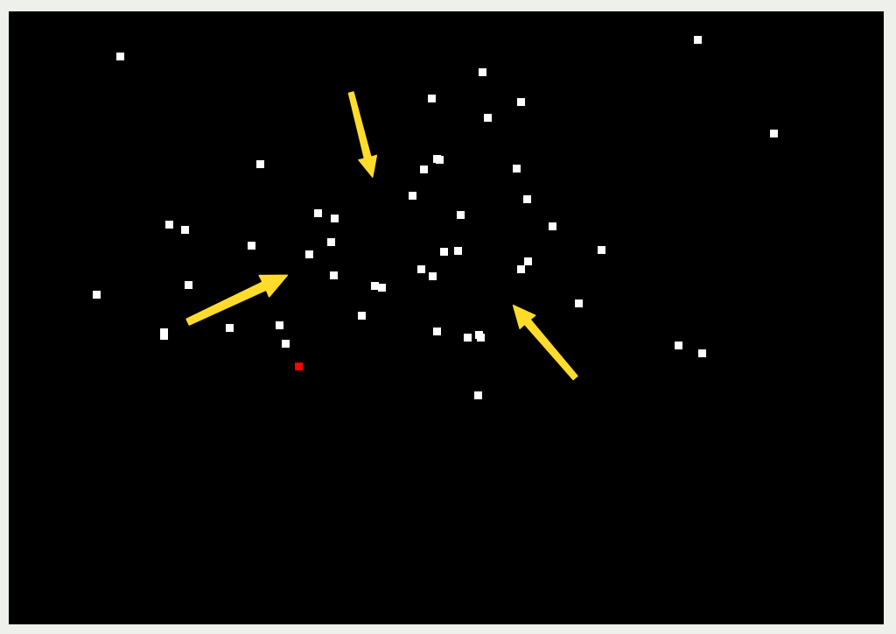

Converging boids

454

Metal by Tutorials
Chapter 18: Particle Behavior

As the simulation runs, the speed of the boids gets out of control.

➤ Add a new function before cohesion:

float2 checkSpeed(float2 vector, float minSpeed, float maxSpeed) 
{ 
  float speed = length(vector); 
  if (speed < minSpeed) { 
    return vector / speed * minSpeed; 
  } 
  if (speed > maxSpeed) { 
    return vector / speed * maxSpeed; 
  } 
  return vector; 
}

Recall from the beginning of the chapter, that the length of a vector gives you the 
speed. You then check that the vector is within minimum and maximum speed 
constraints.

➤ In flocking, call this new function before position += velocity;:

velocity = 
  checkSpeed(velocity, params.minSpeed, params.maxSpeed);

You use the minimum and maximum speed slider values to control the boids’ speed.

➤ Build and run the app, and experiment with the new active sliders.

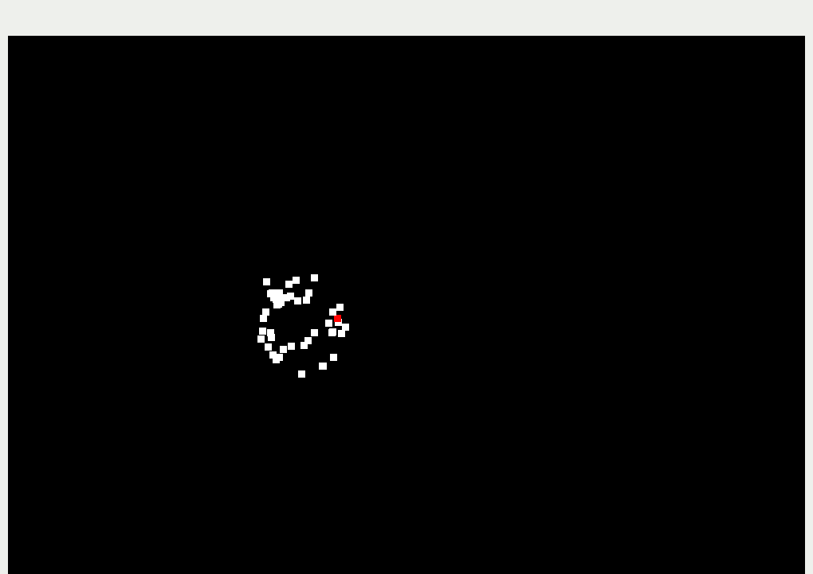

Cohesion with a strength of 0.01

455

Metal by Tutorials
Chapter 18: Particle Behavior

Separation

Separation is another steering behavior that allows a boid to stay a certain distance 
from nearby neighbors. This is accomplished by applying a repulsion force to the 
current boid when the set threshold for proximity is reached.

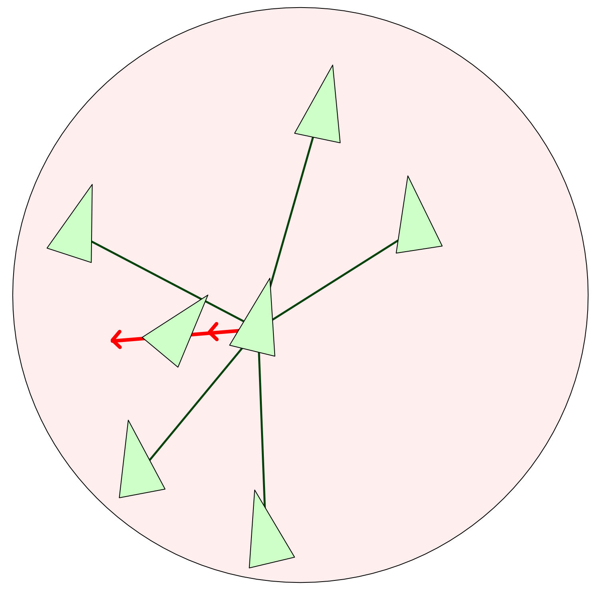

Separation

In addition to the neighbor radius, app sliders provide values for:

• Separation Strength: The strength of the force.

• Separation Radius: The distance between each boid.

➤ Add the new separation function before flocking:

float2 separation(Params params, uint index, device Boid* boids) 
{ 
  // 1 
  Boid thisBoid = boids[index]; 
  float2 separation = float2(0); 
  // 2 
  for (uint i = 1; i < params.particleCount; i++) { 
    Boid boid = boids[i]; 
    if (i != index) { 
      if (abs(distance(boid.position, thisBoid.position)) 
            < params.separationRadius) { 
        separation -= (boid.position - thisBoid.position); 
      } 
    } 
  } 
  // 3 
  separation *= params.separationStrength; 
  return separation; 
}

456

Metal by Tutorials
Chapter 18: Particle Behavior

Going through the code:

1. Isolate the current boid at the given index from the rest of the group. Define and 
initialize position.

2. Loop through all of the boids in the swarm (except boid[0]). If this is a boid 
other than the isolated one, check the distance between the current and isolated 
boids. If the distance is smaller than the proximity threshold, update the position 
to keep the isolated boid within a safe distance.

3. Attenuate the separation force by the strength slider’s value.

➤ In flocking, before the // velocity accumulation comment, add this:

➤ Then, update velocity to include the separation contribution:

➤ Build and run the project. Change the ParticleCount and Separation radius 
sliders to see the counter-effect of pushing back from cohesion as a result of the 
separation contribution.

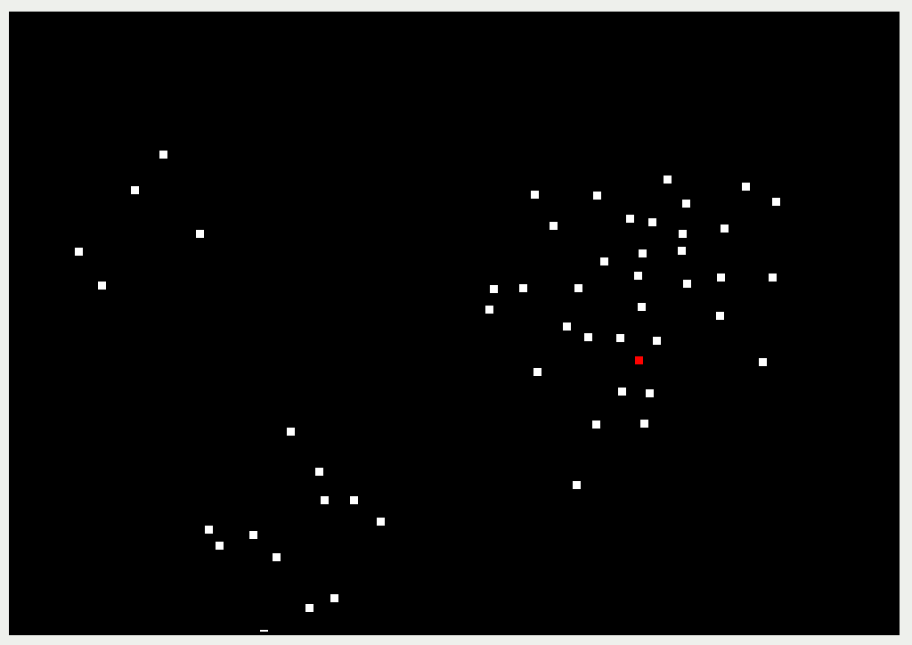

Boid separation

457

Metal by Tutorials
Chapter 18: Particle Behavior

Alignment

Alignment is the last of the three steering behaviors Reynolds used for his flocking 
simulation. The main idea is to calculate an average of the velocities for a limited 
number of neighbors. The resulting average is often referred to as the desired 
velocity.

With alignment, a steering force gets applied to the current boid’s velocity to make it 
align with the group.

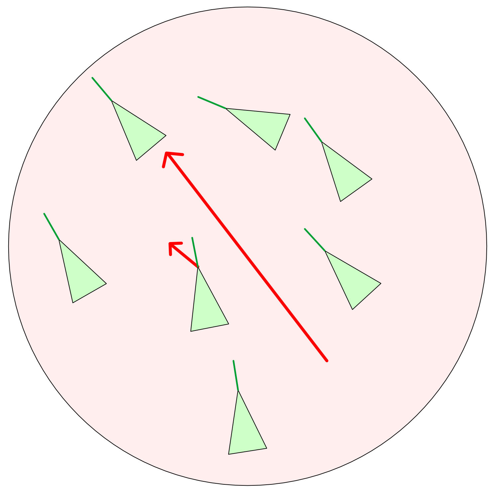

Alignment

The app slider Alignment Strength lets you control the how much the boids 
conform to the alignment rule.

➤ Add the new alignment function before flocking:

float2 alignment(Params params, uint index, device Boid* boids) 
{ 
  // 1 
  Boid thisBoid = boids[index]; 
  float neighborsCount = 0; 
  float2 velocity = 0.0; 
  // 2 
  for (uint i = 1; i < params.particleCount; i++) { 
    Boid boid = boids[i]; 
    float d = distance(thisBoid.position, boid.position); 
    if (d < params.neighborRadius && i != index) { 
      velocity += boid.velocity; 
      neighborsCount++; 
    } 
  } 
  // 3 
  if (neighborsCount > 0) { 
    velocity = velocity / neighborsCount;

458

Metal by Tutorials
Chapter 18: Particle Behavior

velocity = (velocity - thisBoid.velocity); 
    velocity *= params.alignmentStrength; 
  } 
  return velocity; 
}

Going through the code:

1. As you did before, isolate the current boid at the given index from the rest of the 
group. Define and initialize velocity. Because this force only includes 
neighbors, define and initialize the number of boids in the neighborhood.

2. Loop through all of the boids in the swarm (except boid[0]), and accumulate 
each boid’s velocity to the velocity variable.

3. Get an average velocity value for the neighborhood and attenuate by the slider 
strength.

➤ In flocking, before the // velocity accumulation comment, add this code:

➤ Then, update the velocity accumulation code so that it includes the alignment 
contribution:

To get the full effect of this alignment, instead of bouncing the boids at the edge of 
the view, you’ll wrap them so that when the boid goes off the left of the view, it’ll 
reappear at the right of the view. Similarly, when it disappears off the top, it’ll 
reappear at the bottom of the view.

➤ Replace boid = bounceBoid(position, velocity, viewSize); with:

if (id == 0) { 
  boid = bounceBoid(position, velocity, viewSize); 
} else { 
  boid.position = wrapPosition(position, viewSize); 
  boid.velocity = velocity; 
}

You use the helper function in Helper.metal to wrap the boids around the view. 
boid[0] will be the only boid that bounces.

459

Metal by Tutorials
Chapter 18: Particle Behavior

➤ Build and run the app, slide the Cohesion and Separation Strength sliders to 
zero, and Alignment Strength to 0.10. As boids meet each other, they will adjust 
until the whole flock is going in the same direction. If you want to reset the 
simulation, use the ParticleCount slider to change the number of particles.

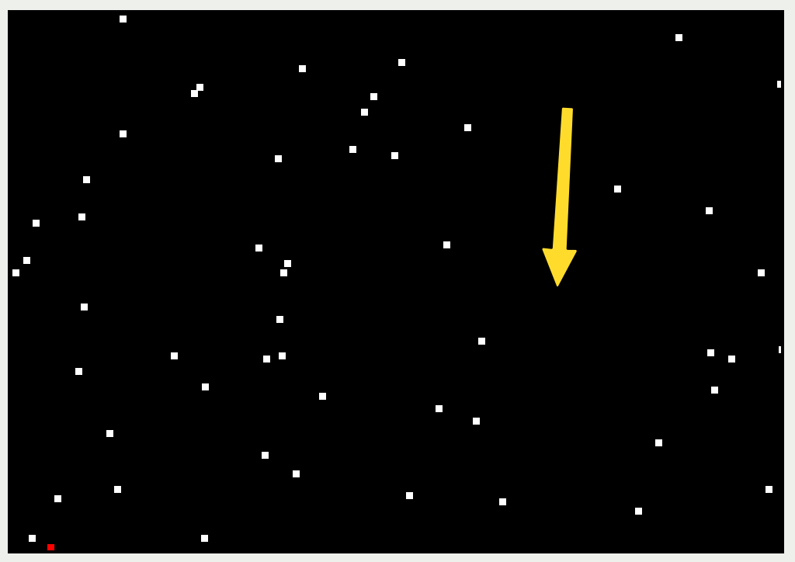

Boids aligning

Escaping

Escaping is a new type of steering behavior that introduces an agent with 
autonomous behavior and slightly more intelligence — the predator (also known as 
boid[0]).

In the predator-prey behavior, the predator tries to approach the closest prey, while 
the neighboring boids try to escape.

460

Metal by Tutorials
Chapter 18: Particle Behavior

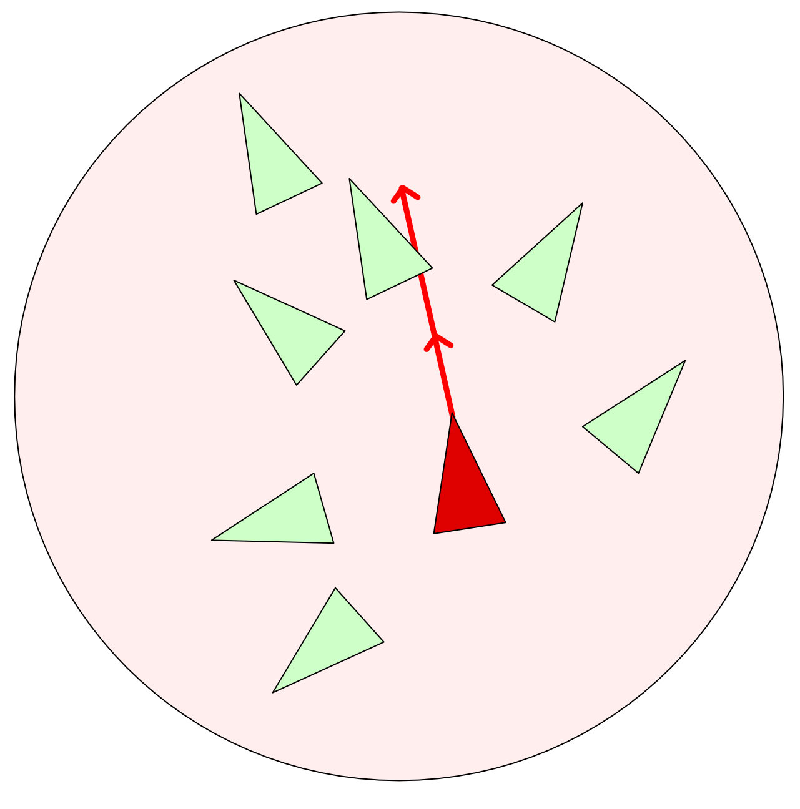

Escaping

First set up the predator’s movement.

➤ Create a new function before flocking:

float2 updatePredator(Params params, device Boid* boids) 
{ 
  float2 preyPosition = boids[0].position; 
  for (uint i = 1; i < params.particleCount; i++) { 
    float d = distance(preyPosition, boids[i].position); 
    if (d < params.predatorSeek) { 
      preyPosition = boids[i].position; 
      break; 
    } 
  } 
  return preyPosition - boids[0].position; 
}

Just like before, you use the slider values to loop through the boids and find the first 
boid within the seek radius around the predator’s current position.

461

Metal by Tutorials
Chapter 18: Particle Behavior

Note: If you want to find the closest boid, you should loop through all of them, 
and not break out of the for loop.

➤ In flocking, right after float2 velocity = boid.velocity;, add this:

if (id == 0) { 
  float2 predatorVector = updatePredator(params, boids); 
  velocity += predatorVector; 
  velocity = 
    checkSpeed(velocity, params.minSpeed, params.predatorSpeed); 
} else {

You update the predator’s position, if the thread id is 0. All the velocity accumulation 
will go in the else part of the conditional that updates the rest of the boids. The 
predator has a different maximum speed from the other boids so you can control its 
eagerness for prey.

➤ Terminate the conditional before position += velocity;:

➤ Add the new escaping function before flocking:

float2 escaping(Params params, Boid predator, Boid boid) { 
  float2 velocity = boid.velocity; 
  float d = distance(predator.position, boid.position); 
  if (d < params.predatorRadius) { 
    velocity = boid.position - predator.position; 
    velocity *= params.predatorStrength; 
  } 
  return velocity; 
}

If a boid is within a certain radius of the predator, the boid reverses velocity.

➤ In flocking, before the // velocity accumulation comment, add this:

462

Metal by Tutorials
Chapter 18: Particle Behavior

➤ Then, update the velocity accumulation code to include the escaping 
contribution:

velocity += cohesionVector + separationVector 
 + alignmentVector + escapingVector;

➤ Build and run the app. Notice that some of the boids are steering away from the 
group and avoiding the red predator.

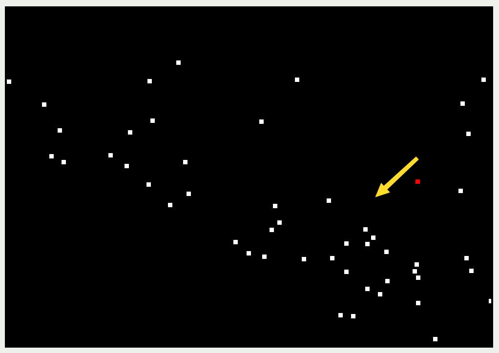

Escaping boids

If the predator is lucky enough to catch a prey, it will stay with the prey until they 
reach an edge. The prey will then escape by wrapping around, while the predator will 
bounce.

Experiment with the sliders and see what effects you can make. Instead of 
considering boid[0] as a “predator”, you can consider it a random force to 
manipulate the direction of swarms of boids.

463

Metal by Tutorials
Chapter 18: Particle Behavior

Key Points

• You can give particles behavioral animation by causing them to react with other 
particles

• Swarming behavior has been widely researched. The Boids simulation describes 
basic movement rules.

• The behavioral rules for boids include cohesion, separation and alignment.

• Adding a predator to the particle mass requires an escaping algorithm.

Where to Go From Here?

In this chapter, you learned how to construct basic behaviors and apply them to a 
small flock. Continue developing your project by adding a colorful background and 
textures for the boids. Or make it a 3D flocking app by adding projection to the 
scene. When you’re done, add the flock animation to your engine. Whatever you do, 
the sky is the limit.

This chapter barely scratched the surface of what is widely known as behavioral 
animation. Be sure to review the references.markdown file in the chapter directory 
for links to more resources about this wonderful topic.

464

Section III: Advanced Metal

In this section, you’ll learn many advanced features of Metal and explore realistic 
rendering techniques. You’ll animate characters, and also manage rendering your 
scenes on the GPU.

465

19