# Tessellation & 
Terrains

So far, you’ve used normal map trickery in the fragment function to show the fine 
details of your low poly models. To achieve a similar level of detail without using 
normal maps requires a change of model geometry by adding more vertices. The 
problem with adding more vertices is that when you send them to the GPU, it chokes 
up the pipeline. A hardware tessellator in the GPU can create vertices on the fly, 
adding a greater level of detail and thereby using fewer resources.

In this chapter, you’ll create a detailed terrain using a small number of points. You’ll 
send a flat ground plane with a grayscale texture describing the height, and the 
tessellator will create as many vertices as needed. The vertex function will then read 
the texture and displace (move) these new vertices vertically.

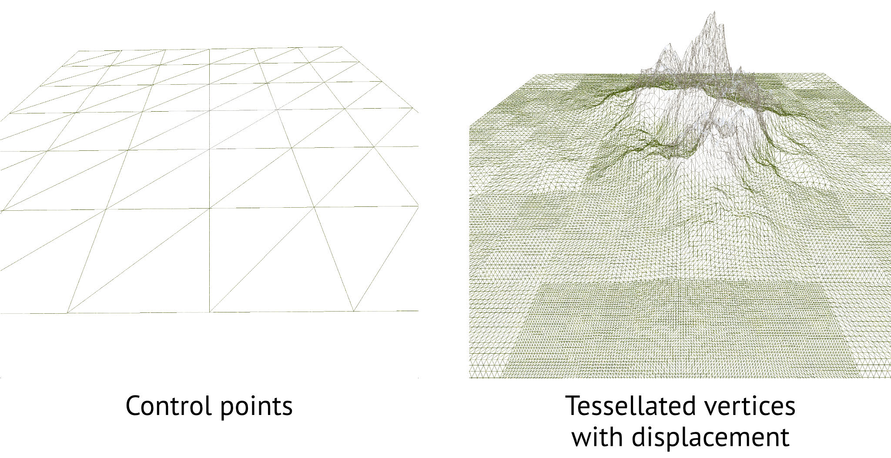

Tessellation concept

In this example, on the left side are the control points. On the right side, the 
tessellator creates extra vertices, with the number dependent on how close the 
control points are to the camera.

466

Metal by Tutorials
Chapter 19: Tessellation & Terrains

Tessellation

For tessellation, instead of sending vertices to the GPU, you send patches. These 
patches are made up of control points — a minimum of three for a triangle patch, or 
four for a quad patch. The tessellator can convert each quad patch into a certain 
number of triangles: up to 4,096 triangles on a recent iMac and 256 triangles on an 
iPhone that’s capable of tessellation.

Note: Tessellation is available on all Macs since 2012 and on iOS 10 GPU 
Family 3 and up. This includes the iPhone 6s and newer devices. However, 
tessellation is not available in Simulator.

With tessellation, you can:

• Send less data to the GPU. Because the GPU doesn’t store tessellated vertices in 
graphics memory, it’s more efficient on resources.

• Make low poly objects look less low poly by curving patches.

• Displace vertices for fine detail instead of using normal maps to fake it.

• Decide on the level of detail based on the distance from the camera. The closer an 
object is to the camera, the more vertices it contains.

The Starter Project

➤ Open the starter project for this chapter.

So that you can more easily understand the difference between rendering patches 
and rendering vertices, the starter project is a simplified renderer.

All the rendering code is in Renderer.swift, with the pipeline state setup in 
Pipelines.swift. Quad.swift contains the vertices and vertex buffer for the quad, 
and a method to generate control points.

This code is the minimum needed for a simple render of six vertices to create a quad.

467

Metal by Tutorials
Chapter 19: Tessellation & Terrains

➤ Build and run the project.

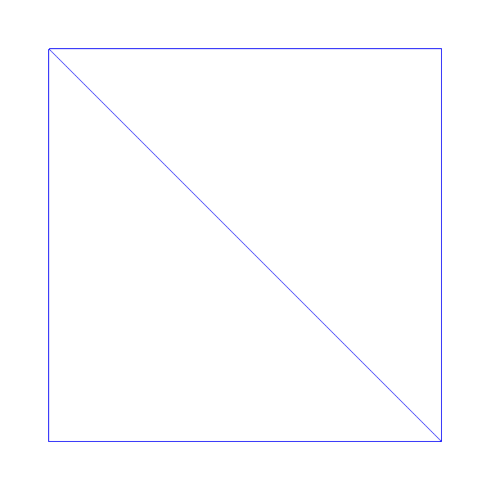

The starter app

Your task in this chapter is to convert this quad to a terrain made up of patch quads 
with many vertices.

Before creating a tessellated terrain, you’ll tessellate a single four-point patch. 
Instead of sending six vertices to the GPU, you’ll send the positions of the four 
corners of the patch. You’ll give the GPU edge factors and inside factors which tell 
the tessellator how many vertices to create. You’ll render in wireframe line mode so 
you can see the vertices added by the tessellator, but you can change this with the 
Wireframe toggle in the app.

To convert the quad, you’ll do the following on the CPU side:

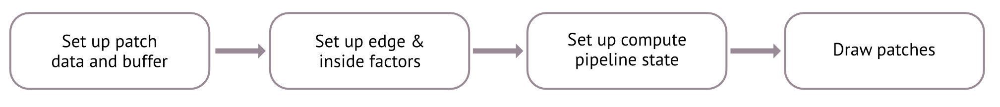

CPU pipeline

On the GPU side, you’ll set up a tessellation kernel that processes the edge and 
inside factors. You’ll also set up a post-tessellation vertex shader that handles the 
vertices generated by the hardware tessellator.

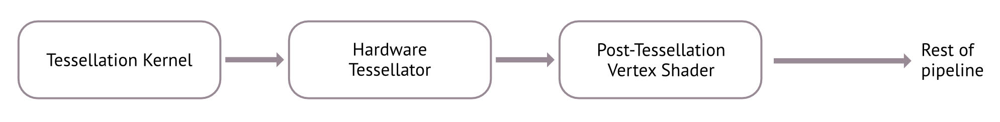

GPU pipeline

468

Metal by Tutorials
Chapter 19: Tessellation & Terrains

Tessellation Patches

A patch consists of a certain number of control points, generally:

• bilinear: Four control points, one at each corner

• biquadratic: Nine control points

• bicubic: Sixteen control points

Tessellated patches

The control points make up a cage which is made up of spline curves. A spline is a 
parametric curve made up of control points. There are various algorithms to 
interpolate these control points, but here, A, B and C are the control points. As point 
P travels from A to B, point Q travels from B to C. The half way point between P and 
Q describes the blue curve.

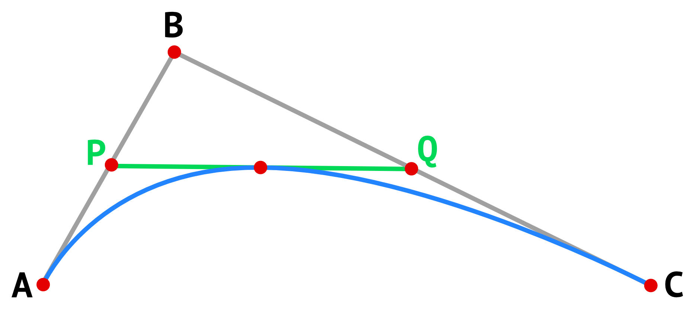

A bezier curve

To create the curved patch surface, the vertex function interpolates vertices to follow 
this parametric curve.

Note: Because the mathematics of curved surfaces is quite involved, you’ll 
work with only four control points per patch in this chapter.

469

Metal by Tutorials
Chapter 19: Tessellation & Terrains

Tessellation Factors

For each patch, you need to specify inside edge factors and outside edge factors. The 
four-point patch in the following image shows different edge factors for each edge — 
specified as [2, 4, 8, 16] — and two different inside factors — specified as [8, 
16], for horizontal and vertical respectively.

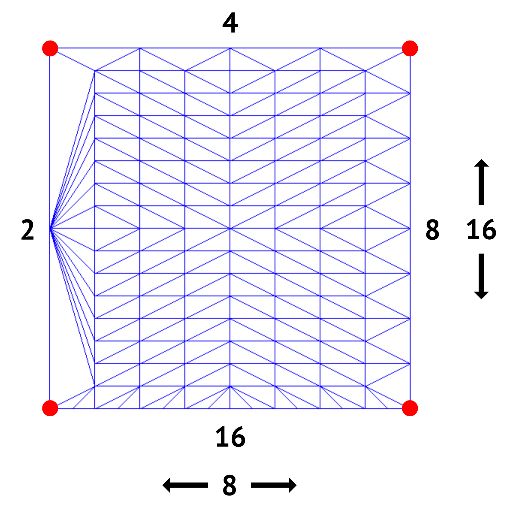

Edge factors

The edge factors specify how many segments an edge will be split into. An edge 
factor of 2 has two segments along the edge. For the inside factors, look at the 
horizontal and vertical center lines. In this example, the horizontal center has eight 
segments, and the vertical center has sixteen.

Although only four control points (shown in red) went to the GPU, the hardware 
tessellator created a lot more vertices. However, creating more vertices on a flat 
plane doesn’t make the render any more interesting. Later, you’ll find out how to 
move these vertices around in the vertex function to make a bumpy terrain. But first, 
you’ll discover how to tessellate a single patch.

➤ In Renderer.swift, in Renderer, add the following properties:

let patches = (horizontal: 1, vertical: 1) 
var patchCount: Int { 
  patches.horizontal * patches.vertical 
}

You create a constant for the number of patches you’re going to create, in this case, 
one. patchCount is a convenience property that returns the total number of patches.

➤ Next, add this:

var edgeFactors: [Float] = [4] 
var insideFactors: [Float] = [4]

470

Metal by Tutorials
Chapter 19: Tessellation & Terrains

Here, you set up the edge and inside factors as Float array properties. These 
variables indicate four segments along each edge, and four in the middle.

You can specify different factors for different edges by adding them to the array. For 
each patch, the GPU processes these edge factors and places the amount to tessellate 
each into a buffer.

➤ Create a property to provide a buffer of the correct length:

lazy var tessellationFactorsBuffer: MTLBuffer? = { 
  // 1 
  let count = patchCount * (4 + 2) 
  // 2 
  let size = count * MemoryLayout<Float>.size / 2 
  return Renderer.device.makeBuffer( 
    length: size, 
    options: .storageModePrivate) 
}()

1.
count is the number of patches multiplied by the four edge factors and two 
inside factors.

2. Here you calculate the size of the buffer. In the tessellation kernel, you’ll fill the 
buffer with a special type consisting of half-floats.

Now it’s time to set up the patch data.

Setting Up the Patch Data

Instead of an array of six vertices, you’ll create a four-point patch with control points 
at the corners. Currently, in Quad.swift, Quad holds a vertexBuffer property that 
contains the vertices. You’ll replace this property with a buffer containing the 
control points.

➤ In Renderer, add the following property:

➤ At the end of init(metalView:options:), fill the buffer with control points:

let controlPoints = Quad.createControlPoints( 
  patches: patches, 
  size: (2, 2)) 
controlPointsBuffer = 
  Renderer.device.makeBuffer( 
    bytes: controlPoints, 
    length: MemoryLayout<float3>.stride * controlPoints.count)

471

Metal by Tutorials
Chapter 19: Tessellation & Terrains

Quad.swift contains a method, createControlPoints(patches:size:). This 
method takes in the number of patches, and the unit size of the total number of 
patches. It then returns an array of xyz control points. Here, you create a patch with 
one corner at [-1, 0, 1], and the diagonal at [1, 0, -1]. This is a flat horizontal 
plane, but Renderer’s modelMatrix rotates the patch by 90º so you can see the 
patch vertices.

Set Up the Render Pipeline State

You can configure the tessellator by changing the pipeline state properties. Until 
now, you’ve processed only vertices with the vertex descriptor. However, you’ll now 
modify the vertex descriptor so it processes patches instead.

➤ Open Pipelines.swift, and in createRenderPSO(colorPixelFormat:), where 
you set up vertexDescriptor, add this:

With the old setup, you were using a default stepFunction of .perVertex. With 
that setup, the vertex function fetches new attribute data every time a new vertex is 
processed.

Now that you’ve moved on to processing patches, you need to fetch new attribute 
data for every control point.

The Tessellation Kernel

To calculate the number of edge and inside factors, you’ll set up a compute pipeline 
state object that points to the tessellation kernel shader function.

➤ Open Renderer.swift, and add a new property to Renderer:

➤ In init(metalView:options:), before super.init(), add this:

tessellationPipelineState = 
  PipelineStates.createComputePSO(function: "tessellation_main")

Here, you instantiate the pipeline state for the compute pipeline.

472

Metal by Tutorials
Chapter 19: Tessellation & Terrains

Compute Pass

You now have a compute pipeline state and an MTLBuffer containing the patch data. 
You also created an empty buffer which the tessellation kernel will fill with the edge 
and inside factors. Next, you need to create the compute command encoder to 
dispatch the tessellation kernel.

➤ In tessellation(commandBuffer:), add the following:

guard let computeEncoder = 
  commandBuffer.makeComputeCommandEncoder() else { return } 
computeEncoder.setComputePipelineState( 
  tessellationPipelineState) 
computeEncoder.setBytes( 
  &edgeFactors, 
  length: MemoryLayout<Float>.size * edgeFactors.count, 
  index: 0) 
computeEncoder.setBytes( 
  &insideFactors, 
  length: MemoryLayout<Float>.size * insideFactors.count, 
  index: 1) 
computeEncoder.setBuffer( 
  tessellationFactorsBuffer, 
  offset: 0, 
  index: 2)

draw(in:) calls tessellation(commandBuffer:) before any rendering. You create 
a compute command encoder and bind the edge and inside factors to the compute 
function (the tessellation kernel). If you have multiple patches, the compute 
function will operate in parallel on each patch, on different threads.

473

Metal by Tutorials
Chapter 19: Tessellation & Terrains

➤ To tell the GPU how many threads you need, continue by adding this after the 
previous code:

let width = min( 
  patchCount, 
  tessellationPipelineState.threadExecutionWidth) 
let gridSize = 
  MTLSize(width: patchCount, height: 1, depth: 1) 
let threadsPerThreadgroup = 
  MTLSize(width: width, height: 1, depth: 1) 
computeEncoder.dispatchThreadgroups( 
  gridSize, 
  threadsPerThreadgroup: threadsPerThreadgroup) 
computeEncoder.endEncoding()

The compute grid is one dimensional, with a thread for each patch. Before changing 
the render encoder so it’ll draw patches instead of vertices, you’ll need to create the 
tessellation kernel.

The Tessellation Kernel Function

➤ In the Shaders group, create a new Metal file named Tessellation.metal, and add 
this:

#import "Common.h" 
 
kernel void 
  tessellation_main( 
    constant float *edge_factors [[buffer(0)]], 
    constant float *inside_factors [[buffer(1)]], 
    device MTLQuadTessellationFactorsHalf 
      *factors [[buffer(2)]], 
    uint pid [[thread_position_in_grid]]) 
{ 
}

474

Metal by Tutorials
Chapter 19: Tessellation & Terrains

kernel specifies the type of shader. The function operates on all threads (i.e., all 
patches) and receives the three things you sent over: the edge factors, inside factors 
and the empty tessellation factors buffer that you’re going to fill in this function.

The fourth parameter is the patch ID with its thread position in the grid. The 
tessellation factors buffer consists of an array of edge and inside factors for each 
patch, and pid gives you the patch index into this array.

➤ Inside the kernel function, add the following:

factors[pid].edgeTessellationFactor[0] = edge_factors[0]; 
factors[pid].edgeTessellationFactor[1] = edge_factors[0]; 
factors[pid].edgeTessellationFactor[2] = edge_factors[0]; 
factors[pid].edgeTessellationFactor[3] = edge_factors[0]; 
 
factors[pid].insideTessellationFactor[0] = inside_factors[0]; 
factors[pid].insideTessellationFactor[1] = inside_factors[0];

This code fills in the tessellation factors buffer with the edge factors that you sent 
over. The edge and inside factors array you sent over only had one value each, so you 
put this value into all factors.

Filling out a buffer with values is a trivial thing for a kernel to do, and you could do 
this on the CPU. However, as you get more patches and more complexity on how to 
tessellate these patches, you’ll understand why sending the data to the GPU for 
parallel processing is a useful step.

After the compute pass is done, the render pass takes over.

475

Metal by Tutorials
Chapter 19: Tessellation & Terrains

The Render Pass

Before doing the render, you need to tell the render encoder about the tessellation 
factors buffer that you updated during the compute pass.

➤ Open Renderer.swift, and in render(commandBuffer:view:), locate the // 
draw comment. Just after that comment, add this:

renderEncoder.setTessellationFactorBuffer( 
  tessellationFactorsBuffer, 
  offset: 0, 
  instanceStride: 0)

The post-tessellation vertex function reads from this buffer that you set up during 
the kernel function.

Instead of drawing triangles from the vertex buffer, you’ll draw the patch using patch 
control points from the control points buffer.

➤ Replace:

renderEncoder.setVertexBuffer( 
  quad.vertexBuffer, 
  offset: 0, 
  index: 0)

With:

renderEncoder.setVertexBuffer( 
  controlPointsBuffer, 
  offset: 0, 
  index: 0)

➤ Replace the drawPrimitives command with this:

renderEncoder.drawPatches( 
  numberOfPatchControlPoints: 4, 
  patchStart: 0, 
  patchCount: patchCount, 
  patchIndexBuffer: nil, 
  patchIndexBufferOffset: 0, 
  instanceCount: 1, 
  baseInstance: 0)

The render command encoder tells the GPU that it’s going to draw one patch with 
four control points.

476

Metal by Tutorials
Chapter 19: Tessellation & Terrains

The Post-Tessellation Vertex Function

➤ Open Shaders.metal.

The GPU calls the vertex function after the tessellator has done its job of creating 
the vertices. The function will operate on each one of these new vertices. In the 
vertex function, you’ll tell each vertex what its position in the rendered quad should 
be.

➤ Rename VertexIn to ControlPoint.

The definition of position remains the same. Because you used a vertex descriptor 
to describe the incoming control point data, you can use the [[stage_in]] 
attribute.

The vertex function will check the vertex descriptor from the current pipeline state, 
find that the data is in buffer 0 and use the vertex descriptor layout to read in the 
data.

➤ Replace vertex_main with:

// 1 
[[patch(quad, 4)]] 
// 2 
vertex VertexOut 
  vertex_main( 
// 3 
    patch_control_point<ControlPoint> control_points 
[[stage_in]], 
// 4 
    constant Uniforms &uniforms [[buffer(BufferIndexUniforms)]], 
// 5 
    float2 patch_coord [[position_in_patch]]) 
{ 
}

This is the post-tessellation vertex function where you return the correct position of 
the vertex for the rasterizer. Going through the code:

1. The function qualifier tells the vertex function that the vertices are coming from 
tessellated patches. It describes the type of patch, triangle or quad, and the 
number of control points, in this case, four.

2. The function is still a vertex shader function as before.

3.
patch_control_point is part of the Metal Standard Library and provides the 
per-patch control point data.

477

Metal by Tutorials
Chapter 19: Tessellation & Terrains

4.
Uniforms contains the model-view-projection matrix you passed in.

5. The tessellator provides a uv coordinate between 0 and 1 for the tessellated patch 
so that the vertex function can calculate its correct rendered position.

To visualize how this works, you can temporarily return the UV coordinates as the 
position and color.

➤ Add the following code to vertex_main:

float u = patch_coord.x; 
float v = patch_coord.y; 
 
VertexOut out; 
out.position = float4(u, v, 0, 1); 
out.color = float4(u, v, 0, 1); 
return out;

Here, you give the vertex a position as interpolated by the tessellator from the four 
patch positions, and a color of the same value for visualization.

➤ Build and run the app.

See how the patch is tessellated with vertices between 0 and 1? (Normalized Device 
Coordinates (NDC) are between -1 and 1 which is why all the coordinates are at the 
top right.)

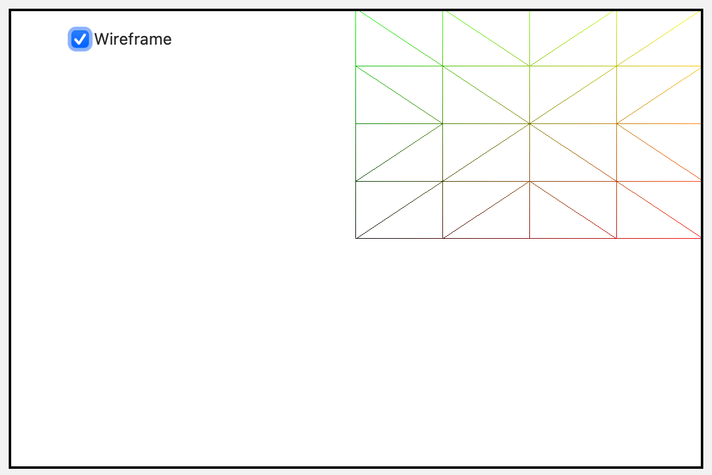

Basic tessellation

478

Metal by Tutorials
Chapter 19: Tessellation & Terrains

To have your vertex positions depend on the patch’s actual position rather than 
between 0 and 1, you need to interpolate the patch’s control points depending on the 
UV values.

➤ In vertex_main, after assigning the u and v values, add this:

float2 top = mix( 
  control_points[0].position.xz, 
  control_points[1].position.xz, 
  u); 
float2 bottom = mix( 
  control_points[3].position.xz, 
  control_points[2].position.xz, 
  u);

You interpolate values horizontally along the top of the patch and the bottom of the 
patch. Notice the index ordering: the patch indices are 0 to 3 clockwise.

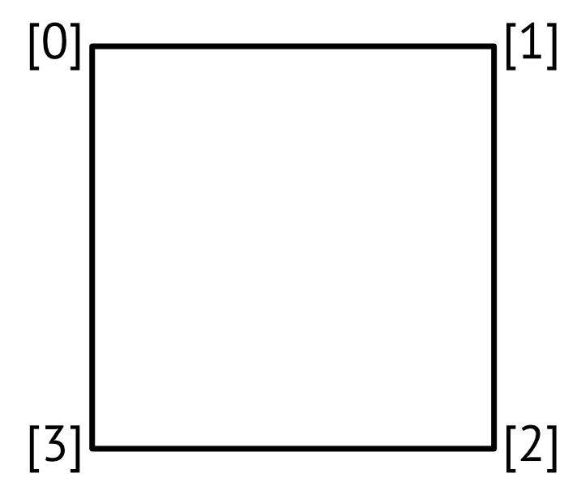

Control point winding order

You can change this by setting the pipeline descriptor property 
tessellationOutputWindingOrder to .counterClockwise.

➤ Change the following code:

➤ To:

float2 interpolated = mix(top, bottom, v); 
float4 position = float4( 
  interpolated.x, 0.0, 
  interpolated.y, 1.0); 
out.position = uniforms.mvp * position;

479

Metal by Tutorials
Chapter 19: Tessellation & Terrains

You interpolate the vertical value between the top and bottom values and multiply it 
by the model-view-projection matrix to position the vertex in the scene. Currently, 
you’re leaving y at 0.0 to keep the patch two-dimensional.

➤ Build and run the app to see your tessellated patch:

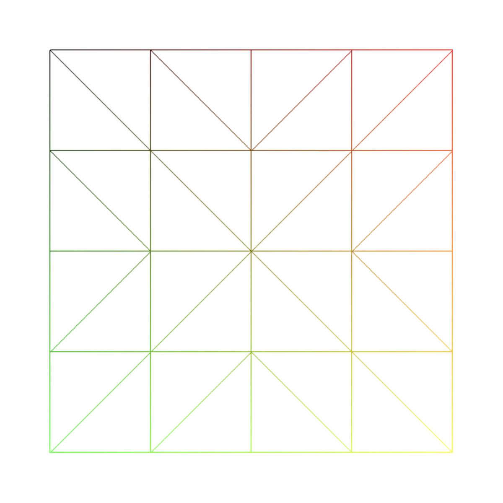

A tessellated patch

Note: Experiment with changing the edge and inside factors until you’re 
comfortable with how the tessellator subdivides. For example, change the edge 
factors array to [2, 4, 8, 16], and change the kernel function so that the 
appropriate array value goes into each edge.

Multiple Patches

Now that you know how to tessellate one patch, you can tile the patches and choose 
edge factors that depend on dynamic factors, such as distance.

➤ Open Renderer.swift, and change the patches initialization to:

480

Metal by Tutorials
Chapter 19: Tessellation & Terrains

➤ Build and run the app to see the four patches joined together:

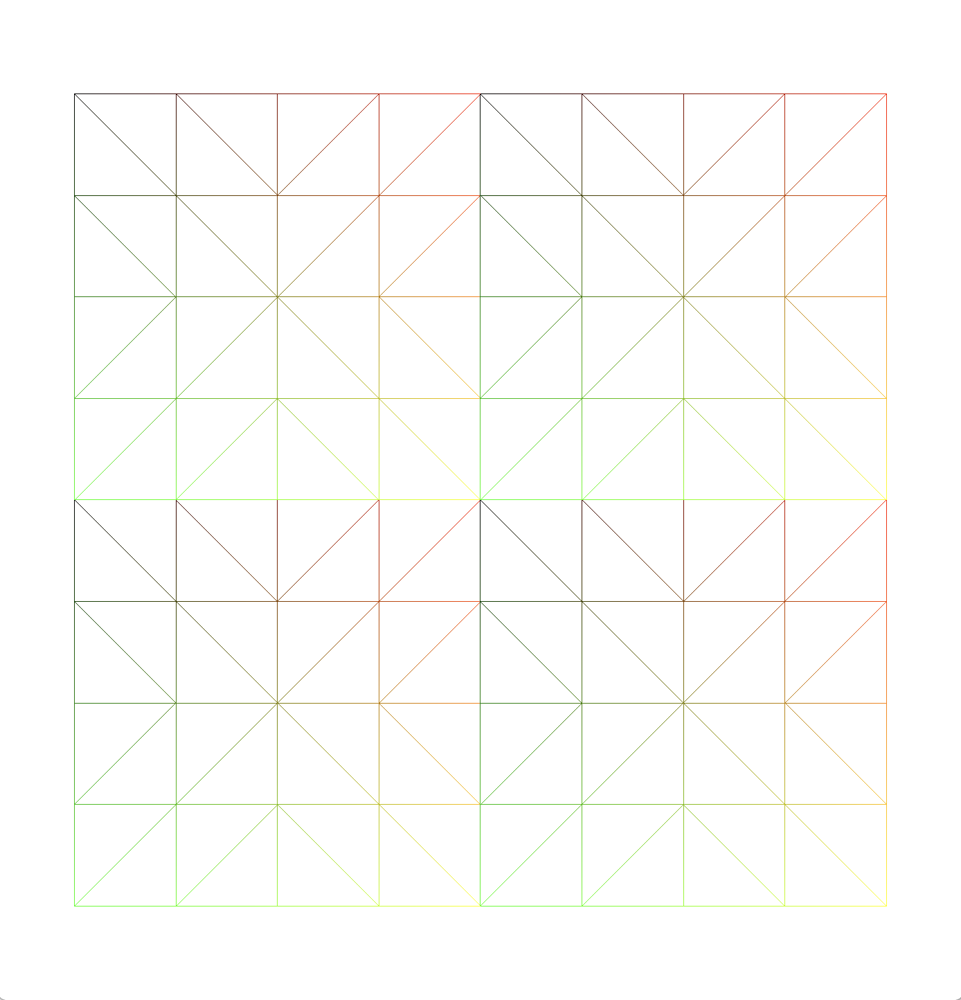

Four tessellated patches

In the vertex function, you can identify which patch you’re currently processing 
using the [[patch_id]] attribute.

➤ Open Shaders.metal, and add this parameter to vertex_main:

➤ Change the assignment of out.color to:

out.color = float4(0); 
if (patchID == 0) { 
  out.color = float4(1, 0, 0, 1); 
}

➤ Build and run the app.

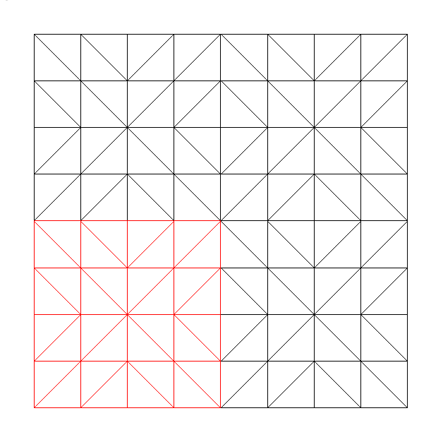

Colored by patch id

481

Metal by Tutorials
Chapter 19: Tessellation & Terrains

Notice how the GPU colors the bottom left patch red. This is the first patch in the 
control points array.

Tessellation By Distance

In this section, you’re going to create a terrain with patches that are tessellated 
according to the distance from the camera. When you’re close to a mountain, you 
need to see more detail; when you’re farther away, less. Having the ability to dial in 
the level of detail is where tessellation comes into its own. By setting the level of 
detail, you save on how many vertices the GPU has to process in any given situation.

➤ Open Common.h, and add the following code:

typedef struct { 
  vector_float2 size; 
  float height; 
  uint maxTessellation; 
} Terrain;

You set up a new structure to describe the size and maximum tessellation of the 
terrain. You’ll use height for scaling vertices on the y-axis later.

➤ Open Renderer.swift, and add a new constant to Renderer:

This value is the maximum amount you can tessellate per patch. On iOS devices, 
currently the maximum amount is 16, but on new Macs, the maximum is 64.

➤ Add a new property:

var terrain = Terrain( 
  size: [2, 2], 
  height: 1, 
  maxTessellation: UInt32(Renderer.maxTessellation))

You describe the terrain with four patches and a maximum height of one unit.

482

Metal by Tutorials
Chapter 19: Tessellation & Terrains

➤ Locate where you set up controlPoints in init(metalView:options:), and 
change it to:

let controlPoints = Quad.createControlPoints( 
  patches: patches, 
  size: (width: terrain.size.x, height: terrain.size.y))

Because your terrains are going to be much larger, you’ll use the terrain constant to 
create the control points.

To calculate edge factors that are dependent on the distance from the camera, you 
will send the camera position, model matrix and control points to the kernel.

➤ In tessellation(commandBuffer:), before you set the width of the compute 
threads with let width = min(patchCount..., add this:

var cameraPosition = float4(camera.position, 0) 
computeEncoder.setBytes( 
  &cameraPosition, 
  length: MemoryLayout<float4>.stride, 
  index: 3) 
var matrix = modelMatrix 
computeEncoder.setBytes( 
  &matrix, 
  length: MemoryLayout<float4x4>.stride, 
  index: 4) 
computeEncoder.setBuffer( 
  controlPointsBuffer, 
  offset: 0, 
  index: 5) 
computeEncoder.setBytes( 
  &terrain, 
  length: MemoryLayout<Terrain>.stride, 
  index: 6)

You send the camera position, along with the model matrix, the control points buffer 
and the terrain information to the tessellation kernel.

➤ Open Tessellation.metal, and add these parameters to tessellation_main:

constant float4 &camera_position [[buffer(3)]], 
constant float4x4 &modelMatrix   [[buffer(4)]], 
constant float3* control_points  [[buffer(5)]], 
constant Terrain &terrain        [[buffer(6)]],

483

Metal by Tutorials
Chapter 19: Tessellation & Terrains

With these constants, you can compute the distance of the edges from the camera.

You’ll set the edge and inside tessellation factors differently for each patch edge 
instead of sending a constant 4 for all of the edges. The further the patch edge is 
from the camera, the lower the tessellation on that edge. These are the edge and 
control point orders for each patch:

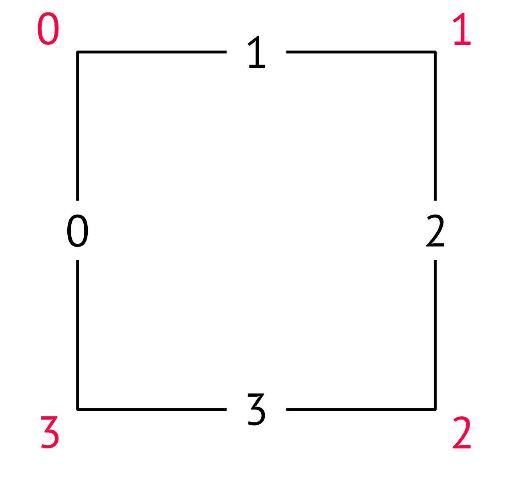

Edges and control points

To calculate the tessellation of an edge, you need to know the transformed mid-point 
of two control points. To calculate edge 2, for example, you get the midpoint of 
points 1 and 2 and find out the distance of that point from the camera. Where two 
patches join, it’s imperative to keep the tessellation level for the joined edges the 
same, otherwise you get cracks. By calculating the distance of the mid-point, you end 
up with the same result for the overlapping edges.

➤ In Tessellation.metal, create a new function before tessellation_main:

float calc_distance( 
  float3 pointA, float3 pointB, 
  float3 camera_position, 
  float4x4 modelMatrix) 
{ 
  float3 positionA = (modelMatrix * float4(pointA, 1)).xyz; 
  float3 positionB = (modelMatrix * float4(pointB, 1)).xyz; 
  float3 midpoint = (positionA + positionB) * 0.5; 
 
  float camera_distance = distance(camera_position, midpoint); 
  return camera_distance; 
}

484

Metal by Tutorials
Chapter 19: Tessellation & Terrains

This function takes in two points: The camera position and the model matrix. The 
function then finds the mid-point between the two points and calculates the 
distance from the camera.

➤ Remove all of the code from tessellation_main.

➤ Add the following line of code to tessellation_main to calculate the correct 
index into the tessellation factors array:

4 is the number of control points per patch, and pid is the patch ID. To index into 
the control points array for each patch, you skip over four control points at a time.

➤ Add this line to keep a running total of tessellation factors:

➤ Add a for loop for each of the edges:

for (int i = 0; i < 4; i++) { 
  int pointAIndex = i; 
  int pointBIndex = i + 1; 
  if (pointAIndex == 3) { 
    pointBIndex = 0; 
  } 
  int edgeIndex = pointBIndex; 
}

You cycle around four corners: 0, 1, 2, 3. On the first iteration, you calculate edge 1 
from the mid-point of points 0 and 1. On the fourth iteration, you use points 3 and 0 
to calculate edge 0.

➤ At the end of the for loop, call the distance calculation function:

float cameraDistance = 
  calc_distance( 
    control_points[pointAIndex + index], 
    control_points[pointBIndex + index], 
    camera_position.xyz, 
    modelMatrix);

485

Metal by Tutorials
Chapter 19: Tessellation & Terrains

➤ Then, still inside the for loop, set the tessellation factor for the current edge:

float tessellation = 
  max(4.0, terrain.maxTessellation / cameraDistance); 
factors[pid].edgeTessellationFactor[edgeIndex] = tessellation; 
totalTessellation += tessellation;

You set a minimum edge factor of 4. The maximum depends upon the camera 
distance and the maximum tessellation amount you specified for the terrain.

➤ After the for loop, add this:

factors[pid].insideTessellationFactor[0] = 
  totalTessellation * 0.25; 
factors[pid].insideTessellationFactor[1] = 
  totalTessellation * 0.25;

You set the two inside tessellation factors to be an average of the total tessellation 
for the patch. You’ve now finished creating the compute kernel which calculates the 
edge factors based on distance from the camera.

Lastly, you’ll revise some of the default render pipeline state tessellation parameters.

➤ Open Pipelines.swift, and in createRenderPSO(colorPixelFormat:), add this 
before the return:

// 1 
pipelineDescriptor.tessellationFactorStepFunction = .perPatch 
// 2 
pipelineDescriptor.maxTessellationFactor = 
Renderer.maxTessellation 
// 3 
pipelineDescriptor.tessellationPartitionMode = .fractionalEven

1. The step function was previously set to a default .constant, which sets the same 
edge factors on all patches. By setting this to .perPatch, the vertex function uses 
each patch’s edge and inside factors information in the tessellation factors array.

2. You set the maximum number of segments per patch for the tessellator.

3. The partition mode describes how these segments are split up. The default 
is .pow2, which rounds up to the nearest power of two. Using .fractionalEven, 
the tessellator rounds up to the nearest even integer, so it allows for much more 
variation of tessellation.

➤ Build and run the app, and rotate and zoom your patches.

486

Metal by Tutorials
Chapter 19: Tessellation & Terrains

As you reposition the patches, the tessellator recalculates their distance from the 
camera and tessellates accordingly. Tessellating is a neat superpower!

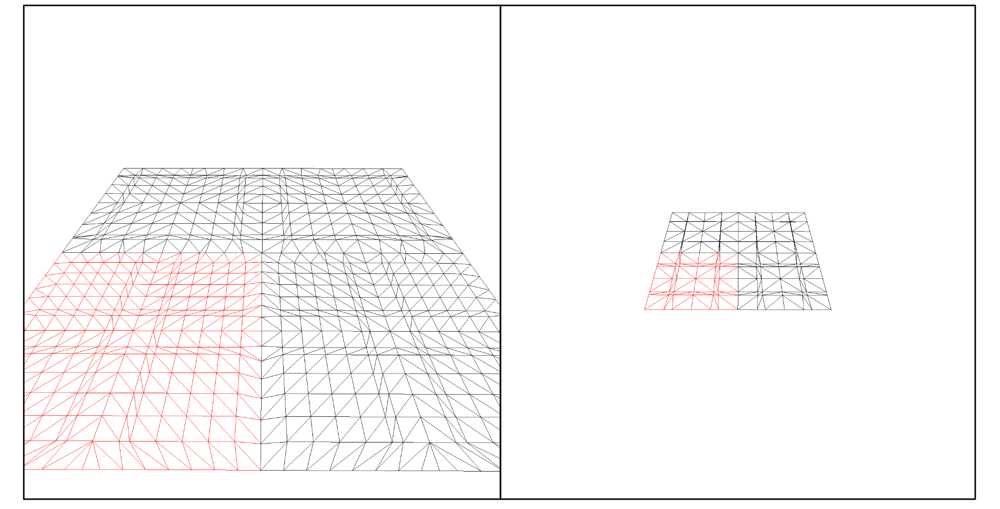

Tessellation by distance

Check where the patches join. The triangles of each side of the patch should connect.

Now that you’ve mastered tessellation, you’ll be able to add detail to your terrain.

Displacement

You’ve used textures for various purposes in earlier chapters. Now you’ll use a height 
map to change the height of each vertex. Height maps are grayscale images where 
you can use the texel value for the Y vertex position, with white being high and black 
being low. There are several height maps in Textures.xcassets you can experiment 
with.

➤ Open Renderer.swift, and create a property to hold the height map:

➤ In init(metalView:options:), before calling super.init(), initialize 
heightMap:

Here, you load the height map texture from the asset catalog.

487

Metal by Tutorials
Chapter 19: Tessellation & Terrains

➤ In render(commandBuffer:view:), add the following code before the draw call 
renderEncoder.drawPatches(...):

renderEncoder.setVertexTexture(heightMap, index: 0) 
renderEncoder.setVertexBytes( 
  &terrain, 
  length: MemoryLayout<Terrain>.stride, 
  index: 6)

You’re already familiar with sending textures to the fragment shader, which makes 
the texture available to the vertex shader in the same way. You also send the terrain 
setup details.

➤ Open Shaders.metal, and add the following to vertex_main’s parameters:

texture2d<float> heightMap [[texture(0)]], 
constant Terrain &terrain [[buffer(6)]],

You read in the texture and terrain information.

You’re currently only using the x and z position coordinates for the patch and 
leaving the y coordinate as zero. You’ll now map the y coordinate to the height 
indicated in the texture.

Just as you used u and v fragment values to read the appropriate texel in the 
fragment function, you use the x and z position coordinates to read the texel from 
the height map in the vertex function.

➤ After setting position, but before multiplying by the model-view-projection 
matrix, add this:

// 1 
float2 xy = (position.xz + terrain.size / 2.0) / terrain.size; 
// 2 
constexpr sampler sample; 
float4 color = heightMap.sample(sample, xy); 
out.color = float4(color.r); 
// 3 
float height = (color.r * 2 - 1) * terrain.height; 
position.y = height;

488

Metal by Tutorials
Chapter 19: Tessellation & Terrains

Going through the code:

1. You convert the patch control point values to be between 0 and 1 to be able to 
sample the height map. You include the terrain size because, although your patch 
control points are currently between -1 and 1, soon you’ll be making a larger 
terrain.

2. Create a default sampler and read the texture as you have done previously in the 
fragment function. The texture is a grayscale texture, so you only use the .r 
value.

3.
color is between 0 and 1, so for the height, shift the value to be between -1 and 
1, and multiply it by your terrain height scale setting. This is currently set to 1.

➤ Next, remove the following code from the end of the vertex function, because 
you’re now using the color of the height map.

out.color = float4(0); 
if (patchID == 0) { 
  out.color = float4(1, 0, 0, 1); 
}

➤ Open Renderer.swift, and change the rotation property initialization in 
modelMatrix to:

You’ll now look at your tessellated plane from the side, rather than from the top.

➤ Build and run the app to see the height map displacing the vertices. Turn off the 
wireframe, and notice how the white vertices are high and the black ones are low:

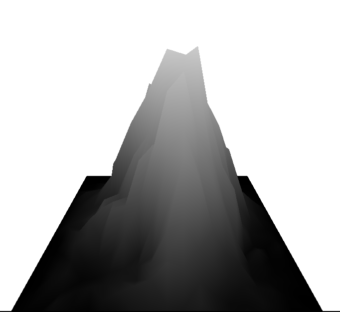

Height map displacement

489

Metal by Tutorials
Chapter 19: Tessellation & Terrains

This render doesn’t yet have much detail, but that’s about to change.

➤ In Renderer.swift, change the maxTessellation constant to:

static var maxTessellation: Int { 
  device?.supportsFamily(.apple5) ?? false ? 64 : 16 
}

These are the maximum values as described by the Metal feature set tables (https://
developer.apple.com/metal/Metal-Feature-Set-Tables.pdf). If you’re supporting 
older devices, you can increase the number of patches rendered.

➤ Change patches and terrain to:

let patches = (horizontal: 6, vertical: 6) 
lazy var terrain = Terrain( 
  size: [8, 8], 
  height: 1, 
  maxTessellation: UInt32(Renderer.maxTessellation))

This time, you’re creating thirty-six patches over sixteen units. Because 
maxTessellation now relies on device, you set terrain to initialize lazily.

➤ Build and run the app to see your patch height-mapped into a magnificent 
mountain. Don’t forget to click off the wireframe option to see your mountain render 
in its full glory.

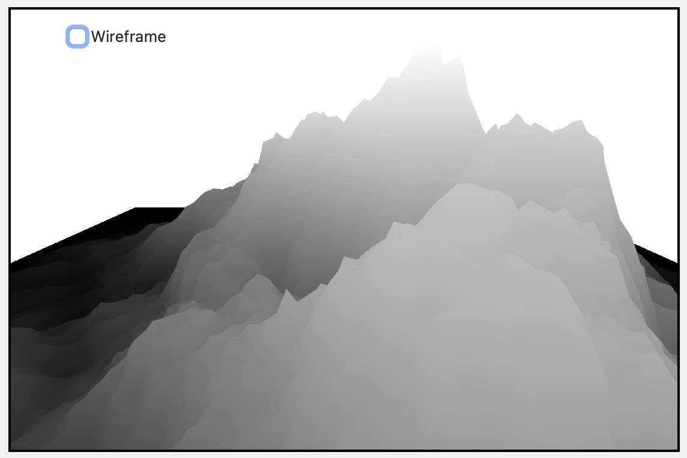

A tessellated mountain

Now it’s time to render your mountain with different colors and textures depending 
on height.

490

Metal by Tutorials
Chapter 19: Tessellation & Terrains

Shading By Height

In the previous section, you sampled the height map in the vertex function, and the 
colors are interpolated when sent to the fragment function. For maximum color 
detail, you need to sample from textures per fragment, not per vertex.

For that to work, you’ll set up three textures: snow, cliff and grass. You’ll send these 
textures to the fragment function and test the height there.

➤ Open Renderer.swift, and add three new texture properties to Renderer:

let cliffTexture: MTLTexture? 
let snowTexture: MTLTexture? 
let grassTexture: MTLTexture?

➤ In init(metalView:options:), where you create the height map, add this:

cliffTexture = TextureController.loadTexture(name: "cliff-
color") 
snowTexture = TextureController.loadTexture(name: "snow-color") 
grassTexture = TextureController.loadTexture(name: "grass-
color")

These textures are in the asset catalog.

➤ To send the textures to the fragment function, in 
render(commandBuffer:view:), add the following code before the renderEncoder 
draw call:

renderEncoder.setFragmentTexture(cliffTexture, index: 1) 
renderEncoder.setFragmentTexture(snowTexture, index: 2) 
renderEncoder.setFragmentTexture(grassTexture, index: 3)

➤ Open Shaders.metal, and add two new properties to VertexOut:

float height; 
float2 uv;

➤ At the end of vertex_main, before the return, set the value of these two 
properties:

out.uv = xy; 
out.height = height;

You send the height value from the vertex function to the fragment function so that 
you can assign fragments the correct texture for that height.

491

Metal by Tutorials
Chapter 19: Tessellation & Terrains

➤ Add the textures to the fragment_main parameters:

texture2d<float> cliffTexture [[texture(1)]], 
texture2d<float> snowTexture  [[texture(2)]], 
texture2d<float> grassTexture [[texture(3)]]

➤ Replace the contents of fragment_main with:

constexpr sampler sample(filter::linear, address::repeat); 
float tiling = 16.0; 
float4 color; 
if (in.height < -0.5) { 
  color = grassTexture.sample(sample, in.uv * tiling); 
} else if (in.height < 0.3) { 
  color = cliffTexture.sample(sample, in.uv * tiling); 
} else { 
  color = snowTexture.sample(sample, in.uv * tiling); 
} 
return color;

You create a tileable texture sampler and read in the appropriate texture for the 
height. Height is between -1 and 1, as set in vertex_main. You then tile the texture 
by 16 — an arbitrary value based on what looks best here.

➤ Build and run the app. Click the wireframe toggle to see your textured mountain.

You have grass at low altitudes and snowy peaks at high altitudes.

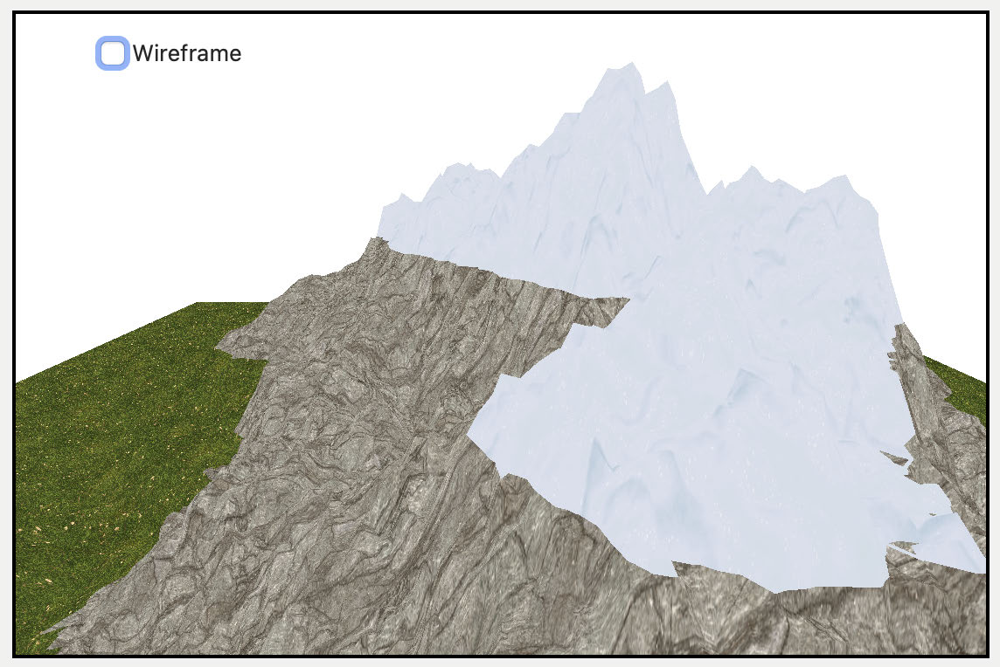

A textured mountain

As you zoom and rotate, notice how the mountain seems to ripple. This is the 
tessellation level of detail being over-sensitive. One way of dialing this down is to 
change the render pass’s tessellation partition mode.

492

Metal by Tutorials
Chapter 19: Tessellation & Terrains

➤ Open Pipelines.swift, and in createRenderPSO(colorPixelFormat:), change 
the pipelineDescriptor.tessellationPartitionMode assignment to:

➤ Build and run the app.

As the tessellator rounds up the edge factors to a power of two, there’s a larger 
difference in tessellation between the patches now, but the change in tessellation 
won’t occur so frequently, and the ripple disappears.

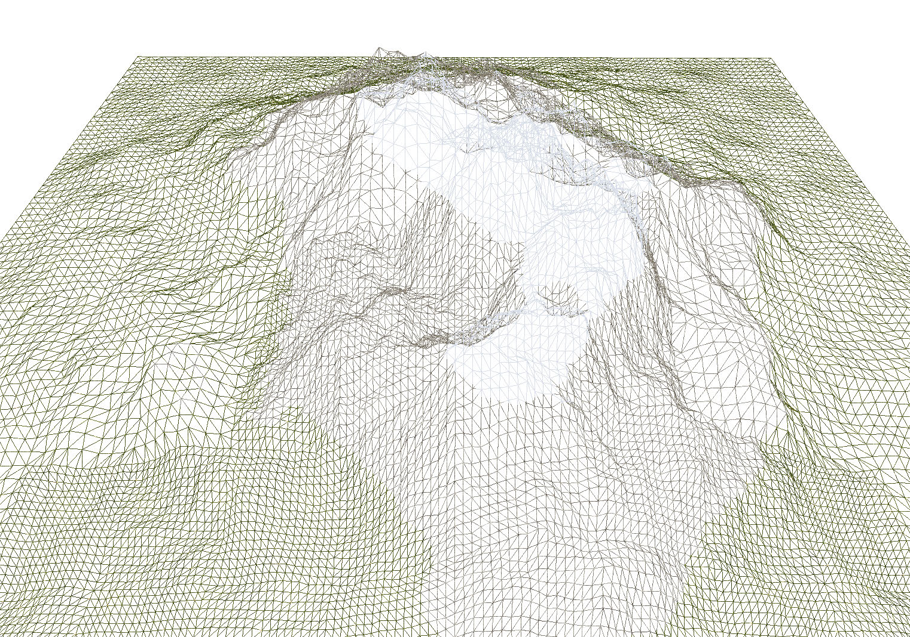

Rounding edge factors to a power of two

Shading By Slope

The snow line in your previous render is unrealistic. By checking the slope of the 
mountain, you can show the snow texture in flatter areas, and show the cliff texture 
where the slope is steep.

An easy way to calculate slope is to run a Sobel filter on the height map. A Sobel 
filter is an algorithm that looks at the gradients between neighboring pixels in an 
image. It’s useful for edge detection in computer vision and image processing, but in 
this case, you can use the gradient to determine the slope between neighboring 
pixels.

Metal Performance Shaders

The Metal Performance Shaders framework contains many useful, highly optimized 
shaders for image processing, matrix multiplication, machine learning and 
raytracing. You’ll read more about them in Chapter 30, “Metal Performance Shaders.” 
The shader you’ll use here is MPSImageSobel, which takes a source image texture 
and outputs the filtered image into a new grayscale texture. The whiter the pixel, the 
steeper the slope.

493

Metal by Tutorials
Chapter 19: Tessellation & Terrains

Note: In the challenge for this chapter, you’ll use the Sobel-filtered image and 
apply the three textures to your mountain depending on slope.

➤ Open Renderer.swift, and import the Metal Performance Shaders framework:

➤ Create a new method in Renderer to process the height map:

static func heightToSlope(source: MTLTexture) -> MTLTexture { 
}

Next, you’ll send the height map to this method and return a new texture. To create 
the new texture, you first need to create a texture descriptor where you can assign 
the size, pixel format and tell the GPU how you will use the texture.

➤ Add this to heightToSlope(source:):

let descriptor = 
  MTLTextureDescriptor.texture2DDescriptor( 
    pixelFormat: source.pixelFormat, 
    width: source.width, 
    height: source.height, 
    mipmapped: false) 
descriptor.usage = [.shaderWrite, .shaderRead]

You create a descriptor for textures that you want to both read and write. You’ll write 
to the texture in the MPS shader and read it in the fragment shader.

➤ Continue adding to the method:

guard let destination = 
  Renderer.device.makeTexture(descriptor: descriptor), 
  let commandBuffer = Renderer.commandQueue.makeCommandBuffer() 
else { 
  fatalError("Error creating Sobel texture") 
}

This creates the texture and the command buffer for the MPS shader.

➤ Now, add this:

let shader = MPSImageSobel(device: Renderer.device) 
shader.encode( 
  commandBuffer: commandBuffer, 
  sourceTexture: source,

494

Metal by Tutorials
Chapter 19: Tessellation & Terrains

destinationTexture: destination) 
commandBuffer.commit() 
return destination

You run the MPS shader and return the texture. That’s all there is to running a Metal 
Performance Shader on a texture.

Note: The height maps in the asset catalog have a pixel format of 8 Bit 
Normalized - R, or R8Unorm. Using the default pixel format of RGBA8Unorm 
with MPSImageSobel crashes. In any case, for grayscale texture maps that only 
use one channel, using R8Unorm as a pixel format is more efficient.

➤ To hold the terrain slope in a texture, add a new property to Renderer:

➤ In init(metalView:options:), before calling super.init(), initialize the 
texture:

The texture when created will look like this:

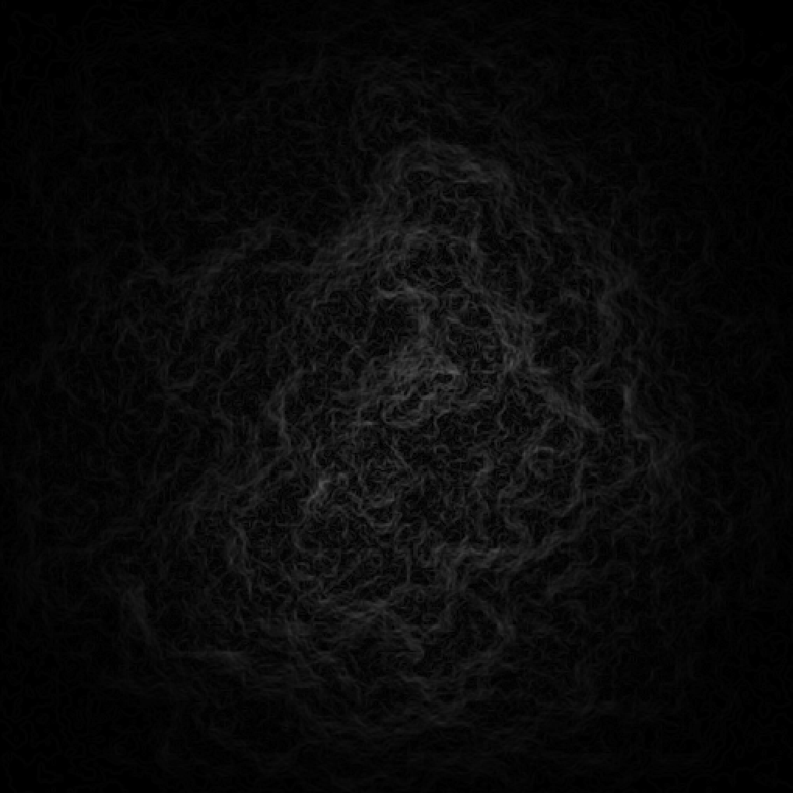

The Sobel filter

In the challenge, once you send this texture to the vertex shader, you’ll be able to see 
it using the Capture GPU Frame icon. The white parts are the steep slopes.

495

Metal by Tutorials
Chapter 19: Tessellation & Terrains

Challenge

Your challenge for this chapter is to use the slope texture from the Sobel filter to 
place snow on the mountain on the parts that aren’t steep. Because you don’t need 
pixel perfect accuracy, you can read the slope image in the vertex function and send 
that value to the fragment function. This is more efficient as there will be fewer 
texture reads in the vertex function than in the fragment function.

If everything goes well, you’ll render an image like this:

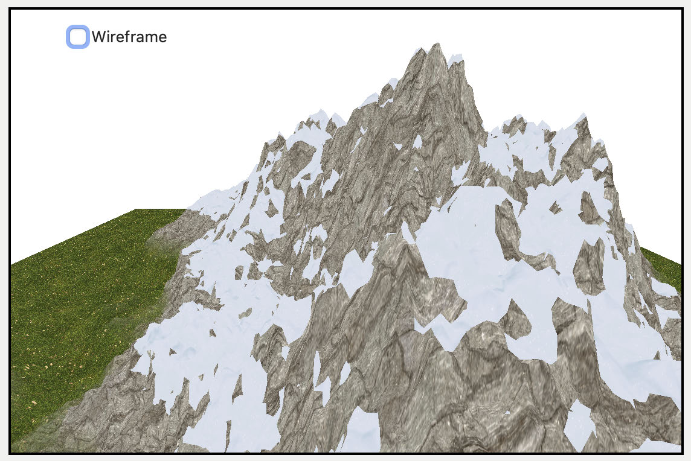

Shading by slope

Notice how the grass blends into the mountain. This is done using the mix() 
function.

Currently, you have three zones — the heights where you render the three different 
textures. The challenge project has four zones:

• grass: < -0.6 in height

• grass blended with mountain: -0.6 to -0.4

• mountain: -0.4 to -0.2

• mountain with snow on the flat parts: > -0.2

See if you can get your mountain to look like the challenge project in the projects 
directory for this chapter.

496

Metal by Tutorials
Chapter 19: Tessellation & Terrains

Key Points

• Tessellation utilizes a tessellator chip on the GPU to create extra vertices.

• You send patches to the GPU rather than vertices. The tessellator then breaks 
down these patches to smaller triangles.

• A patch can be either a triangle or a quad.

• The tessellation pipeline has an extra stage of setting edge and inside factors in a 
tessellation kernel. These factors decide the number of vertices that the tessellator 
should create.

• The vertex shader handles the vertices created by the tessellator.

• Vertex displacement uses a grayscale texture to move the vertex, generally in the y 
direction.

• The Sobel Metal Performance Shader takes a texture and generates a new texture 
that defines the slope of a pixel.

497

Metal by Tutorials
Chapter 19: Tessellation & Terrains

Where to Go From Here?

With very steep displacement, there can be lots of texture stretching between 
vertices. There are various algorithms to overcome this, and you can find one in 
Apple’s excellent sample code: Rendering Terrain Dynamically with Argument 
Buffers (https://developer.apple.com/documentation/metal/
fundamental_components/gpu_resources/dynamic_terrain_with_argument_buffers). 
This is a complex project that showcases argument buffers, but the dynamic terrain 
portion is interesting.

There’s another way to do blending. Instead of using mix(), the way you did in the 
challenge, you can use a texture map to define the different regions. This is known as 
texture splatting. You create a splat map with the red, blue and green channels 
describing up to three textures and where to use them.

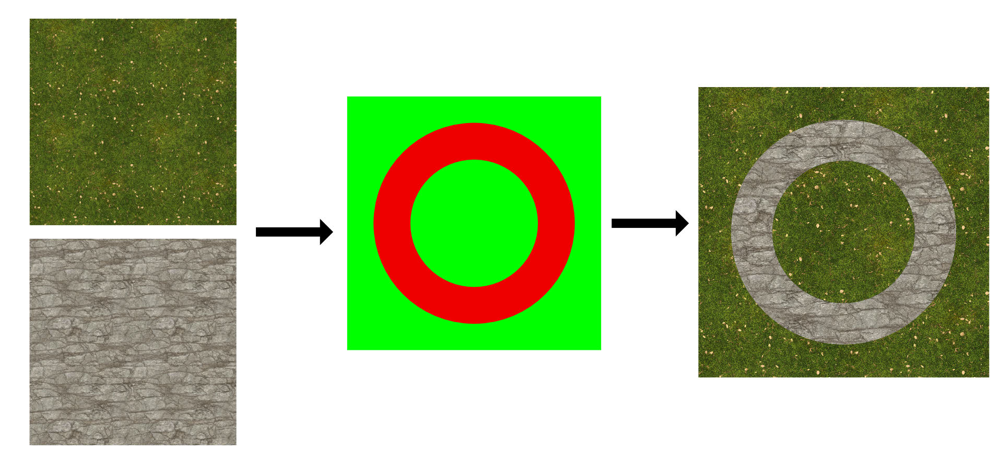

A splat map

With all of the techniques for reading and using textures that you’ve learned so far, 
texture splatting shouldn’t be too difficult for you to implement.

498

20