# Fragment 
Post-Processing

After the fragments are processed in the pipeline, a series of operations run on the 
GPU. These operations are sometimes referred to as Per-sample Processing (https://
www.khronos.org/opengl/wiki/Per-Sample_Processing) and include: alpha testing, 
depth testing, stencil testing, scissor testing, blending and anti-aliasing. You’ve 
already encountered a few of these operations in earlier chapters, such as depth 
testing and stencil testing. Now it’s time to revisit those concepts while also learning 
about the others.

499

Metal by Tutorials
Chapter 20: Fragment Post-Processing

The Starter App

➤ In Xcode, open the starter app for this chapter, and build and run the app.

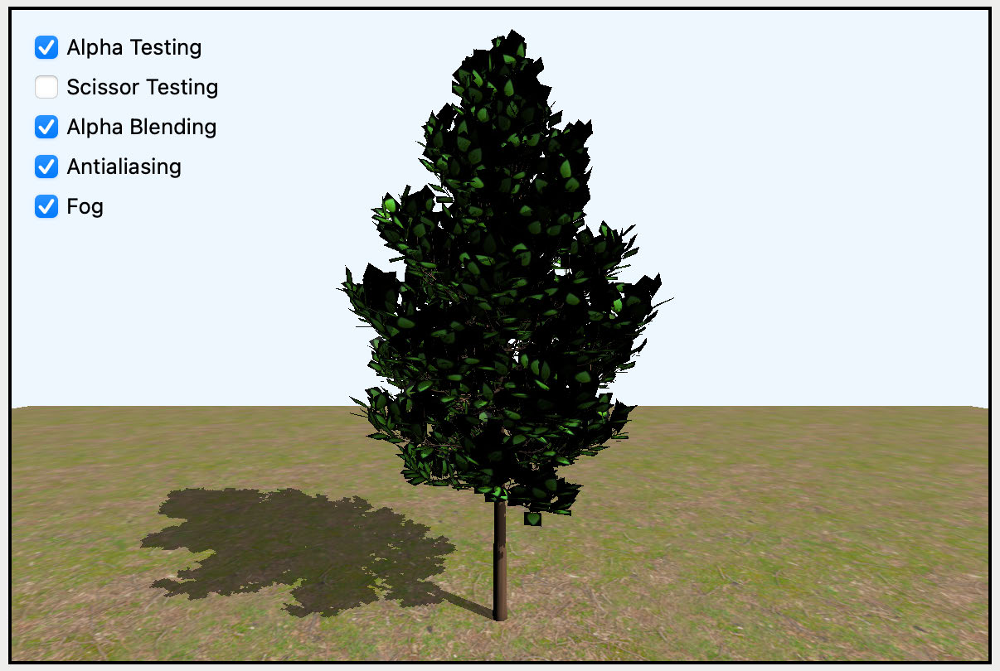

The starter app

The standard forward renderer renders the scene containing a ground plane and a 
tree. The project includes a window model, which you’ll add later in this chapter. You 
can use the options at the top-left of the screen to toggle the post-processing effects. 
Those effects aren’t active yet, but they will be soon!

Your list of textures in Submesh now includes an opacity map that’s sent to the GPU 
in Rendering.swift. Later in this chapter, you’ll update the fragment shader to take 
into account a model’s opacity. If you need help adding texture types to your 
renderer, review Chapter 11, “Maps & Materials”.

Using Booleans in a C Header File

In Renderer.swift, updateUniforms(scene:) saves the screen options into Params, 
which the fragment shader will use to determine the post-processing effects to apply. 
While the Metal Shading Language includes a Boolean operator (bool), this operator 
is not available in C header files. In the Shaders group included with this starter 
project, is stdbool.h. This file defines a bool, which Common.h imports. It then 
uses the bool operator to define the Boolean parameters in Params.

500

Metal by Tutorials
Chapter 20: Fragment Post-Processing

Alpha Testing

Move closer to the tree using the scroll wheel or the two-finger gesture on your 
trackpad, and you’ll notice the leaves look a little odd.

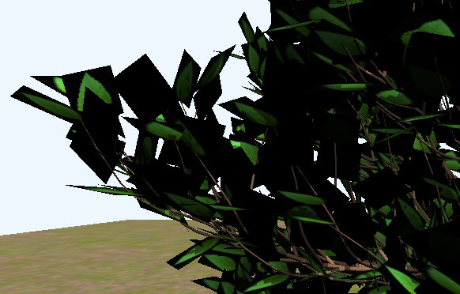

Opaque edge around leaves

The base color texture in tree.usdz looks like this:

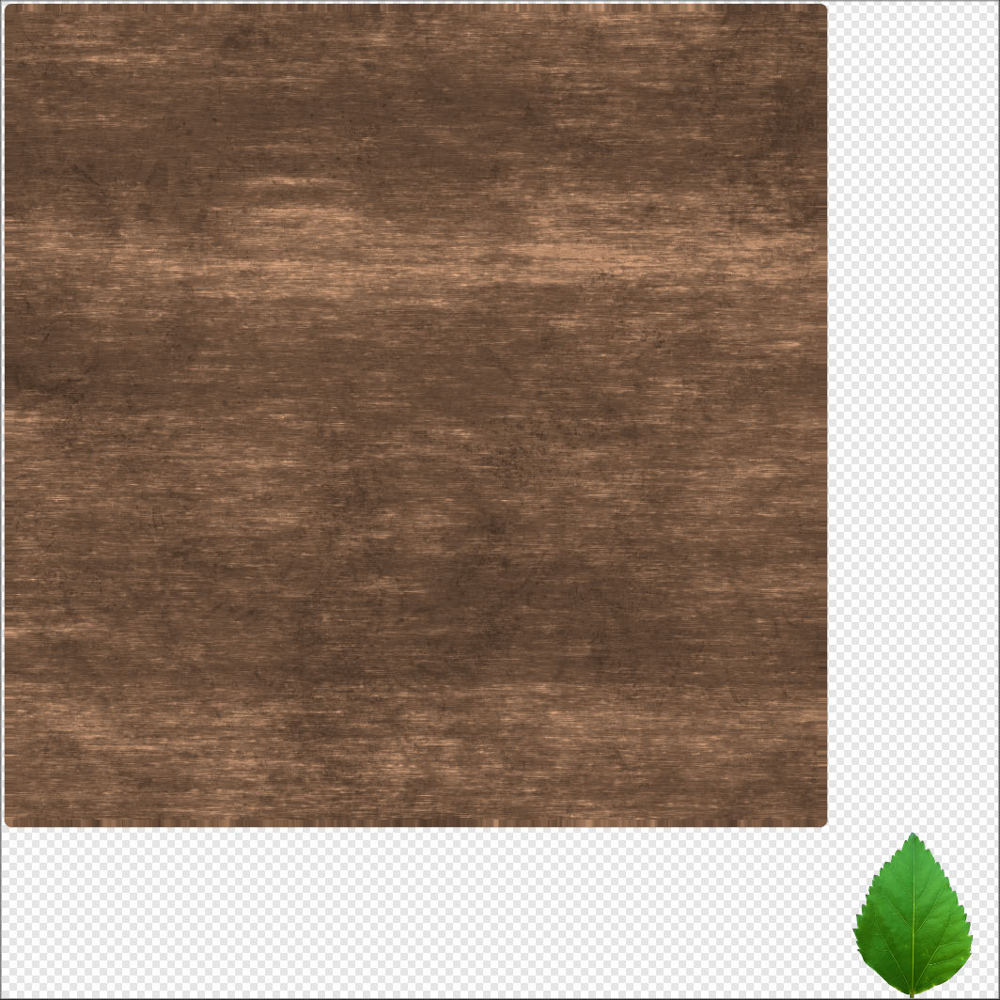

Tree-color texture

The area of the texture surrounding the leaf is transparent, yet it renders as either 
white or black, depending on the device.

To make the leaves look more natural, you’ll render the transparent part of the 
texture as transparent in the scene. However, before making this change, it’s 
important to understand the difference between transparent, translucent, and 
opaque objects.

A transparent object allows light to entirely pass through it. A translucent object 
distorts light as it passes through it. An opaque object does not allow any light to 
pass through it. Most objects in nature are opaque. Objects like water, glass and 
plastic are translucent.

501

Metal by Tutorials
Chapter 20: Fragment Post-Processing

Digital colors are formed using a combination of the three primary colors: red, green 
and blue — hence the color scheme RGB. However, there’s a fourth component you 
can add to the color definition: alpha. Alpha ranges from 0 (fully transparent) to 1 
(fully opaque). A common practice in determining transparency is to check the 
alpha property and ignore values below a certain threshold. This technique is known 
as alpha testing.

➤ Open Fragment.metal. In fragment_main, locate the conditional closure where 
you set material.baseColor.

➤ Replace the contents of if (!is_null_texture(baseColorTexture)) {} with:

float4 color = baseColorTexture.sample( 
  textureSampler, 
  in.uv * params.tiling); 
if (params.alphaTesting && color.a < 0.1) { 
  discard_fragment(); 
  return 0; 
} 
material.baseColor = color.rgb;

With this change, you now read in the alpha value of the color as well as the RGB 
values. If the alpha is less than a 0.1 threshold, and you’re performing alpha testing, 
then you discard the fragment. The GPU ignores the returned 0 and stops processing 
the fragment.

➤ Build and run the app, and toggle Alpha Testing to see the difference.

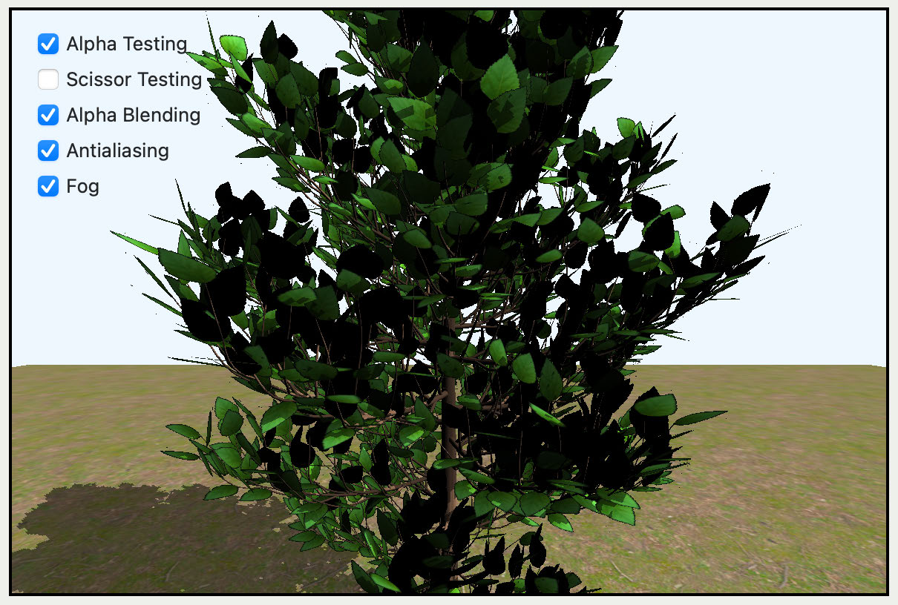

Alpha testing

That’s much better! Now, when you get closer to the tree, you’ll notice the extra 
edging around the leaves is gone.

502

Metal by Tutorials
Chapter 20: Fragment Post-Processing

Depth Testing

Depth testing compares the depth value of the current fragment to one stored in the 
framebuffer. If a fragment is farther away than the current depth value, this fragment 
fails the depth test and is discarded since it’s occluded by another fragment. You 
learned about depth testing in Chapter 7, “The Fragment Function”.

Stencil Testing

Stencil testing compares the value stored in a stencil attachment to a masked 
reference value. If a fragment makes it through the mask it’s kept, otherwise it’s 
discarded. You learned about stencil testing in Chapter 15, “Tile-Based Deferred 
Rendering”.

Scissor Testing

If you only want to render part of the screen, you can tell the GPU to render only 
within a particular rectangle. This is much more efficient than rendering the entire 
screen. The scissor test checks whether a fragment is inside a defined 2D area known 
as the scissor rectangle. If the fragment falls outside of this rectangle, it’s 
discarded.

➤ Open ForwardRenderPass.swift, which is where you set up your render 
command encoder to draw the models.

➤ In draw(commandBuffer:scene:uniforms:params:), before for model in 
scene.models, add this:

if params.scissorTesting { 
  let marginWidth = Int(params.width) / 4 
  let marginHeight = Int(params.height) / 4 
  let width = Int(params.width) / 2 
  let height = Int(params.height) / 2 
  let rect = MTLScissorRect( 
    x: marginWidth, y: marginHeight, width: width, height: 
height) 
  renderEncoder.setScissorRect(rect) 
}

Here, you set the scissor rectangle to half the width and height of the current metal 
view.

503

Metal by Tutorials
Chapter 20: Fragment Post-Processing

➤ Build and run the app, and turn on Scissor Testing.

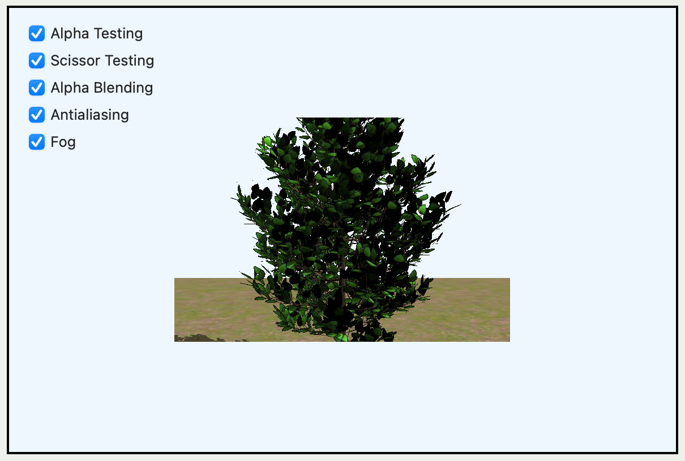

Scissor testing

Keep in mind that any objects rendered before you set the scissor rectangle are not 
affected. This means that you can choose to render within a scissor rectangle only 
for selected models.

Alpha Blending

Alpha blending is different from alpha testing in that the latter only works with total 
transparency. In that case, all you have to do is discard fragments. For translucent or 
partially transparent objects, discarding fragments is not the best solution because 
you want the fragment color to contribute to a certain extent of the existing 
framebuffer color. You don’t just want to replace it. You had a taste of blending in 
Chapter 14, “Deferred Rendering”, when you blended the result of your point lights.

The formula for alpha blending is as follows:

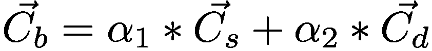

Going over this formula:

• Cs: Source color. The current color you just added to the scene.

• Cd: Destination color. The color that already exists in the framebuffer.

• Cb:  Final blended color.

• ⍺1 and ⍺2: The alpha (opacity) factors for the source and destination color, 
respectively.

504

Metal by Tutorials
Chapter 20: Fragment Post-Processing

The final blended color is the result of adding the products between the two colors 
and their opacity factors. The source color is the fragment color you put in front, and 
the destination color is the color already existing in the framebuffer.

Often the two factors are the inverse of each other transforming this equation into 
linear color interpolation:

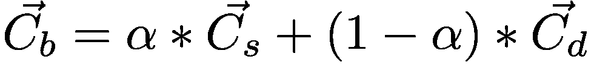

All right, time to install a glass window in front of the tree.

➤ Open GameScene.swift. In init(), change models = [ground, tree] to:

window.position = [0, 3, -1] 
models = [window, ground, tree]

➤ Build and run the app, and you’ll see the window:

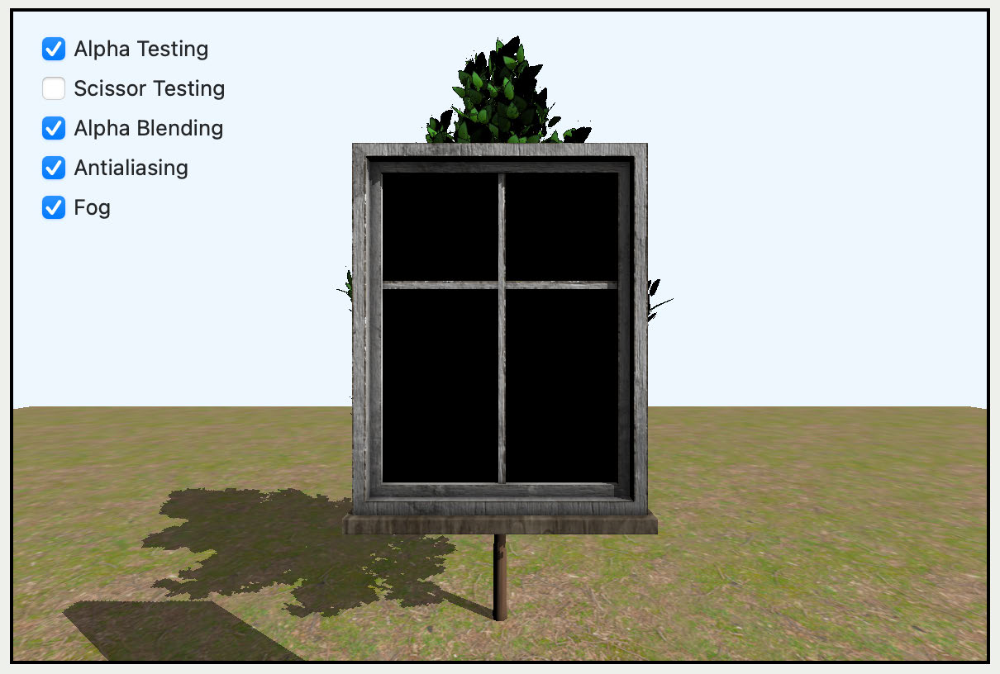

The window in the scene

You can’t yet view the tree through the window, but you’ll fix that with blending. 
There are two ways to work with blending: the programmable way and the fixed-
function way. You used programmable blending with color attachments in Chapter 
15, “Tile-Based Deferred Rendering”. In this chapter, you’ll use fixed-function 
blending.

505

Metal by Tutorials
Chapter 20: Fragment Post-Processing

Opacity

To define transparency in models, you either create a grayscale texture known as an 
opacity map, or you define opacity in the submesh’s material. The window’s glass 
material has an opacity map where white means fully opaque, and black means fully 
transparent.

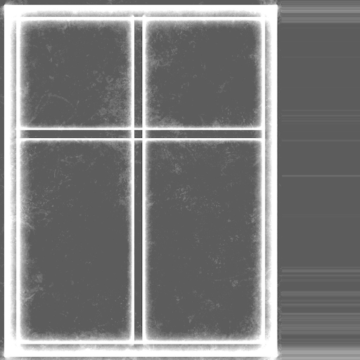

The window's opacity map

Blending

To implement blending, you need a second pipeline state in your render pass. You’ll 
still use the same shader functions, but you’ll turn on blending in the GPU.

➤ Open Pipelines.swift, and copy createForwardPSO() to a new method.

➤ Rename the new method to createForwardTransparentPSO().

➤ In createForwardTransparentPSO(), after setting 
pipelineDescriptor.colorAttachments[0].pixelFormat, add this:

// 1 
let attachment = pipelineDescriptor.colorAttachments[0] 
// 2 
attachment?.isBlendingEnabled = true 
// 3 
attachment?.rgbBlendOperation = .add 
// 4 
attachment?.sourceRGBBlendFactor = .sourceAlpha

506

Metal by Tutorials
Chapter 20: Fragment Post-Processing

// 5 
attachment?.destinationRGBBlendFactor = .oneMinusSourceAlpha

With this code, you:

1. Grab the first color attachment from the render pipeline descriptor. The color 
attachment is a color render target that specifies the color configuration and 
color operations associated with a render pipeline. The render target holds the 
drawable texture where the rendering output goes.

2. Enable blending on the attachment.

3. Specify the blending type of operation used for color. Blend operations determine 
how a source fragment is combined with a destination value in a color 
attachment to determine the pixel value to be written.

4. Specify the blend factor used by the source color. A blend factor is how much the 
color will contribute to the final blended color. If not specified, this value is 
always 1 (.one) by default.

5. Specify the blend factor used by the destination color. If not specified, this value 
is always 0 (.zero) by default.

Note: There are quite a few blend factors available to use other than 
sourceAlpha and oneMinusSourceAlpha. For a complete list of options, 
consult Apple’s official page for Blend Factors (https://developer.apple.com/
documentation/metal/mtlblendfactor).

➤ Open ForwardRenderPass.swift, and add a new property to ForwardRenderPass:

➤ In init(view:), add this:

transparentPSO = PipelineStates.createForwardTransparentPSO( 
  colorPixelFormat: view.colorPixelFormat)

You initialized the new pipeline state object with your new pipeline creation method.

➤ In draw(commandBuffer:scene:uniforms:params:), replace 
renderEncoder.setRenderPipelineState(pipelineState) with:

507

Metal by Tutorials
Chapter 20: Fragment Post-Processing

You temporarily replace the pipeline state with your new one. Blending is always 
enabled now.

➤ Open Fragment.metal. In fragment_main, after the conditional where you set 
material.baseColor, add this:

if (params.alphaBlending) { 
  if (!is_null_texture(opacityTexture)) { 
    material.opacity = 
      opacityTexture.sample(textureSampler, in.uv).r; 
  } 
}

If you have the alpha blending option turned on, read the value from a provided 
opacity texture. If no texture is provided, you’ll use the default from material, 
loaded with the model’s submesh.

➤ At the end of fragment_main, replace the return value with:

You return the opacity value in the alpha channel.

➤ Build and run the app.

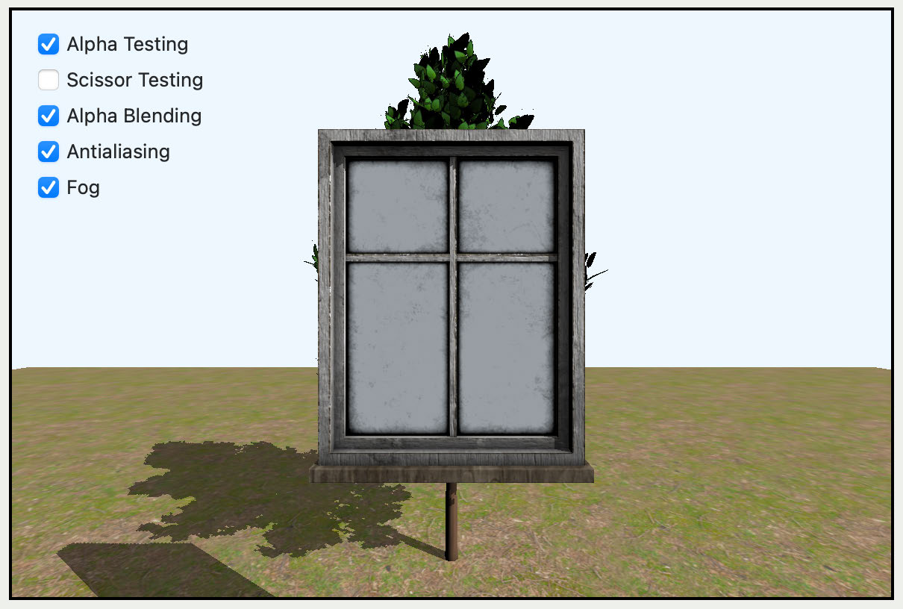

Opacity not working

Even though you’ve set blending in the pipeline state and changed the opacity in the 
fragment function, the opacity doesn’t appear to be working. The glass has changed 
color from the previous render. This indicates that the transparency is actually 
working. It’s showing the view’s clear color through the glass, rather than the tree 
and the ground.

508

Metal by Tutorials
Chapter 20: Fragment Post-Processing

➤ Open GameScene.swift. In init(), change models = [window, ground, tree] 
to:

➤ Build and run the app.

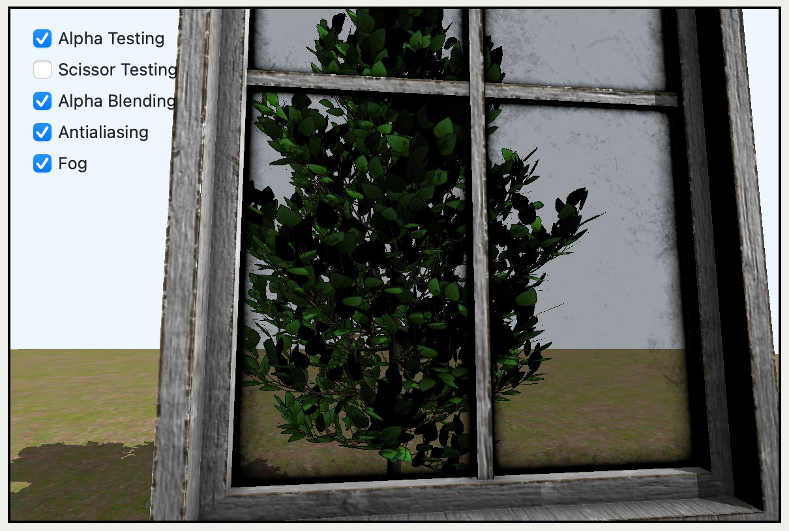

Opacity is working

The opacity is working, and if you zoom in, you can see the weathering on the old 
glass. This is achieved by varying the opacity grayscale values in the texture.

Note: Remember if you want to examine textures, you can use GPU Frame 
Capture to see what the GPU is processing.

Transparent Mesh Rendering Order

The blending order is important. Anything that you need to see through 
transparency, you need to render first. However, it may not always be convenient to 
work out exactly which models require blending. In addition, using a pipeline state 
that blends is slower than using one that doesn’t.

➤ Undo the previous change to models so that you render the window first again.

First set up your models to indicate whether any of the submeshes aren’t opaque.

➤ Open Submesh.swift, and add a computed property to Submesh:

var transparency: Bool { 
  return textures.opacity != nil || material.opacity < 1.0 
}

509

Metal by Tutorials
Chapter 20: Fragment Post-Processing

transparency is true if the submesh textures or material indicate transparency.

➤ Open Model.swift, and add a new property:

To initialize this property, you’ll process all of the model’s submeshes, and if any of 
them have transparency set to true, then the model is not fully opaque.

➤ At the end of init(name:), add this:

hasTransparency = meshes.contains { mesh in 
  mesh.submeshes.contains { $0.transparency } 
}

If any of the model’s submeshes have transparency, you’ll process the model during 
the transparency render phase.

➤ Open Rendering.swift. In render(encoder:uniforms:params:), locate for 
submesh in mesh.submeshes.

➤ At the top of the for loop, add this:

You only render the submesh if its transparency matches the current transparency in 
the render loop.

➤ Open Common.h, and add a new property to Params:

You’ll use this property to track when you’re currently rendering transparent 
submeshes.

➤ Open ForwardRenderPass.swift. In 
draw(commandBuffer:scene:uniforms:params:), change the pipeline state back 
to what it was originally:

➤ Locate for model in scene.models. Before the for loop, add this:

var params = params 
params.transparency = false

510

Metal by Tutorials
Chapter 20: Fragment Post-Processing

In the render loop, you’ll only render submeshes with no transparency.

➤ Now, before renderEncoder.endEncoding(), add this:

// transparent mesh 
renderEncoder.pushDebugGroup("Transparency") 
let models = scene.models.filter { 
  $0.hasTransparency 
} 
params.transparency = true 
if params.alphaBlending { 
  renderEncoder.setRenderPipelineState(transparentPSO) 
} 
for model in models { 
  model.render( 
    encoder: renderEncoder, 
    uniforms: uniforms, 
    params: params) 
} 
renderEncoder.popDebugGroup()

Here, you filter the scene models array to find only those models that have a 
transparent submesh. You then change the pipeline state to use alpha blending, and 
render the filtered models.

➤ Build and run the app.

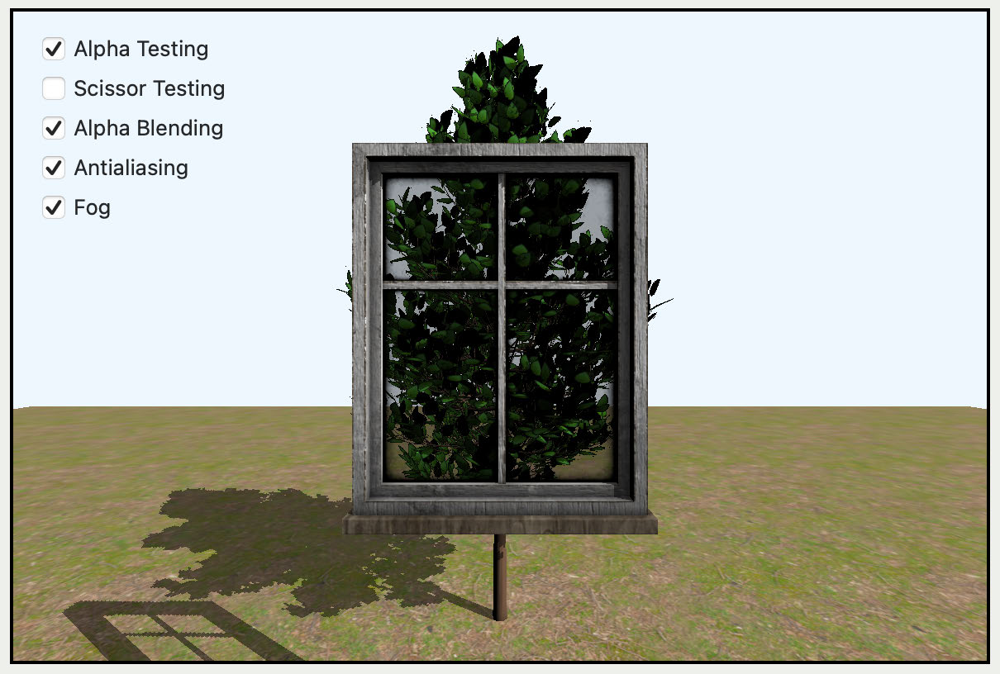

Alpha blending

You can now see through your window.

511

Metal by Tutorials
Chapter 20: Fragment Post-Processing

Note: If you have several transparent meshes overlaying each other, you’ll 
need to sort them to ensure that you render them in strict order from back to 
front.

➤ In the app, turn off Alpha Blending.

At the end of the render loop, the pipeline state doesn’t switch to the blending one, 
so the window becomes opaque again.

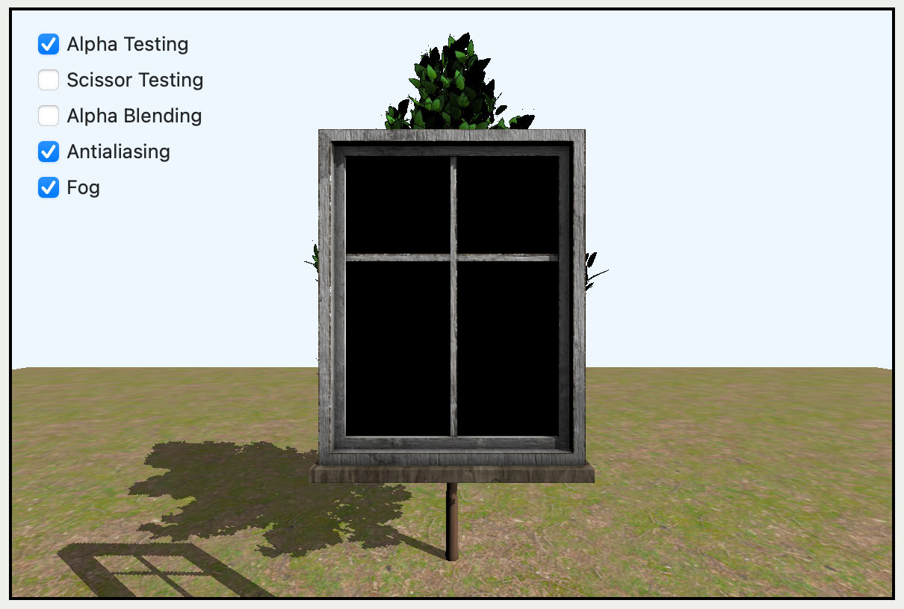

Alpha blending turned off

Antialiasing

Often, rendered models show slightly jagged edges that are visible when you zoom 
in. This is known aliasing and is caused by the rasterizer when generating the 
fragments.

Rasterizing a triangle

512

Metal by Tutorials
Chapter 20: Fragment Post-Processing

If you look at the edges of a triangle — or any straight line with a slope — you’ll 
notice the line doesn’t always go precisely through the center of a pixel. Some pixels 
are colored above the line and some below it. The solution to fixing aliasing is to use 
antialiasing. Antialiasing applies techniques to render smoother edges.

By default, the pipeline uses one sample point (subpixel) for each pixel that is close 
to the line to determine if they meet. However, it’s possible to use four or more 
points for increased accuracy of intersection determination. This is known as 
Multisample Antialiasing (MSAA), and it’s more expensive to compute.

Next, you’re going to configure the fixed-function MSAA on the pipeline and enable 
antialiasing on both the tree and the window.

➤ Open Pipelines.swift, and duplicate both 
createForwardPSO(colorPixelFormat:) and 
createForwardTransparentPSO(colorPixelFormat:).

➤ Name them createForwardPSO_MSAA(colorPixelFormat:) and 
createForwardTransparentPSO_MSAA(colorPixelFormat:), respectively.

➤ In both new methods, before the return, add this:

➤ Open ForwardRenderPass.swift, and add two new properties:

var pipelineStateMSAA: MTLRenderPipelineState 
var transparentPSOMSAA: MTLRenderPipelineState

➤ In init(), initialize the new pipeline states with your new pipeline state creation 
methods:

pipelineStateMSAA = PipelineStates.createForwardPSO_MSAA( 
  colorPixelFormat: view.colorPixelFormat) 
transparentPSOMSAA = 
  PipelineStates.createForwardTransparentPSO_MSAA( 
    colorPixelFormat: view.colorPixelFormat)

➤ At the top of draw(commandBuffer:scene:uniforms:params:), add this:

let pipelineState = params.antialiasing ? 
  pipelineStateMSAA : pipelineState 
let transparentPSO = params.antialiasing ? 
  transparentPSOMSAA : transparentPSO

513

Metal by Tutorials
Chapter 20: Fragment Post-Processing

Depending upon whether the user has selected Antialiasing, you set the different 
pipeline state.

The render target texture must match the same sample count as the pipeline state.

➤ Open Renderer.swift, and at the top of draw(scene:in:) before the guard, add 
this:

The current render pass descriptor will use the sample count to create the render 
target texture with the correct antialiasing.

➤ Build and run the app. On modern retina devices, this effect can be quite difficult 
to see. But, if you zoom in to a straight line on a slope — such as the tree trunk — and 
toggle Antialiasing, you may notice the difference.

Antialiasing

514

Metal by Tutorials
Chapter 20: Fragment Post-Processing

Fog

Let’s have a bit more fun and add some fog to the scene!

Fog is quite useful in rendering. First, it serves as a far delimiter for rendered 
content. The renderer can ignore objects that get lost in the fog since they’re not 
visible anymore. Second, fog helps you avoid the popping-up effect that can happen 
when objects that are farther away from the camera “pop” into the scene as the 
camera moves closer. With fog, you can make their appearance into the scene more 
gradual.

Note: Fog isn’t a post-processing effect, it’s added in the fragment shader.

➤ Open Fragment.metal, and add a new function before fragment_main:

float4 fog(float4 position, float4 color) { 
  // 1 
  float distance = position.z / position.w; 
  // 2 
  float density = 0.2; 
  float fog = 1.0 - clamp(exp(-density * distance), 0.0, 1.0); 
  // 3 
  float4 fogColor = float4(1.0); 
  color = mix(color, fogColor, fog); 
  return color; 
}

With this code, you:

1. Calculate the depth of the fragment position.

2. Define a distribution function that the fog will use next. It’s the inverse of the 
clamped (between 0 and 1) product between the fog density and the depth 
calculated in the previous step.

3. Mix the current color with the fog color (which you deliberately set to white) 
using the distribution function defined in the previous step.

515

Metal by Tutorials
Chapter 20: Fragment Post-Processing

➤ Change the return value of fragment_main to:

float4 color = 
  float4(diffuseColor + specularColor, material.opacity); 
if (params.fog) { 
  color = fog(in.position, color); 
} 
return color;

Here, you include the fog value in the final color.

➤ Build and run the app.

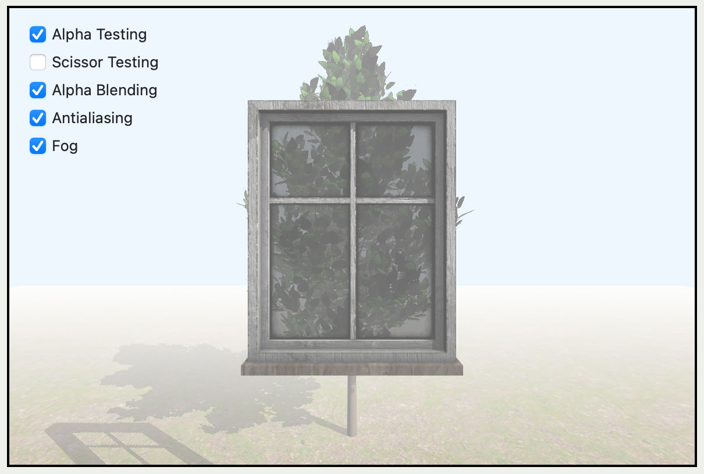

Fog

Perfect, the entire scene is foggy. The closer you get to the tree, the less dense the 
fog. The same happens to the ground. Like with real fog, the closer you get to an 
object, the easier it is to see it. Check it out: get closer to the tree, and you’ll see it a 
lot better.

Because this effect is worked in the fragment shader, the sky is not affected by fog. 
The sky color is coming from the MTKView instead of being rendered. In the next 
chapter, you’ll create a rendered sky that you can affect with fog.

516

Metal by Tutorials
Chapter 20: Fragment Post-Processing

Key Points

• Per-sample processing takes place in the GPU pipeline after the GPU processes 
fragments.

• Using discard_fragment() in the fragment function halts further processing on 
the fragment.

• To render only part of the texture, you can define a 2D scissor rectangle. The GPU 
discards any fragments outside of this rectangle.

• You set up the pipeline state object with blending when you require transparency. 
You can then set the alpha value of the fragment in the fragment function. 
Without blending in the pipeline state object, all fragments are fully opaque, no 
matter their alpha value.

• Multisample antialiasing improves render quality. You set up MSAA with the 
sampleCount in the pipeline state descriptor.

• You can add fog with some clever distance shading in the fragment function.

Where to Go From Here?

Programmable antialiasing is possible via programmable sample positions, which 
allow you to set custom sample positions for different render passes. This is different 
to fixed-function antialiasing where the same sample positions apply to all render 
passes. For further reading, you can review Apple’s Positioning Samples 
Programmatically (https://developer.apple.com/documentation/metal/
mtlrenderpassdescriptor/positioning_samples_programmatically) article.

517

21