# Image-Based 
Lighting

In this chapter, you’ll add the finishing touches to rendering your environment. 
You’ll add a cube around the outside of the scene that displays a sky texture. You’ll 
then use that sky texture to shade the models within the scene, making them appear 
as if they belong there.

Look at the following comparison of two renders.

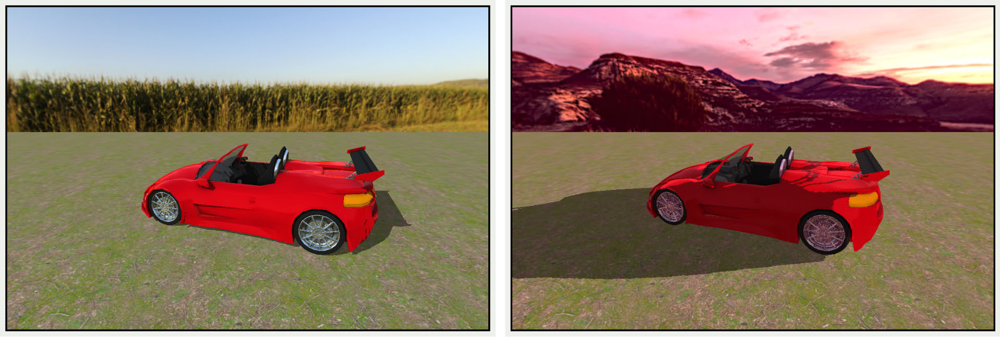

The final and challenge renders

This comparison demonstrates how you can use the same shader code but change 
the sky image to create different lighting environments. The rendered models reflect 
the tinge of color from the sky.

518

Metal by Tutorials
Chapter 21: Image-Based Lighting

The Starter Project

➤ In Xcode, open the starter project for this chapter and build and run the app.

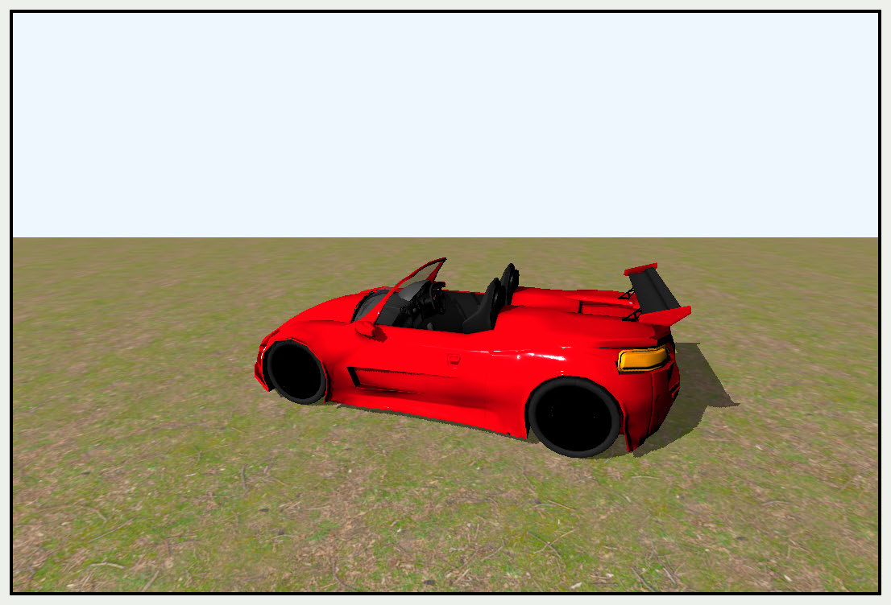

The starter project

The project contains the forward renderer with transparency from the previous 
chapter. The scene uses an arcball camera, and contains a ground plane and car. The 
scene lighting consists of one sunlight.

There are a few additional files that you’ll use throughout the chapter. Common.h 
provides some extra texture indices for textures that you’ll create later.

Aside from the darkness of the lighting, there are some glaring problems with the 
render:

• All metals, such as the metallic wheel hubs, look dull. Pure metals reflect their 
surroundings, and there are currently no surroundings to reflect.

• Where the light doesn’t directly hit the car, the color is pure black. This happens 
because the app doesn’t provide any ambient light. Later in this chapter, you’ll use 
the skylight as global ambient light.

The Skybox

Currently, the sky is a single color, which looks unrealistic. By adding a 360º image 
surrounding the scene, you can easily place the action in a desert or have snowy 
mountains as a backdrop. To do this, you’ll create a skybox cube that surrounds the 
entire scene.

519

Metal by Tutorials
Chapter 21: Image-Based Lighting

This skybox cube is the same as an ordinary model, but instead of viewing it from the 
outside, the camera is at the center of the cube looking out. You’ll texture the cube 
with a cube texture, which gives you a cheap way of creating a complete 
environment.

You may think the cube will be distorted at the corners, but as you’ll see, each 
fragment of the cube will render at an effectively infinite distance, and no distortion 
will occur. Cube maps are much easier to create than spherical ones and are 
hardware optimized.

➤ In the Geometry group, create a new Swift file for the skybox class named 
Skybox.swift.

➤ Replace the default code with:

import MetalKit

struct Skybox { 
  let mesh: MTKMesh 
  var skyTexture: MTLTexture? 
  let pipelineState: MTLRenderPipelineState 
  let depthStencilState: MTLDepthStencilState? 
}

Going through the skybox properties:

• mesh: A cube that you’ll create using a Model I/O primitive.

• skyTexture: A cube texture of the name given in the initializer. This is the texture 
that you’ll see in the background.

• pipelineState: The skybox needs a simple vertex and fragment function, 
therefore it needs its own pipeline.

• depthStencilState: Each pixel of the skybox will be positioned at the very edge 
of normalized clip space. The default depth stencil state in RenderPass.swift 
renders the fragment if the fragment is less than the current depth value. The 
skybox depth stencil should test less than or equal to the current depth value. 
You’ll see why shortly.

Your project won’t compile until you’ve initialized all stored properties.

➤ Add the initializer to Skybox:

init(textureName: String?) { 
  let allocator = 
    MTKMeshBufferAllocator(device: Renderer.device)

520

Metal by Tutorials
Chapter 21: Image-Based Lighting

let cube = MDLMesh( 
    boxWithExtent: [1, 1, 1], 
    segments: [1, 1, 1], 
    inwardNormals: true, 
    geometryType: .triangles, 
    allocator: allocator) 
  do { 
    mesh = try MTKMesh( 
      mesh: cube, device: Renderer.device) 
  } catch { 
    fatalError("failed to create skybox mesh") 
  } 
}

Here, you create a cube mesh. Notice that you set the normals to face inwards. That’s 
because the whole scene will appear to be inside the cube.

➤ In the Render Passes group, open Pipelines.swift, and add a new method:

static func createSkyboxPSO( 
  vertexDescriptor: MTLVertexDescriptor? 
) -> MTLRenderPipelineState { 
  let vertexFunction = 
    Renderer.library?.makeFunction(name: "vertex_skybox") 
  let fragmentFunction = 
    Renderer.library?.makeFunction(name: "fragment_skybox") 
  let pipelineDescriptor = MTLRenderPipelineDescriptor() 
  pipelineDescriptor.vertexFunction = vertexFunction 
  pipelineDescriptor.fragmentFunction = fragmentFunction 
  pipelineDescriptor.colorAttachments[0].pixelFormat = 
    Renderer.viewColorPixelFormat 
  pipelineDescriptor.depthAttachmentPixelFormat = .depth32Float 
  pipelineDescriptor.vertexDescriptor = vertexDescriptor 
  return createPSO(descriptor: pipelineDescriptor) 
}

When you create the pipeline state, you’ll pass in the skybox cube’s Model I/O vertex 
descriptor. You’ll write the two new shader functions shortly.

➤ Open Skybox.swift, and add a new method to create the depth stencil state:

static func buildDepthStencilState() -> MTLDepthStencilState? { 
  let descriptor = MTLDepthStencilDescriptor() 
  descriptor.depthCompareFunction = .lessEqual 
  descriptor.isDepthWriteEnabled = true 
  return Renderer.device.makeDepthStencilState( 
    descriptor: descriptor) 
}

521

Metal by Tutorials
Chapter 21: Image-Based Lighting

This creates the depth stencil state with the less than or equal comparison method 
mentioned earlier.

➤ Complete the initialization by adding the following code to the end of 
init(textureName:):

pipelineState = PipelineStates.createSkyboxPSO( 
  vertexDescriptor: MTKMetalVertexDescriptorFromModelIO( 
    cube.vertexDescriptor)) 
depthStencilState = Self.buildDepthStencilState()

You initialize the skybox’s pipeline state with the vertex descriptor provided by 
Model I/O.

Rendering the Skybox

➤ Still in Skybox.swift, create a new method to perform the skybox rendering:

func render( 
  encoder: MTLRenderCommandEncoder, 
  uniforms: Uniforms 
) { 
  encoder.pushDebugGroup("Skybox") 
  encoder.setRenderPipelineState(pipelineState) 
  // encoder.setDepthStencilState(depthStencilState) 
  encoder.setVertexBuffer( 
    mesh.vertexBuffers[0].buffer, 
    offset: 0, 
    index: 0) 
}

Here, you set up the render command encoder with the properties you initialized. 
Leave the depth stencil state line commented out for the moment.

➤ Add this code at the end of render(encoder:uniforms:):

var uniforms = uniforms 
uniforms.viewMatrix.columns.3 = [0, 0, 0, 1] 
encoder.setVertexBytes( 
  &uniforms, 
  length: MemoryLayout<Uniforms>.stride, 
  index: UniformsBuffer.index)

When you render a scene, you multiply each model’s matrix with the view matrix and 
the projection matrix. As you move through the scene, it appears as if the camera is 
moving through the scene, but in fact, the whole scene is moving around the camera.

522

Metal by Tutorials
Chapter 21: Image-Based Lighting

You don’t want the skybox to move, so you zero out column 3 of viewMatrix to 
remove the camera’s translation.

However, you do still want the skybox to rotate with the rest of the scene, and also 
render with projection, so you send the uniform matrices to the GPU.

➤ Add the following after the code you just added:

let submesh = mesh.submeshes[0] 
encoder.drawIndexedPrimitives( 
  type: .triangle, 
  indexCount: submesh.indexCount, 
  indexType: submesh.indexType, 
  indexBuffer: submesh.indexBuffer.buffer, 
  indexBufferOffset: 0) 
encoder.popDebugGroup()

Here, you draw the cube’s submesh.

The Skybox Shader Functions

In the Shaders group, create a new Metal file named Skybox.metal.

➤ Add the following code to the new file:

#import "Common.h"

struct VertexIn { 
  float4 position [[attribute(Position)]]; 
};

struct VertexOut { 
  float4 position [[position]]; 
};

The structures are simple so far — you need a position in and a position out.

➤ Add the shader functions:

vertex VertexOut vertex_skybox( 
  const VertexIn in [[stage_in]], 
  constant Uniforms &uniforms [[buffer(UniformsBuffer)]]) 
{ 
  VertexOut out; 
  float4x4 vp = uniforms.projectionMatrix * uniforms.viewMatrix; 
  out.position = (vp * in.position).xyww; 
  return out; 
}

523

Metal by Tutorials
Chapter 21: Image-Based Lighting

fragment half4 fragment_skybox( 
  VertexOut in [[stage_in]]) { 
  return half4(1, 1, 0, 1); 
}

Here, you create two very simple shaders — the vertex function moves the vertices to 
the projected position, and the fragment function returns yellow. This is a temporary 
color, which is startling enough that you’ll be able to see where the skybox renders.

Notice in the vertex function that you swizzled the xyzw position to xyww. To place 
the sky as far away as possible, it needs to be at the very edge of NDC.

During the change from clip space to NDC, the coordinates are all divided by w 
during the perspective divide stage. This will now result in the z coordinate being 1, 
which will ensure that the skybox renders behind everything else within the scene.

The following diagram shows the skybox in camera space rotated by 45º. After 
projection and the perspective divide, the vertices will be flat against the far NDC 
plane.

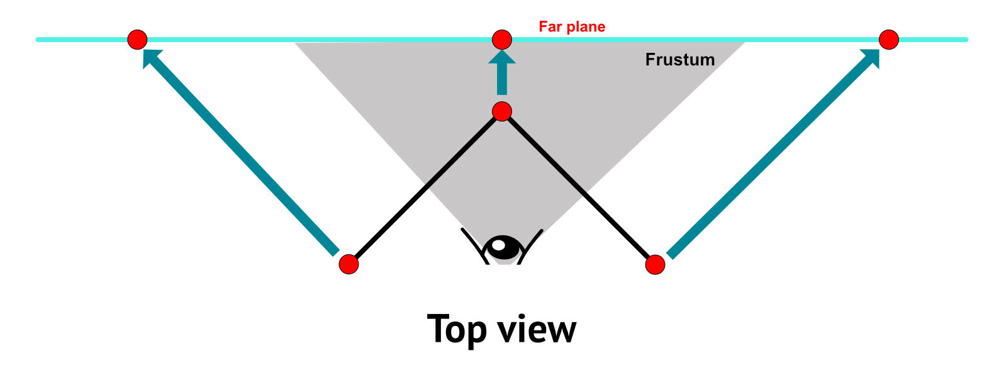

Integrating the Skybox Into the Scene

➤ Open GameScene.swift, and add a new property to GameScene:

➤ Add the following code to the top of init():

You haven’t written the code for the skybox texture yet, but soon you’ll set it up so 
that nil will generate a physically simulated sky, and providing a texture name will 
load that sky texture.

524

Metal by Tutorials
Chapter 21: Image-Based Lighting

➤ In the Render Passes group, open ForwardRenderPass.swift, and in 
draw(commandBuffer:scene:uniforms:params:), locate // transparent mesh.

➤ Add the following code before that comment:

scene.skybox?.render( 
  encoder: renderEncoder, 
  uniforms: uniforms)

You render the skybox only during the opaque pass, after the opaque meshes.

It may seem odd that you’re rendering the skybox after rendering the scene models, 
when it’s going to be the object that’s behind everything else. Remember early-Z 
testing from Chapter 3, “The Rendering Pipeline”: when objects are rendered, most 
of the skybox fragments will be behind them and will fail the depth test. Therefore, 
it’s more efficient to render the skybox as late as possible. You have to render before 
the transparent pass, so that any transparency will include the skybox texture.

You’ve now integrated the skybox into the rendering process.

➤ Build and run the app to see the new yellow sky.

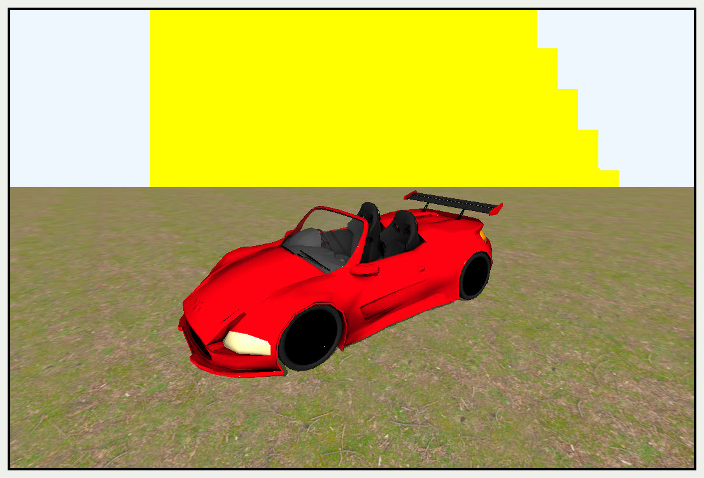

A flickering sky

Note: If you’re using a Mac with an Intel processor, you may not see any yellow 
at all. Don’t worry - continue with the next step regardless to overcome this.

525

Metal by Tutorials
Chapter 21: Image-Based Lighting

As you rotate the scene, the yellow sky flickers and shows the blue of the metal 
view’s clear color. This happens because the current depth stencil state is from 
ForwardRenderPass, and it’s comparing new fragments to less than the current 
depth buffer. The skybox coordinates are right on the edge, so sometimes they’re 
equal to the edge of clip space.

➤ Open Skybox.swift, and in render(encoder:uniforms:), uncomment 
encoder.setDepthStencilState(depthStencilState), and build and run the app 
again.

This time, the depth comparison is correct, and the sky is the solid yellow returned 
from the skybox fragment shader.

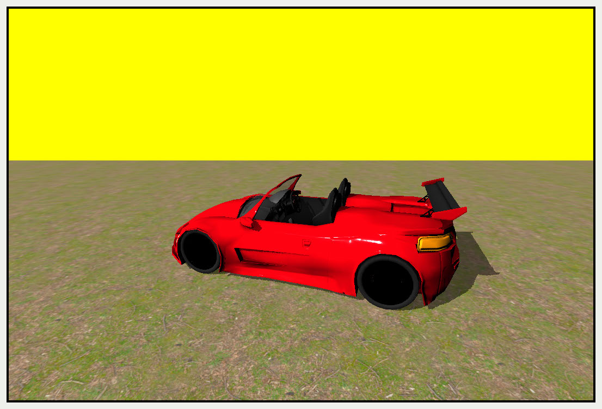

A yellow sky

Procedural Skies

Yellow skies might be appropriate on a different planet, but how about a procedural 
sky? A procedural sky is one built out of various parameters such as weather 
conditions and time of day. Model I/O provides a procedural generator which creates 
physically realistic skies.

➤ Before exploring this API further, open and run Skybox.playground in the 
resources folder for this chapter. (Sometimes it takes a while to compile and load.)

This scene contains only a ground plane and a skybox. Use your mouse or trackpad to 
reorient the scene. The backface of the plane will disappear if you rotate beneath it 
so that you can examine the sky.

526

Metal by Tutorials
Chapter 21: Image-Based Lighting

Experiment with the sliders under the view to see how you can change the sky 
depending on:

• turbidity: Haze in the sky. 0.0 is a clear sky. 1.0 spreads the sun’s color.

• sun elevation: How high the sun is in the sky. 0.5 is on the horizon. 1.0 is 
overhead.

• upper atmosphere scattering: Atmospheric scattering influences the color of the 
sky from reddish through orange tones to the sky at midday.

• ground albedo: How clear the sky is. 0 is clear, while 10 can produce intense 
colors. It’s best to keep turbidity and upper atmosphere scattering low if you have 
high albedo.

See if you can create a sunrise:

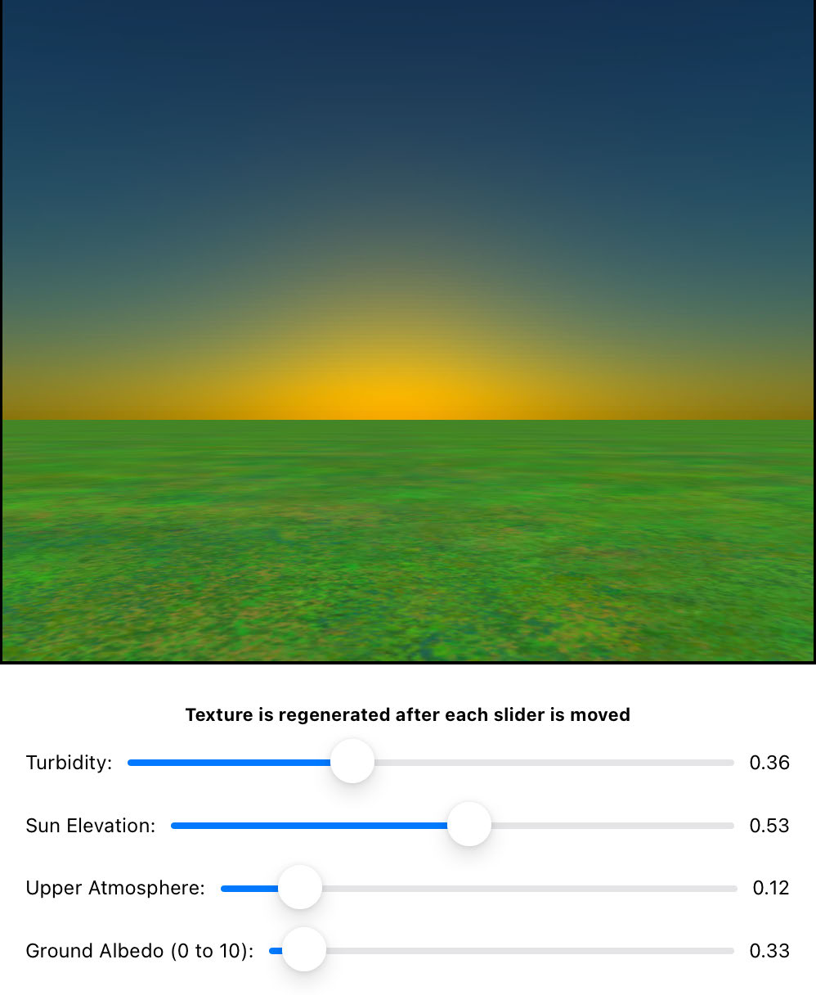

A sunrise

This playground uses Model I/O to create an MDLSkyCubeTexture. From this, the 
playground creates an MTLTexture and applies this as a cube texture to the sky cube. 
You’ll now do this in your project.

527

Metal by Tutorials
Chapter 21: Image-Based Lighting

Cube Textures

Cube textures are similar to the 2D textures that you’ve already been using. 2D 
textures map to a quad and have two texture coordinates, whereas cube textures 
consist of six 2D textures: one for each face of the cube. You sample the textures 
with a 3D vector.

The easiest way to load a cube texture into Metal is to use Model I/O’s MDLTexture 
initializer. When creating cube textures, you can arrange the images in various 
combinations:

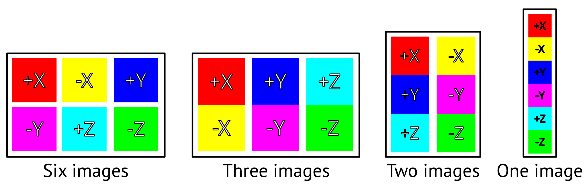

In the Textures group, cube-sky.png and irradiance.png are examples of one 
image that you’ll load later.

Alternatively, you can create a cube texture in an asset catalog and load the six 
images there.

➤ Back in your project, in the Textures group, open Textures.xcassets. sky is a sky 
texture complete with mipmaps.

The sky should always render on the base mipmap level 0, but you’ll see later why 
you would use the other mipmaps.

528

Metal by Tutorials
Chapter 21: Image-Based Lighting

Aside from there being six images to one texture, moving the images into the asset 
catalog and creating the mipmaps is the same process as described in Chapter 8, 
“Textures”.

The sky texture in the asset catalog

Adding the Procedural Sky

You’ll use these sky textures shortly, but for now, you’ll add a procedural sky to your 
scene.

➤ Open Skybox.swift, and add these properties to Skybox:

struct SkySettings { 
  var turbidity: Float = 0.15 
  var sunElevation: Float = 0.56 
  var upperAtmosphereScattering: Float = 0.66 
  var groundAlbedo: Float = 0.8 
} 
var skySettings = SkySettings()

You can use your own values from the appropriate sliders in the Skybox playground 
if you prefer.

➤ Now, add the following method:

func loadGeneratedSkyboxTexture(dimensions: SIMD2<Int32>) 
  -> MTLTexture? { 
  var texture: MTLTexture? 
  let skyTexture = MDLSkyCubeTexture( 
    name: "sky", 
    channelEncoding: .float16, 
    textureDimensions: dimensions,

529

Metal by Tutorials
Chapter 21: Image-Based Lighting

turbidity: skySettings.turbidity, 
    sunElevation: skySettings.sunElevation, 
    upperAtmosphereScattering: 
      skySettings.upperAtmosphereScattering, 
    groundAlbedo: skySettings.groundAlbedo) 
  do { 
    let textureLoader = 
      MTKTextureLoader(device: Renderer.device) 
    texture = try textureLoader.newTexture( 
      texture: skyTexture, 
      options: nil) 
  } catch { 
    print(error.localizedDescription) 
  } 
  return texture 
}

Model I/O uses your settings to create the sky texture. That’s all there is to creating a 
procedurally generated sky texture!

➤ Call the new method at the end of init(textureName:):

if let textureName { 
  // load named texture here 
} else { 
  skyTexture = loadGeneratedSkyboxTexture(dimensions: [256, 
256]) 
}

You’ll add the if part of this conditional shortly and load the named texture. The 
nil option provides a default sky.

To render the texture, you’ll change the skybox shader function and ensure that the 
texture gets to the GPU.

➤ Still in Skybox.swift, in render(encoder:uniforms:), add the following code 
before the draw call:

encoder.setFragmentTexture( 
  skyTexture, 
  index: SkyboxTexture.index)

The starter project already has the necessary texture enumeration indices set up in 
Common.h for the skybox textures.

➤ Open Skybox.metal, and add a new property to VertexOut:

530

Metal by Tutorials
Chapter 21: Image-Based Lighting

Generally, when you load a model, you also load its texture coordinates. However, 
when sampling texels from a cube texture, instead of using a uv coordinate, you use a 
3D vector. For example, a vector from the center of any unit cube passes through the 
far top left corner at [-1, 1, 1].

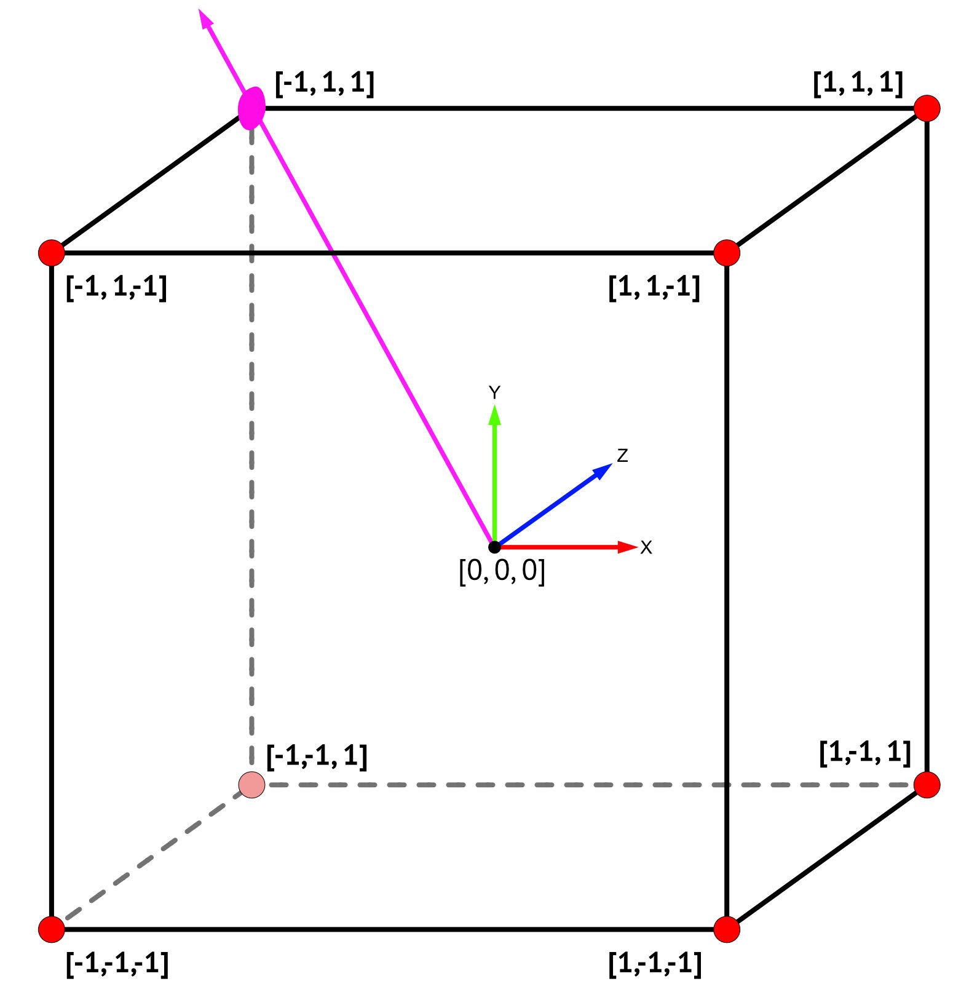

Skybox coordinates

Conveniently, even though the skybox’s far top-left vertex position is [-0.5, 0.5, 
0.5], it still lies on the same vector, so you can use the skybox vertex position for the 
texture coordinates.

➤ Add this code to vertex_skybox before return out;:

➤ Change fragment_skybox to:

fragment half4 fragment_skybox( 
  VertexOut in [[stage_in]], 
  texturecube<half> cubeTexture [[texture(SkyboxTexture)]]) 
{ 
  constexpr sampler default_sampler(filter::linear); 
  half4 color = cubeTexture.sample( 
    default_sampler, 
    in.textureCoordinates); 
  return color; 
}

531

Metal by Tutorials
Chapter 21: Image-Based Lighting

Accessing a cube texture is similar to accessing a 2D texture. You mark the cube 
texture as texturecube in the shader function parameters and sample it using the 
textureCoordinates vector that you set up in the vertex function.

➤ Build and run the app, and you now have a realistic sky, simulating physics:

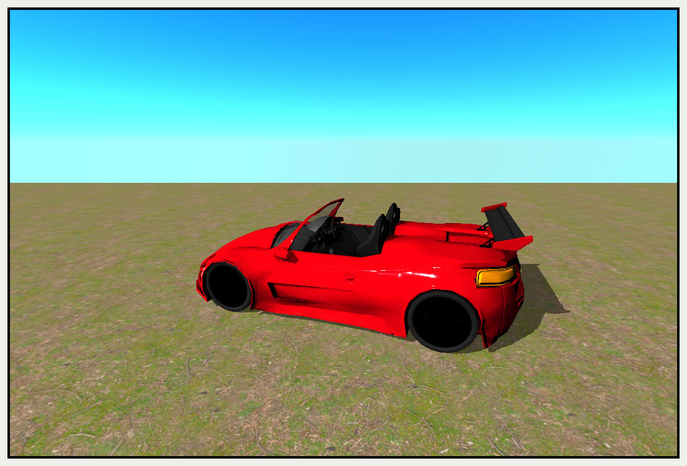

A procedural sky

Custom Sky Textures

As mentioned earlier, you can use your own 360º sky textures. The textures included 
in the starter project were downloaded from Poly Haven (https://polyhaven.com/
hdris) — a great place to find environment maps. Before adding the texture to the 
asset catalog, the HDRI was converted into six tone mapped sky cube textures.

Note: If you want to create your own skybox textures or load HDRIs (high 
dynamic range images), you can find out how to do it in 
references.markdown included with this chapter’s resources.

Loading a cube texture is almost the same as loading a 2D texture.

532

Metal by Tutorials
Chapter 21: Image-Based Lighting

➤ Open TextureController.swift, and examine loadCubeTexture(imageName:). 
You can load either a cube texture from the asset catalog or one 2D image consisting 
of the six faces vertically.

➤ Open Skybox.swift, and at the end of init(textureName:), in the first half of 
the incomplete conditional, replace // load named texture here with this:

skyTexture = TextureController.loadCubeTexture( 
  imageName: textureName)

You load the texture using the given texture name.

➤ Open GameScene.swift, and in init(), change the skybox initialization to:

➤ Build and run the app to see your new skybox texture.

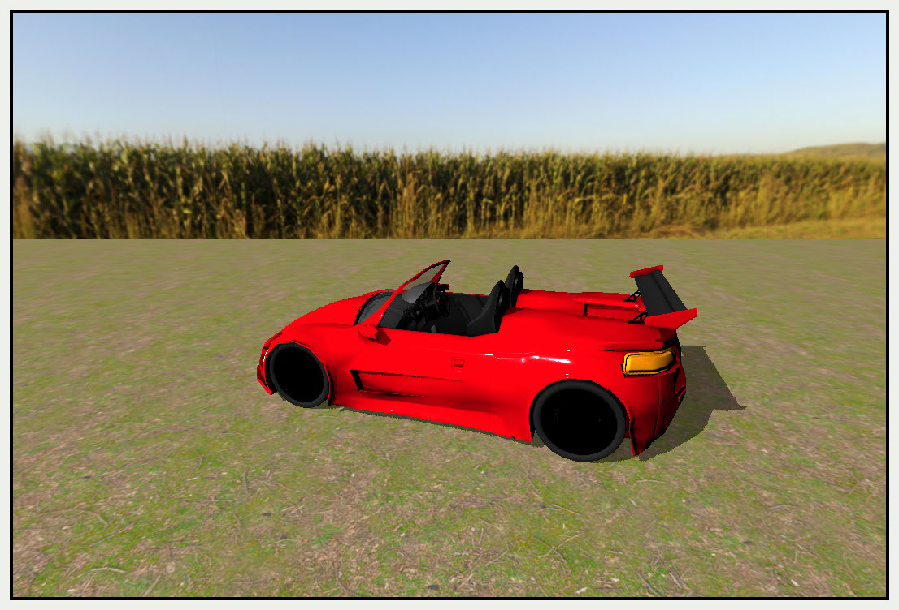

The skybox

Notice that as you zoom and rotate the scene, although the skybox rotates with the 
rest of the scene, it does not reposition.

You should be careful that the sky textures you use don’t have objects that appear to 
be close, as they will always appear to stay at the same distance from the camera. Sky 
textures should be for background only. This skybox texture is not a great fit as the 
background does not match the ground plane.

533

Metal by Tutorials
Chapter 21: Image-Based Lighting

Reflection

Now that you have something to reflect, you can easily implement reflection of the 
sky onto the car. When rendering the car, all you have to do is take the camera view 
direction, reflect it about the surface normal, and sample the skycube along the 
reflected vector for the fragment color for the car.

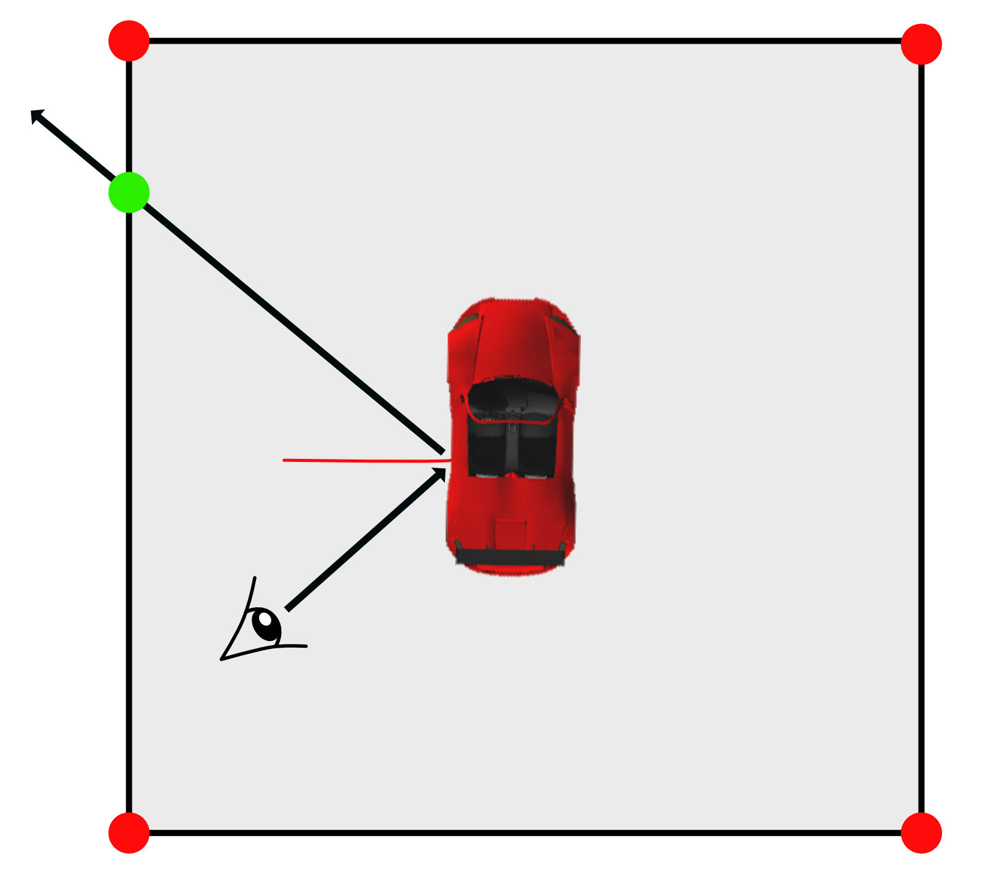

Reflection

Included in the starter project is a new fragment shader that you’ll work on to 
implement alternative PBR lighting using the skybox as the lighting source instead 
of SceneLighting.

➤ In the Shaders group, open IBL.metal. fragment_IBL loads up all the textures 
that you’re already familiar with in fragment_main. Instead of calculating the 
diffuse and specular, the function returns the base color.

➤ Open Pipelines.swift, and change the fragment function name in 
createForwardPSO() to:

let fragmentFunction = 
  Renderer.library?.makeFunction(name: "fragment_IBL")

534

Metal by Tutorials
Chapter 21: Image-Based Lighting

➤ Build and run the app.

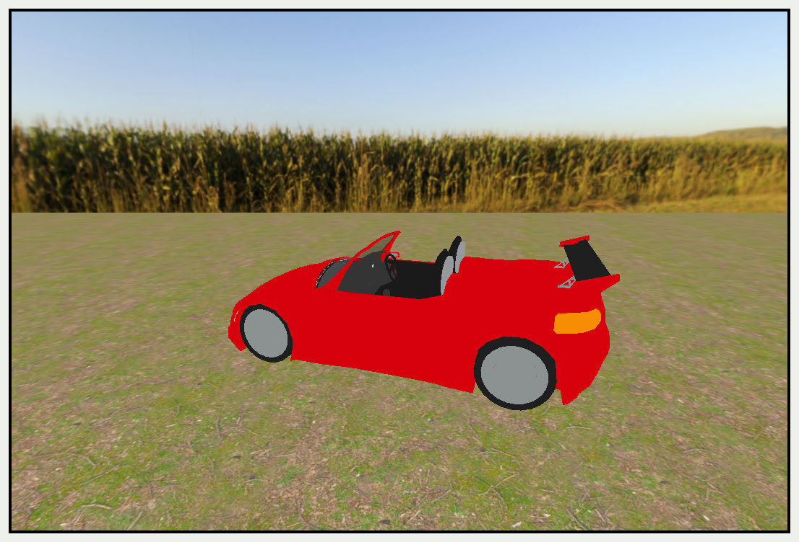

Color textures only

The fragment shader renders the car and ground returning the texture base color. 
The glass windshield has transparency, so uses a different pipeline. It will render 
transparently with specular highlights, as it did before.

➤ Open Skybox.swift, and add this to Skybox:

func update(encoder: MTLRenderCommandEncoder) { 
  encoder.setFragmentTexture( 
    skyTexture, 
    index: SkyboxTexture.index) 
}

You send the skybox texture to the fragment shader. You’ll add other skybox textures 
to this method soon.

➤ Open ForwardRenderPass.swift, and in 
draw(commandBuffer:scene:uniforms:params:), add the following code before 
var params = params:

The sky texture is now available to the GPU.

535

Metal by Tutorials
Chapter 21: Image-Based Lighting

➤ Open IBL.metal, and add the skybox texture to the parameter list for 
fragment_IBL:

You read the skybox texture using the type texturecube. Instead of providing 2D uv 
coordinates, you’ll provide 3D coordinates.

You now calculate the camera’s reflection vector about the surface normal to get a 
vector for sampling the skybox texture. To get the camera’s view vector, you subtract 
the fragment world position from the camera position.

➤ At the end of fragment_IBL, before return color;, add this:

float3 viewDirection = 
  in.worldPosition.xyz - params.cameraPosition; 
viewDirection = normalize(viewDirection); 
float3 textureCoordinates = 
  reflect(viewDirection, normal);

Here, you calculate the view vector and reflect it about the surface normal to get the 
vector for the cube texture coordinates.

➤ Now, add this:

constexpr sampler defaultSampler(filter::linear); 
color = skybox.sample( 
  defaultSampler, textureCoordinates); 
float4 copper = float4(0.86, 0.7, 0.48, 1); 
color = color * copper;

Here, you sample the skybox texture for a color and multiply it by a copper color.

➤ Build and run the app.

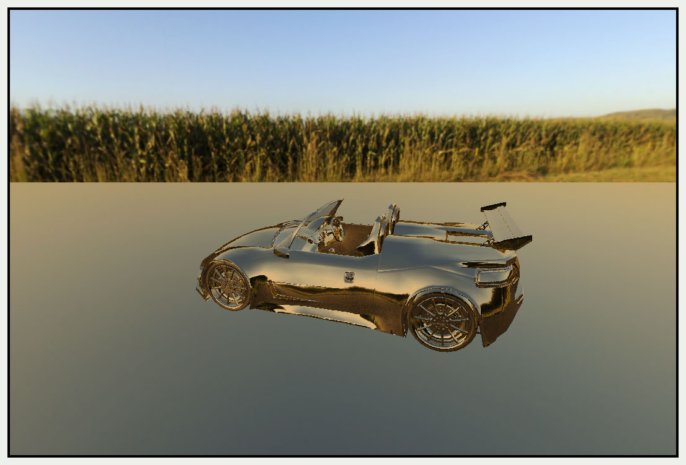

Reflections

536

Metal by Tutorials
Chapter 21: Image-Based Lighting

The rendered scene now appears to be made of beautifully shiny copper. As you 
rotate the scene, using your mouse or trackpad, you can see the sky reflected in the 
scene models.

Note: This is not a true reflection since you’re only reflecting the sky texture. 
If you place any objects in the scene, they won’t be reflected. However, this 
reflection is a fast and easy effect, and is often sufficient.

➤ In fragment_IBL, remove the code you just added, i.e., the lines from constexpr 
sampler defaultSampler... to color = color * copper;.

You’ll replace this with new lighting code. You’ll get a compiler warning on 
textureCoordinates until you use it later.

Image-Based Lighting

At the beginning of the chapter, there were two problems with the original car 
render. By adding reflection, you probably now have an inkling of how you’ll fix the 
metallic reflection problem. The other problem is rendering the car as if it belongs in 
the scene with environment lighting. IBL or Image-Based Lighting is one way of 
dealing with this problem.

Using the sky image you can extract lighting information. For example, the parts of 
the car that face the sun in the sky texture should shine more than the parts that 
face away. The parts that face away shouldn’t be entirely dark but should have 
ambient light filled in from the sky texture.

Epic Games developed a technique for Fortnite, which they adapted from Disney’s 
research, and this has become the standard technique for IBL in games today. If you 
want to be as physically correct as possible, there’s a link to their article on how to 
achieve this included with the references.markdown for this chapter.

You’ll be doing an approximation of their technique, making use of Model I/O for the 
diffuse.

537

Metal by Tutorials
Chapter 21: Image-Based Lighting

Diffuse Reflection

Light comes from all around us. Sunlight bounces around and colors reflect. When 
rendering an object, you should take into account the color of the light coming from 
every direction.

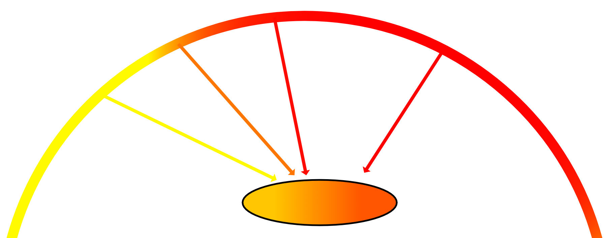

Diffuse reflection

This is somewhat of an impossible task, but you can use convolution to compute a 
cube map called an irradiance map from which you can extract lighting 
information. You won’t need to know the mathematics behind this: Model I/O comes 
to the rescue again!

The diffuse reflection for the car will come from a second texture derived from the 
sky texture.

➤ Open Skybox.swift, and add a new property to Skybox to hold this diffuse 
texture:

➤ To create the diffuse irradiance texture, add this temporary method:

mutating func loadIrradianceMap() { 
  // 1 
  guard let skyCube = 
    MDLTexture(cubeWithImagesNamed: ["cube-sky.png"]) 
  else { return } 
  // 2 
  let irradiance = 
    MDLTexture.irradianceTextureCube( 
      with: skyCube, 
      name: nil, 
      dimensions: [64, 64], 
      roughness: 0.6) 
  // 3 
  let loader = MTKTextureLoader(device: Renderer.device) 
  do { 
    diffuseTexture = try loader.newTexture( 
    texture: irradiance,

538

Metal by Tutorials
Chapter 21: Image-Based Lighting

options: nil) 
  } catch { 
    fatalError(error.localizedDescription) 
  } 
}

Going through this code:

1. Model I/O currently doesn’t load cube textures from the asset catalog, so, in the 
Textures group, your project has an image named cube-sky.png with the six 
faces included in it. Each of the faces is 128 x 128 pixels.

2. Use Model I/O to create the irradiance texture from the source image. Neither 
source nor destination textures have to be large, as the diffuse color is spread 
out.

3. Load the resultant MDLTexture to diffuseTexture.

➤ In Skybox.swift, add the following to the end of init(textureName:):

➤ In update(encoder:), add the following:

encoder.setFragmentTexture( 
  diffuseTexture, 
  index: SkyboxDiffuseTexture.index)

This code will send the diffuse texture to the GPU.

➤ Open IBL.metal, and add the diffuse texture to the parameter list for 
fragment_IBL:

texturecube<float> skyboxDiffuse 
[[texture(SkyboxDiffuseTexture)]]

➤ At the end of fragment_IBL, add this before return color;:

float4 diffuse = skyboxDiffuse.sample(textureSampler, normal); 
color = diffuse * float4(material.baseColor, 1);

The diffuse value doesn’t depend on the angle of view, so you sample the diffuse 
texture using the surface normal. You then multiply the result by the base color.

539

Metal by Tutorials
Chapter 21: Image-Based Lighting

➤ Build and run the app. Because of the irradiance convolution, the app may take a 
minute or so to start. As you rotate about the car, you’ll notice it’s very slightly 
brighter where it faces the skybox sun.

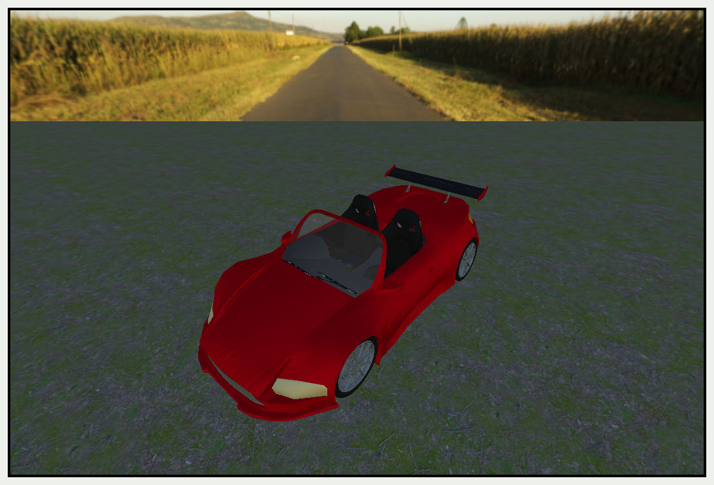

Diffuse from irradiance

➤ Click the Capture GPU frame icon to enter the GPU Debugger, and look at the 
generated irradiance map.

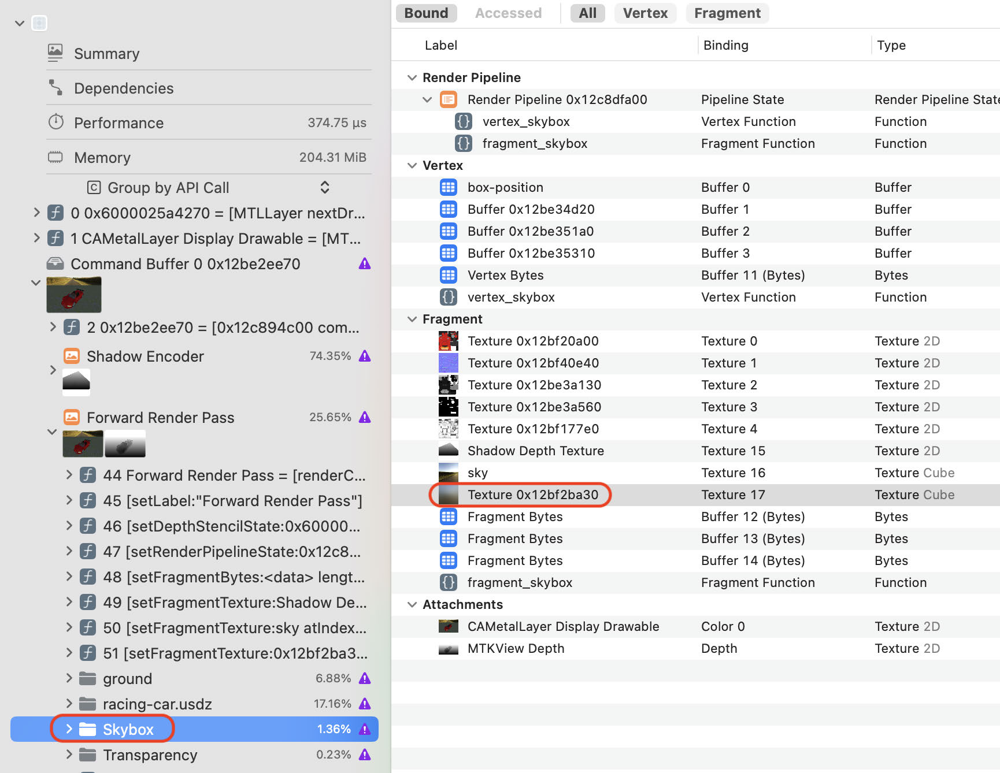

540

Metal by Tutorials
Chapter 21: Image-Based Lighting

➤ Double-click the texture to see the generated texture.

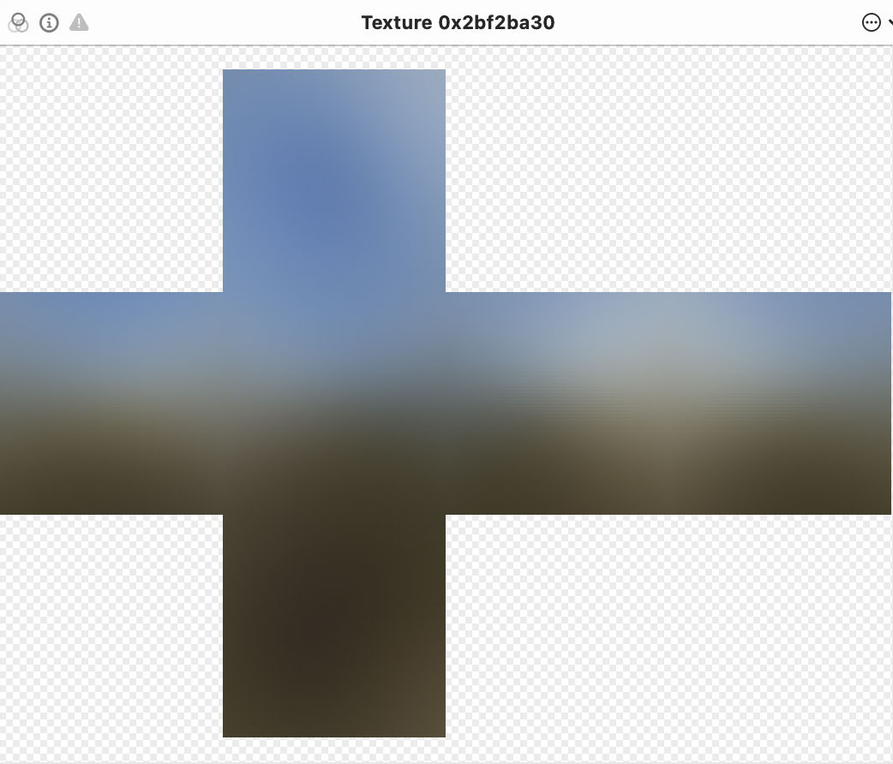

Instead of generating the irradiance texture each time, you can save the irradiance 
map to a file and load it from there. Included in the resources folder for this chapter 
is a project named IrradianceGenerator. You can use this app to generate your 
irradiance maps.

In your project, in the Textures group, there’s a touched-up irradiance map named 
irradiance.png that matches and brightens the sky texture. It’s time to switch to 
using this irradiance map for the diffuse texture instead of generating it.

➤ Open Skybox.swift, and in init(textureName:), locate where you load 
skyTexture from a given name in the if closure, and add the following code 
immediately after loading skyTexture:

diffuseTexture = 
  TextureController.loadCubeTexture( 
    imageName: "irradiance.png")

➤ Remove the method loadIrradianceMap(), and also remove the call to 
loadIrradianceMap() at the end of init(textureName).

541

Metal by Tutorials
Chapter 21: Image-Based Lighting

➤ Build and run the app to see results using the brighter prebuilt irradiance map.

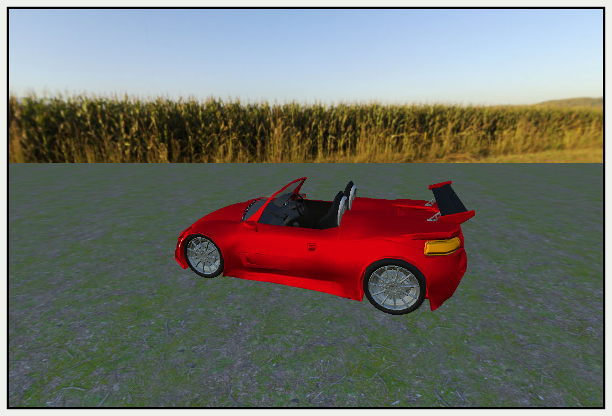

Brighter irradiance

Specular Reflection

The irradiance map provides the diffuse and ambient reflection, but the specular 
reflection is a bit more difficult.

You may remember from Chapter 10, “Lighting Fundamentals”, that, whereas the 
diffuse reflection comes from all light directions, specular reflection depends upon 
the angle of view and the roughness of the material.

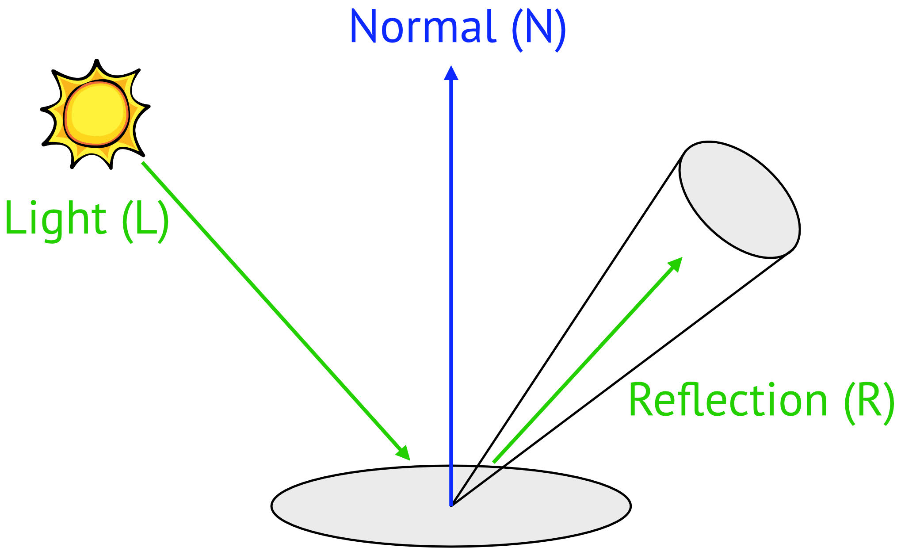

Specular reflection

In Chapter 11, “Maps & Materials”, you had a foretaste of physically based rendering 
using the Cook-Torrance microfacet specular shading model. This model is defined 
as:

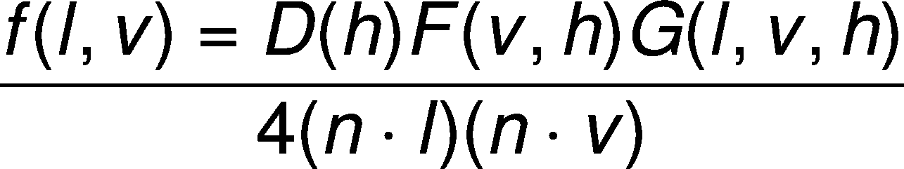

542

Metal by Tutorials
Chapter 21: Image-Based Lighting

Where you provide the light direction (l), view direction (v) and the half vector (h) 
between l and v. As described, the functions are:

• D: Geometric micro-facet slope distribution

• F: Fresnel

• G: Geometric attenuation

Just as with the diffuse light, to get the accuracy of the incoming specular light, you 
need to take many samples, which is impractical in real-time rendering. Epic 
Games’s approach in their paper, Real Shading in Unreal Engine 4 (http://
blog.selfshadow.com/publications/s2013-shading-course/karis/
s2013_pbs_epic_notes_v2.pdf), is to split up the shading model calculation. They pre-
filter the sky cube texture with the geometry distribution for various roughness 
values. For each roughness level, the texture gets smaller and blurrier, and you can 
store these pre-filtered environment maps as different mipmap levels in the sky cube 
texture.

Note: In the resources for this chapter, there’s a project named Specular, 
which uses the code from Epic Games’s paper. This project takes in six images 
— one for each cube face — and will generate pre-filtered environment maps 
for as many levels as you specify in the code. The results are placed in a 
subdirectory of Documents named specular, which you should create before 
running the project. You can then add the created .png files to the mipmap 
levels of the sky cube texture in your asset catalog.

➤ In Textures.xcassets, look at the sky texture.

sky already contains the pre-filtered environment maps for each mip level.

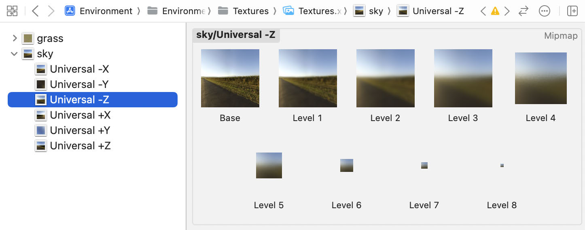

Pre-filtered environment maps

543

Metal by Tutorials
Chapter 21: Image-Based Lighting

BRDF Look-Up Table

To calculate the final color, you use a Bidirectional Reflectance Distribution 
Function (BRDF) that takes in the actual roughness of the model and the current 
viewing angle and returns the scale and bias for the Fresnel and geometric 
attenuation contributions.

You can encapsulate this BRDF in a look-up table (LUT) as a texture that behaves as a 
two-dimensional array. One axis is the roughness value of the object, and the other 
is the angle between the normal and the view direction. You input these two values 
as the UV coordinates and receive back a color. The red value contains the scale, and 
the green value contains the bias.

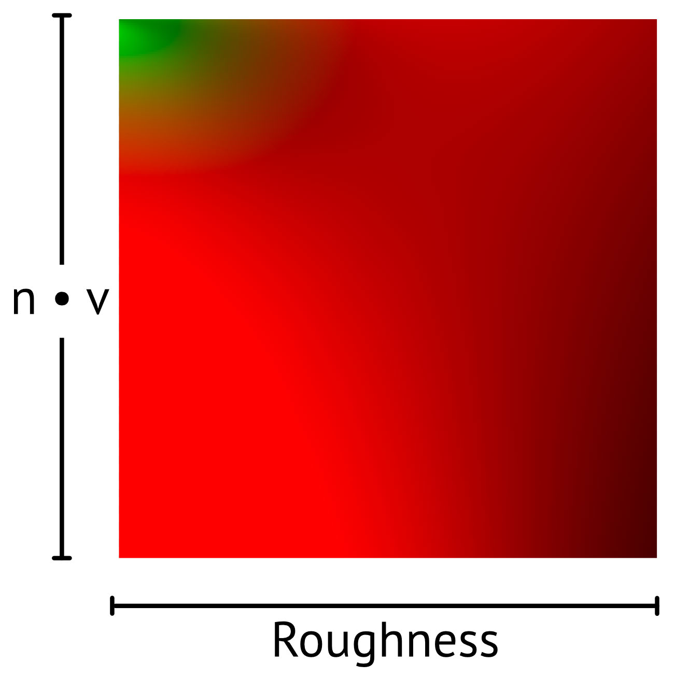

A BRDF LUT

The more photorealistic you want your scene to be, the higher the level of 
mathematics you’ll need to know. In the resources folder for this chapter, in 
references.markdown, you’ll find links with suggested reading that explain the 
Cook-Torrance microfacet specular shading model.

In the Utility/BRDF group, your project contains functions provided by Epic Games 
to create the BRDF look-up texture. You’ll now implement the compute shader that 
builds the BRDF look-up texture.

➤ Open Skybox.swift, and add a property for the new texture:

➤ At the end of init(textureName:), call the method supplied in the starter project 
to build the texture:

544

Metal by Tutorials
Chapter 21: Image-Based Lighting

Renderer.buildBRDF() uses a complex compute shader in BRDF.metal to create a 
new texture.

➤ Still in Skybox.swift, in update(encoder:), add the following code to send the 
texture to the GPU:

encoder.setFragmentTexture( 
  brdfLut, 
  index: BRDFLutTexture.index)

➤ Build and run the app, and click the Capture GPU frame icon to verify the look-
up texture created by the BRDF compute shader is available to the GPU.

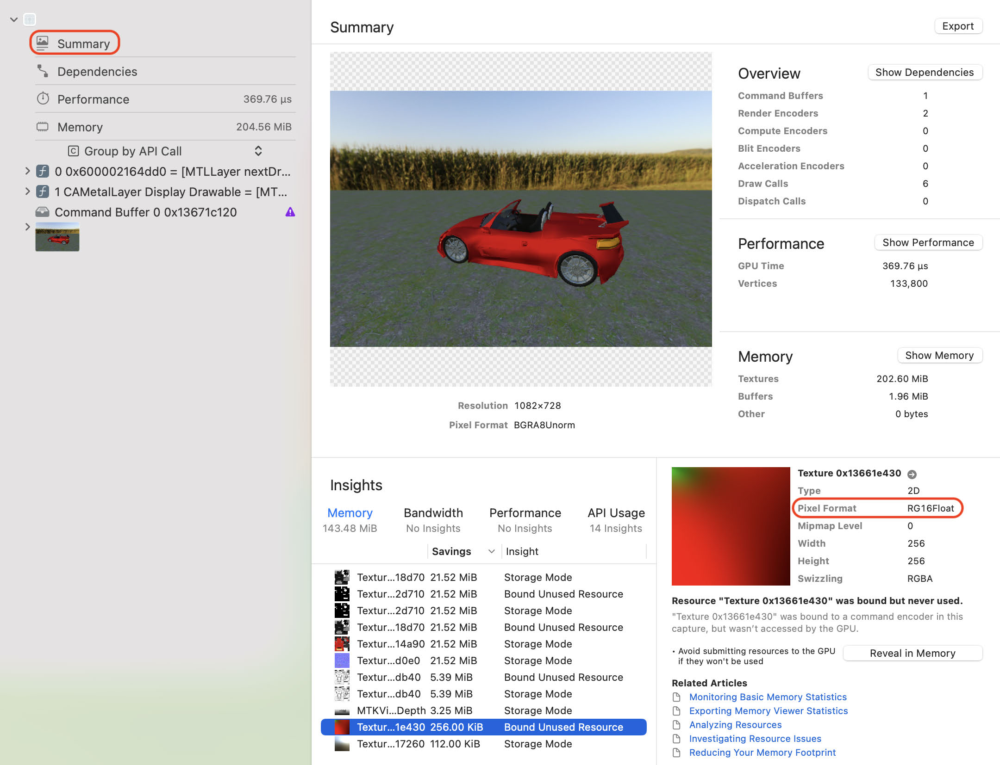

BRDF LUT is on the GPU

Notice the texture format is RG16Float. As a float format, this pixel format has a 
greater accuracy than RGBA8Unorm.

All the necessary information is now on the GPU, so you need to receive the new 
BRDF look-up texture into the fragment shader and do the shader math.

545

Metal by Tutorials
Chapter 21: Image-Based Lighting

➤ Open IBL.metal, and add the new parameter to fragment_IBL:

➤ At the end of fragment_IBL, replace return color; with this:

// 1 
constexpr sampler s(filter::linear, mip_filter::linear); 
float3 prefilteredColor 
  = skybox.sample(s, 
                  textureCoordinates, 
                  level(material.roughness * 10)).rgb; 
// 2 
float nDotV = saturate(dot(normal, -viewDirection)); 
float2 envBRDF 
  = brdfLut.sample(s, float2(material.roughness, nDotV)).rg; 
return float4(envBRDF, 0, 1);

Going through the code:

1. Read the skybox texture along the reflected vector as you did earlier. Using the 
extra parameter level(n), you can specify the mip level to read. You sample the 
appropriate mipmap for the roughness of the fragment.

2. Calculate the angle between the view direction and the surface normal, and use 
this as one of the UV coordinates to read the BRDF look-up texture. The other 
coordinate is the roughness of the surface. You receive back the red and green 
values which you’ll use to calculate the second part of the Cook Torrence 
equation.

➤ Build and run the app to see the result of the BRDF look-up.

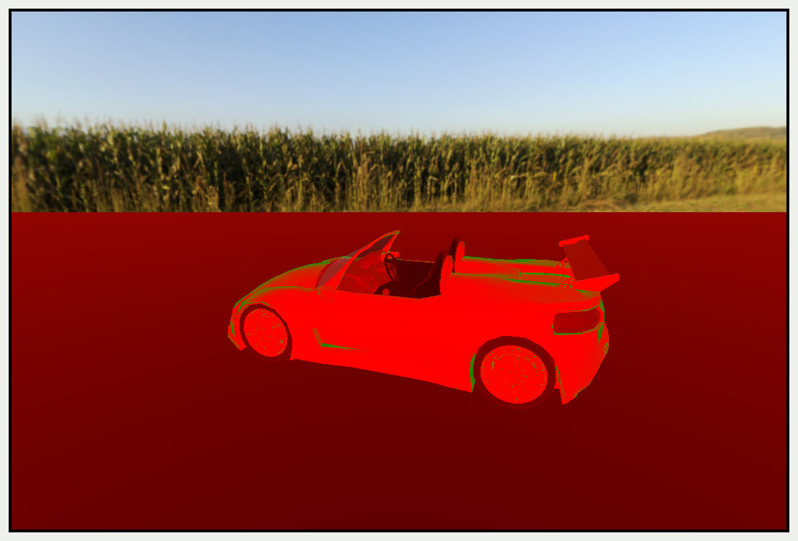

The BRDF look up result

At glancing angles on the car, the result is green.

546

Metal by Tutorials
Chapter 21: Image-Based Lighting

Fresnel Reflectance

When light hits an object straight on, some of the light is reflected. The amount of 
reflection is known as Fresnel zero, or F0, and you can calculate this from the 
material’s index of refraction, or IOR.

When you view an object, at the viewing angle of 90º, the surface becomes nearly 
100% reflective. For example, when you look across the water, it’s reflective; but 
when you look straight down into the water, it’s non-reflective.

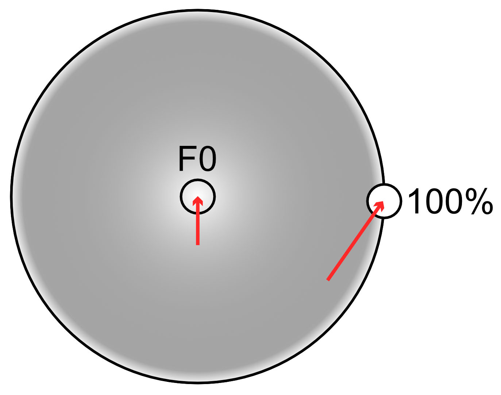

Most dielectric (non-metal) materials have an F0 of about 4%, so most rendering 
engines use this amount as standard. For metals, F0 is the base color.

➤ Replace return float4(envBRDF, 0, 1); with:

float3 f0 = mix(0.04, material.baseColor.rgb, 
material.metallic); 
float3 specularIBL = f0 * envBRDF.r + envBRDF.g;

Here, you choose F0 as 0.04 for non-metals and the base color for metals. metallic 
should be a binary value of 0 or 1, but it’s best practice to avoid conditional 
branching in shaders, so you use mix(). You then calculate the second part of the 
rendering equation using the values from the look-up table.

➤ Add the following code after the code you just added:

float3 specular = prefilteredColor * specularIBL; 
color += float4(specular, 1); 
return color;

547

Metal by Tutorials
Chapter 21: Image-Based Lighting

color now includes the diffuse from the irradiance skybox texture, the material base 
color and the specular value.

➤ Build and run the app.

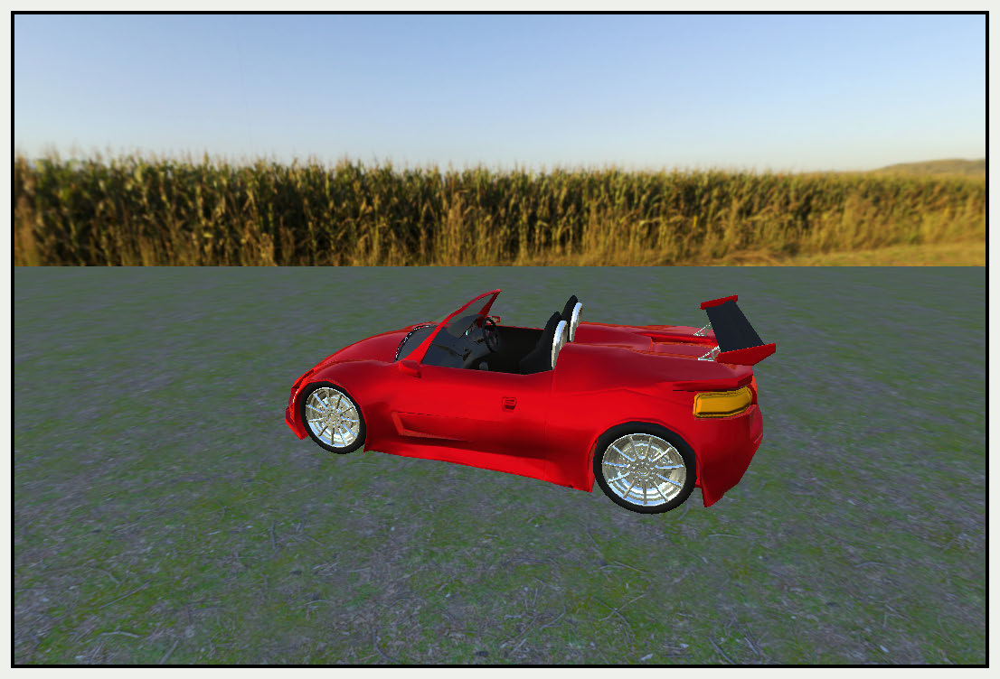

Diffuse and specular

Your car render is almost complete. Non-metals take the roughness value — the seats 
are matte, and the car paint is shiny. Metals reflect but take on the base color — the 
base color of the wheel hubs and the steel bar behind the seats is gray.

Tweaking

Being able to tweak shaders gives you complete power over how your renders look. 
Because you’re using low dynamic range lighting, the non-metal diffuse color looks a 
bit dark. You can tweak the color very easily.

➤ In fragment_IBL, after float4 diffuse = 
skyboxDiffuse.sample(textureSampler, normal);, add this:

diffuse = mix(pow(diffuse, 0.2), diffuse, material.metallic); 
diffuse *= calculateShadow(in.shadowPosition, shadowTexture);

This code raises the power of the diffuse value but only for non-metals. You also 
reinstate the shadow.

548

Metal by Tutorials
Chapter 21: Image-Based Lighting

➤ Build and run, and notice the scene is a lot brighter.

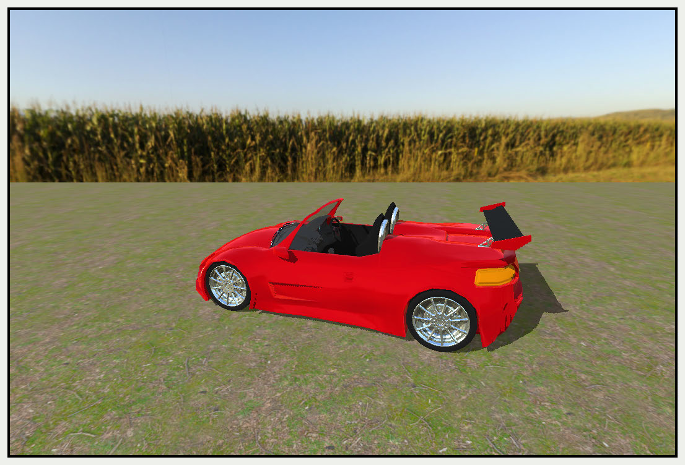

Tweaking the shader

The finishing touch will be to add a fake shadow effect using ambient occlusion. At 
the rear of the car, the exhaust pipes look as if they are self-lit:

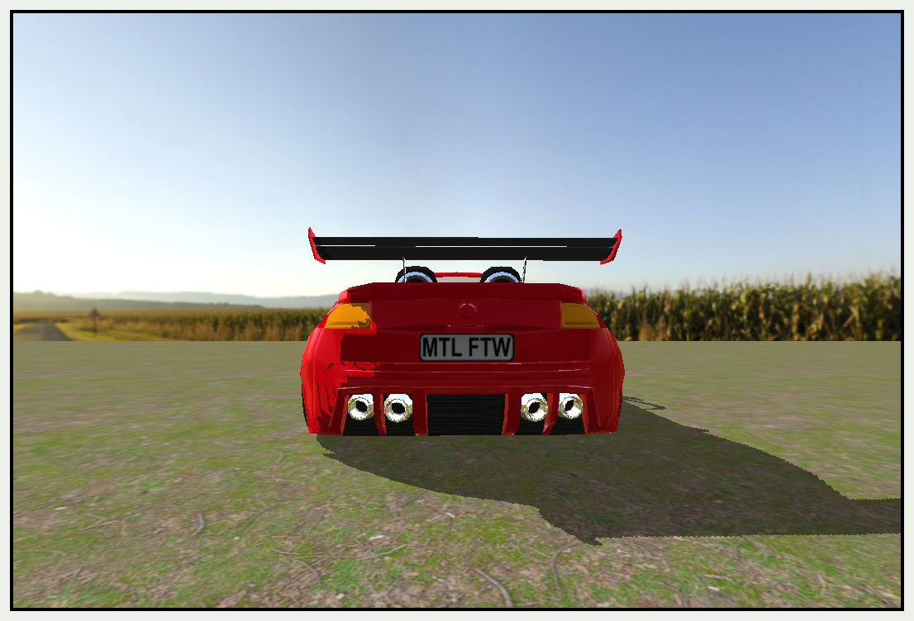

They should be shadowed because they are recessed. This is where ambient 
occlusion maps come in handy.

Ambient Occlusion Maps

Ambient occlusion is a technique that approximates how much light should fall on 
a surface. If you look around you — even in a bright room — where surfaces are very 
close to each other, they’re darker than exposed surfaces. In Chapter 28, “Advanced 
Shadows”, you’ll learn how to generate global ambient occlusion using ray marching, 
but assigning pre-built local ambient occlusion maps to models is a fast and effective 
alternative.

549

Metal by Tutorials
Chapter 21: Image-Based Lighting

Apps such as Adobe Substance Painter can examine the model for proximate 
surfaces and produce an ambient occlusion map. This is the AO map for the car, 
which is included in your project.

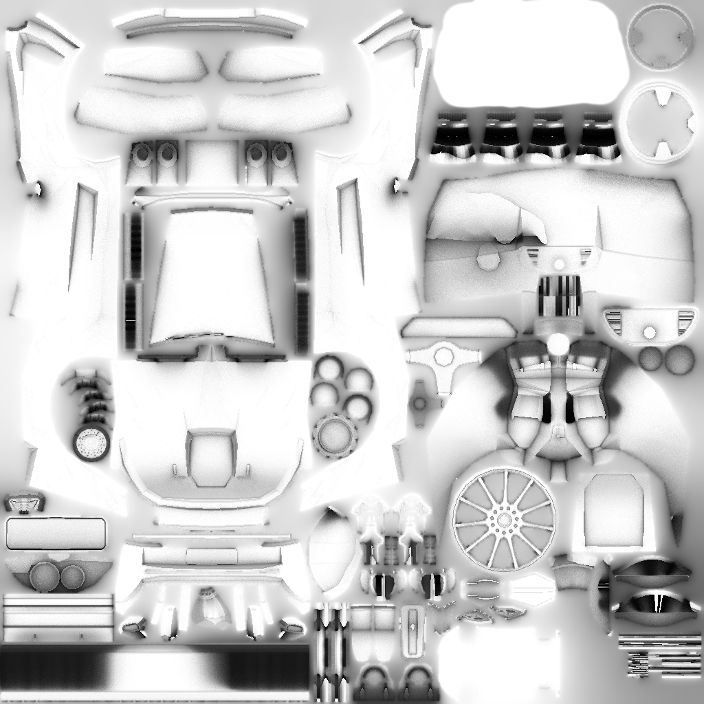

The white areas on the left, with a color value of 1.0, are UV mapped to the car paint. 
These are fully exposed areas. When you multiply the final render color by 1.0, it’ll 
be unaffected. However, you can identify the wheel at the bottom right of the AO 
map, where the spokes are recessed. Those areas have a color value of perhaps 0.8, 
which darkens the final render color.

The ambient occlusion map is all set up in the starter project and ready for you to 
use.

➤ Open IBL.metal, and in fragment_IBL, just before the final return, add this:

➤ Build and run the app, and compare the exhaust pipes to the previous render.

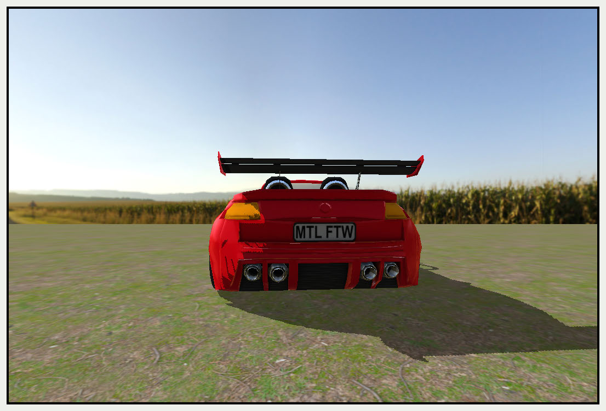

All of the recessed areas are darker, which gives more natural lighting to the model.

550

Metal by Tutorials
Chapter 21: Image-Based Lighting

Challenge

On the first page of this chapter is a comparison of the car rendered in two different 
lighting situations. Your challenge is to create the red lighting scene.

Provided in the resources folder for this chapter, are six cube face png images 
converted from an HDRI downloaded from Poly Haven (https://polyhaven.com).

1. Create an irradiance map using the included IrradianceGenerator project, and 
import the generated map into the project.

2. Create specular mipmap levels using the included Specular project.

3. Create a new cube texture in the asset catalog. In the Attributes inspector, 
change the Mipmap Levels of each of the six faces to Fixed with nine levels.

4. Assign this new cube texture the appropriate generated mipmap images. The 
base level should be the original png files from the resources folder. In the 
Attributes inspector, ensure that the textures have an origin of Bottom Left 
and the interpretation is Data.

5. Change the sun light’s position to [-1, 0.5, 2] to match the skybox.

Aside from the light position in SceneLighting, and the name of the sky texture in 
GameScene, there’s no code to change — it’s all imagery! You’ll find the completed 
project in the challenge directory for this chapter.

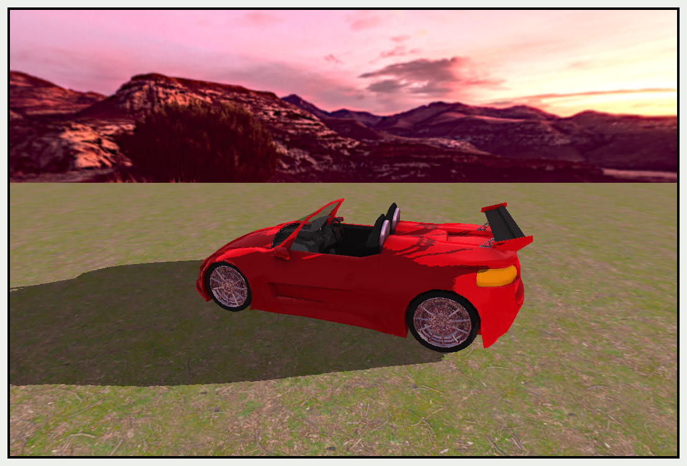

551

Metal by Tutorials
Chapter 21: Image-Based Lighting

Key Points

• Using a cuboid skybox, you can surround your scene with a texture.

• Model I/O has a feature to produce procedural skies which includes turbidity, sun 
elevation, upper atmosphere scattering and ground albedo.

• Cube textures have six faces. Each of the faces can have mipmaps.

• Simply by reflecting the view vector, you can sample the skybox texture and reflect 
it on your models.

• Image-based lighting uses the sky texture for lighting. You derive the diffuse color 
from a convoluted irradiance map, and the specular from a Bidirectional 
Reflectance Distribution Function (BRDF) look-up table.

Where to Go From Here?

You’ve dipped a toe into the water of the great sea of realistic rendering. If you want 
to explore more about this fascinating topic, references.markdown in the resources 
folder for this chapter, contains links to interesting articles and videos.

This chapter did not touch on spherical harmonics, which is an alternative method to 
using an irradiance texture map for diffuse reflection. Mathematically, you can 
approximate that irradiance map with 27 floats. Hopefully, the links in 
references.markdown will get you interested in this amazing technique.

Before you try to achieve the ultimate realistic render, one question you should ask 
yourself is whether your game will actually benefit from realism. One way to stand 
out from the crowd is to create your own rendering style. Games such as Fortnite 
aren’t entirely realistic and have a style all of their own. Experiment with shaders to 
see what you can create.

552

22