# Reflection & 
Refraction

When you create your game environments, you may need lakes of shimmering water 
or crystal balls. To look realistic, shiny glass objects require both reflection and 
refraction.

Reflection is one of the most common interactions between light and objects. 
Imagine looking into a mirror. Not only would you see your image being reflected, 
but you’d also see the reflection of any nearby objects.

Refraction is another common interaction between light and objects that you often 
see in nature. While it’s true that most objects in nature are opaque — thus 
absorbing most of the light they get — the few objects that are translucent, or 
transparent, allow for the light to propagate through them.

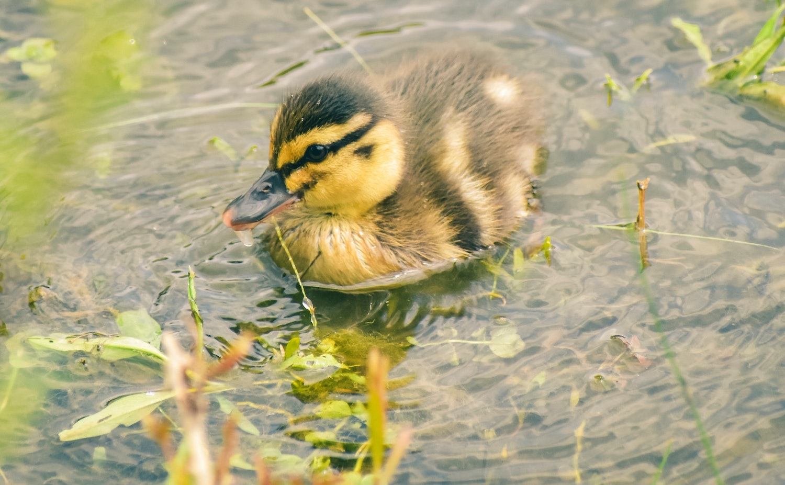

Reflection and refraction

553

Metal by Tutorials
Chapter 22: Reflection & Refraction

Later, in the final section of this book, you’ll investigate ray tracing and global 
illumination, which allow advanced effects such as bounced reflections and realistic 
refraction. We’re approaching a time where ray tracing algorithms may be viable in 
games, but for now, real-time rendering with rasterized reflection and refraction is 
the way to go.

An exemplary algorithm for creating realistic water was developed by Michael 
Horsch in 2005 (https://bit.ly/3H2P1ix). This realistic water algorithm is purely based 
on lighting and its optical properties, as opposed to having a water simulation based 
on physics.

The Starter Project

➤ In Xcode, open the starter project for this chapter.

The starter project is similar to the project at the end of the previous chapter, with a 
few additions which include:

• GameScene.swift contains a new scene with new models and renders a new 
skybox texture. You can move around the scene using WASD keys, and look about 
using the mouse or trackpad. Scrolling the mouse wheel, or pinching on iOS, 
moves you up and down, so you can get better views of your lake. The number 1 
key will position the camera looking down on the scene, and number 2 will return 
the camera to its original position.

• WaterRenderPass.swift, in the Render Passes group, contains a new render pass. 
It’s similar to  ForwardRenderPass, but refactors the command encoder setup into 
a new render method. WaterRenderPass is all set up and ready to render in 
Renderer, but it will do nothing until you assign it a render pass descriptor.

• Water.swift, in the Geometry group, contains a new Water class, similar to Model. 
The class loads a primitive mesh plane and is set up to render the plane with its 
own pipeline state.

• Pipelines.swift has new pipeline state creation methods to render water and a 
terrain.

554

Metal by Tutorials
Chapter 22: Reflection & Refraction

➤ Build and run the app.

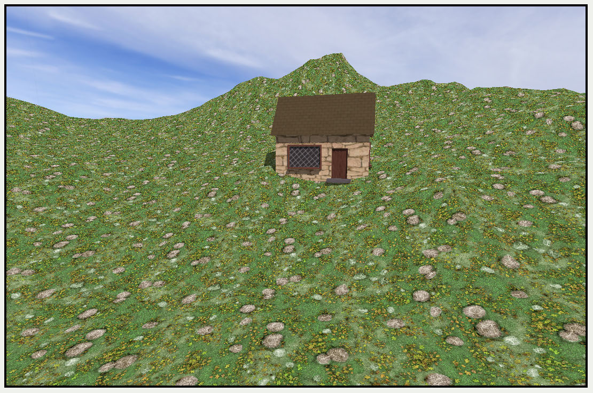

The starter app

Visitors to this quaint cottage would love a recreational lake for swimming and 
fishing.

Terrains

Many game scenes will have a ground terrain, or landscape, and this terrain may 
need its own shader. The starter project includes Terrain.swift, which contains 
Terrain, a subclass of Model. Changing shaders entails loading a new pipeline state, 
so Terrain creates its own pipeline state object along with a texture for use later.

Terrain.metal holds the fragment function to render the terrain. After you’ve added 
some water, you’ll change the terrain texture to blend with an underwater texture.

Instead of including the ground when rendering the scene models, 
ForwardRenderPass renders the terrain separately, as you did for the skybox.

Rendering Rippling Water

Now that you’re acquainted with the code, here’s the plan on how you’ll proceed 
through the chapter:

1. Render a large horizontal quad that will be the surface of the water.

2. Render the scene to a reflection texture.

3. Use a clipping plane to limit what geometry you render.

555

Metal by Tutorials
Chapter 22: Reflection & Refraction

4. Distort the reflection using a normal map to create ripples on the surface.

5. Render the scene to a refraction texture.

6. Apply the Fresnel effect so that the dominance of each texture will change 
depending on the viewing angle.

7.
Add smoothness to the water depth visibility using a depth texture.

Ready? It’s going to be a wild ride but stick around until the end, because you won’t 
want to miss this.

1. Creating the Water Surface

➤ In the Geometry group, open Water.swift, and examine the code.

Similar to Model, Water initializes a mesh and is Transformable, so you can 
position, rotate and scale the mesh. The mesh is a plane primitive. Water also has a 
render method where you’ll add textures and render the mesh plane.

➤ Open Pipelines.swift, and locate createWaterPSO(vertexDescriptor:).

The water pipeline will need new shader functions. You’ll name the vertex function 
vertex_water and the fragment function fragment_water.

Creating the Water Shaders

➤ In the Shaders group, create a new Metal file named Water.metal, and add this:

#import "Common.h"

struct VertexIn { 
  float4 position [[attribute(Position)]]; 
  float2 uv [[attribute(UV)]]; 
};

struct VertexOut { 
  float4 position [[position]]; 
  float4 worldPosition; 
  float2 uv; 
}; 
 
vertex VertexOut vertex_water( 
  const VertexIn in [[stage_in]], 
  constant Uniforms &uniforms [[buffer(UniformsBuffer)]]) 
{

556

Metal by Tutorials
Chapter 22: Reflection & Refraction

float4x4 mvp = uniforms.projectionMatrix * uniforms.viewMatrix 
                   * uniforms.modelMatrix; 
  VertexOut out { 
    .position = mvp * in.position, 
    .uv = in.uv, 
    .worldPosition = uniforms.modelMatrix * in.position 
  }; 
  return out; 
} 
 
fragment float4 fragment_water( 
  VertexOut in [[stage_in]], 
  constant Params &params [[buffer(ParamsBuffer)]]) 
{ 
  return float4(0.0, 0.3, 0.5, 1.0); 
}

This code provides a minimal configuration for rendering the water surface quad. 
The vertex function moves the mesh into position, and the fragment function shades 
the mesh a bluish color.

Adding the Water to Your Scene

➤ Open GameScene.swift, and add a new property:

➤ Add the following code to init():

water = Water() 
water?.position = [0, -1, 0]

With this code, you initialize and position the water plane.

➤ Open ForwardRenderPass.swift, and in 
draw(commandBuffer:scene:uniforms:params:), locate where you render the 
skybox.

➤ Add the following code immediately before rendering the skybox:

scene.water?.render( 
  encoder: renderEncoder, 
  uniforms: uniforms, 
  params: params)

557

Metal by Tutorials
Chapter 22: Reflection & Refraction

➤ Build and run the app.

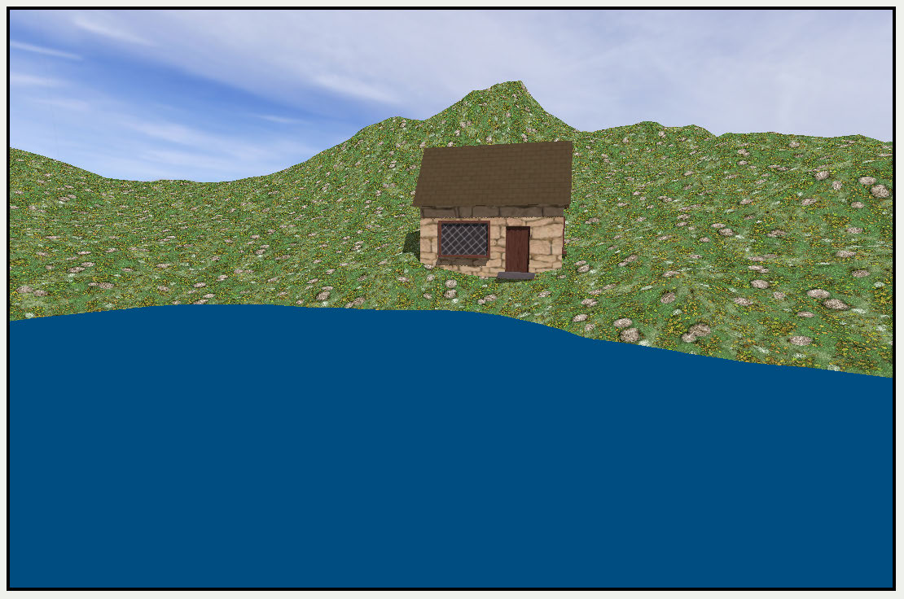

The initial water plane

The cottage is now a waterfront vacation home.

2. Rendering the Reflection

The water plane should reflect its surroundings. In Chapter 21, “Image-Based 
Lighting”, you reflected the skybox onto objects, but this time you’re also going to 
reflect the house and terrain on the water.

You’re going to render the scene to a texture from a point underneath the water 
pointing upwards. You’ll then take this texture and render it flipped on the water 
surface.

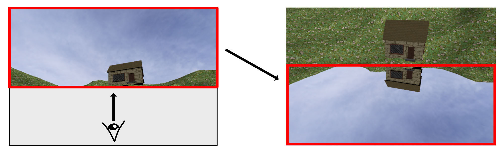

You’ll do all this in WaterRenderPass.

➤ Open WaterRenderPass.swift.

558

Metal by Tutorials
Chapter 22: Reflection & Refraction

WaterRenderPass initializes the pipeline and depth stencil states. Each frame, 
Renderer calls 
waterRenderPass.draw(commandBuffer:scene:uniforms:params:), which 
renders the entire scene (minus the water). Currently the render pass doesn’t render 
anything, because descriptor is nil and the app exits the method.

➤ In WaterRenderPass, add this to init():

You initialize a new render pass descriptor.

➤ Add some new texture properties to WaterRenderPass:

var reflectionTexture: MTLTexture? 
var refractionTexture: MTLTexture? 
var depthTexture: MTLTexture?

You’ll keep both a reflection and a refraction texture, as you’ll render these textures 
from different camera positions. Although you’re setting up the refraction texture, 
you won’t be using it until later in the chapter.

➤ In resize(view:size:), add this:

let size = CGSize( 
  width: size.width / 2, height: size.height / 2) 
reflectionTexture = Self.makeTexture( 
  size: size, 
  pixelFormat: view.colorPixelFormat, 
  label: "Reflection Texture") 
refractionTexture = Self.makeTexture( 
  size: size, 
  pixelFormat: view.colorPixelFormat, 
  label: "Refraction Texture") 
depthTexture = Self.makeTexture( 
  size: size, 
  pixelFormat: .depth32Float, 
  label: "Reflection Depth Texture")

Any time you can save on memory, you should. For reflection and refraction you 
don’t really need sharp images, so you create the textures at half the usual size.

559

Metal by Tutorials
Chapter 22: Reflection & Refraction

➤ Add the following code to the top of 
draw(commandBuffer:scene:uniforms:params:):

let attachment = descriptor?.colorAttachments[0] 
attachment?.texture = reflectionTexture 
attachment?.storeAction = .store 
let depthAttachment = descriptor?.depthAttachment 
depthAttachment?.texture = depthTexture 
depthAttachment?.storeAction = .store

You’ll render color to the reflectionTexture, depth to depthTexture and ensure 
that the GPU stores the textures for later use. Because you’ll render the skybox — 
which will cover the whole render target — you don’t care what the load actions are.

The water plane will use these render textures, so you’ll store them to Water.

➤ In the Geometry group, open Water.swift, and add the new properties to Water:

weak var reflectionTexture: MTLTexture? 
weak var refractionTexture: MTLTexture? 
weak var refractionDepthTexture: MTLTexture?

➤ In render(encoder:uniforms:params:), add the following code before the draw 
call:

encoder.setFragmentTexture( 
  reflectionTexture, 
  index: 0) 
encoder.setFragmentTexture( 
  refractionTexture, 
  index: 1)

Soon, you’ll change the fragment_water shader to use these textures.

➤ Open WaterRenderPass.swift, and add the following code to the top of 
draw(commandBuffer:scene:uniforms:params:):

guard let water = scene.water else { return } 
water.reflectionTexture = reflectionTexture 
water.refractionTexture = refractionTexture 
water.refractionDepthTexture = depthTexture

Here, you pass on the render target textures to Water for texturing the water plane.

➤ Build and run the app to see progress so far.

560

Metal by Tutorials
Chapter 22: Reflection & Refraction

You won’t see any obvious changes, but capture the GPU workload and check out the 
water render pass:

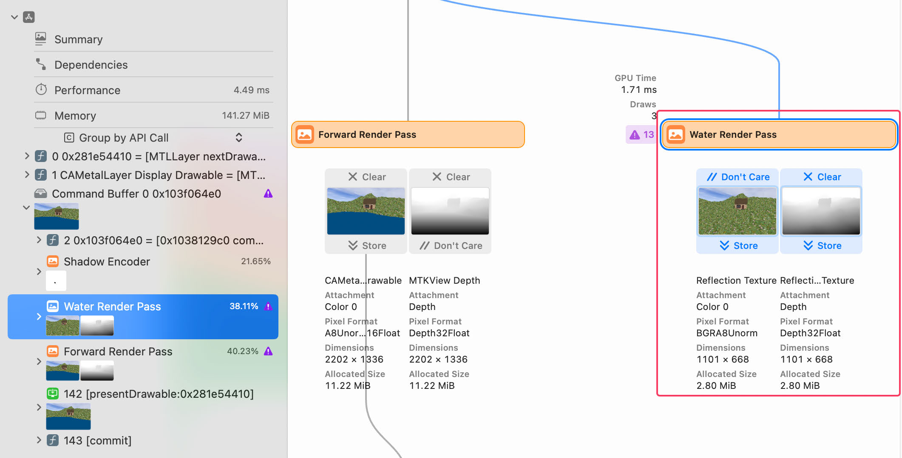

WaterRenderPass renders an exact duplicate of the scene, not including the water 
plane, to the reflection render target texture.

➤ In the Shaders group, open Water.metal, and add new parameters to 
fragment_water:

texture2d<float> reflectionTexture [[texture(0)]], 
texture2d<float> refractionTexture [[texture(1)]]

You’re concentrating on reflection for now, but you’ll use the refraction texture later.

➤ In fragment_water, replace the return line with this:

// 1 
constexpr sampler s(filter::linear, address::repeat); 
// 2 
float width = float(reflectionTexture.get_width() * 2.0); 
float height = float(reflectionTexture.get_height() * 2.0); 
float x = in.position.x / width; 
float y = in.position.y / height; 
float2 reflectionCoords = float2(x, 1 - y); 
// 3 
float4 color = reflectionTexture.sample(s, reflectionCoords); 
color = mix(color, float4(0.0, 0.3, 0.5, 1.0), 0.3); 
return color;

561

Metal by Tutorials
Chapter 22: Reflection & Refraction

Going through the code:

1. Create a new sampler with linear filtering and repeat addressing mode, so that 
the texture tiles at the edge if necessary.

2. Determine the reflection coordinates which will use an inverted y value because 
the reflected image is a mirror of the scene above the water surface. Notice you 
multiply by 2.0. You do this because the texture is only half-size.

3. Sample the color from the reflection texture, and mix it a little with the previous 
bluish color the water plane had before.

➤ Build and run the app, and you’ll see the house, terrain and sky reflected on the 
water surface.

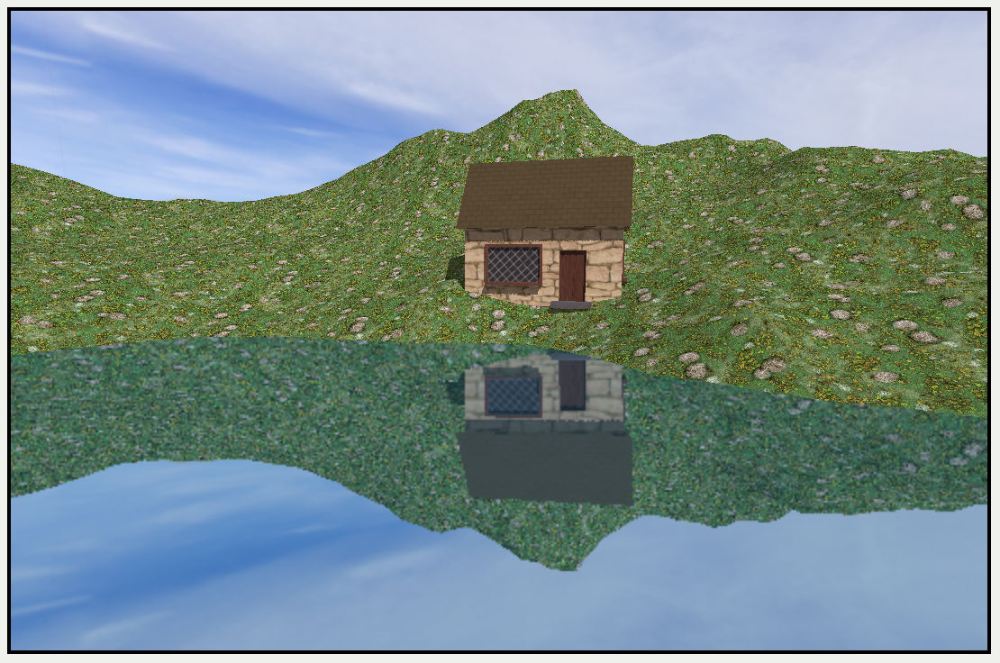

Initial reflection

It looks nice now, but rotate the camera with your mouse or trackpad, or press the 
number 1 key to view from above, and you’ll see the reflection is incorrect. You need 
to render the reflection target from a different camera position.

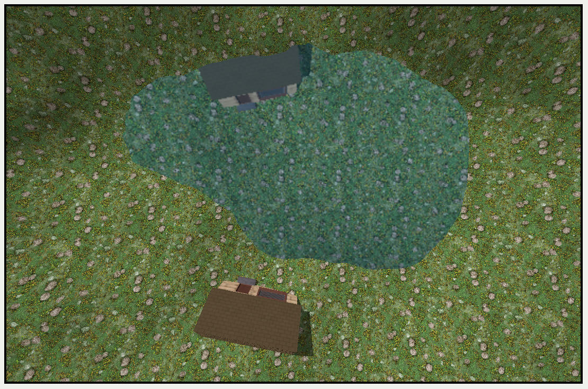

Incorrect reflection

562

Metal by Tutorials
Chapter 22: Reflection & Refraction

➤ Open WaterRenderPass.swift, and in 
draw(commandBuffer:scene:uniforms:params:), add the following code before 
calling render(renderEncoder:scene:uniforms:params:).

var reflectionCamera = scene.camera 
reflectionCamera.rotation.x *= -1 
let position = (scene.camera.position.y - water.position.y) * 2 
reflectionCamera.position.y -= position

var uniforms = uniforms 
uniforms.viewMatrix = reflectionCamera.viewMatrix

Here, you use a separate camera specially for reflection, and position it below the 
surface of the water to capture what’s above the surface.

➤ Build and run the app to see the updated result:

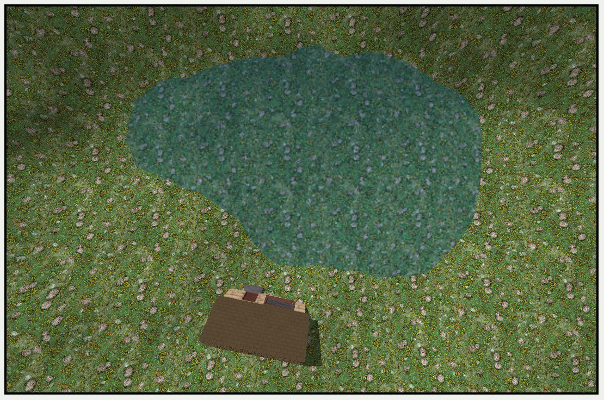

Reflected camera position

That didn’t work out too well. You’d expect to see the sky reflected in the water.

As the main camera moves up the y-axis, the reflection camera moves down the y-
axis to below the terrain surface which blocks the view to the sky. You could 
temporarily solve this by culling the terrain’s back faces when you render, but this 
may introduce other rendering artifacts. A better way of dealing with this issue is to 
clip the geometry you don’t want to render.

563

Metal by Tutorials
Chapter 22: Reflection & Refraction

3. Creating Clipping Planes

A clipping plane, as its name suggests, clips the scene using a plane. It’s hardware 
accelerated, meaning that if geometry is not within the clip range, the GPU 
immediately discards the vertex and doesn’t put it through the entire pipeline. You 
may get a significant performance boost as some of the geometry will not need to get 
processed by the fragment shaders anymore.

For the reflection texture, you only need to render the scene as if from under the 
water, flip it, and add it to the final render.

Placing the clipping plane at the level of the water, ensures that only the scene 
geometry above the water is rendered to the reflection texture.

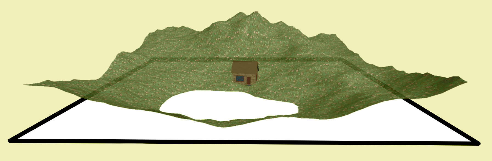

The clipping plane

➤ Still in WaterRenderPass.swift, in 
draw(commandBuffer:scene:uniforms:params:), after the previous code, add this:

var clipPlane = float4(0, 1, 0, -water.position.y) 
uniforms.clipPlane = clipPlane

With this code, you create clipPlane as a var because you’ll adjust it shortly for 
refraction.

The clipping plane xyz is a direction vector that denotes the clipping direction. The 
last component is the level of the water.

564

Metal by Tutorials
Chapter 22: Reflection & Refraction

➤ In the Shaders group, open Common.h, and add a new member to Uniforms:

➤ Open ShaderDefs.h, and add a new member to VertexOut:

Notice the Metal Shading Language attribute, clip_distance, which is one of the 
built-in attributes exclusively used by vertex shaders. The clip_distance attribute 
is an array of distances, and the [1] argument represents its size — a 1 in this case 
because you only need one member in the array.

Even though the vertex function returns VertexOut, the fragment shader functions 
are using FragmentIn in place of VertexOut. FragmentIn was a duplicate of 
VertexOut, because [[clip_distance]] is a vertex-only attribute, and fragment 
functions now wouldn’t compile if they used VertexOut.

Note: You can read more about matching vertex and fragment attributes in 
the Metal Shading Language specification (https://developer.apple.com/metal/
Metal-Shading-Language-Specification.pdf), in Section 5.7.1 “Vertex-
Fragment Signature Matching.”

➤ Open Vertex.metal, and add this to vertex_main before return:

out.clip_distance[0] = 
  dot(uniforms.modelMatrix * in.position, uniforms.clipPlane);

Any negative result in vertex_out.clip_distance[0] will result in the vertex 
being clipped.

You’re now clipping any geometry processed by vertex_main. You could also clip the 
skybox in the same way, but when you later add ripples, they may go below the 
clipping plane, leaving nothing to reflect.

565

Metal by Tutorials
Chapter 22: Reflection & Refraction

➤ Build and run the app, capture the GPU workload and examine the output of the 
Water Render Pass.

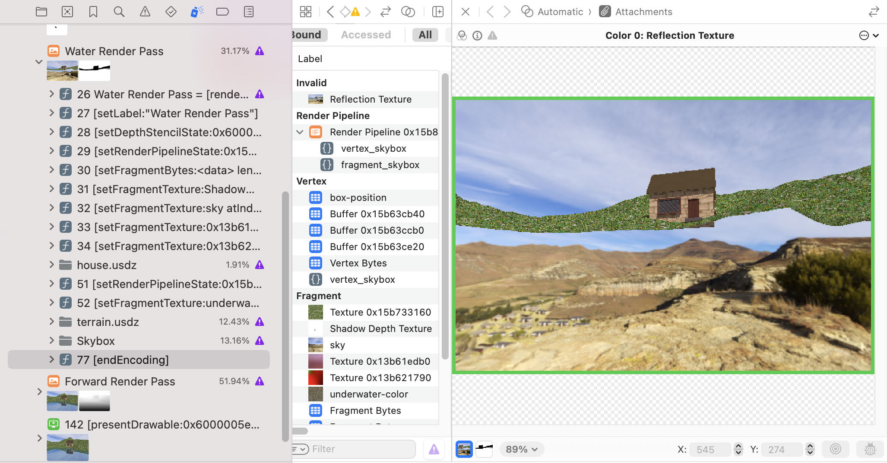

Rendering above the clipping plane

All rendered scene model geometry is clipped, but the skybox still renders.

➤ Continue running the app, move the camera up and rotate it to look downwards.

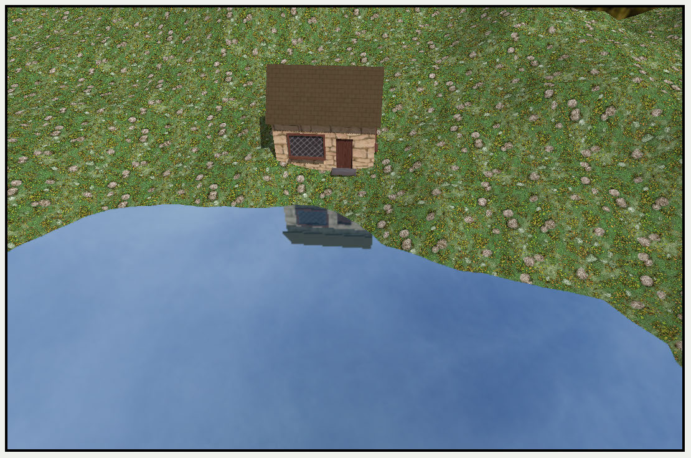

Reflecting the sky correctly

The sky now reflects correctly and your water reflection appears smooth and calm. 
As you move the camera up and down, the reflection is now consistent.

Still water, no matter how calming, isn’t realistic. Time to give that water some 
ripples.

566

Metal by Tutorials
Chapter 22: Reflection & Refraction

4. Rippling Normal Maps

➤ Open Textures.xcassets, and select normal-water. This is a normal map that 
you’ll use for the water ripples.

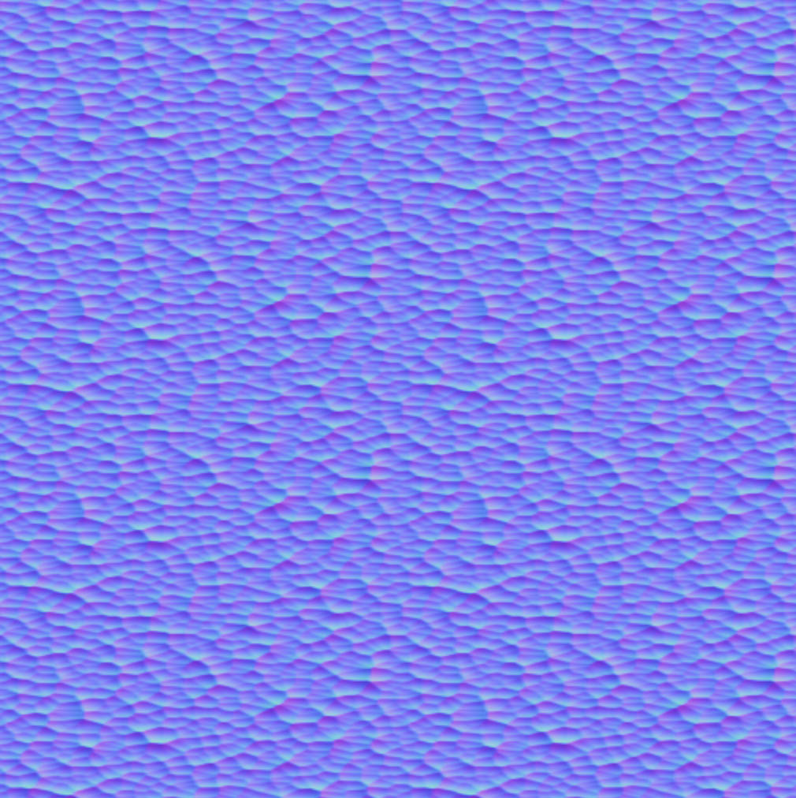

The water ripple normal map

You’ll tile this map across the water and move it, perturbing the water normals, 
which will make the water appear to ripple.

➤ In the Geometry group, open Water.swift, and add these new properties to 
Water:

var waterMovementTexture: MTLTexture? 
var timer: Float = 0

You add the texture, and a timer so that you can animate the normals.

➤ Add the following code to the end of init():

waterMovementTexture = 
  TextureController.loadTexture(name: "normal-water")

➤ In render(encoder:uniforms:params:), add the following code where you set 
the other fragment textures:

encoder.setFragmentTexture( 
  waterMovementTexture, 
  index: 2) 
var timer = timer 
encoder.setFragmentBytes( 
  &timer, 
  length: MemoryLayout<Float>.size, 
  index: 3)

567

Metal by Tutorials
Chapter 22: Reflection & Refraction

Here, you send the texture and the timer to the fragment shader.

➤ Add this new method to Water:

func update(deltaTime: Float) { 
  let sensitivity: Float = 0.005 
  timer += deltaTime * sensitivity 
}

deltaTime will be too fast, so you include a sensitivity modifier.

➤ Open GameScene.swift, and add this to the top of update(deltaTime:):

GameScene will update the water timer every frame.

You’ve now set up the texture and the timer on the CPU side.

➤ Open Water.metal, and add two new parameters for the texture and timer to 
fragment_water:

texture2d<float> normalTexture [[texture(2)]], 
constant float& timer [[buffer(3)]]

➤ Add the following code before you define color:

// 1 
float2 uv = in.uv * 2.0; 
// 2 
float waveStrength = 0.1; 
float2 rippleX = float2(uv.x + timer, uv.y); 
float2 rippleY = float2(-uv.x, uv.y) + timer; 
float2 ripple = 
  ((normalTexture.sample(s, rippleX).rg * 2.0 - 1.0) + 
  (normalTexture.sample(s, rippleY).rg * 2.0 - 1.0)) 
  * waveStrength; 
reflectionCoords += ripple; 
// 3   
reflectionCoords = clamp(reflectionCoords, 0.001, 0.999);

568

Metal by Tutorials
Chapter 22: Reflection & Refraction

Going through the code:

1. Get the texture coordinates and multiply them by a tiling value. For 2 you get 
huge, ample ripples, while for 16 you get quite small ripples. Pick a value that 
suits your needs.

2. Calculate ripples by distorting the texture coordinates with the timer value. Only 
grab the R and G values from the sampled texture because they are the U and V 
coordinates that determine the horizontal plane where the ripples will be. The B 
value is not important here. waveStrength is an attenuator value, that gives you 
weaker or stronger waves.

3. Clamp the reflection coordinates to eliminate anomalies around the margins of 
the screen.

➤ Build and run the app, and you’ll see gorgeous ripples on the water surface.

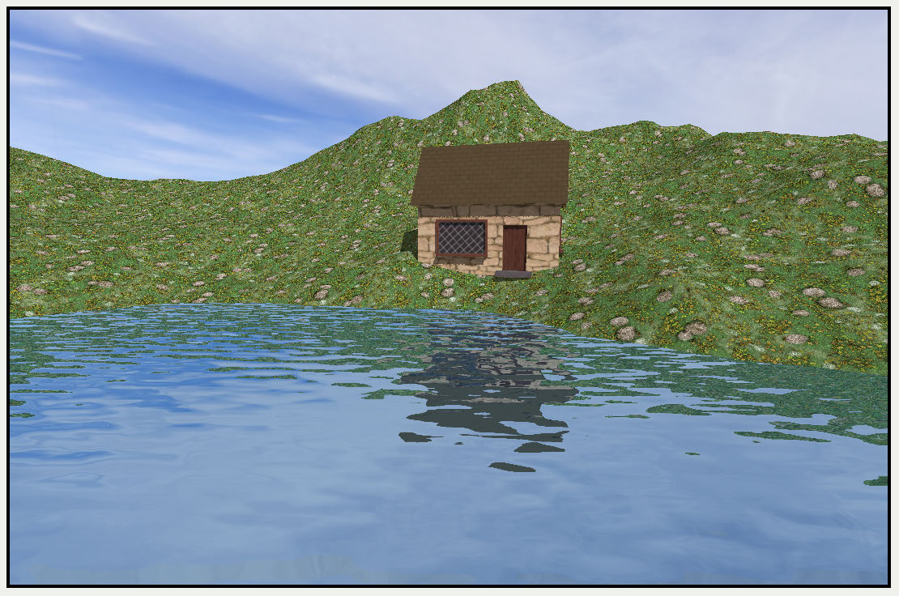

Calming water ripples

5. Adding Refraction

Implementing refraction is very similar to reflection, except that you only need to 
preserve the part of the scene below the clipping plane.

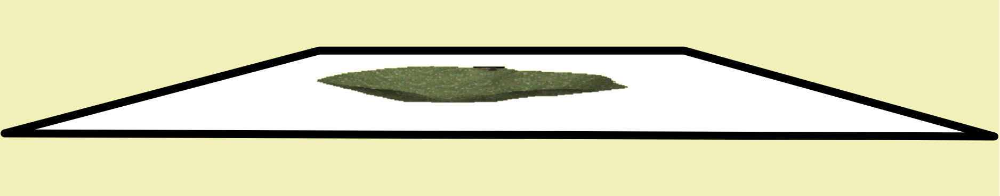

Rendering below the clipping plane

569

Metal by Tutorials
Chapter 22: Reflection & Refraction

➤ Open WaterRenderPass.swift, and add this to the end of 
draw(commandBuffer:scene:uniforms:params:):

// 1 
descriptor.colorAttachments[0].texture = refractionTexture 
// 2 
guard let refractEncoder = 
commandBuffer.makeRenderCommandEncoder( 
  descriptor: descriptor) else { 
  return 
} 
refractEncoder.label = "Refraction" 
// 3 
uniforms.viewMatrix = scene.camera.viewMatrix 
clipPlane = float4(0, -1, 0, -water.position.y) 
uniforms.clipPlane = clipPlane 
// 4 
render( 
  renderEncoder: refractEncoder, 
  scene: scene, 
  uniforms: uniforms, 
  params: params) 
refractEncoder.endEncoding()

Going through the code:

1. Set the refraction texture as the render target.

2. Create a new render command encoder.

3. Set the y value of the clip plane to -1 since the camera is now in its original 
position and pointing down toward the water.

4. Render all the elements of the scene again.

570

Metal by Tutorials
Chapter 22: Reflection & Refraction

➤ Build and run the app, capture the GPU workload and check out the refraction 
texture.

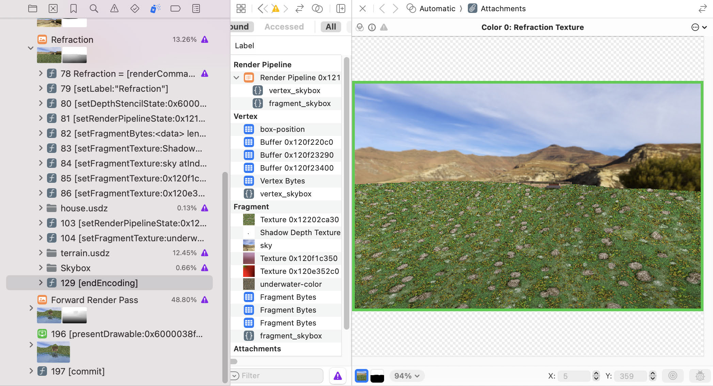

The refraction texture

This time, the GPU has only rendered the scene geometry below the clipping plane.

You’re already sending the refraction texture to the GPU, so you can work on the 
calculations straightaway.

➤ Open Water.metal, and, in fragment_water, add this below where you define 
reflectionCoords:

For refraction you don’t have to flip the y coordinate.

571

Metal by Tutorials
Chapter 22: Reflection & Refraction

➤ Similarly, add this below reflectionCoords += ripple;:

➤ And once more, add this after the reflection line preventing edge anomalies:

➤ Finally, replace:

➤ With:

You temporarily show only the refraction texture. You’ll return and include 
reflection shortly.

➤ Build and run the app.

Refraction

The reflection on the water surface is gone, and instead, you have refraction through 
the water.

There’s one more visual enhancement you can make to your water to make it more 
realistic: adding rocks and grime. Fortunately, the project already has a texture that 
can simulate this.

➤ Open Terrain.metal, and in fragment_terrain, uncomment the section under //
uncomment this for pebbles.

572

Metal by Tutorials
Chapter 22: Reflection & Refraction

➤ Build and run the app, and you’ll now see a pebbled texture underwater.

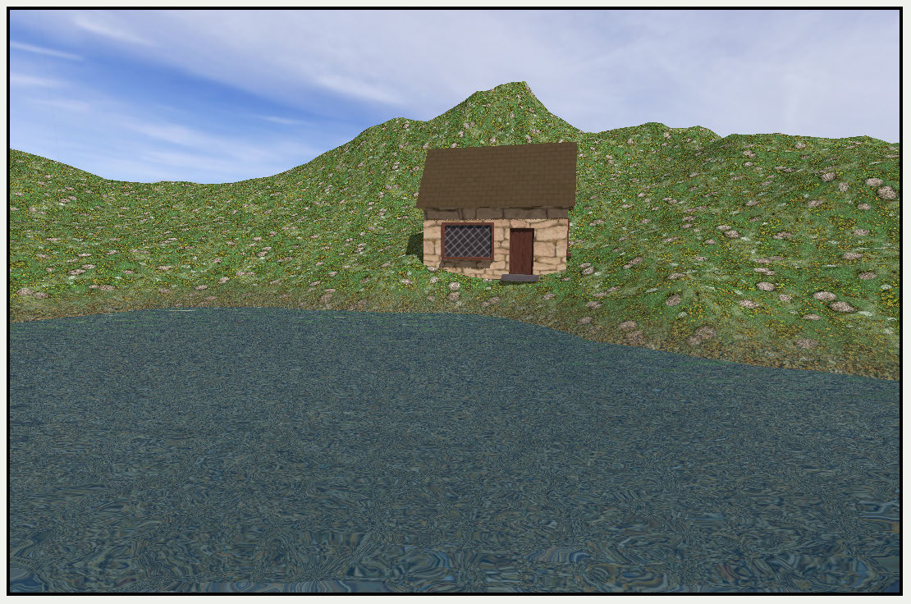

Pebbles

The holy grail of realistic water, however, is having a Fresnel effect that 
harmoniously combines reflection and refraction based on the viewing angle.

6. The Fresnel Effect

The Fresnel effect is a concept you’ve met with in previous chapters. As you may 
remember, the viewing angle plays a significant role in the amount of reflection you 
can see. What’s new in this chapter is that the viewing angle also affects refraction 
but in inverse proportion:

• The steeper the viewing angle is, the weaker the reflection and the stronger the 
refraction.

• The shallower the viewing angle is, the stronger the reflection and the weaker the 
refraction.

The Fresnel effect in action:

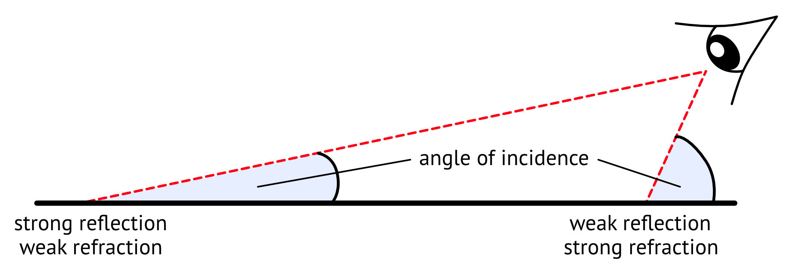

573

Metal by Tutorials
Chapter 22: Reflection & Refraction

➤ Open Water.metal, and in fragment_water, before you define color, add this:

float3 viewVector = 
  normalize(params.cameraPosition - in.worldPosition.xyz); 
float mixRatio = dot(viewVector, float3(0, 1, 0)); 
return mixRatio;

Here, you work out the view vector between the camera and the water fragment. The 
mix ratio will be the blend between reflection and refraction.

➤ Build and run the app.

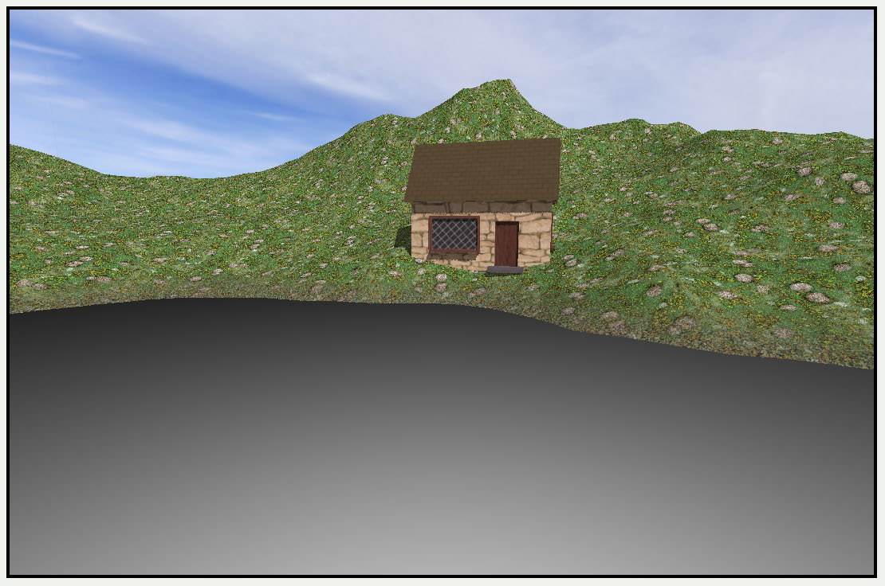

The mix ratio between refraction and reflection

As you move about the scene, the greater the angle between the camera and the 
water, the whiter the water becomes. A view across the water, down close to the 
water, returns black.

Instead of rendering black and white, you’ll mix between the refraction and 
reflection textures. Where the mix ratio is black, you’ll render the reflection texture, 
and where it’s white, refraction. A ratio of 0.5 would mean that reflection and 
refraction are mixed equally.

➤ Replace:

return mixRatio; 
float4 color = refractionTexture.sample(s, refractionCoords);

574

Metal by Tutorials
Chapter 22: Reflection & Refraction

➤ With:

float4 color = 
  mix(reflectionTexture.sample(s, reflectionCoords), 
      refractionTexture.sample(s, refractionCoords), 
      mixRatio);

➤ Build and run the app.

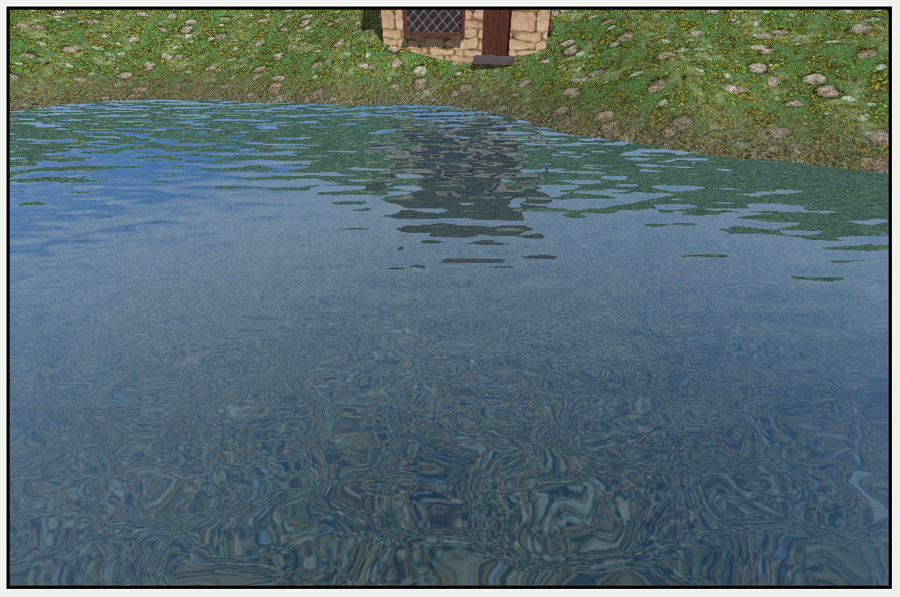

Refraction and Reflection

Move the camera around and notice how reflection predominates for a small viewing 
angle while refraction predominates when the viewing angle is getting closer to 90 
degrees (perpendicular to the water surface).

7. Adding Smoothness Using a Depth 
Texture

Light propagation varies for different transparent media, but for water, the colors 
with longer wavelengths (closer to infrared) quickly fade away as the light ray goes 
deeper. The bluish colors (closer to ultraviolet) tend to be visible at greater depths 
because they have shorter wavelengths.

At very shallow depths, however, most light should still be visible. You’ll make the 
water look smoother as depth gets smaller. You can improve the way the water 
surface blends with the terrain by using a depth map.

575

Metal by Tutorials
Chapter 22: Reflection & Refraction

➤ Open Water.swift, and add the following code to 
render(encoder:uniforms:params:) when you set the other fragment textures:

encoder.setFragmentTexture( 
  refractionDepthTexture, 
  index: 3)

As well as sending the refraction texture from the refraction render pass, you’re now 
sending the depth texture too.

➤ Open Pipelines.swift, and add this to createWaterPSO(vertexDescriptor:) 
before the return:

let attachment = pipelineDescriptor.colorAttachments[0] 
attachment?.isBlendingEnabled = true 
attachment?.rgbBlendOperation = .add 
attachment?.sourceRGBBlendFactor = .sourceAlpha 
attachment?.destinationRGBBlendFactor = .oneMinusSourceAlpha

Here, you configure the blending options on the color attachment just as you did 
back in Chapter 20, “Fragment Post-Processing.”

➤ Open Water.metal, and add the depth texture parameter to fragment_water:

➤ Add the following code before you set rippleX and rippleY:

float far = 100;    // the camera's far plane 
float near = 0.1;   // the camera's near plane 
float proj33 = far / (far - near); 
float proj43 = proj33 * -near; 
float depth = depthMap.sample(s, refractionCoords); 
float floorDistance = proj43 / (depth - proj33); 
depth = in.position.z; 
float waterDistance = proj43 / (depth - proj33); 
depth = floorDistance - waterDistance;

You convert the non-linear depth to a linear value.

576

Metal by Tutorials
Chapter 22: Reflection & Refraction

Note:  Why and how you convert from non-linear to linear, is mathematically 
complex. gamedev.net forums (https://bit.ly/3r086fK) has an explanation of 
converting a non-linear depth buffer value to a linear depth value.

Finally, add this before return:

Here, you change the alpha channel so that blending goes into effect.

➤ Build and run the app, and you’ll now see a smoother blending of the shore with 
the terrain.

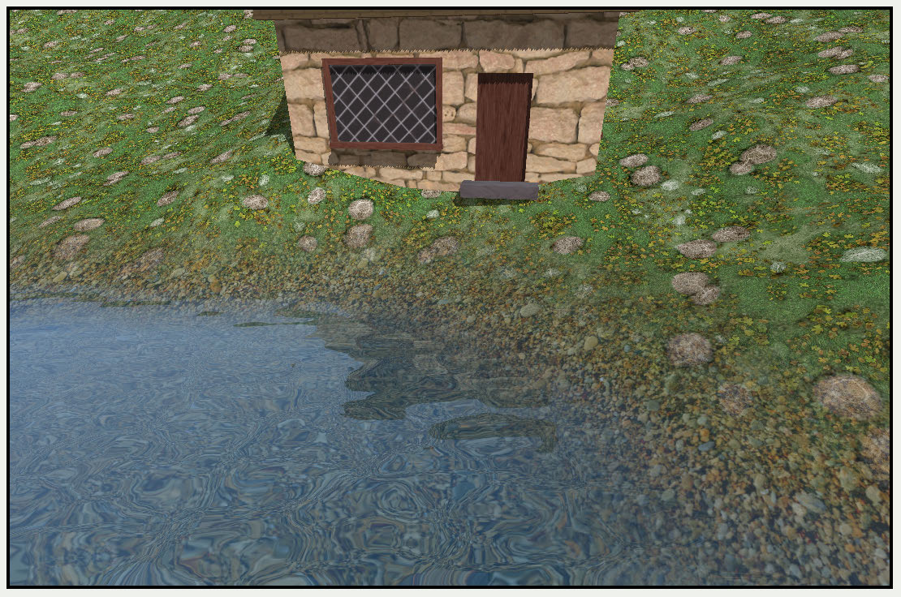

Blending at the water's edge

577

Metal by Tutorials
Chapter 22: Reflection & Refraction

Key Points

• Reflection and refraction are important for realistic water and glass.

• Rasterizing reflections and refraction will not produce as good a result as ray 
tracing. But when speed is a concern, then ray tracing is not often viable.

• Use separate render passes to render textures. For reflection, move the camera in 
the inverse direction from the plane to be reflected and flip the result.

• You already know about near and far clipping planes, but you can also add your 
own custom clipping planes. A negative clip distance from in the vertex function 
will result in the GPU discarding the vertex.

• You can animate normal maps to provide water turbulence.

• The Fresnel effect depends upon viewing angle and affects reflection and 
refraction in inverse proportion.

Where to Go From Here?

You’ve certainly made a splash with this chapter! If you want to explore more about 
water rendering, the references.markdown file in the resources folder for this 
chapter contains links to interesting articles and videos.

578

23