# Animation

Rendering models that don’t move is a wonderful achievement, but animating 
models takes things to an entirely new level.

To animate means to bring to life. So what better way to play with animation than to 
render characters with personality and body movement. In this chapter, you’ll find 
out how to do basic animation using keyframes.

579

Metal by Tutorials
Chapter 23: Animation

The Starter Project

➤ In Xcode, open the starter project for this chapter, and build and run the app.

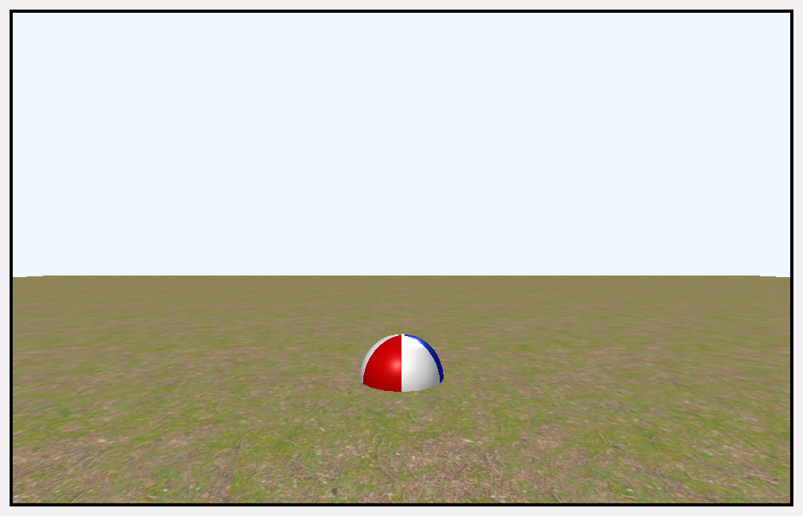

The scene is a simple one with just a ground plane and a ball. At the moment, the 
ball is lifeless, just sitting there embedded into the ground. To liven things up, you’ll 
start off by making it roll around the scene.

In the Animation group, BallAnimations.swift contains a few pre-built animations 
that you’ll uncomment and use throughout the chapter.

Animation

Animators like Winsor McCay and Walt Disney brought life to still images by filming 
a series of hand-drawn pictures one frame at a time.

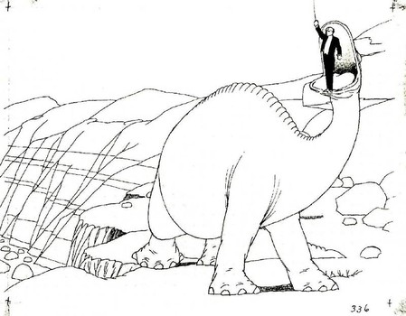

Winsor McCay: Gertie the Dinosaur

This frame-by-frame animation was — and still is — very time consuming. With the 
rise of computer animation, artists can now create 3D models and record their 
positions at specific points in time. From there, the computer could interpolate, or 
tween, the values between those positions, making the animation process a lot less 
time consuming. But there is another option: procedural animation.

580

Metal by Tutorials
Chapter 23: Animation

Procedural Animation

Procedural animation uses mathematics to calculate transformations over time. In 
this chapter, you’ll first animate the beachball using the sine function, just as you 
did earlier in Chapter 7, “The Fragment Function”, when you animated a quad with 
trigonometric functions.

To begin, you’ll create a structure that controls the ball’s animation.

➤ In the Game group, add a new Swift file named Beachball.swift, and add this:

struct Beachball { 
  var ball: Model 
  var currentTime: Float = 0 
 
  init(model: Model) { 
    self.ball = model 
    ball.position.y = 1 
  } 
 
  mutating func update(deltaTime: Float) { 
    currentTime += deltaTime 
  } 
}

Here, you initialize Beachball with the model reference, and create a method that 
GameScene will call every frame. (You’ll use the timer to animate your model over 
time.)

➤ Open GameScene.swift, and add a new property:

➤ Then, add the following code to the top of update(deltaTime:):

All of the ball’s movement and animation will now take place in Beachball.

➤ Open Beachball.swift, and add the following code to the end of 
update(deltaTime:):

This code updates the ball’s x position every frame by double the sine of the 
accumulated current time.

581

Metal by Tutorials
Chapter 23: Animation

➤ Build and run the app.

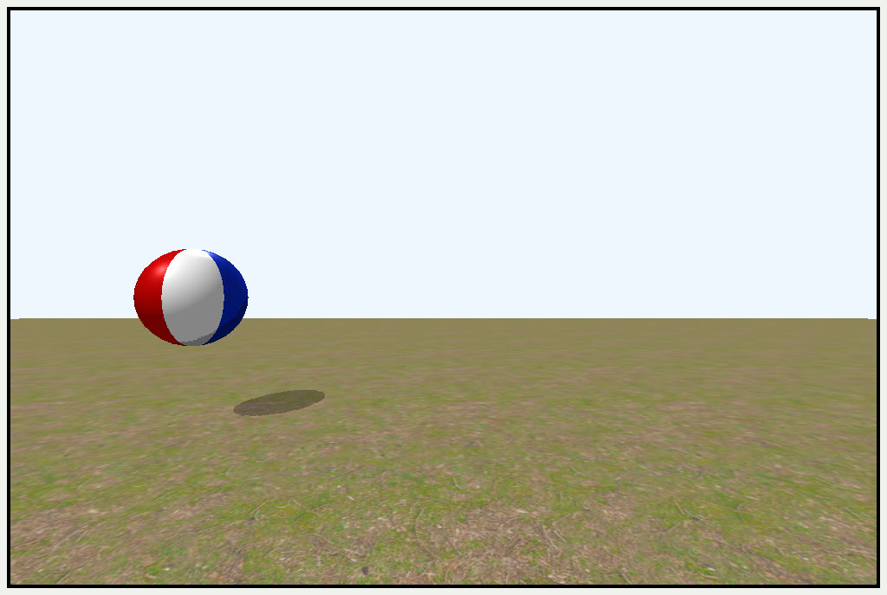

Side to side sine animation

The ball now moves from side-to-side.

Sine is useful for procedural animation. By changing the amplitude, period and 
frequency, you can create waves of motion — although, for a ball, that’s not very 
realistic. However, with some physics, you can add a little bounce to its movement.

Animation Using Physics

Instead of creating animation by hand using an animation app, you can use physics-
based animation, which means that your models can simulate the real world. In this 
next exercise, you’re going to simulate only gravity and a collision. However, a full 
physics engine can simulate all sorts of effects, such as fluid dynamics, cloth and soft 
body (rag doll) dynamics.

➤ Create a new property in Beachball to track the ball’s velocity:

➤ Remove the following code from update(deltaTime:):

➤ In update(deltaTime:), set some constants for the individual physics that you’ll 
need for the simulation:

let gravity: Float = 9.8 // meter / sec2 
let mass: Float = 0.05 
let acceleration = gravity / mass 
let airFriction: Float = 0.2

582

Metal by Tutorials
Chapter 23: Animation

let bounciness: Float = 0.9 
let timeStep: Float = 1 / 600

gravity represents the acceleration of an object falling to Earth. If you’re simulating 
gravity elsewhere in the universe, for example, Mars, this value would be different. 
Newton’s Second Law of Motion is F = ma or force = mass * acceleration. 
Rearranging the equation gives acceleration = force (gravity) / mass. The 
other constants describe the surroundings and properties of the ball. If this were a 
bowling ball, it would have a higher mass and less bounce.

➤ Add this to the end of update(deltaTime:):

ballVelocity += (acceleration * timeStep) / airFriction 
ball.position.y -= ballVelocity * timeStep

// collision with ground 
if ball.position.y <= 0.35 { 
  ball.position.y = 0.35 
  ballVelocity = ballVelocity * -1 * bounciness 
}

Here, you calculate the position of the ball based on the its current velocity. The 
ball’s origin is at its center, and it’s approximately 0.7 units in diameter. So when the 
ball’s center is 0.35 units above the ground, that’s when you reverse the velocity and 
travel upward.

➤ In init(model:), change the ball’s initial position to be higher up in the air:

➤ Build and run the app, and watch the ball bounce.

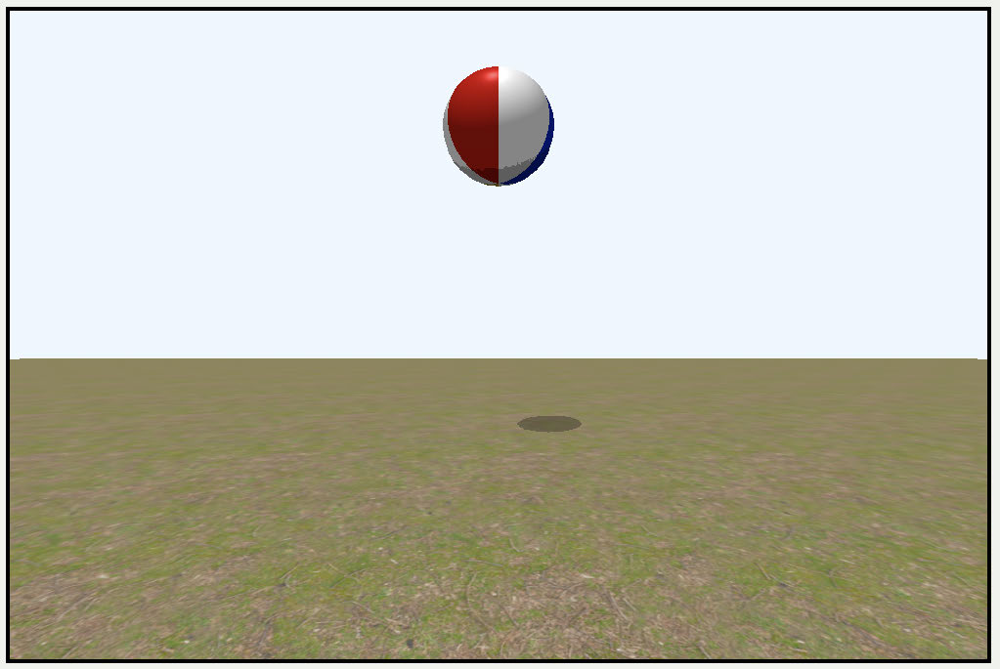

A bouncing ball

583

Metal by Tutorials
Chapter 23: Animation

This is a simple physics animation, but it demonstrates what you can do with very 
little code.

Axis-Aligned Bounding Box

You hard-coded the ball’s radius so that it collides with the ground, but collision 
systems generally require some kind of bounding box to test whether an object 
collides with another object.

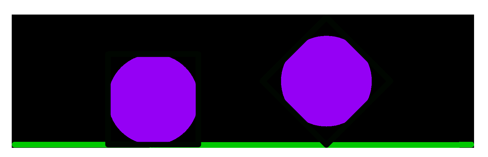

Axis aligned bounding box

A ball would benefit from a spherical bounding volume. Because your ball is simply 
using the y-axis, you can determine the ball’s height using an axis-aligned 
bounding box that Model I/O calculates.

➤ In the Geometry group, open Model.swift. Then, add a bounding box property 
and a computed size property to Model:

var boundingBox = MDLAxisAlignedBoundingBox() 
var size: float3 { 
  return boundingBox.maxBounds - boundingBox.minBounds 
}

➤ Next, add the following code to the end of init(name:):

This code extracts the bounding box information from Model I/O.

➤ Open Beachball.swift, and in update(deltaTime:), update the collision code 
with the correct size calculated from the bounding box value:

// collision with ground 
if ball.position.y <= ball.size.y / 2 { 
  ball.position.y = ball.size.y / 2 
  ballVelocity = ballVelocity * -1 * bounciness 
}

584

Metal by Tutorials
Chapter 23: Animation

➤ Build and run the app, and your ball will collide with the ground, precisely at the 
edge of the ball.

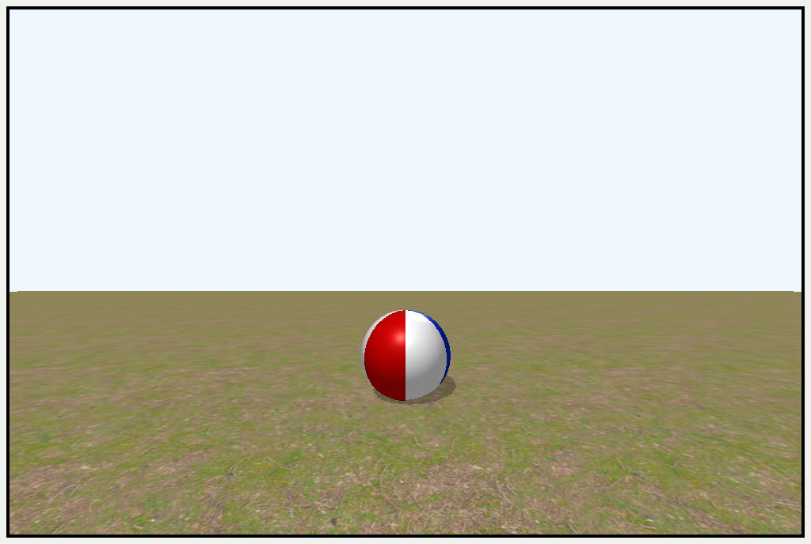

Collision with the ground

Keyframes

Let’s animate the ball getting tossed around by adding some input information about 
its position over time. For this input, you’ll need an array of positions so that you can 
extract the correct position for the specified time.

In the Animation group, in BallAnimations.swift, there’s an array already set up: 
ballPositionXArray. This array contains sixty values ranging from -1 to 1, then 
back to -1. By calculating the current frame, you can grab the correct x position from 
the array.

➤ Open Beachball.swift, and replace update(deltaTime:) with:

mutating func update(deltaTime: Float) { 
  currentTime += deltaTime 
  ball.position.y = 1 
 
  let fps: Float = 60 
  let currentFrame = 
    Int(currentTime * fps) % (ballPositionXArray.count) 
  ball.position.x = ballPositionXArray[currentFrame] 
}

Here, you calculate the current frame (based on 60 fps) and extract the correct value 
from the array.

585

Metal by Tutorials
Chapter 23: Animation

➤ Build and run the app.

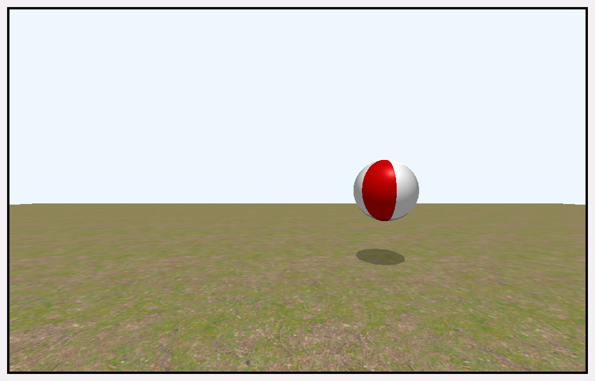

Frame by frame animation

Watch as the ball moves around in a mechanical, backward and forward motion over 
60 frames. This is almost the same result as the sine animation, but instead, it’s 
animated using an array of values that you can control and re-use.

Here, you’re setting the position 60 times per second — but even at that speed, the 
animation appears jerky. If you were to lower the speed to 30 fps, the animation 
would look awful.

Interpolation

It’s a lot of work inputting a value for each frame. If you’re just moving an object in a 
straight line from point A to B, you can interpolate the value. Interpolation is where 
you calculate a value given a range of values and a current location within the range. 
When animating, the current location is the current time as a percentage of the 
animation duration.

➤ To work out the time percentage, use the following formula:

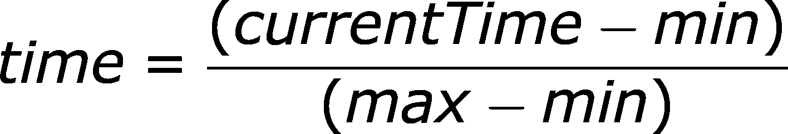

This formula results in a time value between 0 and 1.

For example, with a start value of 5, an end value of 10 and a duration of 2 seconds, 
after 1 second passes, the interpolated value is 7.5.

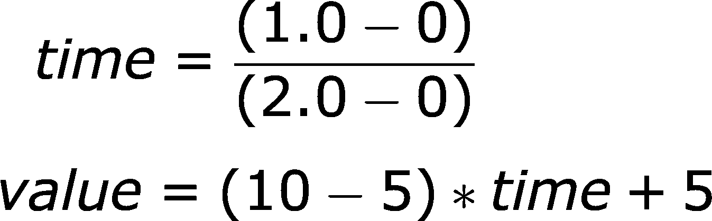

586

Metal by Tutorials
Chapter 23: Animation

That’s a linear interpolation, but you can use other formulas for interpolating.

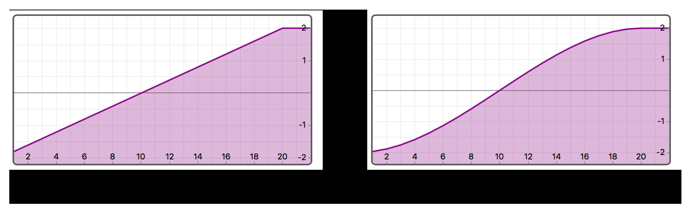

In the above image, linear interpolation is on the left. The x-axis is time, and the y-
axis is value. You sample the value at the appropriate time. You can improve the 
ball’s animation using ease in / ease out interpolation (shown on the right) to make 
the animation less mechanical. With ease in / ease out, the ball gains speed slowly at 
the start and then slows down toward the end of the animation.

Instead of creating one value for every frame to animate your ball, you’ll hold only 
key positions. These positions will be the extreme of a pose. In the ball example, the 
extreme pose positions are -1 and 1. You’ll also hold key times that match the time 
of that key value. For example, if your animation is 2 seconds long, your extremes 
would be at 0 seconds for the starting pose on the left, 1 second for the ball to be on 
the right, and 2 seconds to take the ball back to the left again. All of the frames in 
between these times are interpolated.

➤ In the Animation group, create a new Swift file named Animation.swift.

In this file, you’ll hold your animation data and create methods to return the 
interpolated value at a given time.

➤ Add the following:

struct Keyframe<Value> { 
  var time: Float = 0 
  var value: Value 
}

This code creates a structure to hold the animation key values and times. The value 
can be one of various types, so you make it generic.

➤ Now, add this:

struct Animation { 
  var translations: [Keyframe<float3>] = [] 
  var repeatAnimation = true 
}

587

Metal by Tutorials
Chapter 23: Animation

This structure holds an array of keyframes where each translation will be a float3 
value. repeatAnimation indicates whether to repeat the animation clip forever or 
play it just once.

➤ Add the following new method to Animation:

func getTranslation(at time: Float) -> float3? { 
  // 1 
  guard let lastKeyframe = translations.last else { 
    return nil 
  } 
  // 2 
  var currentTime = time 
  if let first = translations.first, 
    first.time >= currentTime { 
    return first.value 
  } 
  // 3 
  if currentTime >= lastKeyframe.time, 
    !repeatAnimation { 
    return lastKeyframe.value 
  } 
}

This method returns the interpolated keyframe.

Here’s the breakdown:

1. Ensure that there are translation keys in the array, otherwise, return a nil value.

2. If the first keyframe occurs on or after the time given, then return the first key 
value. The first frame of an animation clip should be at keyframe 0 to give a 
starting pose.

3. If the time given is greater than the last key time in the array, then check 
whether you should repeat the animation. If not, then return the last value.

➤ Add the following code to the bottom of getTranslation(at:):

// 1 
currentTime = fmod(currentTime, lastKeyframe.time) 
// 2 
let keyFramePairs = translations.indices.dropFirst().map { 
  (previous: translations[$0 - 1], next: translations[$0]) 
} 
// 3 
guard let (previousKey, nextKey) = (keyFramePairs.first { 
  currentTime < $0.next.time 
}) 
else { return nil }

588

Metal by Tutorials
Chapter 23: Animation

// 4 
let interpolant = 
  (currentTime - previousKey.time) / 
  (nextKey.time - previousKey.time) 
// 5 
return simd_mix( 
  previousKey.value, 
  nextKey.value, 
  float3(repeating: interpolant))

Going through this code:

1. Use the modulo operation to get the current time within the clip.

2. Create a new array of tuples containing the previous and next keys for all 
keyframes, except the first one.

3. Find the first tuple of previous and next keyframes where the current time is less 
than the next keyframe time. The current time will, therefore, be between the 
previous and next keyframe times.

4. Use the interpolation formula to get a value between 0 and 1 for the progress 
percentage between the previous and next keyframe times.

5. Use simd_mix to interpolate between the two keyframes. (interpolant must be 
a value between 0 and 1.)

➤ Open BallAnimations.swift, and uncomment ballTranslations.

ballTranslations is an array of seven Keyframes. The length of the clip is two 
seconds. You can see this by looking at the key time of the last keyframe.

In the x-axis, the ball will start off at position -1 and then move to position 1 at 0.35 
seconds. It will hold its position until 1 second has passed, then return to -1 at 1.35 
seconds. It will then hold its position until the end of the clip. By changing the 
values in the array, you can speed up the throw and hold the ball for longer at either 
end.

➤ Open Beachball.swift, and replace update(deltaTime:) with:

mutating func update(deltaTime: Float) { 
  currentTime += deltaTime 
  var animation = Animation() 
  animation.translations = ballTranslations 
  ball.position = 
    animation.getTranslation(at: currentTime) ?? [0, 0, 0] 
  ball.position.y += ball.size.y 
}

589

Metal by Tutorials
Chapter 23: Animation

Here, you load the animation clip with the generated keyframe translations. 
Generally, you’ll want to load the animation clip outside of the update, but for the 
sake of simplicity, in this example, handling things within update(deltaTime:) is 
fine.

You then extract the ball’s position from the animation clip for the current time.

➤ Build and run the app, and watch as creepy invisible hands toss your ball around.

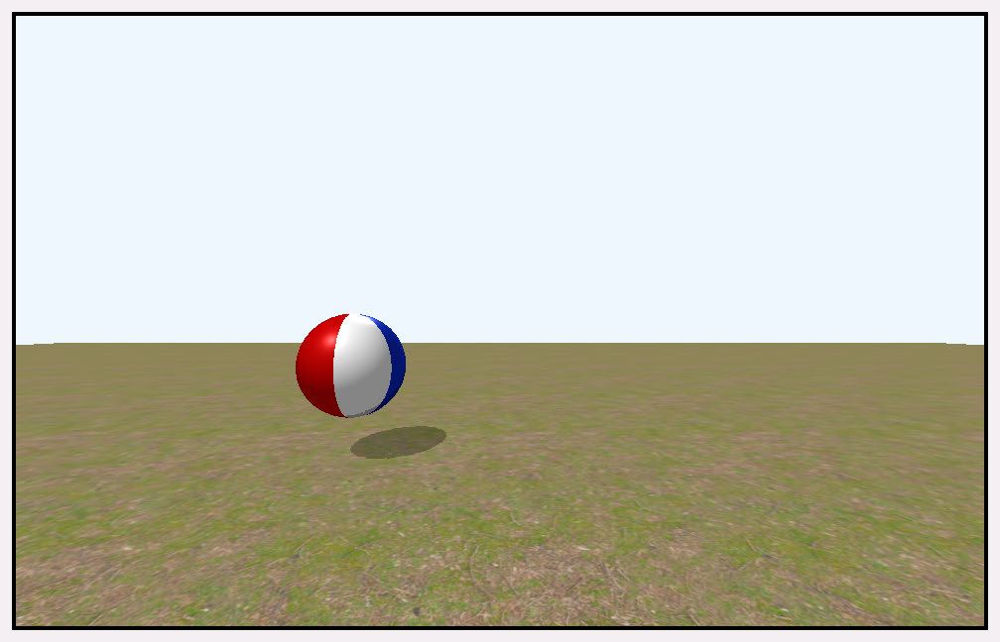

Tossing the ball

Note: Notice the trajectory of the ball on the y-axis. It currently goes up and 
down in diagonal straight lines. Better keyframing can fix this.

Euler Angle Rotations

Now that you have the ball translating through the air, you probably want to rotate it 
as well. To express rotation of an object, you currently hold a float3 with rotation 
angles on x, y and z axes. These are known as Euler angles after the mathematician 
Leonhard Euler. Euler is the man behind Euler’s rotation theorem — a theorem which 
states that any rotation can be described using three rotation angles. This is OK for a 
single rotation, but interpolating between these three values doesn’t work in a way 
that you may think.

➤ To create a rotation matrix, you’ve been calling this function, hidden in the math 
library in Utility/MathLibrary.swift:

init(rotation angle: float3) { 
  let rotationX = float4x4(rotationX: angle.x) 
  let rotationY = float4x4(rotationY: angle.y) 
  let rotationZ = float4x4(rotationZ: angle.z) 
  self = rotationX * rotationY * rotationZ 
}

590

Metal by Tutorials
Chapter 23: Animation

Here, the final rotation matrix is made up of three rotation matrices multiplied in a 
particular order. This order is not set in stone and is one of six possible orders. 
Depending on the multiplication order, you’ll get a different rotation.

Note: Sometimes, these rotations are referred to as Yaw-Pitch-Roll. You’ll see 
these names a lot in flight simulators, Depending on your frame of reference, 
if you’re using the y-axis as up and down (remember that’s not universal), 
then Yawing is about the y-axis, Pitching is about the x-axis and Rolling is 
about the z-axis.

For static objects within one rendering engine, this is fine. The main problem comes 
with animation and interpolating these angles.

As you proceed through a rotation interpolation if two axes become aligned you get 
the terrifyingly named gimbal lock.

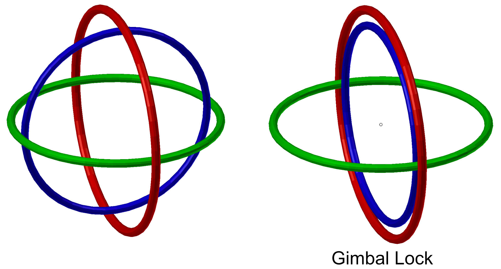

Gimbal lock means that you’ve lost one axis of rotation. Because the inner axis 
rotations build on the outer axis rotation, the two rotations overlap and cause odd 
interpolation.

Quaternions

Multiplying x, y and z rotations without compelling a sequence on them is 
impossible unless you involve the fourth dimension. In 1843, Sir William Rowan 
Hamilton did just that: he inscribed his fundamental formula for quaternion 
multiplication on to a stone on a bridge in Dublin.

The formula uses four-dimensional vectors and complex numbers to describe 
rotations. The mathematics is complicated, but fortunately, you don’t have to 
understand how quaternions work to use them.

591

Metal by Tutorials
Chapter 23: Animation

The main benefit of quaternions are:

• They interpolate correctly when using spherical linear interpolation (or slerp).

• They never lose any axes of control.

• They always take the shortest path between two rotations unless you specifically 
ask for the longest path.

Note: If you’re interested in studying the internals of quaternions, 
references.markdown contains further reading.

You don’t have to write any complicated interpolation code because simd has 
quaternion classes and methods that handle everything for you. simd_slerp() 
performs a spherical interpolation along the shortest path as shown in the following 
image.

Spherical interpolation

Internally in simd, quaternions are vectors of four elements, but Apple suggests that 
you treat them as abstract mathematical objects rather than delving into internal 
storage. That lets you off the hook for learning that the last element of the 
quaternion is the real part, and the first three elements are the imaginary part.

You’ll switch from using Euler rotations to using quaternions for your rotations. 
Taking advantage of simd conversion of quaternions to and from rotation matrices, 
this switch is almost effortless.

592

Metal by Tutorials
Chapter 23: Animation

➤ In the Geometry group, open Transform.swift, add a new property to Transform 
and change the definition of rotation:

var quaternion = simd_quatf(.identity) 
var rotation: float3 = [0, 0, 0] { 
  didSet { 
    let rotationMatrix = float4x4(rotation: rotation) 
    quaternion = simd_quatf(rotationMatrix) 
  } 
}

You initialize the quaternion to a zero rotation, and keep the quaternion value in 
sync when you set a model’s rotation.

➤ In the extension where you define modelMatrix, change the definition of 
rotation to:

➤ In the Transformable extension, add this:

var quaternion: simd_quatf { 
  get { transform.quaternion } 
  set { transform.quaternion = newValue } 
}

With this syntactic sugar, when you refer to the model.transform.quaternion, you 
can now instead shorten it to model.quaternion.

To animate using quaternion rotation, you’ll duplicate what you did for translations.

➤ Open Animation.swift, and add a new property to Animation:

This time the keyframes will be quaternion values.

➤ Duplicate getTranslation(at:) to a new method called getRotation(at:), that 
uses rotations and quaternions instead of translations and floats:

func getRotation(at time: Float) -> simd_quatf? { 
  guard let lastKeyframe = rotations.last else { 
    return nil 
  } 
  var currentTime = time 
  if let first = rotations.first, 
    first.time >= currentTime { 
    return first.value

593

Metal by Tutorials
Chapter 23: Animation

} 
  if currentTime >= lastKeyframe.time, 
    !repeatAnimation { 
    return lastKeyframe.value 
  } 
  currentTime = fmod(currentTime, lastKeyframe.time) 
  let keyFramePairs = rotations.indices.dropFirst().map { 
    (previous: rotations[$0 - 1], next: rotations[$0]) 
  } 
  guard let (previousKey, nextKey) = (keyFramePairs.first { 
    currentTime < $0.next.time 
  }) 
  else { return nil } 
  let interpolant = 
    (currentTime - previousKey.time) / 
    (nextKey.time - previousKey.time) 
  return simd_slerp( 
    previousKey.value, 
    nextKey.value, 
    interpolant) 
}

Note that you change the interpolation function to use simd_slerp instead of 
simd_mix. This does the necessary spherical interpolation.

➤ Open BallAnimations.swift, and uncomment ballRotations.

ballRotations is an array of rotation keyframes. The rotation starts out at 0, then 
rotates by 90º on the z-axis over several keyframes to a rotation of 0 at 0.35 
seconds. The reason for rotating several times by 90º is because if you rotate from 0º 
to 360º, the shortest distance between those is 0º, so the ball won’t rotate at all.

➤ Open Beachball.swift, and replace update(deltaTime:) with this:

mutating func update(deltaTime: Float) { 
  currentTime += deltaTime 
  var animation = Animation() 
  animation.translations = ballTranslations 
  animation.rotations = ballRotations 
  ball.position = 
    animation.getTranslation(at: currentTime) 
      ?? float3(repeating: 0) 
  ball.position.y += ball.size.y / 2 
  ball.quaternion = 
    animation.getRotation(at: currentTime) 
      ?? simd_quatf() 
}

You load the animation clip with both translation and rotation values. You then 
extract the values for position and quaternion for the given time.

594

Metal by Tutorials
Chapter 23: Animation

➤ Build and run the app, and your ball moves back and forth with rotation.

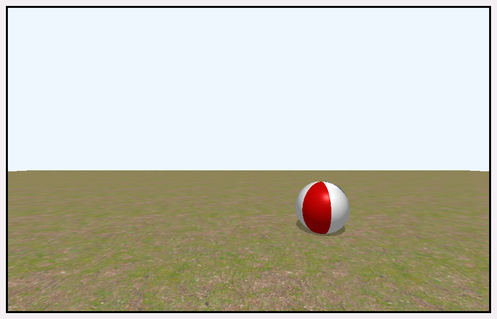

The ball rotates as it moves

If you need more complex animations, you’ll probably want to create the animation 
in a 3D app like Blender and store it in a USD file.

USD and USDZ Files

You briefly learned about some 3D file formats in Chapter 2, “3D Models”. 
Throughout this book, models are in the USD file format with the .usdz file 
extension, Apple’s preferred 3D format. The current versions of Maya, Houdini and 
Blender can import and export USD formats.

These are the various file extensions for the USD format:

• .usd: A Universal Scene Description (USD) file consists of assets or links to assets 
which allows multiple artists to work on the same scene. The file can hold massive 
scenes with mesh geometry, textures, animation and lighting information.

• .usdz: A single archive file that contains all the files - not just links - necessary for 
rendering a model.

• .usda: This file is the USD file in human readable text format.

• .usdc: This file is the USD file in binary format.

At the time of writing, Blender 3.6 can’t export skeletal animation directly to USD. 
You can animate meshes, such as this ball, in Blender 3.6 and export the animation 
because the mesh is not attached to a skeleton. You’ll read more about skeletal 
animation in the following chapter.

595

Metal by Tutorials
Chapter 23: Animation

Apple provides Reality Converter beta (https://apple.co/3H8FKWd), which allows 
you to convert from other formats, view and customize your USDZ files. Currently 
the supported formats are .obj, .fbx, .abc and .glTF. The FBX and glTF formats 
support animation.

Sketchfab (http://sketchfab.com) is a major provider and showcase of 3D models. All 
their downloadable models are now available converted to the USDZ format.

Animating Meshes

In the Models group, the file beachball.usdz holds translation and rotation 
animation, and Model I/O can extract this animation in various ways.

Model I/O transform components don’t allow you to access the rotation and 
translation values directly. Instead, they provide you with a method that returns a 
transform matrix at a particular time. So for mesh transform animation, you’ll 
extract the animation data for every frame of the animation during the model 
loading process.

Note: When writing your own engine, you’ll have the choice to load this 
animation data up front for every frame, to match the transformation 
animation. You should consider the requirements of your game and what 
information your models hold. Generally it is more efficient to extract the 
loading code to a separate app which loads models and saves materials, 
textures and animation data into a more efficient format that matches your 
game engine. A good example of this asset pipeline is Apple’s video and 
sample code From Art to Engine with Model I/O from WWDC 2017 (https://
youtu.be/qxGhnC4_PRc?si=tEvvZRutB9pyxP8w).

You’ll be running your game at a fixed fps - generally 60, and you’ll hold a transform 
matrix for every frame of animation.

➤ In the Game group, open GameController.swift, and add a new property:

You’ll use fps as the standard frames per second for your app.

596

Metal by Tutorials
Chapter 23: Animation

➤ At the top of init(metalView:options:), add this:

You set fps right at the top of init(metalView:options:) because the models will 
use it when you initialize GameScene.

Model I/O can hold transform information on all objects within the MDLAsset. When 
you initialize Mesh, you’ll extract its transform animation, and then animate these 
transforms for the duration given by the asset.

➤ In the Animation group, create a new file named TransformComponent.swift, 
and replace the default code with:

import ModelIO

struct TransformComponent { 
  let keyTransforms: [float4x4] 
  let duration: Float 
  var currentTransform: float4x4 = .identity 
}

You’ll hold all the transform matrices for each frame for the duration of the 
animation. For example, if the animation has a duration of 2.5 seconds at 60 frames 
per second, keyTransforms will have 150 elements. Later, you’ll update all of the 
Mesh’s currentTransform of every frame with the transform for the current frame 
taken from keyTransforms.

➤ Now, add the following to TransformComponent:

init( 
  object: MDLObject, 
  startTime: TimeInterval, 
  endTime: TimeInterval 
) { 
  duration = Float(endTime - startTime) 
  let timeStride = stride( 
    from: startTime, 
    to: endTime, 
    by: 1 / TimeInterval(GameController.fps)) 
  keyTransforms = Array(timeStride).map { time in 
    MDLTransform.globalTransform( 
      with: object, 
      atTime: time) 
  } 
}

597

Metal by Tutorials
Chapter 23: Animation

This initializer creates all the transform matrices for every frame for the duration of 
the animation.

➤ Add the following to TransformComponent:

mutating func getCurrentTransform(at time: Float) { 
  guard duration > 0 else { 
    currentTransform = .identity 
    return 
  } 
  let frame = Int(fmod(time, duration) * 
Float(GameController.fps)) 
  if frame < keyTransforms.count { 
    currentTransform = keyTransforms[frame] 
  } else { 
    currentTransform = keyTransforms.last ?? .identity 
  } 
}

You retrieve a transform matrix at a given time. You calculate the current frame of 
the animation from the time. Using the floating point modulo operation fmod 
function, you can loop the animation. For example, if the animation is 2.5 seconds 
long, at 60 frames per second, that would mean there are 150 frames in the 
animation. If the current time is 5 seconds, that will be the last frame of the 
animation looped for a second time, and the current frame will be 150.

You save the current transform on the transform component. You’ll use the 
transform to update the position of the mesh vertices shortly.

The animation will need the start and end time from the asset.

➤ Open Mesh.swift, and add a new initializer to Mesh:

init( 
  mdlMesh: MDLMesh, 
  mtkMesh: MTKMesh, 
  startTime: TimeInterval, 
  endTime: TimeInterval 
) { 
  self.init(mdlMesh: mdlMesh, mtkMesh: mtkMesh) 
}

➤ Open Model.swift, and in init(name:), locate Mesh(mdlMesh: $0.0, mtkMesh: 
$0.1) inside the meshes assignment.

598

Metal by Tutorials
Chapter 23: Animation

➤ Change Mesh(mdlMesh: $0.0, mtkMesh: $0.1) to:

Mesh( 
  mdlMesh: $0.0, 
  mtkMesh: $0.1, 
  startTime: asset.startTime, 
  endTime: asset.endTime)

You use your new initializer in place of the old one.

➤ Back in Mesh.swift, add a new property to Mesh:

➤ Add the following code to the end of 
init(mdlMesh:mtkMesh:startTime:endTime:):

if mdlMesh.transform != nil { 
  transform = TransformComponent( 
    object: mdlMesh, 
    startTime: startTime, 
    endTime: endTime) 
}

Now that you’ve set up the transform component with animation, you’ll be able to 
use it when rendering each frame.

➤ Open Model.swift, and add a new property to keep track of elapsed game time:

➤ Add a new method to Model:

func update(deltaTime: Float) { 
  currentTime += deltaTime 
  for index in 0..<meshes.count { 
    meshes[index].transform?.getCurrentTransform(at: 
currentTime) 
  } 
}

Here, you update all the transforms in the model ready for rendering.

➤ Open Rendering.swift, and in render(encoder:uniforms:params:), remove:

uniforms.modelMatrix = transform.modelMatrix 
uniforms.normalMatrix = uniforms.modelMatrix.upperLeft

599

Metal by Tutorials
Chapter 23: Animation

encoder.setVertexBytes( 
  &uniforms, 
  length: MemoryLayout<Uniforms>.stride, 
  index: UniformsBuffer.index)

Some models may have multiple meshes, and you’ll have to change the model matrix 
for each mesh.

➤ At the top of the for mesh in meshes loop, add this:

let currentLocalTransform = 
  mesh.transform?.currentTransform ?? .identity 
uniforms.modelMatrix = 
  transform.modelMatrix * currentLocalTransform 
uniforms.normalMatrix = uniforms.modelMatrix.upperLeft 
encoder.setVertexBytes( 
  &uniforms, 
  length: MemoryLayout<Uniforms>.stride, 
  index: UniformsBuffer.index)

Here, you combine the model’s world transform with the mesh’s transform and send 
the uniforms to the vertex shader.

➤ Open GameScene.swift, and in update(deltaTime:), replace 
beachball.update(deltaTime:) with:

for model in models { 
  model.update(deltaTime: deltaTime) 
}

With this change, you’ll use the animation from the model file rather than from 
Beachball

➤ Build and run the app, and you’ll see an epic animation.

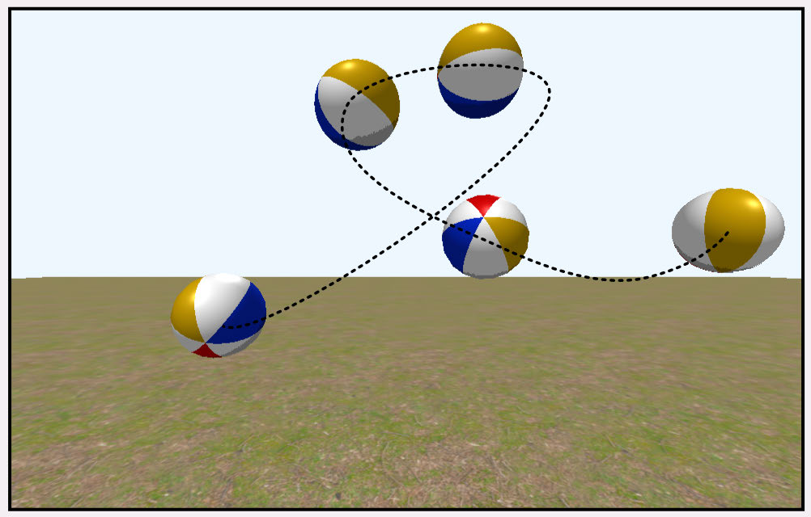

The beachball USD animation

Now that you’ve learned about simple mesh animation, you’re ready to move on to 
animating a jointed figure.

600

Metal by Tutorials
Chapter 23: Animation

Key Points

• Animation used to be done using frame-by-frame, but nowadays, animation is 
created on computers and is usually done using keyframes and interpolation.

• Procedural animation uses physics to compute values at a given time.

• Axis-aligned bounding boxes are useful when calculating collisions between 
aligned objects.

• Keyframes are generally extreme values between which the computer interpolates. 
This chapter demonstrates keyframing transformations, but you can animate 
anything. For example, you can set keyframes for color values over time.

• You can use any formula for interpolation, such as linear, or ease-in / ease-out.

• Interpolating quaternions is preferable to interpolating Euler angles.

• USD files are common throughout the 3D industry because you can keep the entire 
pipeline stored in the flexible format that USD provides.

601

24