# Character 
Animation

In the previous chapter, you learned how to move objects over time using keyframes. 
Imagine how long it would take to create a walk cycle for a human figure by typing 
out keyframes. This is the reason why you generally use a 3D app, like Blender or 
Maya, to create your models and animations. You then export those animations to 
your game or rendering engine of choice.

602

Metal by Tutorials
Chapter 24: Character Animation

Skeletal Animation

Rarely will you move the entire character when you’re animating it. Even a walk 
cycle is animated in place. Instead, you’ll move parts of the mesh, such as an arm, 
rather than the whole thing. Using a 3D app, the rigger creates a skeleton — in 
Blender, this is known as an armature. The rigger assigns bones and other controls 
to parts of the mesh so that the animator can transform the bones and record the 
movement into an animation clip.

You’ll use Blender 3.6 to examine an animated model and understand the principles 
and concepts behind 3D animation.

Note: If you haven’t installed Blender 3.6 yet, it’s free, and you can download 
it from https://www.blender.org.

➤ Go to the resources folder for this chapter, and open skeleton.blend in Blender.

You’ll see something like this:

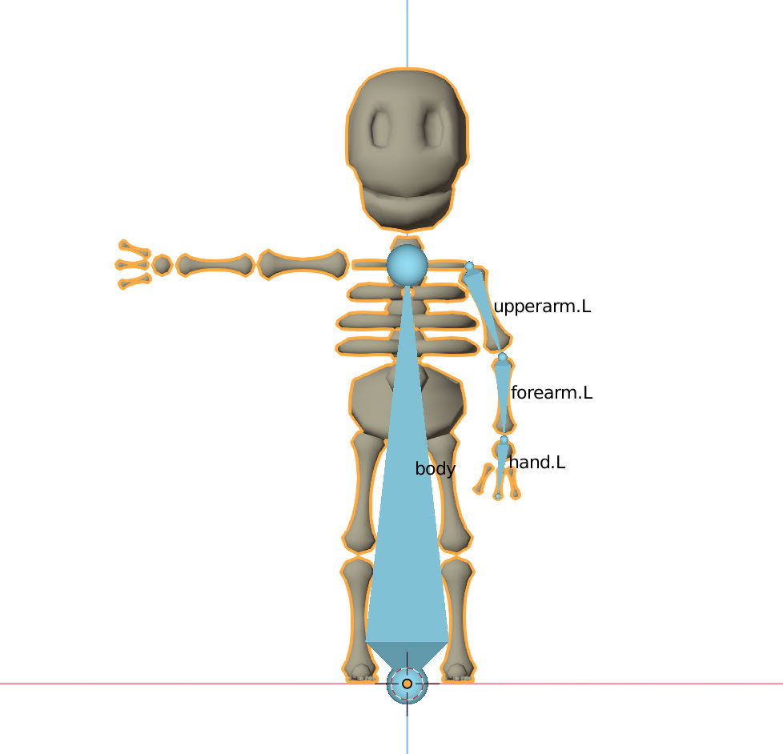

The skeleton model in Blender 3.6

Your Blender theme may have different colors.

603

Metal by Tutorials
Chapter 24: Character Animation

➤ Before examining the bones further, left-click on the skeleton’s head to select the 
skeleton object. Press the Tab key to switch to Edit Mode:

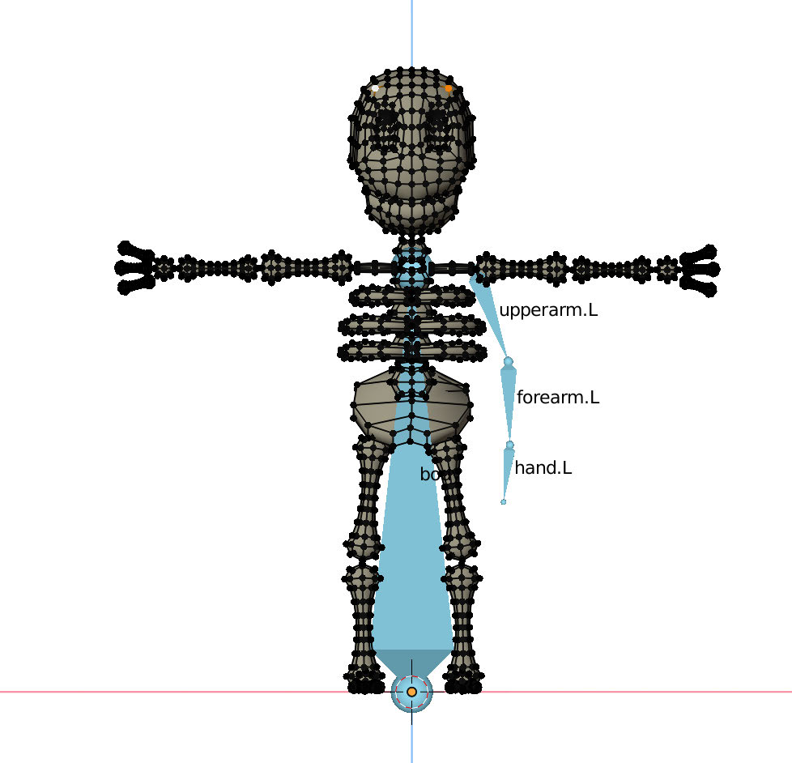

The skeleton mesh

Here, you can see all of the skeleton’s vertices as they were modeled. The skeleton 
has its arms stretched out in what’s known as the bind pose. Arms stretched out is a 
standard pose for figures as it makes it easier to add animation bones to the figure.

➤ Press the Tab key to go back to Object Mode.

Blender binds the vertices to the skeleton’s bones, with the arm down.

To animate the figure, you need to control groups of vertices. For example, to rotate 
the head, you’d rotate all of the head’s vertices.

Rigging a figure in Blender means creating an armature with a hierarchy of joints. 
Joints and bones are generally used synonymously, but a bone is simply a visual cue 
to see which joint affects which vertices.

The general process of creating a figure for animation goes like this:

1. Create the model.

2. Create an armature with a hierarchy of joints.

3. Apply the armature to the model with automatic weights.

4. Use weight painting to change which vertices go with each joint.

604

Metal by Tutorials
Chapter 24: Character Animation

Just as in the song Dem Bones, “The toe bone’s connected to the foot bone,” this is 
how a typical rigged figure’s joint hierarchy might look:

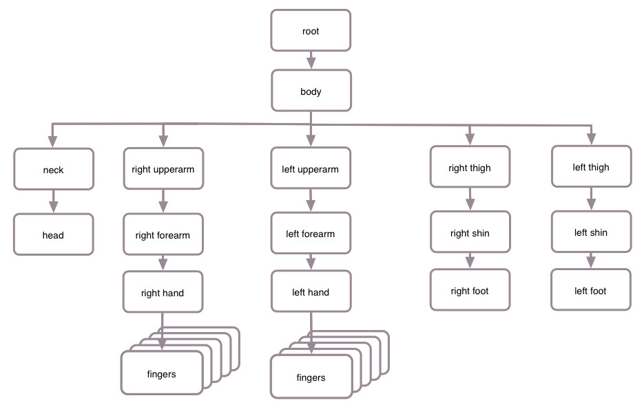

A joint hierarchy

In character animation, it’s (usually) all about rotation — your bones don’t translate 
unless you have some kind of disjointing skeleton. With this hierarchy of joints, 
when you rotate one joint, all the child joints follow. Try bending your elbow without 
moving your wrist. Because your wrist is lower in the hierarchy, even though you 
haven’t actively changed the wrist’s position and rotation, it still follows the 
movement of your elbow. This type of movement is known as forward kinematics 
and is what you’ll be using in this chapter. It’s a fancy name for making all child 
joints follow.

Note: Inverse kinematics allows the animator to make actions, such as walk 
cycles, more easily. Place your hand on a table or in a fixed position. Now, 
rotate your elbow and shoulder joint with your hand fixed. The hierarchical 
chain no longer moves your hand as in forward kinematics. As opposed to 
forward kinematics, the mathematics of inverse kinematics is quite 
complicated.

605

Metal by Tutorials
Chapter 24: Character Animation

The skeleton model that you’re looking at in Blender has a limited rig for simplicity. 
It has four bones: the body, left upper arm, left forearm and left hand. Each of these 
joints controls a group of vertices.

Weight Painting in Blender

➤ Left-click the skeleton’s head.

➤ At the bottom of the Blender window, click on the drop-down that currently reads 
Object Mode, and change it to Weight Paint.

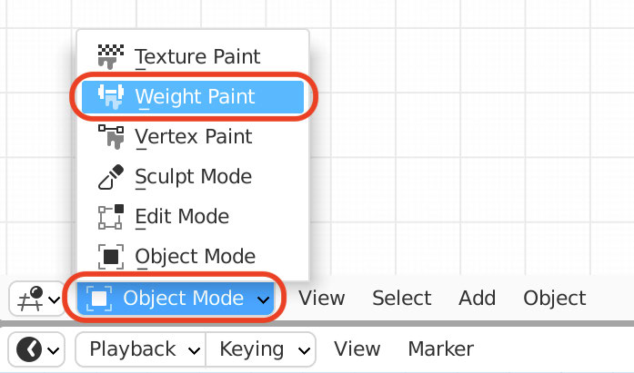

Weight Paint Dropdown

The weight painting editor shows you how each bone affects the vertices. Currently 
the body vertex group is selected, which is attached to the body bone. All vertices 
affected by the body bone are shown in red. The arm mesh has its own bones and are 
shown here in blue.

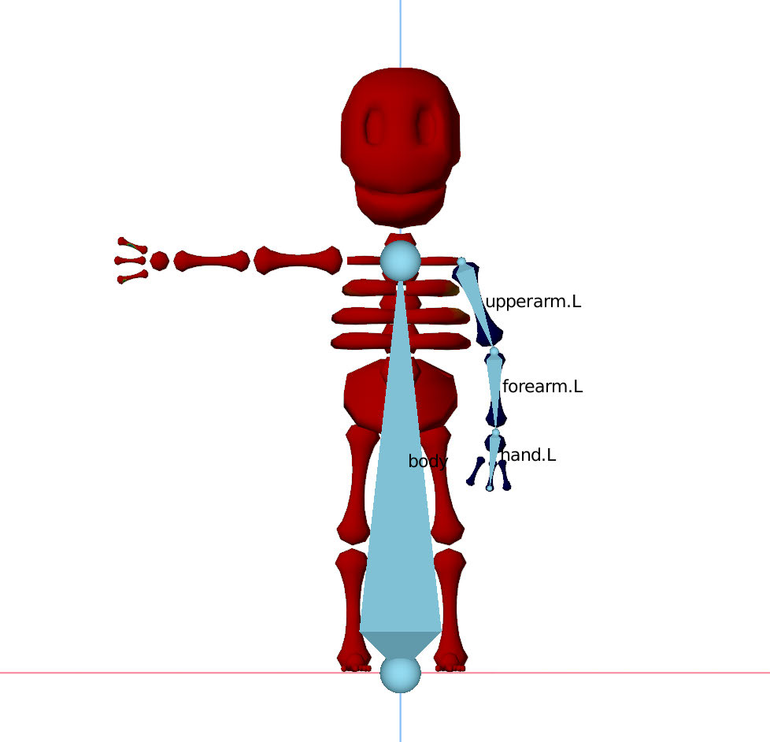

The skeleton's body bone weights

606

Metal by Tutorials
Chapter 24: Character Animation

The process of weight painting and binding each bone to the vertices is called 
skinning. Unlike human arms, the skeleton’s arm bones here have space between 
them, so, in this case, the arm mesh is assigned to only one bone. However, if you’re 
rigging a human arm, you would typically weight the vertices to multiple bones.

Here’s a typically weighted arm with the forearm selected to show gradual blending 
of weights at the elbow and the wrist.

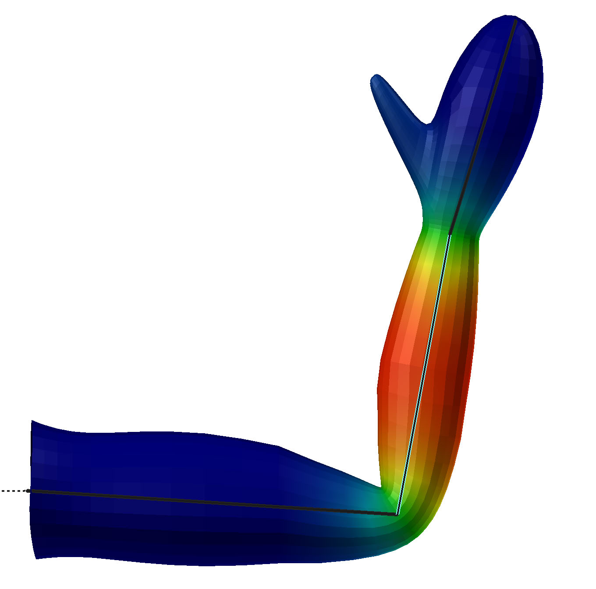

A weighted arm

This is a side-by-side example of blended and non-blended weights at the elbow 
joint with the forearm selected:

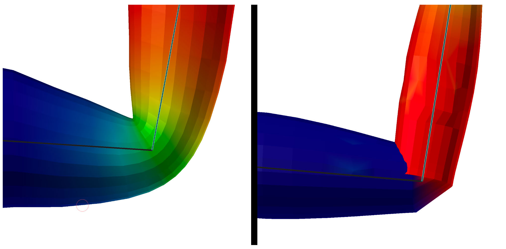

Blended and non-blended weights

The blue area indicates no weighting, whereas the red area indicates total weighting. 
You can see in the right image, the forearm vertices dig uncomfortably into the 
upper arm vertices, but in the left image, the vertices move more evenly around the 
elbow joint.

At the elbow, where the vertices are green, the vertex weighting would be 50% to the 
upper arm, and 50% to the forearm. When the forearm rotates, the green vertices will 
rotate at 50% of the forearm’s rotation. By blending the weights gradually, you can 
achieve an even deformation of vertices over the joint.

607

Metal by Tutorials
Chapter 24: Character Animation

Animation in Blender

➤ Select the drop-down at the bottom of the window that currently reads Weight 
Paint, and go back into Object Mode.

➤ Press the space bar to start an animation.

Your skeleton will now get friendly and wave at you. This wave animation is a 60 
frame looping animation clip.

➤ At the top of Blender’s window, click the Animation tab to show the Animation 
workspace.

You can now see the animation keys at the top left in the Dope Sheet. The dope 
sheet is a summary of the keyframes in the scene. It lists the joints on the left, and 
each circle in the dope sheet means there’s a keyframe at that frame.

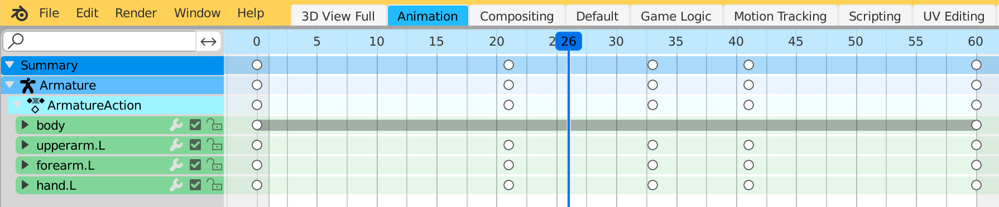

The dope sheet

Note: Although animated transformations are generally rotations, the 
keyframe can be a translation or a scale. You can click the arrow on the left of 
the joint name to see the specific channel the key is set on.

➤ Press space bar to stop the animation if it’s still going. Scrub through the 
animation by dragging the playhead at the top of the pane (the blue rectangle with 
26 in it in the above image). Pause the playhead at each set of keyframes. Notice the 
position of the arm. At each keyframe, the arm is in an extreme position. Blender 
interpolates all the frames between the extremes.

Now that you’ve had a whirlwind tour of how to create a rigged figure and animate it 
in Blender, you’ll move on to learning how to render it in your rendering engine.

608

Metal by Tutorials
Chapter 24: Character Animation

Note: You’ve only skimmed the surface of creating animated models. If you’re 
interested in creating your own, you’ll find some additional resources in 
references.markdown.

The Starter App

➤ In Xcode, open the starter project and build and run the app.

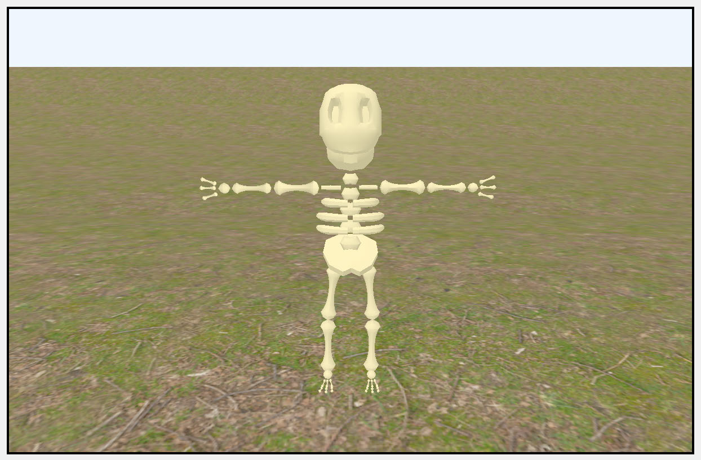

As well as the ground, you see a skeleton model called Skelly in .usdz format. The 
file contains an animation, but Skelly won’t wave until you’ve implemented the 
chapter code.

Implementing Skeletal Animation

Importing a skeletal animation into your app is a bit more difficult than importing a 
simple USD file with transform animation, because you have to deal with the joint 
hierarchy and joint weighting. You’ll read in the data from the USD file and 
restructure it to fit your rendering code.

609

Metal by Tutorials
Chapter 24: Character Animation

This is how the objects will fit together in your app:

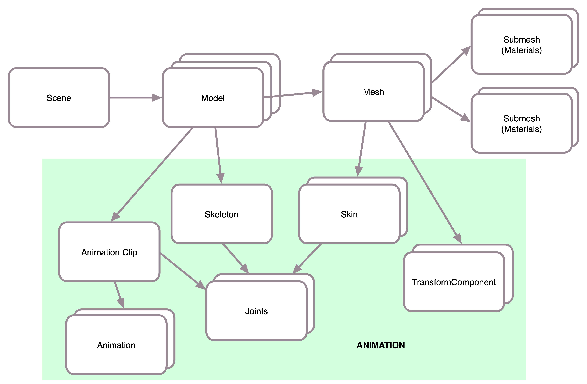

The code architecture

Each model could have a number of animation clips, such as walk and wave. Each 
animation clip has a list of animations for a particular joint. Each animated model 
will have a Skeleton that establishes a joint hierarchy and holds a list of the joint 
names. Each Mesh will have a Skin that maps the mesh to the skeleton’s joints.

For each frame, you’ll use the animation data to calculate the position of each 
skinned mesh and work out the skeleton’s pose.

Note: It is possible for models to have more than one skeleton, but for 
simplicity, you’ll only hold one skeleton per model.

610

Metal by Tutorials
Chapter 24: Character Animation

The Skeleton Map

A Skeleton will hold the joint names in a String array. You’ll convert the skeleton’s 
hierarchy of joints to an array of parent indices.

In the following example, forearm.L is in position 2 in its array. Indexing at position 
2 in the parent index array returns 1. The joint in position 1 is the forearm’s parent 
upperarm.L.

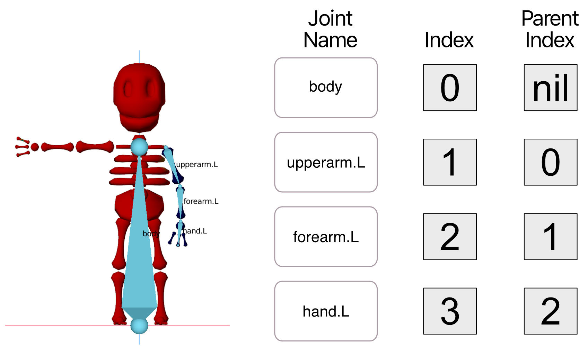

The skeleton map

Skin Data

Each mesh will contain joint paths which bind the mesh to the skeleton. This is 
called skinning. On loading the mesh, you’ll load these joint paths in a Skin 
structure and map them to the skeleton’s joint paths.

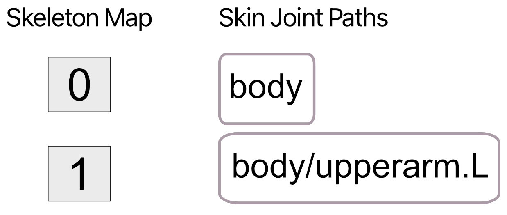

Skin to skeleton map

611

Metal by Tutorials
Chapter 24: Character Animation

The Skelly model in your app is a single mesh which contains all joint paths. 
However, when you load Apple’s sample models at the end of the chapter, you may 
find forty meshes each with different joint path mappings.

The starter project has several helper files in the Animation group to aid with 
importing the skeleton and animation.

• AnimationClip.swift: In the previous chapter, you created Animation for 
rotations and translations, with methods to retrieve the key values at a given time. 
AnimationClip is a collection of Animations. You initialize AnimationClip with 
the animation held in the asset. You iterate through the joints and load up 
Animations for each joint. Model will hold a dictionary of AnimationClips keyed 
on the animation’s name.

• Skeleton.swift: Skeleton.init?(mdlSkeleton:) loads joint paths, parent 
indices, and bind transforms. You’ll calculate the current pose for each frame later.

• Skin.swift: Skin.init?(animationBindComponent:) loads joint paths and a skin 
to skeleton map. The initializer also initializes an MTLBuffer to hold the joint 
poses that you’ll calculate later in the chapter.

Initializing Data

You’ll start by loading in the skeleton, the skinning data and lastly, the animations.

Loading the Skeleton

➤ In the Geometry group, open Model.swift, and add two new properties to Model:

var skeleton: Skeleton? 
var animationClips: [String: AnimationClip] = [:]

If the asset is an animated character, you’ll store the skeleton and the animations.

➤ In Model, create a new method to load the skeleton:

func loadSkeleton(asset: MDLAsset) { 
  let skeletons = 
    asset.childObjects(of: MDLSkeleton.self) as? 
[MDLSkeleton] ?? [] 
  skeleton = Skeleton(mdlSkeleton: skeletons.first) 
}

You store the first skeleton in the asset.

612

Metal by Tutorials
Chapter 24: Character Animation

Loading the Skinning Data

Open Mesh.swift and add a new property to Mesh:

For each mesh you store optional skin to skeleton mapping data.

➤ Back in Model.swift, add a new method to Model to load the skinned mesh:

func loadSkins(mdlMeshes: [MDLMesh]) { 
  for index in 0..<mdlMeshes.count { 
    let animationBindComponent = 
        mdlMeshes[index].componentConforming(to: 
MDLComponent.self) 
        as? MDLAnimationBindComponent 
      guard let skeleton else { continue } 
      let skin = Skin( 
        animationBindComponent: animationBindComponent,  
        skeleton: skeleton) 
      meshes[index].skin = skin 
  } 
}

You iterate through the Model I/O imported meshes. An 
MDLAnimationBindComponent holds the skinning data to map the mesh to the 
skeleton. You initialize Skin, which stores the relevant information and then you 
store the skin data on the mesh.

Loading the Animation

➤ In Model, add a new method to load the animations from the asset:

func loadAnimations(asset: MDLAsset) { 
  let assetAnimations = asset.animations.objects.compactMap { 
    $0 as? MDLPackedJointAnimation 
  } 
  for assetAnimation in assetAnimations { 
    let animationClip = AnimationClip(animation: assetAnimation) 
    animationClips[assetAnimation.name] = animationClip 
  } 
}

Here, you extract all the MDLPackedJointAnimation objects from the asset and 
create AnimationClips. The animation clip will hold a dictionary of Animations for 
each joint path.

613

Metal by Tutorials
Chapter 24: Character Animation

Each Animation will hold the translations and rotations along with the key times. 
Model.animationClips is a dictionary of animation clips keyed by animation name.

➤ At the end of init(name:), call your new methods.

// load animated characters 
loadSkeleton(asset: asset) 
loadSkins(mdlMeshes: mdlMeshes) 
loadAnimations(asset: asset)

Initialization is now complete.

➤ After the previous code, temporarily add this:

animationClips.forEach { 
  print("Animations:", $0.key) 
} 
print(skeleton?.jointPaths)

➤ Build and run the app.

In the debug console, you’ll see a list of the available animations and a list of Skelly’s 
joints:

Animations: /skeleton/Animations/Wave 
Optional(["/body", "/body/upperarm_L", "/body/upperarm_L/
forearm_L", "/body/upperarm_L/forearm_L/hand_L"]) 
nil

The joints correspond to the bones that that you previously saw in Blender. The nil 
at the end is from the ground model which isn’t animated and doesn’t have a 
skeleton.

➤ Remove the previous code that prints out the animations and skeleton.

The Math of Striking a Pose

To update the skeleton’s pose every frame, you’ll create a method that takes the 
animation clip and iterates through the joints to update each joint’s position for the 
frame.

614

Metal by Tutorials
Chapter 24: Character Animation

Each joint will have its own transforms which you’ll hold in an array called the joint 
matrix palette.

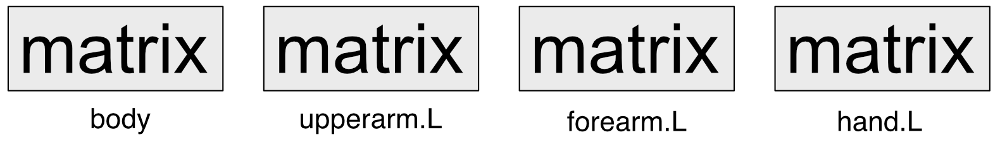

You’ll pass the matrix palette to the vertex shader to include with the other matrices 
that calculate the position of each vertex.

You’ll also pass extra vertex data to the shader, loaded from the model asset. Each 
vertex will have up to four joint indices which index into the matrix palette. The 
vertex data includes up to four weights which inform the shader of the influence of 
each joint.

This is how you’ll tackle the joint pose calculation:

1. Load the transforms from the animation clip for the current frame time. You’ll 
set up a local transform matrix for each joint in local joint space.

2. Traverse through the array of joints to combine the local transform matrix with 
its parent’s transform matrix.

3. The bind pose matrix holds the joint in world space. Taking the inverse of this 
completes the joint matrix palette calculations.

4. Update the joint matrix palette buffer for each skinned mesh.

You’ll then send the extra vertex data to the shader. In the shader, you’ll perform the 
matrix math using the matrix palette.

This is the pose for the first frame that you’ll finally achieve:

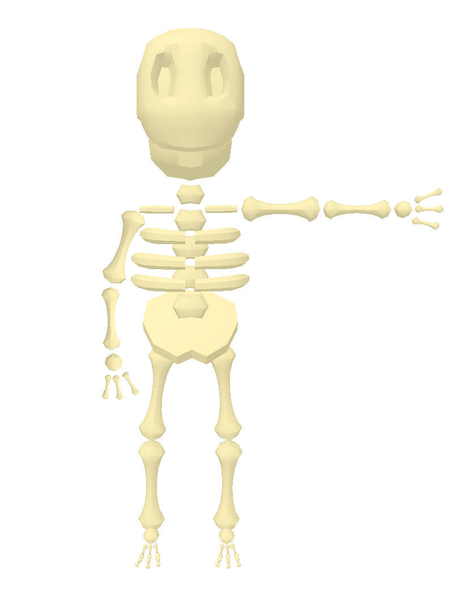

615

Metal by Tutorials
Chapter 24: Character Animation

1. Load Animation Transform Data

First set up a method to extract the current frame animation.

➤ In the Animation group, open AnimationClip.swift, and add a new method to 
AnimationClip:

func getPose(at time: Float, jointPath: String) -> float4x4? { 
  guard let jointAnimation = jointAnimation[jointPath], 
    let jointAnimation = jointAnimation 
    else { return nil } 
  let rotation = 
  jointAnimation.getRotation(at: time) ?? simd_quatf(.identity) 
  let translation = 
    jointAnimation.getTranslation(at: time) ?? float3(repeating: 
0) 
  let pose = float4x4(translation: translation) * 
float4x4(rotation) 
  return pose 
}

Here, you retrieve the interpolated transformation, made up of rotation and 
translation, for a given joint at a given time. You then create a transformation matrix 
for the joint and return it as the pose. This is much the same code as you used in the 
previous chapter for retrieving a transform at a particular time.

Now you’ll create the method that does all the math.

➤ In the Animation group, open Skeleton.swift, and add a new method to 
Skeleton:

func updatePose( 
  at currentTime: Float, 
  animationClip: AnimationClip) { 
  // 1 
  let time = fmod(currentTime, animationClip.duration) 
  // 2 
  var localPose = [float4x4]( 
    repeating: .identity,  
    count: jointPaths.count) 
  // 3 
  for index in 0..<jointPaths.count { 
    let pose = animationClip.getPose( 
      at: time * animationClip.speed, 
      jointPath: jointPaths[index]) 
    ?? restTransforms[index] 
    localPose[index] = pose 
  } 
}

616

Metal by Tutorials
Chapter 24: Character Animation

Going through this code:

1. Calculate the animation’s current frame time by getting the floating point 
remainder of the current time divided by the animation duration. The animation 
will loop.

2. Initialize a matrix to hold all the skeleton’s joint transforms.

3. For each joint, retrieve the transform at the current time.

2. Calculate the World Pose

In the following image, the forearm swings by 45º. All the other joint rotations are 
0º. However, the rotation of the forearm affects the position (but not the rotation) of 
the hand.

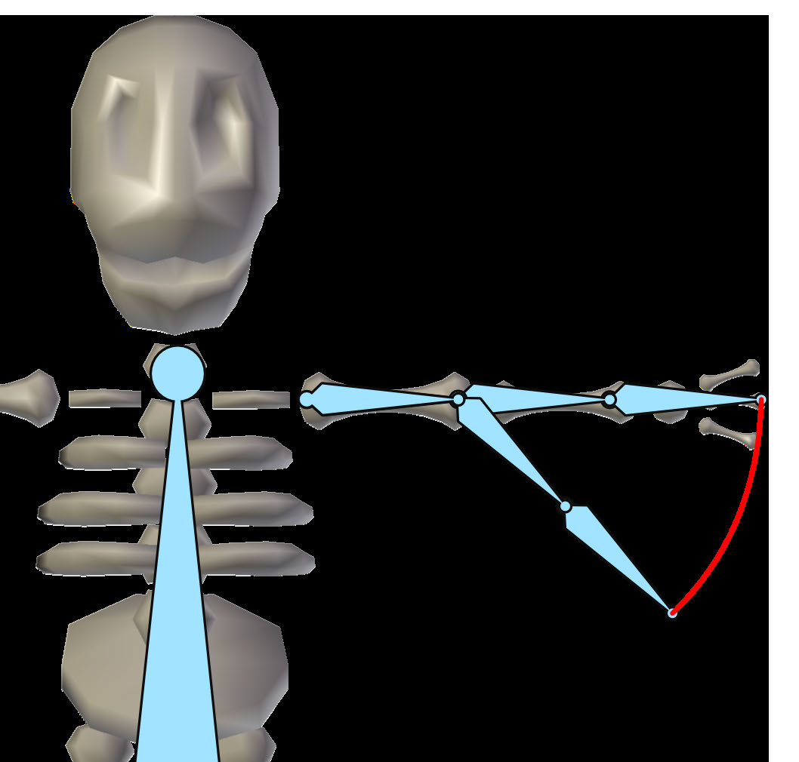

You’ll iterate through the skeleton’s parent indices and multiply each parent’s local 
pose with its child’s local pose to transform the pose from joint space into its parent 
joint space.

➤ Continue by adding this to the end of updatePose(at:animationClip:):

var worldPose: [float4x4] = [] 
for index in 0..<parentIndices.count { 
  let parentIndex = parentIndices[index] 
  let localMatrix = localPose[index] 
  if let parentIndex { 
    worldPose.append(worldPose[parentIndex] * localMatrix) 
  } else { 
    worldPose.append(localMatrix) 
  } 
}

617

Metal by Tutorials
Chapter 24: Character Animation

You iterate through the joint hierarchy to include the parent’s transforms on each 
joint.

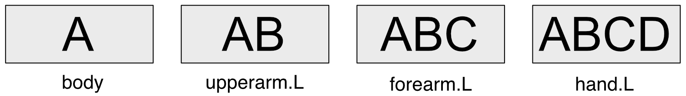

Array of transforms

3. The Inverse Bind Matrix

➤ Examine the properties held on Skeleton.

When you first instantiate the skeleton, you load these properties from the data 
loaded by Model I/O. One of the properties on Skeleton is  bindTransforms. This is 
an array of matrices, one element for each joint, that transforms vertices from their 
place in world space to the origin.

When all the joint transforms are set to identity, that’s when you’ll get the bind pose. 
If you apply the bind matrix to a joint, it will move to the origin. The following image 
shows the skeleton’s joints, in the bind pose, all multiplied by the bind transform 
matrix.

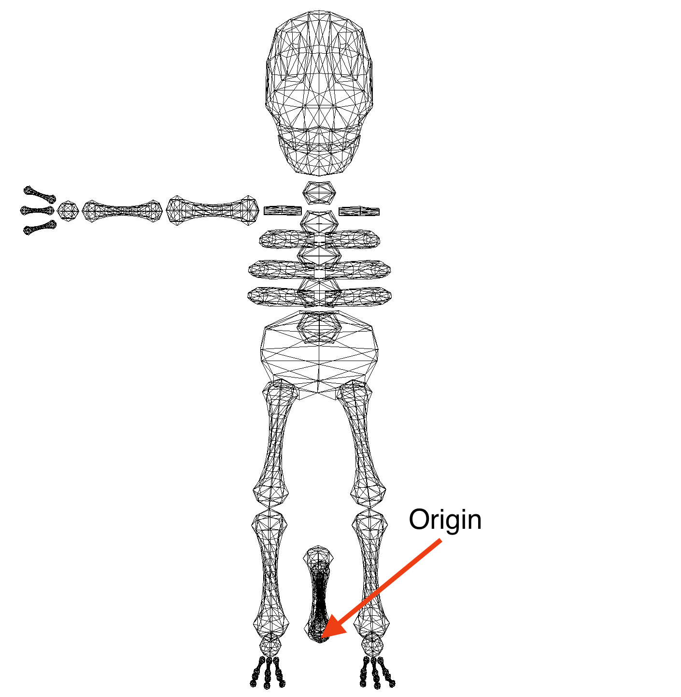

Bind matrix applied

Why is this useful? Rotation takes place around the origin.

618

Metal by Tutorials
Chapter 24: Character Animation

To return the joint back to its original bind pose, you multiply each of the joint 
matrices by the inverse of the bind pose.

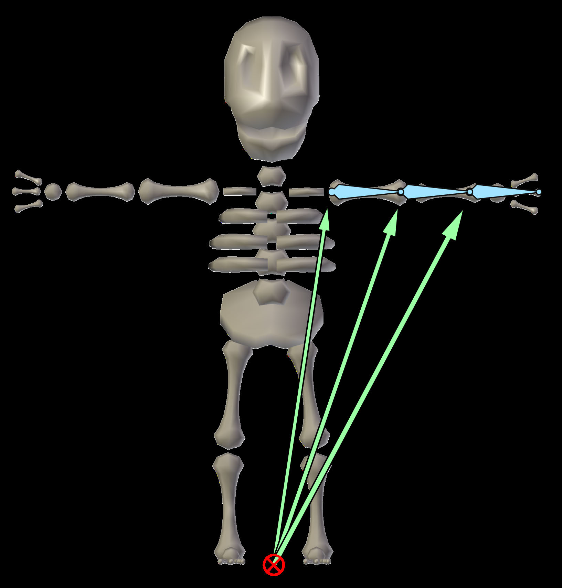

Inverse bind pose

Note: Review Chapter 5, “3D Transformations” if you’re unsure of this 
rotation sequence.

➤ Add the following code to the end of updatePose(at:animationClip:):

for index in 0..<worldPose.count { 
  worldPose[index] *= bindTransforms[index].inverse 
} 
currentPose = worldPose

You iterate through the array of matrices and combine the pose with the inverse bind 
transform.

➤ Open Model.swift and add this to update(deltaTime:) after setting 
currentTime at the top of the method:

if let skeleton, 
   let animation = animationClips.first { 
  let animationClip = animation.value 
  skeleton.updatePose( 
    at: currentTime, 
    animationClip: animationClip) 
}

619

Metal by Tutorials
Chapter 24: Character Animation

With that done, you have completed calculating the skeleton’s current pose for the 
frame.

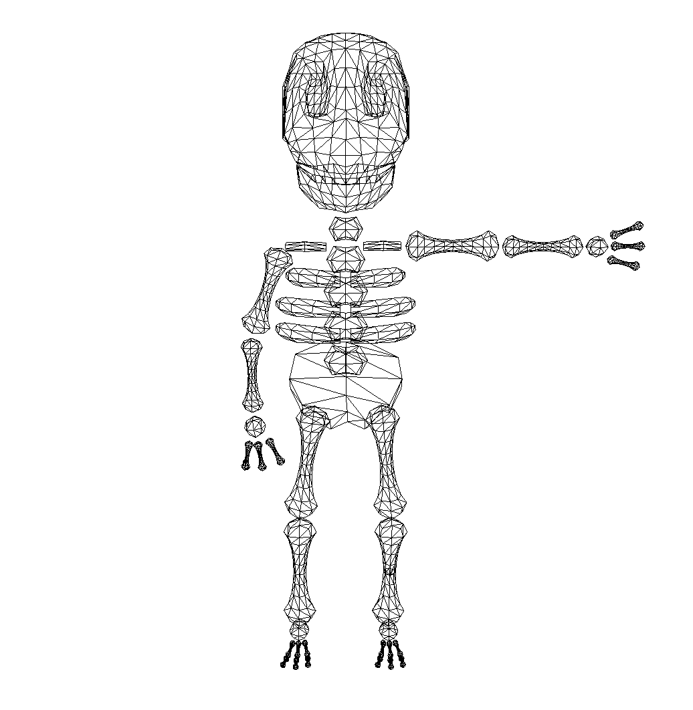

The final pose

Note: Currently USDZ files only hold one animation. With Blender not yet 
exporting skeletal animation as of version 3.6, it’s difficult to get multiple 
animations into one USD file without hand editing a .usda file. Apple suggests, 
with some judicious coding, you could load multiple USDZ files, one with the 
geometry and skeleton, and others with solely the animation. As time goes on, 
and Blender improves, there will likely be better alternatives.

4. Update the Joint Matrix Palette Buffer

➤ Open Skin.swift and examine the struct.

The initialization creates an MTLBuffer ready to hold the matrix for the joints. Skin 
holds only those joint paths for the current Mesh, so you create a skin-to-skeleton 
map to retrieve the correct pose from the skeleton’s array of joint matrices.

➤ Add the following method to Skin:

func updatePalette(skeleton: Skeleton?) { 
  guard let skeletonPose = skeleton?.currentPose 
    else { return } 
  var palettePointer = 
jointMatrixPaletteBuffer.contents().bindMemory( 
    to: float4x4.self, 
    capacity: jointPaths.count) 
  for index in 0..<jointPaths.count {

620

Metal by Tutorials
Chapter 24: Character Animation

let skinIndex = skinToSkeletonMap[index] 
    palettePointer.pointee = skeletonPose[skinIndex] 
    palettePointer = palettePointer.advanced(by: 1) 
  } 
}

You initialize the buffer pointer and bind the contents of the buffer to an array of 4x4 
matrices. You then iterate through the joint paths, retrieving the joint’s pose from 
the skeleton’s array of joint matrices, and storing them into the Metal buffer.

➤ Open Model.swift, and in update(deltaTime:), replace the existing animation 
code:

for index in 0..<meshes.count { 
  meshes[index].transform?.getCurrentTransform(at: currentTime) 
}

➤ With:

for index in 0..<meshes.count { 
  var mesh = meshes[index] 
  mesh.transform?.getCurrentTransform(at: currentTime) 
  mesh.skin?.updatePalette(skeleton: skeleton) 
  meshes[index] = mesh 
}

On each frame for each mesh, you update the skin’s joint palette matrix

Joints and Weights Vertex Data

Each vertex is weighted to up to four joints. You saw this in the earlier elbow 
example, where some vertices belonging to the lower arm joint would get 50% of the 
upper arm joint’s rotation. Soon, you’ll change the default vertex descriptor to load 
vertex buffers with four joints and four weights for each vertex.

The vertex function will sample from the joint matrix palette, and, using the weights, 
will apply the transformation matrix to each vertex. The following image shows a 
vertex that is assigned 50% to joint 2 and 50% to joint 3.

621

Metal by Tutorials
Chapter 24: Character Animation

The other two joint indices are unused.

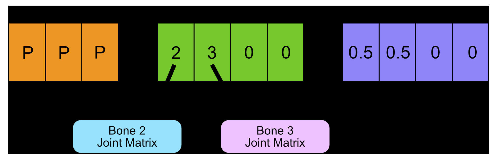

After multiplying the vertex by the projection, view and model matrices, the vertex 
function will multiply the vertex by a weighting of each of the joint transforms. 
Using the example in the image above, the weighting will be 50% of Bone 2’s joint 
matrix and 50% of Bone 3’s joint matrix.

Transfer the Data to the GPU

All of the meshes are now in position and ready to render.

➤ Open Rendering.swift in the Game group, and in 
render(encoder:uniforms:params:), at the top of the loop for mesh in meshes, 
add this:

if let paletteBuffer = mesh.skin?.jointMatrixPaletteBuffer { 
  encoder.setVertexBuffer( 
    paletteBuffer, 
    offset: 0, 
    index: JointBuffer.index) 
}

You set up the joint matrix palette buffer so that the GPU can read it. The vertex 
shader function will apply the matrices in the palette to the vertices.

➤ In the Shaders group, open ShaderDefs.h, and add two attributes to VertexIn:

ushort4 joints [[attribute(Joints)]]; 
float4 weights [[attribute(Weights)]];

The attribute constants Joints and Weights were set up for you in the starter 
project in Common.h in Attributes.

622

Metal by Tutorials
Chapter 24: Character Animation

To match VertexIn, you’ll need to update Model’s vertex descriptor.

➤ Open VertexDescriptor.swift, and uncomment the two extra vertex attributes for 
joints and weights. Model I/O, when loading the file, will now load joint index and 
joint weight information to the model’s vertex buffers.

Your vertex buffer layout will now look like this:

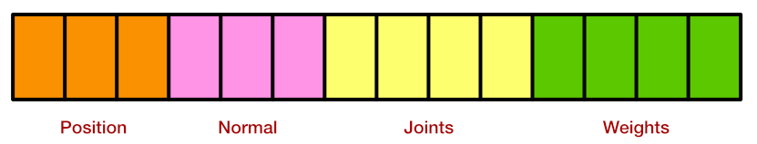

Vertex Buffer 0

➤ Build and run the app to ensure that everything still works:

No obvious changes yet

There are no obvious changes, but with a little bit of matrix multiplication, Skelly 
will be waving soon.

Updating the Vertex Shader

➤ In the Shaders group, open Vertex.metal, and add a new parameter to 
vertex_main:

623

Metal by Tutorials
Chapter 24: Character Animation

➤ Replace the entire contents of vertex_main with:

bool hasSkeleton = true; 
float4 position = in.position; 
float4 normal = float4(in.normal, 0);

Some models will have skeletons and joint matrices, but others, such as the ground 
plane won’t. You’ll have to set up a conditional to determine which type of model 
you are rendering. For the moment you assume that all models have a joint matrix 
palette.

➤ After the code you just added, add the following code to combine the joint matrix 
and weight data with the position and normal:

if (hasSkeleton) { 
  float4 weights = in.weights; 
  ushort4 joints = in.joints; 
  position = 
      weights.x * (jointMatrices[joints.x] * position) + 
      weights.y * (jointMatrices[joints.y] * position) + 
      weights.z * (jointMatrices[joints.z] * position) + 
      weights.w * (jointMatrices[joints.w] * position); 
  normal = 
      weights.x * (jointMatrices[joints.x] * normal) + 
      weights.y * (jointMatrices[joints.y] * normal) + 
      weights.z * (jointMatrices[joints.z] * normal) + 
      weights.w * (jointMatrices[joints.w] * normal); 
}

You take each joint to which the vertex is bound, calculate the final position and 
normal, and then take the weighted part of that calculation.

If the function constant hasSkeleton is false, you’ll just use the original position 
and normal.

➤ Add the VertexOut out assignment:

float4 worldPosition = uniforms.modelMatrix * position; 
VertexOut out { 
  .position = uniforms.projectionMatrix * uniforms.viewMatrix 
                * uniforms.modelMatrix * position, 
  .uv = in.uv, 
  .worldPosition = worldPosition.xyz / worldPosition.w, 
  .worldNormal = uniforms.normalMatrix * normal.xyz, 
  .worldTangent = 0, 
  .worldBitangent = 0 
}; 
return out;

624

Metal by Tutorials
Chapter 24: Character Animation

You use position and normal instead of in.position and in.normal. You should 
also pre-multiply the tangent and bitangent properties in the same way as normal, 
but for brevity, you set worldTangent and worldBitangent properties to zero.

➤ Build and run the app, and Skelly will now wave at you.

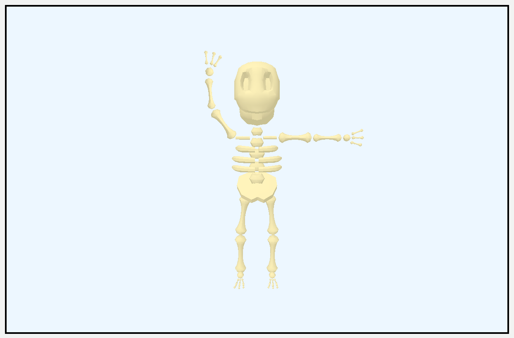

Skelly waving

The ground doesn’t render because vertex_main always multiplies position by 
weights, and the ground doesn’t have joints or weights. All the ground vertices are 
rendered at position (0, 0, 0).

Of course you’ll want to render the ground, so you’ll tell the GPU pipeline that it has 
to conditionally prepare two different vertex functions, depending on whether the 
mesh has a skeleton or not.

Note: You may get a run time error: failed assertion Draw Errors 
Validation Vertex Function(vertex_main): missing buffer binding 
at index 15 for jointMatrices[0], because you’re rendering the ground, 
which doesn’t have any joint matrices. In this case, open GameScene.swift, 
and in init(), temporarily change models = [ground, skeleton] to models 
= [skeleton] to see Skelly waving.

625

Metal by Tutorials
Chapter 24: Character Animation

Function Specialization

Over the years there has been much discussion about how to render conditionally. 
For example, in your fragment shaders when rendering textures, you use the Metal 
Shading Language function is_null_texture(textureName) to determine whether 
to use the value from the material or a texture.

To test whether or not you have a joint matrix, you don’t have a convenient MSL 
function.

Should you create separate short fragment shaders for different conditionals? Or 
should you have one long “uber” shader with all of the possibilities listed 
conditionally? Function specialization deals with this problem, and allows you to 
create one shader that the compiler turns into separate shaders.

When you create the model’s pipeline state, you set the Metal functions in the Metal 
Shading library, and the compiler packages them up. At this stage, you can create 
properties, and assign them index numbers to deal with conditional states. You can 
then pass these properties to the Metal library when you create the shader functions. 
The compiler will examine the functions and generate specialized versions of them.

In the shader file, you reference the properties by their index numbers.

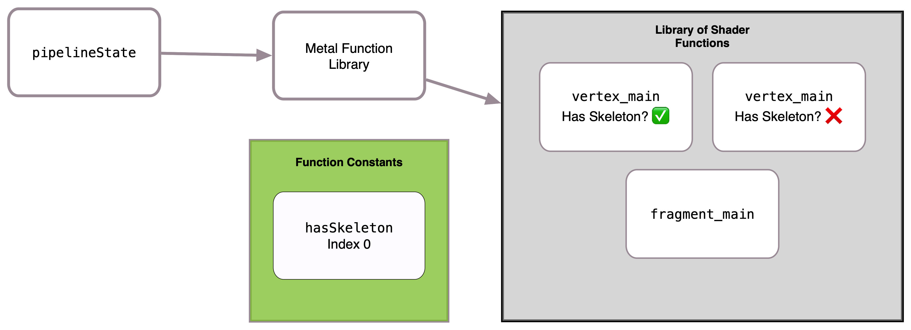

Function constants

➤ In the Render Passes group, open Pipelines.swift.

You’ll first create a set of function constant values that will indicate whether to 
render with animation.

626

Metal by Tutorials
Chapter 24: Character Animation

➤ Add this new method to PipelineStates:

static func makeFunctionConstants(hasSkeleton: Bool) 
  -> MTLFunctionConstantValues { 
  let functionConstants = MTLFunctionConstantValues() 
  var property = hasSkeleton 
  functionConstants.setConstantValue( 
    &property, 
    type: .bool, 
    index: 0) 
  return functionConstants 
}

MTLFunctionConstantValues is a set that contains a Boolean value depending on 
whether a skeleton exists. You defined a Boolean value here, but values can be any 
type specified by MTLDataType. On the GPU side, you’ll soon create a Boolean 
constant using the same index value. In functions that use these constants, you can 
conditionally perform tasks.

➤ Change the signature of createForwardPSO() to:

static func createForwardPSO(hasSkeleton: Bool = false) 
  -> MTLRenderPipelineState {

➤ At the top of createForwardPSO(hasSkeleton:), change the assignment to 
vertexFunction to:

let functionConstants = 
  makeFunctionConstants(hasSkeleton: hasSkeleton) 
let vertexFunction = try? Renderer.library?.makeFunction( 
  name: "vertex_main", 
  constantValues: functionConstants)

Here, you tell the compiler to create a library of functions using the function 
constants set. The compiler creates multiple shader functions and optimizes any 
conditionals in the functions.

Currently, you set the same standard pipeline state for all models in 
ForwardRenderPass. Generally, when you have any complexity, you’ll have to work 
out a system appropriate for your app to manage all your various pipeline states. You 
could use function specialization where possible, or create different vertex and 
fragment functions.

627

Metal by Tutorials
Chapter 24: Character Animation

In this app, the time when you know whether your model has a skeleton or not, is 
when you load Model.

➤ Open Model.swift, and add a new property to Model:

➤ Add the following code to the end of init(name:):

let hasSkeleton = skeleton != nil 
pipelineState = 
  PipelineStates.createForwardPSO(hasSkeleton: hasSkeleton)

When you load the model, you’ll create a pipeline state with the appropriate vertex 
function.

➤ Open Rendering.swift, and at the top of render(encoder:uniforms:params:), 
add this:

Each time you render a model, you’ll load the appropriate pipeline state object. As 
long as you do the creation of the pipeline states at the start of your app, they are 
lightweight to swap in and out.

Now for the GPU side!

➤ Open Vertex.metal, and add this code after the import statement:

The function constant index matches the constant you just created in the 
MTLFunctionConstantValues set.

➤ In the vertex_main header, change the jointMatrices parameter to:

constant float4x4 *jointMatrices [[ 
  buffer(JointBuffer), 
  function_constant(hasSkeleton)]]

628

Metal by Tutorials
Chapter 24: Character Animation

You’ll have two different vertex_mains in your Metal shader library, one for each 
condition of hasSkeleton. One vertex_main will have jointMatrices as a 
parameter, if hasSkeleton is true, and the other won’t have that parameter at all.

➤ In vertex_main, remove:

You use the pipeline constant in place of the local one.

Your animation may glitch because of synchronization issues. You’ll consider how to 
optimize your CPU / GPU synchronization in Chapter 31, “Performance 
Optimization”.

➤ For the moment, open Renderer.swift, and at the end of draw(scene:in:), add 
this:

The thread will be blocked until the command buffer has finished executing all its 
commands.

➤ Build and run the app, and you’ll see your full scene of waving Skelly and static 
ground.

629

Metal by Tutorials
Chapter 24: Character Animation

Key Points

• Character animation differs from transform animation. With transform animation, 
you deform the mesh directly. When animating characters, you use a skeleton with 
joints. The geometry mesh is attached to these joints and deforms when you rotate 
a joint.

• The skeleton consists of a hierarchy of joints. When you rotate one joint, all the 
child joints move appropriately.

• You attach the mesh to joints by weight painting in a 3D app. Up to four joints can 
influence each vertex (this is a limitation in your app, but generally weighting four 
joints is ample).

• Animation clips contain transformation data for keyframes. The app interpolates 
the transformations between keyframes.

• Each joint has a bind matrix, which, when applied, moves the joint to the origin.

• When your shaders have different requirements depending on different situations, 
you can use function specialization. You indicate the different requirements in the 
pipeline state, and the compiler creates multiple versions of the shader function.

Where to Go From Here?

This chapter took you through the basics of character animation. But don’t stop 
there! There are so many different topics that you can investigate. For instance, you 
can:

• Download and render the animated toy drummer and biplane from Apple’s AR 
Quick Look Gallery (https://developer.apple.com/augmented-reality/quick-look/).

• Download USDZ models from http://sketchfab.com and see what works and what

doesn’t. (Not all models will work, as not all rigging scenarios are taken care of in 
this chapter.)

• Learn how to animate your own characters in Blender and import them into your 
renderer. Start off with a simple robot arm, and work upward from there.

• Watch Disney and Pixar movies… call it research. No, seriously! Animation is a 
skill all of its own. Watch how people move; good animators can capture 
personality in a simple walk cycle.

630

25