# Managing 
Resources

So far, you’ve created an engine where you can load complex models with textures 
and materials, animate or update them per frame and render them. Your scenes will 
start to get more and more complicated as you develop your game, and you’ll want to 
find more performant ways of doing things and organizing your game resources.

Instead of processing each submesh and laboriously moving each of the submesh’s 
textures to the GPU, you’ll take advantage of the centralization of your textures in 
the Texture Controller. By the end of the chapter, you’ll be able to move all your 
textures to the GPU at once with just one render encoder command.

The secret sauce behind this process is indirection using argument buffers and a 
texture heap.

You’ll learn more about these shortly, but in brief, an argument buffer represents 
data that can match a shader structure. You can send the argument buffer to a shader 
function with one command, instead of sending each of the structure components 
individually.

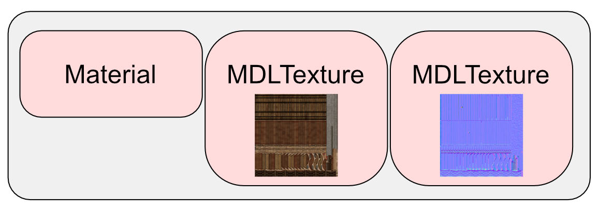

An argument buffer containing resources

631

Metal by Tutorials
Chapter 25: Managing Resources

A heap is exactly what it sounds like. You gather up your resources, such as textures 
and buffers, into an area of memory called a heap. You can then send this heap to the 
GPU with one command.

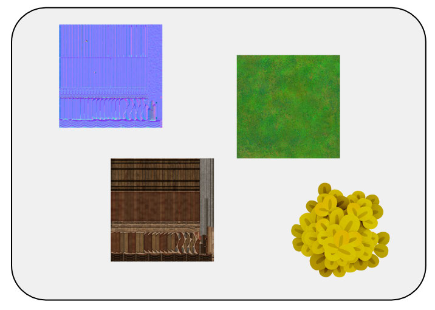

A heap containing textures

The Starter Project

With the basic idea under your belt, you can now get started.

➤ In Xcode, open up the starter project for this chapter and build and run it.

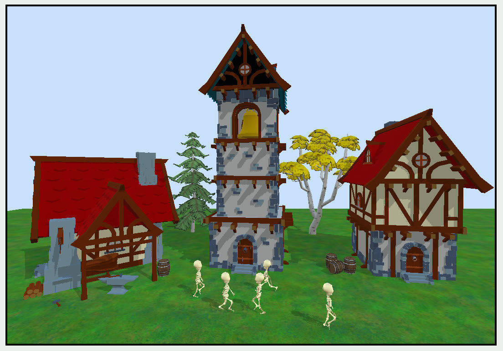

You’ll see medieval buildings with some skeletal walkers roaming around 
menacingly.

632

Metal by Tutorials
Chapter 25: Managing Resources

The project consolidates many of the features that you’ve learned so far:

• Shadows

• IBL Lighting with sky box

• Animation

• Alpha testing

• Textured models

• Models with materials but no textures

There are a couple of added nifty features.

Firstly, in the Textures group, in TextureController.swift, TextureController has 
an extra level of indirection. The old textures dictionary is now named 
textureIndex and it holds indices into an array of textures.

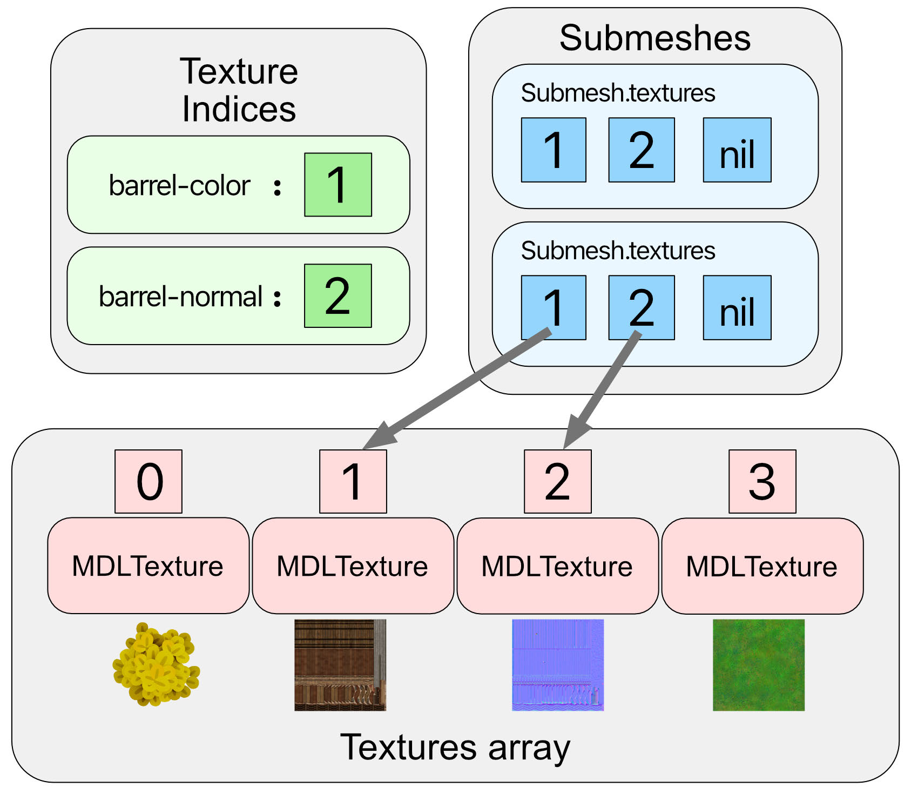

When you load a submesh texture using TextureController, if the texture doesn’t 
exist by name already, TextureController adds the texture to the textures array, 
stores the array index and name into textureIndices and returns the index to the 
submesh. If the texture already exists by name, then the submesh simply holds the 
existing array index to the texture.

633

Metal by Tutorials
Chapter 25: Managing Resources

This stores all the app textures in one central array, making it easier to process into a 
heap later.

Secondly, when setting up character joint animation, you used function constants 
when you defined the pipeline state for the vertex shader. This project also uses 
function constants for defining the shadow pipeline state.

In the Render Passes group, ShadowRenderPass and ForwardRenderPass sets a 
render pass state when rendering each model. The model then sets the correct mesh 
pipeline state depending on this render pass state, whether it is shadow or main.

Argument Buffers

When rendering a submesh, you currently send up to six textures and a material 
individually to the GPU for the fragment shader: Base color, normal, roughness, 
metalness, ambient occlusion and opacity textures. During the frame render loop, 
each of the textures incurs a renderEncoder.setFragmentTexture(texture:at:) 
command.

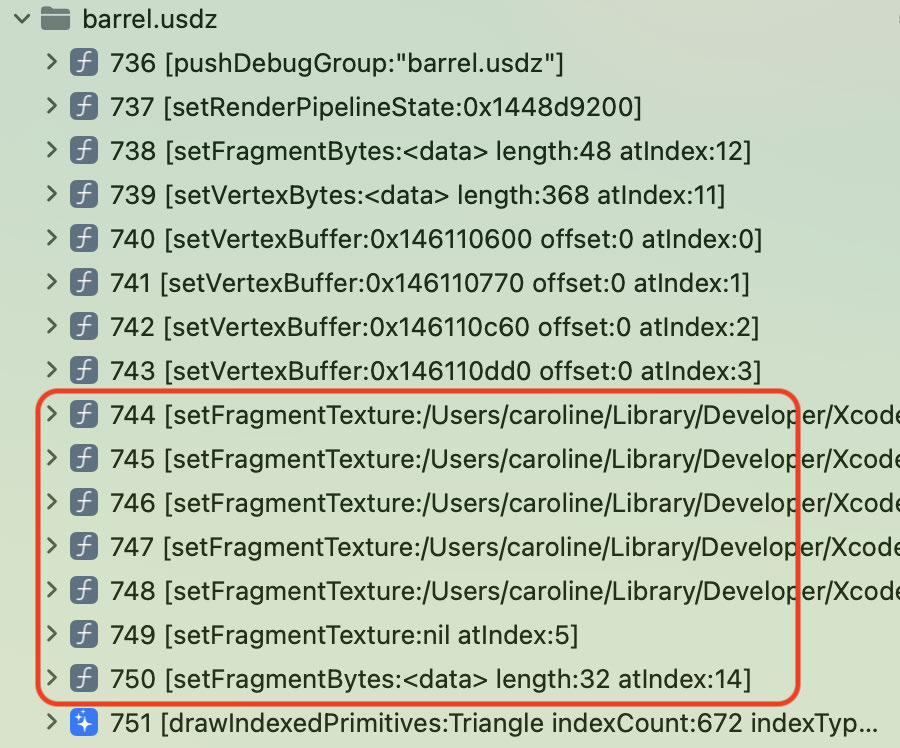

A barrel draw call

634

Metal by Tutorials
Chapter 25: Managing Resources

Using argument buffers, you can group these six textures into one buffer, and set 
this buffer on the render command encoder with just one command. This argument 
buffer doesn’t only have to point to textures, it can point to any other data necessary 
to render the frame.

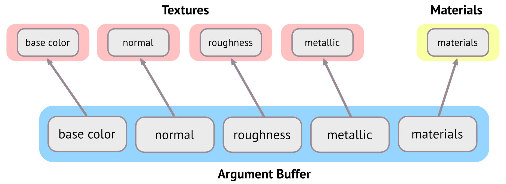

When you come to draw call time, instead of setting the textures on the render 
command encoder, you set the single argument buffer. You then perform 
renderEncoder.useResource(_:usage:) for each texture so that you can access all 
six textures on the GPU as reusable indirect resources.

Once you set up an argument buffer, you can refer to it in a shader, using one 
structure that matches the buffer data as a parameter to the shader function.

Creating the Shader Structure

➤ In the Shaders group, open FragmentIBL.metal.

The fragment_IBL function has six parameters for material textures and one for the 
Material. You’re going to combine all of these into one structure, and use the 
structure as the parameter.

➤ Create a new Header file in the Shaders group named Material.h.

➤ Before #endif, create a new structure:

struct ShaderMaterial { 
  texture2d<float> baseColorTexture; 
  texture2d<float> normalTexture; 
  texture2d<float> roughnessTexture; 
  texture2d<float> metallicTexture; 
  texture2d<float> aoTexture; 
  texture2d<float> opacityTexture; 
  Material material; 
};

635

Metal by Tutorials
Chapter 25: Managing Resources

Each argument buffer structure element has an implicit ID. For example, 
baseColorTexture has an implicit ID of 0. If you want to use an out of order ID 
index, you can assign an explicit ID with an attribute, for example: 
[[id(BaseColor)]].

Soon, you’ll create an argument buffer that matches these IDs. You’ll pass in 
material as a constant value. If you were to create an MTLBuffer containing 
material, you can define it in ShaderMaterial as: constant Material 
&material;.

➤ Open FragmentIBL.metal, and add this with the other file imports:

➤ Change the signature for fragment_IBL to:

fragment float4 fragment_IBL( 
  VertexOut in [[stage_in]], 
  constant Params &params [[buffer(ParamsBuffer)]], 
  constant Light *lights [[buffer(LightBuffer)]], 
  constant ShaderMaterial &shaderMaterial 
[[buffer(MaterialBuffer)]], 
  depth2d<float> shadowTexture [[texture(ShadowTexture)]], 
  texturecube<float> skybox [[texture(SkyboxTexture)]], 
  texturecube<float> skyboxDiffuse 
[[texture(SkyboxDiffuseTexture)]], 
  texture2d<float> brdfLut [[texture(BRDFLutTexture)]])

Instead of receiving the textures directly, fragment_IBL will receive just one 
structure containing all the textures and material needed for the model.

➤ Replace:

➤ With:

Material material = shaderMaterial.material; 
texture2d<float> baseColorTexture = 
shaderMaterial.baseColorTexture; 
texture2d<float> normalTexture = shaderMaterial.normalTexture; 
texture2d<float> metallicTexture = 
shaderMaterial.metallicTexture; 
texture2d<float> roughnessTexture = 
shaderMaterial.roughnessTexture; 
texture2d<float> aoTexture = shaderMaterial.aoTexture; 
texture2d<float> opacityTexture = shaderMaterial.opacityTexture;

636

Metal by Tutorials
Chapter 25: Managing Resources

You remove all the compile errors with these assignments.

For the moment you’ve finished setting up the GPU shader.

Creating the Argument Buffer

To pass these textures, you create an argument buffer that matches the shader 
structure.

➤ In the Geometry group, open Submesh.swift, and add the new argument buffer 
property to Submesh:

materialsBuffer will contain pointers to the textures and the material.

➤ Create a new method in Submesh:

mutating func initializeMaterials() { 
  guard let fragment = 
    Renderer.library.makeFunction(name: "fragment_IBL") else { 
      fatalError("Fragment function does not exist") 
    } 
  let materialEncoder = fragment.makeArgumentEncoder( 
    bufferIndex: MaterialBuffer.index) 
  materialsBuffer = Renderer.device.makeBuffer( 
    length: materialEncoder.encodedLength, 
    options: []) 
}

You create an argument encoder from an existing fragment function. 
MTLFunction.makeArgumentEncoder(bufferIndex:) looks at the given buffer 
index and identifies the structure that the fragment function requires. In this case, 
the fragment_IBL function requires ShaderMaterial at index 
MaterialBuffer.index (14). The encoder can work out how many elements there 
are in the structure, and therefore what size materialsBuffer should be.

➤ Add this code to the end of initializeMaterials():

// 1 
materialEncoder.setArgumentBuffer(materialsBuffer, offset: 0) 
// 2 
let range = Range(BaseColor.index...OpacityTexture.index) 
materialEncoder.setTextures(allTextures, range: range) 
// 3 
let index = OpacityTexture.index + 1 
let address = materialEncoder.constantData(at: index)

637

Metal by Tutorials
Chapter 25: Managing Resources

address.copyMemory( 
  from: &material, 
  byteCount: MemoryLayout<Material>.stride)

Going through this code:

1. The encoder will write the argument data into materialsBuffer.

2. The encoder sets all the submesh textures into the argument buffer. Each texture 
and buffer you set into the argument buffer should have its own unique index 
that matches the implicit or explicit ID in the shader file.

3. To set the constant material, you first identify the address in the argument 
buffer. You then copy material to that address in the buffer. If you were using a 
material MTLBuffer, you could use 
MTLArgumentEncoder.setBuffer(_:offset:index:) instead.

During the render loop, setting textures and buffers on the render command encoder 
incurs some internal verification. This verifying process will now take place during 
initialization here, when the textures and buffers are initially set into the argument 
buffer. Anything you can move outside of the render loop is a gain.

➤ Add the following code to the end of init(mdlSubmesh:mtkSubmesh:):

There’s one other method where you can change textures.

➤ Open Model.swift and add this at the end of setTexture(name:type:):

You call setTexture(name:type:) when you set the texture on the ground plane 
primitive.

You’ve now set up your argument buffer. Instead of setting the textures and material 
to the fragment shader during the render loop, you’ll be able to set the single 
argument buffer.

638

Metal by Tutorials
Chapter 25: Managing Resources

Updating the Draw Call

➤ In the Game group, open Rendering.swift.

➤ In render(encoder:uniforms:params:renderState:), in the for submesh in 
mesh.submeshes loop, locate  updateFragmentMaterials(encoder:submesh:).

updateFragmentMaterials(encoder:submesh:) encodes all the textures and 
materials to the fragment function. As you’re now using one buffer for all these 
textures and materials, this method is no longer necessary.

➤ Replace:

updateFragmentMaterials( 
  encoder: encoder, 
  submesh: submesh)

➤ With:

encoder.setFragmentBuffer( 
  submesh.materialsBuffer, 
  offset: 0, 
  index: MaterialBuffer.index)

Instead of encoding all the textures, you simply send the single argument buffer to 
the GPU.

If you were to build and run now, you may get a lot of GPU errors. Even if the render 
appears correct, if you capture the GPU workload, you may still get errors. When you 
have GPU memory errors, weird things can happen on the display. Debugging these 
errors can be frustrating as your display may lock up because you have accessed 
memory that you’re not supposed to.

You’ve set up a level of indirection with the argument buffer pointing to the 
textures, but you still have to tell the GPU to load these textures. When dealing with 
indirection and buffer data, it’s often easy to omit this vital step, so if you have 
errors at any time, check in the GPU debugger that the resource is available in the 
indirect resource list, but also check that you are using the resource in the render 
command encoder command list.

639

Metal by Tutorials
Chapter 25: Managing Resources

➤ Still inside the conditional if renderState != .shadowPass, but after the 
previous code, add this:

submesh.allTextures.forEach { texture in 
  if let texture = texture { 
    encoder.useResource(texture, usage: .read, 
stages: .fragment) 
  } 
}

Here, you tell the GPU that you’re going to read from these textures, and they should 
be resident on the GPU available to fragment shaders.

➤ Build and run the app, and the scene will render as before.

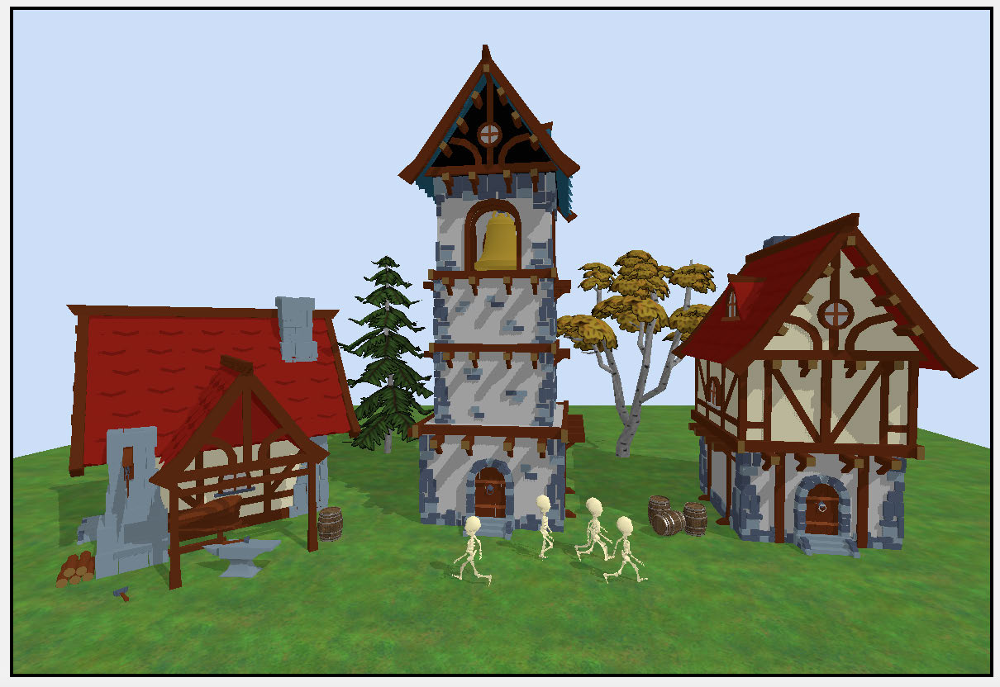

Using argument buffers

➤ Capture the GPU workload.

➤ In the Debug navigator, open Command Buffer and Forward Render Pass and 
select ground.

640

Metal by Tutorials
Chapter 25: Managing Resources

➤ Select Bound Resources using the navigator icon at the top left of the pane and 
examine the resources.

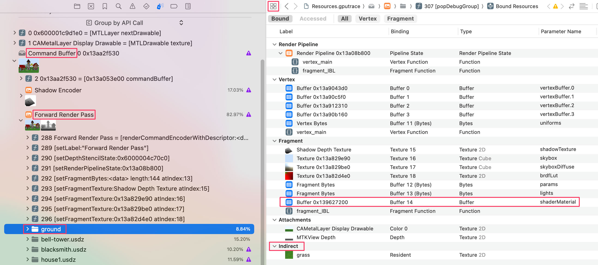

Indirect Resources

For the ground plane, the Indirect section lists the color texture grass. 
MTLRenderCommandEncoder.useResource(_:usage:) explicitly makes the texture 
accessible to the GPU as an indirect resource.

➤ Under Fragment, double-click the shaderMaterial to examine it.

Ground plane textures

Here, you can examine the textures and material properties in shaderMaterial. The 
ground doesn’t have a normal texture.

The arrow next to grass indicates the indirection. If you click the arrow, you’ll see 
the ground plane’s color texture with mip maps.

All the textures and material correspond to how you encoded them in the argument 
buffer when you set up Submesh. As you can tell, it’s very important to ensure that 
the argument buffer corresponds to the structure that you set up in the fragment 
shader.

641

Metal by Tutorials
Chapter 25: Managing Resources

You’ve now set up your app to use argument buffers for textures and the material 
instead of sending them individually. This may not feel like a win yet, and you’ve 
increased overhead by adding a new buffer. But you’ve reduced overhead on the 
render command encoder. Instead of having to validate the textures each frame, the 
textures are validated when they are first placed into the argument buffer, while 
you’re still initializing your app data.  In addition to this, you’re grouping your 
materials together into the one structure, and only using one argument table entry 
in the fragment function. If you have many parameters that you can group together, 
this will save resources.

Resource Heaps

You’ve grouped textures into an argument buffer for each submesh, but you can also 
combine all your app’s textures into a resource heap.

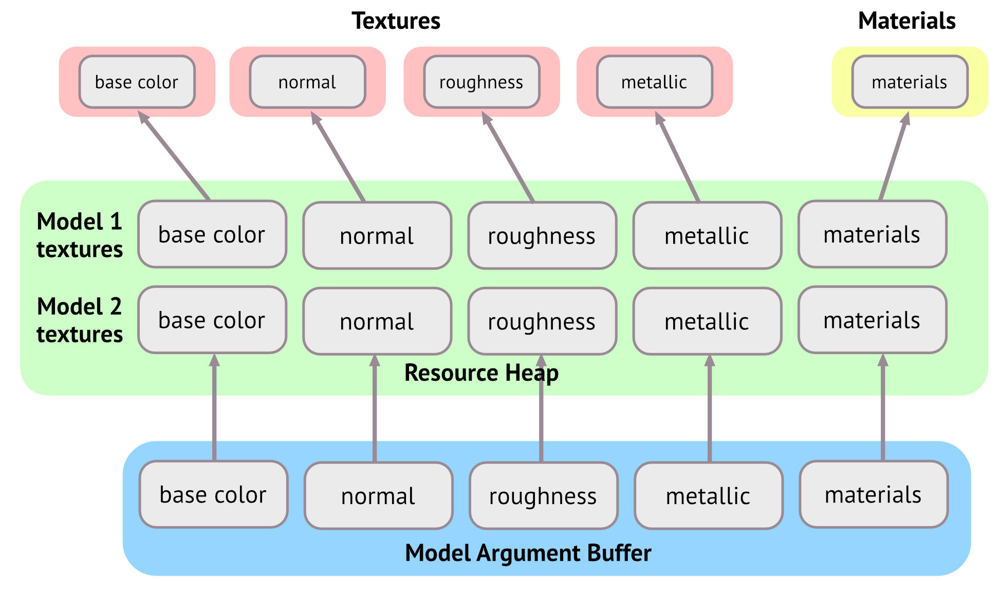

A resource heap is simply an area of memory where you bundle resources. These can 
be textures or data buffers. To make your textures available on the GPU, instead of 
having to perform renderEncoder.useResource(_:usage:) for every single 
texture, you can perform renderEncoder.useHeap(_:) once per frame instead. 
That’s one step further in the quest for reducing render commands.

642

Metal by Tutorials
Chapter 25: Managing Resources

➤ In the Textures group, open TextureController.swift.

TextureController stores all your app’s textures in one central array: textures. 
From this array, you’ll gather all the textures into a heap and move the whole heap at 
one time to the GPU.

➤ In TextureController, create a new property:

➤ Create a new type method to build the heap:

static func buildHeap() -> MTLHeap? { 
  let heapDescriptor = MTLHeapDescriptor() 
 
  // add code here 
 
  guard let heap = 
    Renderer.device.makeHeap(descriptor: heapDescriptor) 
    else { return nil } 
  return heap 
}

MTLDevice.makeHeap(descriptor:) is a time-consuming operation, so make sure 
that you execute it at loading time, rather than when your app is in full swing. Once 
you’ve created the heap, it’s fast to add Metal buffers and textures to it.

You build a heap from a heap descriptor. This descriptor will need to know the size of 
all the textures combined. Unfortunately MTLTexture doesn’t hold that information, 
but you can retrieve the size of a texture from a texture descriptor.

In the Utility group, in Extensions.swift, there’s an extension on MTLTexture that 
will provide a descriptor from the texture.

➤ In TextureController.swift, in buildHeap(), replace // add code here with:

let descriptors = textures.map { texture in 
  texture.descriptor 
}

Here, you create an array of texture descriptors to match the array of textures. Now 
you can add up the size of all these descriptors.

➤ Following on from the previous code, add this:

let sizeAndAligns = descriptors.map { descriptor in 
  Renderer.device.heapTextureSizeAndAlign(descriptor:

643

Metal by Tutorials
Chapter 25: Managing Resources

descriptor) 
} 
heapDescriptor.size = sizeAndAligns.reduce(0) { total, 
sizeAndAlign in 
  let size = sizeAndAlign.size 
  let align = sizeAndAlign.align 
  return total + size - (size & (align - 1)) + align 
} 
if heapDescriptor.size == 0 { 
  return nil 
}

You calculate the size of the heap using size and correct alignment within the heap. 
As long as align is a power of two, (size & (align - 1)) will give you the 
remainder when size is divided by alignment. For example, if you have a size of 129 
bytes, and you want to align it to memory blocks of 128 bytes, this is the result of 
size - (size & (align - 1)) + align:

This result shows that if you want to align blocks to 128, you’ll need a 256 byte block 
to fit 129 bytes.

You have an empty heap, but you need to populate it with textures. Each texture 
must match the heap’s CPU cache mode and also the heap’s storage mode.

➤ At the end of buildHeap(), but before return heap, add this:

let heapTextures = descriptors.map { descriptor -> MTLTexture in 
  descriptor.storageMode = heapDescriptor.storageMode 
  descriptor.cpuCacheMode = heapDescriptor.cpuCacheMode 
  guard let texture = heap.makeTexture(descriptor: descriptor) 
else { 
    fatalError("Failed to create heap textures") 
  } 
  return texture 
}

You iterate through the descriptors array and create a texture for each descriptor. 
You store this new texture in heapTextures.

heapTextures now contains a bunch of empty texture resources. To copy the 
submesh texture information to the heap texture resources, you’ll need a blit 
command encoder.

644

Metal by Tutorials
Chapter 25: Managing Resources

The Blit Command Encoder

To blit means to copy from one part of memory to another, and is typically an 
extremely fast operation. You create a blit command encoder using a command 
buffer, just as you did the render and compute command encoders. You then use this 
encoder when you want to copy a resource such as a texture or Metal buffer.

➤ Add this after the previous code, before return heap:

guard 
  let commandBuffer = Renderer.commandQueue.makeCommandBuffer(), 
  let blitEncoder = commandBuffer.makeBlitCommandEncoder() 
else { return nil } 
zip(textures, heapTextures) 
  .forEach { texture, heapTexture in 
    heapTexture.label = texture.label 
    // blit here 
  }

You create the blit command encoder using a command buffer. You then set up a 
forEach loop that will process all the textures and match them with the heap 
textures.

➤ Replace // blit here with:

var region = 
  MTLRegionMake2D(0, 0, texture.width, texture.height) 
for level in 0..<texture.mipmapLevelCount { 
  for slice in 0..<texture.arrayLength { 
    blitEncoder.copy( 
      from: texture, 
      sourceSlice: slice, 
      sourceLevel: level, 
      sourceOrigin: region.origin, 
      sourceSize: region.size, 
      to: heapTexture, 
      destinationSlice: slice, 
      destinationLevel: level, 
      destinationOrigin: region.origin) 
  } 
  region.size.width /= 2 
  region.size.height /= 2 
}

When copying textures, you specify a region. Initially the region will be the entire 
texture’s width and height. You’ll then blit mip levels where the region will get 
progressively smaller.

645

Metal by Tutorials
Chapter 25: Managing Resources

You copy each texture to a heap texture. Within each texture, you copy each level 
and slice. Levels contain the texture mipmaps, which is why you halve the region 
each loop. A slice is either the index into a texture array, or, for a cube texture, one of 
six cube faces.

Even though there are a lot of parameters to the blit encoder copy method, they are 
simply for deciding which area of the texture is to be copied. You can copy part of a 
texture by setting the origin and source size of the region. You can also copy part of a 
texture to a different region in the destination texture.

➤ Before return heap, add the following:

blitEncoder.endEncoding() 
commandBuffer.commit() 
Self.textures = heapTextures

This ends the encoding, commits the command buffer and replaces the original 
textures with the heap textures. TextureController.buildHeap() will now create 
a heap from all the textures gathered during scene loading.

➤ Open Submesh.swift.

In initializeMaterials(), you create an argument buffer from the submesh 
textures when you load the submesh. Unfortunately, as you’ve now copied all the old 
textures to new heap textures, your submesh argument buffers point to the wrong 
textures now.

➤ At the end of init(mdlSubmesh:mtkSubmesh:), remove:

Open Model.swift, and in setTexture(name:type:), remove:

You’ll need to create the argument buffers after you’ve created the heap.

➤ In the Game group, open Renderer.swift, and add a new method to Renderer:

func initialize(_ scene: GameScene) { 
  TextureController.heap = TextureController.buildHeap() 
  for model in scene.models { 
    model.meshes = model.meshes.map { mesh in 
      var mesh = mesh 
      mesh.submeshes = mesh.submeshes.map { submesh in 
        var submesh = submesh 
        submesh.initializeMaterials()

646

Metal by Tutorials
Chapter 25: Managing Resources

return submesh 
      } 
      return mesh 
    } 
  } 
}

initialize(_:) will ensure that the heap gets built before the main render loop. 
You then process all the submeshes and initialize the materials with the correct 
textures.

➤ Open GameController.swift, and in init(metalView:options:), after scene = 
GameScene(),add this:

➤ Build and run the app to ensure that everything still works.

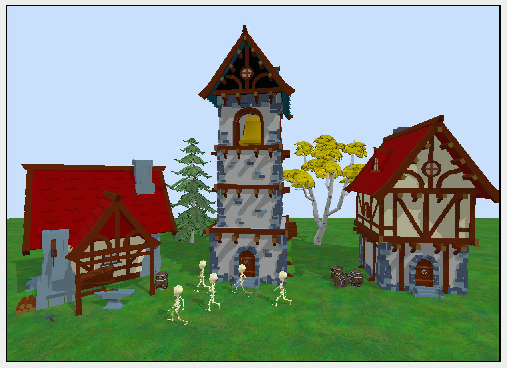

Skeletons on parade

You’ve now placed all your textures in a heap, and are using those individual 
textures, but aren’t yet taking full advantage of the heap. Before rendering any 
models, you can send the textures to the GPU at the start of a render pass to be all 
ready and waiting for processing.

➤ In the Render Passes group, open ForwardRenderPass.swift.

➤ In draw(commandBuffer:scene:uniforms:params:), add this after creating 
renderEncoder:

if let heap = TextureController.heap { 
  renderEncoder.useHeap(heap, stages: .fragment) 
}

647

Metal by Tutorials
Chapter 25: Managing Resources

➤ Open Rendering.swift, and in 
render(encoder:uniforms:params:renderState:), remove:

submesh.allTextures.forEach { texture in 
  if let texture = texture { 
    encoder.useResource(texture, usage: .read) 
  } 
}

Instead of having a useResource command for every texture, you perform one 
useHeap every render pass. This could be a huge saving on the number of commands 
in a render command encoder, and so a reduction of the number of commands that a 
GPU has to process each frame.

➤ Build and run the app, and your render will be exactly the same as it was.

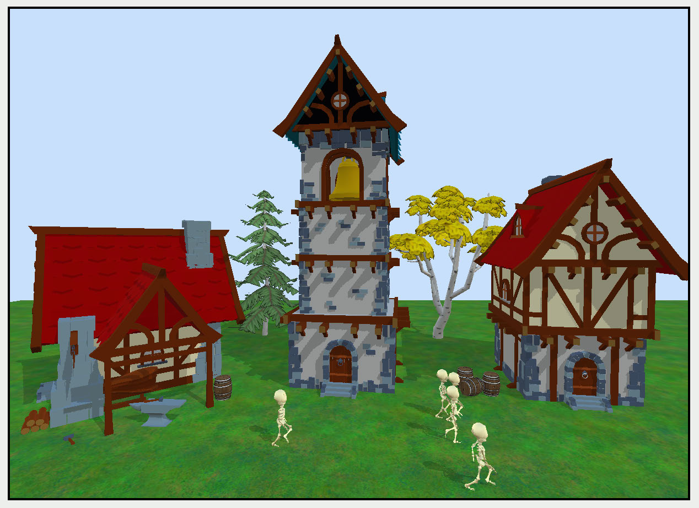

Rendering with a texture heap

➤ Capture the GPU workload.

➤ Open Command Buffer > Forward Render Pass and select the useHeap 
command that you set at the start of the render pass.

648

Metal by Tutorials
Chapter 25: Managing Resources

In the bound resources, all the scene textures are listed under indirect resources, and 
are available for use in any shader during this render pass.

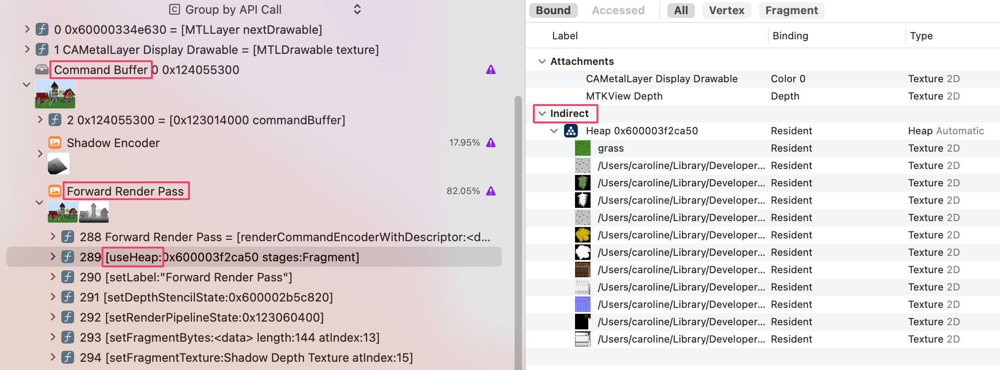

You’ve now separated out your textures from your rendering code, with a level of 
indirection via the argument buffer. But have you seen any performance 
improvement? In this example, on a recent device, probably not. But the more 
complicated your render passes get, the better the improvement, as there will be 
fewer render commands.

Key Points

• An argument buffer is a collection of pointers to resources that you can pass to 
shaders.

• A resource heap is a collection of textures or Metal buffers. A heap can be static, as 
in this chapter’s example, but you can also reuse space on the heap where you use 
different textures at different times.

649

26