# GPU-Driven 
Rendering

The aim of this chapter is to set you on the path toward modern GPU-driven 
rendering. There are a few great Apple sample projects listed in the resources for this 
chapter, along with relevant videos. However, the samples can be quite intimidating. 
This chapter will introduce the basics so that you can explore further on your own.

The GPU requires a lot of information to be able to render a model. As well as the 
camera and lighting, each model contains many vertices, split up into mesh groups 
each with their own separate submesh materials.

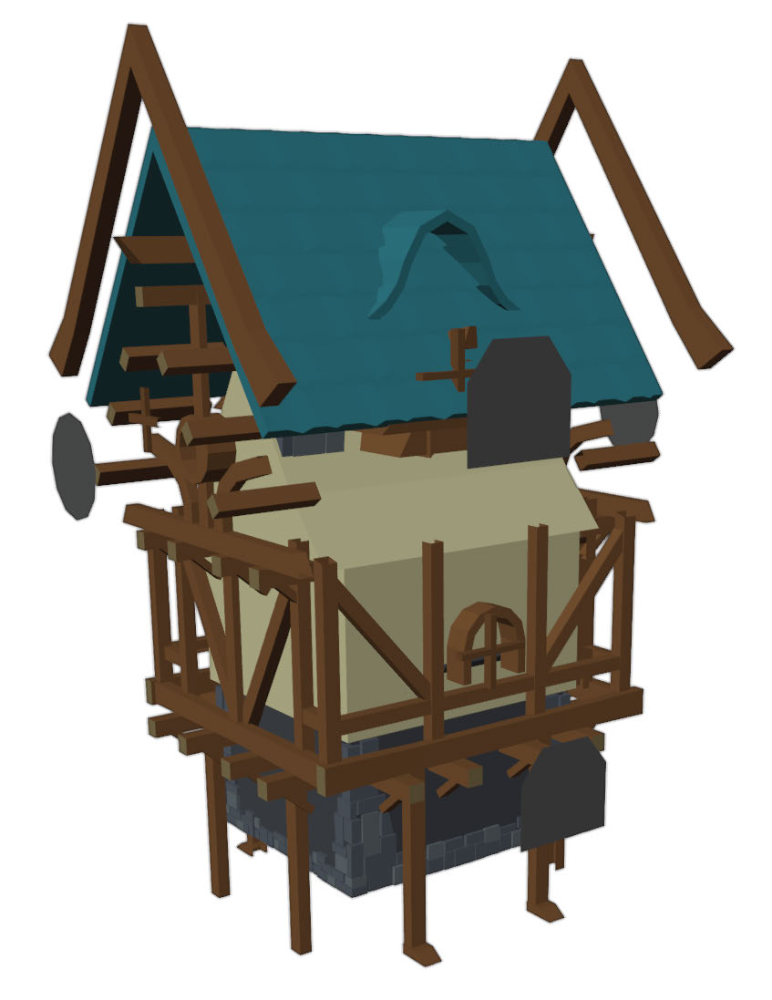

A house model with submeshes expanded

650

Metal by Tutorials
Chapter 26: GPU-Driven Rendering

The scene you’ll render, in contrast, will only render two static models, each with 
one mesh and one submesh. Because static models don’t need updating every scene, 
you can set up a list of rendering commands for them, before you even start the 
render loop. Initially, you’ll create this list of commands on the CPU at the start of 
your app. Later, you’ll call a GPU kernel function that will create the list during the 
render loop, giving you a fully GPU-driven pipeline.

With this simple project, you may not see the immediate gains. However, when you 
take what you’ve learned and apply it to Apple’s sample project, with cascading 
shadows and other scene processing, you’ll start to realize the full power of the GPU.

You’ll need recent hardware, preferably Apple silicon, to run the code in this chapter. 
Techniques involved include:

• Non-uniform threadgroups: Supported on Apple Family GPU 4 and later (A11).

• Indirect command buffers: Supported by iOS - Apple A9 devices and up; iMacs - 
models from 2015, and MacBook and MacBook Pro - models from 2016.

• Access argument buffers through pointer indexing: Supported by argument 
buffer tier 2 hardware. This includes Apple GPU Family 6 and up (A13 and Silicon).

The Starter Project

➤ In Xcode, open the starter project, and build and run the app.

The starter app

651

Metal by Tutorials
Chapter 26: GPU-Driven Rendering

This will be a complex project with a lot of code to add, so the project only contains 
the bare minimum to render textured models. All shadows, transparency and lighting 
has been removed.

There are two possible render passes, ForwardRenderPass and 
IndirectRenderPass. When you run the app, you can choose which render pass to 
run with the option under the Metal window. Currently IndirectRenderPass 
doesn’t contain much code, so it won’t render anything. IndirectRenderPass.swift 
is where you’ll add most of the CPU code in this chapter. You’ll change the GPU 
shader functions in Shaders/Indirect.metal.

➤ Open ForwardRenderPass.swift, and examine 
draw(commandBuffer:scene:uniforms:params:).

Instead of rendering the model in Rendering.swift, the rendering code is all here. 
You can see each render encoder command listed in this one method. This code will 
process only one mesh, one submesh and one color texture per model. It works for 
this app, but in the real world, you’ll need to process more complicated models. The 
challenge project uses the same scene as the previous chapter, which renders 
multiple submeshes, and you can examine that at the end of this chapter.

Indirect Command Buffers

In the previous chapter, you created argument buffers for your textures. These 
argument buffers point to textures in a texture heap.

Your rendering process currently looks like this:

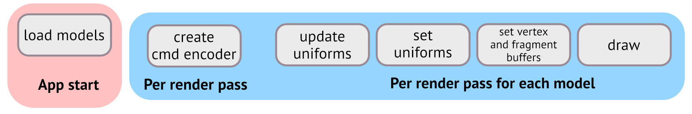

Your render loop

You load all the model data, materials and pipeline states at the start of the app. For 
each render pass, you create a render command encoder and issue commands one 
after another to that encoder, ending with a draw call. You repeat the drawing 
process for each model.

652

Metal by Tutorials
Chapter 26: GPU-Driven Rendering

Instead of creating these commands per render pass, you can create them all at the 
start of the app using an indirect command buffer with a list of commands. You’ll 
set up each command with pointers to the relevant uniform, material and vertex 
buffers and specify how to do the draw. During the render loop, you can just issue 
one execute command to the render command encoder, and the encoder will send 
the list of commands, all at once, off to the GPU.

Your rendering process will then look like this:

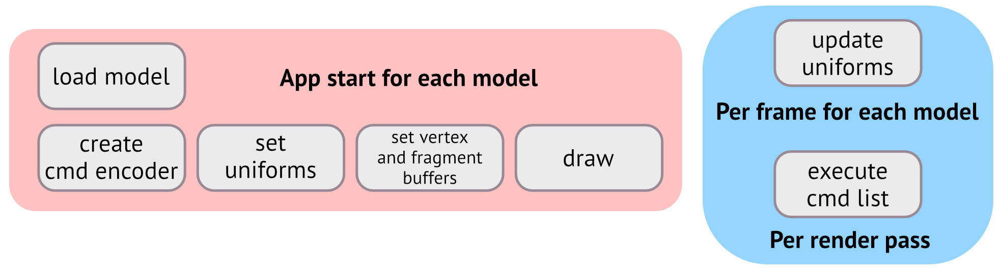

Indirect rendering

Remember that your aim is to do as much as you can when your app first loads, and 
as little as you have to per frame. To achieve this, you’ll:

1. Place all your uniform data in buffers. Because the indirect commands need to 
point to buffers at the start of the app, you can’t send ad hoc bytes to the GPU. 
You can still update the buffers each frame. You’ll set up a model matrix for each 
model in an array and then place this array into a Metal buffer. The models are 
static, so in this case, you won’t need to update the buffer each frame.

2. Set up an indirect command buffer. This buffer will hold all the draw commands.

3. Loop through the models, setting up the indirect commands in the indirect 
command buffer.

4. Clean up the render loop and use the resources you referred to in the indirect 
commands to send them to the GPU.

5. Change the shader functions to use the array of model constants.

6. Execute the command list.

653

Metal by Tutorials
Chapter 26: GPU-Driven Rendering

1. Initializing the Uniform Buffers

➤ In the Render Passes group, open IndirectRenderPass.swift.

IndirectRenderPass contains the minimum code to conform to RenderPass. It also 
contains a pipeline state that references the shader functions vertex_indirect and 
fragment_indirect. At the moment, these functions are duplicates of vertex_main 
and fragment_main.

➤ Add these new properties to IndirectRenderPass:

var uniformsBuffer: MTLBuffer! 
var modelParamsBuffer: MTLBuffer!

You create a buffer that will hold the camera uniform data. modelParamsBuffer will 
hold the array of model matrices and tiling values.

➤ In the Shaders group, open Common.h, and create a new structure:

typedef struct { 
  matrix_float4x4 modelMatrix; 
  matrix_float3x3 normalMatrix; 
  uint tiling; 
} ModelParams;

You separate out the model information from the uniform data. The reason for doing 
this will become clearer as you progress through the chapter.

➤ Open IndirectRenderPass.swift, and add a new method to IndirectRenderPass:

mutating func initializeUniforms(_ models: [Model]) { 
  let bufferLength = MemoryLayout<Uniforms>.stride 
  uniformsBuffer = 
    Renderer.device.makeBuffer(length: bufferLength, options: 
[]) 
  uniformsBuffer.label = "Uniforms" 
 
  var modelParams: [ModelParams] = models.map { model in 
    var modelParams = ModelParams() 
    modelParams.modelMatrix = model.transform.modelMatrix 
    modelParams.normalMatrix = modelParams.modelMatrix.upperLeft 
    modelParams.tiling = model.tiling 
    return modelParams 
  } 
  modelParamsBuffer = Renderer.device.makeBuffer( 
    bytes: &modelParams, 
    length: MemoryLayout<ModelParams>.stride * models.count, 
    options: [])

654

Metal by Tutorials
Chapter 26: GPU-Driven Rendering

modelParamsBuffer.label = "Model Transforms Array" 
}

You set up the camera uniform and model transform data buffers.

Even though the models are static, you’ll still have to update the camera uniforms 
every frame in case the user has changed the camera position.

➤ Add this new method to IndirectRenderPass:

func updateUniforms(scene: GameScene, uniforms: Uniforms) { 
  var uniforms = uniforms 
  uniformsBuffer.contents().copyMemory( 
    from: &uniforms, 
    byteCount: MemoryLayout<Uniforms>.stride) 
}

You load up the uniforms buffer with the current data for each frame.

➤ Call this method at the top of draw(commandBuffer:scene:uniforms:params:):

➤ Create a new method in IndirectRenderPass to initialize the uniform buffers:

mutating func initialize(models: [Model]) { 
  initializeUniforms(models) 
}

Soon, you’ll be initializing a few more buffers in this method.

Next, you need to call initialize(models:) from Renderer.

➤ In the Game group, open Renderer.swift, and add this to the end of 
initialize(_:):

2. Setting up an Indirect Command Buffer

You’re now ready to create some indirect commands.

➤ Open ForwardRenderPass.swift, and look at 
draw(commandBuffer:scene:uniforms:params:). Refresh your memory on all the 
render commands necessary to render the scene. You’re going to move all these 
commands to an indirect command list.

655

Metal by Tutorials
Chapter 26: GPU-Driven Rendering

➤ Open IndirectRenderPass.swift, and add a new property to 
IndirectRenderPass.

This buffer will hold the render command list.

➤ Create a new method in IndirectRenderPass:

mutating func initializeICBCommands(_ models: [Model]) { 
  let icbDescriptor = MTLIndirectCommandBufferDescriptor() 
  icbDescriptor.commandTypes = [.drawIndexed] 
  icbDescriptor.inheritBuffers = false 
  icbDescriptor.maxVertexBufferBindCount = 25 
  icbDescriptor.maxFragmentBufferBindCount = 25 
  icbDescriptor.inheritPipelineState = true 
}

You create an Indirect Command Buffer descriptor. You specify that (eventually) the 
GPU should expect an indexed draw call. That’s a draw call that uses an index buffer 
for indexing into the vertices. You set the maximum number of buffers that the ICB 
can bind to in the vertex and fragment shader parameters to 25. This is far too many, 
but you can renumber the buffer indices when your app is complete.

You set inheritPipelineState to true. Because this app contains such simple 
models, you can set the render pipeline state at the start of the render pass, and all 
encoder commands will inherit the current pipeline state. If you require a different 
pipeline for different submeshes, you’d set inheritPipelineState to false and 
add setting the render pipeline state to the list of indirect encoder commands.

➤ At the end of initializeICBCommands(_:), create the indirect command buffer:

guard let icb = Renderer.device.makeIndirectCommandBuffer( 
  descriptor: icbDescriptor, 
  maxCommandCount: models.count, 
  options: []) else { fatalError("Failed to create ICB") } 
self.icb = icb

The ICB will need one command per draw call. In this app, you’re only performing 
one draw call per model, but in a more complex app where you’re doing a draw call 
for every submesh, you’d have to iterate through the models prior to setting up the 
ICB to find out how many draw calls you’ll do.

656

Metal by Tutorials
Chapter 26: GPU-Driven Rendering

3. Setting up the Indirect Commands

Now that you’ve set up an indirect command buffer, you’ll add the list of commands 
to it.

➤ Add the following code to the end of initializeICBCommands(_:):

for (modelIndex, model) in models.enumerated() { 
  let mesh = model.meshes[0] 
  let submesh = mesh.submeshes[0] 
  let icbCommand = icb.indirectRenderCommandAt(modelIndex) 
  icbCommand.setVertexBuffer( 
    uniformsBuffer, offset: 0, at: UniformsBuffer.index) 
  icbCommand.setVertexBuffer( 
    modelParamsBuffer, offset: 0, at: ModelParamsBuffer.index) 
  icbCommand.setFragmentBuffer( 
    modelParamsBuffer, offset: 0, at: ModelParamsBuffer.index) 
  icbCommand.setVertexBuffer( 
    mesh.vertexBuffers[VertexBuffer.index], 
    offset: 0, 
    at: VertexBuffer.index) 
  icbCommand.setVertexBuffer( 
    mesh.vertexBuffers[UVBuffer.index], 
    offset: 0, 
    at: UVBuffer.index) 
  icbCommand.setFragmentBuffer( 
    submesh.argumentBuffer!, offset: 0, at: 
MaterialBuffer.index) 
}

This code may look familiar to you from the render loop in 
ForwardRenderPass.draw(commandBuffer:scene:uniforms:params:). You use 
the model index to keep track of the command list, and you set all the necessary data 
for each draw call.

It’s important to remember how you formatted your vertex buffers when loading the 
models.

657

Metal by Tutorials
Chapter 26: GPU-Driven Rendering

➤ In the Geometry group, open VertexDescriptor.swift, and examine how the 
vertex buffers are configured.

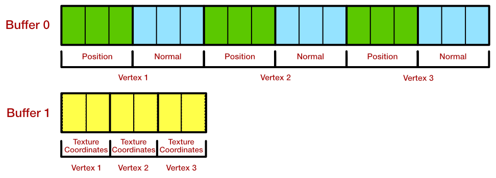

Vertex buffer layouts

The vertex descriptor is simplified from the previous chapter, as there are no 
animated models to process.

➤ Open IndirectRenderPass.swift, add the draw call to the end of the for loop in 
initializeICBCommands(_:):

icbCommand.drawIndexedPrimitives( 
  .triangle, 
  indexCount: submesh.indexCount, 
  indexType: submesh.indexType, 
  indexBuffer: submesh.indexBuffer, 
  indexBufferOffset: submesh.indexBufferOffset, 
  instanceCount: 1, 
  baseVertex: 0, 
  baseInstance: modelIndex)

This draw command is very similar to the one that you’ve already been using. There 
are a couple of extra arguments:

• baseVertex: The vertex in the vertex buffer to start rendering from.

• baseInstance: The instance to start rendering from. You have set up an array of 
modelParams, one for each model. Using baseInstance, in the vertex shader, you 
can index into the array to get the correct element.

658

Metal by Tutorials
Chapter 26: GPU-Driven Rendering

The command list is now complete.

➤ Call this method at the end of initialize(models:):

4. Updating the Render Loop

Currently none of your resources are making their way to the GPU.

➤ Create a new method in IndirectRenderPass:

func useResources( 
  encoder: MTLRenderCommandEncoder, models: [Model] 
) { 
  encoder.pushDebugGroup("Using resources") 
  encoder.useResource( 
    uniformsBuffer, 
    usage: .read, stages: .vertex) 
  encoder.useResource( 
    modelParamsBuffer, 
    usage: .read, stages: [.vertex, .fragment]) 
  if let heap = TextureController.heap { 
    encoder.useHeap(heap, stages: .fragment) 
  } 
  for model in models { 
    let mesh = model.meshes[0] 
    let submesh = mesh.submeshes[0] 
    encoder.useResource( 
      mesh.vertexBuffers[VertexBuffer.index], 
      usage: .read, stages: .vertex) 
    encoder.useResource( 
      mesh.vertexBuffers[UVBuffer.index], 
      usage: .read, stages: .vertex) 
    encoder.useResource( 
      submesh.indexBuffer, usage: .read, stages: .vertex) 
    encoder.useResource( 
      submesh.argumentBuffer!, usage: .read, stages: .fragment) 
  } 
  encoder.popDebugGroup() 
}

When you use a resource, it’s available to the GPU as indirect resource ready for the 
GPU to access. The stages parameters correspond to which shader you sent the 
buffer in initializeICBCommands(_:).

659

Metal by Tutorials
Chapter 26: GPU-Driven Rendering

➤ Add this to draw(commandBuffer:scene:uniforms:params:), before 
renderEncoder.endEncoding():

➤ To ensure everything is working so far, build and run the app, switch to Indirect 
encoding and capture the GPU workload.

You’re not yet executing any draw calls, so you’ll have a clear blue screen.

➤ Expand the Indirect Command Encoding render pass, and select 
[endEncoding].

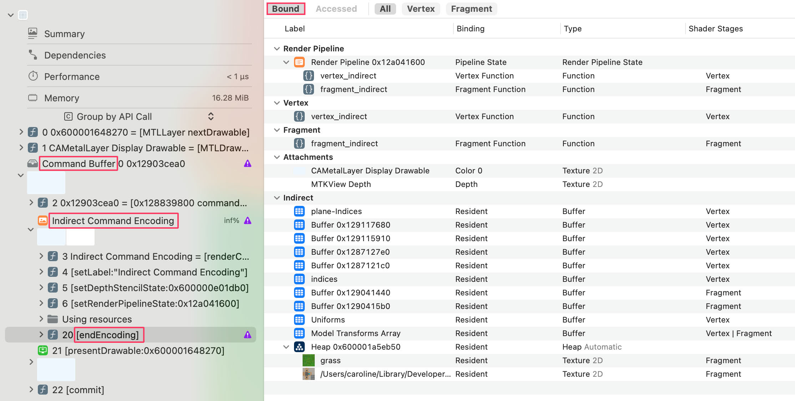

Loaded indirect resources

All of your resources are listed in the Indirect resources bound to the GPU and are 
available to your vertex and fragment shaders.

Note: To see the Shader Stages column, control-click the column heading 
and choose from the dropdown list.

660

Metal by Tutorials
Chapter 26: GPU-Driven Rendering

5. Updating the Shader Functions

➤ In the Shaders group, open Indirect.metal.

This file is currently a duplicate of Shaders.metal. However, you set up your indirect 
commands to use an array of model transforms instead of holding each model’s 
transform in Uniforms, so you’ll change the vertex function to reflect that.

➤ Add new parameters to vertex_indirect:

constant ModelParams *modelParams [[buffer(ModelParamsBuffer)]], 
uint modelIndex [[base_instance]]

modelParams is the array of model transforms. You’ll extract the correct instance 
from the array using modelIndex, which is the same as baseInstance that you 
already set in the draw call.

➤ Add the following code to the top of vertex_indirect:

➤ Where you calculate .position, replace uniforms.modelMatrix with:

You use the appropriate matrix from the array of model transforms rather than the 
single modelMatrix value in uniforms.

fragment_indirect will require the model’s tiling value, so you’ll pass the correct 
instance to the fragment function.

➤ Add this property to VertexOut:

The [[flat]] attribute ensures that the value won’t be interpolated between the 
vertex and fragment function.

➤ In vertex_indirect, add the model index to the VertexOut out assignment:

661

Metal by Tutorials
Chapter 26: GPU-Driven Rendering

➤ Just as you did in the vertex function, add the new parameter to 
fragment_indirect:

➤ Add this to the top of fragment_indirect:

➤ In the conditional where you sample baseColorTexture, replace params.tiling 
with:

➤ Remove this parameter from fragment_indirect’s header:

That’s fixed up the shader functions so that they’ll read an array of parameters 
instead of a single instance.

6. Execute the Command List

All the code you have written in this chapter so far has been building up to one 
command.

Drum roll….

➤ Open IndirectRenderPass.swift, and add the following code to 
draw(commandBuffer:scene:uniforms:params:), before 
renderEncoder.endEncoding():

renderEncoder.executeCommandsInBuffer( 
  icb, range: 0..<scene.models.count)

This code will execute all the commands in the indirect command buffer’s list within 
the range specified here. If you specify a range of 0..<1, then only the first draw call 
would be performed.

➤ Build and run the app, and switch to Indirect encoding.

662

Metal by Tutorials
Chapter 26: GPU-Driven Rendering

And… you get an error:

The indirect command buffer inherits pipelines 
( inheritPipelineState = YES) but the render pipeline set on 
this encoder does not support indirect command buffers 
( supportIndirectCommandBuffers = NO )

When you use a pipeline state in an indirect command list, you have to tell it that it 
should support indirect command buffers.

➤ Open Pipelines.swift, and add this to createIndirectPSO() before return:

➤ Build and run the app, and switch to Indirect encoding.

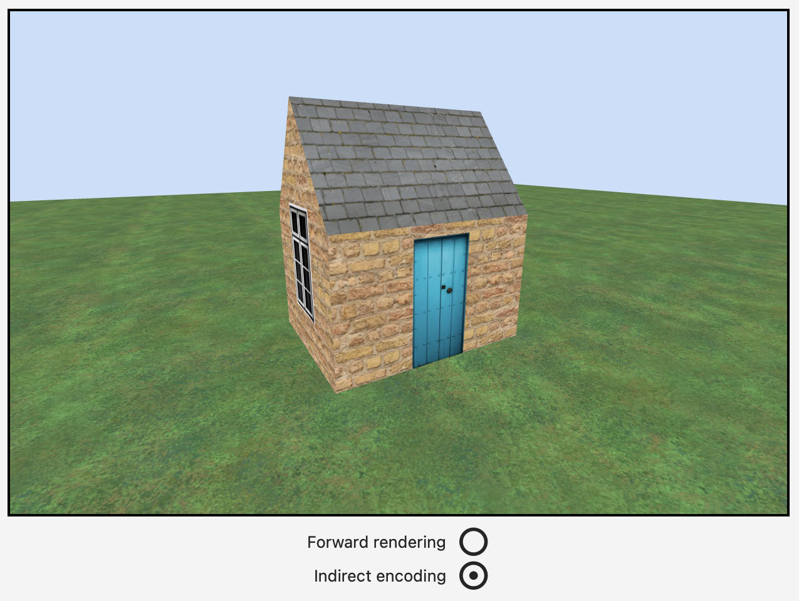

Indirect encoding

This may not be the most exciting result. Both forward rendering and indirect 
encoding renders look exactly the same. But behind the scenes, it’s a different story. 
Very little is happening in your render loop, and all the heavy lifting is done at the 
very start of the app. Success. :]

663

Metal by Tutorials
Chapter 26: GPU-Driven Rendering

➤ Capture the GPU workload, and expand both the Indirect Command Encoding 
render pass and Indirect Command Encoding.

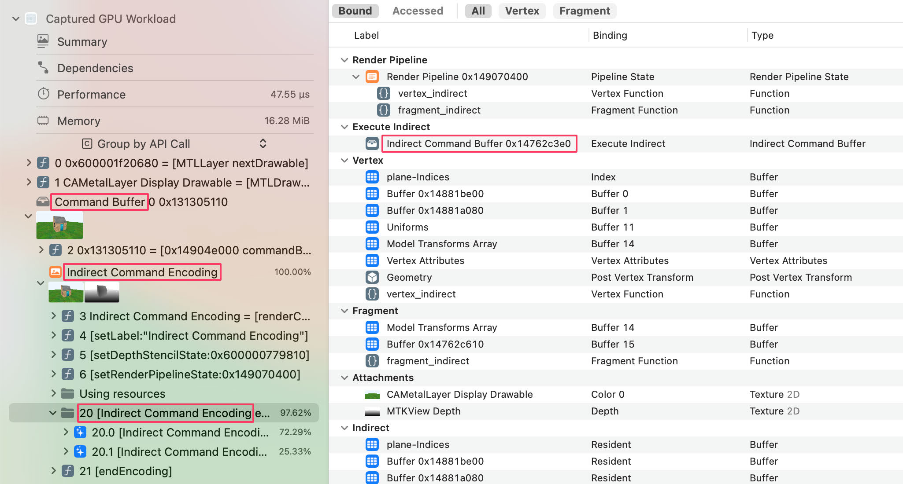

Execute indirect commands

➤ In the bound resources, double-click Indirect Command Buffer.

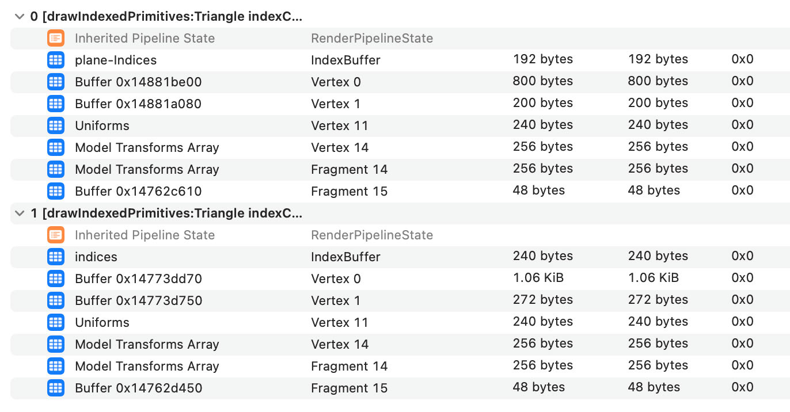

The indirect command list

You see both your draw call commands listed with their encoded resources.

664

Metal by Tutorials
Chapter 26: GPU-Driven Rendering

GPU-Driven Rendering

You’ve achieved indirect CPU rendering, by setting up a command list and rendering 
it. However, you can go one better and get the GPU to create this command list.

➤ Open IndirectRenderPass.swift, and look at the for loop in 
initializeICBCommands(_:).

This for loop executes serially on the CPU, but is one that you can easily parallelize. 
Each ICB command executes one after another, but by moving this loop to the GPU, 
you can create each command at the same time over multiple GPU cores.

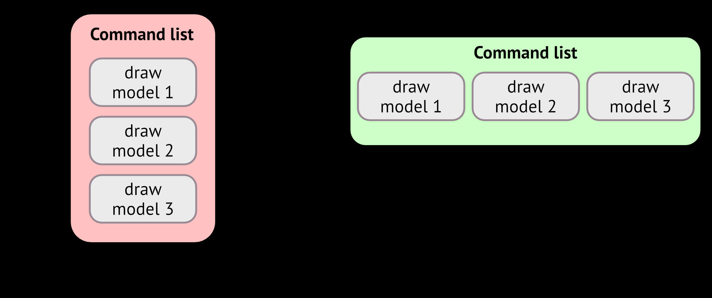

GPU command creation

When you come to write real-world apps, setting up the render loop at the very start 
of the app is impractical. In each frame, you’ll be determining which models to 
render. Are the models in front of the camera? Is the model occluded by another 
model? Should you render a model with lower level of detail? By creating the 
command list every frame, you have complete flexibility in which models you should 
render, and which you should ignore.

665

Metal by Tutorials
Chapter 26: GPU-Driven Rendering

As you’ll see, the GPU is amazingly fast at creating these render command lists, so 
you can include this process each frame.

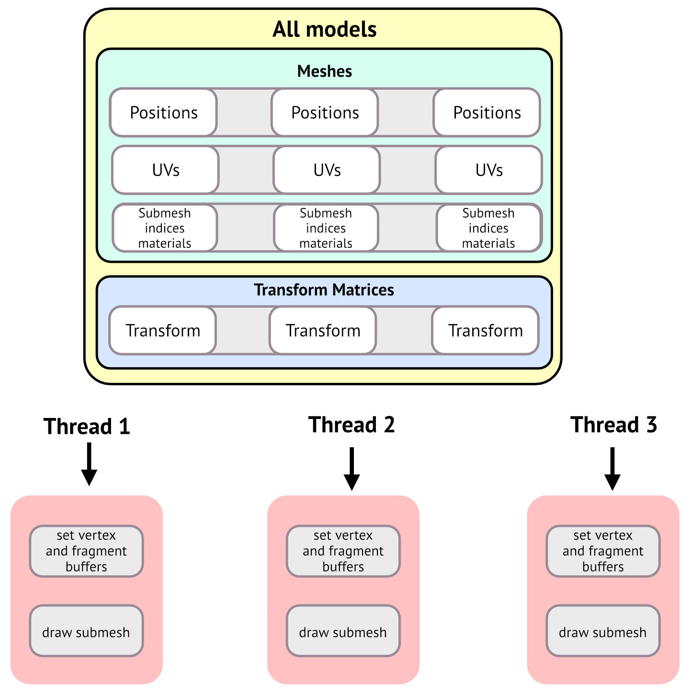

Creating commands per thread

You’ll create a compute shader and pass it all the buffers that you used during the 
initializeICBCommands(_:) for loop:

• uniform and model parameter buffers

• the indirect command buffer

For the models’ vertex buffers and materials, you’ll create an array of argument 
buffers containing for each model:

• the vertex buffers

• the index buffer

• the submesh material argument buffer

666

Metal by Tutorials
Chapter 26: GPU-Driven Rendering

There’s one more array you’ll need to send: the draw arguments for each model. Each 
model’s draw call is different from every other. You have to specify, for example, 
what the index buffer is and what is the index count. Fortunately Apple have created 
a format that you can use for this, called 
MTLDrawIndexedPrimitivesIndirectArguments. That’s some mouthful!

There’s quite a lot of setup code, and you have to be careful when matching buffers 
with compute shader parameters. If you make an error, it’s difficult to debug it, and 
your computer may lock up. Running the app on an external device, such as iPhone 
or iPad is preferable, if slightly slower.

These are the steps you’ll take:

1. Create the kernel function.

2. Set up the compute pipeline state object.

3. Set up the argument buffers for the kernel function.

4. Set up the draw arguments.

5. Complete the compute command encoder.

1. Creating the Kernel Function

You’ll start by creating the kernel function compute shader so that you can see what 
data you have to pass. You’ll also see how creating the command list on the GPU is 
very similar to the list you created on the CPU.

➤ In the Shaders group, create a new Metal file named ICB.metal, and add the 
following:

#import "Common.h"

struct ICBContainer { 
  command_buffer icb [[id(0)]]; 
};

struct Model { 
  constant float *vertexBuffer; 
  constant float *uvBuffer; 
  constant uint *indexBuffer; 
  constant float *materialBuffer; 
};

667

Metal by Tutorials
Chapter 26: GPU-Driven Rendering

Model assumes that the index buffer is a 32-bit format. If you send an index buffer 
with an index type of uint16, then the app will have undefined results. This occurred 
when rendering ground, which is created in Primitive. 
MDLMesh.convertIndexType(from:to:) is a new method in Primitive.swift that 
converts the index buffer to a different type.

These are the argument buffer structures you’ll need:

1. The indirect command buffer container. On the Swift side, you’ll create an 
argument buffer to hold the indirect command buffer. In the kernel function, 
you’ll encode commands to this command buffer. ICBContainer, as suggested by 
its name, simply contains this command buffer.

2. You’ll collect an array of model data that you’ll send to the kernel function. For 
vertices, each element will hold the positions and normals in the vertex buffer, 
the UVs in the UV buffer and also the index buffer that indexes into the vertex 
buffers. For the fragment, you’ll hold the submesh’s material argument buffer.

You can add an explicit [[id((n))]] attribute to each of the structure parameters. If 
you don’t, the ID number is implicit, starting at zero. When you encode the 
argument buffers, you’ll add each element in order, so in the Model structure, you 
don’t need to specify the ID.

➤ Add a new kernel function to ICB.metal:

kernel void encodeCommands( 
  // 1 
  uint modelIndex [[thread_position_in_grid]], 
  // 2 
  device ICBContainer *icbContainer [[buffer(ICBBuffer)]], 
  constant Uniforms &uniforms [[buffer(UniformsBuffer)]], 
  // 3 
  constant Model *models [[buffer(ModelsBuffer)]], 
  constant ModelParams *modelParams 
[[buffer(ModelParamsBuffer)]], 
  constant MTLDrawIndexedPrimitivesIndirectArguments 
    *drawArgumentsBuffer [[buffer(DrawArgumentsBuffer)]]) 
{ 
}

Common.h contains the index numbers for these new buffer indices.

668

Metal by Tutorials
Chapter 26: GPU-Driven Rendering

Going through these arguments:

1. You’ll dispatch a thread for each model. modelIndex gives the thread position in 
the grid, and is the index into the arrays of models and modelParams.

2. The kernel receives the indirect command buffer container, and the uniforms. 
You’ll encode the uniform data and send it to the vertex and fragment functions.

3. The models buffer will contain arrays of argument buffers. You’ll retrieve the 
current model using modelIndex.

4. You’ll formulate draw call arguments using the submesh data. You’ll retrieve 
these arguments from drawArgumentsBuffer to create the draw call.

Now that you’ve set up all the data, it’s an easy task to encode the draw call.

➤ Add this to encodeCommands:

// 1 
Model model = models[modelIndex]; 
MTLDrawIndexedPrimitivesIndirectArguments drawArguments 
  = drawArgumentsBuffer[modelIndex]; 
// 2 
render_command cmd(icbContainer->icb, modelIndex); 
// 3 
cmd.set_vertex_buffer  (&uniforms,       UniformsBuffer); 
cmd.set_vertex_buffer  (model.vertexBuffer,   VertexBuffer); 
cmd.set_vertex_buffer  (model.uvBuffer,  UVBuffer); 
cmd.set_vertex_buffer  (modelParams,     ModelParamsBuffer); 
cmd.set_fragment_buffer(modelParams,     ModelParamsBuffer); 
cmd.set_fragment_buffer(model.materialBuffer, MaterialBuffer);

Going through the code:

1. You retrieve the model and draw arguments using the thread position in grid.

2. On the Swift side, when you set up the indirect command buffer, you’ll indicate 
how many commands it should expect. You use modelIndex to point to the 
appropriate command.

3. Just as you would in the render loop, or as you did in the indirect command 
buffer earlier, you encode the data needed for the draw call.

Finally, you’ll encode the draw call.

669

Metal by Tutorials
Chapter 26: GPU-Driven Rendering

➤ Add this code to the end of encodeCommands:

cmd.draw_indexed_primitives( 
  primitive_type::triangle, 
  drawArguments.indexCount, 
  model.indexBuffer + drawArguments.indexStart, 
  drawArguments.instanceCount, 
  drawArguments.baseVertex, 
  drawArguments.baseInstance);

This looks very similar to the draw call you’re accustomed to, with the primitive type 
and the index buffer details.

You’ve now encoded a complete draw call, and that’s all that’s required for the 
compute function. Your next task is to set up the compute function on the CPU side, 
with a compute pipeline state and pass all the data to the compute function.

Note: You’re not performing any extra logic here to see whether the model 
should be rendered this frame. But if you determine that the model shouldn’t 
be rendered, instead of doing a draw call, you’d create an empty command 
with cmd.reset().

2. The Compute Pipeline State

➤ Open IndirectRenderPass.swift, and create these new properties in 
IndirectRenderPass:

let icbPipelineState: MTLComputePipelineState 
let icbComputeFunction: MTLFunction

You’ll need a new compute pipeline state which uses the compute function you just 
created.

➤ Add the following code to the end of init():

icbComputeFunction = 
  Renderer.library.makeFunction(name: "encodeCommands")! 
icbPipelineState = PipelineStates.createComputePSO( 
  function: "encodeCommands")

This code creates the compute function in the Metal library, and also the compute 
pipeline state.

670

Metal by Tutorials
Chapter 26: GPU-Driven Rendering

3. Setting Up the Argument Buffers

The encodeCommands kernel function requires two structures as input: one for the 
ICB, and one for the model.

➤ In IndirectRenderPass, add two buffer properties for the argument buffers to 
match these structures:

var icbBuffer: MTLBuffer! 
var modelsBuffer: MTLBuffer!

➤ In initializeICBCommands(_:), remove the entire for loop, so that the last 
command in the method is self.icb = icb.

You’re going to be creating the commands on the GPU each frame from now on.

➤ Add this code to the end of initializeICBCommands(_:):

let icbEncoder = icbComputeFunction.makeArgumentEncoder( 
  bufferIndex: ICBBuffer.index) 
icbBuffer = Renderer.device.makeBuffer( 
  length: icbEncoder.encodedLength, 
  options: []) 
icbEncoder.setArgumentBuffer(icbBuffer, offset: 0) 
icbEncoder.setIndirectCommandBuffer(icb, index: 0)

Just as you did in the previous chapter, you create an argument encoder to match the 
compute function parameter and assign an argument buffer that will contain the 
command list to the encoder. You also set the indirect command buffer in the 
argument buffer.

➤ Create a new method in IndirectRenderPass to fill the model array buffer:

mutating func initializeModels(_ models: [Model]) { 
  // 1 
  let encoder = icbComputeFunction.makeArgumentEncoder( 
    bufferIndex: ModelsBuffer.index) 
  // 2 
  modelsBuffer = Renderer.device.makeBuffer( 
    length: encoder.encodedLength * models.count, options: []) 
  // 3 
  for (index, model) in models.enumerated() { 
    let mesh = model.meshes[0] 
    let submesh = mesh.submeshes[0] 
    encoder.setArgumentBuffer( 
      modelsBuffer, startOffset: 0, arrayElement: index) 
    encoder.setBuffer( 
      mesh.vertexBuffers[VertexBuffer.index], offset: 0, index:

671

Metal by Tutorials
Chapter 26: GPU-Driven Rendering

0) 
    encoder.setBuffer( 
      mesh.vertexBuffers[UVBuffer.index], 
      offset: 0, 
      index: 1) 
    encoder.setBuffer( 
      submesh.indexBuffer, 
      offset: submesh.indexBufferOffset, 
      index: 2) 
    encoder.setBuffer(submesh.argumentBuffer!, offset: 0, index: 
3) 
  } 
}

Going through this code:

1. You create an argument buffer encoder. You stored the encodeCommands function 
in icbComputeFunction so that the encoder can reference the function 
arguments and see how much space the argument buffer will need.

2. You create the argument buffer using the required length provided by the 
encodeCommands function, multiplied by the number of models you’ll encode.

3. You iterate through the models and set the buffers on the argument encoder, 
specifying the index number to use for the element in the argument buffer array. 
These buffers match the properties in the compute shader for the Model 
structure.

➤ Add this to the end of initialize(models:):

4. Setting Up the Draw Arguments

The encodeCommands kernel function takes in an array of draw arguments that it 
uses for each draw call. You’ll now set these up into a buffer.

➤ Create a new buffer property in IndirectRenderPass for the draw arguments:

➤ Add a new method to IndirectRenderPass:

mutating func initializeDrawArguments(models: [Model]) { 
  let drawLength = models.count * 
    
MemoryLayout<MTLDrawIndexedPrimitivesIndirectArguments>.stride

672

Metal by Tutorials
Chapter 26: GPU-Driven Rendering

drawArgumentsBuffer = Renderer.device.makeBuffer( 
    length: drawLength, options: []) 
  drawArgumentsBuffer.label = "Draw Arguments" 
  var drawPointer = 
    drawArgumentsBuffer.contents().bindMemory( 
      to: MTLDrawIndexedPrimitivesIndirectArguments.self, 
      capacity: models.count) 
}

You set up the buffer with the appropriate length. You also initialize a pointer so you 
can store the draw arguments in the buffer.

➤ Add the following code at the end of initializeDrawArguments(models:):

for (modelIndex, model) in models.enumerated() { 
  let mesh = model.meshes[0] 
  let submesh = mesh.submeshes[0] 
  var drawArgument = MTLDrawIndexedPrimitivesIndirectArguments() 
  drawArgument.indexCount = UInt32(submesh.indexCount) 
  drawArgument.indexStart = UInt32(submesh.indexBufferOffset) 
  drawArgument.instanceCount = 1 
  drawArgument.baseVertex = 0 
  drawArgument.baseInstance = UInt32(modelIndex) 
  drawPointer.pointee = drawArgument 
  drawPointer = drawPointer.advanced(by: 1) 
}

Here, you iterate through the models adding a draw argument into the buffer for 
each model. Each property in drawArgument corresponds to a parameter in the final 
draw call.

➤ Call this method at the end of initialize(models:):

673

Metal by Tutorials
Chapter 26: GPU-Driven Rendering

5. Completing the Compute Command Encoder

You’ve done all the preamble and setup code. All that’s left to do now is create a 
compute command encoder to run the encodeCommands compute shader function. 
The function will create a render command to render every model.

➤ Still in IndirectRenderPass.swift, add the following code to 
draw(commandBuffer:scene:uniforms:params:), after updateUniforms(...) but 
before creating renderEncoder:

guard 
  let computeEncoder = commandBuffer.makeComputeCommandEncoder() 
  else { return } 
encodeDraw(encoder: computeEncoder) 
useResources(encoder: computeEncoder, models: scene.models) 
dispatchThreads( 
  encoder: computeEncoder, drawCount: scene.models.count) 
computeEncoder.endEncoding()

You’ll write a method to encode the draw and ready all the buffers to send to the 
GPU. You’ll then ensure that the buffers are loaded to the GPU by using the 
resources. Finally, you’ll dispatch the threads to the compute kernel.

➤ Add the first method to IndirectRenderPass:

func encodeDraw(encoder: MTLComputeCommandEncoder) { 
  encoder.setComputePipelineState(icbPipelineState) 
  encoder.setBuffer( 
    icbBuffer, offset: 0, index: ICBBuffer.index) 
  encoder.setBuffer( 
    uniformsBuffer, offset: 0, index: UniformsBuffer.index) 
  encoder.setBuffer( 
    modelsBuffer, offset: 0, index: ModelsBuffer.index) 
  encoder.setBuffer( 
    modelParamsBuffer, offset: 0, index: 
ModelParamsBuffer.index) 
  encoder.setBuffer( 
    drawArgumentsBuffer, offset: 0, index: 
DrawArgumentsBuffer.index) 
}

674

Metal by Tutorials
Chapter 26: GPU-Driven Rendering

Here, you set all the buffers in one go. Generally you loop through the models and 
set each vertex buffer individually. As these are mostly argument buffers, the 
resources have already been verified that they’re suitable for sending to the GPU.

➤ Change the header for useResources(encoder:models:) to:

func useResources( 
    encoder: MTLComputeCommandEncoder, models: [Model] 
  ) {

Now that you’re encoding the resources on the GPU, you encode them with the 
compute command encoder.

You’ll get compiler errors because the vertex and fragment stages no longer make 
sense.

➤ Remove all the stages: parameters and your method code will compile again. You 
still get an error for dispatchThreads(encoder:drawCount:).

➤ Add this to useResources(encoder:models:) after 
encoder.pushDebugGroup("..."):

Just as in the previous chapter, you must use all the resources that argument buffers 
point to, to ensure they are installed to the GPU. You can spend a lot of time looking 
at pink or black renders when you forget to transfer a resource, so ensure that you’re 
using all the resources that the GPU looks for.

You set the usage of the indirect command buffer to write, as this is where the 
encodeCommands kernel function will write the commands.

➤ Because you no longer need to use the resources in the render loop, remove the 
following line from the end of draw(commandBuffer:scene:uniforms:params:):

675

Metal by Tutorials
Chapter 26: GPU-Driven Rendering

➤ To remove the last compiler error, add the following method to 
IndirectRenderPass:

func dispatchThreads( 
  encoder: MTLComputeCommandEncoder, 
  drawCount: Int 
) { 
  let threadExecutionWidth = 
icbPipelineState.threadExecutionWidth 
  let threads = MTLSize(width: drawCount, height: 1, depth: 1) 
  let threadsPerThreadgroup = MTLSize( 
    width: threadExecutionWidth, height: 1, depth: 1) 
  encoder.dispatchThreads( 
    threads, 
    threadsPerThreadgroup: threadsPerThreadgroup) 
}

You tell the compute command encoder how many threads to create, and dispatch 
them off to the GPU. The encodeCommands kernel function will set up all the render 
commands in parallel.

➤ Before you build and run the app, save all of the documents you have open.

When you’re programming GPUs and moving around blocks of memory, sometimes 
you can accidentally set memory blocks in areas where you’re not supposed to. When 
this happens, your display may go crazy with flickering and drawing weirdness, and 
you’ll have to restart your computer. Hopefully, you have followed this chapter 
correctly, and this won’t happen to you. Not until you start experimenting, anyway.

Note: For example, I coded encoder.useResource(icbBuffer, 
usage: .write) instead of encoder.useResource(icb, usage: .write), 
and my computer locked up. I was testing this before setting up the app render 
options, and the app would automatically restart when the computer did, so 
eventually I booted the computer into safe mode. The GPU can be a 
treacherous area. This is why it’s a good idea to use a separate mobile device. 
Although the GPU Capture doesn’t always work for mobile devices.

676

Metal by Tutorials
Chapter 26: GPU-Driven Rendering

➤ Build and run the app.

If you’ve fulfilled your mission and your code is all correct, the renders will be 
exactly the same on both options.

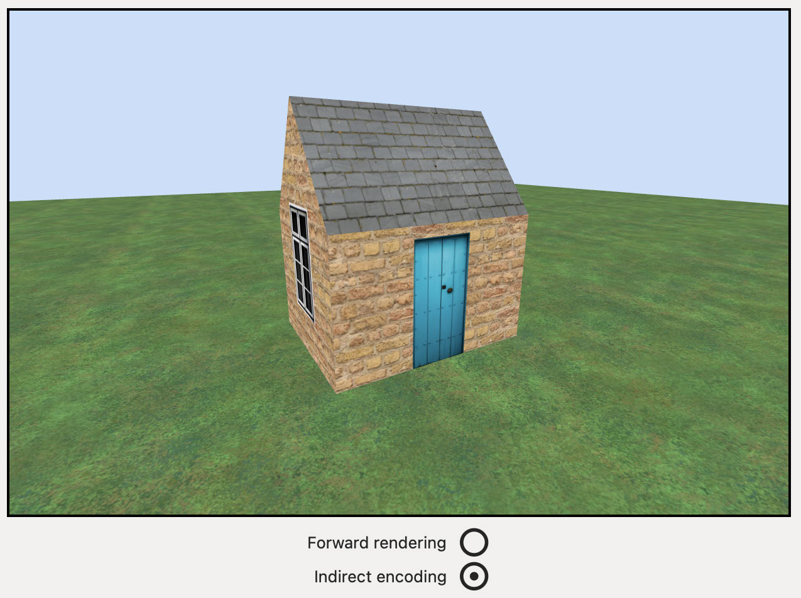

The final render

Capture the GPU workload and examine both the compute command list and the 
render command list — take note where exactly the resources load. Notice how few 
commands there are on the render command coder.

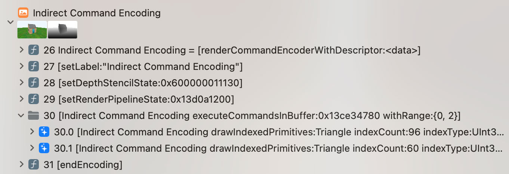

The down-sized render pass

677

Metal by Tutorials
Chapter 26: GPU-Driven Rendering

Challenge

In the challenge folder for this chapter, you’ll find an app similar to the one in the 
previous chapter that includes rendering multiple submeshes. Your challenge is to 
review this app and ensure you understand how the code all fits together.

The app separates out static models (buildings) and dynamic models (skeletons). 
IndirectRenderPass renders the static models, and ForwardRenderPass renders 
the dynamic models. There is nothing conceptually new in the project, but adding 
meshes with multiple submeshes increases the complexity. This app still only loads 
the first mesh for each model.

Key Points

• Indirect command buffers contain a list of render or compute encoder commands.

• You can create the list of commands on the CPU at the start of your app. For 
simple static rendering work, this will be fine.

• Argument buffers should match your shader function parameters. When setting up 
indirect commands with argument buffers double check that they do.

• Argument buffers point to other resources. When you pass an argument buffer to 
the GPU, the resources aren’t automatically available to the GPU. You must also 
use useResource. If you don’t, you’ll get unexpected rendering results.

• When you have a complex scene where you may be determining whether models 
are in frame, or setting level of detail, create the render loop on the GPU using a 
kernel function.

678

Metal by Tutorials
Chapter 26: GPU-Driven Rendering

Where to Go From Here?

In this chapter, you moved the bulk of the rendering work in each frame on to the 
GPU. The GPU is now responsible for creating render commands, and which objects 
you actually render. Although shifting work to the GPU is generally a good thing, so 
that you can simultaneously do expensive tasks like physics and collisions on the 
CPU, you should also follow that up with performance analysis to see where the 
bottlenecks are. You can read more about this in Chapter 31, “Performance 
Optimization”.

GPU-driven rendering is a fairly recent concept, and the best resources are Apple’s 
WWDC sessions listed in references.markdown in the resources folder for this 
chapter.

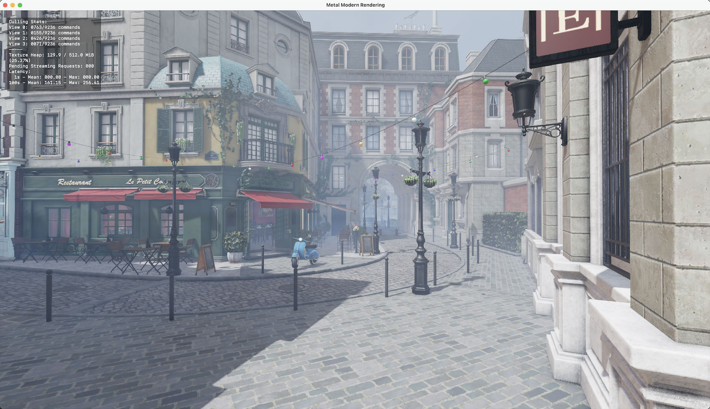

Apple sample: Modern Rendering With Metal

Apple’s sample Modern Rendering with Metal (https://developer.apple.com/
documentation/metal/metal_sample_code_library/modern_rendering_with_metal) 
renders Amazon’s huge Bistro scene, with heavy mesh resources and many lights. 
The sample uses several advanced techniques including indirect command buffers 
for GPU-driven rendering, and is the best project to tear apart and analyze.

679

Section IV: Ray Tracing

In this section, you’ll trace rays to render objects with more realism than the 
rasterization techniques you’ve used up to now. As a bonus, you’ll also do some post-
processing with Metal Performance Shaders. To wrap up, you’ll consider how best to 
profile and optimize your game.

680

27