# Rendering 
With Rays

In previous chapters, you worked with a traditional pipeline model — a raster-
model, which uses a rasterizer to color the pixels on the screen. In this section, you’ll 
learn about another, somewhat different rendering technique: a ray-model.

681

Metal by Tutorials
Chapter 27: Rendering With Rays

Getting Started

In the world of computer graphics, there are two main approaches to rendering 
graphics. The first approach is geometry -> pixels. This approach transforms 
geometry into pixels using the raster-model. The raster-model assumes you know all 
of the models and their geometry (triangles) beforehand.

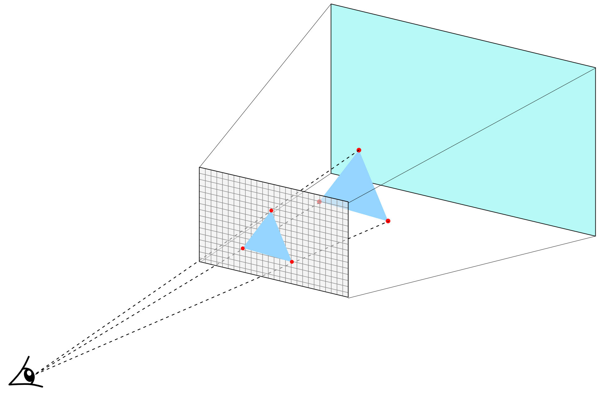

The raster-model

A pseudo-algorithm for the raster-model might look something like this:

for each triangle in the scene: 
  if visible: 
    mark triangle location 
    apply triangle color 
  if not visible: 
    discard triangle

The second approach is pixels -> geometry. This approach involves shooting rays 
from the camera out of the screen and into the scene using the ray-model.

A pseudo-algorithm for the ray-model may look something like this:

for each pixel on the screen: 
  if there's an intersection (hit): 
    identify the object hit 
    change pixel color 
    optionally bounce the ray 
  if there's no intersection (miss): 
    discard ray 
    leave pixel color unchanged

682

Metal by Tutorials
Chapter 27: Rendering With Rays

You’ll be using the ray-model for the remainder of this section.

In ideal conditions, light travels through the air as a ray following a straight line 
until it hits a surface. Once the ray hits something, any combination of the following 
events may happen to the light ray:

• Light gets absorbed into the surface.

• Light gets reflected by the surface.

• Light gets refracted through the surface.

• Light gets scattered from another point under the surface.

When comparing the two models, the raster-model is a faster rendering technique, 
highly optimized for GPUs. This model scales well for larger scenes and implements 
antialiasing with ease. If you’re creating highly interactive rendered content, such as 
1st- and 3rd-person games, the raster-model might be the better choice since pixel 
accuracy is not paramount.

In contrast, the ray-model is more parallelizable and handles shadows, reflection 
and refractions more easily. When you’re rendering static, far away scenes, the ray-
model approach might be the better choice.

The ray-model has a few variants. Among the most popular are ray casting, ray 
tracing, path tracing and raymarching. Before you get started, it’s important to 
understand each.

Ray Casting

In 1968 Arthur Appel introduced ray casting, making it one of the oldest ray-model 
variants. However, it wasn’t until 1992 that it became popular in the world of gaming 
— that’s when Id Software’s programmer, John Carmack, used it for their Wolfenstein 
3D game. With ray casting, the main idea is to cast rays from the camera into the 
scene looking for surfaces the ray can hit. In Wolfenstein 3D, they used a floor map to 
describe all of the surfaces in the scene.

683

Metal by Tutorials
Chapter 27: Rendering With Rays

Because the object height was usually the same across all objects, scanning was fast 
and simple — only one ray needs to be cast for each vertical line of pixels (column).

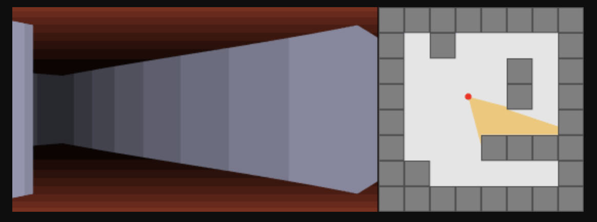

Ray casting

But there’s more to the simplicity and fast performance of this algorithm than 
objects having the same height.

The walls, ceiling and floor each had one specific color and texture, and the light 
source was known ahead of time. With that information, the algorithm could quickly 
calculate the shading of an object, especially since it assumes that when a surface 
faces the light, it will be lit (and not hiding in the shadows).

In its rawest form, a ray casting algorithm states that “For each cell in the floor map, 
shoot a ray from the camera, and find the closest object blocking the ray path.”

The number of rays cast tends to equal the screen width:

For each pixel from 0 to width: 
  Cast ray from the camera 
  If there's an intersection (hit): 
    Color the pixel in object's color 
    Stop ray and go to the next pixel 
  If there's no intersection (miss): 
    Color the pixel in the background color

684

Metal by Tutorials
Chapter 27: Rendering With Rays

Ray casting has a few advantages:

• It’s a high-speed rendering algorithm because it works with scene constraints such 
as the number of rays being equal to the width of the screen — about a thousand 
rays.

• It’s suitable for real-time, highly interactive scenes where pixel accuracy is not 
essential.

• The size occupied on disk is small because scenes don’t need to be saved since 
they’re rendered so fast.

There are also disadvantages to this algorithm:

• The quality of the rendered image looks blocky because the algorithm uses only 
primary rays that stop when they hit an object.

• The scene is limited to basic geometric shapes that can be easily intersected by 
rays.

• The calculations used for intersections are not always precise.

To overcome some of these disadvantages, you’ll learn about another variant of the 
ray-model known as ray tracing.

Ray Tracing

Ray tracing was introduced in 1979 by Turner Whitted. In contrast to ray casting, 
which shoots about a thousand rays into the scene, ray tracing shoots a ray for each 
pixel (width * height), which can easily amount to a million rays!

Advantages of using ray tracing:

• The quality of images rendered is much better than those rendered with ray 
casting.

• The calculations used for intersections are precise.

• The scene can contain any type of geometric shape, and there are no constraints at 
all.

685

Metal by Tutorials
Chapter 27: Rendering With Rays

Of course, there are also disadvantages to using ray tracing:

• The algorithm is way slower than ray casting.

• The rendered images need to be stored on disk because they take a long time to 
render again.

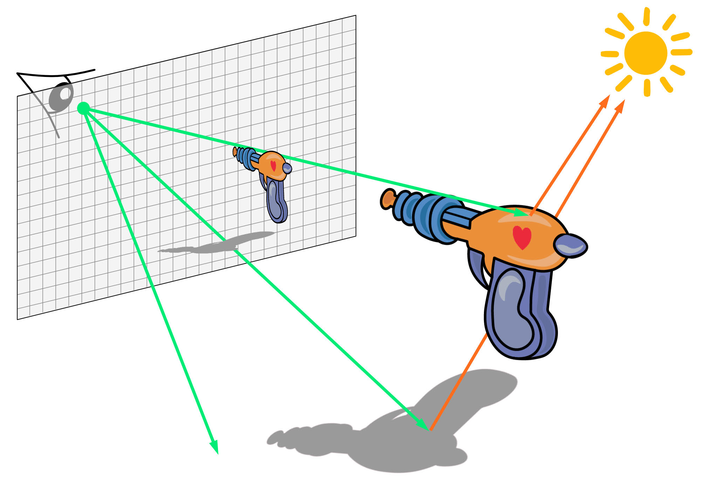

Ray tracing

Whitted’s approach changes what happens when a ray hits a surface.

Here’s his algorithm:

For each pixel on the screen: 
  For each object in the scene: 
    If there's an intersection (hit): 
      Select the closest hit object 
      Recursively trace reflection/refraction rays 
      Color the pixel in the selected object's color

The recursive step of the ray tracing algorithm is what adds more realism and quality 
to ray-traced images. However, the holy grail of realistic rendering is path tracing.

Path Tracing

Path Tracing was introduced as a Monte Carlo algorithm to find a numerical solution 
to an integral part of the rendering equation. James Kajiya presented the rendering 
equation in 1986. You’ll learn more about the rendering equation in Chapter 29, 
“Advanced Lighting”.

686

Metal by Tutorials
Chapter 27: Rendering With Rays

The main idea of the Monte Carlo integration — also known as the Russian Roulette 
method — is to shoot multiple primary rays for each pixel, and when there’s a hit in 
the scene, shoot just K more secondary rays (usually just one more) in a random 
direction for each of the primary rays shot:

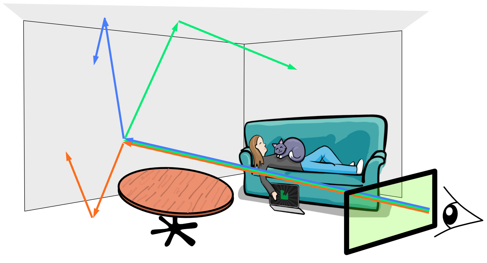

Path Tracing

The path tracing algorithm looks like this:

For each pixel on the screen: 
  Reset the pixel color C. 
    For each sample (random direction): 
      Shoot a ray and trace its path. 
      C += incoming radiance from ray. 
    C /= number of samples

Path tracing has a few advantages over other ray-model techniques:

• It’s a predictive simulation, so it can be used for engineering or other areas that 
need precision.

• It’s photo-realistic if a large enough number of rays are used.

687

Metal by Tutorials
Chapter 27: Rendering With Rays

There are some disadvantages too:

• It’s slow compared to other techniques, so it is mostly used in off-line rendering 
such as for animated movies.

• It needs precisely defined lights, materials and geometry.

Ah, wouldn’t it be great to have a sweet spot where rendering is still close to real-
time, and the image quality is more than acceptable? Enter raymarching!

Raymarching

Raymarching is one of the newer approaches to the ray-model. It attempts to make 
rendering faster than ray tracing by jumping (or marching) in fixed steps along the 
ray, making the time until an intersection occurs shorter.

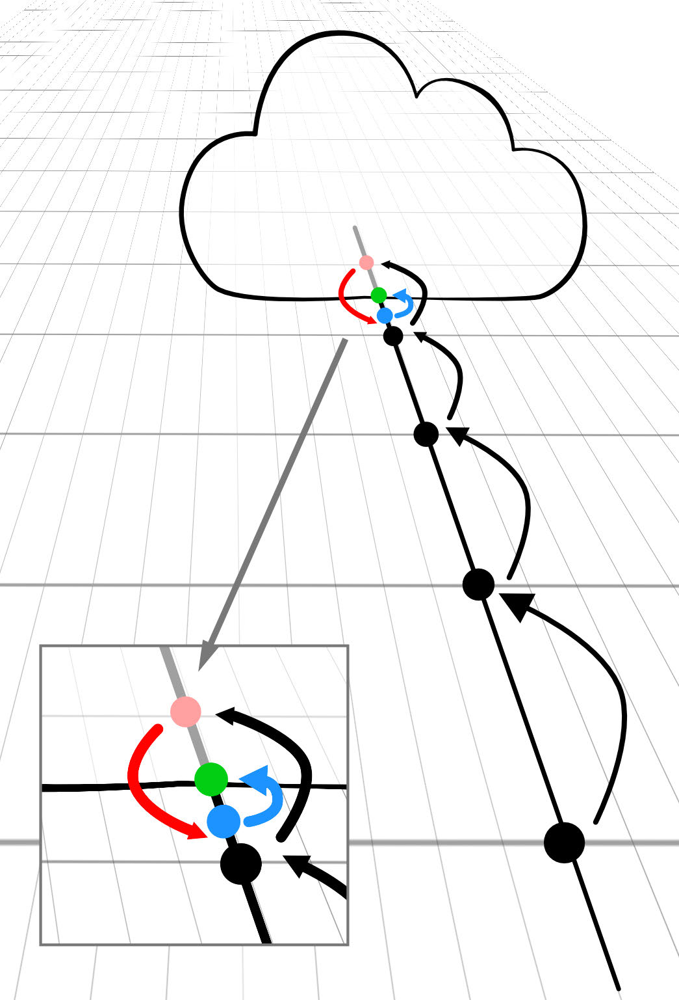

Raymarching

The last jump might end up missing the target. When that happens, you can make 
another jump back but of a smaller size. If you miss the target again, make yet 
another jump even smaller than the previous one, and so on until you are getting 
close enough to the target.

688

Metal by Tutorials
Chapter 27: Rendering With Rays

The algorithm is straightforward:

For each step up to a maximum number of steps: 
  Travel along the ray and check for intersections. 
  If there's an intersection (hit): 
    Color the pixel in object's color 
  If there's no intersection (miss): 
    Color the pixel in the background color 
  Add the step size to the distance traveled so far.

In case the last step is missing the target often, you can retry with a smaller-sized 
step in the algorithm above. A smaller step improves the accuracy for hitting the 
target, but it slows down the total marching time.

In 1996, John Hart introduced sphere tracing which is a faster raymarching 
technique used for rendering implicit surfaces; it uses geometric distance. Sphere 
tracing marches along the ray toward the first intersection in steps guaranteed not 
to go past an implicit surface.

To make a distinction between explicit and implicit surfaces, you need to remember 
that the raster-model works with geometry stored explicitly as a list of vertices and 
indices before rendering.

As you can see in the following image, the rasterized circle is made of line segments 
between vertices:

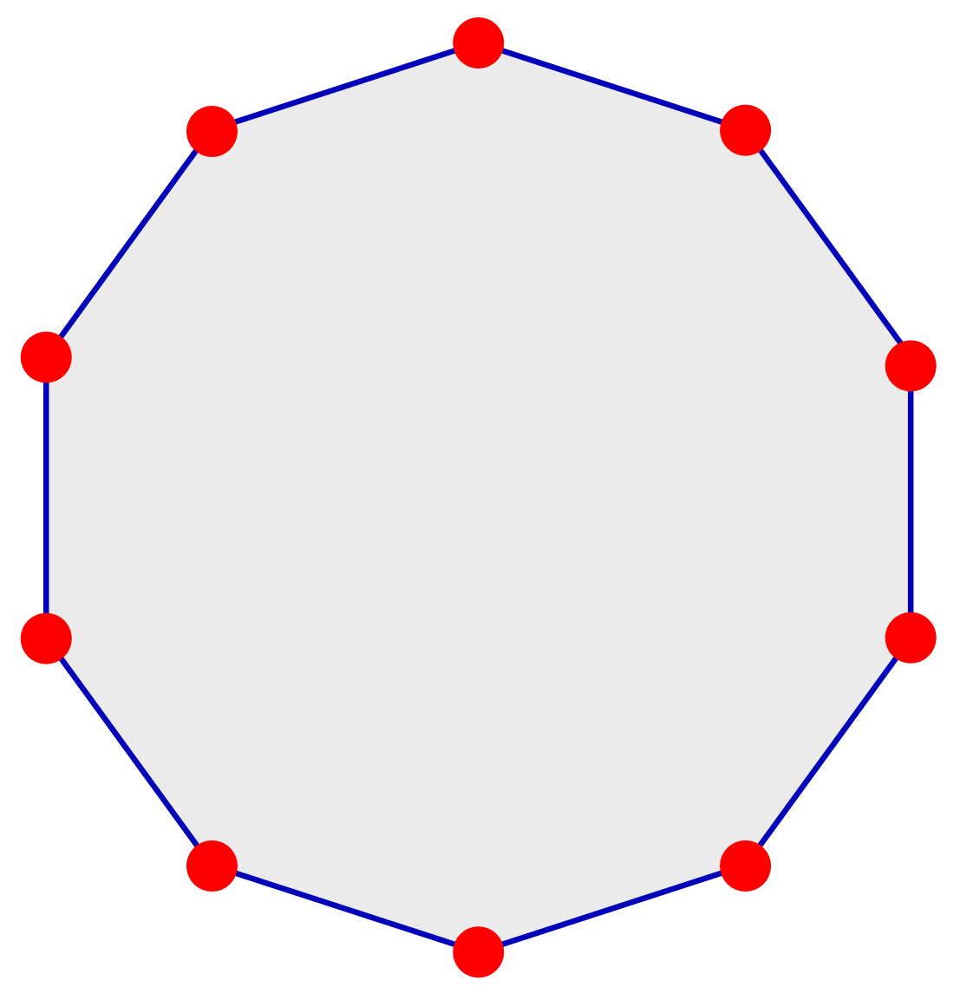

An explicit surface

Implicit surfaces, on the other hand, are shapes described by functions rather than 
by geometry stored before rendering.

689

Metal by Tutorials
Chapter 27: Rendering With Rays

So, in this case, the traced circle is perfectly round as each point on the circle is 
precisely defined by the circle equation:

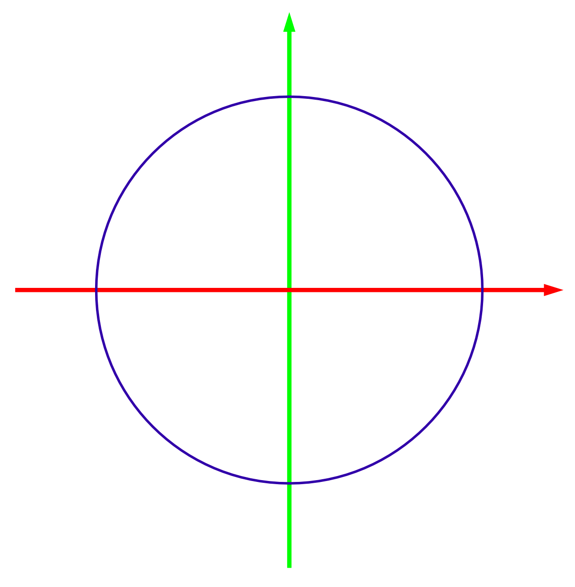

An implicit surface

The function that describes a sphere of radius R is straightforward as well:

This type of function can help you estimate the biggest possible sphere that can fit 
the current marching step. With this technique, you can have variable marching 
steps which help speed up the marching time.

Sphere marching

You’ll look at this new, modified algorithm a bit later because you need first to learn 
how to measure the distance from the current step (ray position) to the nearest 
surface in the scene.

690

Metal by Tutorials
Chapter 27: Rendering With Rays

Signed Distance Functions

Signed Distance Functions (SDF) describe the distance between any given point 
and the surface of an object in the scene. An SDF returns a negative number if the 
point is inside that object or positive otherwise.

SDFs are useful because they allow for reducing the number of samples used by ray 
tracing. The difference between the two techniques is that in ray tracing, the 
intersection is determined by a strict set of equations, while in raymarching the 
intersection is approximated. Using SDFs, you can march along the ray until you get 
close enough to an object. Close enough is inexpensive to compute compared to 
precisely determining intersections.

All right, time to finally write some code!

The Starter App

➤ In Xcode, build and run the starter app included with this chapter.

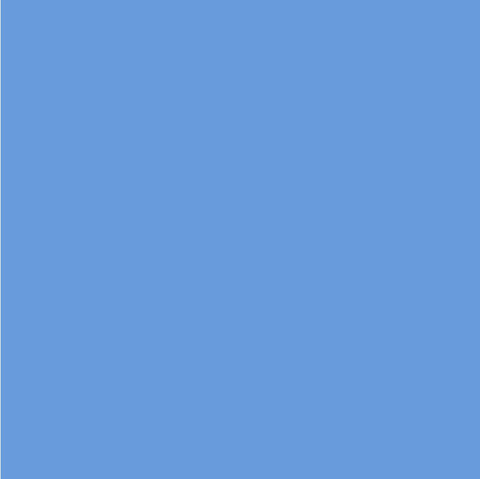

The starter app

The app contains a SwiftUI view, a Renderer and a Metal shaders file. 
Renderer.swift contains the Metal rendering code, which simply consists of setting 
up a compute command encoder which dispatches threads to a compute function on 
every frame.

For this section, you’ll be working solely in Shaders.metal, which contains the 
compute function that draws to the view’s drawable texture.

691

Metal by Tutorials
Chapter 27: Rendering With Rays

Note: Instead of building and running all the time, depending on your 
computer and Xcode, you may be able to preview the app in the SwiftUI 
canvas. Open ContentView.swift and show the SwiftUI Canvas in the 
assistant editor. Choose iPad as the destination and pin the view. Pinning the 
view means that it stays in the assistant editor when you change files. When 
you update and save the compute shader, the preview will update.

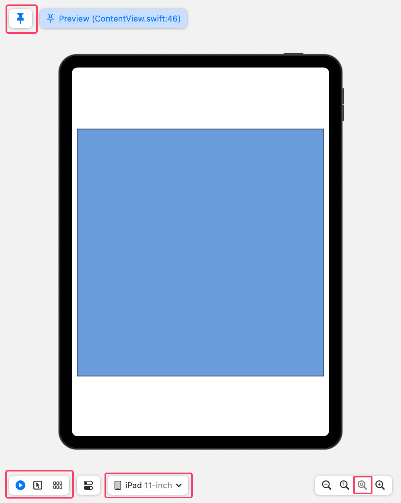

iPad SwiftUI preview

Using a Signed Distance Function

➤ Open Shaders.metal, and within the kernel function, add this code between // 
Edit start and // Edit end:

// 1 
float radius = 0.25; 
float2 center = float2(0.0); 
// 2 
float distance = length(uv - center) - radius;

692

Metal by Tutorials
Chapter 27: Rendering With Rays

// 3 
if (distance < 0.0) { 
  color = float4(1.0, 0.85, 0.0, 1.0); 
}

Going through the code:

1. Define the radius and center of the circle.

2. Create an SDF that can find the distance to this circle from any point on the 
screen.

3. Check the sign of the distance variable. If it’s negative, it means the point is 
inside the circle, so change the color to yellow.

Note: You learned earlier that the function that describes a circle is F(X,Y) = 
X^2 + Y^2 - R^2 which is what you used for the SDF. Since the center is at 
(0, 0) you can more easily recognize the function in this reduced form 
instead: dist = length(uv) - radius.

➤ Build and run (or preview ContentView in the SwiftUI canvas), and you’ll see a 
yellow circle in the middle of the screen:

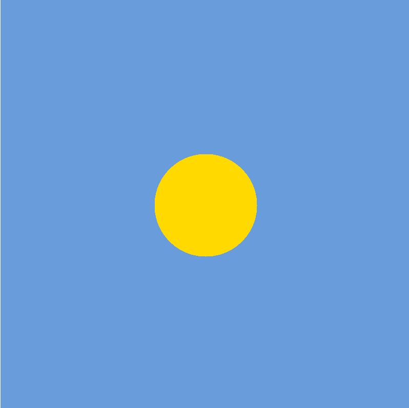

A yellow circle drawn with an SDF

Now that you know how to calculate the distance to a circle from any point on the 
screen, you can apply the same principle and calculate the distance to a sphere too.

693

Metal by Tutorials
Chapter 27: Rendering With Rays

The Raymarching Algorithm

➤ Add the following above the kernel function:

struct Sphere { 
  float3 center; 
  float radius; 
  Sphere(float3 c, float r) { 
    center = c; 
    radius = r; 
  } 
};

A Sphere has a center, a radius and a constructor, so you can build a sphere with the 
provided arguments.

➤ Next, create a structure for the ray you’ll march along in the scene:

struct Ray { 
  float3 origin; 
  float3 direction; 
  Ray(float3 o, float3 d) { 
    origin = o; 
    direction = d; 
  } 
};

A Ray has the ray origin, direction and a constructor.

➤ Add the following code below the code you just added:

float distanceToSphere(Ray r, Sphere s) { 
  return length(r.origin - s.center) - s.radius; 
}

You create an SDF for calculating the distance from a given point to the sphere. The 
difference from the old function is that your point is now marching along the ray, so 
you use the ray position instead.

Remember the raymarching algorithm you saw earlier?

For each step up to a maximum number of steps: 
  Travel along the ray and check for intersections. 
  If there's an intersection (hit): 
    Color the pixel in object's color 
  If there's no intersection (miss): 
    Color the pixel in the background color 
  Add the step size to the distance traveled so far.

694

Metal by Tutorials
Chapter 27: Rendering With Rays

You can now turn that into code. The first thing you need is a ray to march along 
with the sphere.

➤ Inside the kernel function, replace the code between //Edit start and // Edit 
end with:

color = 0.0; 
// 1 
Sphere s = Sphere(float3(0.0), 1.0); 
Ray ray = Ray(float3(0.0, 0.0, -3.0), 
              normalize(float3(uv, 1.0))); 
// 2 
for (int i = 0.0; i < 100.0; i++) { 
  float distance = distanceToSphere(ray, s); 
  if (distance < 0.001) { 
    color = float4(1.0); 
    break; 
  } 
  ray.origin += ray.direction * distance; 
}

Going through the code:

1. Create a sphere object and a ray. You need to normalize the direction of the ray to 
make sure its length will always be 1 thus making sure the ray will never miss the 
object by overshooting the ray beyond the intersection point.

2. Loop enough times to get acceptable precision. On each iteration, calculate the 
distance from the current position along the ray to the sphere while also 
checking the distance against 0.001, a number small enough that’s still not zero 
to make sure you’re not yet touching the sphere. If you did, color it white. 
Otherwise, update the ray position by moving it closer to the sphere.

Note: You use 100 in this case, but you can try with an increased number of 
steps to see how the quality of the rendered image improves — being at the 
expense of more GPU time used, of course.

That’s it! That loop is the essence of raymarching.

695

Metal by Tutorials
Chapter 27: Rendering With Rays

➤ Build and run the app:

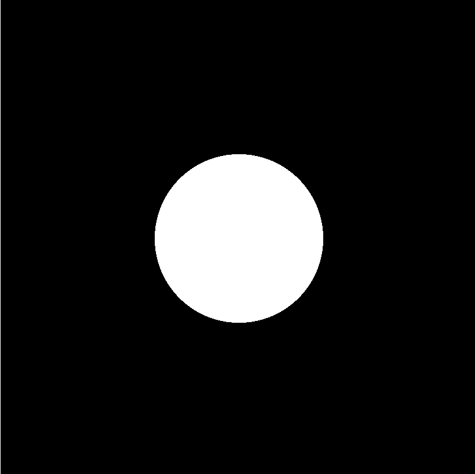

A raymarched sphere

What if you want other objects or even more spheres in the scene? You can do that 
with a neat instancing trick.

➤ First, set up the sphere and ray. Replace these lines inside the kernel function:

Sphere s = Sphere(float3(0.0), 1.0); 
Ray ray = Ray(float3(0.0, 0.0, -3.0), 
              normalize(float3(uv, 1.0)));

➤ With:

Sphere s = Sphere(float3(1.0), 0.5); 
Ray ray = Ray(float3(1000.0), normalize(float3(uv, 1.0)));

Here, you position the sphere at (1, 1, 1) and set its radius to 0.5. This means the 
sphere is now contained in the [0.5 - 1.5] range. The ray origin is now much 
farther away to give you plenty of range for the number of steps you’ll use for 
marching.

Create a function that takes in a ray as the only argument. All you care about now is 
to find the shortest distance to a complex scene that contains multiple objects.

696

Metal by Tutorials
Chapter 27: Rendering With Rays

➤ Place this function below distanceToSphere:

float distanceToScene(Ray r, Sphere s, float range) { 
  // 1 
  Ray repeatRay = r; 
  repeatRay.origin = fmod(r.origin, range); 
  // 2 
  return distanceToSphere(repeatRay, s); 
}

1. You make a local copy of the ray (a.k.a. that neat trick to do instancing). By using 
the fmod or modulo function on the ray’s origin, you effectively repeat the space 
throughout the entire screen. This creates an infinite number of spheres, each 
with its own (repeated) ray. You’ll see an example next that should help you 
understand this better.

2.
distanceToSphere returns the value of the repeated ray.

Now, call the function from inside compute’s for loop.

➤ Replace the following line:

➤ With this:

You send a range of 2.0, so the sphere fits safely inside this range.

➤ Build and run:

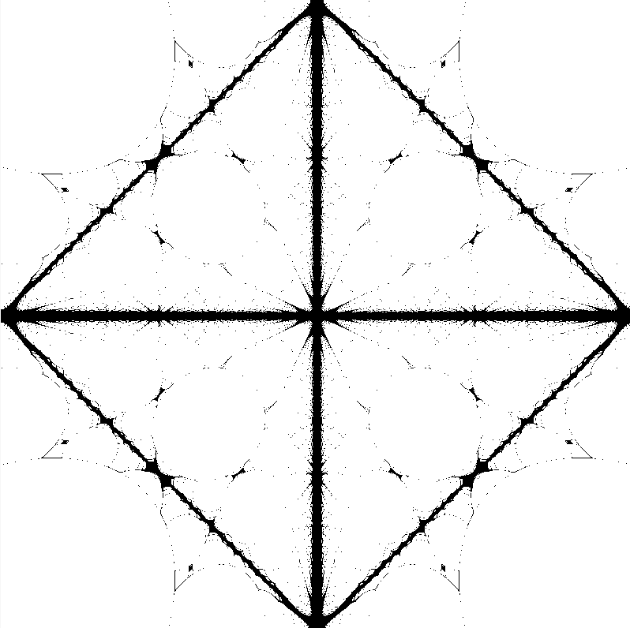

Interesting, but not spheres

Um, it’s interesting, but where is the promised infinite number of spheres?

697

Metal by Tutorials
Chapter 27: Rendering With Rays

➤ In compute, just before // Edit end, add this:

That line is complex. You multiply the color with the ray’s current position, which is 
conveniently offset by 1000 to match its initial origin. Next, you divide by 10.0 to 
scale down the result, which would be bigger than 1.0 and give you a solid white. 
Then, you guard against negative values by using the abs function because the left 
side of the screen x is lower than 0 which would give you a solid black.

So at this moment, your X and Y values are between [0, 1], which is what you need 
to draw colors, and then these colors are also mirrored top/bottom and left/right.

➤ Build and run now, and you’ll see the following:

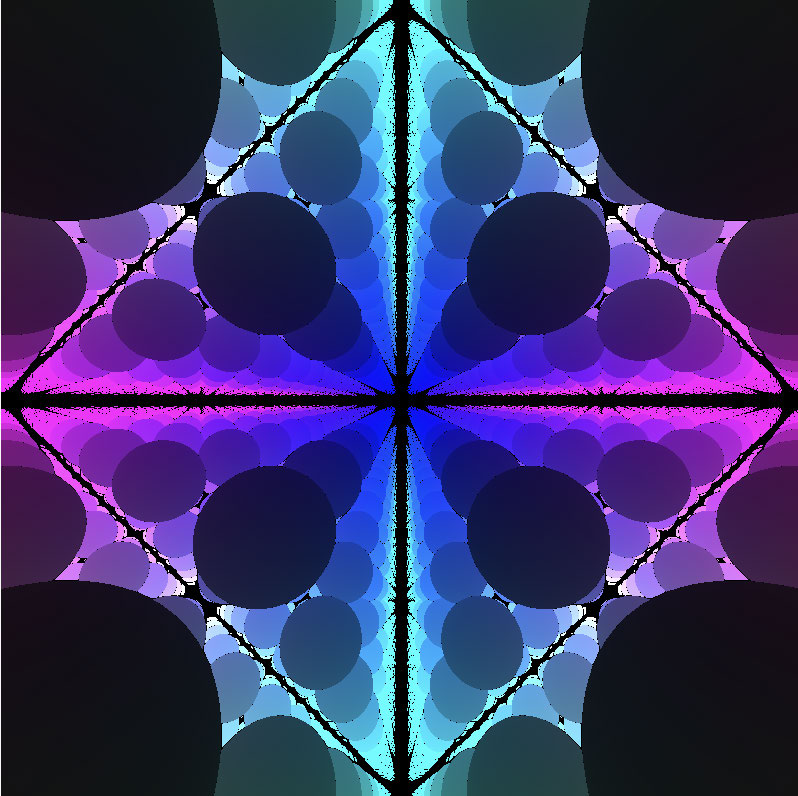

Infinite spheres

There’s one more exciting thing you can do to this scene: animate it!

The kernel function already provides you with a convenient timer variable which 
Renderer updates on the CPU:

To create the sensation of movement, you can plug it into a ray’s coordinates. You 
can even use math functions such as sin and cos to make the movement look like a 
spiral.

But first, you need to create a camera and make that move along the ray instead.

➤ Inside compute, replace this:

698

Metal by Tutorials
Chapter 27: Rendering With Rays

➤ With:

float3 cameraPosition = float3( 
  1000.0 + sin(time) + 1.0, 
  1000.0 + cos(time) + 1.0, 
  time); 
Ray ray = Ray(cameraPosition, normalize(float3(uv, 1.0)));

You replaced the static ray origin with one that changes over time. The X and Y 
coordinates move the sphere in a circular pattern while the Z coordinate moves it 
more into the screen.

The 1.0 that you added to both X and Y coordinates is there to prevent the camera 
from crashing into the nearest sphere.

➤ Now, replace this:

➤ With:

float3 positionToCamera = ray.origin - cameraPosition; 
color *= float4(abs(positionToCamera / 10.0), 1.0);

➤ Build and run the app, and let yourself be mesmerized by the trippy animation. 
But not for too long. There’s still work you need to do.

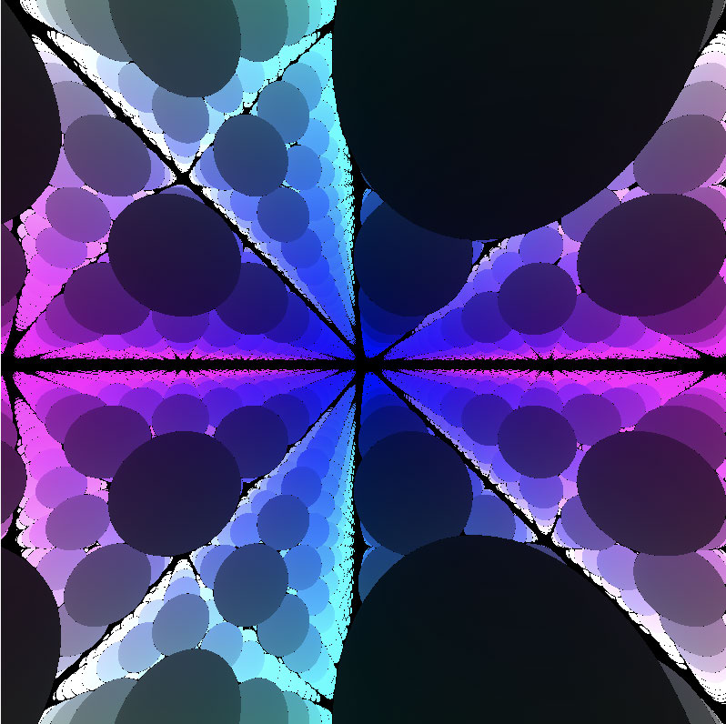

Animated spheres

All right, you need to master one more skill before you can create beautifully 
animated clouds: random noise.

699

Metal by Tutorials
Chapter 27: Rendering With Rays

Creating Random Noise

Noise, in the context of computer graphics, represents perturbations in the expected 
pattern of a signal. In other words, noise is everything the output contains but was 
not expected to be there. For example, pixels with different colors that make them 
seem misplaced among neighboring pixels.

Noise is useful in creating random procedural content such as fog, fire or clouds. 
You’ll work on creating clouds later, but you first need to learn how to handle noise. 
Noise has many variants such as Value noise and Perlin noise. However, for the sake 
of simplicity, you’ll only work with value noise in this chapter.

Value noise uses a method that creates a lattice of points which are assigned random 
values. The noise function returns a number based on the interpolation of values of 
the surrounding lattice points.

Octaves are used in calculating noise to express the multiple irregularities around 
us. For each octave, you run the noise functions with a different frequency (the 
period at which data is sampled) and amplitude (the range at which the result can be 
in). Multiple octaves of this noise can be generated and then summed together to 
create a form of fractal noise.

The most apparent characteristic of noise is randomness. Since Metal Shading 
Language does not provide a random function, you’ll need to create one yourself. 
You need a random number between [0, 1], which you can get by using the fract 
function. This returns the fractional component of a number.

You use a pseudorandom number generator technique that creates sequences of 
numbers whose properties approximate the properties of sequences of random 
numbers. This sequence is not truly random because it’s determined by an initial 
seed value which is the same every time the program runs.

➤ Add the following code above compute:

float randomNoise(float2 p) { 
  return fract(6791.0 * sin(47.0 * p.x + 9973.0 * p.y)); 
}

The values used in this function are all prime numbers because they’re guaranteed 
not to return the same fractional part for a different number that would otherwise 
divide it — one of its factors.

700

Metal by Tutorials
Chapter 27: Rendering With Rays

➤ Inside compute, replace all the code between // Edit start and // Edit end 
with:

float noise = randomNoise(uv); 
color = float4(float3(noise), 1);

➤ Build and run, and you’ll see a pretty decent noise pattern like this one:

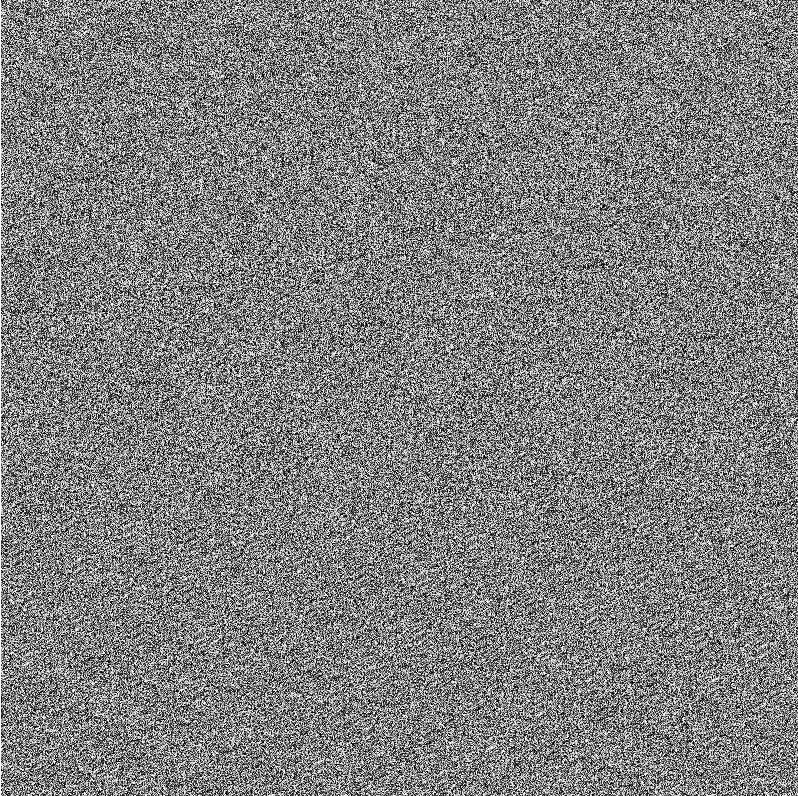

Noise

You can simulate a zooming-in effect by implementing tiling. Tiling splits the view 
into many tiles of equal size, each with its own solid color.

In compute, right above this line:

➤ Add this:

float tiles = 8.0; 
uv = floor(uv * tiles);

➤ Build and run again, and you’ll see the tiles:

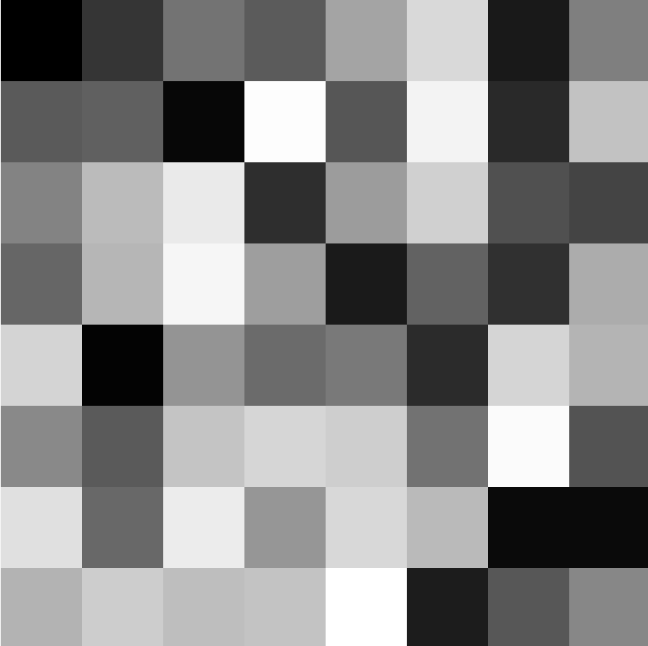

Tiled noise

701

Metal by Tutorials
Chapter 27: Rendering With Rays

This pattern, however, is far too heterogeneous. What you need is a smoother noise 
pattern where colors are not so distinctive from the adjacent ones.

To smooth out the noise pattern, you’ll make use of pixel neighborhoods, also 
known as convolution kernels in the world of image processing. One such famous 
convolution grid is the Von Neumann neighborhood:

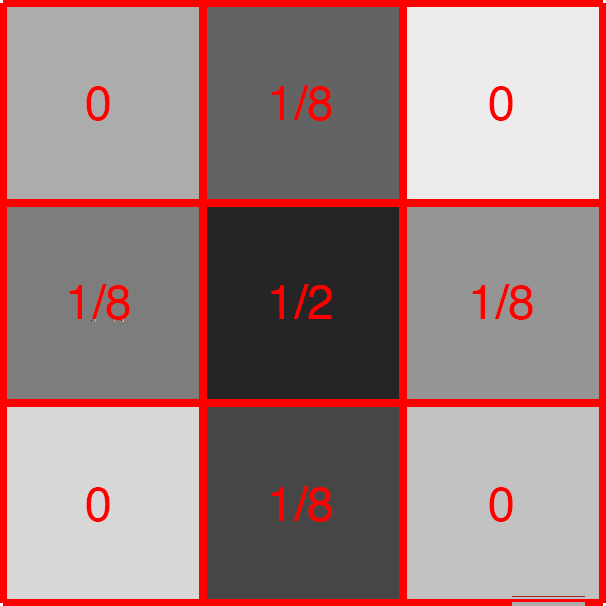

Convolution

Neighborhood averaging produces a blurry result. You can easily express this grid 
with code.

➤ In Shaders.metal, create a new function above compute:

float smoothNoise(float2 p) { 
  // 1 
  float2 north = float2(p.x, p.y + 1.0); 
  float2 east = float2(p.x + 1.0, p.y); 
  float2 south = float2(p.x, p.y - 1.0); 
  float2 west = float2(p.x - 1.0, p.y); 
  float2 center = float2(p.x, p.y); 
  // 2 
  float sum = 0.0; 
  sum += randomNoise(north) / 8.0; 
  sum += randomNoise(east) / 8.0; 
  sum += randomNoise(south) / 8.0; 
  sum += randomNoise(west) / 8.0; 
  sum += randomNoise(center) / 2.0; 
  return sum; 
}

Going through the code:

1. Store the coordinates for the central pixel and the neighbors located at the four 
cardinal points relative to the central pixel.

2. Calculate the value noise for each of the stored coordinates and divide it by its 
convolution weight. Add each of these values to the total noise value sum.

702

Metal by Tutorials
Chapter 27: Rendering With Rays

➤ Now, at the end of compute, replace this line:

➤ With this one:

➤ Build and run, and you’ll see a smoother noise pattern:

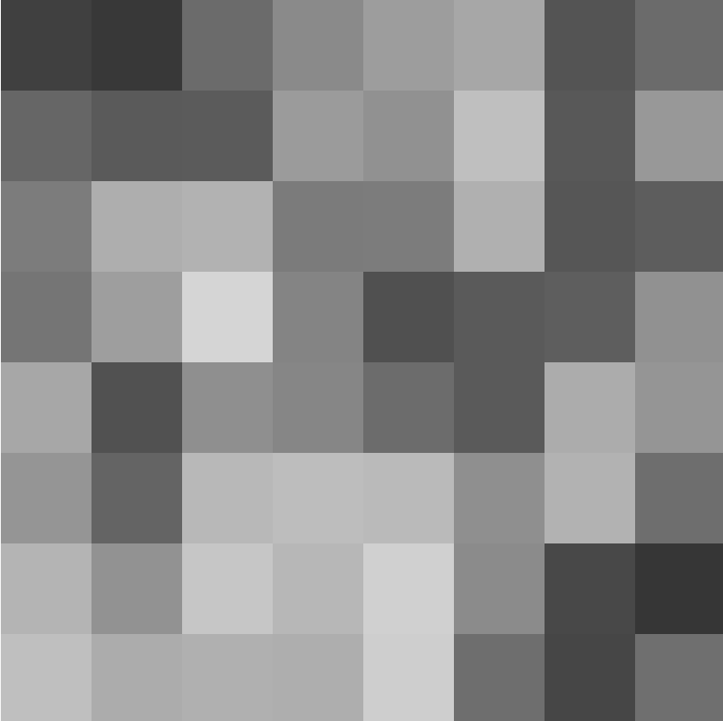

More homogeneous noise

The tiles are still distinct from one another, but notice how the colors are now more 
homogeneous.

The next step is to smooth the edges between tiles, making them look borderless. 
This is done with bilinear interpolation. In other words, you mix the colors at the 
endpoints of a line to get the color at the middle of the line.

In the following image you have the Q values located in the tile corners. Q11 has a 
black color. Q21 has a gray color from the tile to its right. The R1 value can be 
computed by interpolating these two values. Similarly, for Q12 and Q22, the value for 
R2 can be obtained. Finally, the value of P will be obtained by interpolating the value 
of R1 and R2:

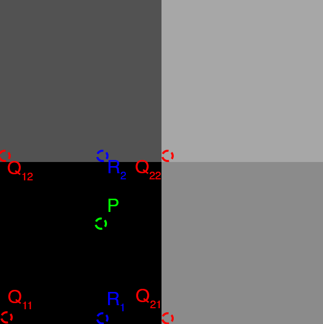

Interpolation

703

Metal by Tutorials
Chapter 27: Rendering With Rays

➤ In Shaders.metal, add this function before compute:

float interpolatedNoise(float2 p) { 
  // 1 
  float q11 = smoothNoise(float2(floor(p.x), floor(p.y))); 
  float q12 = smoothNoise(float2(floor(p.x), ceil(p.y))); 
  float q21 = smoothNoise(float2(ceil(p.x), floor(p.y))); 
  float q22 = smoothNoise(float2(ceil(p.x), ceil(p.y))); 
  // 2 
  float2 ss = smoothstep(0.0, 1.0, fract(p)); 
  float r1 = mix(q11, q21, ss.x); 
  float r2 = mix(q12, q22, ss.x); 
  return mix (r1, r2, ss.y); 
}

Going through the code:

1. Sample the value noise in each of the four corners of the tile.

2. Use smoothstep for cubic interpolation. Mix the corner colors to get the R and P 
colors.

➤ In compute, replace these lines:

float tiles = 8.0; 
uv = floor(uv * tiles); 
float noise = smoothNoise(uv);

➤ With:

float tiles = 4.0; 
uv *= tiles; 
float noise = interpolatedNoise(uv);

➤ Build and run, and you’ll see a smoother noise pattern:

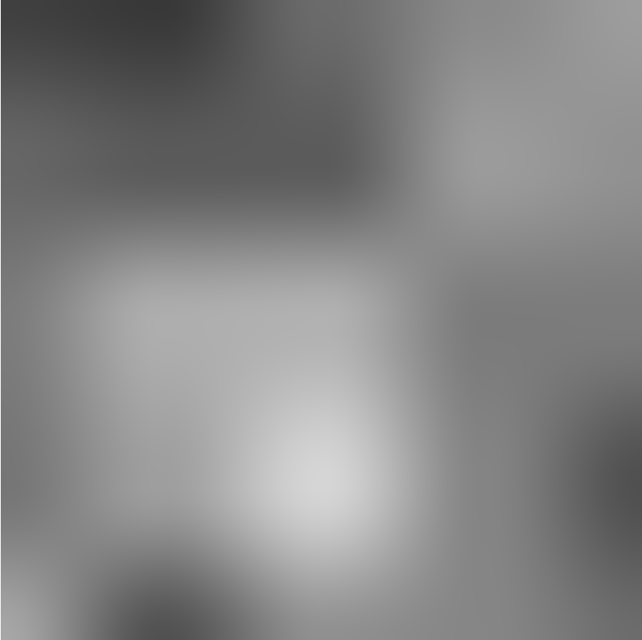

Smoother noise

704

Metal by Tutorials
Chapter 27: Rendering With Rays

FBm Noise

The noise pattern looks good, but you can still improve it with the help of another 
technique called fractional Brownian motion (fBm). By applying an amplitude 
factor to octaves of noise, the noise becomes more focused and sharper. What’s 
unique about fBm is that when you zoom in on any part of the function, you’ll see a 
similar result in the zoomed-in part.

➤ Add the following code above compute:

float fbm(float2 uv, float steps) { 
  // 1 
  float sum = 0; 
  float amplitude = 0.8; 
  for(int i = 0; i < steps; ++i) { 
    // 2 
    sum += interpolatedNoise(uv) * amplitude; 
    // 3 
    uv += uv * 1.2; 
    amplitude *= 0.4; 
  } 
  return sum; 
}

Going through the code:

1. Initialize the accumulation variable sum to 0 and the amplitude factor to a value 
that satisfies your need for the noise quality (try out different values).

2. At each step, compute the value noise attenuated by amplitude and add it to the 
sum.

3. Update both the location and amplitude values (again, try out different values).

➤ In compute, replace this line:

➤ With:

Here, you use the value of tiles in place of steps just because they coincidentally 
have the same value, but you could have created a new variable named steps if you 
wanted it to be a different value than four. By adding four octaves of noise at 
different amplitudes, you generate a simple gaseous-like pattern.

705

Metal by Tutorials
Chapter 27: Rendering With Rays

➤ Build and run:

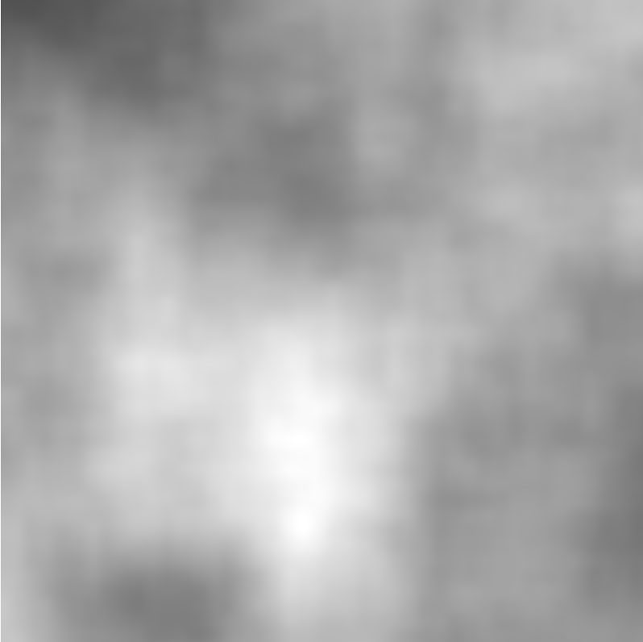

fBm noise

Fantastic! You’re almost done, but there’s one more stop: marching clouds.

Marching Clouds

All right, it’s time to apply what you’ve learned about signed distance fields, random 
noise and raymarching by making some marching clouds.

➤ Still in Shaders.metal, add the following code after the Ray structure:

struct Plane { 
  float yCoord; 
  Plane(float y) { 
    yCoord = y; 
  } 
};

float distanceToPlane(Ray ray, Plane plane) { 
  return ray.origin.y - plane.yCoord; 
}

float distanceToScene(Ray r, Plane p) { 
  return distanceToPlane(r, p); 
}

This is similar to what you used in the raymarching section. Instead of a Sphere, 
however, you create a Plane for the ground, an SDF for the plane and another one for 
the scene. You’re only returning the distance to the plane in the scene at the 
moment.

706

Metal by Tutorials
Chapter 27: Rendering With Rays

Everything else from now on happens inside compute.

➤ Replace these lines:

uv *= tiles; 
float noise = fbm(uv, tiles); 
color = float4(float3(noise), 1);

➤ With:

float2 noise = uv; 
noise.x += time * 0.1; 
noise *= tiles; 
float3 clouds = float3(fbm(noise, tiles)); 
color = float4(clouds, 1);

You add time to the X coordinate, attenuated by 0.1 to slow the movement down a 
bit.

➤ Build and run, and you’ll see the noise pattern gently moving to the left side.

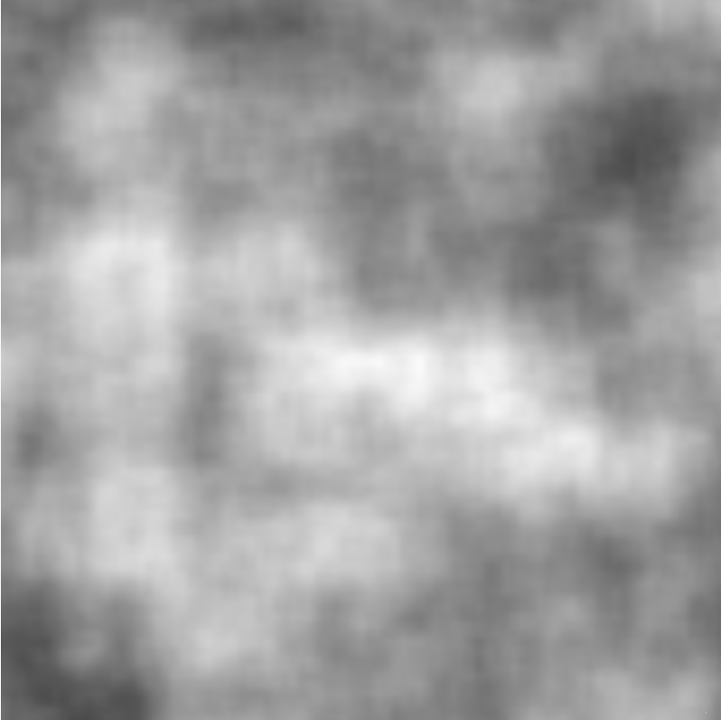

Animated noise

➤ Add this below the previous code:

// 1 
float3 land = float3(0.3, 0.2, 0.2); 
float3 sky = float3(0.4, 0.6, 0.8); 
clouds *= sky * 3.0; 
// 2 
uv.y = -uv.y; 
Ray ray = Ray(float3(0.0, 4.0, -12.0), 
              normalize(float3(uv, 1.0))); 
Plane plane = Plane(0.0); 
// 3

707

Metal by Tutorials
Chapter 27: Rendering With Rays

for (int i = 0.0; i < 100.0; i++) { 
  float distance = distanceToScene(ray, plane); 
  if (distance < 0.001) { 
    clouds = land; 
    break; 
  } 
  ray.origin += ray.direction * distance; 
} 
color = float4(clouds, 1);

Going through the code:

1. Set the colors for the clouds and the sky; then, add the sky color to the noise for a 
bluish effect.

2. Since the image is upside down, you reverse the Y coordinate. Create a ray and a 
plane object.

3. Apply the raymarching algorithm you learned in the previous section.

➤ Build and run one final time, and you’ll see marching clouds above the ground 
plane:

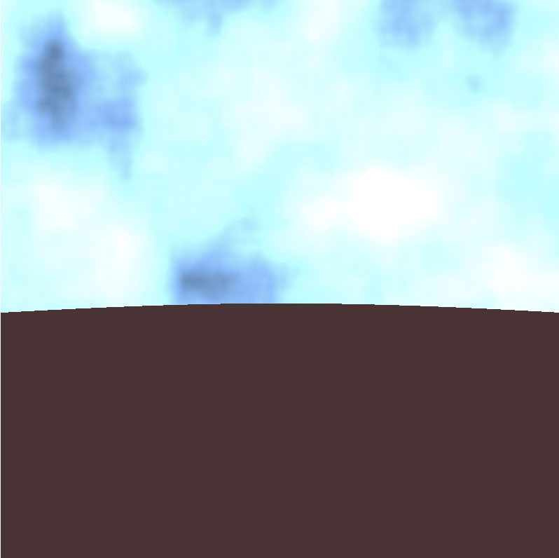

Marching clouds

So. Much. Beautiful.

708

Metal by Tutorials
Chapter 27: Rendering With Rays

Key Points

• Ray casting, ray tracing, path tracing and raymarching are all ray-model rendering 
algorithms that you create in kernel functions, rather than using the rasterizing 
pipeline with vertex and fragment functions.

• Signed distance functions (SDF) describe the distance between points and object 
surfaces. The function returns a negative value when the point is inside the object.

• You can’t generate random numbers directly on the GPU. You can use fractions of 
prime numbers to produce a pseudo random number.

• Fractional Brownian motion (fBm) filters octaves of noise with frequency and 
amplitude settings to produce a finer noise granularity (with more detail in the 
noise).

709

28