# Advanced 
Shadows

Shadows and lighting are important topics in Computer Graphics. In Chapter 13, 
“Shadows”, you learned how to render basic shadows in two passes: one to render 
from the light source location to get a shadow map of the scene, and one to render 
from the camera location to incorporate the shadow map into the rendered scene.

Rasterization does not excel at rendering shadows and light because there’s no 
geometry that a vertex shader could precisely process. So now you’ll learn how to do 
it differently.

Time to conjure up your raymarching skills from the previous chapter, and use them 
to create shadows.

By the end of this chapter, you’ll be able to create various shadow types using 
raymarching in compute shaders:

• Hard shadows.

• Soft shadows.

• Ambient Occlusion.

710

Metal by Tutorials
Chapter 28: Advanced Shadows

Hard Shadows

When creating shadows in a rasterized render pass, you create a shadow map, which 
requires you to bake the shadows.

With raymarching, you make use of signed distance fields (SDF). An SDF is a real-
time tool that provides you with the precise distance to a boundary. This makes 
calculating shadows easy as they come for “free”, meaning that all of the information 
you need to compute shadows already exists and is available because of the SDF.

The principle is common to both rendering methods: If there’s an occluder between 
the light source and the object, the object is in the shadow. Otherwise, it’s lit.

Great! Time to put that wisdom down in code.

The Starter App

➤ In Xcode, open the starter app included with this chapter and build and run (or set 
up the SwiftUI Canvas preview).

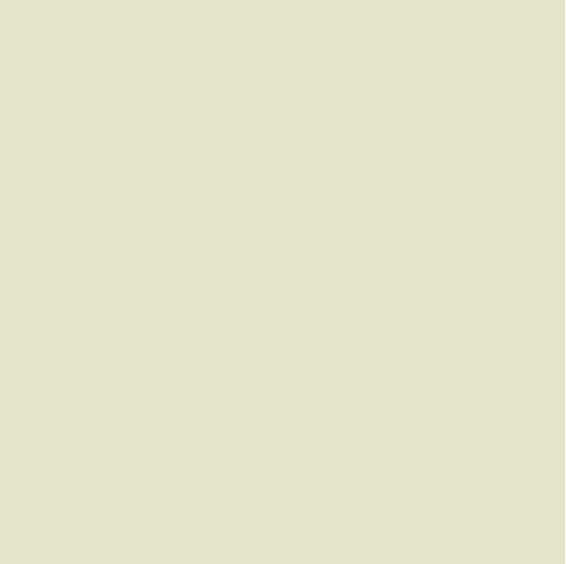

The starter app

You start with an empty view.

Like you did in the previous chapter, you’ll work solely in Shaders.metal and, aside 
from adding structures and functions, edit code in compute only between // Edit 
start and // Edit end.

711

Metal by Tutorials
Chapter 28: Advanced Shadows

➤ Open Shaders.metal, and add this before compute:

struct Rectangle { 
  float2 center; 
  float2 size; 
};

This structure will hold rectangle objects with a center and a size.

Next, you’ll add a function that gets the distance from any point on the screen to a 
given rectangle boundary. If its return value is positive, a given point is outside the 
rectangle; all other values are inside the rectangle.

➤ Add the following code below the previous code:

float distanceToRectangle(float2 point, Rectangle rectangle) { 
  // 1 
  float2 distances = 
      abs(point - rectangle.center) - rectangle.size / 2; 
  return 
    // 2 
    all(sign(distances) > 0) 
    ? length(distances) 
    // 3 
    : max(distances.x, distances.y); 
}

Going through the code:

1. Offset the current point coordinates by the given rectangle center. Then, get the 
symmetrical coordinates of the given point by using the abs() function, and 
calculate the signed distance to each of the two edges.

2. If those two distances are positive, then you’ll need to calculate the distance to 
the corner.

3. Otherwise, return the distance to the closer edge.

Note: In this case, rectangle.size / 2 is the distance from the rectangle 
center to an edge, similar to what a radius is for a circle.

712

Metal by Tutorials
Chapter 28: Advanced Shadows

Next, is a handy function that lets you subtract one shape from another. Think about 
Set Theory from back in your school days.

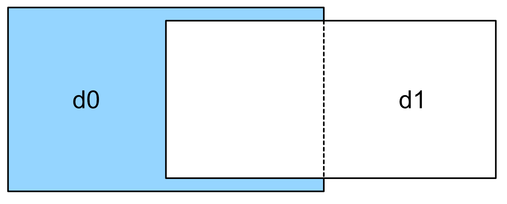

Shape subtraction

Note: You can find out more about Set Theory here: https://en.wikipedia.org/
wiki/Complement_(set_theory)#Relative_complement

➤ Add this function to Shaders.metal before compute:

float differenceOperator(float d0, float d1) { 
  return max(d0, -d1); 
}

This code yields a value that can be used to calculate the difference result from the 
previous image, where the second shape is subtracted from the first. The result of 
this function is a signed distance to a compound shape boundary. It’ll only be 
negative when inside the first shape, but outside the second.

➤ Continue by adding this code to design a basic scene:

float distanceToScene(float2 point) { 
  // 1 
  Rectangle r1 = Rectangle{float2(0.0), float2(0.3)}; 
  float d2r1 = distanceToRectangle(point, r1); 
  // 2 
  Rectangle r2 = Rectangle{float2(0.05), float2(0.04)}; 
  float2 mod = point - 0.1 * floor(point / 0.1); 
  float d2r2 = distanceToRectangle(mod, r2); 
  // 3 
  float diff = differenceOperator(d2r1, d2r2); 
  return diff; 
}

713

Metal by Tutorials
Chapter 28: Advanced Shadows

Going through the code:

1. Create a rectangle, and get the distance to it.

2. Create a second, smaller rectangle, and get the distance to it. The difference here 
is that the area is repeated every 0.1 points — which is a 10th of the size of the 
scene — using a modulo operation. See the note below.

3. Subtract the second repeated rectangle from the first rectangle, and return the 
resulting distance.

Note: The fmod function in MSL uses trunc instead of floor, so you create a 
custom mod operator because you also want to use the negative values. You 
use the GLSL specification for mod which is x - y * floor(x/y). You need 
the modulus operator to draw many small rectangles mirrored with a distance 
of 0.1 from each other.

Finally, use these functions to generate a shape that looks a bit like a fence or a 
trellis.

➤ In compute, add this code before // Edit end:

float d2scene = distanceToScene(uv); 
bool inside = d2scene < 0.0; 
color = inside ? float4(0.8,0.5,0.5,1.0) : 
  float4(0.9,0.9,0.8,1.0);

➤ Build and run the app:

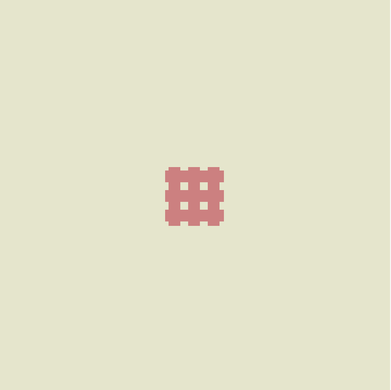

The initial scene

714

Metal by Tutorials
Chapter 28: Advanced Shadows

For shadows to work, you need to:

1. Get the distance to the light.

2. Know the light direction.

3. Step in that direction until you either reach the light or hit an object.

➤ In compute, add this code before // Edit end:

float2 lightPos = 2.8 * float2(sin(time), cos(time)); 
float dist2light = length(lightPos - uv); 
color *= max(0.3, 2.0 - dist2light);

First, you create a light at position lightPos, which you’ll animate just for fun using 
the timer uniform that you passed from the host code. Then, you get the distance 
from any given point to lightPos, and you color the pixel based on the distance 
from the light — but only if it’s not inside an object. You make the color lighter when 
closer to the light, and darker when further away with the max() function to avoid 
negative values for the brightness of the light.

➤ Build and run the app.

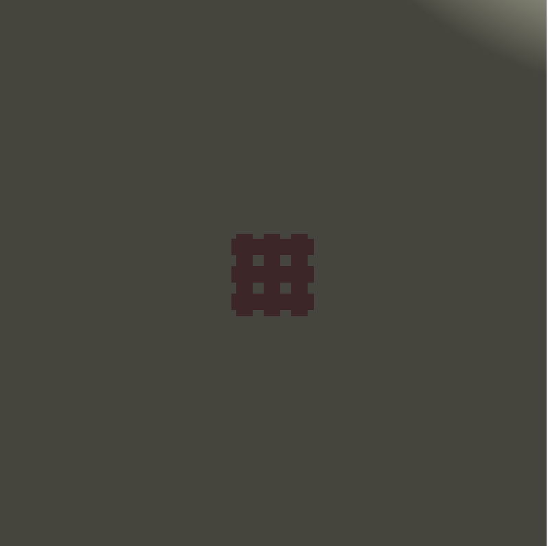

A moving light

Notice the moving light that appears at the corners as it circuits the scene.

715

Metal by Tutorials
Chapter 28: Advanced Shadows

You just took care of the first two steps: light position and direction. Now it’s time to 
handle the third one: the shadow function.

➤ In Shaders.metal, add this above compute:

float getShadow(float2 point, float2 lightPos) { 
  // 1 
  float2 lightDir = lightPos - point; 
  // 2 
  for (float lerp = 0; lerp < 1; lerp += 1 / 300.0) { 
    // 3 
    float2 currentPoint = point + lightDir * lerp; 
    // 4 
    float d2scene = distanceToScene(currentPoint); 
    if (d2scene <= 0.0) { return 0.0; } 
  } 
  return 1.0; 
}

Going through the code:

1. Get a vector from the point to the light.

2. Use a loop to divide the vector into many smaller steps. If you don’t use enough 
steps, you might jump past the object, leaving holes in the shadow.

3. Calculate how far along the ray you are currently, and move along the ray by this 
lerp distance to find the point in space you are sampling.

4. See how far you are from the surface at that point, and then test if you’re inside 
an object. If yes, return 0, because you’re in the shadow. Otherwise, return 1, 
because the ray didn’t hit an object.

It’s finally time to see some shadows.

➤ In compute, add this code before // Edit end:

float shadow = getShadow(uv, lightPos); 
color *= 2; 
color *= shadow * .5 + .5;

A value of 2 is used here to enhance the light brightness and the effect of the 
shadow. Feel free to play with various values and notice how changes affect it.

716

Metal by Tutorials
Chapter 28: Advanced Shadows

➤ Build and run the app.

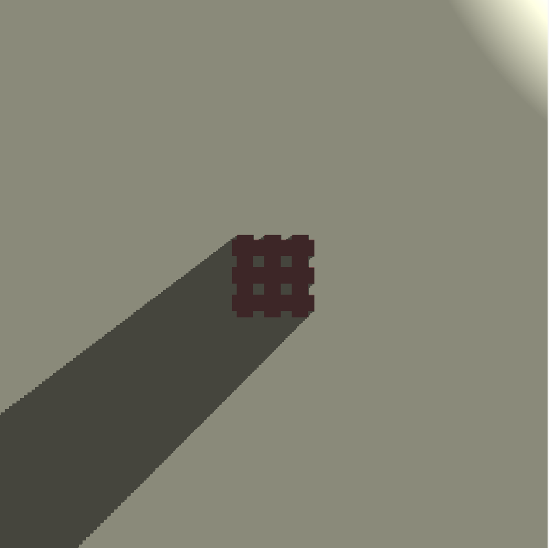

A moving shadow

The shadow loop goes in 1-pixel steps, which is not good performance-wise. You can 
improve that a little by moving along in big steps, provided you don’t step past the 
object. You can safely step in any direction by the distance to the scene instead of a 
fixed step size, and this way you skip over empty areas fast.

When finding the distance to the nearest surface, you don’t know what direction the 
surface is in, but you have the radius of a circle that intersects with the nearest part 
of the scene. You can trace along the ray, always stepping to the edge of the circle 
until the circle radius becomes 0, which means it intersected a surface.

Sphere intersection

717

Metal by Tutorials
Chapter 28: Advanced Shadows

➤ In Shaders.metal, replace the contents of the getShadow function with this:

float2 lightDir = normalize(lightPos - point); 
float shadowDistance = 0.75; 
float distAlongRay = 0.0; 
for (float i = 0; i < 80; i++) { 
  float2 currentPoint = point + lightDir * distAlongRay; 
  float d2scene = distanceToScene(currentPoint); 
  if (d2scene <= 0.001) { return 0.0; } 
  distAlongRay += d2scene; 
  if (distAlongRay > shadowDistance) { break; } 
} 
return 1.0;

➤ Build and run again, and notice the shadow is now faster and looks more accurate.

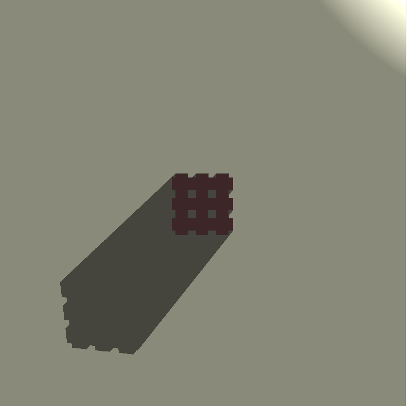

A more accurate shadow

In raymarching, the size of the step depends on the distance from the surface. In 
empty areas, it jumps big distances, and it can travel a long way. However, if it’s 
parallel to the object and close to it, the distance is always small, so the jump size is 
also small. That means the ray travels very slowly. With a fixed number of steps, it 
doesn’t travel far. With eighty or more steps you should be safe from getting holes in 
the shadow.

Congratulations, you made your first hard shadow. Next, you’ll be looking into soft 
shadows. Soft shadows tend to be more realistic and thus, better looking.

718

Metal by Tutorials
Chapter 28: Advanced Shadows

Soft Shadows

Shadows are not only black or white, and objects aren’t just in shadow or not. Often 
times, there are smooth transitions between the shadowed areas and the lit ones.

➤ In Shaders.metal, remove the code between // Edit start and Edit end.

You reset the app to render the starter color.

➤ First, before compute, add structures to hold a ray, a sphere, a plane and a light 
object:

struct Ray { 
  float3 origin; 
  float3 direction; 
};

struct Sphere { 
  float3 center; 
  float radius; 
};

struct Plane { 
  float yCoord; 
};

struct Light { 
  float3 position; 
};

Nothing new or worth noting here, except that for a plane, all you need to know is its 
Y-coordinate because it’s a horizontal plane.

➤ Next, create a few distance operation functions to help you determine distances 
between elements of the scene:

float distToSphere(Ray ray, Sphere s) { 
  return length(ray.origin - s.center) - s.radius; 
}

float distToPlane(Ray ray, Plane plane) { 
  return ray.origin.y - plane.yCoord; 
}

float differenceOp(float d0, float d1) { 
  return max(d0, -d1); 
}

719

Metal by Tutorials
Chapter 28: Advanced Shadows

return min(d0, d1); 
}

Only the union function is new here, which lets you join two areas together.

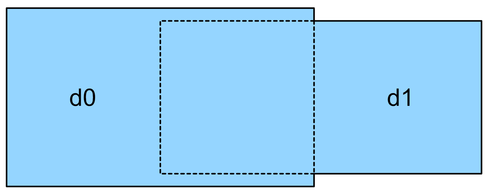

The union operation

You’ll create a function that gives you the closest distance to any object in the scene. 
You’ll be able to use this function to generate a shape that looks like a hollow sphere 
with holes in it.

➤ Before compute, add the new function:

float distToScene(Ray r) { 
  // 1 
  Plane p = Plane{0.0}; 
  float d2p = distToPlane(r, p); 
  // 2 
  Sphere s1 = Sphere{float3(2.0), 2.0}; 
  Sphere s2 = Sphere{float3(0.0, 4.0, 0.0), 4.0}; 
  Sphere s3 = Sphere{float3(0.0, 4.0, 0.0), 3.9}; 
  // 3 
  Ray repeatRay = r; 
  repeatRay.origin = fract(r.origin / 4.0) * 4.0; 
  // 4 
  float d2s1 = distToSphere(repeatRay, s1); 
  float d2s2 = distToSphere(r, s2); 
  float d2s3 = distToSphere(r, s3); 
  // 5 
  float dist = differenceOp(d2s2, d2s3); 
  dist = differenceOp(dist, d2s1); 
  dist = unionOp(d2p, dist); 
  return dist; 
}

Going through the code:

1. Create a plane and calculate the distance to it from the current ray.

2. Create three spheres: one small one, and two larger ones that are concentric.

720

Metal by Tutorials
Chapter 28: Advanced Shadows

3. Create a repeated ray, just as you did in the previous chapter, that mirrors the 
small sphere located between float3(0) and 4.0 on each of the three axes. The 
fract function returns the fractional part of a value.

4. Calculate the distance to the three spheres. The small sphere is created 
repeatedly every 4.0 units in all directions.

5. Calculate the difference between the two large spheres first, which results in a 
large hollow sphere. Then, subtract the small one from them, resulting in the 
large sphere having holes in it. Finally, join the result with the plane to complete 
the scene.

In Chapter 7, “The Fragment Function”, you learned about normals and why they’re 
needed. Next, you’ll create a function that finds the normal on any surface. As an 
example, on your plane, the normal is always pointing up, so its vector is (0, 1, 0); 
the normal in 3D space is a float3, and you need to know its precise position on the 
ray. A plane, however, is a trivial case.

Assume the ray touches the left side of a sphere situated at the origin. The normal 
vector is (-1, 0, 0) at that contact point that’s pointing to the left, and away from 
the sphere. If the ray moves slightly to the right of that point, it’s inside the sphere 
(e.g., -0.001). If the ray moves slightly to the left, it’s outside the sphere (e.g., 
0.001).

If you subtract left from right, you get (-0.001 - 0.001) = -0.002, which still 
points to the left, so this is your X-coordinate of the normal. Repeat this for Y and Z.

➤ Add this before compute:

float3 getNormal(Ray ray) { 
  float2 eps = float2(0.001, 0.0); 
  float3 n = float3( 
    distToScene(Ray{ray.origin + eps.xyy, ray.direction}) - 
    distToScene(Ray{ray.origin - eps.xyy, ray.direction}), 
    distToScene(Ray{ray.origin + eps.yxy, ray.direction}) - 
    distToScene(Ray{ray.origin - eps.yxy, ray.direction}), 
    distToScene(Ray{ray.origin + eps.yyx, ray.direction}) - 
    distToScene(Ray{ray.origin - eps.yyx, ray.direction})); 
  return normalize(n); 
}

721

Metal by Tutorials
Chapter 28: Advanced Shadows

eps is a 2D vector, so you can easily do vector swizzling using the chosen value 0.001 
for one coordinate, and 0 for the other two coordinates, as needed in each case.

You covered all of the cases and checked that the ray is either inside or outside on all 
three axes. Finally, you’re ready to see some visuals. You’ll be writing a raymarching 
loop again.

➤ In compute, add this before // Edit end:

color = 0; 
uv.y = -uv.y; 
// 1 
Ray ray = Ray{float3(0., 4., -12), normalize(float3(uv, 1.))}; 
// 2 
for (int i = 0; i < 100; i++) { 
  // 3 
  float dist = distToScene(ray); 
  // 4 
  if (dist < 0.001) { 
    color = 1.0; 
    break; 
  } 
  // 5 
  ray.origin += ray.direction * dist; 
} 
// 6 
float3 n = getNormal(ray); 
color = float4(color.xyz * n, 1);

Going through the code:

1. Create a ray to travel with inside the scene.

2. Use the loop to divide the ray into many smaller steps. If you don’t use enough 
steps, you might jump past the object.

3. Calculate the new distance to the scene.

4. See how far you are from the surface at that point, and then test if you’re inside 
an object. If yes, break out of the loop.

5. Move along the ray by the distance to the scene to find the point in space you are 
sampling at.

6. Get the normal so that you can calculate the color of every pixel.

722

Metal by Tutorials
Chapter 28: Advanced Shadows

➤ Build and run, and you’ll see the colors representing the normal values.

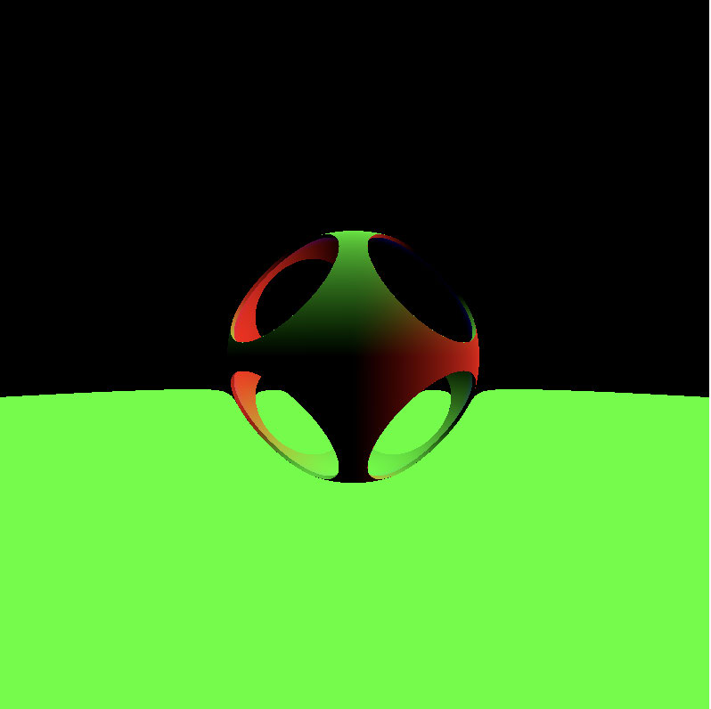

Colors representing normals

Now that you have normals, you can calculate lighting for each pixel in the scene.

➤ In Shaders.metal, create a new function above compute:

float lighting(Ray ray, float3 normal, Light light) { 
  // 1 
  float3 lightRay = normalize(light.position - ray.origin); 
  // 2 
  float diffuse = max(0.0, dot(normal, lightRay)); 
  // 3 
  float3 reflectedRay = reflect(ray.direction, normal); 
  float specular = max(0.0, dot(reflectedRay, lightRay)); 
  // 4 
  specular = pow(specular, 200.0); 
  return diffuse + specular; 
}

Going through the code:

1. Find the direction to the light ray by normalizing the distance between the light 
position and the current ray origin.

2. For diffuse lighting, you need the angle between the normal and lightRay, that 
is, the dot product of the two. Also, make sure you’re never using negative values 
by making 0 the minimum value possible.

723

Metal by Tutorials
Chapter 28: Advanced Shadows

3. For specular lighting, you need reflections on surfaces, and they depend on the 
angle you’re looking at. You first cast a ray into the scene, reflect it from the 
surface, and then measure the angle between the reflected ray and lightRay.

4. Finally, take a high power of that value to make it much sharper and return the 
combined light.

➤ In compute, replace color = float4(color.xyz * n, 1); with:

Light light = Light{float3(sin(time) * 10.0, 5.0, 
                           cos(time) * 10.0)}; 
float l = lighting(ray, n, light); 
color = float4(color.xyz * l, 1.0);

You create a light that circles around in time and use it to calculate the lighting in 
the scene.

➤ Build and run, and you’ll see the light circling your central sphere:

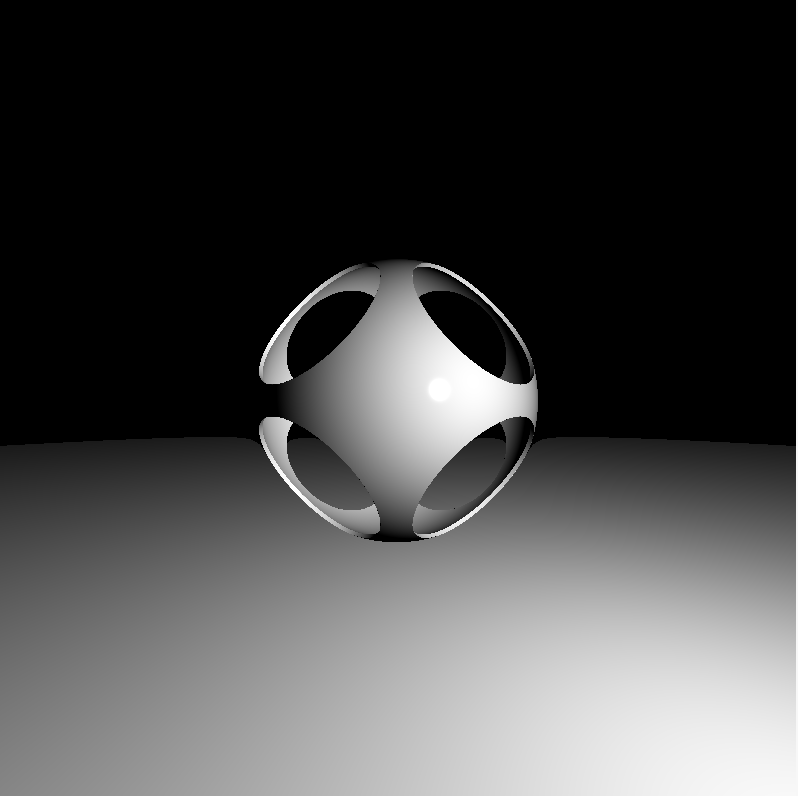

A light circling the sphere

Next, shadows!

➤ In Shaders.metal, add this function before compute:

float shadow(Ray ray, Light light) { 
  float3 lightDir = light.position - ray.origin; 
  float lightDist = length(lightDir); 
  lightDir = normalize(lightDir); 
  float distAlongRay = 0.01; 
  for (int i = 0; i < 100; i++) {

724

Metal by Tutorials
Chapter 28: Advanced Shadows

Ray lightRay = Ray{ray.origin + lightDir * distAlongRay, 
                       lightDir}; 
    float dist = distToScene(lightRay); 
    if (dist < 0.001) { return 0.0; } 
    distAlongRay += dist; 
    if (distAlongRay > lightDist) { break; } 
  } 
  return 1.0; 
}

The shadow function is quite similar to that of hard shadows with a few 
modifications. You normalize the direction of the light, and then you keep updating 
the distance along the ray as you march along with it. You also reduce the number of 
steps to only 100.

➤ In compute, replace color = float4(color.xyz * l, 1.0); with this:

float s = shadow(ray, light); 
color = float4(color.xyz * l * s, 1.0);

➤ Build and run, and you’ll see the light casting shadows.

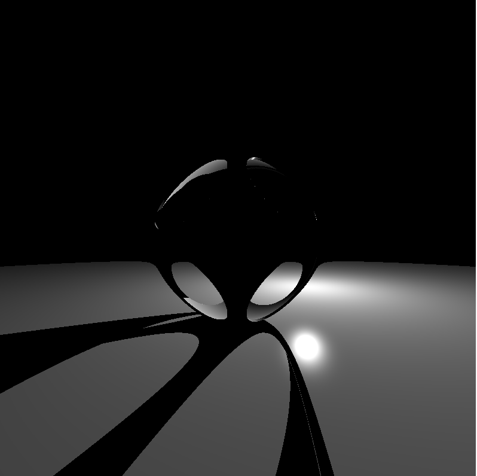

Light casting shadows

Time to finally get some soft shadows in the scene.

In real life, a shadow spreads out the farther it gets from an object. For example, 
where an object touches the floor, you get a sharp shadow; but farther away from the 
object, the shadow is more blurred. In other words, you start at some point on the 
floor, march toward the light, and have either a hit or a miss.

725

Metal by Tutorials
Chapter 28: Advanced Shadows

Hard shadows are straightforward: you hit something, it’s in the shadow. Soft 
shadows have in-between stages.

➤ In Shaders.metal, replace the shadow function with this:

// 1 
float shadow(Ray ray, float k, Light l) { 
  float3 lightDir = l.position - ray.origin; 
  float lightDist = length(lightDir); 
  lightDir = normalize(lightDir); 
  // 2 
  float light = 1.0; 
  float eps = 0.1; 
  // 3 
  float distAlongRay = eps * 2.0; 
  for (int i=0; i<100; i++) { 
    Ray lightRay = Ray{ray.origin + lightDir * distAlongRay, 
                       lightDir}; 
    float dist = distToScene(lightRay); 
    // 4 
    light = min(light, 1.0 - (eps - dist) / eps); 
    // 5 
    distAlongRay += dist * 0.5; 
    eps += dist * k; 
    // 6 
    if (distAlongRay > lightDist) { break; } 
  } 
  return max(light, 0.0); 
}

Going through the code, here are the differences from the previous shadow function:

1. Add an attenuator k as a function argument, which you’ll use to get intermediate 
values of light.

2. Start with a white light and a small value for eps. This is a variable that tells you 
how much wider the beam is as you go out into the scene. A thin beam means a 
sharp shadow while a wide beam means a soft shadow.

3. Start with a small distAlongRay, because otherwise, the surface at this point 
would shadow itself.

4. Compute the light by subtracting the distance from the beam width eps and then 
dividing by it. This gives you the percentage of beam covered. If you invert it (1 
- beam width) you get the percentage of beam that’s in the light. Then, take the 
minimum of this new value and light to preserve the darkest shadow as you 
march along the ray.

726

Metal by Tutorials
Chapter 28: Advanced Shadows

5. Move along the ray, and increase the beam width in proportion to the distance 
traveled and scaled by the attenuator k.

6. If you’re past the light, break out of the loop. Avoid negative values by returning 
the maximum between 0.0 and the value of light.

Next, adapt the compute kernel code to work with the new shadow function.

➤ In compute, replace all of the lines after the one where you created the Ray object, 
up to // Edit end, with this:

// 1 
bool hit = false; 
for (int i = 0; i < 200; i++) { 
  float dist = distToScene(ray); 
  if (dist < 0.001) { 
    hit = true; 
    break; 
  } 
  ray.origin += ray.direction * dist; 
} 
// 2 
float3 col = 1.0; 
// 3 
if (!hit) { 
  col = float3(0.8, 0.5, 0.5); 
} else { 
  float3 n = getNormal(ray); 
  Light light = Light{float3(sin(time) * 10.0, 5.0, 
                             cos(time) * 10.0)}; 
  float l = lighting(ray, n, light); 
  float s = shadow(ray, 0.3, light); 
  col = col * l * s; 
} 
// 4 
Light light2 = Light{float3(0.0, 5.0, -15.0)}; 
float3 lightRay = normalize(light2.position - ray.origin); 
float fl = max(0.0, dot(getNormal(ray), lightRay) / 2.0); 
col = col + fl; 
color = float4(col, 1.0);

Going through the code:

1. Add a Boolean that tells you whether or not you hit the object. If the distance to 
the scene is within 0.001, you have a hit.

2. Start with a default white color. This is important, because when you later 
multiply this color with the value of shadow and that of the light; white will 
never influence the result because of multiplying by 1.

727

Metal by Tutorials
Chapter 28: Advanced Shadows

3. If there’s no hit, color everything in a nice sky color, otherwise determine the 
shadow value.

4. Add another fixed light source in front of the scene to see the shadows in greater 
detail.

➤ Build and run, and you’ll see a beautiful combination of shadow tones.

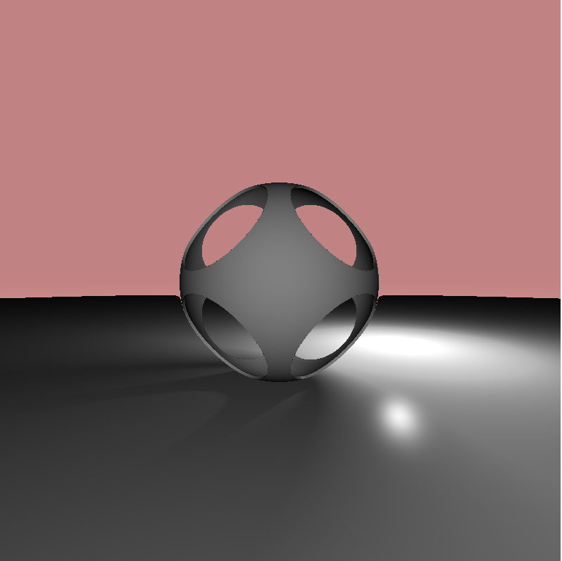

Shadow Tones

Ambient Occlusion

Ambient occlusion (AO) is a global shading technique, unlike the Phong local 
shading technique you learned about in Chapter 10, “Lighting Fundamentals”. AO is 
used to calculate how exposed each point in a scene is to ambient lighting which is 
determined by the neighboring geometry in the scene.

AO is, however, a weak variant of global illumination. It looks like a scene on a rainy 
day and feels like a non-directional, diffuse shading effect. For hollow objects, AO 
makes the interior look darker because the light is even more occluded inside. As you 
move towards the edges of the object, it looks lighter and lighter.

Only large objects are taken into consideration when computing the amount of 
ambient light, such as the sky, walls or any other objects that would normally be big 
enough to cast a shadow if they were lit. AO is usually a fragment post-processing 
technique. However, you are looking into it in this chapter because AO is a type of 
shadow.

728

Metal by Tutorials
Chapter 28: Advanced Shadows

In the following top-down image, you can see how the base of the curved wall is 
darker, as well as the base of the box.

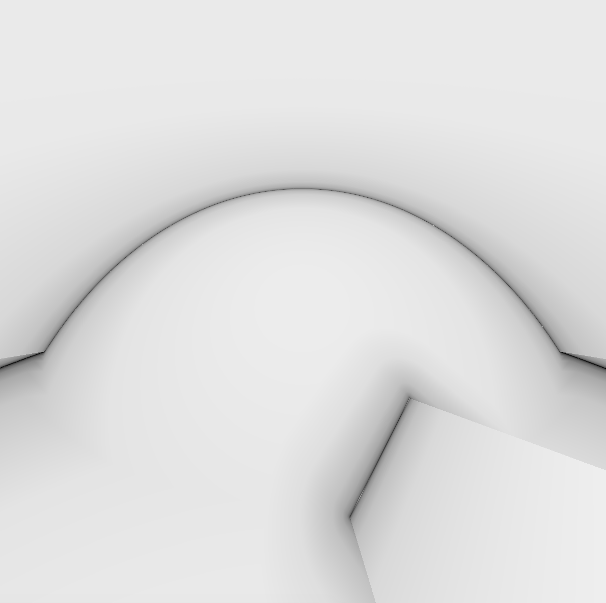

➤ First, in Shaders.metal, reset the scene. Replace the contents of distToScene 
with:

Plane p{0.0}; 
float d2p = distToPlane(r, p); 
return d2p;

➤ Build and run, and you’ll see an scene with a ground plane and a light.

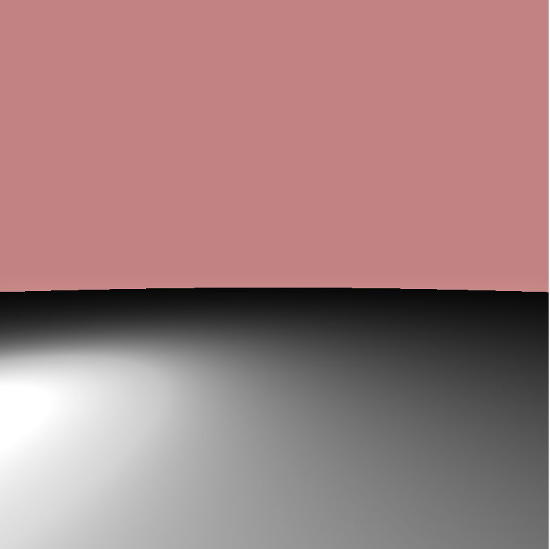

Ambient occlusion starter scene

729

Metal by Tutorials
Chapter 28: Advanced Shadows

➤ Add a new box object type below the other types:

struct Box { 
  float3 center; 
  float size; 
};

➤ Next, add a new distance function for Box before distToScene:

float distToBox(Ray r, Box b) { 
  // 1 
  float3 d = abs(r.origin - b.center) - float3(b.size); 
  // 2 
  return min(max(d.x, max(d.y, d.z)), 0.0) 
              + length(max(d, 0.0)); 
}

Going through the code:

1. Offset the current ray origin by the center of the box. Then, get the symmetrical 
coordinates of the ray position by using the abs function. Offset the resulting 
distance d by the length of the box edge.

2. Get the distance to the farthest edge by using the max function, and then get the 
smaller value between 0 and the distance you just calculated. If the ray is inside 
the box, this value will be negative, so you need to add the larger length between 
0 and d.

➤ Replace the return line in distToScene with this:

// 1 
Sphere s1 = Sphere{float3(0.0, 0.5, 0.0), 8.0}; 
Sphere s2 = Sphere{float3(0.0, 0.5, 0.0), 6.0}; 
Sphere s3 = Sphere{float3(10., -5., -10.), 15.0}; 
float d2s1 = distToSphere(r, s1); 
float d2s2 = distToSphere(r, s2); 
float d2s3 = distToSphere(r, s3); 
// 2 
float dist = differenceOp(d2s1, d2s2); 
dist = differenceOp(dist, d2s3); 
// 3 
Box b = Box{float3(1., 1., -4.), 1.}; 
float dtb = distToBox(r, b); 
dist = unionOp(dist, dtb); 
dist = unionOp(d2p, dist); 
return dist;

730

Metal by Tutorials
Chapter 28: Advanced Shadows

Going through the code:

1. Draw two spheres with the same center: one with a radius of 8, and one with a 
radius of 6. Draw a third, larger sphere at a different location.

2. Subtract the second sphere from the first, resulting in a hollow, thicker sphere. 
Subtract the third sphere from the hollow sphere to make a cross-section 
through it.

3. Add a box and a plane to complete the scene.

➤ Build and run, and you’ll see the hollow sphere, box and plane.

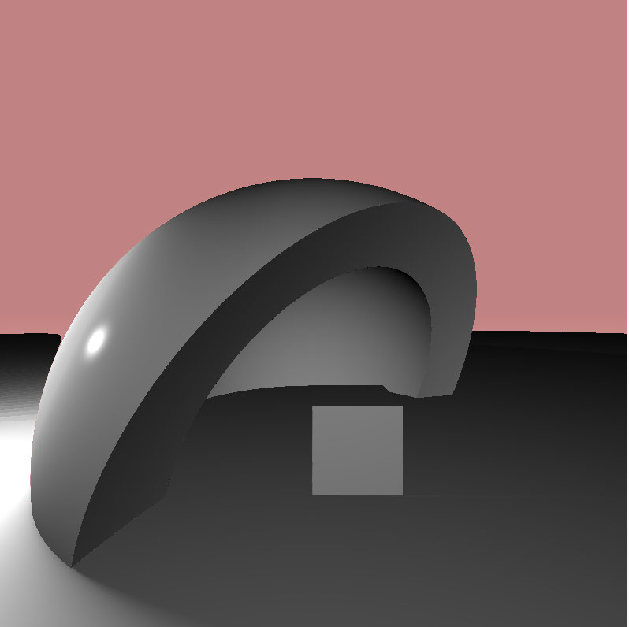

The ambient occlusion scene

Time to work on the ambient occlusion code.

➤ In Shaders.metal, create a skeleton function above compute:

float ao(float3 pos, float3 n) { 
    return n.y * 0.5 + 0.5; 
}

This function uses the normal’s Y component for light and adds 0.5 to it. This makes 
it look like there’s light directly above.

➤ Inside compute, since there are no shadows anymore, replace this line:

731

Metal by Tutorials
Chapter 28: Advanced Shadows

➤ With this:

float o = ao(ray.origin, n); 
col = col * o;

➤ At the end of compute, remove this:

➤ Remove the unused variable definitions light, l, s, light2, lightRay and f1.

➤ Build and run, and you’ll see the same scene as before — this time without the 
shadows, and the surfaces pointing upward are brighter.

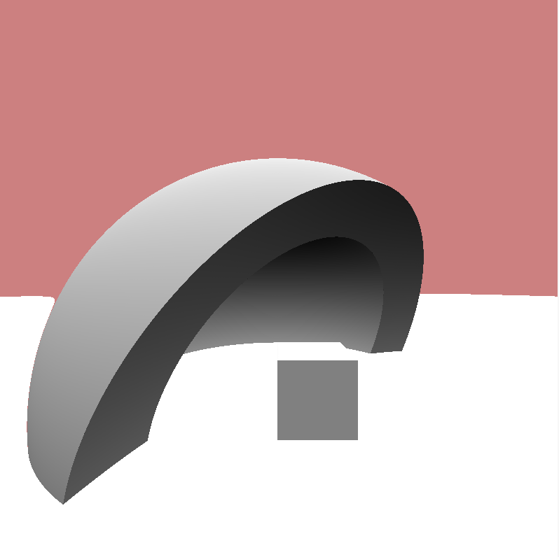

This is a good start, but it’s not how ambient occlusion should look — at least not 
yet.

Ambient means that the light does not come from a well-defined light source, but is 
rather lighting coming from other objects in the scene, all contributing to the 
general scene light. Occlusion means how much of the ambient light is blocked.

The main idea about ambient occlusion is to use the point where the ray hits the 
surface and look at what’s around it. If there’s an object anywhere around it that will 
block most of the light nearby, that area will be dark. If there’s nothing around it, 
then the area is well lit. For in-between situations, you need more precision about 
how much light was occluded.

732

Metal by Tutorials
Chapter 28: Advanced Shadows

Cone tracing is a technique that uses a cone instead of a ray. If the cone intersects 
an object, you don’t just have a simple true/false result. You can find out how much 
of the cone the object covers at that point. Tracing a cone might be a challenge 
though. You could make a cone using spheres aligned along a line, small at one end 
and big at the other end. This would be a good cone approximation to use. Since 
you’re doubling the sphere size at each step, that means you travel out from the 
surface very fast, so you need fewer iterations. That also gives you a nice wide cone.

➤ In Shaders.metal, replace the contents of the ao function with this:

// 1 
float eps = 0.01; 
// 2 
pos += n * eps * 2.0; 
// 3 
float occlusion = 0.0; 
for (float i = 1.0; i < 10.0; i++) { 
  // 4 
  float d = distToScene(Ray{pos, float3(0)}); 
  float coneWidth = 2.0 * eps; 
  // 5 
  float occlusionAmount = max(coneWidth - d, 0.); 
  // 6 
  float occlusionFactor = occlusionAmount / coneWidth; 
  // 7 
  occlusionFactor *= 1.0 - (i / 10.0); 
  // 8 
  occlusion = max(occlusion, occlusionFactor); 
  // 9 
  eps *= 2.0; 
  pos += n * eps; 
} 
// 10 
return max(0.0, 1.0 - occlusion);

Going through the code:

1.
eps is both the cone radius and the distance from the surface.

2. Move away a bit to prevent hitting surfaces you’re moving away from.

3.
occlusion is initially zero (the scene is white).

733

Metal by Tutorials
Chapter 28: Advanced Shadows

4. Get the scene distance, and double the cone radius so you know how much of the 
cone is occluded.

5. Eliminate negative values for the light by using the max function.

6. Get the amount, or ratio, of occlusion scaled by the cone width.

7.
Set a lower impact for more distant occluders; the iteration count provides this.

8. Preserve the highest occlusion value so far.

9. Double eps, and then move along the normal by that distance.

10. Return a value that represents how much light reaches this point.

➤ Build and run, and you’ll see ambient occlusion in all of its splendor.

Ambient occlusion

It would be useful to have a camera that moves around the scene. All it needs is a 
position, a ray that can be used as the camera’s direction and a divergence factor 
which shows how much the ray spreads.

734

Metal by Tutorials
Chapter 28: Advanced Shadows

➤ In Shaders.metal, add a new structure with the other types:

struct Camera { 
  float3 position; 
  Ray ray{float3(0), float3(0)}; 
  float rayDivergence; 
};

Here, you’re setting up a camera using the look-at technique. This requires the 
camera to have a forward direction, an up direction and a left vector. If you’re using a 
right-handed coordinate system, it’s a right vector instead.

➤ Add this function before compute:

Camera setupCam(float3 pos, float3 target, 
                float fov, float2 uv, int x) { 
  // 1 
  uv *= fov; 
  // 2 
  float3 cw = normalize(target - pos); 
  // 3 
  float3 cp = float3(0.0, 1.0, 0.0); 
  // 4 
  float3 cu = normalize(cross(cw, cp)); 
  // 5 
  float3 cv = normalize(cross(cu, cw)); 
  // 6 
  Ray ray = Ray{pos, 
                normalize(uv.x * cu + uv.y * cv + 0.5 * cw)}; 
  // 7 
  Camera cam = Camera{pos, ray, fov / float(x)}; 
  return cam; 
}

Going through the code:

1. Multiply the uv coordinates by the field of view.

2. Calculate a unit direction vector cw for the camera’s forward direction.

3. The left vector will point orthogonally from an up and forward vector. cp is a 
temporary up vector.

4. The cross product gives you an orthogonal direction, so calculate the left vector 
cu using the forward and up vectors.

735

Metal by Tutorials
Chapter 28: Advanced Shadows

5. Calculate the correct up vector cv using the left and forward vectors.

6. Create a ray at the given origin with the direction determined by the left vector 
cu for the X-axis, by the up vector cv for the Y-axis and by the forward vector cw 
for the Z-axis.

7.
Create a camera using the ray you created above. The third parameter is the ray 
divergence and represents the width of the cone. x is the number of pixels inside 
the field of view (e.g., if the view is 60 degrees wide and contains 60 pixels, each 
pixel is 1 degree). This is useful for speeding up the SDF when far away, and also 
for antialiasing.

➤ To initialize the camera, replace this line in compute:

➤ With this:

float3 camPos = float3(sin(time) * 10., 3., cos(time) * 10.); 
Camera cam = setupCam(camPos, float3(0), 1.25, uv, width); 
Ray ray = cam.ray;

Build and run, and as the camera circles the scene, you can view the ambient 
occlusion from all directions.

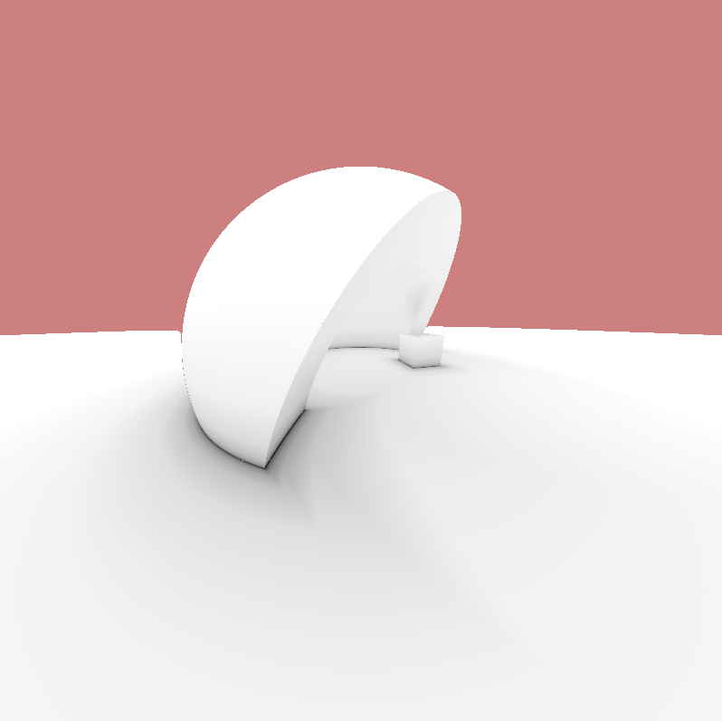

Camera circling the scene

736

Metal by Tutorials
Chapter 28: Advanced Shadows

Key Points

• Raymarching produces better quality shadows than rasterized shadows.

• Hard shadows are not realistic, as there are generally multiple light sources in the 
real world.

• Soft shadows give better transitions between areas in shadow and not.

• Ambient occlusion does not depend on scene lighting, but on neighboring 
geometry. The closer geometry is to an area, the darker the area is.

Where to Go From Here?

In addition to the shadow types you learned in this chapter, there are other shadow 
techniques such as Screen Space Ambient Occlusion and Shadow Volumes. If you’re 
interested in learning about these, review references.markdown in the resources 
folder for this chapter.

737

29