# Advanced 
Lighting

As you’ve progressed through this book, you’ve encountered various lighting and 
reflection models:

• In Chapter 10, “Lighting Fundamentals” you started with the Phong reflection 
model which defines light as a sum of three distinct components: ambient light, 
diffuse light and specular light.

• In Chapter 11, “Maps & Materials” you briefly looked at physically based rendering 
and the Fresnel effect.

• In Chapter 21, “Image-Based Lighting” you implemented skybox-based reflection 
and image-based lighting, and you used a Bidirectional Reflectance Distribution 
Function (BRDF) look-up table.

In this chapter, you’ll learn about global illumination and the famous rendering 
equation that defines it.

738

Metal by Tutorials
Chapter 29: Advanced Lighting

While reflection is possible using the local illumination techniques you’ve seen so 
far, advanced effects — like refraction, subsurface scattering, total internal reflection, 
caustics and color bleeding — are only possible with global illumination.

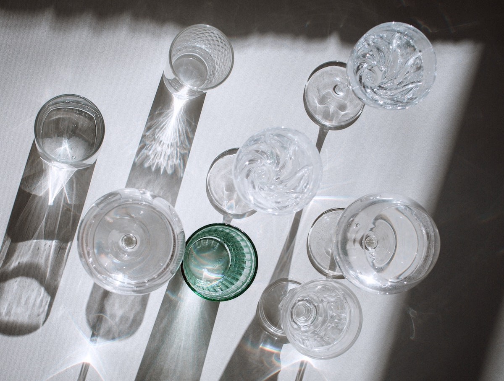

A real-life example of global illumination and caustics

You’ll start by examining the rendering equation. From there, you’ll move on to 
raymarched reflection and refraction.

The Rendering Equation

Two academic papers — one by James Kajiya, and the other by David Immel et al. — 
introduced the rendering equation in 1986. In its raw form, this equation might look 
intimidating:

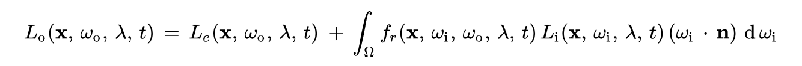

The rendering equation

The rendering equation is based on the law of conservation of energy, and in simple 
terms, it translates to an equilibrium equation where the sum of all source lights 
must equal the sum of all destination lights:

incoming light + emitted light = transmitted light + outgoing 
light

739

Metal by Tutorials
Chapter 29: Advanced Lighting

If you rearrange the terms of the equilibrium equation, you get the most basic form 
of the rendering equation:

outgoing light = emitted light + incoming light - transmitted 
light

The incoming light - transmitted light part of the equation is subject to 
recursion because of multiple light bounces at that point. That recursion process 
translates to an integral over a unit hemisphere that’s centered on the normal vector 
at the point and which contains all the possible values for the negative direction of 
the incoming light.

Although the rendering equation might be a bit intimidating, think of it like this: All 
the light leaving an object is what remains from all the lights coming into the object after 
some of them were transmitted through the object.

The transmitted light can be either absorbed by the surface of the object (material), 
changing its color; or scattered through the object, which leads to a range of 
interesting optical effects such as refraction, subsurface scattering, total internal 
reflection, caustics and so on.

Reflection

Reflection, like any other optical phenomenon, has an equation that depends on 
three things: the incoming light vector, the incident angle and the normal vector for 
the surface.

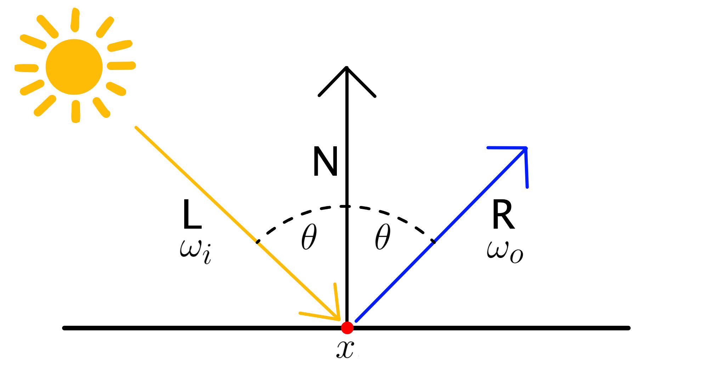

Reflection

The law of reflection states that the angle at which an incident light hits the surface 
of an object will be the same as the angle of the light that’s being reflected off the 
normal.

But enough with the theory for now. Time to have some fun coding!

740

Metal by Tutorials
Chapter 29: Advanced Lighting

Getting Started

➤ In Xcode, open the starter app for this chapter and build and run (or set up the 
SwiftUI Canvas preview).

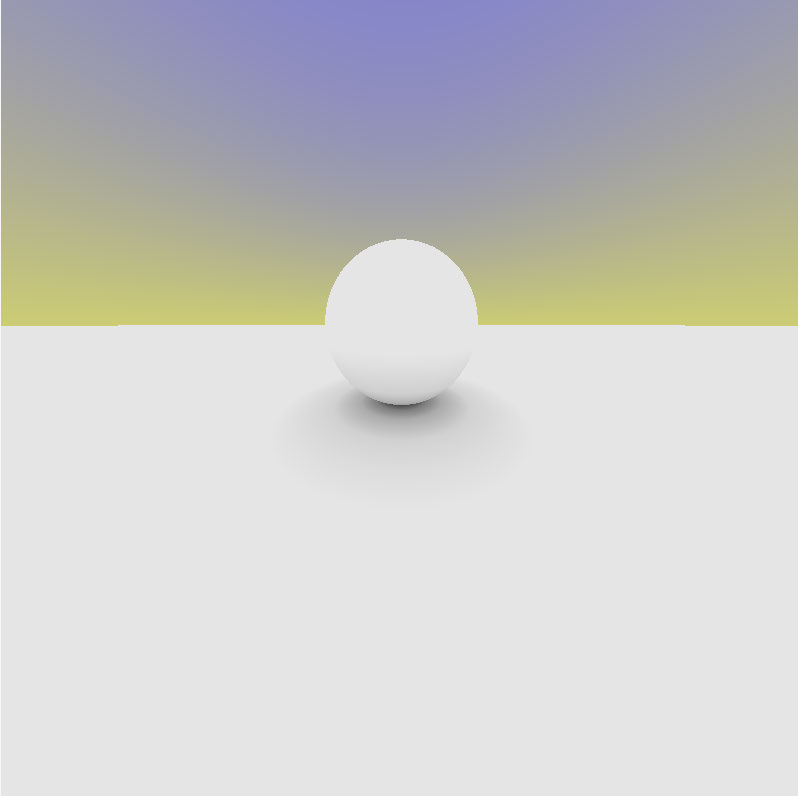

The starter app

The code in Shaders.metal should look familiar to you because you’ve seen it in the 
two previous chapters. You’ll continue as before, writing code in only 
Shaders.metal.

You’ll start by adding a checkerboard pattern to the plane, getting it to reflect onto 
the sphere.

Drawing a Checkerboard Pattern

To draw a pattern on the plane, you first need to have a way of identifying objects 
within the scene by comparing their proximity to the camera based on distance.

➤ Open Shaders.metal, and create two constants to identify the two objects in the 
scene:

constant float PlaneObj = 0.0; 
constant float SphereObj = 1.0;

741

Metal by Tutorials
Chapter 29: Advanced Lighting

➤ In distToScene, after this line:

➤ Add this:

Here, you check whether the distance to the plane is greater than the distance to the 
sphere, and you hold the result in object.

➤ Replace return dist; with:

You include both distance and object information in the function return.

➤ Build and run the app to verify the image hasn’t changed.

In Shaders.metal, the kernel function compute is where you’re raymarching the 
scene. In a for loop, you iterate over a considerable number of samples and update 
the ray color until you attain enough precision. It’s in this code block that you’ll 
draw the pattern on the plane.

➤ In compute, inside the for loop, locate:

distToScene returns the closest object in dist.y.

➤ Immediately after that line, add this:

➤ After hit = true;, add this:

// 1 
if (closestObject == PlaneObj) { 
  // 2 
  float2 pos = cam.ray.origin.xz; 
  pos *= 0.1; 
  // 3 
  pos = floor(fmod(pos, 2.0)); 
  float check = mod(pos.x + pos.y, 2.0); 
  // 4 
  col *= check * 0.5 + 0.5; 
}

742

Metal by Tutorials
Chapter 29: Advanced Lighting

Going through the code:

1. Build the checkerboard if the selected object is the plane.

2. Get the position of the camera ray in the horizontal XZ plane since you’re 
interested in intersecting the floor plane only.

3. Create squares. You first alternate between 0s and 1s on both X and Z axes by 
applying the modulo operator.

At this point, you have a series of pairs containing either 0s or 1s or both. Next, 
add the two values together from each pair, and apply the modulo operator again.

If the sum is 2, roll it back to 0; otherwise, it will be 1.

4. Apply color. Initially, it’s a solid white color. Multiply by 0.5 to tone it down, and 
add 0.5 back, so you can have both white and grey squares.

You have a compile error for the missing mod function. However, before adding the 
missing function, take a moment to understand why you need to implement a 
separate modulo operation.

The fmod function, as implemented by the Metal Shading Language, performs a 
truncated division where the remainder will have the same sign as the numerator:

A second approach, missing from MSL, is known as floored division, where the 
remainder has the same sign as the denominator:

These two approaches could have entirely different results.

When calculating pos, the values need to alternate between 0s and 1s, so taking the 
floor of the truncated division is enough. However, when you add the two 
coordinates to determine the check value on the next line, you need to take the 
floor of their sum.

➤ Add the new floored division function above compute:

float mod(float x, float y) { 
  return x - y * floor(x / y); 
}

743

Metal by Tutorials
Chapter 29: Advanced Lighting

➤ Build and run, and you’ll see your checkerboard pattern.

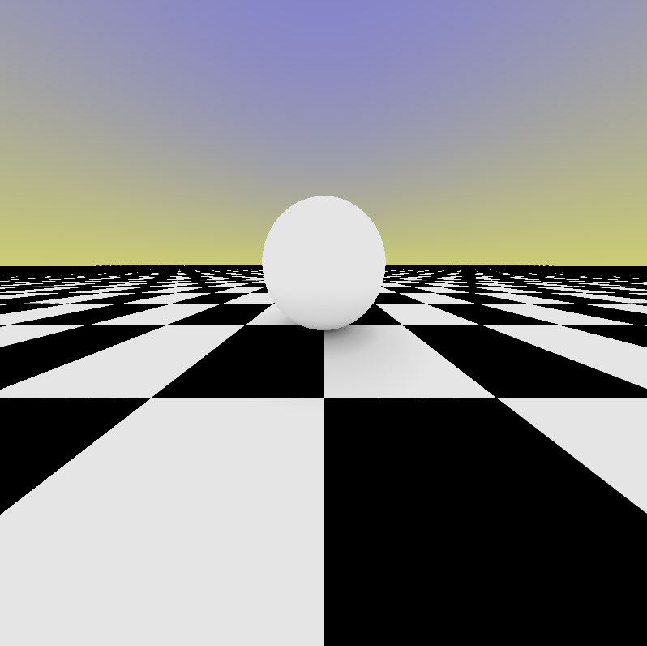

The checkerboard pattern

All you need to do now is reflect the checkerboard onto the sphere.

➤ In Shaders.metal, add a new reflection function above compute:

Camera reflectRay(Camera cam, float3 n, float eps) { 
  cam.ray.origin += n * eps; 
  cam.ray.dir = reflect(cam.ray.dir, n); 
  return cam; 
}

The MSL standard library provides a reflect() function that takes the incoming ray 
direction and intersecting surface normal as arguments and returns the outgoing 
(reflected) ray direction. The reflectRay function is a convenience that returns the 
Camera object, not just its ray direction.

➤ In compute, after the if (closestObject == PlaneObj) block, but inside the if 
(dist.x < eps) block, add this:

float3 normal = getNormal(cam.ray); 
cam = reflectRay(cam, normal, eps);

This code gets the normal where the camera ray intersects an object, and reflects it 
at that point. You move the ray away from the surface, along the normal and not 
along the ray direction as you might have expected because that could be almost 
parallel to the surface. You only move away a small distance eps that’s precise 
enough to tell you when there’s not a hit anymore.

744

Metal by Tutorials
Chapter 29: Advanced Lighting

The bigger eps is, the fewer steps you need to hit the surface, so the faster your 
tracing is — but it’s also less accurate. You can play with various values for eps until 
you find a balance between precision and speed that satisfies your needs.

➤ Build and run the app:

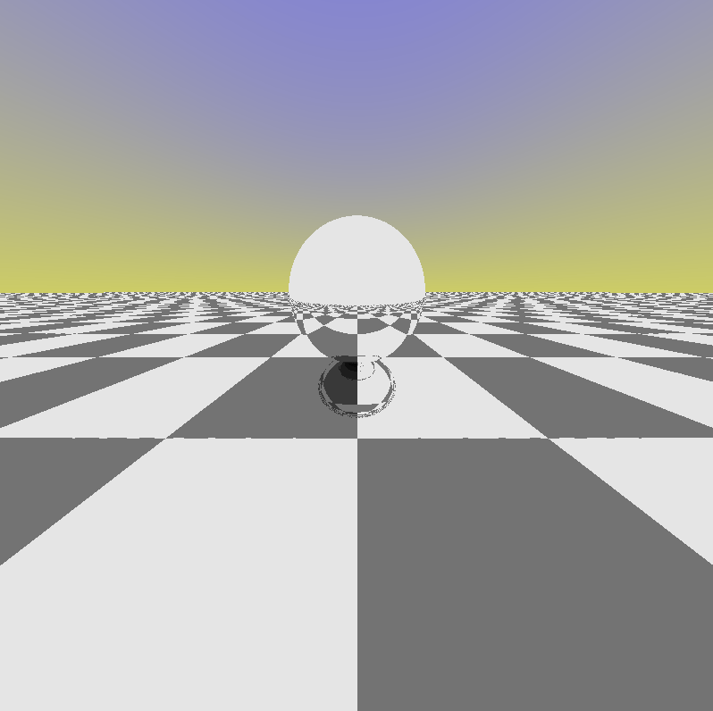

Reflecting the checkerboard

You’re successfully reflecting the checkerboard onto the sphere, but the sky is not 
reflecting. This is because in the starter code you used the Boolean hit, which stops 
and breaks out of the loop when the ray first hits any object. That’s not true 
anymore, because now you need the ray to keep hitting objects for reflection.

➤ Open Shaders.metal, and in compute, replace this code:

if (!hit) { 
  col = mix(float3(.8, .8, .4), float3(.4, .4, 1.), 
            cam.ray.dir.y); 
} else { 
  float3 n = getNormal(cam.ray); 
  float o = ao(cam.ray.origin, n); 
  col = col * o; 
}

➤ With:

col *= mix(float3(0.8, 0.8, 0.4), float3(0.4, 0.4, 1.0), 
           cam.ray.dir.y);

745

Metal by Tutorials
Chapter 29: Advanced Lighting

You add the sky color to the scene color globally, not just when a ray failed to hit an 
object in the scene. You can optionally remove the ao function and the two lines in 
compute where hit appears since you’re not using them anymore.

➤ Build and run, and you’ll see the sky is now also reflected on the sphere and the 
floor.

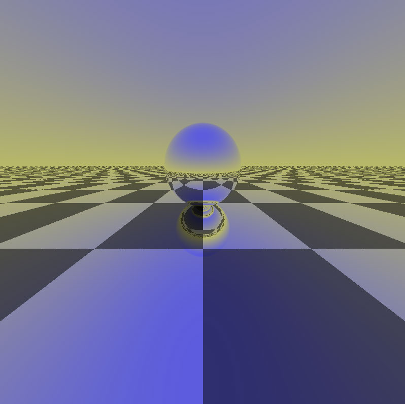

Reflecting the sky

You can spin the camera a little bit to make the reflection look more interesting.

➤ In compute, replace this line:

➤ With this:

float3 camPos = float3(sin(time) * 15.0, 
                       sin(time) * 5.0 + 7.0, 
                       cos(time) * 15.0);

746

Metal by Tutorials
Chapter 29: Advanced Lighting

➤ Build and run, and you’ll see the same image but now nicely animated.

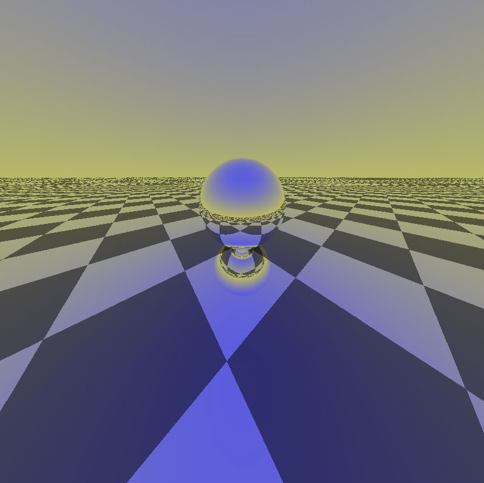

Animated reflections

Refraction

The law of refraction is a little more complicated than simple equality between the 
incoming and outgoing light vector angles.

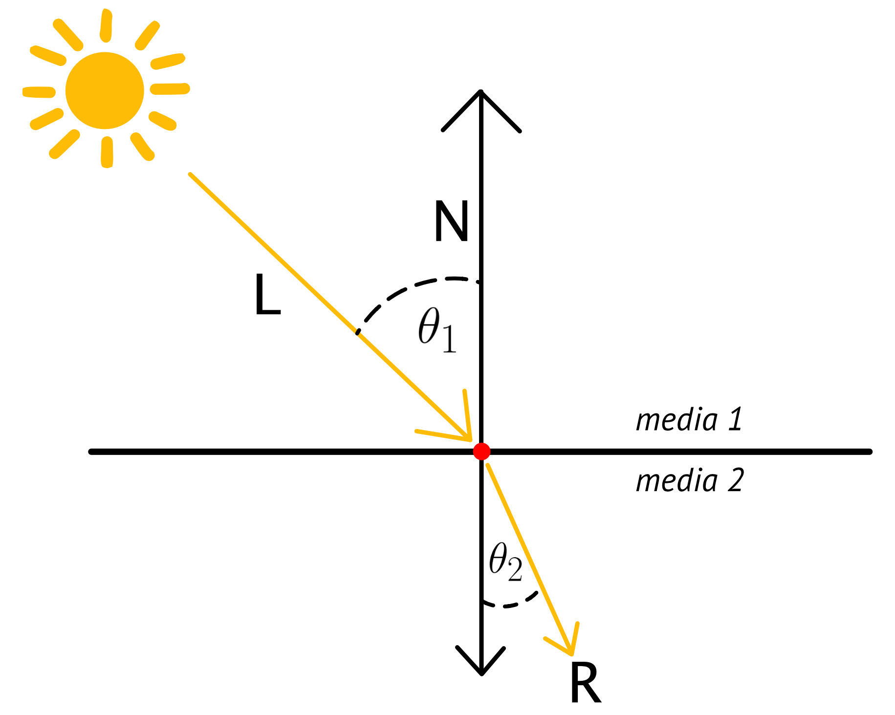

Refraction

747

Metal by Tutorials
Chapter 29: Advanced Lighting

Refraction is dictated by Snell’s law, which states that the ratio of angles equals the 
reversed ratio of indices of refraction:

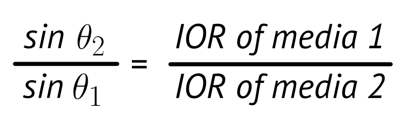

Snell's law

The index of refraction (IOR) is a constant that defines how fast light propagates 
through various media. IOR is defined as the speed of light in a vacuum divided by 
the phase velocity of light in that particular medium.

Note:  There are published lists with IOR values for various media but the 
ones that interest us here are that of air (IOR = 1) and that of water (IOR = 
1.33). See https://en.wikipedia.org/wiki/List_of_refractive_indices for more 
details.

To find the angle for the refracted light vector through water, for example, all you 
need to know is the incoming light vector angle, which you can use from the 
reflected light vector. Then, you can divide that by the IOR for water since IOR for air 
is 1 and does not affect the calculation:

Time for some more coding.

You first need to have a way of knowing when the ray is inside the sphere, as you 
only do refraction in that case.

➤ In compute, add the following code before the for loop:

748

Metal by Tutorials
Chapter 29: Advanced Lighting

In the first part of this chapter, you identified objects, so you know when the ray hits 
the sphere. This means that you can change the sign of the distance depending on 
whether the ray enters the sphere, or leaves it. As you know from previous chapters, 
a negative distance means you’re inside the object you are sending your ray towards.

➤ Locate:

➤ And, add this line below it:

This adjusts the x value to reflect whether you are inside the sphere or not. Next, you 
need to adjust the normals.

➤ Delete this line:

➤ Then, locate this line:

➤ After you find it, add the normal definition back into the code right below it:

You now have a normal that points outward when outside the sphere and inward 
when you’re inside the sphere.

➤ Move the following line so that it is inside the inner if block because you only 
want the plane to be reflective from now on:

749

Metal by Tutorials
Chapter 29: Advanced Lighting

➤ After the inner if block, add an else block where you make the sphere refractive:

// 1 
else if (closestObject == SphereObj) { 
  inside = !inside; 
  // 2 
  float ior = inside ? 1.0 / 1.33 : 1.33; 
  cam = refractRay(cam, normal, eps, ior); 
}

Going through the code:

1. Check whether you’re inside the sphere. On the first intersection, the ray is now 
inside the sphere, so turn inside to true and do the refraction. On the second 
intersection, the ray now leaves the sphere, so turn inside to false, and 
refraction no longer occurs.

2. Set the index of refraction (IOR) based on the ray direction. IOR for water is 1.33. 
The ray is first going air-to-water, then it’s going water-to-air in which case the 
IOR becomes 1 / 1.33.

➤ To fix the compile error currently being shown by Xcode, add this missing 
function above compute:

Camera refractRay(Camera cam, float3 n, float eps, float ior) { 
  cam.ray.origin -= n * eps * 2.0; 
  cam.ray.dir = refract(cam.ray.dir, n, ior); 
  return cam; 
}

The MSL standard library also provides a refract() function, so you’re just building 
a convenience function around it. You subtract the distance this time because the ray 
is inside the sphere.

You also double the eps value, which is enough to move far enough inside to avoid 
another collision. If eps were still the old value, the ray might stop and consider it 
another collision with the object since eps was defined precisely for this purpose: 
precision. Doubling it will make the ray pass just over the point that was already a 
collision point before.

750

Metal by Tutorials
Chapter 29: Advanced Lighting

➤ Build and run, and you’ll see the sphere now being refractive.

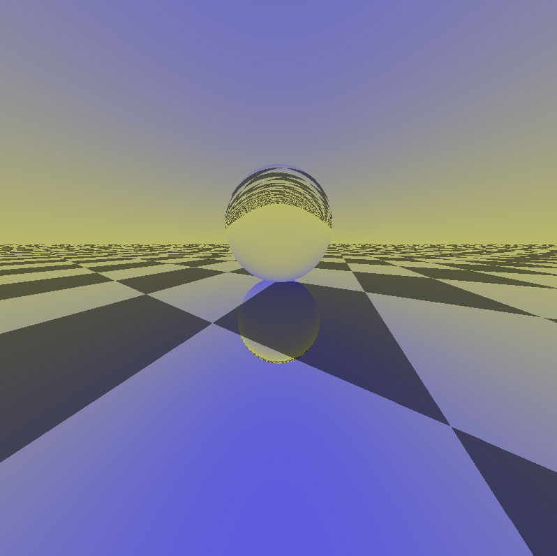

Raytraced Water

It’s relatively straightforward to create a cheap, fake water-like effect on the sphere.

➤ In Shaders.metal, in the distToScene function, locate:

➤ And add this code afterward:

if (object == SphereObj) { 
  // 1 
  float3 pos = r.origin; 
  pos += float3(sin(pos.y * 5.0), 
                sin(pos.z * 5.0), 
                sin(pos.x * 5.0)) * 0.05; 
  // 2 
  Ray ray = Ray{pos, r.dir}; 
  dts = distToSphere(ray, s); 
}

751

Metal by Tutorials
Chapter 29: Advanced Lighting

Going through the code:

1. Get the ray’s current position, and apply ripples to the surface of the sphere by 
altering all three coordinates. Use 0.05 to attenuate the altering. A value of 
0.001 is not large enough to make an impact, while 0.01 is too much of an 
impact.

2. Construct a new ray using the altered position as the new ray origin while 
preserving the old direction. Calculate the distance to the sphere using this new 
ray.

➤ In compute, replace:

➤ With:

You added an attenuation factor of 0.5 to make the animation slower but more 
precise.

➤ Build and run, and you’ll see a water-like ball.

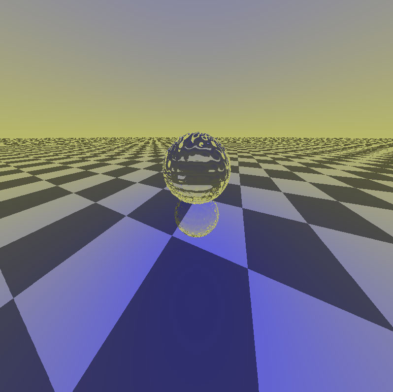

752

Metal by Tutorials
Chapter 29: Advanced Lighting

Key Points

• The rendering equation is the gold standard of realistic rendering. It describes 
conservation of energy where the sum of incoming light must equal outgoing 
light.

• Reflection depends on the angle of the incoming light and the surface normal.

• Refraction takes into account the medium’s index of refraction, which defines the 
speed at which light travels through the medium.

Where to Go From Here?

If you want to explore more about water rendering, the references.markdown file 
for this chapter contains links to interesting articles.

This concludes the series of chapters using raymarching. But don’t worry, rendering 
is far from over. In the next chapters, you’ll dip your toes into image processing and 
learn more about optimizing your apps.

753

30