# Metal 
Performance Shaders

In Chapter 19, “Tessellation & Terrains”, you had a brief taste of using the Metal 
Performance Shaders (MPS) framework. MPS consists of low-level, fine-tuned, high-
performance kernels that run off the shelf with minimal configuration. In this 
chapter, you’ll dive a bit deeper into the world of MPS.

754

Metal by Tutorials
Chapter 30: Metal Performance Shaders

Overview

The MPS kernels make use of data-parallel primitives that are written in such a way 
that they can take advantage of each GPU family’s characteristics. The developer 
doesn’t have to care about which GPU the code needs to run on, because the MPS 
kernels have multiple versions of the same kernel written for every GPU you might 
use. Think of MPS kernels as convenient black boxes that work efficiently and 
seamlessly with your command buffer. Simply give it the desired effect, a source and 
destination resource (buffer or texture), and then encode GPU commands on the fly!

The Sobel Filter

The Sobel filter is a great way to detect edges in an image.

➤ In the starter folder for this chapter, open and run the Sobel project, and you’ll 
see such an effect (left: original image, right: Sobel filter applied):

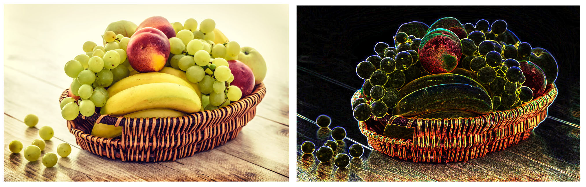

The Sobel filter

Assuming you’ve already created a device object, a command queue, a command 
buffer and a texture object for the input image, as you can see in Renderer, there are 
only a few lines of code to apply the Sobel filter to your input image:

let shader = MPSImageSobel(device: device) 
shader.encode( 
  commandBuffer: commandBuffer, 
  sourceTexture: inputImage, 
  destinationTexture: drawable.texture)

MPS kernels are not thread-safe, so it’s not recommended to run the same kernel on 
multiple threads that are all writing to the same command buffer concurrently.

Moreover, you should always allocate your kernel to only one device, because 
the kernel’s init(device:) method could allocate resources that are held by the 
current device and might not be available to another device.

755

Metal by Tutorials
Chapter 30: Metal Performance Shaders

Note: MPS kernels provide a copy(with:device:) method that allows them 
to be copied to another device.

The MPS framework serves a variety of purposes:

• Image processing

• Matrix / vector mathematics

• Neural Networks

Note: The Metal Performance Shaders for ray tracing has been replaced by a 
newer ray tracing API.

In this chapter, you’ll mainly focus on image processing, with a brief look at matrix 
mathematics.

Image Processing

There are a few dozen MPS image filters, among the most common being:

• Morphological (area min, area max, dilate, erode).

• Convolution (median, box, tent, Gaussian blur, Sobel, Laplacian, and so on).

• Histogram (histogram, histogram equalization, histogram specification).

• Threshold (binary, binary inverse, to zero, to zero inverse, and so on).

• Manipulation (conversion, Lanczos scale, bilinear scale, transpose).

Note: For a complete list of MPS kernels, consult Apple’s official Image Filters 
page (https://developer.apple.com/documentation/metalperformanceshaders/
image_filters). If you want to create your own filters, you can get inspired from 
Gimp’s list of filters (https://docs.gimp.org/en/filters.html).

756

Metal by Tutorials
Chapter 30: Metal Performance Shaders

An RGB image is nothing but a matrix with numbers between 0 and 255 (when using 
8-bit color channels). A greyscale image only has one such matrix because it only has 
one channel. For color images, there are three separate RGB channels (red, green, 
blue), so consequently three matrices, one for each channel.

One of the most important operations in image processing is convolution, which is 
an operation consisting of applying a much smaller matrix, often called the kernel, 
to the original image and obtaining the desired effect as a result.

As an example, this matrix is used for obtaining Gaussian blur:

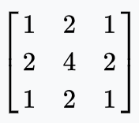

A Gaussian blur matrix

Note: You can find a list of common kernels at https://en.wikipedia.org/wiki/
Kernel_(image_processing)

Here’s a diagram showing how the kernel is applied to two pixels:

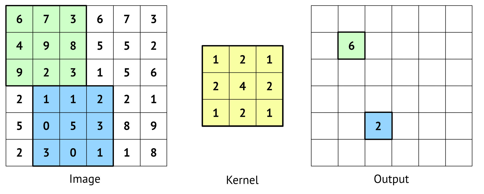

Convolution

And, here’s how the result shown in green was calculated:

(6 * 1  +  7 * 2  +  3 * 1  + 
 4 * 2  +  9 * 4  +  8 * 2  + 
 9 * 1  +  2 * 2  +  3 * 1) / 16 = 6

757

Metal by Tutorials
Chapter 30: Metal Performance Shaders

In this example, 16 represents the weight, and it’s not a randomly chosen number — 
it’s the sum of the numbers from the convolution kernel matrix.

When you need to apply convolution to the border pixels, you can apply padding to 
the input matrix. For example, when the center of a 3×3 convolution kernel overlaps 
with the image element at position (0, 0), the image matrix needs to be padded 
with an extra row and extra column of zeros. However, if the bottom rightmost 
element of the convolution kernel overlaps with the image element at position (0, 
0), the image matrix needs to be padded with two extra rows and two extra columns 
of zeros.

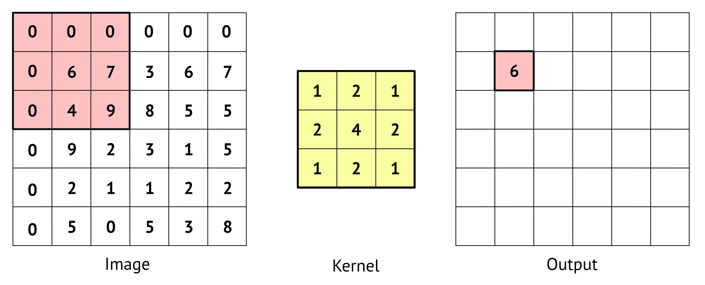

Convolution applied to border pixels

Applying the convolution kernel to an image matrix padded with an extra row, and 
extra column of zeros, gives you this calculation for a 3×3 kernel:

(0 * 1  +  0 * 2  +  0 * 1  + 
 0 * 2  +  6 * 4  +  7 * 2  + 
 0 * 1  +  4 * 2  +  9 * 1) / 9 = 6

In this case, the weight, 9, is the sum of the numbers from the convolution kernel 
matrix that are affecting only the non-zero numbers from the image matrix (4 + 2 
+ 2 + 1). Something like this is straightforward, but when you need to work with 
larger kernels and multiple images that need convolution, this task might become 
non-trivial.

You know how to calculate by hand and apply convolution to an image — and at the 
very beginning of the chapter you saw an MPS filter on an image too — but how 
about using MPS in your engine?

What if you were to implement bloom in your engine?

Guess what? You are going to do just that next!

758

Metal by Tutorials
Chapter 30: Metal Performance Shaders

Bloom

The bloom effect is quite a spectacular one. It amplifies the brightness of objects in 
the scene and makes them look luminous as if they’re emitting light themselves.

Below is a diagram that gives you an overview of how to achieve bloom:

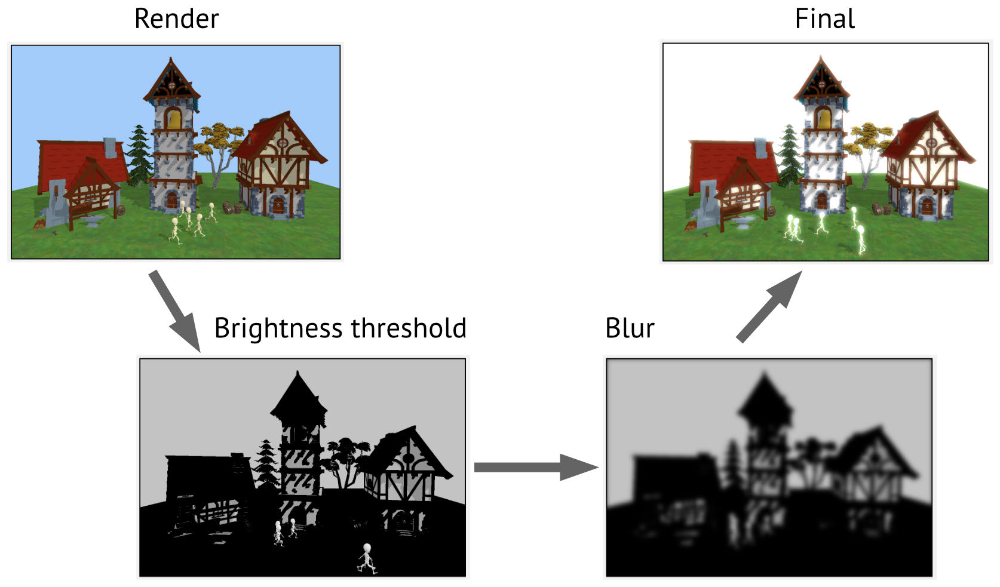

The bloom effect

Here are the steps you’re going to take:

• Render the entire scene to a texture.

• Apply a threshold filter to this texture. This will amplify the lighter parts of the 
image, making them brighter.

• Apply a blur filter to the threshold texture from the previous step.

• Combine this texture with the initial scene for the final image.

759

Metal by Tutorials
Chapter 30: Metal Performance Shaders

The Starter Project

➤ In Xcode, open the starter project for this chapter and build and run the app.

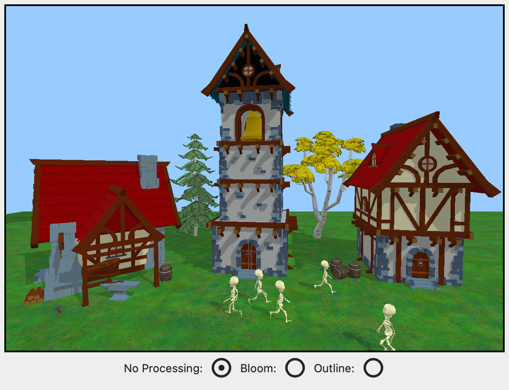

The scene is the same as Chapter 25, “Managing Resources”, complete with marching 
skeletons.

The starter project has a new Post Processing group, already set up with 
Bloom.swift and Outline.swift. In these files, you’ll add some post processing 
filters to the final image.

In the Game group, open Renderer.swift, and locate // Post processing in 
draw(scene:in:). Renderer initializes bloom and outline, and depending on the 
option that the user chooses, runs a post processing effect.

The project currently renders to the view’s drawable texture. Instead of sending this 
texture straight to the screen, you’ll intercept and use the drawable texture as input 
to the threshold filter.

Currently, when you choose Bloom or Outline in the app, a print statement goes to 
the debug console.

760

Metal by Tutorials
Chapter 30: Metal Performance Shaders

Setting Up the Textures

➤ In the Post Processing group, open Bloom.swift, and import the MPS framework:

➤ Define two textures at the top of Bloom:

var outputTexture: MTLTexture! 
var finalTexture: MTLTexture!

outputTexture will hold the blurred threshold texture, and finalTexture will hold 
this texture combined with the initial render.

Renderer calls resize(view:size:) from mtkView(_:drawableSizeWillChange:) 
whenever the window resizes, so this is where you’ll create the textures.

➤ Add the following code to resize(view:size:):

outputTexture = TextureController.makeTexture( 
  size: size, 
  pixelFormat: view.colorPixelFormat, 
  label: "Output Texture", 
  usage: [.shaderRead, .shaderWrite]) 
finalTexture = TextureController.makeTexture( 
  size: size, 
  pixelFormat: view.colorPixelFormat, 
  label: "Final Texture", 
  usage: [.shaderRead, .shaderWrite])

You create the two textures using a method you first created in Chapter 12, “Render 
Passes”. Later, you’ll use them as the destinations of MPS filters, so you mark them 
as writeable.

Image Threshold to Zero

The Metal Performance Shader MPSImageThresholdToZero is a filter that returns 
either the original value for each pixel having a value greater than a specified 
brightness threshold or 0. It uses the following test:

destinationColor = 
  sourceColor > thresholdValue ? sourceColor : 0

This filter has the effect of making darker areas black, while the lighter areas retain 
their original color value.

761

Metal by Tutorials
Chapter 30: Metal Performance Shaders

➤ In postProcess(view:commandBuffer:), replace print("Post processing: 
Bloom") with:

guard 
  let drawableTexture = 
    view.currentDrawable?.texture else { return } 
let brightness = MPSImageThresholdToZero( 
  device: Renderer.device, 
  thresholdValue: 0.5, 
  linearGrayColorTransform: nil) 
brightness.label = "MPS brightness" 
brightness.encode( 
  commandBuffer: commandBuffer, 
  sourceTexture: drawableTexture, 
  destinationTexture: outputTexture)

Here, you create an MPS kernel to create a threshold texture with a custom 
brightness threshold set to 0.5 — where all pixels with less than a color value of 0.5 
will be turned to black. The input texture is the view’s drawable texture, which 
contains the current rendered scene. The result of the filter will go into 
outputTexture. Internally, the MPS kernel samples from drawableTexture, so you 
have to set the view’s drawable to be used for read/write operations.

➤ Open Renderer.swift, and add this to the end of init(metalView:options:):

You need to be able to read and write to the view’s drawable texture. Metal optimizes 
drawable as much as possible, so setting framebufferOnly to false will affect 
performance slightly.

To be able to see the result of this filter, you’ll blit outputTexture back into 
drawable.texture. You should be familiar with the blit command encoder from 
when you copied textures to the heap in Chapter 25, “Managing Resources”

The Blit Command Encoder

➤ Open Bloom.swift, and add this to the end of 
postProcess(view:commandBuffer:):

finalTexture = outputTexture 
guard let blitEncoder = commandBuffer.makeBlitCommandEncoder() 
  else { return } 
let origin = MTLOrigin(x: 0, y: 0, z: 0) 
let size = MTLSize(

762

Metal by Tutorials
Chapter 30: Metal Performance Shaders

width: drawableTexture.width, 
  height: drawableTexture.height, 
  depth: 1) 
blitEncoder.copy( 
  from: finalTexture, 
  sourceSlice: 0, 
  sourceLevel: 0, 
  sourceOrigin: origin, 
  sourceSize: size, 
  to: drawableTexture, 
  destinationSlice: 0, 
  destinationLevel: 0, 
  destinationOrigin: origin) 
blitEncoder.endEncoding()

This copies the output of the previous filter into the drawable texture. Unlike when 
you copied the textures to the heap, you don’t have to worry about slices and 
mipmap levels here.

➤ Build and run the app, and select Bloom.

You’ll now see the texture filtered to grayscale.

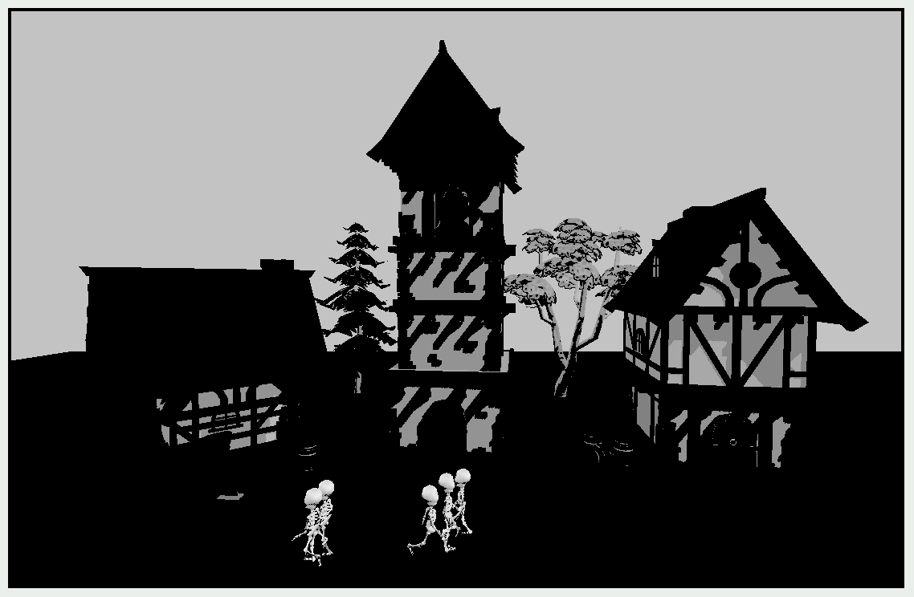

Brightness threshold

Notice how only some of the rendered areas were bright enough to make it to this 
texture. These white areas are all you need to create the bloom effect. Before using 
this texture, you need to add a little fuzziness to it which will make the model edges 
appear to glow. You can accomplish this with another MPS kernel: the Gaussian blur.

Gaussian Blur

MPSImageGaussianBlur is a filter that convolves an image with a Gaussian blur with 
a given sigma value (the amount of blur) in both the X and Y directions.

763

Metal by Tutorials
Chapter 30: Metal Performance Shaders

➤ Still in Bloom.swift, in postProcess(view:commandBuffer:), add the following 
prior to finalTexture = outputTexture:

let blur = MPSImageGaussianBlur( 
  device: Renderer.device, 
  sigma: 9.0) 
blur.label = "MPS blur" 
blur.encode( 
  commandBuffer: commandBuffer, 
  inPlaceTexture: &outputTexture, 
  fallbackCopyAllocator: nil)

In-place encoding is a special type of encoding where, behind the curtains, the 
input texture is processed, stored to a temporary texture and finally written back to 
the input texture without the need for you to designate an output texture.

The fallbackCopyAllocator argument allows you to provide a closure where you 
can specify what will happen to the input image should the in-place normal 
encoding fail.

➤ Build and run the app, and choose Bloom. You’ll see the result of this blur.

Brightness and blur

Image Add

The final part of creating the bloom effect is to add the pixels of this blurred image 
to the pixels of the original render.

MPSImageArithmetic, as its name suggests, performs arithmetic on image pixels. 
Subclasses of this include MPSImageAdd, MPSImageSubtract, MPSImageMultiply and 
MPSImageDivide.

764

Metal by Tutorials
Chapter 30: Metal Performance Shaders

Adding the rendered scene pixels to the lighter blurred pixels will brighten up those 
parts of the scene. In contrast, adding them to the black pixels will leave them 
unchanged.

➤ In postProcess(view:commandBuffer:), replace finalTexture = 
outputTexture with this:

let add = MPSImageAdd(device: Renderer.device) 
add.encode( 
  commandBuffer: commandBuffer, 
  primaryTexture: drawableTexture, 
  secondaryTexture: outputTexture, 
  destinationTexture: finalTexture)

This code adds the drawable texture to outputTexture and places the result in 
finalTexture.

➤ Build and run the app, and choose Bloom. You’ll see this:

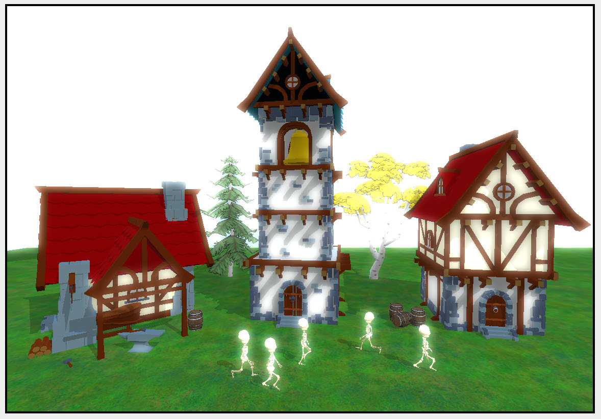

Brightness, blur and add

The entire scene is bathed in a mystical glow. Awesome bloom!

➤ In postProcess(view:commandBuffer:), change the initialization of 
brightness to:

let brightness = MPSImageThresholdToZero( 
  device: Renderer.device, 
  thresholdValue: 0.8, 
  linearGrayColorTransform: nil)

Fewer pixels will make it through the brightness filter.

765

Metal by Tutorials
Chapter 30: Metal Performance Shaders

➤ Build and run the app, and choose Bloom.

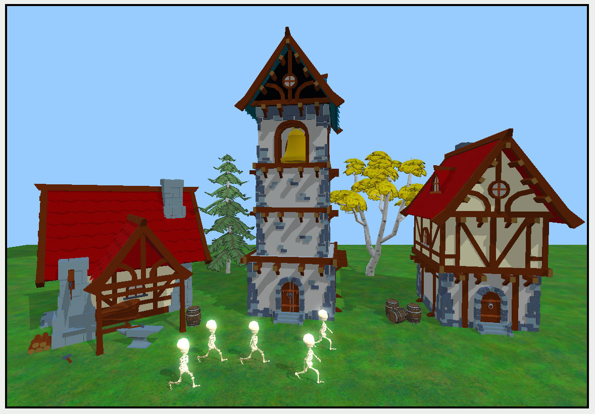

Glowing skeletons

Because the skeletons are the brightest objects in the scene, they appear to glow 
spookily.

Matrix / Vector Mathematics

You learned in the previous section how you could quickly apply a series of MPS 
filters that are provided by the framework. But what if you wanted to make your own 
filters?

You can create your own filter functions and calculate convolutions yourself. 
However, when working with large matrices and vectors, the amount of math 
involved might get overwhelming.

The MPS framework not only provides image processing capability, but it also 
provides functionality for decomposition and factorizing matrices, solving systems 
of equation and multiplying matrices and/or vectors on the GPU in a fast, highly 
parallelized fashion. You’re going to look at matrix multiplication next.

➤ Create a new empty playground for macOS named matrix.playground, and 
replace the code with:

import MetalPerformanceShaders

guard let device = MTLCreateSystemDefaultDevice(), 
      let commandQueue = device.makeCommandQueue() 
else { fatalError() }

let size = 4 
let count = size * size

766

Metal by Tutorials
Chapter 30: Metal Performance Shaders

guard let commandBuffer = commandQueue.makeCommandBuffer() 
else { fatalError() } 
 
commandBuffer.commit() 
commandBuffer.waitUntilCompleted()

This code creates a Metal device, command queue, command buffer and adds a 
couple of constants you’ll need later.

➤ Above the line where you create the command buffer, add a new method that lets 
you create MPS matrices:

func createMPSMatrix(withRepeatingValue: Float) -> MPSMatrix { 
  // 1 
  let rowBytes = MPSMatrixDescriptor.rowBytes( 
    forColumns: size, 
    dataType: .float32) 
  // 2 
  let array = [Float]( 
    repeating: withRepeatingValue, 
    count: count) 
  // 3 
  guard let buffer = device.makeBuffer( 
    bytes: array, 
    length: size * rowBytes, 
    options: []) 
  else { fatalError() } 
  // 4 
  let matrixDescriptor = MPSMatrixDescriptor( 
    rows: size, 
    columns: size, 
    rowBytes: rowBytes, 
    dataType: .float32) 
 
  return MPSMatrix(buffer: buffer, descriptor: matrixDescriptor) 
}

Going through the code:

1. Retrieve the optimal number of bytes between one row and the next. Whereas 
simd matrices expect column-major order, MPSMatrix uses row-major order.

2. Create a new array and populate it with the value provided as an argument to this 
method.

3. Create a new buffer with the data from this array.

4. Create a matrix descriptor; then create the MPS matrix using this descriptor and 
return it.

767

Metal by Tutorials
Chapter 30: Metal Performance Shaders

Use this new method to create and populate three matrices. You’ll multiply A and B 
together, and you’ll place the result in C.

➤ Add the following code just before creating the command buffer:

let A = createMPSMatrix(withRepeatingValue: 3) 
let B = createMPSMatrix(withRepeatingValue: 2) 
let C = createMPSMatrix(withRepeatingValue: 1)

➤ Add this code to create a MPS matrix multiplication kernel:

let multiplicationKernel = MPSMatrixMultiplication( 
  device: device, 
  transposeLeft: false, 
  transposeRight: false, 
  resultRows: size, 
  resultColumns: size, 
  interiorColumns: size, 
  alpha: 1.0, 
  beta: 0.0)

➤ Below the line where you create the command buffer, add the following code to 
encode the kernel:

multiplicationKernel.encode( 
  commandBuffer: commandBuffer, 
  leftMatrix: A, 
  rightMatrix: B, 
  resultMatrix: C)

You multiply A and B together, and you place the result in C.

➤ At the very end of the playground, add this code to read C:

// 1 
let contents = C.data.contents() 
let pointer = contents.bindMemory( 
  to: Float.self, 
  capacity: count) 
// 2 
(0..<count).map { 
  pointer.advanced(by: $0).pointee 
}

768

Metal by Tutorials
Chapter 30: Metal Performance Shaders

Going through the code:

1. Read the result back from the matrix C into a buffer typed to Float, and set a 
pointer to read through the buffer.

2. Create an array filled with the values from the buffer.

➤ Run the playground, and click Show Result on the last line.

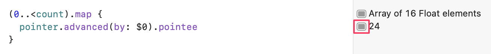

Show result

➤ Right-click on the graph of the results, and choose “Value History”.

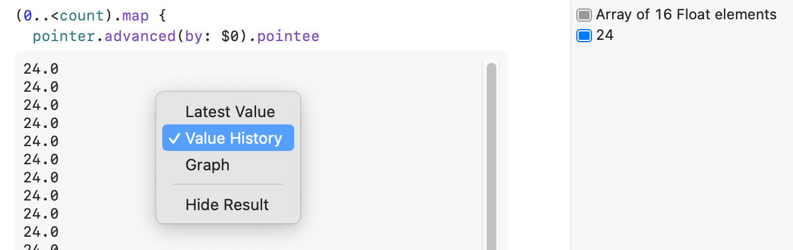

Value history

You’ll see that the array contains 16 values, all of which are the number 24.0. That’s 
because the matrix is of size 4×4, and multiplying one row of A with one column of B 
results in the value 24.0, which is 2×3 added four times.

This is only a small matrix, but you can change the size of the matrix in the size 
variable at the top of the playground, and the matrix multiplication will still be 
blisteringly fast.

769

Metal by Tutorials
Chapter 30: Metal Performance Shaders

Challenge

You may have noticed that in the app where you did the bloom post processing, the 
Outline option does nothing. Your challenge is to fill out Outline.swift so that you 
have an outline render:

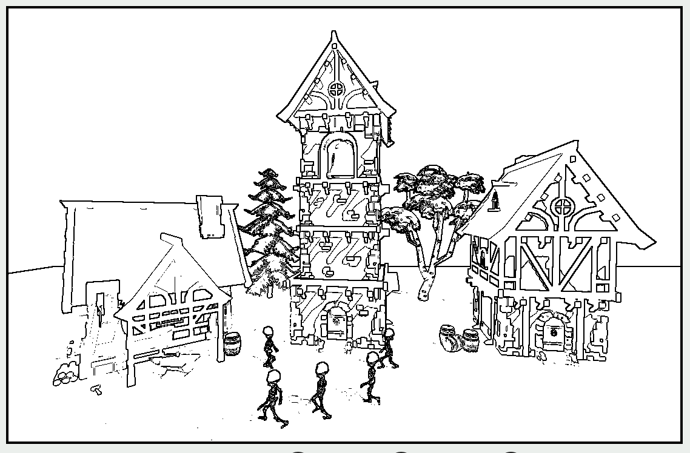

Outline

To achieve this, you’ll first use MPSImageSobel(device:), and then feed the output 
of the sobel filter to 
MPSImageThresholdBinaryInverse(device:thresholdValue:maximumValue:lin
earGrayColorTransform:).

If you have any difficulties, you can review the answer in the challenge folder for this 
chapter.

Key Points

• Metal Performance Shaders are compute kernels that are performant and easy to 
use.

• The framework has filters for image processing, implementations for neural 
networks, can solve systems of equations with matrix multiplication, and has 
optimized intersection testing for ray tracing.

• Convolution takes a small matrix and applies it to a larger matrix. When applied to 
an image, you can blur or sharpen or distort the image.

• Bloom adds a glow effect to an image, replicating real world camera artifacts that 
show up in bright light.

• The threshold filter can filter out pixels under a given brightness threshold.

770

31