# Performance 
Optimization

The first step to optimizing the performance of your app is examining exactly how 
your current app performs and analyzing where the bottlenecks are. The starter app 
provided with this chapter, even with several render passes, runs quite well as is, but 
you’ll study its performance so that you know where to look when you develop real-
world apps.

771

Metal by Tutorials
Chapter 31: Performance Optimization

The Starter App

➤ In Xcode, build and run the starter app for this chapter.

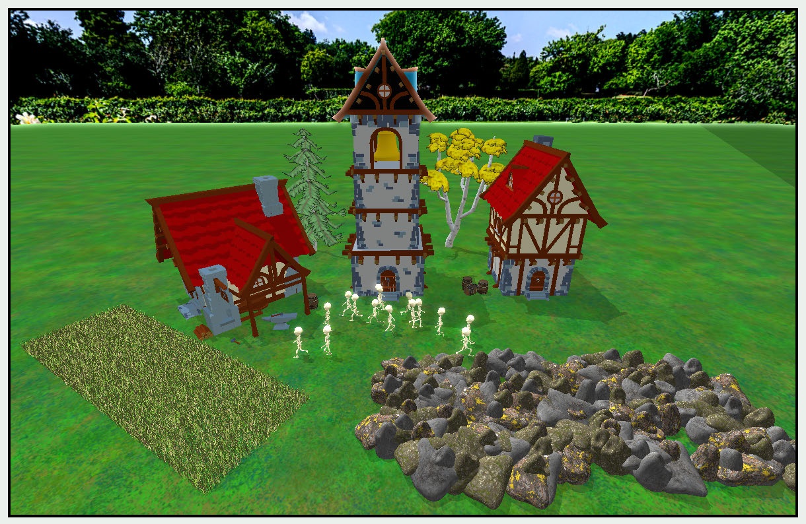

The starter app

There are several render passes involved:

• ShadowRenderPass: Renders models to depth texture.

• ForwardRenderPass: Renders all models aside from rocks and grass.

• NatureRenderPass: Renders rocks and grass.

• SkyboxRenderPass: Renders the skybox.

• Bloom: Post processes the image with bloom.

You may find that the app runs very slowly. On iPad mini 6, it runs at 35 - 40 FPS. 
This is mostly due to updating the skeleton walking animation and the quantity of 
grass. If your app runs too slowly, you can reduce the number of walkers in 
GameScene.

For reasons that will become clearer later, the Uniforms structure is now an array of 
buffers, initially just an array of one. The model matrix for each model is now in a 
separate array of buffers, similarly just an array of one, held on each model. Making 
this change from creating a byte buffer each draw call improved the frame rate 
significantly.

772

Metal by Tutorials
Chapter 31: Performance Optimization

Profiling

There are a few ways to monitor and tweak your app’s performance. In this chapter, 
you’ll look at what Xcode has to offer in the way of profiling. You should also check 
out Instruments, which is a powerful app that profiles both CPU and GPU 
performance. For further information, read Apple’s article Analyzing the 
performance of your Metal app (https://apple.co/36Qs9FY).

GPU History

GPU history is a tool provided by the macOS operating system via its Activity 
Monitor app, so it is not inside Xcode. It shows basic GPU activity in real time for all 
of your GPUs. If you’re using eGPUs, it’ll show activity in there too.

➤ Open Activity Monitor, and from the Window menu, choose GPU History.

A window will pop up containing separate graphs for each GPU, showing the GPU 
usage in real time. You can change how often the graph is updated from the View ▸ 
Update Frequency menu. The graph moves right-to-left at the frequency rate you 
set.

Here’s a screenshot taken from a MacBook Pro with an M1 Max GPU:

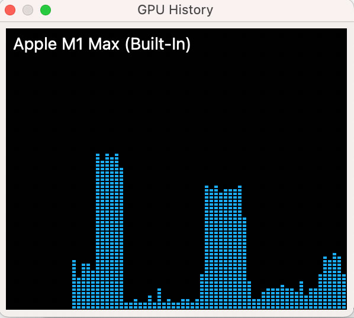

GPU History

You can definitely tell when the app was running. During the profiling time, the app 
was run twice.

The GPU History tool offers a quick way to see overall GPU usage, but it’s not helpful 
with showing GPU usage for individual running apps and processes.

773

Metal by Tutorials
Chapter 31: Performance Optimization

The GPU Report

➤ With your app running, in Xcode on the Debug navigator, click FPS.

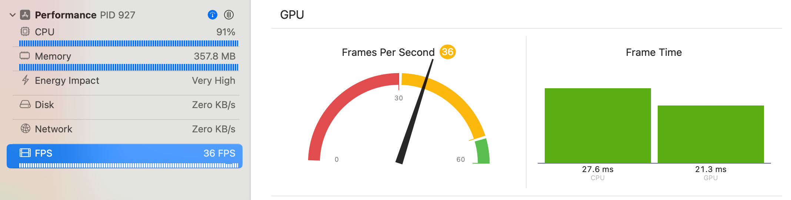

The GPU report

The GPU report shows in the central pane and contains two major GPU metrics.

The first GPU report metric is Frames Per Second, and represents the current frame 
rate of your app. Your target should always be 60 FPS or better. The screenshot shows 
an app running on iPad mini 6. Some compromises on the number of objects 
displayed will have to be made to get it to run at 60 FPS.

The second GPU report metric is Frame Time, and it represents the actual time 
spent processing the current frame on the CPU and the GPU. What’s most important 
here is that the frame does not take longer than 16.6ms which corresponds to 60 
FPS.

Your GPU is not sitting idle, but the frame time is far too high, with more time spent 
on the CPU than the GPU.

GPU Workload Capture

In previous chapters, you captured the GPU workload to inspect textures, buffers and 
render passes. The GPU capture is always the first point of call for debugging. Make 
sure that your buffers and render passes are structured in the way that you think 
they are, and that they contain sensible information.

Next, you’ll look at what else GPU capture can show you.

774

Metal by Tutorials
Chapter 31: Performance Optimization

Summary

➤ With your app running, capture the GPU workload, and in the Debug navigator, 
click Summary.

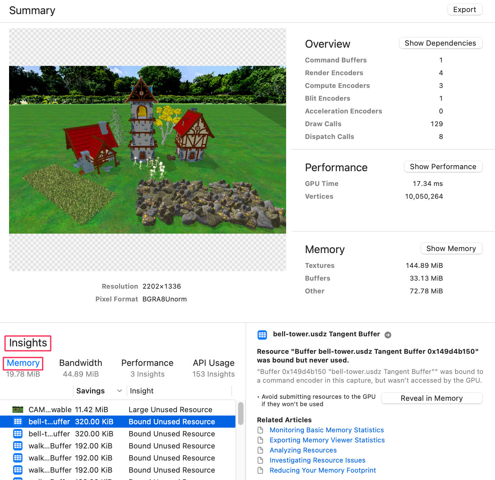

The summary of your frame

You’ll see an overview of your frame. The insights section often contains useful 
insights when you might bind resources on the CPU, but not use them in your 
shaders. The previous image, under Memory, shows a number of bound unused 
resources, most noticeably, the Tangent Buffers.

775

Metal by Tutorials
Chapter 31: Performance Optimization

Note: To take full advantage of the GPU capture, you should add a label to all 
your buffers, so that you can easily track down issues. Tangent Buffer is a 
label added in Mesh.swift.

This insight highlights an error in your app. The app should be using the tangent 
buffer.

➤ In the Shaders group, open Vertex.metal, and locate the assignment to 
worldTangent and worldBitangent.

These assignments are currently set to 0, when they should be using the tangent 
values.

➤ Change the assignments to:

.worldTangent = model->normalMatrix * in.tangent, 
.worldBitangent = model->normalMatrix * in.bitangent,

➤ Build and run the app again, capture the GPU workload and check the Insights 
section.

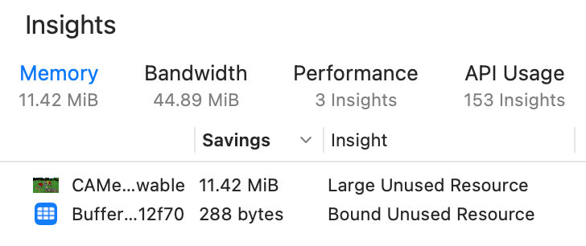

Possible memory issues

The insight issues for the tangent buffers have now gone away. The 288-byte buffer 
is a lights buffer passed in by NatureRenderPass, but the nature shaders don’t use 
the lights. The drawable is used by the Metal Performance Shaders, so there’s 
nothing you can do about that one.

776

Metal by Tutorials
Chapter 31: Performance Optimization

➤ Click the Bandwidth insight.

Bandwidth issues

Depending on your device, you may see different insights. If your device is Apple 
silicon, Insights suggests coalescing encoders. The Forward Render Pass and Nature 
Pass could be rendered using the same render command encoder. The Skybox Render 
Pass stores an unused depth texture.

➤ Open SkyboxRenderPass.swift and, at the top of 
draw(commandBuffer:scene:uniformsBuffer:params:), add this:

You’re now telling the GPU not to store the depth texture for the next render pass.

➤ Build and run and check the Bandwidth Insights again, and the Skybox Render 
Pass warning has gone.

Checking Insights is a great place to start optimizing your app. As another example, 
under API Usage there are a number of redundant bindings. This highlights an error 
during the refactoring of uniforms from a structure to an MTLBuffer. 
uniformsBuffer only needs to be bound per render pass, not per model.

The Shader Profiler

The shader profiler is perhaps the most useful profiling tool for the shader code you 
write. It has nothing to do with the rendering code the CPU is setting up, or the 
passes you run or the resources you’re sending to the GPU. This tool tells you how 
your MSL code is performing line-by-line and how long it took to finish.

777

Metal by Tutorials
Chapter 31: Performance Optimization

Note: The shader profiler shows you the individual line execution times (per-
line cost) on iOS and Apple Silicon devices only.

➤ Build and run the app again — this time on a device with an Apple GPU — and 
capture the GPU workload.

➤ In the Debug navigator, switch to Group by Pipeline State. You can now see how 
much relative time each pipeline took during the frame. The total frame time is 
under Performance.

Note: Your times and percentages will vary depending on your iOS device, 
Xcode and iOS version.

➤ Locate one of the Nature PSOs, open the disclosure and select fragment_nature. 
It’s a good idea to create pipeline state objects with a label in the descriptor so that 
you can find them easily.

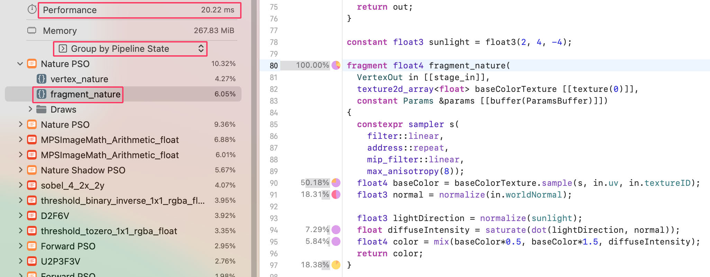

The shader profiler

The Nature PSOs should appear at the top of the list because they are the heaviest 
shaders. With nearly 20% of the timeline rendering rocks and grass, you might 
rethink how much nature you need in the scene.

Drilling down the cost tree, most of the fragment shader execution time is taken by 
the sample function (50%) and the normalize() function (18%).

778

Metal by Tutorials
Chapter 31: Performance Optimization

➤ Hover over the colored pie chart on the left of the function to disclose further 
information.

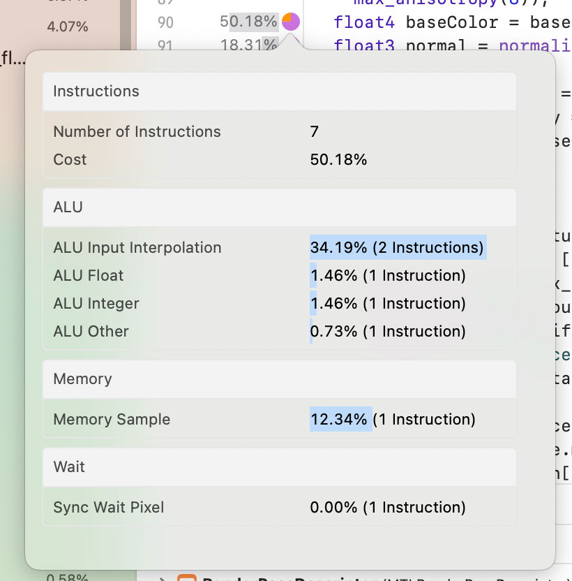

Command Information

Analyze the percentages for each GPU activity. A high number might indicate an 
opportunity for performance optimization.

Here’s an opportunity for optimization using shader profiling. Processing floats 
takes more time than processing other types. As you might know, a half is, well, half 
the size of a float, so you can optimize this one spot.

➤ Change all of the floats to halfs everywhere in fragment_nature, as well as 
inthe sunlight definition line above the fragment_nature. (You’ll have to do 
conversions such as half3 normal = half3(normalize(in.worldNormal));):

constant half3 sunlight = half3(2, 4, -4); 
 
fragment half4 fragment_nature( 
  VertexOut in [[stage_in]], 
  texture2d_array<float> baseColorTexture [[texture(0)]], 
  constant Params &params [[buffer(ParamsBuffer)]]) 
{ 
  constexpr sampler s( 
    filter::linear, 
    address::repeat, 
    mip_filter::linear,

779

Metal by Tutorials
Chapter 31: Performance Optimization

max_anisotropy(8)); 
  half4 baseColor = half4(baseColorTexture.sample(s, in.uv, 
in.textureID)); 
  half3 normal = half3(normalize(in.worldNormal)); 
 
  half3 lightDirection = normalize(sunlight); 
  half diffuseIntensity = saturate(dot(lightDirection, normal)); 
  half4 color = mix(baseColor*0.5, baseColor*1.5, 
diffuseIntensity); 
  return color; 
}

➤ When done, click Reload Shaders.

Reload Shaders

Wait for the profiling to complete and take a look at the result.

This function doesn’t do a lot of processing, so you won’t see much of an 
improvement, but the cost of processing halfs over floats is less, and it’s an easy 
change to make to your shader functions. Other ALU optimizations you can do 
includes replacing ints with shorts, simplifying complex instructions such as 
trigonometry functions (sin, cos, etc.) and other arithmetic calculations.

Note: When you stop the frame capture, you’ll be asked whether to save your 
changes. The saving may not work, so make sure to take a note of what you 
changed and later update Nature.metal manually.

GPU Timeline

The GPU timeline tool gives you an overview of how your vertex, fragment and 
compute functions perform, broken down by render pass.

780

Metal by Tutorials
Chapter 31: Performance Optimization

➤ Build and run the app, and capture the GPU workload with a frame count of 3.

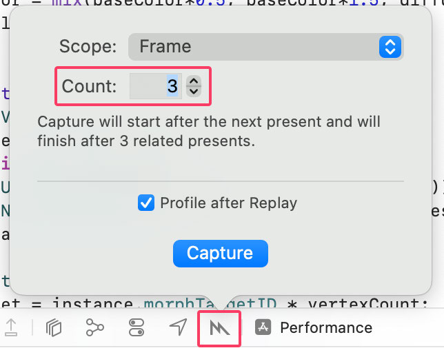

Capture the GPU workload

➤ In the Debug navigator, change Group by Pipeline State to Group by API call, 
and click on Command Buffer.

You’ll see the dependency graph of the first frame, with each render pass texture 
showing how it’s passed on from the previous render pass.

With a few of the Metal Performance passes removed, this is an overview of the 
dependency graph:

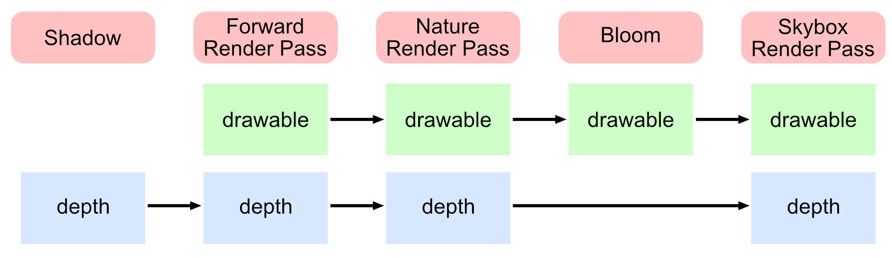

Render Passes

781

Metal by Tutorials
Chapter 31: Performance Optimization

➤ In the Debug navigator, click on Performance.

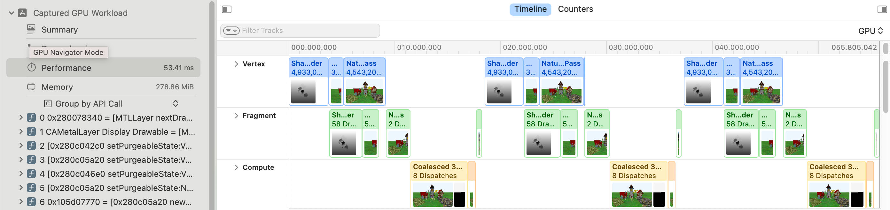

The GPU timeline

You’ll see a track for each of your vertex, fragment and compute shaders, so you can 
visualize where in the timeline your shaders are performed, and how long they take 
to perform. The longest encoders are the Nature Render Pass and the Coalesced 3 
Encoders. The orange compute shaders are the post processing Metal Performance 
Shaders producing bloom effect. Now that you can see how long effects can take, you 
can reconsider whether they are worth the time spent on them.

On Apple GPUs, where you don’t have a dependency, vertex, fragment and compute 
shaders can run in parallel. Unfortunately, when you look at your render passes, each 
render is dependent on the previous drawable, so there are a few gaps in the 
timeline.

➤ Above the Timeline, select Counters.

There are about 150 GPU counters for you to investigate, giving precise timings and 
statistics. For more information on GPU counters, watch the following Apple WWDC 
videos:

• Explore Live GPU Profiling with Metal Counters (https://apple.co/3HrNFxf)

• Optimize Metal apps and games with GPU counters (https://apple.co/3pr1uWC)

782

Metal by Tutorials
Chapter 31: Performance Optimization

➤ In the Counters view, with Encoders and Primitives selected, click on the 
Primitives column so that the column is sorted by the number of primitives in the 
render pass. You can right click the headings to choose which columns to show.

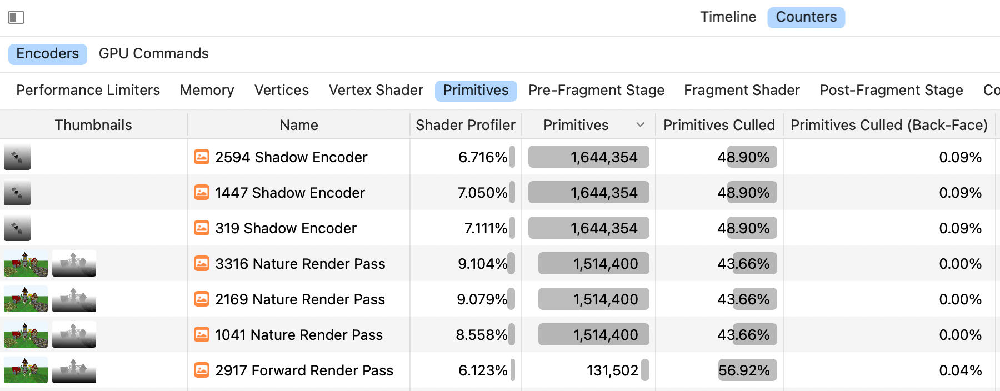

GPU counters

When rendering triangles in your draw calls, faces made up of three vertices are the 
primitives that the GPU counter report is referring to. An easy optimization is to 
cull unwanted faces. Currently, you’re rendering everything, no matter whether the 
camera can see it or not. If you cull back faces, then only the faces pointing toward 
the camera will render.

You might think that you always want to cull back faces, but you do have to be a bit 
selective. For example, the tree leaves in your scene are a one-sided mesh, so if you 
cull the back faces, you won’t see the leaves that are pointing away from you.

➤ In the Game group, open Renderer.swift, and change static var cullFaces = 
false to:

This change will trigger the culling already implemented in your starter app in all 
render passes, except NatureRenderPass.

783

Metal by Tutorials
Chapter 31: Performance Optimization

➤ Build and run the app, capture the GPU workload, return to the Counters view 
above and compare the result.

Face culling implemented

The affected shaders should run a little bit faster, now that you only render about 
half the primitives.

Memory

➤ In the Debug navigator, click the Memory tool (below Performance) to see the 
total memory used and how the various resources are allocated in memory:

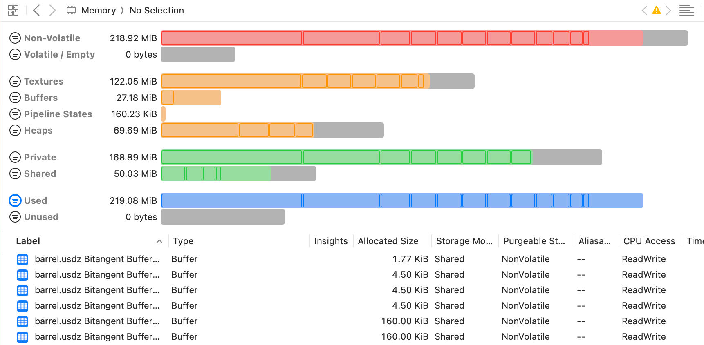

Resources in memory

784

Metal by Tutorials
Chapter 31: Performance Optimization

You’ll see how you can check your heap textures shortly. In the list of buffers in 
memory, you’ll see a lot of duplicated barrel and walker buffers. However, even 
though many nature models are rendered, only one buffer for grass and one for rocks 
is in this list.

Instancing

Currently, you load fifteen skeleton walker meshes and four barrel meshes and draw 
them independently. Reducing the number of draw calls is one of the best ways of 
improving performance. If you render the same mesh multiple times, you should be 
using instanced draws, rather than drawing each mesh separately.

As an example of an instanced system, the app includes a procedural nature system. 
GameScene creates a rock pile of 200 rocks with three random shapes, and three 
random textures. It also creates a grassy patch with 50,000 grass blades, from four 
random shapes and seven random textures.

The Procedural Nature System

Using homeomorphic models, you can choose different shapes for each model. 
Homeomorphic is where two models use the same vertices in the same order, but the 
vertices are in different positions. A famous example of this is Spot the cow by 
Keenan Crane.

Spot by Keenan Crane

Spot is modeled from a sphere by moving vertices, rather than adding them. Because 
the vertices are in the same order as the sphere, the uv coordinates don’t change 
either.

785

Metal by Tutorials
Chapter 31: Performance Optimization

The random shapes for both rocks and grass are modeled in a similar fashion, using 
the same basic shape, then readjusting the vertices for each shape. Each adjusted 
shape is called a morph target.

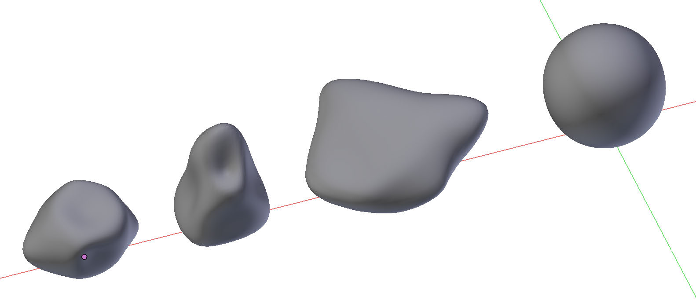

Homeomorphic rocks

For the rocks, Nature loads the three vertex meshes into one buffer, and each rock, 
when initialized, is allocated a random number between 0 and 2. It’s then simple to 
extract the correct mesh from the buffer in the vertex function.

The most important feature of the nature system is that, depending on how powerful 
your device is, it can render numerous instances with one draw call:

encoder.drawIndexedPrimitives( 
   type: .triangle, 
   indexCount: submesh.indexCount, 
   indexType: submesh.indexType, 
   indexBuffer: submesh.indexBuffer.buffer, 
   indexBufferOffset: submesh.indexBuffer.offset, 
   instanceCount: instanceCount)

In Nature.metal, vertex_nature uses the instance_id attribute to extract the 
transform information for the current instance. With the morph target, the vertex 
function renders a random shape. With the texture ID, the fragment function renders 
a random texture.

The files involved in the nature system are:

• Common.h: Contains a NatureInstance structure which holds a random texture 
and shape ID as well as the model and normal matrix.

• Nature.swift: This is in the Geometry group and is a cut-down version of Model. 
It loads up the mesh and creates a buffer that contains an array of 
NatureInstance, one element for each instance.

786

Metal by Tutorials
Chapter 31: Performance Optimization

• Nature.metal: Contains the vertex and fragment functions.

• NatureRenderPass.swift: Renders the scene’s nature array, in the same way as 
ForwardRenderPass.

➤ Examine these files to see how the nature system works. You could create a 
skeleton system in the same way, that draws instanced skeletons.

Removing Duplicate Textures

Textures can use a lot memory, and you should always check that you use the 
appropriate size for the device. Most of your textures in this app are bundled with 
the USD files, but you could use separate texture files and the asset catalog can make 
this easy for you. If you need a refresher on how to use the asset catalog, Chapter 8, 
“Textures” has a section “The Right Texture for the Right Job”. However, you should 
also check that you aren’t duplicating textures.

➤ Build and run the app, and capture the GPU workload.

➤ Under Command Buffer > Forward Render Pass, select useHeap.

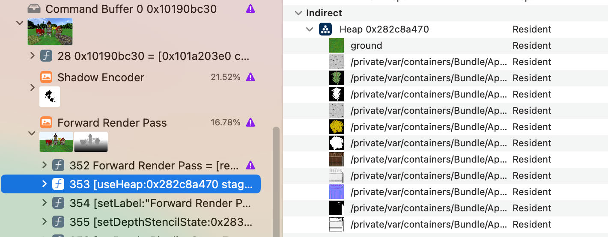

The heap textures

The indirect resources are the textures currently in the heap. You’re already doing a 
great job of reducing the number of textures by checking in TextureController 
whether the named texture already exists. No matter how many barrels you load, 
you’ll only load one set of textures.

787

Metal by Tutorials
Chapter 31: Performance Optimization

There is, however, one texture here that is used by two models. Birch_Bark_1.png is 
used by both the pine tree and the birch tree and is included in both USD files. The 
name of the texture includes the entire path of the asset, so, if your asset pipeline 
allows it, you could just name the texture with the last path component.

Open Submesh.swift and locate MDLMaterial.texture(type). Change name: 
property.textureName) to:

➤ Build and run and check your list of textures again. Capture the GPU workload and 
under Command Buffer > Forward Render Pass, select useHeap.

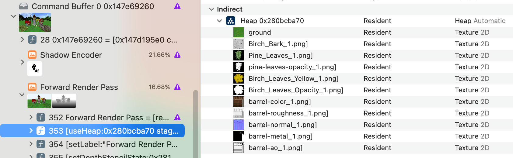

A reduced heap

You’ve reduced the size of the heap by one texture. This may not seem much in this 
app, but if you have a lot of assets that use the same textures, this can contribute to a 
substantial memory / bandwidth gain. Remember to optimize the simple things first, 
because you may discover that you need no further optimization.

You’re in control of your engine. When you design your model loading process, 
ensure that the model structure fits your app. You should be loading all files from a 
file format that best suits your app’s API.

788

Metal by Tutorials
Chapter 31: Performance Optimization

CPU-GPU Synchronization

Managing dynamic data can be a little tricky. Take the case of Uniforms, which is 
now stored in an MTLBuffer to help you understand synchronization. Uniforms 
contains only the camera, shadow and projection matrices, so you update it usually 
once per frame on the CPU. That means that the GPU should wait until the CPU has 
finished writing the buffer before it can read the buffer.

Instead of halting the GPU’s processing, you can simply have a pool of reusable 
buffers.

Triple Buffering

Triple buffering is a well-known technique in the realm of synchronization. The 
idea is to use three buffers at a time. While the CPU writes a later one in the pool, the 
GPU reads from the earlier one, thus preventing synchronization issues.

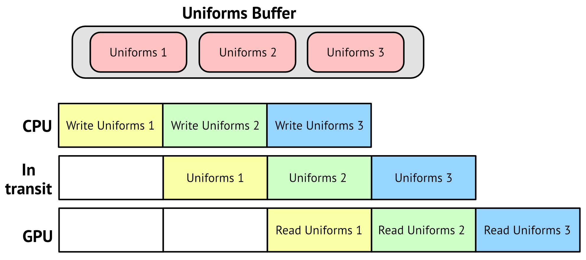

You might ask, why three and not just two or a dozen? With only two buffers, there’s 
a high risk that the CPU will try to write the first buffer again before the GPU 
finished reading it even once. With too many buffers, there’s a high risk of 
performance issues.

789

Metal by Tutorials
Chapter 31: Performance Optimization

➤ Open Renderer.swift.

At the top of the file, you’ll see a global variable which determines the number of 
frames in flight. Frames in flight is a graphics term for how many frames you can 
write to at once. Renderer.currentFrameIndex keeps track of the current frame.

➤ Change let maxFramesInFlight = 1 to:

When the app creates the initial uniforms buffer array, it will now create an array of 
three of them.

➤ Locate Renderer.updateUniforms(scene:) and examine the code. In previous 
chapters you were updating Uniforms, a structure. Now you update the contents of a 
Metal buffer.

➤ At the start of draw(scene:in:), after guard, add this code to update the current 
frame:

Self.currentFrameIndex = 
  (Self.currentFrameIndex + 1) % maxFramesInFlight

Here, you make the index loop around always taking the values 0, 1 and 2.

➤ Build and run the app.

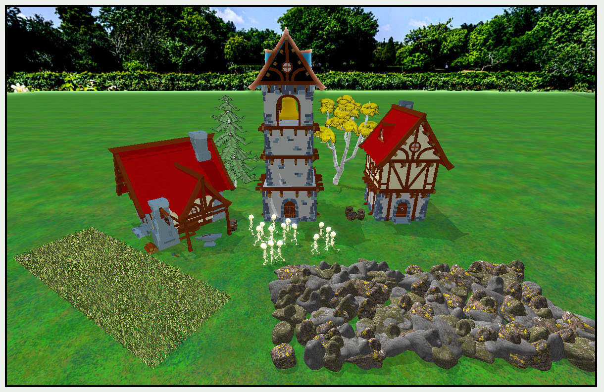

Result of triple buffering

790

Metal by Tutorials
Chapter 31: Performance Optimization

Your app shows the same scene as before.

There is, however, some bad news. The CPU can write to uniforms at any time and 
the GPU can read from it. There’s no synchronization to ensure the correct uniform 
buffer is being read.

This is known as resource contention and involves conflicts, known as race 
conditions, over accessing shared resources by both the CPU and GPU. This can 
cause unexpected results, such as animation glitches.

In the image below, the CPU is ready to start writing the first buffer again. However, 
that would require the GPU to have finished reading it, which is not the case here.

The following example shows two uniform buffers available:

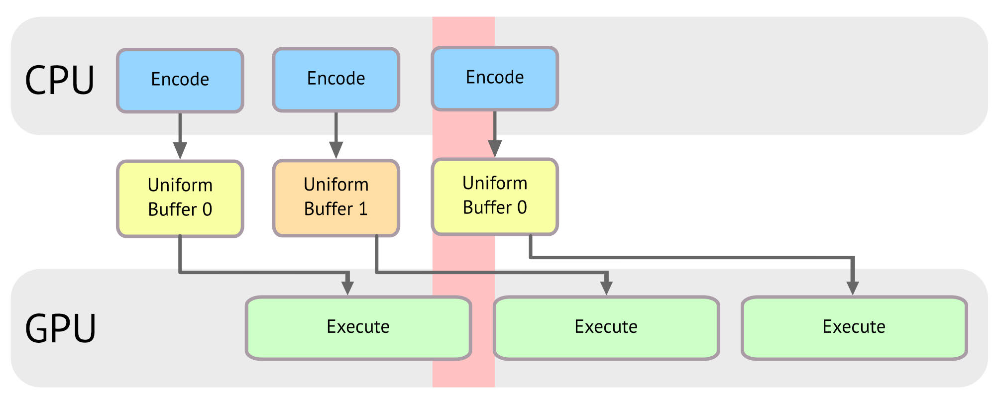

Resource Contention

What you need here is a way to delay the CPU writing until the GPU has finished 
reading it.

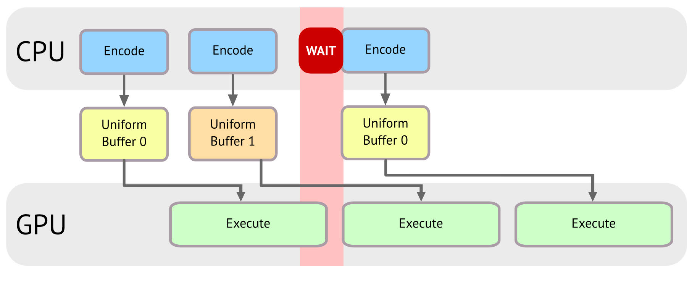

791

Metal by Tutorials
Chapter 31: Performance Optimization

A naive approach is to block the CPU until the command buffer has finished 
executing.

➤ Still in Renderer.swift, add this to the end of draw(scene:in:):

➤ Build and run the app.

You’re now sure that the CPU thread is successfully being blocked, so the CPU and 
GPU are not fighting over uniforms. However, the frame rate has gone way down.

Semaphores

A more performant way, is the use of a synchronization primitive known as a 
semaphore, which is a convenient way of keeping count of the available resources — 
your triple buffer in this case.

Here’s how a semaphore works:

• Initialize it to a maximum value that represents the number of resources in your 
pool (3 buffers here).

• Inside the draw call the thread tells the CPU to wait until a resource is available 
and if one is, it takes it and decrements the semaphore value by one.

• If there are no more available resources, the current thread is blocked until the 
semaphore has at least one resource available.

• When a thread finishes using the resource, it’ll signal the semaphore by increasing 
its value and by releasing the hold on the resource.

792

Metal by Tutorials
Chapter 31: Performance Optimization

Time to put this theory into practice.

➤ At the top of Renderer, add this new property:

➤ In init(metalView:options:), add this before super.init():

➤ Add this at the top of draw(scene:in:):

➤ At the end of draw(scene:in:), but before committing the command buffer, add 
this:

commandBuffer.addCompletedHandler { _ in 
  self.semaphore.signal() 
}

➤ At the end of draw(scene:in:), remove:

➤ Build and run the app again, making sure everything still renders fine as before.

Your frame rate should be back to what it was before. The frame now renders more 
accurately, without fighting over resources.

793

Metal by Tutorials
Chapter 31: Performance Optimization

Key Points

• GPU History, in Activity Monitor, gives an overall picture of the performance of all 
the GPUs attached to your computer.

• The GPU Report in Xcode shows you the frames per second that your app achieves. 
This should be 60 FPS for smooth running.

• Capture the GPU workload for insight into what’s happening on the GPU. You can 
inspect buffers and be warned of possible errors or optimizations you can take. 
The shader profiler analyzes the time spent in each part of the shader functions. 
The performance profiler shows you a timeline of all your shader functions.

• GPU counters show statistics and timings for every possible GPU function you can 
think of.

• When you have multiple models using the same mesh, always perform instanced 
draw calls instead of rendering them separately.

• Textures can have a huge effect on performance. Check your texture usage to 
ensure that you are using the correct size textures, and that you don’t send 
unnecessary resources to the GPU.

794

32