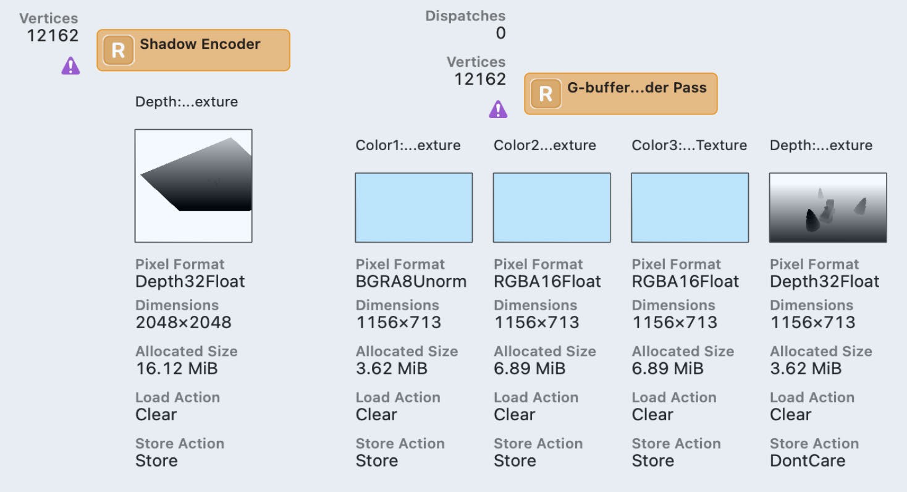
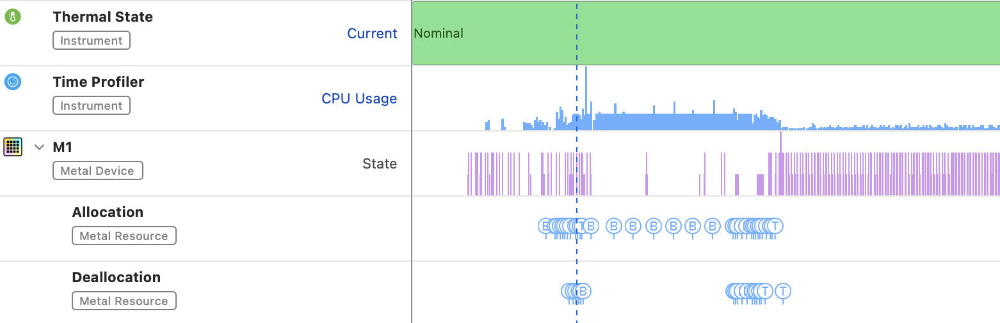
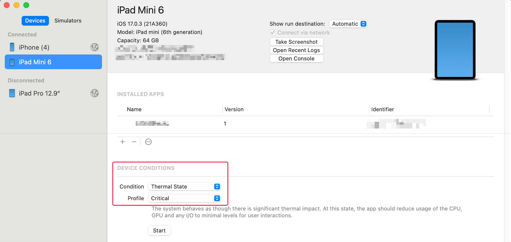
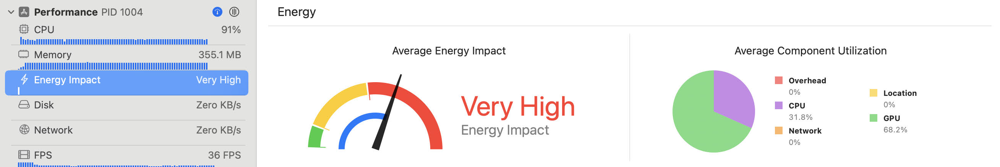
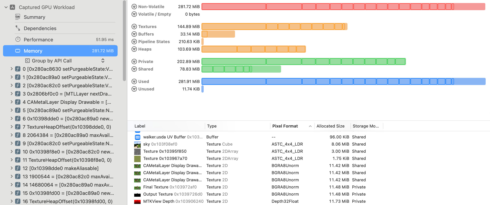
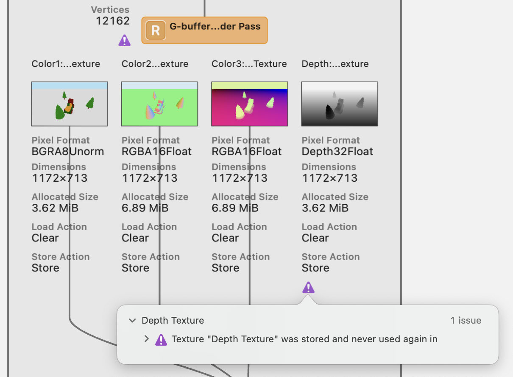

# Best Practices

When you want to squeeze the very last ounce of performance from your app, you 
should always remember to follow a golden set of best practices, which are 
categorized into three major parts: general performance, memory bandwidth and 
memory footprint. This chapter will guide you through all three.

795

Metal by Tutorials
Chapter 32: Best Practices

General Performance Best Practices

The next five best practices are general and apply to the entire pipeline.

Choose the Right Resolution

The game or app UI should be at native or close to native resolution so that the UI 
will always look crisp no matter the display size. Also, it is recommended (albeit not 
mandatory) that all resources have the same resolution. You can check the 
resolutions in the GPU Debugger on the dependency graph. Below is a partial view 
of the dependency graph from the multi-pass render in Chapter 14, “Deferred 
Rendering”:

The dependency graph

Notice the size of the shadow pass render target. For crisper shadows, you should 
have a large texture, but you should consider the performance trade-offs of each 
image resolution and carefully choose the scenario that best fits your app needs.

Minimize Non-Opaque Overdraw

Ideally, you’ll want to only draw each pixel once, which means you’ll want only one 
fragment shader process per pixel. If you were to draw the skybox before rendering 
models, your skybox texture would cover the whole render target texture. Drawing 
the models would then overdraw the skybox fragments with the model fragments. 
This is why you draw opaque meshes from front to back.

796

Metal by Tutorials
Chapter 32: Best Practices

Submit GPU Work Early

You can reduce latency and improve the responsiveness of your renderer by making 
sure all of the off-screen GPU work is done early and is not waiting for the on-screen 
part to start. You can do that by using two or more command buffers per frame:

create off-screen command buffer 
encode work for the GPU 
commit off-screen command buffer 
... 
get the drawable 
create on-screen command buffer 
encode work for the GPU 
present the drawable 
commit on-screen command buffer

Create the off-screen command buffer(s) and commit the work to the GPU as early as 
possible. Get the drawable as late as possible in the frame, and then have a final 
command buffer that only contains the on-screen work.

Stream Resources Efficiently

All resources should be allocated at launch time — if they’re available — because that 
will take time and prevent render stalls later. If you need to allocate resources at 
runtime because the renderer streams them, you should make sure you do that from 
a dedicated thread.

You can see resource allocations in Instruments, in a Metal System Trace, under 
the GPU ➤ Allocation track:

You can see here that there are a few allocations, but all at launch time. If there were 
allocations at runtime, you would notice them later on that track and identify 
potential stalls because of them.

797

Metal by Tutorials
Chapter 32: Best Practices

Design for Sustained Performance

You should test your renderer under a serious thermal state. This can improve the 
overall thermals of the device, as well as the stability and responsiveness of your 
renderer.

Xcode now lets you see and change the thermal state in the Devices window from 
Window ▸ Devices and Simulators.

You can also use Xcode’s Energy Impact gauge to verify the thermal state that the 
device is running at:

Memory Bandwidth Best Practices

Since memory transfers for render targets and textures are costly, the next six best 
practices are targeted to memory bandwidth and how to use shared and tiled 
memory more efficiently.

798

Metal by Tutorials
Chapter 32: Best Practices

Compress Texture Assets

Compressing textures is very important because sampling large textures may be 
inefficient. For that reason, you should generate mipmaps for textures that can be 
minified. You should also compress large textures to accommodate the memory 
bandwidth needs. There are various compression formats available. For example, for 
older devices, you could use PVRTC, and for newer devices, you could use ASTC. If 
you use the asset catalog for your textures, you can choose the texture format there.

With the frame captured, you can use the Metal Memory Viewer to verify 
compression format, mipmap status and size. You can change which columns are 
displayed by right-clicking the column heading:

Some textures, such as render targets, can’t be compressed ahead of time, so you’ll 
have to do it at runtime instead. The good news is the A12 GPU and newer supports 
lossless texture compression, which allows the GPU to compress textures for faster 
access.

Optimize for Faster GPU Access

You should configure your textures correctly to use the appropriate storage mode 
depending on the use case. Use the private storage mode so only the GPU has access 
to the texture data, allowing optimization of the contents:

textureDescriptor.storageMode = .private 
textureDescriptor.usage = [ .shaderRead, .renderTarget ] 
let texture = device.makeTexture(descriptor: textureDescriptor)

799

Metal by Tutorials
Chapter 32: Best Practices

You shouldn’t set any unnecessary usage flags, such as unknown, shaderWrite or 
pixelView, because they may disable compression.

Shared textures that can be accessed by the CPU as well as the GPU should explicitly 
be optimized after any CPU update on their data:

textureDescriptor.storageMode = .shared 
textureDescriptor.usage = .shaderRead 
let texture = device.makeTexture(descriptor: textureDescriptor) 
// update texture data 
texture.replace( 
  region: region, 
  mipmapLevel: 0, 
  withBytes: bytes, 
  bytesPerRow: bytesPerRow) 
let blitCommandEncoder = commandBuffer.makeBlitCommandEncoder() 
blitCommandEncoder 
  .optimizeContentsForGPUAccess(texture: texture) 
blitCommandEncoder.endEncoding()

Again, the Metal Memory Viewer shows you the storage mode and usage flag for all 
textures, along with noticing which ones are compressed textures already, as in the 
previous image.

Choose the Right Pixel Format

Choosing the correct pixel format is crucial. Not only will larger pixel formats use 
more bandwidth, but the sampling rate also depends on the pixel format. You should 
try to avoid using pixel formats with unnecessary channels and also try to lower 
precision whenever possible. You’ve generally been using the RGBA8Unorm pixel 
format in this book. However, when you needed greater accuracy for the G-Buffer in 
Chapter 14, “Deferred Rendering”, you used a 16-bit pixel format. Again, you can use 
the Metal Memory Viewer to see the pixel formats for textures.

Optimize Load and Store Actions

Load and store actions for render targets can also affect bandwidth. If you have a 
suboptimal configuration of your pipelines caused by unnecessary load/store actions, 
you might create false dependencies. An example of optimized configuration would 
be as follows:

renderPassDescriptor.colorAttachments[0].loadAction = .clear 
renderPassDescriptor.colorAttachments[0].storeAction = .dontCare

800

Metal by Tutorials
Chapter 32: Best Practices

In this case, you’re configuring a color attachment to be transient, which means you 
do not want to load or store anything from it. You can verify the current actions set 
on render targets in the Dependency Viewer.

Redundant store action

As you can see, there is an exclamation point that suggests that you should not store 
the last render target.

Optimize Multi-Sampled Textures

iOS devices have very fast multi-sampled render targets (MSAA) because they 
resolve from Tile Memory so it is best practice to consider MSAA over native 
resolution. Also, make sure not to load or store the MSAA texture and set its storage 
mode to memoryless:

textureDescriptor.textureType = .type2DMultisample 
textureDescriptor.sampleCount = 4 
textureDescriptor.storageMode = .memoryless 
let msaaTexture = device.makeTexture(descriptor: 
textureDescriptor) 
renderPassDesc.colorAttachments[0].texture = msaaTexture 
renderPassDesc.colorAttachments[0].loadAction = .clear 
renderPassDesc.colorAttachments[0].storeAction 
= .multisampleResolve

The dependency graph will, again, help you see the current status set for load/store 
actions.

801

Metal by Tutorials
Chapter 32: Best Practices

Leverage Tile Memory

Metal provides access to Tile Memory for several features such as programmable 
blending, image blocks and tile shaders. Deferred shading requires storing the G-
Buffer in a first pass and then sampling from its textures in the second lighting pass 
where the final color accumulates into a render target. This is very bandwidth-heavy.

iOS allows fragment shaders to access pixel data directly from Tile Memory in order 
to leverage programmable blending. This means that you can store the G-Buffer data 
on Tile Memory, and all the light accumulation shaders can access it within the same 
render pass. The four G-Buffer attachments are fully transient, and only the final 
color and depth are stored, so it’s very efficient.

Memory Footprint Best Practices

Use Memoryless Render Targets

As mentioned previously, you should be using memoryless storage mode for all 
transient render targets that do not need a memory allocation, that is, are not loaded 
from or stored to memory:

textureDescriptor.storageMode = .memoryless 
textureDescriptor.usage = [.shaderRead, .renderTarget] 
// for each G-Buffer texture 
textureDescriptor.pixelFormat = gBufferPixelFormats[i] 
gBufferTextures[i] = 
  device.makeTexture(descriptor: textureDescriptor) 
renderPassDescriptor.colorAttachments[i].texture = 
  gBufferTextures[i] 
renderPassDescriptor.colorAttachments[i].loadAction = .clear 
renderPassDescriptor.colorAttachments[i].storeAction = .dontCare

You’ll be able to see the change immediately in the dependency graph.

802

Metal by Tutorials
Chapter 32: Best Practices

Avoid Loading Unused Assets

Loading all the assets into memory will increase the memory footprint, so you 
should consider the memory and performance trade-off and only load all the assets 
that you know will be used. The GPU frame capture Memory Viewer will show you 
any unused resources.

Use Smaller Assets

You should only make the assets as large as necessary and consider the image quality 
and memory trade-off of your asset sizes. Make sure that both textures and meshes 
are compressed. You may want to only load the smaller mipmap levels of your 
textures or use lower level of detail meshes for distant objects.

Simplify memory-intensive effects

Some effects may require large off-screen buffers, such as Shadow Maps and Screen 
Space Ambient Occlusion, so you should consider the image quality and memory 
trade-off of all of those effects, potentially lower the resolution of all these large off-
screen buffers and even disable the memory-intensive effects altogether when you 
are memory constrained.

Use Metal Resource Heaps

Rendering a frame may require a lot of intermediate memory, especially if your game 
becomes more complex in the post-process pipeline, so it is very important to use 
Metal Resource Heaps for those effects and alias as much of that memory as possible. 
For example, you may want to reutilize the memory for resources that have no 
dependencies, such as those for Depth of Field or Screen-Space Ambient Occlusion.

Another advanced concept is that of purgeable memory. Purgeable memory has three 
states: non-volatile (when data should not be discarded), volatile (data can be 
discarded even when the resource may be needed) and empty (data has been 
discarded). Volatile and empty allocations do not count towards the application’s 
memory footprint because the system can either reclaim that memory at some point 
or has already reclaimed it in the past.

803

Metal by Tutorials
Chapter 32: Best Practices

Mark Resources as Volatile

Temporary resources may become a large part of the memory footprint and Metal 
will allow you to set the purgeable state of all the resources explicitly. You will want 
to focus on your caches that hold mostly idle memory and carefully manage their 
purgeable state, like in this example:

// for each texture in the cache 
texturePool[i].setPurgeableState(.volatile) 
// later on... 
if (texturePool[i].setPurgeableState(.nonVolatile) == .empty) { 
  // regenerate texture 
}

Manage the Metal PSOs

Pipeline State Objects (PSOs) encapsulate most of the Metal render state. You create 
them using a descriptor that contains vertex and fragment functions as well as other 
state descriptors. All of these will get compiled into the final Metal PSO.

Metal allows your application to load most of the rendering state upfront, improving 
the performance over OpenGL. However, if you have limited memory, make sure not 
to hold on to PSO references that you don’t need anymore. Also, don’t hold on to 
Metal function references after you have created the PSO cache because they are not 
needed to render; they are only needed to create new PSOs.

Note: Apple has written a Metal Best Practices guide (https://
developer.apple.com/library/archive/documentation/3DDrawing/Conceptual/
MTLBestPracticesGuide/index.html) that provides great advice for optimizing 
your app.

804

Metal by Tutorials
Chapter 32: Best Practices

Where to Go From Here?

Getting the last ounce of performance out of your app is paramount. You’ve had a 
taste of examining CPU and GPU performance using Xcode, but to go further, you’ll 
need to use Instruments with Apple’s Instruments documentation (https://
help.apple.com/instruments/mac/10.0/).

Over the years, at every WWDC since Metal was introduced, Apple has produced 
some excellent WWDC videos describing Metal best practices and optimization 
techniques. Go to https://developer.apple.com/videos/graphics-and-games/metal/ 
and watch as many as you can, as often as you can.

Congratulations on completing the book! The world of Computer Graphics is vast 
and as complex as you want to make it. But now that you have the basics of Metal 
learned, even though current internet resources are few, you should be able to learn 
techniques described with other APIs such as OpenGL, Vulkan and DirectX. If you’re 
keen to learn more, check out the great books in the resources folder for this chapter.

805

33

Conclusion

Thank you again for purchasing Metal by Tutorials. If you have any questions or 
comments as you continue to develop for Metal, please stop by our forums at https://
forums.kodeco.com.

Your continued support is what makes the tutorials, books, videos and other things 
we do at Kodeco possible. We truly appreciate it.

Best of luck in all your development and game-making adventures,

– Caroline Begbie (Author), Marius Horga (Author), Adrian Strahan (Tech Editor) and 
Tammy Coron (FPE).

The Metal by Tutorials team

806

